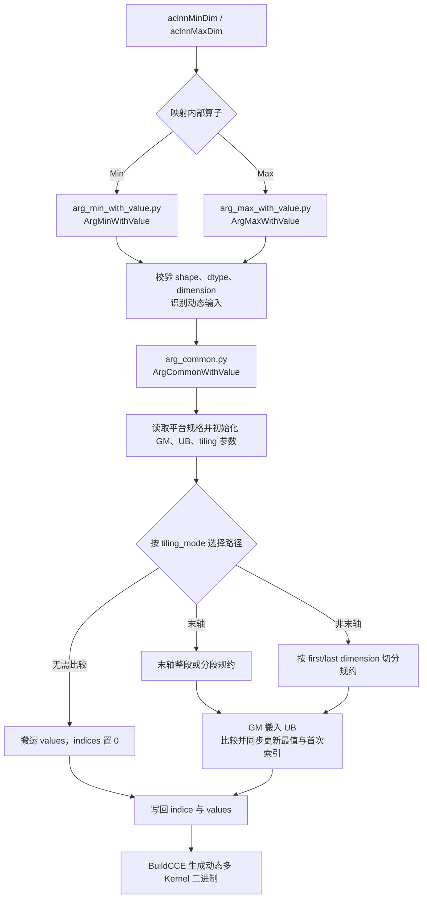
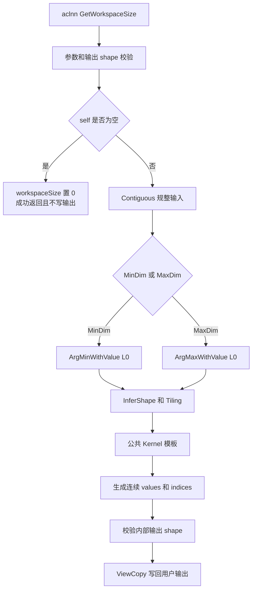
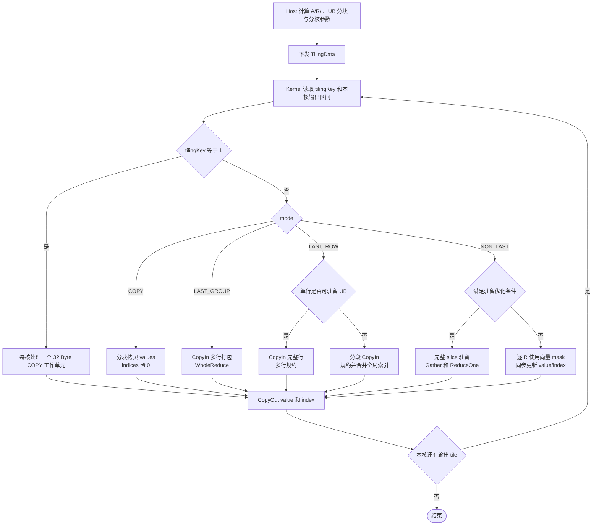

# MinDim & MaxDim 算子设计说明书

## 一、需求背景

### 1.1 需求来源

本需求在 Atlas A2/A3 系列产品上，使用 Ascend C 实现 `aclnnMinDim` 与 `aclnnMaxDim`。两个接口沿指定维度同时返回极值和极值在该维度上的索引，功能、精度及特殊值语义以 CANN 内置算子为基线。

交付范围包括算子工程、公开 aclnn 接口、功能与精度测试、性能对比、调用示例、README、自验证报告及本设计文档。

### 1.2 目标与验收口径

| 项目 | 要求 |
| --- | --- |
| 产品 | Atlas A2/A3 系列 |
| 输入/值输出 dtype | `float16`、`float32`、`bfloat16`、`int16` |
| 索引 dtype | `int32` |
| 格式与维度 | ND，rank 为 1～8 |
| 属性 | `dim ∈ [-rank, rank)`，`keepdim=true/false` |
| Tensor 连续性 | 支持公共组件可处理的合法非连续 `self`、`out`、`indices` |
| 精度 | AscendOpTest 默认精度标准 |
| 性能 | 以官方 msprof Task Duration 为准；平台全部 AIV 核参与计算时，常规配对项不低于 builtin 的 95% |
| 小算子说明 | builtin 小于 10 μs 且绝对差不超过 3 μs 时，标记为小任务例外 |

### 1.3 TBE 基线来源与实现现状

本任务中的 `aclnnMinDim`、`aclnnMaxDim` 为对外接口，对应的 TBE 内部算子分别为 `ArgMinWithValue`、`ArgMaxWithValue`。以下以 `$CANN_ROOT` 表示 CANN Toolkit 安装目录；标准安装路径通常为 `/usr/local/Ascend/ascend-toolkit/latest`。

| 参考内容 | 文件路径 | 核对要点 |
| --- | --- | --- |
| Min TBE 入口 | `$CANN_ROOT/opp/built-in/op_impl/ai_core/tbe/impl/ops_legacy/dynamic/arg_min_with_value.py` | 注册 `ArgMinWithValue`，创建 `ArgMinWithValue(ArgCommonWithValue)`，以 `is_min=true` 进入公共实现 |
| Max TBE 入口 | `$CANN_ROOT/opp/built-in/op_impl/ai_core/tbe/impl/ops_legacy/dynamic/arg_max_with_value.py` | 注册 `ArgMaxWithValue`，创建 `ArgMaxWithValue(ArgCommonWithValue)`，以 `is_min=false` 进入公共实现 |
| TBE 公共实现 | `$CANN_ROOT/opp/built-in/op_impl/ai_core/tbe/impl/ops_legacy/dynamic/arg_common.py` | GM/UB 初始化、动态 tiling、多核切分、末轴/非末轴规约以及 `indice/values` 写回 |
| 算子原型 | `$CANN_ROOT/opp/built-in/op_graph/inc/ops_proto_math.h` | 核对 `ArgMinWithValue`、`ArgMaxWithValue` 的输入、两个输出及 `dimension/keep_dims/indice_dtype` 属性 |
| 算子信息库 | `$CANN_ROOT/opp/built-in/op_impl/ai_core/tbe/config/ascend910b/aic-ascend910b-ops-info-legacy.json` | 核对同名算子的注册项、dtype/format、动态 shape 和动态 rank 能力 |
| 公开 aclnn 接口文档 | `ops-math/math/arg_min_with_value/docs/aclnnMinDim.md`、`ops-math/math/arg_max_with_value/docs/aclnnMaxDim.md` | 确认两段式函数名、公开参数顺序、`out/indices` 语义及非连续 Tensor 能力 |

`aclnnMinDim(self, dim, keepdim, out, indices)` 与内部 `ArgMinWithValue(x, indice, values, dimension, ...)` 的输出顺序不同，`aclnn` 层将内部 `(indice, values)` 映射为公开 `(out, indices)`；Max 路径同理。

TBE 源码的主要生成与执行逻辑如下：



### 1.4 数学语义与 A/R/I 统一模型

输入 shape 为 `S=(s0,s1,...,s(n-1))`。负轴归一化后得到 `d`，并定义：

$$
A=\prod_{k<d}s_k,\qquad R=s_d,\qquad I=\prod_{k>d}s_k.
$$

空乘积取 1。连续 ND 输入可视为 `[A,R,I]`，逻辑地址与输出地址分别为：

$$
input(a,r,i)=(aR+r)I+i,\qquad output(a,i)=aI+i.
$$

输出元素数为 `O=A×I`。当 `keepdim=false` 时删除第 `d` 维；当 `keepdim=true` 时将该维改为 1。`values` 与 `indices` shape 完全相同。

对每个 `(a,i)`：

- MinDim 返回 `R` 维上的最小值及索引；
- MaxDim 返回 `R` 维上的最大值及索引；
- 普通相等值保留最小索引；
- 浮点切片含 NaN 时返回 NaN，并返回最先出现的 NaN 索引；
- 同时出现 `+0` 和 `-0` 时，MinDim 选择 `-0`，MaxDim 选择 `+0`；同符号零仍保留最小索引；
- 不承诺保留 NaN payload 的原始比特，值正确性按“结果为 NaN”判定。

## 二、需求分析

### 2.1 外部依赖

| 组件 | 用途 |
| --- | --- |
| Ascend C Kernel API | GM/UB 搬运、向量比较、归约、Cast、事件同步 |
| op_host 框架 | OpDef、InferShape、平台信息、TilingData 下发 |
| aclnn/opdev 公共件 | 参数校验、`Contiguous`、`ViewCopy`、executor 与 workspace |
| ops-math 测试框架 | Host UT、Kernel ST、aclnn 测试、golden 与性能测试 |
| CANN 内置 TBE 算子 | 功能、特殊值及 FP16/FP32/BF16 性能基线；INT16 无可用性能基线，标记 N/A |

不引入第三方运行时依赖。

### 2.2 模块划分

MinDim 与 MaxDim 仅比较方向不同，公共逻辑放在 Max 目录，Min 通过工程依赖复用；模块按公共实现与 Min/Max 独立入口分层，避免比较方向之外的逻辑重复。

| 模块 | 实现职责 |
| --- | --- |
| `arg_max_with_value/op_host/arg_with_value_tiling.h` | A/R/I 计算、模式选择、UB 预算、多核划分 |
| `arg_max_with_value/op_kernel/arg_with_value_kernel.h` | 公共模板 `KernelArgWithValue<T, IS_MAX>` |
| `arg_max_with_value/op_kernel/arg_with_value_tiling_data.h` | 四种运行模式及 TilingData |
| `arg_max_with_value/op_host/arg_with_value_infershape.h` | 公共输出 shape 推导 |
| `arg_max_with_value/op_api/arg_with_value_aclnn_common.h` | 公共 aclnn 参数校验 |
| `arg_min_with_value` / `arg_max_with_value` | 独立 OpDef、Kernel 入口及公开 aclnn 接口 |
| `arg_min_with_value/CMakeLists.txt` | 声明对 `arg_max_with_value` 的实现依赖 |

### 2.3 对外接口

两算子均采用 aclnn 两段式接口：

```cpp
aclnnStatus aclnnMinDimGetWorkspaceSize(
    const aclTensor* self, int64_t dim, bool keepdim,
    aclTensor* out, aclTensor* indices,
    uint64_t* workspaceSize, aclOpExecutor** executor);
aclnnStatus aclnnMinDim(
    void* workspace, uint64_t workspaceSize,
    aclOpExecutor* executor, aclrtStream stream);

aclnnStatus aclnnMaxDimGetWorkspaceSize(
    const aclTensor* self, int64_t dim, bool keepdim,
    aclTensor* out, aclTensor* indices,
    uint64_t* workspaceSize, aclOpExecutor** executor);
aclnnStatus aclnnMaxDim(
    void* workspace, uint64_t workspaceSize,
    aclOpExecutor* executor, aclrtStream stream);
```

| 参数 | I/O | 约束 |
| --- | --- | --- |
| `self` | 输入 | Device Tensor，支持四种 value dtype，可非连续 |
| `dim` | 输入 | `int64_t`，范围 `[-rank,rank)` |
| `keepdim` | 输入 | `bool` |
| `out` | 输出 | dtype 与 `self` 相同，shape 按 `keepdim` 推导，可非连续 |
| `indices` | 输出 | `int32`，shape 与 `out` 相同，可非连续 |
| `workspaceSize/executor` | 输出 | 第一阶段生成执行计划及其 workspace 大小 |
| `workspace/stream` | 输入 | 第二阶段执行所需资源 |

内部 OpDef 输出顺序是 `(indice, values)`，公开接口顺序是 `(out, indices)`；L2 层显式完成对应关系。

### 2.4 内部原型

内置 `ArgMinWithValue` 与 `ArgMaxWithValue` 的内部原型一致：

| 项 | 定义 |
| --- | --- |
| 输入 `x` | `float16`、`float32`、`bfloat16`、`int32`、`int64`，ND |
| 输出 `indice` | `int32` 或 `int64`，ND |
| 输出 `values` | 与 `x` 同 dtype，ND |
| `dimension` | 必选 int 属性 |
| `keep_dims` | 可选 bool，默认 false |
| `indice_dtype` | 可选 `Type`，支持 `DT_INT32`、`DT_INT64`，默认 `DT_INT32` |
| 动态能力 | dynamic rank、dynamic shape |
| SoC 配置 | `ascend910b`、`ascend910_93` |

本次 Ascend C 实现的索引输出类型为 `int32`。

## 三、需求详细设计

### 3.1 AscendC 总体实现流程



L2 先将输入连续化，因此 Kernel 只处理连续 ND；`ViewCopy` 将连续内部结果写回用户的连续或非连续输出。第一阶段返回 executor 聚合后的 workspace 大小，不能假定恒为 0。

空 Tensor 走 aclnn 空输入快捷路径，但快捷返回发生在 dtype、rank、dim、归约长度以及 `out/indices` 期望 shape 全部校验之后。校验成功后返回 `workspaceSize=0`，不创建 L0 任务，也不写 `out/indices`。L0/Tiling 对 `R=0` 另设 `outputSize=0` 的单核 no-op，保证图模式入口安全。

### 3.2 参数、Shape 与边界校验

公开接口执行以下校验：

1. `self`、`out`、`indices`、`workspaceSize`、`executor` 非空；
2. `self` dtype 属于支持集合，`out` 与 `self` 同 dtype；
3. `indices` dtype 为 `int32`；
4. rank 在 1～8，`dim` 在 `[-rank,rank)`；
5. 归约长度 `R` 在 `[0, INT32_MAX]`，确保索引可表示；
6. 按 `keepdim` 推导并校验用户 `out/indices` shape，空输入也执行该校验；非空输入创建 L0 结果后再校验内部结果与用户输出一致。

Tiling 使用存储 shape 计算 A/R/I，对维度乘积执行 `uint64` 溢出检查，并拒绝负维度、平台 UB/AIV 信息异常以及 UB 不足。

InferShape 复用 reduce shape 工具：`keep_dims=true` 将归约轴置 1，否则删除归约轴；`indice` shape 复制 `values` shape。

### 3.3 TilingData 与 UB 预算

Tiling key 0 承载四种通用运行模式，具体分支由 `mode` 字段选择；当 COPY 恰好满足每核一个 32 Byte 工作单元时，Tiling key 1 进入无 tiling 读取的专用 Kernel。通用路径实际下发结构为：

```cpp
struct ArgWithValueTilingData {
    uint64_t outerSize;
    uint64_t reduceSize;
    uint64_t innerSize;
    uint64_t outputSize;
    uint32_t tileSize;
    uint32_t groupRows;
    uint32_t inputRowElems;
    uint32_t mode;
};
```

Kernel 不采用所有模式共用的最大缓冲布局，而是按 `mode` 和输入 dtype 只分配实际使用的 TBuf。设 `S=sizeof(T)`，可变长缓冲的每元素预算为：

| mode | FP32 输入 | FP16/BF16/INT16 输入 | 固定额外缓冲 |
| --- | ---: | ---: | ---: |
| COPY | `S+4` | `S+4` | 0 |
| LAST_GROUP | `S+4×4` | `S+5×4` | 0 |
| LAST_ROW | `S+1×4` | `S+2×4` | 2560 Byte |
| NON_LAST | `S+7×4` | `S+7×4` | 0 |

LAST_ROW 的 2560 Byte 固定区用于 128 行批量结果：512 Byte value、512 Byte index、512 Byte Gather offset，以及 1024 Byte 连续 `[value,index]` pair。该固定区由保守预留的 2/5 UB 容纳，不计入随 `tileSize` 线性增长的预算。

Host 使用 UB 的 3/5 和当前模式的 `B_mode` 计算容量，并按 64 个元素向下对齐：

$$
tileSize=\operatorname{AlignDown}_{64}
\left(\left\lfloor\frac{UB\times3/5}{B_{mode}}\right\rfloor\right).
$$

末轴批归约额外计算：

$$
rowBytes=\operatorname{AlignUp}_{32}(R\times sizeof(T)),\qquad
inputRowElems=rowBytes/sizeof(T),
$$

$$
groupRows=\max\left(1,\min\left(255,\left\lfloor
\frac{tileSize}{inputRowElems}\right\rfloor\right)\right).
$$

`tileSize` 必须不小于 64。Kernel 的计算与输出缓冲按单缓冲复用，通过事件和 `PipeBarrier` 保证跨流水安全；FP16 LAST_GROUP 为连续批次输入保留两个 input 区域，其余模式不为流水统一扩张为双缓冲。

### 3.4 AscendC Kernel 实现流程与运行模式

| mode | 命中条件 | 核心算法 | 主要收益 |
| --- | --- | --- | --- |
| `COPY=0` | `R=1`；`R=0` 时为 no-op | values 直接搬运，indices 填 0 | 消除无效归约 |
| `LAST_GROUP=1` | `I=1` 且 `2≤R≤64` | 多行打包，`WholeReduceMin/Max` 一次处理一行 | 提高短末轴的向量利用率 |
| `LAST_ROW=2` | `I=1` 且 `R>64` | 可驻留 UB 时多行归约并批量写回；超 UB 时分段归约、标量合并 | 同时优化常规长末轴和超 UB 长轴 |
| `NON_LAST=3` | `I>1` 且 `R>1` | 通用向量 mask 路径；窄 FP32 驻留切片使用逐列 Gather + ReduceOne | 兼顾一般 shape 与短列全核场景 |

下图为 AscendC Kernel 侧实现流程。Host 先根据 `A/R/I`、UB 容量和平台核数生成 TilingData；Kernel 再按 `tilingKey/mode` 进入对应路径。各路径均遵循 `CopyIn → Compute → CopyOut`，Min/Max 仅通过编译期比较方向区分。



#### 3.4.1 COPY

对本核负责的输出区间分 tile 搬运输入到 values，并将同区间 indices 填 0。`R=1` 时连续输入的展平顺序与输出完全相同。`R=0` 的 `outputSize` 为 0，Kernel 不进入处理循环。

#### 3.4.2 LAST_GROUP

每批搬入 `groupRows` 行，单行按 32 Byte 补齐到 `inputRowElems`。FP32 输入直接把输入 UB 重解释为计算 Tensor，其余 dtype 转为 FP32。`WholeReduceMin/Max` 使用 `ReduceOrder::ORDER_VALUE_INDEX`，为每行产生连续的 `[value,index]` 对。

LAST_GROUP 使用原生 WholeReduce 产生 value/index pair；普通 tie、NaN 和有符号零语义已由专项用例验证。Kernel 用 `ArithProgression+Gather` 分离 pair 的偶数 value lane 和奇数 index lane，再批量写回，避免逐行标量拆包。

#### 3.4.3 LAST_ROW

LAST_ROW 以最多 128 个输出行为一个写回批次，并根据一行补齐后的长度选择两条路径：

- `inputRowElems≤tileSize`：每次用 `CopyInRows` 搬入尽可能多的完整行，对每行调用一次带索引 `ReduceMin/Max`，把连续 `[value,index]` pair 暂存在批次缓冲中；批次归约完成后用 `ArithProgression+Gather` 分离 value/index，并一次批量写回最多 128 行。
- `inputRowElems>tileSize`：单行按 `tileSize` 从低地址到高地址分段，段内调用原生带索引 Reduce，标量读取各段 pair 后合并；仍在 128 行批次缓冲中集中写回结果。

LAST_ROW 需通过段内首个 tie、首个 NaN 和有符号零专项用例验证原生 Reduce 语义。超 UB 的段间合并只在值严格更优或零符号优先级更高时更新，普通 tie 保留较早段索引；第一个含 NaN 的段胜出，后续 NaN 不覆盖它。全局索引由段起点与段内索引相加得到。

#### 3.4.4 NON_LAST

输出 tile 不跨越 I 边界。通用路径先以 `r=0` 初始化 best value 和索引 0，再依次处理 `r=1...R-1` 的连续 I 切片：

1. 向量 `Min/Max(best,candidate)` 得到 chosen；
2. 用 chosen 与 best 的原始 32 位差异生成 packed 更新 mask，保证普通相等不更新，而有符号零偏好变化会同步更新索引；
3. 浮点路径把 `candidate!=candidate` 的 NaN mask 并入更新条件，再与 `best==best` 相与，使第一个 NaN 一旦成为 best 就不被覆盖；
4. 用同一个 packed mask 执行两次 `Select`，同步更新 value 与 index；
5. best 继续参与下一次 R 迭代。

packed mask 以 `uint8_t` 形式供 `Select` 使用；A2 的 `Xor` 为逻辑语义，因此谓词组合采用 INT16 lane 位运算。输出 tile 不跨 I 边界，尾部按 64 lane 补齐计算但只写真实元素。

当一个完整 I 切片归属于当前 tile、`R×I≤tileSize`，且单行 `I×sizeof(T)` 按 32 Byte 对齐时，整个 `[R,I]` 切片一次搬入 UB，通用路径随后直接复用驻留数据，避免每个 R 切片重复发起短 DMA。对其中满足 `T=float32`、`I≤64`、`64≤R≤255` 且 `R≥2I` 的窄列场景，进一步对每一列执行 `Gather`，把跨行列数据整理为连续向量，再用 `ReduceOne` 同时得到 value/index pair。该专项路径仍沿用原生归约的首个 tie、首个 NaN 和有符号零语义；不满足全部条件时回退到上述向量 mask 路径。

### 3.5 dtype 与数值策略

| dtype | Kernel 计算 | 输出转换 | 说明 |
| --- | --- | --- | --- |
| `float32` | FP32 | FP32 | GROUP/ROW 直接别名输入 UB；NON_LAST 使用 FP32 best/candidate，窄驻留切片可逐列归约 |
| `float16` | 转 FP32 | FP32 转 FP16 | 值来自已选择输入，输出按类型转换 |
| `bfloat16` | 转 FP32 | `CAST_RINT` 转 BF16 | 覆盖 BF16 舍入 |
| `int16` | 转 FP32 | `CAST_RINT` 转 INT16 | 所有 INT16 均可由 FP32 精确表示 |

比较和索引在同一迭代中更新，避免值正确而索引错位。GROUP 和可驻留 UB 的 ROW 依赖原生归约，并将特殊值语义作为必测项；NON_LAST 用 `x!=x` packed mask 判断 NaN；超 UB ROW 的段间标量合并用 FP32 原始位判断 NaN。

### 3.6 多核划分与 GM 安全

多核仅切分输出，不跨核拆分同一个归约 R。value 输出的 32 Byte 对齐元素数为：

$$
alignElems=
\begin{cases}
16,& sizeof(T)=2,\\
8,& sizeof(T)=4.
\end{cases}
$$

工作单元数及核数为：

$$
workUnits=\left\lceil\frac{outputSize}{alignElems}\right\rceil,\qquad
blockDim=\min(AIVCoreNum,workUnits).
$$

`outputSize=0` 时 `blockDim=1`。工作单元按 base/tail 均分，每核获得连续 `[coreStart,coreEnd)`。该划分保证不同核不会写入同一个 32 Byte value GM block；indices 为 INT32，其边界同样安全。尾核仅写真实元素数。

这一设计不需要原子操作、跨核同步或二阶段归约 workspace，结果确定。代价是 `O` 很小而 `R` 很大时无法使用全部 AIV 核；此类场景不作为“所有核参与计算”性能强制口径。

### 3.7 流水与同步

Kernel 按模式初始化 TBuf，并在复用单缓冲时设置显式事件。主要同步点包括：

- MTE2→V：搬入完成后再 Cast/计算；
- V→S 与 S→V：仅超 UB ROW 的带索引归约结果在标量读取、下一段复用前同步；
- V/S→MTE3：values/indices 就绪后再写出；
- MTE3→MTE2/V/S：下一 tile 复用缓冲前等待写出完成；
- 同一向量流水的依赖链使用 `PipeBarrier<PIPE_V>`。

所有 CopyIn 使用 `DataCopyPad` 补齐 UB 尾部，CopyOut 只写实际字节数；GROUP/ROW 归约 mask 只覆盖实际 R，补齐区不参与归约。

### 3.8 关键设计决策

| 决策 | 理由 | 设计收益与边界 |
| --- | --- | --- |
| Min/Max 共享编译期模板 | 两者只有比较方向不同 | 避免 host、特殊值和索引语义漂移 |
| Tiling key 0/1 + mode 分派 | key 0 覆盖四种通用模式，key 1 专用于每核一个 32 Byte COPY 工作单元 | 保持通用二进制收敛，同时降低极短 COPY 的固定开销 |
| L2 负责非连续 Tensor | Kernel 只处理连续 ND，算法更简单 | workspace 是 executor 聚合值，输出需 ViewCopy |
| 每个输出只归属一个核 | 无跨核合并与原子竞争 | 小 O、大 R 场景并行度受限 |
| FP16/BF16/INT16 统一转 FP32 | 复用稳定的向量归约与特殊值逻辑 | NaN payload 不作为位级兼容目标 |
| mode/dtype 细分 UB 预算 | 避免不用的 mask/compute 缓冲挤占 tile | 公式与 Kernel 分配必须同步维护 |
| 128 行批量暂存与写回 | 降低 LAST_ROW 小结果逐行 MTE3 开销 | 固定占用 2560 Byte UB |
| 窄 FP32 驻留列归约 | 避免短 I 场景反复 DMA 和逐 R mask 更新 | 仅在完整、对齐且满足 `I≤64, 64≤R≤255, R≥2I` 时启用，其余回退通用路径 |
| 单缓冲配合显式事件 | 控制 UB 占用并保证跨流水复用安全 | 性能依赖分组归约和输出并行度 |

#### 3.8.1 备选方案与取舍

| 备选方案 | 未采用原因 | 当前选择 |
| --- | --- | --- |
| Min/Max 各维护一套完整实现 | 修复特殊值、边界和流水问题时容易产生语义漂移 | 公共模板，以 `IS_MAX` 编译期分派比较方向 |
| 所有 shape 使用单一 NON_LAST 算法 | 末轴短归约、长归约和 `R=1` 的访存/启动特征差异过大 | 四模式路由，并保留安全回退路径 |
| 按 R 跨核切分并二次归约 | 需要 workspace、跨核合并与确定性 tie/NaN 规则，显著增加复杂度 | 每个输出唯一归属一个核；低 O 场景明确为并行度边界 |
| Kernel 原生处理任意 stride | 地址计算、尾块和跨核 GM 写安全难以统一保证 | L2 使用 `Contiguous`/`ViewCopy`，L0 只处理连续 ND |
| 所有 dtype 按原类型完成通用比较 | BF16/FP16/INT16 会形成多套 mask 和特殊值实现 | 通用路径提升至 FP32；满足条件的 FP16 原生路径专项优化并验证 |
| 为流水统一启用双缓冲 | 会挤占 UB、缩小 tile，且并非所有模式受益 | 按 mode/dtype 精确分配，单缓冲配合显式事件；FP16 LAST_GROUP 输入按实现需要分配双区 |

### 3.9 硬件支持

| 产品 | OpDef 配置 | 实现 |
| --- | --- | --- |
| Atlas A2 训练系列 | `ascend910b` | ✅ |
| Atlas A3 系列 | `ascend910c` | ✅ |

两产品不维护独立算法分支；平台差异由 Host 读取实际 UB 容量与 AIV 核数后生成 tiling。

### 3.10 实现约束

- value dtype 仅支持 `float16/float32/bfloat16/int16`；
- indices 固定为 `int32`，`R` 不得超过 `INT32_MAX`；
- rank 仅支持 1～8，格式为 ND；
- 不支持 rank 0 输入；
- 公开 L2 对任意空输入采用成功且不写输出的 aclnn 空 Tensor 语义；
- Kernel workspace 仅登记平台库 API 所需空间，公共 Kernel 本身不读写 workspace；
- 不提供 NaN payload 位级一致性保证；
- 极低输出并行度的长轴归约不会跨核拆分。

## 四、特性交叉分析

| 特性 | 影响 | 处理方式 |
| --- | --- | --- |
| 动态 shape/rank | A/R/I、模式和核数运行时变化 | Host 动态计算并检查乘法溢出 |
| 负 dim | 轴编号需归一化 | L2 与 Tiling 均按 rank 校验后归一化 |
| keepdim | 只影响逻辑 shape | Kernel 始终按展平 `O=A×I` 输出 |
| 非连续 self | Kernel 地址公式要求连续 | L2 `Contiguous` |
| 非连续 out/indices | Kernel 直接写 stride Tensor 不安全 | 内部连续输出后 ViewCopy，并用连续、纯转置和合法非连续 view 验证写回语义 |
| 空 Tensor | 无合法归约读操作 | L2 直接返回；L0 为 `outputSize=0` no-op |
| NaN/tie/±0 | 值与索引必须同时满足基线 | 原生归约专项验证 + NON_LAST mask + 分段合并 |
| 非 32 Byte 尾块 | 可能越界或跨核覆盖 | `DataCopyPad` + 32 Byte 输出工作单元 |
| A2/A3 差异 | UB 与 AIV 数量不同 | 同一代码按平台信息自适应 |
| 并发确定性 | 跨核竞争会改变索引 | 输出所有权唯一，无 atomic |

## 五、可维可测分析

### 5.1 验收标准与验证口径

| 验收项 | 标准 | 说明 |
| --- | --- | --- |
| 功能标准 | 与任务环境内置 TBE 功能一致 | 合法输入下 MinDim/MaxDim 两段式接口正常执行 |
| 精度标准 | 满足 AscendOpTest 默认阈值 | 浮点 value 按标准精度判定，INT16 与 indices 逐元素精确比对 |
| 特殊值标准 | tie、NaN、正负零语义与基线一致 | value 与首次出现的 index 必须同时正确 |
| 性能标准 | custom 使用全部 AIV 核时不低于 builtin 的 95% | 以官方 msprof Task Duration 为计时口径 |
| 小任务说明 | builtin 小于 10 μs 且绝对差不超过 3 μs 时可按小任务例外分析 | 同时保留 builtin/custom 原始时延 |
| 泛化标准 | 覆盖任务 contract 内的合法组合 | dtype、rank、dim、keepdim、规约轴位置，以及公共组件可处理的连续/非连续 Tensor |
| 构建标准 | A2/A3 目标均可完成算子编译 | 检查 Kernel 对象、元数据、Host 与 Op API 产物 |
| 可复现性 | 自验证报告提供命令、日志、截图和清单 | 失败尝试与有效重跑分开保留 |

若任务环境内置算子不支持某个 dtype 的性能基线，不使用其他 dtype 替代；对应 builtin、Ratio 和配对结论统一记为 N/A。

### 5.2 验证矩阵

| 验证项 | 典型场景 | 验证方式 / 预期产出 |
| --- | --- | --- |
| dtype 覆盖 | FLOAT16、FLOAT、BFLOAT16、INT16 | 对照基线比对 values 与 indices |
| rank 覆盖 | rank 1～8 | 构造不同 rank 的合法输入 |
| dim 覆盖 | 首维、中间维、末维、正轴、负轴 | 校验 shape、数值与索引 |
| keepdim 覆盖 | true、false | 校验输出 rank 和规约轴维度 |
| COPY | R=1 | value 等于输入切片，indices 全 0 |
| LAST_GROUP | I=1，2≤R≤64，含非 32 Byte 对齐尾部 | 覆盖多行成组规约与批量写回 |
| LAST_ROW | I=1，R>64，含超 UB 长轴 | 覆盖单段、多段合并及全局 index |
| NON_LAST | I>1，首轴和中间轴 | 覆盖通用 mask 路径与窄 FP32 驻留列路径 |
| 特殊值 | 普通 tie、NaN、Inf、正负零 | 校验 value、首个 index 和跨 tile/跨段语义 |
| 非连续 Tensor | 非连续 self、out、indices 及组合 | 验证 Contiguous、ViewCopy 与 guard/padding |
| 空 Tensor | R=0、其他维度为 0 | 校验参数后成功返回，workspace=0 且不写输出 |
| 边界 shape | 单元素、rank 8、非对齐尾部、大 reduce、多 batch | 校验无越界、无跨核写冲突 |
| 非法输入 | dtype、rank、dim、输出 dtype/shape、R 超 INT32 | 校验返回码和错误日志 |
| Host UT | 模式选择、tileSize、groupRows、blockDim | 覆盖正常与拒绝路径 |
| Op API UT | 参数 contract、空 Tensor、null 参数 | 覆盖两段式接口的校验路径 |
| TTK | dynamic、const、packaged binary | 四 dtype 精度、越界和实际二进制路由 |
| 调用示例 | MinDim、MaxDim | 编译并执行两段式接口 |
| 硬件构建 | ascend910b、ascend910_93 | clean build 并审计对象及元数据 |
| 真机功能 | 四 dtype、四 Kernel 模式、泛化与特殊值 | 记录逐套件通过数和动态库绑定 |
| 性能 | threshold、large，四 dtype、四模式、Min/Max | 输出官方 msprof 原始数据和汇总矩阵 |

### 5.3 性能测量方案

性能程序分别链接自定义 <code>libcust_opapi.so</code> 与 CANN 内置 <code>libopapi.so</code>，启动时校验符号提供者，避免同名接口串线。custom 和 builtin 使用相同 SoC、shape、dtype、dim、keepdim 与输入数据。

验收采用 ops-math 官方设备侧采样方式：

    msprof --task-time=l2 --ai-core=on --aic-metrics=PipeUtilization --type=text

每个 case 预热 10 次，再计时 50 次；舍弃第一个计时样本，以其余 49 个 Task Duration 样本统计。threshold 和 large 的 FP16、FP32、BF16 均采用 custom→builtin、builtin→custom、custom→builtin 的三轮交错顺序；每轮先形成配对 Ratio 与绝对差，再对三轮结果取中位数。结构审计同时检查 op_summary、task_time、事件边界、样本数量和 custom 的 Block Num。

性能比例定义为 Ratio = Builtin Time / Custom Time × 100%。INT16 若无内置性能基线，只记录 custom 三轮中位数并标记 N/A。

### 5.4 兼容性分析

本设计新增 MinDim/MaxDim 实验算子和公开 aclnn 接口，不修改既有算子行为。功能语义与内置 TBE 保持一致：按 dim 指定维度求最值，out 保存最值，indices 保存首次出现的最值索引，keepdim 控制输出 shape。

公开接口计划通过 Contiguous 和 ViewCopy 适配公共组件可处理的合法非连续 Tensor，内部原生算子只处理连续 ND Tensor。任务书范围外的 dtype、rank、format、dim 或输出 shape 由接口层与 Host 侧校验拒绝。验收需覆盖连续输出、纯转置非连续 view 和其他合法 stride；若 padded-stride 等构造超出当前 CANN 公共 `ViewCopy` 能力，应在 MinDim/MaxDim README 中明确边界，避免将公共组件能力误述为 Kernel 能力。

### 5.5 待评审通过后进入开发与验收的交付件

1. MinDim/MaxDim Host、Tiling、Kernel、Op API 和构建接入。
2. Host UT、Op API UT、TTK、真机功能与性能用例。
3. MinDim/MaxDim 两段式接口调用示例和算子 README。
4. 自验证报告。
