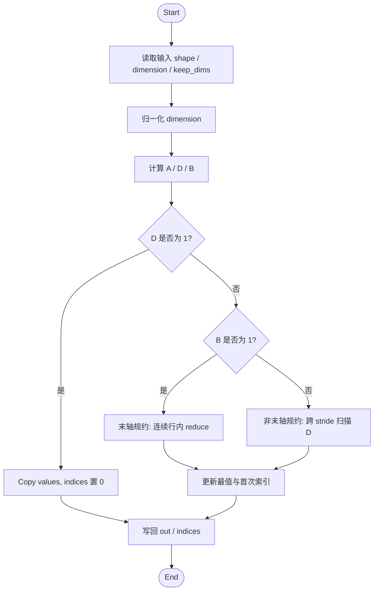
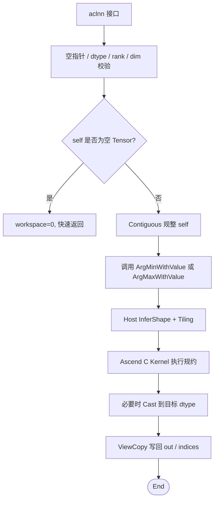
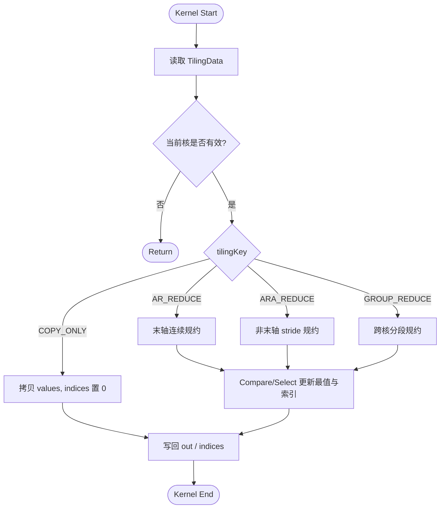

# MinDim&MaxDim 算子开发设计文档

## 一、需求背景

### 1.1 需求来源

社区任务 `05-6 MinDim&MaxDim` 要求参考昇腾版本内置 `aclnnMinDim` 与 `aclnnMaxDim` 算子，在 Atlas A2 训练系列产品 / Atlas A3 系列产品上，使用 Ascend C 编程语言实现功能一致的算子，完成算子设计、开发、测试和验收交付。

`aclnnMinDim` 的内置 TBE 参考实现对应内部 `ArgMinWithValue`，`aclnnMaxDim` 的内置 TBE 参考实现对应内部 `ArgMaxWithValue`。两个算子均属于按指定维度规约并同时返回最值与索引的 reduce-arg 类算子。

验收通过后，算子代码需提交至昇腾算子开源仓 `cann/ops-math` 的 `experimental/math` 目录，设计文档需合入 `cann/cann-ops-competitions` 社区任务目录。

### 1.2 背景介绍

#### 1.2.1 算子功能说明

`MinDim` 与 `MaxDim` 对输入 Tensor `self` 沿指定维度 `dim` 进行规约：

- `MinDim` 返回沿 `dim` 轴的最小值 `out` 及对应索引 `indices`；
- `MaxDim` 返回沿 `dim` 轴的最大值 `out` 及对应索引 `indices`；
- `keepdim=false` 时输出删除规约轴；
- `keepdim=true` 时输出保留规约轴，且该轴长度为 1；
- 当同一输出位置存在多个相同最值时，索引返回首次出现的位置，以对齐 PyTorch 与 TBE 的常见语义。

设输入 rank 为 `R`，输入 shape 为：

$$
S=(S_0,S_1,\ldots,S_{R-1})
$$

对 `dim` 归一化得到：

$$
axis =
\begin{cases}
dim + R, & dim < 0 \\
dim, & dim \ge 0
\end{cases}
$$

对于输出坐标中除规约轴外的每个位置，算子在 `self[..., k, ...]` 的 `k=0..S_axis-1` 范围内扫描候选值，并输出最值和最值所在的 `k`。

#### 1.2.2 TBE 基线来源

本任务以 CANN 内置 TBE 算子作为功能、精度和性能基线。参考路径如下，其中 `$ASCEND_HOME` 表示 `/usr/local/Ascend/ascend-toolkit/latest`：

| 基线层次 | 路径 | 作用 |
| --- | --- | --- |
| TBE kernel 实现 | `$ASCEND_HOME/opp/built-in/op_impl/ai_core/tbe/impl/ops_legacy/dynamic/arg_min_with_value` | `MinDim` 内部参考实现 |
| TBE kernel 实现 | `$ASCEND_HOME/opp/built-in/op_impl/ai_core/tbe/impl/ops_legacy/dynamic/arg_max_with_value` | `MaxDim` 内部参考实现 |
| 算子原型 | `$ASCEND_HOME/opp/built-in/op_graph/inc/ops_proto_math.h` | 核对输入、输出、属性定义 |
| 算子信息库 | `$ASCEND_HOME/opp/built-in/op_impl/ai_core/tbe/config/ascend910b/aic-ascend910b-ops-info-legacy.json` | 核对 dtype、format、动态 shape 能力 |

外部 ACLNN 接口和内部原生算子职责不同。`aclnnMinDim` / `aclnnMaxDim` 负责参数校验、非连续 Tensor 规整、输出 ViewCopy 和执行器组装；内部 `ArgMinWithValue` / `ArgMaxWithValue` 负责连续 ND Tensor 上的实际规约计算。

#### 1.2.3 TBE 基线实现现状

TBE 参考实现可抽象为如下流程：

1. Host 侧读取输入 shape、`dimension` 和 `keep_dims`；
2. 将输入 shape 按规约轴归并为三段：规约轴前维度积 `A`、规约轴长度 `D`、规约轴后维度积 `B`；
3. 根据 `D`、`B`、UB 容量和核数选择 tiling 模式；
4. Kernel 侧按 tiling 模式处理末轴规约、非末轴规约和 `D=1` 快速路径；
5. 对每个输出位置维护当前最值和索引，仅在候选值严格优于当前值时更新；
6. 写回 `values` 与 `indices`。

TBE 基线流程图如下：



#### 1.2.4 本次 Ascend C 交付范围

本次设计覆盖任务书指定功能范围：

- 支持 `FLOAT16`、`FLOAT`、`BFLOAT16`、`INT16` 四类输入 dtype；
- `out` dtype 与 `self` 一致；
- `indices` dtype 固定为 `INT32`；
- 支持 ND format；
- 支持 rank `[1, 8]`；
- 支持 `dim` 正负表达，取值范围为 `[-self.dim(), self.dim())`；
- 支持 `keepdim=true/false`；
- 支持 `self`、`out`、`indices` 非连续 Tensor；
- 适配 Atlas A2 训练系列产品 / Atlas A3 系列产品。

## 二、需求分析

### 2.1 外部组件依赖

算子接入 `cann/ops-math` 社区算子工程，依赖以下基础组件：

- ACLNN 两段式接口框架，用于 `GetWorkspaceSize` 与实际执行入口；
- `opdev` / `l0op` 基础能力，用于参数校验、Contiguous、Cast、ViewCopy 与执行器管理；
- GE / OpDef 注册体系，用于声明输入输出、属性、shape 推导和 dtype/format 能力；
- Host Tiling 机制，用于根据运行期 shape、dtype、平台信息生成 tiling 数据；
- Ascend C Kernel 运行时，用于 GM/UB 搬运、向量比较、选择、规约和写回。

### 2.2 内部适配模块

`MinDim` 与 `MaxDim` 共享规约建模、shape 推导、tiling、数据搬运和输出写回逻辑，差异仅在比较方向与初始填充值。内部模块规划如下：

| 模块 | 计划职责 | 说明 |
| --- | --- | --- |
| ACLNN 接口层 | `aclnnMinDimGetWorkspaceSize` / `aclnnMinDim` / `aclnnMaxDimGetWorkspaceSize` / `aclnnMaxDim` | 参数校验、非连续输入规整、原生算子调用、输出 ViewCopy |
| 原生算子调用层 | `ArgMinWithValue` / `ArgMaxWithValue` L0 调用 | 将 ACLNN 接口调度到 AiCore kernel |
| OpDef / InferShape | 注册输入输出属性与 shape 推导 | 根据 `dimension`、`keep_dims` 推导 `values` 与 `indices` shape |
| Host Tiling | 计算 `A`、`D`、`B`、分核参数和 tilingKey | 选择 copy、末轴、非末轴、大规约等路径 |
| Ascend C Kernel | 执行最值和索引规约 | Min/Max 通过模板参数或编译期宏区分 |
| 测试与样例 | ACLNN 调用样例、自验证脚本、性能对比脚本 | 覆盖 dtype、rank、dim、keepdim、非连续 Tensor 和边界值 |

### 2.3 算子原型定义

#### 2.3.1 `aclnnMinDim`

| 参数名 | 类别 | 描述 | 数据类型 | 数据格式 | 维度 | 非连续 Tensor |
| --- | --- | --- | --- | --- | --- | --- |
| `self` | 输入 | 待计算的目标张量 | `FLOAT16`、`FLOAT`、`BFLOAT16`、`INT16` | ND | `[1, 8]` 维 | 支持 |
| `dim` | 输入属性 | 指定规约维度 | `INT64` 标量 | - | 标量 | - |
| `keepdim` | 输入属性 | 是否保留规约轴 | `BOOL` 标量 | - | 标量 | - |
| `out` | 输出 | 沿 `dim` 求得的最小值 | 与 `self` 一致 | ND | 由 `keepdim` 推导 | 支持 |
| `indices` | 输出 | 最小值在规约轴上的索引 | `INT32` | ND | 与 `out` 一致 | 支持 |

#### 2.3.2 `aclnnMaxDim`

| 参数名 | 类别 | 描述 | 数据类型 | 数据格式 | 维度 | 非连续 Tensor |
| --- | --- | --- | --- | --- | --- | --- |
| `self` | 输入 | 待计算的目标张量 | `FLOAT16`、`FLOAT`、`BFLOAT16`、`INT16` | ND | `[1, 8]` 维 | 支持 |
| `dim` | 输入属性 | 指定规约维度 | `INT64` 标量 | - | 标量 | - |
| `keepdim` | 输入属性 | 是否保留规约轴 | `BOOL` 标量 | - | 标量 | - |
| `out` | 输出 | 沿 `dim` 求得的最大值 | 与 `self` 一致 | ND | 由 `keepdim` 推导 | 支持 |
| `indices` | 输出 | 最大值在规约轴上的索引 | `INT32` | ND | 与 `out` 一致 | 支持 |

### 2.4 主要约束

- `self` rank 必须在 `[1, 8]` 范围内；
- `dim` 必须满足 `[-rank, rank)`；
- `out` shape 必须等于 `keepdim` 规则推导结果；
- `indices` shape 必须与 `out` 完全一致；
- `out` dtype 必须与 `self` 一致；
- `indices` dtype 固定为 `INT32`；
- 非连续输入由 ACLNN 接口层规整后进入原生 kernel；
- 非连续输出通过连续临时结果和 ViewCopy 写回用户 Tensor；
- 相等候选值不更新索引，保证返回首次出现的位置；
- 不支持多轴规约、广播规约或 rank 0 标量输入。

## 三、详细设计

### 3.1 使能方式

算子通过 ACLNN 两段式接口使能：

```cpp
aclnnStatus aclnnMinDimGetWorkspaceSize(
    const aclTensor* self,
    int64_t dim,
    bool keepdim,
    aclTensor* out,
    aclTensor* indices,
    uint64_t* workspaceSize,
    aclOpExecutor** executor);

aclnnStatus aclnnMinDim(
    void* workspace,
    uint64_t workspaceSize,
    aclOpExecutor* executor,
    aclrtStream stream);

aclnnStatus aclnnMaxDimGetWorkspaceSize(
    const aclTensor* self,
    int64_t dim,
    bool keepdim,
    aclTensor* out,
    aclTensor* indices,
    uint64_t* workspaceSize,
    aclOpExecutor** executor);

aclnnStatus aclnnMaxDim(
    void* workspace,
    uint64_t workspaceSize,
    aclOpExecutor* executor,
    aclrtStream stream);
```

### 3.2 总体设计

整体链路分为四层：

1. ACLNN 接口层完成输入合法性校验、空 Tensor 快速返回、非连续 Tensor 规整、原生算子调用和输出 ViewCopy；
2. L0 原生调用层创建 `ArgMinWithValue` / `ArgMaxWithValue` 节点，并将任务加入执行器；
3. Host Tiling 层将输入 shape 按规约轴归并为 `A`、`D`、`B`，选择 tilingKey、分核参数和 UB 分块参数；
4. Kernel 层按 tiling 数据执行 copy、末轴规约、非末轴规约或大规约路径，写回最值和索引。

总体流程图：



### 3.3 Host 侧设计

#### 3.3.1 参数校验

ACLNN 第一段接口执行以下校验：

1. `self`、`out`、`indices`、`workspaceSize`、`executor` 非空；
2. `self` dtype 属于 `FLOAT16`、`FLOAT`、`BFLOAT16`、`INT16`；
3. `out` dtype 与 `self` 一致；
4. `indices` dtype 为 `INT32`；
5. `self`、`out`、`indices` rank 不超过 8，且 `self` rank 不为 0；
6. `dim` 在 `[-rank, rank)` 范围内；
7. 根据 `keepdim` 推导的输出 shape 与 `out`、`indices` shape 一致；
8. 空 Tensor 在参数合法时快速返回。

#### 3.3.2 Shape 推导

设输入 shape 为 `S`，rank 为 `R`，归一化后的规约轴为 `axis`。

当 `keepdim=false` 时，输出 shape 为：

$$
(S_0,\ldots,S_{axis-1},S_{axis+1},\ldots,S_{R-1})
$$

当 `keepdim=true` 时，输出 shape 为：

$$
(S_0,\ldots,S_{axis-1},1,S_{axis+1},\ldots,S_{R-1})
$$

`out` 和 `indices` shape 完全一致。`out` dtype 与 `self` 一致，`indices` dtype 为 `INT32`。

#### 3.3.3 规约维度建模

Host Tiling 将输入维度归并为三段：

$$
A = \prod_{i=0}^{axis-1} S_i
$$

$$
D = S_{axis}
$$

$$
B = \prod_{i=axis+1}^{R-1} S_i
$$

其中：

- `A` 表示规约轴之前的外层元素组数；
- `D` 表示规约轴长度；
- `B` 表示规约轴之后的内层连续元素数；
- 输出元素总数为 `A * B`。

任一输出线性下标 `outOffset` 可映射为：

$$
outer = outOffset / B
$$

$$
inner = outOffset \bmod B
$$

沿规约轴第 `k` 个候选元素在输入连续视图中的地址为：

$$
inputOffset = (outer \times D + k) \times B + inner
$$

#### 3.3.4 Tiling 策略

Host 侧根据 `A`、`D`、`B`、dtype 字节数、UB 容量和可用核数选择执行路径。

| 场景 | tiling 策略 | 说明 |
| --- | --- | --- |
| `D=1` | Copy 快速路径 | 输出值等于输入切片，索引全为 0 |
| `B=1` | 末轴规约路径 | 每个输出位置对应一段连续输入，适合整行搬入 UB 后向量规约 |
| `B>1` | 非末轴规约路径 | 候选元素之间存在 stride，需要按 `A/D/B` 映射地址 |
| `D` 很大且 `A*B` 较小 | 大规约路径 | 可按规约轴分段并使用 workspace 合并中间结果 |
| `A*B` 足够大 | 输出元素分核 | 按输出元素或 A 维均衡分配到多个 AI Core |
| 小 shape | 降低核数或合并 tile | 减少启动、同步和搬运开销 |

TilingData 至少包含以下字段：

| 字段 | 含义 |
| --- | --- |
| `aSize` | 规约轴之前维度积 `A` |
| `rSize` | 规约轴长度 `D` |
| `nextASize` | 规约轴之后维度积 `B` |
| `totalOut` | 输出元素总数 `A * B` |
| `realCoreNum` | 实际参与计算核数 |
| `tilingKey` | Kernel 路径选择 |
| `blockFactor` | 每核处理的主分块元素数 |
| `tailFactor` | 尾核或尾块元素数 |
| `tileLength` | 单次 UB 处理长度 |
| `workspaceSize` | 大规约路径需要的中间 workspace 大小 |

#### 3.3.5 TilingKey 规划

TilingKey 用于区分 Kernel 路径：

| tilingKey | 路径 | 触发条件 |
| --- | --- | --- |
| `COPY_ONLY` | Copy 快速路径 | `D=1` |
| `AR_REDUCE` | 末轴规约 | `B=1` 且 `D>1` |
| `ARA_REDUCE` | 非末轴规约 | `B>1` |
| `GROUP_REDUCE` | 大规约 | `D` 很大且适合跨核分段合并 |

实际实现可根据工程已有枚举值映射到对应路径，但语义必须保持上述分支关系。

### 3.4 Kernel 侧设计

#### 3.4.1 统一计算语义

Kernel 为每个输出元素维护两个状态：

- `bestValue`：当前最小值或最大值；
- `bestIndex`：当前最值在规约轴上的索引。

初始化使用 `k=0`：

$$
bestValue = self[(outer \times D + 0) \times B + inner]
$$

$$
bestIndex = 0
$$

随后遍历 `k=1..D-1`：

- `MaxDim`：若 `candidate > bestValue`，更新 `bestValue` 和 `bestIndex`；
- `MinDim`：若 `candidate < bestValue`，更新 `bestValue` 和 `bestIndex`；
- 候选值与当前值相等时不更新，保证返回首次出现的索引。

#### 3.4.2 数据类型处理

| 输入 dtype | Kernel 比较 dtype | 输出处理 |
| --- | --- | --- |
| `FLOAT` | `FLOAT` | 直接写回 |
| `FLOAT16` | `FLOAT` 或硬件支持的半精度比较路径 | 写回 `FLOAT16` |
| `BFLOAT16` | `FLOAT` | 写回 `BFLOAT16` |
| `INT16` | `FLOAT` 或 `INT32` | 写回 `INT16` |

`indices` 在 Kernel 中按 `INT32` 维护并写回。对于 `BFLOAT16` 和 `INT16`，推荐在 UB 中转换为 `FLOAT` 后比较，以避免 BF16 精度表达和 INT16 补码比较在不同向量 API 路径上的差异。

#### 3.4.3 Copy 快速路径

当 `D=1` 时，规约轴只有一个元素：

- `out` 等于输入按 `keepdim` shape 视角得到的结果；
- `indices` 全部置 0；
- 不执行比较规约。

该路径减少无意义的比较、mask 和索引更新开销。

#### 3.4.4 末轴规约路径

当 `B=1` 时，每个输出元素对应输入中的连续一行，地址连续，适合按行搬入 UB 后执行向量规约。

处理流程：

1. 每个核处理若干个 `outer` 行；
2. 将一行或多行输入搬入 UB，尾部按 32B 对齐；
3. 使用向量规约或分段规约得到每行的最值和段内索引；
4. 多段结果继续比较合并，索引加上段起始偏移；
5. 写回 `out[outer]` 和 `indices[outer]`。

末轴路径的优势是搬运连续、索引计算简单、UB 利用率高。

#### 3.4.5 非末轴规约路径

当 `B>1` 时，同一输出位置沿规约轴的候选元素在 GM 中间隔为 `B`。Kernel 使用 `outer`、`inner` 与 `k` 计算输入偏移。

处理流程：

1. 将一段输出元素映射为 `(outer, inner)`；
2. 读取 `k=0` 候选作为初始值；
3. 对 `k=1..D-1` 依次或分块读取候选；
4. 通过 `Compare` / `Select` 或标量兜底更新 `bestValue` 与 `bestIndex`；
5. 将结果写回连续输出。

对于 `B` 较大且对齐良好的场景，可按 `inner` 方向批量处理；对于 `B` 非 32B 对齐或尾部不足的场景，使用 `DataCopyPad` 或尾块 mask 保证访问安全。

#### 3.4.6 大规约路径

当 `D` 很大而输出元素数量不足以充分分核时，可沿规约轴将一个输出元素的候选范围拆分给多个核：

1. 每个核处理规约轴上的一个区间，得到局部最值和局部索引；
2. 将局部结果写入 workspace；
3. 由合并阶段对局部结果再次规约；
4. 合并时仍使用严格比较，局部结果相等时保留更小的全局索引。

该路径用于提升长规约轴场景的核利用率。

#### 3.4.7 Kernel 流程图



### 3.5 支持硬件

| 支持硬件 | 支持状态 |
| --- | --- |
| Atlas A2 训练系列产品 | 支持 |
| Atlas A3 系列产品 | 支持 |

### 3.6 算子约束限制

- 仅支持单轴规约；
- 仅支持 ND format；
- 输入 rank 支持 `[1, 8]`；
- `dim` 取值范围为 `[-rank, rank)`；
- `indices` 固定为 `INT32`；
- 不支持输入 dtype `INT32`、`INT64`、`BOOL` 作为本任务验收范围；
- 非连续 Tensor 由 ACLNN 接口层规整，内部 Kernel 按连续 ND Tensor 处理；
- NaN 行为以任务环境内置 TBE 和 AscendOpTest 验证口径为准。

## 四、特性交叉分析

| 特性 | 覆盖方式 |
| --- | --- |
| `MinDim` / `MaxDim` 双算子 | 共享规约框架，通过比较方向区分 |
| `dim` 正负表达 | Host 侧统一归一化到 `[0, rank)` |
| `keepdim` 两态 | InferShape 统一推导，ACLNN 校验输出 shape |
| rank `[1, 8]` | Tiling 运行期按 shape 归并为 `A/D/B` |
| 末轴规约 | 使用连续行规约路径 |
| 非末轴规约 | 使用 stride 地址映射路径 |
| `D=1` | Copy 快速路径，索引置 0 |
| 大 `D` | 分段规约和 workspace 合并路径 |
| `FLOAT16` / `BFLOAT16` | Kernel 内部转为适合比较的中间类型 |
| `INT16` | 按整数值比较，输出保持 `INT16` |
| 非连续输入 | ACLNN 层 Contiguous |
| 非连续输出 | 临时连续输出 + ViewCopy |
| 相同最值 | 仅严格更优时更新，保留首次索引 |

## 五、可维可测分析

### 5.1 精度标准

精度验证按 AscendOpTest 默认阈值执行：

- `INT16` 的 `out` 与 `indices` 逐元素精确一致；
- `FLOAT`、`FLOAT16`、`BFLOAT16` 按默认浮点容差比较；
- `indices` 与 `out` 需要交叉校验：用 `indices` 回查输入对应位置，确认该位置值等于输出最值；
- tie 场景需要专门验证首次索引语义。

参考实现建议使用 CPU 侧手写逻辑或 PyTorch `torch.min` / `torch.max` 的 dim 语义，并显式校验 `keepdim`、负轴、非连续 Tensor 和索引 dtype。

### 5.2 性能标准

性能要求按任务书执行：

- 所有核参与计算场景下，Ascend C 实现性能不低于原 TBE 算子的 95%；
- 对于 10us 以下的小 shape，如果绝对耗时差在 3us 内，可提供性能仿真图和分析结论说明；
- 性能测试需要同时覆盖 `MinDim` 与 `MaxDim`，覆盖不同 dtype、rank、`dim` 位置、`keepdim` 状态和数据规模。

### 5.3 验证矩阵

| 验证维度 | 典型用例 |
| --- | --- |
| dtype | `FLOAT16`、`FLOAT`、`BFLOAT16`、`INT16` |
| rank | 1 维到 8 维 |
| dim | 正轴、负轴、首轴、中间轴、末轴 |
| keepdim | `true`、`false` |
| 规约轴长度 | `D=1`、小 D、中 D、大 D |
| shape 类型 | 小 shape、全核 shape、大 shape、尾块 shape |
| 非连续 Tensor | 输入切片、转置、输出 view |
| tie 场景 | 多个相同最大值或最小值 |
| 边界值 | 负数、0、正数、半精度边界、BF16 典型值 |
| 硬件 | Atlas A2、Atlas A3 |

### 5.4 兼容性分析

本任务交付到 `experimental/math`，不直接替换系统内置算子。ACLNN 接口、输入输出语义和 shape 推导与任务书及内置 TBE 参考实现保持一致。非连续 Tensor 在接口层处理，Kernel 内部使用连续 ND 视图，便于保证实现简洁性和可验证性。提交后通过 custom vendor 包隔离，不影响 `math/` 下已有生产算子。

## 六、参考资料

1. `MinDim&MaxDim` 算子开发任务书；
2. `cann/ops-math` 中 `arg_max_with_value`、`arg_min_with_value` 相关实现；
3. CANN 内置 TBE `arg_min_with_value` / `arg_max_with_value` 参考实现；
4. Ascend C 算子开发文档；
5. AscendOpTest 默认精度阈值与社区任务验收要求。
