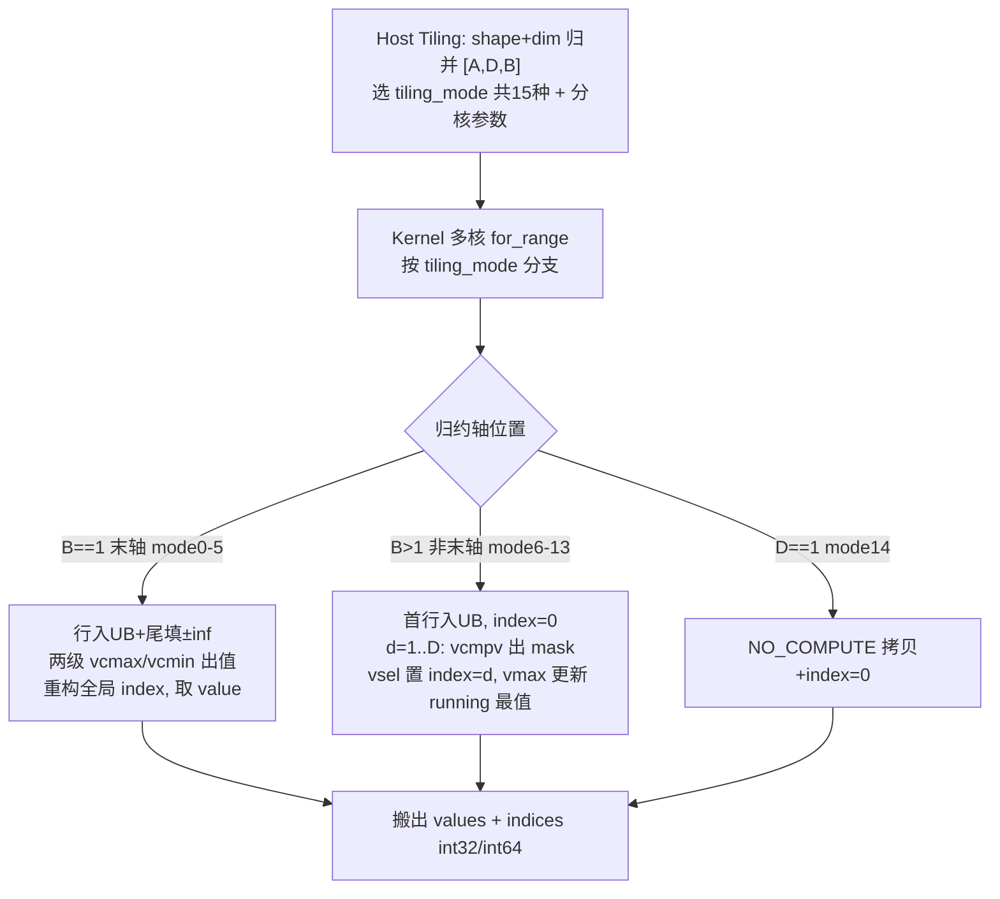
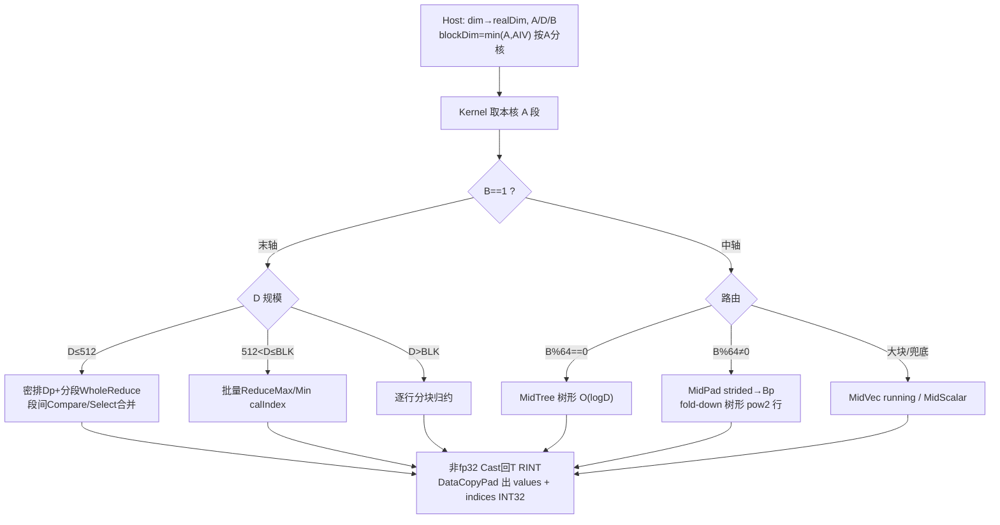

# 需求背景（required）

## 需求来源

通过社区任务完成开源仓算子贡献的需求。任务序号 05-6 MinDim&MaxDim：参考昇腾内置 `aclnnMaxDim` / `aclnnMinDim`（TBE 实现 `ArgMaxWithValue` / `ArgMinWithValue`），用 Ascend C 实现功能一致算子，合入 `cann/ops-math:experimental/math`。语义同 `torch.max/min(input, dim, keepdim)`。

验收通过后，在昇腾算子开源仓提交 PR 申请，申请将开发完成的算子合入 <https://gitcode.com/cann/ops-math/tree/master/experimental/math>。

## 背景介绍

### MaxDim / MinDim 算子实现优化

基于历史 TBE 版本用 Ascend C 重写优化，功能对齐并补齐任务要求的 INT16 与固定 INT32 索引。TBE 源码与算子信息库路径（`$L` = `.../ascend-toolkit/latest`，已在 devenv 实测确认）：

| 内容 | 路径 |
| --- | --- |
| kernel 入口 | `$L/opp/built-in/op_impl/ai_core/tbe/impl/ops_legacy/dynamic/arg_max_with_value.py`、`arg_min_with_value.py` |
| kernel 核心逻辑 | 同目录 `arg_common.py`（`ArgCommonWithValue`，TIK） |
| 算子原型 | `$L/opp/built-in/op_graph/inc/ops_proto_math.h` |
| 算子信息库 | `$L/opp/built-in/op_impl/ai_core/tbe/config/ascend910b/aic-ascend910b-ops-info-legacy.json` |

`aclnnMaxDim`→原型 `ArgMaxWithValue`→`arg_common.ArgCommonWithValue(is_min=False)`；`aclnnMinDim`→`ArgMinWithValue`→`is_min=True`，与上表一致。

### TBE 算子现状分析

**支持的数据类型和数据格式**（依信息库，与入口 `check_list` 一致）：x ∈ {FLOAT16、FLOAT、BFLOAT16、INT64、INT32}，format ND；indice ∈ {INT32 或 INT64}（`indice_dtype` 可选）；values 同 x。**TBE 不支持 INT16**。

**TBE 实现描述**（`ArgCommonWithValue(ArgCommon)`，TIK，Max/Min 共用，`is_min` 分化 `vmax/vcmax`↔`vmin/vcmin`）：

1. 维度建模：归约轴归并为 `[first_dim(A), axis_size(D), last_dim(B)]`，`B==1` 即末轴。
2. dtype：FLOAT16 原生、**BFLOAT16→FLOAT32**、FLOAT32/INT32/INT64 原生；910B/910_93 填充值取 ±inf；`vcmax` 不支持 INT64（无 index）。
3. 分核/分支：host C++ Tiling 算 `tiling_mode` + 各核 segment 下发 `tiling_gm`；kernel `_do_compute` 多核 `for_range` 后按 **15 个 tiling_mode** 分支。
4. 末轴（mode 0-5）：行入 UB、尾填 ±inf，**两级 `vcmax/vcmin`**（一级每段出 [值,段内 index]，二级出全局值+段号），重构全局 index；`is_with_value` 同取值。按 D 规模分 6 mode。
5. 非末轴（mode 6-13）：沿 D **O(D) running** —首行入 `ub_data`、`ub_index=0`；`d=1..D` 载下一行→`vcmpv_gt/lt` 出 mask→命中处 `vsel/vector_dup` 置 index=d→`vmax/vmin` 更新逐元素 running 最值。按 A/B 切分多 mode（含多核）。
6. D==1（mode 14 NO_COMPUTE）：拷贝原值、index=0。

**TBE 实现流程图**：

# 需求分析（required）

## 需求描述

用 Ascend C 实现 MaxDim / MinDim，沿 `dim` 求最值 `values` 及索引 `indices`。支持 FLOAT16 / FLOAT / BFLOAT16 / INT16，[1,8] 维 ND 非连续输入，任意 `dim`（含轴长 1），`keepdim` 两态，`indices` 固定 INT32。tie 取首个（最小索引），与 PyTorch 及 TBE 对齐。

## 需求拆解

1. 支持 4 种 dtype；indices 固定 INT32。
2. 支持任意 dim（首/中/末轴）与 keepdim 两态。
3. 支持 [1,8] 维、非连续 Tensor。
4. 全核场景性能 ≥ TBE 95%；精度满足 AscendOpTest 默认阈值。

## 外部组件依赖

不依赖外部算子/三方库；仅依赖 CANN 基础运行时（acl/runtime/GE，已适配）。

## 内部适配模块

Aclnn 直调（两段式 `aclnnMaxDimGetWorkspaceSize`/`aclnnMaxDim`）√；GE 图模式 InferShape/Tiling（动态 shape）√。

## 需求模块设计

### AscendC 算子原型

算子名 `ArgMaxWithValue` / `ArgMinWithValue`（提交至 `experimental/math`，与 `math/` 下生产算子同 OpType，沿用社区既有约定，如 `acos` 在 `math/` 与 `experimental/math/` 同名共存，由 custom vendor 包隔离）。参数与任务书对齐：

| 参数 | 类别 | 描述 / 使用说明 | 数据类型 | format | 维度 | 非连续 |
| --- | --- | --- | --- | --- | --- | --- |
| self（x） | 输入 | 待计算张量，与 out 数据类型一致 | FLOAT16、FLOAT、BFLOAT16、INT16 | ND | [1,8] 维 | √ |
| dim（dimension） | 属性 | 指定维度，取值 ∈ `[-self.dim(), self.dim())` | INT64 标量 | - | 标量 | - |
| keepdim（keep_dims） | 属性 | false→输出维度 self−1；true→输出维度=self 且该轴=1 | BOOL 标量 | - | 标量 | - |
| out（values） | 输出 | 最值，数据类型与 self 一致 | 同 self | ND | keepdim 决定 | √ |
| indices | 输出 | 最值索引，维度与 out 相同 | **INT32** | ND | 与 out 相同 | √ |

### AscendC 算子相关约束（相对 TBE）

新增 **INT16**；裁剪 INT32/INT64 输入；indices 固定 **INT32**（不提供 TBE 的 INT64 选项）。其余（任意 dim、keepdim、[1,8] 维、非连续、tie 取首个）与 TBE 对齐。

# 详细设计（required）

## 算子分析

- 数学定义：`values[a,b]={max|min}_d self[a,d,b]`，`indices` 取首个。
- 支持数据类型：FLOAT16/FLOAT/BFLOAT16/INT16。fp16/bf16/int16 核内 `Cast→FLOAT32` 计算（int16∈±32767 在 fp32 精确无损），fp32 `Adds 0.0f` 直通。int16（补码序）/bf16（宽域，超 fp16 范围塌缩为 inf）不能复用 fp16 二进制比较，统一升 fp32 为唯一正确路径。
- 支持形状：ND，[1,8] 维，非连续（aclnn `AutoContiguous` 转连续后入 kernel）。

## 使能方式

Aclnn 直调 √。

## 算子实现

### 维度建模 [A, D, B]

`realDim=((dim%R)+R)%R`；`A`=前维积、`D`=轴长、`B`=后维积，输出 `A×B`。`B==1` 末轴、`B>1` 中轴（首轴=A=1 特例）。与 TBE `[first_dim, axis_size, last_dim]` 一致。

### host 侧设计

**分核策略**：读 dim→realDim→累乘得 A/D/B 写 `TilingData{A,D,B}`；`blockDim=min(A, GetCoreNumAiv())`（910B AIV=40），A 行独立无核间同步；每核处理 `⌈A/blockDim⌉` 行。性能仅要求 `A≥blockDim` 全核场景，负载均衡。

**数据分块与内存优化**：8 个 `TBuf<VECCALC>`，`BLK=8192`、`OUTCAP=4096`（fp32）。`bIn_/bF_/bWork_` 各 `BLK·4=32KB`，`bVal_/bIdx_/bBest_/bVidx_` 各 `OUTCAP·4=16KB`，`bMask_=OUTCAP/8+256≈0.8KB`，合计 **≈160.8KB ≤ 192KB**。切分公式：末轴行对齐宽 `Dp=⌈D·sizeof/32⌉·32/sizeof`，单次载 `K=clamp(BLK/Dp,1,255)` 行；中轴 `D2=2^⌈log₂D⌉`、`Bp=⌈B/64⌉·64`（保证 Compare/Select count 为 64 倍数）。

**tilingKey 规划**：单一 tilingKey（`ELEMENTWISE_TPL_SCH_MODE_0`）；dtype 由编译期 `DTYPE_X` 宏区分（binary.json 每 dtype 一条目）；算法分支在 kernel 运行期按 `[A,D,B]`/对齐自路由（不靠 host 多 tilingKey）。理由：分支强依赖运行期 D/B 对齐性，运行期判断成本低且 Min/Max×4 dtype 共享一份 kernel。

### kernel 侧设计

**实现描述**：模板 `ArgReduceDim<T,IS_MAX>`（Min/Max 共用，`IS_MAX` 编译期分化；arg_min 由 arg_max token 替换生成）。dtype 归一：入口 `LoadCastF` 对非 fp32 `Cast<float,T>`、fp32 `Adds 0`；出口对非 fp32 `Cast<T,float>(RINT)`，indices 恒 INT32。向量指令要求源 32B 对齐、Compare/Select count 须 64 倍数，非对齐统一用 `DataCopyPad`（GM→UB 非对齐搬运、UB 占位自动按 32B 向上取整）解决。

- **末轴 B==1**：`D≤512` 主路径—`LoadRowsAligned` 密排到 `Dp`，每行 ≤64 分段双 `WholeReduceMax/Min(ONLY_VALUE/ONLY_INDEX)` 批量出值/索引，段间 `Compare+Select` running 合并（严格 `>/<` 取首段，maskCount=真实段宽使 index 天然落 `[0,D)`）；`512<D≤BLK` 批量 `ReduceMax/Min(calIndex)`（`D%8≠0` 强制 K=1 保对齐）；`D>BLK` 逐行分块。
- **中轴 B>1**（树形 O(logD)+索引并行折叠）：`[D,B]` 沿行折半，每层 `Compare(GE/LE)`→`Select(val)`+`Select(idxF)`；`idxF=行号` 初始，等值取下半（行号更小）=首个。`B%64==0`（`MidTree`）行天然对齐无 padding；`B%64≠0`（`MidPad`）单次 strided `DataCopyPad` 载入 `Bp` 对齐宽（`CreateVecIndex+ShiftRight` 建 idxF，fold-down 仅树形 pow2 行）；超大块 `MidVec` running、兜底 `MidScalar`。
- 同步：预填(V)/载入(MTE2) 同块插 `V_MTE2` 避 WAW；跨迭代复用 buffer 插 `V_MTE2`/独立 buffer 避 WAR。

**AscendC 实现流程图**：

**与 TBE 流程图的差异点和原因**：

| 维度 | TBE 基线 | 本实现 | 原因 |
| --- | --- | --- | --- |
| 编程模型 | TIK 手调 `vcmax/vmax/vcmpv/vsel` | Ascend C 高阶 API `WholeReduce/ReduceMax/Compare/Select` | 表达力高、可移植 |
| dtype 路径 | fp16 原生/bf16→fp32/int32/int64 原生 | fp16/bf16/int16→fp32，fp32 原生 | 统一 fp32 正确处理 int16 补码与 bf16 宽域；int16 为新增 |
| 类型/索引 | 含 int32/int64、无 int16；indices int32/int64 | 含 int16、无 int32/int64；indices 固定 int32 | 按任务裁剪 |
| 分支选择 | host 15 个 tiling_mode | 单 tilingKey + 运行期自路由 | 降 host 复杂度，分支依赖运行期对齐性 |
| 中轴归约 | O(D) running 逐行 | O(logD) 树形折叠 + running 兜底 | 消除 D 次串行依赖，长 D 更快 |
| 末轴归约 | 两级 vcmax 需重构 index | 分段 WholeReduce ONLY_VALUE/INDEX | 直接出连续值/索引，段宽 mask 使 index 落 `[0,D)` |
| 非对齐搬运 | data_move_pad/stride | DataCopyPad 密排到 32B/64 倍宽 | 满足 count 64 倍数 + 源 32B 对齐 |

整体结构（`[A,D,B]` 建模、末轴整段 reduce、非末轴沿轴维护 running 最值+索引）与 TBE 一致；差异集中在「单 tilingKey 自路由 vs 15 mode」「中轴 O(logD) vs O(D)」「统一 fp32+int16 vs 原生多 dtype」，均为性能/功能对齐/可维护性取舍。

## 支持硬件

Atlas A2 训练系列产品（ascend910b）√；Atlas A3 系列产品（ascend910_93）√。

## 算子约束限制

`dimension∈[-R,R)`；不支持多轴归约/广播；维度数∈[1,8]；indices 固定 INT32；tie 取首个；NaN 按 IEEE 与基线对齐；dtype 限 FLOAT16/FLOAT/BFLOAT16/INT16。

# 特性交叉分析

| 特性 | 支持 | 说明 |
| --- | --- | --- |
| 非连续 Tensor | √ | aclnn `AutoContiguous` 转连续后入 kernel |
| 动态 shape/rank | √ | host Tiling 运行期算 `[A,D,B]` |
| keepdim×{min,max}×4 dtype | √ | InferShape 去/置 1 dim 轴；共模板+编译期分发，交叉全覆盖 |
| 确定性计算 | √ | tie 取首个，与 `aclnnMaxDim` 默认确定性一致 |
| dim 轴长=1 | √ | 退化为拷贝+index=0，对齐 TBE NO_COMPUTE |
| 量化/稀疏/融合 | 不涉及 | 独立 reduce-arg 算子 |

# 可维可测分析

## 精度标准 / 性能标准

| 标准 | 描述 | 来源 |
| --- | --- | --- |
| 精度 | AscendOpTest 默认阈值：int16 全等、fp16/bf16 rtol≈1e-2、fp32 更紧；索引经 gather 回值校验规避 tie 抖动 | AscendOpTest |
| 性能 | 全核场景 ≥ TBE（`aclnnMaxDim/MinDim`）95%；<10us 小 shape（差 ≤3us）提供仿真说明 | 社区任务 |

实测：全 shape 矩阵 2544/2544 PASS；全核 ours vs TBE 末轴 D=7~1024≈0.96~1.14x、中轴 0.97~4.21x、bf16 全 ≥1.0x；int16 无 TBE 基线（耗时与 bf16 逐项一致）。

## 兼容性分析

新增算子，提交至 `experimental/math`，aclnn 接口遵循 CANN 规范；indices 取首个、keepdim、dim 轴长 1 行为与基线严格对齐；与系统/`math/` 下同名算子由 custom vendor 包隔离，互不影响，无存量兼容性风险。

## 参考资料

CANN 内置 TBE 参考实现（`$L` = `.../ascend-toolkit/latest`，已在 devenv 实测确认；见「背景介绍」路径表）：

- kernel 实现：`$L/opp/built-in/op_impl/ai_core/tbe/impl/ops_legacy/dynamic/arg_max_with_value`（`arg_min_with_value`）
- 算子原型：`$L/opp/built-in/op_graph/inc/ops_proto_math.h`
- 算子信息库：`$L/opp/built-in/op_impl/ai_core/tbe/config/ascend910b/aic-ascend910b-ops-info-legacy.json`
- 合入目标仓：<https://gitcode.com/cann/ops-math/tree/master/experimental/math>
