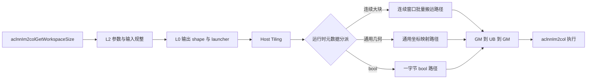

# Im2col 算子开发设计文档

# 需求背景（required）

## 需求来源

本需求来自 CANN 社区任务 2026 年 5 月发布的 Im2col 算子开发任务。任务要求参考
CANN 内置 Im2col TBE 实现，以 Ascend C 实现与 `aclnnIm2col` 语义一致的算子，
覆盖原有浮点类型并新增 `bool` 类型支持，最终完成源码、测试、README、自验证报告和
设计文档交付。

目标硬件为 Atlas A2 训练系列产品和 Atlas A3 系列产品，目标源码仓为
`cann/ops-math`。

## 背景介绍

### Im2col 算子实现优化

Im2col 把 NCHW/CHW 输入上的每个滑动窗口展开为一列。卷积计算可在完成该变换后
转化为矩阵乘法，因此 Im2col 的主要工作不是数值计算，而是根据卷积属性完成索引映射、
边界补零和数据搬运。

本任务计划在 `ops-math/experimental/conversion/im2col` 下提供自有 Ascend C 实现，
保持现有 `conversion/im2col` 主树不变。候选实现不调用内置 Im2col whole-op 作为运行时
回退；内置 ACLNN/TBE 只用于语义对照和性能基线。

### Im2col 算子（TBE）实现路径和 ACLNN 调用链

下表给出文件名级别的源码获取路径。`${ASCEND_OPP_PATH}` 指当前 CANN 安装的 `opp`
目录；算子信息库的 SoC 子目录随目标芯片和 CANN 版本选择，不能只写到上级目录。

| 层级 | 文件路径 | 作用 |
| --- | --- | --- |
| 已安装 ACLNN 声明 | `${ASCEND_HOME_PATH}/aarch64-linux/include/aclnnop/aclnn_im2col.h` | 声明 `aclnnIm2colGetWorkspaceSize` 和 `aclnnIm2col` 两段式接口 |
| ACLNN L2 源码 | `ops-math/conversion/im2col/op_api/aclnn_im2col.cpp` | 校验参数和输出 shape，执行 `Contiguous`，为 CHW 输入补 batch 维，规整为 NCHW，将二向 padding 扩为四向并回写最终输出 |
| L0 源码 | `ops-math/conversion/im2col/op_api/im2col.cpp` | 推导 `[N,C*kH*kW,OH*OW]`，以 `kernelSize、stride、dilation、CALCULATED、pads` 属性顺序加入 AICore launcher |
| A2 算子信息库 | `${ASCEND_OPP_PATH}/built-in/op_impl/ai_core/tbe/kernel/config/ascend910b/ops_legacy/im2col.json` | 注册 Ascend 910B 的 Im2col dtype、NCHW format、padding mode、动态模式和二进制信息 |
| A3 算子信息库 | `${ASCEND_OPP_PATH}/built-in/op_impl/ai_core/tbe/kernel/config/ascend910_93/im2col.json` | 注册 Ascend 910_93 的 Im2col 动态二进制；实际开发时以目标 CANN 安装中存在的 SoC 文件为准 |
| TBE 动态入口 | `${ASCEND_OPP_PATH}/built-in/op_impl/ai_core/tbe/impl/ops_legacy/dynamic/im2col.py` | 注册 `Im2col`，校验 NCHW 与浮点 dtype，展开 kernel/stride/dilation/pads 属性并创建 `ExtractImagePatchesNCHW` |
| TBE 动态计算模板 | `${ASCEND_OPP_PATH}/built-in/op_impl/ai_core/tbe/impl/ops_legacy/dynamic/extract_image_patches_nchw.py` | 构造 padding、滑窗提取和布局变换计算图，取得 tiling 参数并执行 `auto_schedule`、`build` |
| TBE 静态参考 | `${ASCEND_OPP_PATH}/built-in/op_impl/ai_core/tbe/impl/ops_legacy/im2col.py`、`${ASCEND_OPP_PATH}/built-in/op_impl/ai_core/tbe/impl/ops_legacy/im2col_common_func.py` | 提供历史静态 shape 与 NC1HWC0 调度参考，不是本文 A2/A3 动态 NCHW 主流程 |
| 算子原型 | `${ASCEND_OPP_PATH}/built-in/op_proto/inc/transformation_ops.h` | 定义 `REG_OP(Im2col)` 的输入、输出和属性 |

#### 基于 ACLNN 接口判断新增文件

从 `aclnn_im2col.cpp -> l0op::Im2col -> AICore launcher` 的调用链可知，源码实现不能只新增
Kernel。后续 `ops-math/experimental/conversion/im2col` 交付至少需要形成以下文件闭环：

| 新增文件或目录 | 必要性 |
| --- | --- |
| `op_api/aclnn_im2col.h`、`op_api/aclnn_im2col.cpp` | 提供两段式 ACLNN 接口、契约校验、CHW/NCHW 规整和输出回写 |
| `op_api/im2col.h`、`op_api/im2col.cpp` | 提供 L0 封装、输出 shape 推导和自有 AICore 节点下发 |
| `op_host/im2col_def.cpp`、`op_host/im2col_infershape.cpp` | 注册支持 dtype/format/SoC 并保持图模式与 ACLNN shape 语义一致 |
| `op_host/im2col_tiling.cpp` 及 tiling data 定义 | 根据运行时 shape、dtype、卷积属性和平台资源生成 Kernel 契约 |
| `op_kernel/im2col.cpp` 及自有 Kernel 头文件 | 实现窗口索引、补零、分核、UB 分块、尾块安全和 bool 一字节路径 |
| `op_host/config/ascend910b/`、`op_host/config/ascend910_93/` | 为 A2/A3 分别提供 binary JSON 与 simplified key，且与 OpDef/CMake 的 SoC 集合一致 |
| `CMakeLists.txt`、README、测试和自验证文件 | 完成编译打包、接口说明与 reviewer 可复现验证 |

这些文件均属于本任务后续 Ascend C 源码交付；本设计文档 PR 不包含实现源码。运行时路径
只能进入上述提交目录编译出的自有 Host/Kernel，不调用内置 Im2col whole-op 回退。

### Im2col 算子 TBE 实现现状分析

当前公开接口接收三维 CHW 或四维 NCHW 输入，属性均为长度为 2 的数组。ACLNN L2 层
先完成契约校验和连续化；CHW 输入经 `UnsqueezeNd(axis=0)` 统一为四维。随后接口将
`padding=[pH,pW]` 扩为 `[pH,pH,pW,pW]`，L0 层以 `CALCULATED` 模式下发 Im2col。

动态 TBE 入口只接受 NCHW，并校验 `float16`、`float32`、`bfloat16`。属性不是 binary
形式时，`prepare_params` 将长度 1/2 的 kernel、stride、dilation 扩为四维属性，将
pads 扩为四向。`ExtractImagePatchesNCHW` 再完成以下源码数据流：

1. 根据 shape 是否包含 `-1/-2` 区分 const shape 和 dynamic shape；
2. 解析 `kH/kW、sH/sW、dH/dW` 与四向 padding，并计算 `OH/OW`；
3. const shape 调用 `op_tiling.do_op_tiling` 取得 tiling key 和七个分块 factor，dynamic
   shape 使用 TVM 变量承载这些参数；
4. `_compute()` 依次创建 `x_ub`、NCHW 到 NHWC 的索引变换、可选四向补零、六维滑窗
   提取、NHWC 到 NCHW 的索引变换和最终输出；
5. `build()` 注册 compile info，执行 `tbe.auto_schedule(y)` 与 `tbe.build(...)`。

#### TBE 算子实现流程图

下图按上述 ACLNN、L0、算子信息库、`dynamic/im2col.py` 和
`extract_image_patches_nchw.py` 的真实调用顺序绘制；没有把本任务计划的 Ascend C
分派混入 TBE 基线流程。

```mermaid
flowchart TD
    A["aclnnIm2colGetWorkspaceSize"] --> B["CheckParams: rank、dtype、属性、输出 shape"]
    B --> C["Contiguous(self)"]
    C --> D{"输入 rank == 3?"}
    D -->|是| E["UnsqueezeNd(axis=0): CHW -> NCHW"]
    D -->|否| F["保留四维 NCHW"]
    E --> G["ReFormat(NCHW)"]
    F --> G
    G --> H["padding [pH,pW] -> [pH,pH,pW,pW]"]
    H --> I["l0op::Im2col 推导 [N,C*kH*kW,OH*OW]"]
    I --> J["ADD_TO_LAUNCHER_LIST_AICORE<br/>attrs: kernelSize, stride, dilation, CALCULATED, pads"]
    J --> K["按 SoC 的 im2col.json 匹配 NCHW、dtype、padding mode"]
    K --> L["dynamic/im2col.py::im2col"]
    L --> M{"format == NCHW 且 dtype 为<br/>FP16/FP32/BF16?"}
    M -->|否| X["报参数错误"]
    M -->|是| N{"属性是否为 binary?"}
    N -->|否| O["prepare_params 展开 kernel/stride/dilation/pads"]
    N -->|是| P["保留符号属性"]
    O --> Q["构造 ExtractImagePatchesNCHW"]
    P --> Q
    Q --> R["解析 const/dynamic shape、dtype、padding、OH/OW"]
    R --> S{"const shape?"}
    S -->|是| T["op_tiling.do_op_tiling<br/>取得 tiling key 和 7 个 factor"]
    S -->|否| U["tiling key = -1<br/>factor 使用 TVM var"]
    T --> V["x_ub = identity(x)"]
    U --> V
    V --> W["索引变换 NCHW -> NHWC"]
    W --> Y{"padding_mode == VALID?"}
    Y -->|否| Z["_padding: top/bottom/left/right 四向补零"]
    Y -->|是| AA["直接使用 x_nhwc"]
    Z --> AB["y_nhwc: 按 stride/dilation 提取滑窗"]
    AA --> AB
    AB --> AC["索引变换为 y_ub[N,C,KH,KW,OH,OW]"]
    AC --> AD["生成 y 并附加 params、computes、tiling_key"]
    AD --> AE["add_compile_info -> tbe.auto_schedule -> tbe.build"]
    AE --> AF["执行器运行；CHW 输入 Squeeze；ReFormat/Cast/ViewCopy 到 out"]
```



内置 TBE 路径不支持本任务要求的 `bool`。新增 bool 路径必须保持相同坐标映射，使用
一字节元素搬运和 `false` 补位，不通过浮点计算或内置 whole-op 间接实现。

### Im2col 算子功能分析

设四维输入为 `self[N,C,H,W]`，卷积属性为：

- `kernelSize=[kH,kW]`
- `dilation=[dH,dW]`
- `padding=[pH,pW]`
- `stride=[sH,sW]`

输出空间尺寸为：

```text
OH = floor((H + 2*pH - dH*(kH-1) - 1) / sH) + 1
OW = floor((W + 2*pW - dW*(kW-1) - 1) / sW) + 1
```

输出 shape 为 `[N,C*kH*kW,OH*OW]`。三维输入 `self[C,H,W]` 的输出 shape 为
`[C*kH*kW,OH*OW]`。

令：

```text
ih = oh*sH - pH + kh*dH
iw = ow*sW - pW + kw*dW
```

当 `0 <= ih < H` 且 `0 <= iw < W` 时：

```text
out[n, c*kH*kW + kh*kW + kw, oh*OW + ow] = self[n,c,ih,iw]
```

否则输出为对应 dtype 的零值，`bool` 为 `false`。算子不改变有效输入元素的数值或位
模式。

# 需求分析（required）

## 需求描述

使用 Ascend C 实现 Im2col，满足以下契约：

- 输入 rank 为 3 或 4，分别按 CHW 和 NCHW 解释；
- 支持 `float16`、`float32`、`bfloat16`、`bool`；
- `kernelSize`、`dilation`、`padding`、`stride` 的长度均为 2；
- kernel、dilation、stride 各元素为正，padding 各元素非负；
- `OH`、`OW` 必须为正；
- 连续输入和合法非连续输入均返回相同语义结果；
- 浮点与 bool 输出均满足二进制一致；
- 实现可泛化到契约内 shape，不以公开样例 shape 作为支持白名单。

## 需求拆解

1. 提供 `aclnnIm2colGetWorkspaceSize` 与 `aclnnIm2col` 两段式 ACLNN 接口。
2. 在 L2 层完成参数校验、输入连续化、三维/四维规整和输出回写。
3. 在 L0 层完成输出 shape 推导和自有 AICore Kernel 调度。
4. 在 Host 侧按 dtype、窗口几何、输入连续性、对齐和平台资源生成 tiling 数据。
5. 在 Kernel 侧实现 GM/UB 数据搬运、边界补零、多核切分、尾块安全处理。
6. 为 `bool` 提供自有一字节搬运路径，不依赖浮点 whole-op 回退。
7. 设计覆盖 rank、dtype、卷积属性、边界、尾块、非连续输入和全核压力的 60 条
   自验证用例，并补充契约内泛化用例。
8. 使用内置 ACLNN/TBE 作为基线：浮点同 dtype 对比；按任务书要求，bool 性能与
   内置 float16 路径对比。

## 需求模块设计

### Ascend C Im2col 算子原型

#### 对外 ACLNN 原型

本任务保持现有 `aclnnIm2col` 两段式接口。第一段接口的业务参数原型如下：

| 参数名 | 类别 | 描述 | 数据类型 | 数据格式 | shape/约束 |
| --- | --- | --- | --- | --- | --- |
| `self` | 输入张量 | 待展开的 CHW 或 NCHW 张量 | FLOAT16、FLOAT32、BFLOAT16、BOOL | ND | `[C,H,W]` 或 `[N,C,H,W]` |
| `kernelSize` | 输入数组 | 卷积核高度和宽度 `[kH,kW]` | INT64 | - | 长度为 2，元素大于 0 |
| `dilation` | 输入数组 | 高、宽方向膨胀系数 `[dH,dW]` | INT64 | - | 长度为 2，元素大于 0 |
| `padding` | 输入数组 | 高、宽方向对称填充 `[pH,pW]` | INT64 | - | 长度为 2，元素大于等于 0 |
| `stride` | 输入数组 | 高、宽方向步长 `[sH,sW]` | INT64 | - | 长度为 2，元素大于 0 |
| `out` | 输出张量 | 滑动窗口按列展开后的结果 | 与 `self` 一致 | ND | CHW 输入为 `[C*kH*kW,OH*OW]`；NCHW 输入为 `[N,C*kH*kW,OH*OW]` |

完整接口还包含 `workspaceSize`、`executor`、`workspace` 和 `stream` 等两段式执行参数，
不改变上述算子业务语义。

#### 内部图算子原型

当前 CANN 安装中
`${ASCEND_OPP_PATH}/built-in/op_proto/inc/transformation_ops.h` 的内置 TBE 图算子原型为：

```cpp
REG_OP(Im2col)
    .INPUT(x, TensorType::RealNumberType())
    .OUTPUT(y, TensorType::RealNumberType())
    .REQUIRED_ATTR(ksizes, ListInt)
    .ATTR(strides, ListInt, {1})
    .ATTR(dilations, ListInt, {1})
    .ATTR(padding_mode, String, "CALCULATED")
    .ATTR(pads, ListInt, {0})
    .OP_END_FACTORY_REG(Im2col)
```

ACLNN L2/L0 层与图算子原型的映射关系如下：

| ACLNN 参数 | 图算子输入/属性 | 映射规则 |
| --- | --- | --- |
| `self` | `x` | CHW 输入先补 batch 维并规整为 NCHW，NCHW 输入直接传入 |
| `out` | `y` | 内部统一生成三维输出，CHW 场景在接口层去掉 batch 维后写回 |
| `kernelSize` | `ksizes` | 按 `[kH,kW]` 传入 |
| `stride` | `strides` | 按 `[sH,sW]` 传入 |
| `dilation` | `dilations` | 按 `[dH,dW]` 传入 |
| - | `padding_mode` | ACLNN 路径固定为 `CALCULATED` |
| `padding` | `pads` | `[pH,pW]` 扩展为 `[pH,pH,pW,pW]` |

内置 A2/A3 TBE 路径由算子信息库进一步限制为 FLOAT16、FLOAT32、BFLOAT16。本任务的
Ascend C OpDef 保持相同输入、输出和属性语义，并按任务书将 `x/y` 的 A2/A3 支持集合
扩展为 FLOAT16、FLOAT32、BFLOAT16、BOOL；`bool` 由提交目录内的自有一字节 Kernel
实现，不能仅修改原型声明后复用内置 TBE whole-op。

# 详细设计（required）

## 算子分析

### 数学公式

Im2col 是纯索引变换。将输出线性位置拆解为：

```text
col = oh*OW + ow
row = c*kH*kW + kh*kW + kw
```

再按照前述 `ih/iw` 公式读取输入或写补零。由于没有加、乘、归约等数值运算，合法位置
只发生原位宽搬运，精度目标为二进制一致。

### 支持数据类型

| dtype | 元素字节数 | 处理方式 |
| --- | ---: | --- |
| `float16` | 2 | 原位宽搬运，不做算术或转换 |
| `bfloat16` | 2 | 原位宽搬运，不做算术或转换 |
| `float32` | 4 | 原位宽搬运，不做算术或转换 |
| `bool` | 1 | 一字节搬运，padding 写 `false` |

Kernel 模板按元素宽度组织搬运；不能仅凭接口声明假设某个 Ascend C primitive 原生支持
`bool`，实现阶段需用目标 CANN 编译验证一字节搬运与尾块写回能力。

### 支持形状

- 三维：`[C,H,W]`
- 四维：`[N,C,H,W]`
- 所有维度必须为正；输出 `OH/OW` 必须为正；
- 不限制为公开测试中的固定 shape；
- 对齐、向量宽度、UB tile 和核数是实现参数，不构成语义限制。

## 算子实现

### 实现方案总览



分派条件只使用运行时可见且合法的元数据，例如 dtype、rank、shape、窗口几何、对齐、
连续性、UB 容量和平台核数，不使用用例编号、公开 shape 列表或输入值分布。

#### Host 侧设计

Host 侧负责从语义元数据生成可验证的 tiling 契约，主要步骤如下。

1. **契约校验与输出推导**
   - 校验 rank、dtype、属性长度和属性取值；
   - 使用 64 位整数计算有效 kernel 尺寸、`OH/OW` 和输出元素数；
   - 对乘法与加法做溢出保护，拒绝非法或不可表示的 shape；
   - 三维输入在内部视为 `N=1`，对外恢复二维输出。

2. **多核切分**
   - 默认按输出列或连续输出元素区间切分，保证各核拥有互不重叠的 GM 写区间；
   - `blockDim = min(平台可用 Vector Core 数, 可并行工作单元数)`；
   - 采用大小核分配：前 `remainder` 个核多处理一个工作单元；
   - 切分公式从运行时 shape 推导，不硬编码某台机器的核数。

3. **UB 分块与缓冲计划**
   - 根据平台 UB 容量、元素宽度和输入/输出双缓冲数量计算 tile；
   - tile 同时容纳输入搬运缓冲、输出缓冲及必要的索引状态；
   - 对可形成连续输入段的窗口合并搬运；通用路径保留逐段坐标映射；
   - tile 取值需满足数据搬运对齐约束，尾元素由独立有效长度保护。

4. **Tiling Key 规划**

| 条件 | 计划路径 | 目的 |
| --- | --- | --- |
| 浮点、连续、窗口内可形成较长连续段 | 浮点连续段路径 | 合并 GM 事务，减少标量地址计算 |
| 浮点、dilation/stride/padding 组合较通用 | 浮点通用路径 | 覆盖所有合法几何参数 |
| `bool` | bool 一字节路径 | 保持 bool 位宽和 false padding 语义 |
| 非连续输入 | L2 连续化后进入对应 dtype 路径 | 保持公开 ACLNN 语义，连续化成本纳入接口执行 |

若某一优化路径的前置条件不满足，应分派到本算子自有的通用 Ascend C 路径；不得调用
框架、CPU、参考实现或内置 Im2col whole-op 回退。

5. **TilingData**

计划至少包含：输入/输出维度、四组属性、`OH/OW`、总工作单元数、block 起点与长度、
tile 大小、元素字节数、尾块有效长度、是否三维输入、路径标识和缓冲数量。Kernel 对
TilingData 的读取与 Host 写入保持字段、位宽和对齐一致。

#### Kernel 侧设计

Kernel 按 `Init -> Process` 组织，`Process` 包含 `CopyIn -> ComputeIndex/Fill -> CopyOut`。

1. **所有权模型**
   - 每个核独占一个输出区间，不需要跨核归约；
   - GM 输入只读，GM 输出按核区间唯一写；
   - UB tile 由当前核独占，队列生命周期不跨核；
   - padding 位置在 UB 中显式写零/false，避免读取非法 GM 地址。

2. **地址映射**
   - 将当前输出线性坐标分解为 `n/c/kh/kw/oh/ow`；
   - 使用 64 位中间量计算源偏移，防止大 shape 下偏移溢出；
   - 先判定 `ih/iw` 合法，再形成 GM 地址；非法坐标不触发 GM 读取。

3. **搬运优化**
   - 连续窗口段优先使用块搬运；
   - dilation 或边界导致不连续时，以安全的小段搬运或标量 gather 组织 UB；
   - 双缓冲仅在 UB 容量允许且能减少 MTE/Vector 等待时启用；
   - 输出在 UB 中按最终线性布局组织，避免额外 workspace 重排。

4. **尾块处理**
   - 每次搬运都携带真实有效元素数；
   - 对未对齐尾块采用安全掩码或补齐缓冲，绝不越界读取/写回；
   - 最后一个核、最后一个 tile、宽度尾段和窗口边界分别纳入验证；
   - bool 的一字节尾块单独验证，不能套用两字节类型的对齐假设。

5. **流水与同步**
   - 使用 TQue 管理输入/输出缓冲，保持 CopyIn、坐标处理和 CopyOut 的生产消费顺序；
   - 无跨核数据依赖，不引入全核同步；
   - 若连续段路径采用双缓冲，只在同核队列边界同步。

### API 执行器设计

对外保持标准两段式调用：

```cpp
aclnnStatus aclnnIm2colGetWorkspaceSize(
    const aclTensor *self,
    const aclIntArray *kernelSize,
    const aclIntArray *dilation,
    const aclIntArray *padding,
    const aclIntArray *stride,
    const aclTensor *out,
    uint64_t *workspaceSize,
    aclOpExecutor **executor);

aclnnStatus aclnnIm2col(
    void *workspace,
    uint64_t workspaceSize,
    aclOpExecutor *executor,
    aclrtStream stream);
```

L2 层只承担接口集成：校验、连续化、内部 view/shape 规整、workspace 计算和执行器调度。
实际 Im2col 数据流必须由提交目录中的自有 AICore Kernel 完成。

## 支持硬件

| 支持的芯片版本 | 涉及勾选 |
| --- | --- |
| Atlas A2 训练系列产品 | √ |
| Atlas A3 系列产品 | √ |

实现阶段按目标仓现有架构目录和 SoC 配置完成闭环：OpDef、`op_host/config/<soc>`、
CMake compute units 与二进制打包路径必须声明一致的 SoC 集合。

## 算子约束限制

1. `self` 只能为 rank 3 或 4，逻辑布局分别为 CHW 或 NCHW。
2. `kernelSize`、`dilation`、`padding`、`stride` 的长度必须均为 2。
3. kernel、dilation、stride 的元素必须大于 0，padding 元素不得小于 0。
4. 输入维度及推导出的 `OH/OW` 必须大于 0。
5. 输入和输出 dtype 必须一致且属于四种支持类型。
6. 当前接口为 H/W 对称 padding，不扩展为四边独立 padding 或 NHWC 语义。
7. 不支持的非法契约应明确报错，不允许静默回退。

# 可维可测分析

## 精度标准/性能标准

| 验收标准 | 描述 | 标准来源 |
| --- | --- | --- |
| 精度标准 | 四种 dtype 均按任务要求进行二进制一致验证；另以 AscendOpTest 默认规则复核 | Im2col 社区任务书 |
| 浮点性能 | `float16/float32/bfloat16` 与内置同 dtype ACLNN/TBE 路径比较，目标不低于基线 | Im2col 社区任务书 |
| bool 性能 | 所有核参与计算场景下，与内置 float16 TBE 路径比较，目标不低于基线 | Im2col 社区任务书 |
| 小 shape 规则 | 基线小于 10 us 且绝对差不超过 3 us 时，提供仿真图和数据流分析 | Im2col 社区任务书 |

性能统一使用设备侧 active-window 作为主口径，kernel 时长和 profiler 流水指标作为诊断
证据。预热、重复次数、设备型号、CANN 版本和统计方式必须在自验证报告中完整记录。

## 自验证方案

计划提供独立于评测私有数据的 60 条 reviewer 可复现用例，覆盖：

| 覆盖族 | 重点 |
| --- | --- |
| 基础语义 | 1x1、恒等窗口、三维/四维、方形/矩形 kernel |
| dtype | `float16/float32/bfloat16/bool` 全覆盖 |
| 卷积属性 | stride、dilation、padding 的独立与组合变化 |
| 边界与尾块 | 奇数宽高、非对齐元素数、最后一个 tile、边缘补零 |
| 布局 | 连续输入与合法非连续 view |
| 压力场景 | 大 N/C/H/W、长输出列、全核参与、bool 大输出 |
| 泛化 | 不同于公开样例的契约内 shape、属性和值域 |

每个 case 至少记录输入 shape/dtype/属性、输出 shape、正确性指标、基线与候选身份、
计时单位和覆盖目的。验收脚本最终输出唯一标记：

```text
ALL_LOCAL_IM2COL_CASES_PASSED cases=60
```

自验证脚本只读取提交源码内的 case 生成逻辑，不依赖 OpForge task、golden、答案文件或
外部工作区。临时安装自定义 OPP 时，脚本需备份并在退出时恢复原 vendor 目录与
`vendors/config.ini`。

## 兼容性分析

1. 对外 ACLNN 接口名称、参数顺序、三维/四维语义和输出 shape 与现有接口一致。
2. 原有三种浮点类型保持位级搬运语义；新增 bool 不改变浮点调用行为。
3. 现有 `conversion/im2col` 主树保持不变，新实现先落在 experimental 目录。
4. 不改变框架侧输入格式；非连续输入由接口层规整，Kernel 接收明确连续布局。
5. 运行时只调用本提交编译出的 Host/Kernel/ACLNN 路径，不调用内置 Im2col、框架、
   CPU 或参考实现作为 fallback。

## 风险与对策

| 风险 | 对策 |
| --- | --- |
| 大 shape 偏移或输出元素数溢出 | Host 使用 64 位代数与显式溢出检查，Kernel 偏移保持同位宽 |
| bool 一字节搬运与尾块不满足通用对齐假设 | 独立 bool 路径，增加奇数元素和尾块用例，编译并实机验证 primitive 能力 |
| dilation/padding 导致输入访问高度离散 | 保留自有通用路径，仅在连续性可证明时启用合并搬运 |
| 多核输出覆盖或空转 | 以输出工作单元切分并验证每核唯一写区间，动态限制 blockDim |
| 小 shape 接口开销占比高 | 减少不必要临时 tensor/workspace；按任务书小 shape 规则提供仿真与分析 |
| 公开用例过拟合 | 分派只使用合法运行时元数据，并以契约内非公开 shape 做泛化验证 |

## 参考资料

1. `04_tasks/01_community-task-2026/docs/202605/im2col_task_doc.md`
2. `04_tasks/01_community-task-2026/resources/design_template.md`
3. `https://gitcode.com/cann/ops-math/tree/master/conversion/im2col`
4. CANN 内置动态 TBE Im2col、ExtractImagePatchesNCHW、算子原型和 ascend910b 配置
5. `aclnnIm2col` API 文档与 Ascend C 算子开发文档
