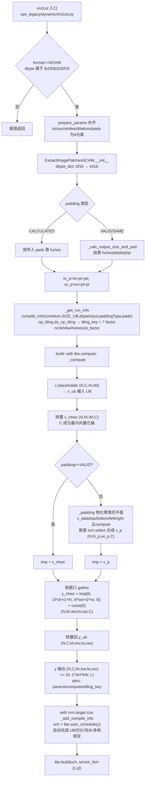
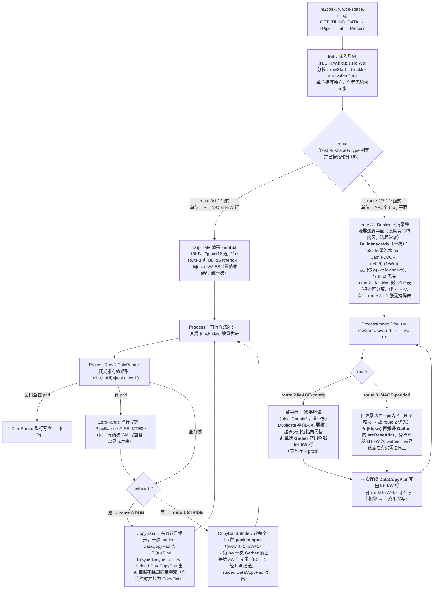

# Im2col 算子 AscendC 实现设计文档

# 需求背景（required）

## 需求来源

本需求来源于华为昇腾社区任务《Im2col算子开发任务书》（开源仓：https://gitcode.com/cann/ops-math ，验收后合入 `experimental/conversion`）。任务要求：参考昇腾版本内置 aclnnIm2col 算子的 TBE 实现，在昇腾 NPU 上基于 Ascend C 编程语言实现功能一致的算子，**并使其支持 BOOL 数据类型**，精度标准为**二进制一致**；完成算子设计、开发、测试全流程，验收阶段采用泛化数据进行功能、精度、性能全维度验证。

适配硬件为 Atlas A2 训练系列产品 / Atlas A3 系列产品，数据格式 ND，开发语言 Ascend C。

## 背景介绍

### Im2col算子实现优化

基于 Im2col 算子历史 TBE 版本使用 Ascend C 编程语言进行优化。

Im2col 算子（TBE）实现路径和相关 API 路径：

Im2col 算子实现路径为：`/usr/local/Ascend/ascend-toolkit/latest/opp/built-in/op_impl/ai_core/tbe/impl`

Im2col 算子实现中的 API 路径：`/usr/local/Ascend/ascend-toolkit/latest/python/site-packages/tbe/dsl`

Im2col 属于 legacy 算子，其 TBE 实现分布在 `impl/ops_legacy` 子树下。三条参考路径的**具体文件**如下：

| 参考项 | 具体路径与文件 |
| --- | --- |
| kernel 实现（入口） | `.../tbe/impl/ops_legacy/dynamic/im2col.py` |
| kernel 实现（真实计算） | `.../tbe/impl/ops_legacy/dynamic/extract_image_patches_nchw.py` |
| TBE DSL API | `/usr/local/Ascend/ascend-toolkit/latest/python/site-packages/tbe/dsl`（`tbe.compute` / `tbe.auto_schedule` / `tbe.build`） |
| 算子原型 | `/usr/local/Ascend/ascend-toolkit/latest/opp/built-in/op_proto/inc/transformation_ops.h` |
| 算子信息库 | `.../tbe/config/ascend910b/aic-ascend910b-ops-info-legacy.json` |

**入口与真实实现的分离**：`im2col.py` 本身不含计算，它先校验 `format` 必须为 `NCHW`、`dtype` 必须落在 float16/float/float32/bfloat16 之内，再把 `ksizes`/`strides`/`dilations`/`pads` 规整为 4 元/4 元形式，最后转交 `ExtractImagePatchesNCHW(...).build(kernel_name)`。因此**真正的 TBE 基线是 `extract_image_patches_nchw.py`**，本文后续的现状分析、流程图均以该文件为准。

需要说明的是，算子信息库中 Im2col 的 `dynamicShapeSupport` 与 `dynamicFormat` 均为 `true`，实际执行走的是上述 `ops_legacy/dynamic` 动态路径；`ops_legacy/im2col.py` + `im2col_common_func.py` 那条基于 NC1HWC0 + L1 + `load3d` + 分形的静态实现属于另一条历史实现，不在本次对标范围内。

该 TBE 基线以 TVM/TBE DSL 描述计算图，由 `tbe.auto_schedule` 自动生成调度、由 C++ tiling（`op_tiling.do_op_tiling`）下发 7 个切分因子（`n/c/kh/kw/ho/wo/ub`），其管线为 “搬入 UB → 转置为 NHWC → 物化零填充平面 → 按 (kh,kw,ho,wo) 取点 → 转置回 NCHW → 输出”。其中两次全张量转置的目的是把 **C 轴变为最内的向量化轴**；本次 Ascend C 实现全程保持 ND、不做转置、以 `L=Ho*Wo` 为向量化轴（两版的形态差异详见“TBE 实现现状分析”）。同时，TBE 的 `dtype_dict`已把 bfloat16 映射为 int16，说明 **TBE 自身也将 im2col 视为纯字节搬运**；但它不接收 bool，故任务书要求的 BOOL 支持需由 Ascend C 版本新增。

### Im2col算子TBE实现现状分析

Im2col 为 legacy 算子。入口 `impl/ops_legacy/dynamic/im2col.py` 只做 format/dtype 校验与属性归一化， 转交同目录 `extract_image_patches_nchw.py` 的 `ExtractImagePatchesNCHW`（真正的实现，基于 `tbe/dsl` + `auto_schedule`）。信息库 `dynamicFormat`/`dynamicShapeSupport` 均为 true → 实际走动态路径，**dtype 白名单在入口而非信息库生效**；静态 `ops_legacy/im2col.py`（NC1HWC0+load3d）仅为历史实现，不在此链路。

通过对Im2col算子TBE版本的功能分析，当前支持的能力如下：

| 参数 | 参数含义 | 数据类型 | 支持数据类型 | 约束 | 形状 |
| --- | --- | --- | --- | --- | --- |
| images | 输入特征图 | tensor | float16, float, float32, bfloat16 | format 必须为 NCHW；dtype 入口校验，**不支持 bool** | (N, C, Hi, Wi) |
| ksizes | 卷积核大小 | list_int | int64 | len 为 1/2 时补全为 [1,1,kh,kw] | (4,) |
| strides | 滑窗步长 | list_int | int64 | 同上，取 [1,1,sh,sw] | (4,) |
| dilations | 膨胀系数 rates | list_int | int64 | 同上，取 [1,1,rh,rw] | (4,) |
| padding_mode | 填充模式 | str | str | VALID/SAME/CALCULATED；前两者自算 pad | 标量 |
| pads | 填充大小 (pt,pb,pl,pr) | list_int | int64 | len1→四边同值，len2→[p0,p0,p1,p1]即H/W各同值；仅 CALCULATED 生效 | (4,) |
| y | 输出tensor | tensor | 与 images 一致 | 与 images 同 dtype | (N, C, kh, kw, ho, wo) |

计算公式（CALCULATED 分支）：

ho = (Hi + pt + pb − (rh*(kh−1)+1)) / sh + 1，wo = (Wi + pl + pr − (rw*(kw−1)+1)) / sw + 1

y[n,c,i,j,p,q] = x_p[n, p*sh+i*rh, q*sw+j*rw, c]，x_p 为零填充平面（物化生成），越界取 0。

补充：`dtype_dict`将 bfloat16 映射为 int16，另列 int8/uint8 —— **TBE 自身也按纯位宽（字节搬运）处理 Im2col**，但入口白名单外不可达；白名单无 bool，正是本任务需补齐的能力。


#### 入口与真实现

`im2col.py` 只做校验与规整：强制 `format=="NCHW"`、dtype 仅收 float16/float/float32/bfloat16、`prepare_params` 把 ksizes/strides/dilations/pads 补齐为 4 元素，随后整体转交 `ExtractImagePatchesNCHW(...).build`。算子以 `@register_operator("Im2col", pattern="ExtractImagePatches")` 注册。

#### 计算流水（`_compute`）

TBE 以 TVM DSL 逐级 `tvm.compute` 建图，四步：**转置 → 物化零填充平面 → 按窗口 gather → 转置回**。

1. `x` NCHW placeholder (N,C,Hi,Wi)→ `x_ub` 搬进 UB。
2. `x_nhwc[i0,i1,i2,i3]=x_ub[i0,i3,i1,i2]` 转成 (N,Hi,Wi,C)——**目的是让 C 轴成为最内的向量化轴**。
3. `_padding`在 (N,hi_p,wi_p,C) 上建 `x_data`/`top`/`bottom`/`left`/`right` 五个 compute，再由嵌套 `tvm.select` 按 i1/i2 落区合成 `x_p`——**TBE 自身也物化一张带零边界的平面**；VALID 时直接取 `x_nhwc`。
4. `y_nhwc = tmp[i0, i3*sh+i1*rh, i4*sw+i2*rw, i5] + const(0)`，形状 (N,kh,kw,ho,wo,C)；`+const(0)` 仅为给 auto_schedule 一个可调度的 elewise 节点。
5. `y_ub[i0,i1,i2,i3,i4,i5]=y_nhwc[i0,i2,i3,i4,i5,i1]` 转置回 (N,C,kh,kw,ho,wo)，`y` 输出即 (N, C\*kH\*kW, L)。

输出尺寸：CALCULATED 用传入 pads 算 ho/wo；VALID/SAME 由 `_calc_output_size_and_pad`自算 pad；`hi_p=hi+pt+pb`、`wi_p=wi+pl+pr`。

`dtype_dict`把 **bfloat16 映射为 int16**，int8/uint8/float16/float32 原样保留 —— 表明 TBE 亦将 im2col 视作纯位宽搬运；但入口未放开 int8/uint8/bool。

#### tiling 与 schedule

**tiling 不在 Python 侧**：const shape 由 `_get_run_info`组装 compile_info（coreNum、SIZE_UB、nchw_format、dtypeInput、paddingType、isBinary、isConst、pads）后调用 **`op_tiling.do_op_tiling`**交 C++ tiling 求解，decode 出 `tiling_key` 与 **7 个切分 factor**：n/c/kh/kw/ho/wo/ub_factor；动态 shape 时 7 个 factor 声明为 `var`、tiling_key=-1。

**schedule 由 `tbe.auto_schedule(y)` 自动完成**：TBE 不手写 schedule，UB 切分、流水与多核绑定全部由 auto_schedule 依据 attrs 中的 params/computes/tiling_key 与上述 factor 推导，最后 `tbe.build`。

#### TBE 实现流程图



### Im2col算子功能分析

Im2col算子功能：将输入特征图按 (kh, kw) 滑窗展开为列矩阵（等价于 torch.nn.functional.unfold），输出 (N, C*kh*kw, ho*wo)，采样越界处取 0。

输入：images；ksizes、strides、dilations、padding_mode、pads（属性）

输出：y

支持数据类型：float16、float32（float）、bfloat16（当前 TBE 版本**不支持 bool**）

支持广播：不涉及。Im2col 是单输入数据重排（搬运）类算子，输出每元素唯一映射到输入某元素或常量 0，无多输入 shape 对齐，故无广播语义。

# 需求分析

## 需求描述

参考 CANN 内置 aclnnIm2col 的 TBE 实现（入口 `impl/ops_legacy/dynamic/im2col.py`，实体 `impl/ops_legacy/dynamic/extract_image_patches_nchw.py`），使用 Ascend C 编程语言实现功能一致的 Im2col 算子，并使其**新增支持 BOOL 数据类型**；精度标准为二进制一致；在所有核参与计算场景下，BOOL 性能不低于原 TBE 算子的 FLOAT16，其余数据类型性能不低于原 TBE 算子同类型。

算子原型：

| 参数名 | 输入/输出/属性 | 描述 | 数据类型 | 数据格式 |
| --- | --- | --- | --- | --- |
| self | 输入张量 | 输入张量，shape 为 3 维或 4 维 | FLOAT16、FLOAT32、BFLOAT16、BOOL | ND |
| kernelSize | 输入数组 | 卷积核大小，size 为 2，[0] 表 H 方向、[1] 表 W 方向 | INT64 | - |
| dilation | 输入数组 | 膨胀参数，size 为 2 | INT64 | - |
| padding | 输入数组 | 填充大小，size 为 2 | INT64 | - |
| stride | 输入数组 | 步长，size 为 2 | INT64 | - |
| out | 输出张量 | 输出张量，shape 由参数推导 | FLOAT16、FLOAT32、BFLOAT16、BOOL | ND |

## 需求拆解

1. **功能与 TBE 对齐**：语义等价于 `torch.nn.functional.unfold`，覆盖 kernel/dilation/padding/stride 全参数组合与 3 维/4 维 ND 输入。
2. **新增 BOOL**：TBE 入口显式拒绝 float16/float/float32/bfloat16 之外的类型，BOOL 属任务书要求的范围外新增能力。TBE 自身的 `dtype_dict` 把 bfloat16 映射为 int16，说明 TBE 也把 Im2col 视为**纯位宽搬运**；本实现把这一共识推到底——按 `ES=sizeof(T)` 分 1B(BOOL/int8)/2B(FLOAT16、BFLOAT16)/4B(FLOAT32) 三档模板，BOOL 因而是零额外算法成本的自然扩展。
3. **精度二进制一致**：全流程只做数据搬运与索引选择，不含任何算术，位一致为构造性结论。
4. **性能不低于 TBE**：在所有核参与计算场景下，各 dtype 性能不低于 TBE 同类型（BOOL 对 TBE FLOAT16）。
5. **泛化**：任意合法 shape/属性均须正确，不得存在只在少数典型 shape 成立的实现。
6. 输入输出均为 ND 格式，不支持广播。

# 详细设计（required）

## 算子分析

### 数学公式

设输入 `x` 为 (N, C, H, W)（3 维输入视作 N=1），则

- `Ho = floor((H + 2*pH - dH*(kH-1) - 1) / sH) + 1`
- `Wo = floor((W + 2*pW - dW*(kW-1) - 1) / sW) + 1`
- `L = Ho * Wo`

输出 `y` 为 (N, C*kH*kW, L)：

```
y[n, c*kH*kW + kh*kW + kw, ho*Wo + wo]
 = x[n, c, ho*sH + kh*dH - pH, wo*sW + kw*dW - pW]
```

其中读取坐标越界（行/列落在 [0,H)/[0,W) 之外）时取 0。

### 支持数据类型

FLOAT16、FLOAT32、BFLOAT16、BOOL；输出数据类型与输入一致。

实现中数据类型坍缩为字节宽度：`ES=sizeof(T)`，BOOL=1B、FLOAT16/BFLOAT16=2B、FLOAT32=4B。FLOAT16 与 BFLOAT16 走**同一段机器码**。A2 无 1 字节向量指令，故 BOOL 在需要 Gather 的路径上经 half 通道中转——int8↔half 对全部 256 个字节值精确（均为 ≤2048 的整数），不引入任何数值变化。TBE 不支持 BOOL，故 BOOL 的性能基线按任务书取 TBE 的 FLOAT16。

### 支持形状

- 输入：4 维 (N, C, H, W) 或 3 维 (C, H, W)，格式 ND。
- 输出：4 维输入对应 (N, C*kH*kW, L)，3 维输入对应 (C*kH*kW, L)，格式 ND。
- 不支持广播；`kernelSize`/`dilation`/`padding`/`stride` 均为 size=2 的 INT64 数组（size=1 时按两轴同值处理）。

## 算子实现

### 实现方案

#### 3.2.1 host侧设计：

**tiling策略：**

Im2col 全程无算术，host 侧 tiling 只做三件事：推导输出几何、把 dtype 坍缩为字节宽度、按 UB 容量选路并定各缓冲区字节数；不做 TBE 式的 schedule 搜索（TBE 经 `op_tiling.do_op_tiling` 求 n/c/kh/kw/ho/wo/ub 七个 factor 后交 `tbe.auto_schedule`）。

**(1) 形状与属性归一化**：rank 仅接受 3/4，否则 GRAPH_FAILED；3D 视作 N=1，C/H/W 恒取末三维。五个属性按内置 GE 原型 `REG_OP(Im2col)` 的名字与顺序读取：`ksizes`(REQUIRED) / `strides` / `dilations` / `padding_mode` / `pads`。`ksizes/strides/dilations` 接受 1、2 或 4 个值（1 值广播到 H、W；4 值形如 TBE `prepare_params` 归一化后的 `[1,1,kh,kw]`，取末两位）；`pads` 接受 1/2/4 个值，语义为 `(top, bottom, left, right)`（`GetHW` / `GetPads4`）。

**(2) 输出几何与守卫**：

- effH=(kH−1)·dH+1，padH=H+2pH（W 向同理）
- Ho=(padH−effH)/sH+1，Wo=(padW−effW)/sW+1，L=Ho·Wo
- k/d/s 任一为 0 → GRAPH_FAILED
- **padH<effH 或 padW<effW → GRAPH_FAILED**：此时数学 floor 给出 Ho≤0，输出不存在。该守卫必须前置，因为它同时保证了无符号截断除法恒等于 floor。

★ 需向评审反馈的真实问题：内置 arch35 的 tiling/infershape 在此对**有符号负分子**直接做截断除法，当 1≤effH−padH≤sH−1 时截断得 0、反算出 Ho=1，为一个本不存在的输出编造一行。我们选择**拒绝**而非跟随该行为。

**(3) dtype→字节宽度**：es = 4(fp32) / 2(fp16、bf16) / 1(bool)。此后 tiling 只见 es 不见 dtype。TBE 的 dtype_dict 亦把 bfloat16 映射为 int16，可见"纯字节搬运"是双方共识；我们把它推到底，故 bool 免费。

**(4) UB 预算与选路**：ubCap = 平台实报 ubSize − UB_MARGIN(8192)。UB_MARGIN 为 TPipe 自身占用预留的经验余量。所有索引表与输出行共用**一个 pitch**：pitchEl=AlignUp(L,64)、idxPitchB=pitchEl·4、outPitchB=pitchEl·es——这是 route 2 能"单次 Gather 产出全部 kH·kW 行"的前提。容量式：

- need2 = 2·planeB2 + 2·outB + idxB2 + halfB2 + 1024
- need3 = planeB3 + 2·outB + idxB3 + halfB3 + 1024

选择顺序：ok 且 need2≤ubCap → route 2；否则 need3≤ubCap 且 H≤4095 → route 3；否则退回行式 route 0(sW==1)/1(sW>1)，UB 走固定预算（128KB；80KB+40KB+idx(≤16KB)+half）。ok 门槛含 L≤4096、kH·kW≤4095、非 identity。

##### 1. 分核策略：

只在**最外轴切一刀**，切分单位随路而变：

- rows = N·C（IMAGE 路，单位=一个 (n,c) 平面）
- rows = R = N·C·kH·kW（行式路，单位=一个输出行，长 L）
- cores₀ = min(rows, maxCores)，maxCores = GetCoreNumAiv
- rowsPerCore = ⌈rows / cores₀⌉
- **cores = ⌈rows / rowsPerCore⌉ ≤ cores₀**，最后 SetBlockDim(cores)

**回缩（第二式）的含义**：先按满核算出每核份额，再用份额反算真正需要的核数。以 rows=41、maxCores=40 为例，rowsPerCore=2；若仍开 40 核，则 39 个核只干 1 行、1 个核干墙钟同样是 2 轮却多付 19 个核的启动开销。回缩到 cores=⌈41/2⌉=21 后，核间负载差恒 ≤1 行且不申请空核。rows<maxCores 时 rowsPerCore=1、cores=rows，即"每核一个单位"，不凑满 40 核。

**无跨核同步**：每个平面（或每行）的输入读与输出写互不重叠，核间零通信。任务书要求的"所有核参与计算"场景成立：以 resnet28（N=8、C=64）为例，rows=512 → rowsPerCore=13 → cores=40 满核。

与 TBE 的对照：TBE 在 n/c/kh/kw/ho/wo 六轴求 factor 并交 auto_schedule 生成循环；我们的单位是整个平面（其整体驻留 UB 由 (4) 的容量式保证），故不切 L、无尾块逻辑。

##### 2. 数据分块和内存优化策略：

充分使用 UB 空间的原则。UB 上限取平台真值：`GetCoreMemSize(UB, ubSize)`，再减去 `UB_MARGIN`：

```
ubCap = (ubSize > 8192) ? ubSize - 8192 : 180KB
```

`UB_MARGIN=8192` 为 TPipe 自身占用（约 6KB，远多于按代码推断的 ≤6 个 buffer × 32B 取整 = ≤192B）预留的经验余量。取平台实报 `ubSize` 而非写死常量：写死 180KB 会丢掉 192KB UB 中的 12KB——在 L=3136 时正好是一整片索引表，直接决定 resnet 56×56 能否走 IMAGE 路。host 提供 `IM2COL_UB_MARGIN` 环境变量便于调整。

**公共量**：
```
pitchEl = alignUp(L, 64) // 64 = mask/CompareScalar 的粒度
idxPitchB = pitchEl * 4
outPitchB = pitchEl * es , outB = kH*kW * outPitchB
maskB = alignUp(ceil(pitchEl/8), 32)
```
pitch 取 64 元素而非 `alignUp(L*es,32)/es`：后者更省，但索引构建里的 CompareScalar/Select 按 64 元素成组，收紧到更省的粒度会与该成组边界冲突而产出错误结果。因 pitchEl 恒为 64 的倍数，`idxPitchB` 恒为 256B 的倍数、`outPitchB = 64*es` 对 es∈{1,2,4} 均为 32 的倍数——**对任意 dtype 自动 32B 对齐，无需按 es 分类讨论**。索引片与输出行**共用同一 pitch**，这正是 route 2 能用一次 Gather 产出全部 kH*kW 行的前提。

**`IdxSlices(nTab) = nTab + 4`**：`idxBuf_` 布局为 `[0..nTab)` 索引表 + `[nTab+0..nTab+3]` 四片 float 暂存 fh/fl/bf/tt。route 3 曾把它开码成 `4 * idxPitchB`（即 nTab+3），使 `tt` **整片落在缓冲区之外**。该缺陷极隐蔽：越界只在 L 逼近 4096（idxPitchB 达 16KB）且分配已贴近 cap 时才越过 192KB 物理 UB，且在 bool 上恰好落进 `halfBuf_` 内无害。修法是让两条路都只经此函数算尺寸。

**四条路的 UB 预算**：

| 路 | 预算 |
| --- | --- |
| 2 CONTIG | `planeB2 = alignUp(H*W*es,32)+32`（+32 为零槽）；`halfB2 = (es==1) ? alignUp(H*W*2,32)+64+kHkW*outPitchB*2 : 0`；`idxB2 = IdxSlices(kH*kW)*idxPitchB + (2+kH+kW)*maskB`；**`need2 = 2*planeB2 + 2*outB + idxB2 + halfB2 + 1024`** |
| 3 PADDED | `pWpad=alignUp(pW*es,32)/es`；`slack=alignUp(W*es,32)/es−W`；`P=alignUp((pWpad+W+max(pW,slack))*es,32)/es`；`planeB3=(H+2pH)*P*es`；`halfB3=(es==1)?planeB3*2+kHkW*outPitchB*2:0`；`idxB3 = IdxSlices(1)*idxPitchB`；**`need3 = planeB3 + 2*outB + idxB3 + halfB3 + 1024`** |
| 0 RUN | `dataBytes = 128KB`（qCopy_ 深度 2 → 每片 64KB）+ `zeroBytes = 8KB`；数据不过向量 |
| 1 STRIDE | `dataBytes=80KB`（qIn_ 每片 40KB）、`outBytes=40KB`（qOut_ 每片 20KB）、`idxBytes=min(alignUp(Wo*4,32), 16KB)`、`halfBytes=(es==1)?24KB:0` |

系数 2 来自双缓冲：route 2 的 `qIn_`/`qOut_` 均为深度 2；route 3 的平面是常驻 TBuf 单份，故 `need3` 只计一份 `planeB3`——这正是 route 3 的索引表比 route 2 小 kH*kW 倍、能覆盖 route 2 装不下的 shape 的原因。`halfB*` 仅 1 字节 dtype 存在：A2 无 1 字节向量 Gather，需 half 通道中转。

**分核**：IMAGE 路按 `rows = N*C` 个平面切，行式路按 `rows = R = N*C*kH*kW` 行切；`cores = min(rows, aivNum)`，`rowsPerCore = ceil(rows/cores)` 后回算 cores 去掉空核。两种单元**彼此完全独立，全程无跨核同步**。

##### 3. tilingkey 规划策略：

tilingkey 即 `route`，由 host 依 shape+dtype+attr 静态判定，kernel 按 route 分支；`es = sizeof(T)` 作模板参数（1B/2B/4B 三档，fp16 与 bf16 编出同一段机器码）。

先做合法性与资格判定：
```
identity = (kH==kW==1 && sH==sW==1 && pH==pW==0)
ok = !identity && 1<=L<=4096 && kH*kW<=4095 && H*W>=1
```

| # | 判定条件（自上而下首个命中） | route |
| --- | --- | --- |
| 0 | rank∉{3,4}，或 kH/kW/dH/dW/sH/sW 含 0，或 padH<effH‖padW<effW（Ho/Wo≤0） | GRAPH_FAILED |
| 1 | `ok && need2 <= ubCap` | **2 IMAGE-contig** |
| 2 | `ok && need3 <= ubCap && H <= 4095` | **3 IMAGE-padded** |
| 3 | 以上均不成立，且 `sW == 1` | **0 RUN** |
| 4 | 以上均不成立，且 `sW > 1` | **1 STRIDE** |

**route 2 先判**的理由是读形状差异：route 3 的零边界平面要按 H 个 `W*es` 窄块搬入，route 2 的连续平面一次平坦读完，故 route 2 优先，route 3 只接 route 2 装不下的 shape。

**identity 排除在 IMAGE 之外**：k=1,s=1,p=0 时 y 与 x 逐字节同构，RUN 已是一次纯连续 memcpy（数据不过向量），再经 Gather 只是徒增向量搬运。

**行式路只是兜底**：曾按单点设过 `w*es >= 64` 的门限，会让 bool 在能走 route 3 的几何上一路跌回 RUN 而更慢，**不存在应当回落行式路的宽度**，故门限已删除。host 保留 `IM2COL_ROUTE_FORCE`（只在真正装得下的路中钉选）与 `IM2COL_ROUTE_DEBUG`（打印 route 及各 buffer 字节数），便于四条路在同一构建上对照，且关闭时零开销。

与 TBE 基线的路由观对照：`ExtractImagePatchesNCHW` 只有**一条**流水（转置→物化零填充→取块→转置回），全部 shape 差异由 `op_tiling.do_op_tiling` 下发的 7 个切分因子（n/c/kh/kw/ho/wo/ub）+ `tbe.auto_schedule` 吸收；我们则把 shape 的结构性差异提到 host 做**离散选路**，各路 UB 布局互不干扰（"the paths never pay for each other"）。

##### 数据检测：

host 侧 `TilingFunc` 在选路前完成全部合法性校验，任一不满足即返回 `GRAPH_FAILED`，不进入
kernel：

| 检测项 | 判据 | 位置 |
| --- | --- | --- |
| 输入维度 | `rank == 3 或 4`，否则拒绝 | host tiling 入口 |
| 属性取值 | `kH,kW,dH,dW,sH,sW > 0` | 同上 |
| 填充取值 | `pads` 各分量 `>= 0`（uint32 语义天然保证） | `GetPads4` |
| 输出非空 | `H+pt+pb >= effH` 且 `W+pl+pr >= effW`，否则 Ho/Wo 将 `<= 0` | 见下方脚注 |
| VALID/SAME | 自算 pad 后仍需 `Ho >= 1 且 Wo >= 1` | `CalcModePad` |

其中 `effH = dH*(kH-1)+1`、`effW = dW*(kW-1)+1`。

> 脚注（供评审参考，非本算子约束）：`Ho = (H + pt + pb − effH) / sH + 1` 这一步用的是 C++ 的
> **截断除法**。当 `H + pt + pb < effH` 时被除数为负，截断除法向零取整而非向下取整，结果会与
> `floor` 语义不一致。本实现选择在此**直接拒绝**（该输入本就不存在合法输出）。我们注意到内置
> arch35 实现的 tiling/infershape 在同一位置也使用截断除法，推测在 `1 <= effH − (H+pt+pb) <= sH−1`
> 时会得到 `Ho = 1` 而非空输出；但我们**未读到其 tiling 源码**，此处仅作为数学层面的提示，
> 不作为对内置实现的结论。

#### 3.2.2 kernel侧设计：实现描述

kernel 固定为 **Init + Process 两阶段**，Process 内部严格是 **CopyIn / Compute / CopyOut 三段**。四条路共用这一骨架，差别只在 CopyIn 的粒度与 Compute 段是否存在：

| 路 | Init | CopyIn | Compute | CopyOut |
| --- | --- | --- | --- | --- |
| 0 RUN (sW==1) | Duplicate 零块 | 有效矩形一次 strided DataCopyPad | **无**（数据不过向量） | 一次 strided DataCopyPad |
| 1 STRIDE (sW>1) | BuildGatherIdx：idx[i]=i*sW*ES | 每 ho 的 packed span | 每 ho 一次 Gather | strided 写 |
| 2 IMAGE-contig | BuildImageIdx（kH*kW 张带掩码表） | 整平面平坦读 1 次 | **单次** Gather 出全部 kH*kW 行 | 一次连续写 kH*kW 行 |
| 3 IMAGE-padded | Duplicate 零边界平面 + BuildImageIdx（1 张表） | 平面内部 refill（H 个窄块） | kH*kW 次 Gather，(kh,kw) 走 srcBaseAddr | 同上 |

**一、Init**：与 shape 相关、与循环无关的工作全部前置一次。分核在此完成——IMAGE 按 u=n*C+c 个平面切，RUN/STRIDE 按 R=N*C*kH*kW 行切（rowStart_/rowEnd_，kernel）。行与平面在 y 中互不相交，写不重叠，**故无任何跨核同步**。索引表只依赖 (kh,kw,ho,wo)、与 (n,c) 无关，因此 Init 建一次、Process 全程复用。

**二、CalcRange 闭式**。令 `a = k*d - p`，则 `index(o)=o*s+a ∈ [0,In)` 等价于

 lo = max(0, ceil(-a/s))，hi = min(Out, ceil((In-a)/s))

区间外恒为 0。C++ 整除向零截断、分子可负，故须**负分子守卫**：`a>=0` 时 lo=0，否则 `CeilDivU((uint32_t)(-a), s)`；`b=In-a<=0` 时 hi=0；末尾 clamp 到 [0,Out] 并保证 hi>=lo。host 侧 ValidRange（host）是同一闭式的 int64 版本，两侧必须一致。

**三、BuildImageIdx 向量流水**。读地址可分解为 `off(kk,l) = base[l] + cOff(kk)`，`base[l] = (ho*sH*P + wo*sW)*laneBytes`。ho=l/Wo 无向量整除指令 → 用 fp32 流水：`CreateVecIndex → Adds(+0.5) → Muls(1/Wo) → Cast(FLOOR)` 得 ho，再 `Muls/Sub` 得 wo，`Muls/Add` 合成 base，末尾 `Cast(RINT)` 落 int32。这是**精确而非近似**：+0.5 使每个 l 距边界留 0.5/Wo 余量，而倒数误差约 Ho*2^-23，L=Ho*Wo<=4096 时余量约 1000 倍。掩码构造利用**可分离性**——ho 的合法范围只依赖 kh、wo 只依赖 kw——只建 kH+kW 次而非 kH*kW 次。

**四、越界的两种处理**。route 2 平面连续，越界 wi 会绕进邻行，故每 (kh,kw) 一张表，`Select` 把非法项打到平面末尾的**零槽** zLane_；route 3 物化**零边界平面**（TBE `_padding` 同思路），越界读天然落在真零上 → 免掩码、单表、(kh,kw) 并入 Gather 的 srcBaseAddr。零边界仅在 Init `Duplicate` 一次，之后每平面 DMA 只 refill 内部，其 rightPadding 顺带重零 32B 取整尾，边界终生有效。

**五、GatherRows**。route 2 令索引表 pitch 与输出行 pitch 同为 outPitch_，于是 `Gather(dst, src, idx, 0, kH*kW*outPitch_)` **一次**产出全部行；再借 y 内 kH*kW 行相邻合成单次 DataCopyPad —— 每平面 3 个 op，而行式路每行需多条指令。

**六、BOOL 的 half 通道**。A2 无 1 字节向量指令，需 Gather 的路上走 int8→half→int8；256 个字节值皆为 <=2048 的整数，half 可精确表示且反向 Cast 不饱和，**位一致仍构造性成立**。STRIDE 上进一步把整个 band 的 gather 结果暂存 half lane、band 结束后**一次 Cast 合并**回 int8，替代每行一次 Cast；代价是 half lane 成为行数约束项 byHalfRows。

**七、同步**。三段式的 `EnQue/DeQue` 自动插入队列同步，不手写 SetFlag。需手动的仅三处：① Init 的 Duplicate → 首次使用（V_MTE3 / V_MTE2）；② route 3 每平面 Gather 完成 → 下一次 refill（V_MTE2）；③ **RUN 路 ZeroRange 之后必须 `PipeBarrier<PIPE_MTE3>`**——整行置零与有效 band 在 GM 上重叠写且**不隐式有序**，漏掉会导致确定性错误。整行置零而非精确补洞是权衡：只补空隙需每行最多 2*hoCnt 次单元素写，重写 L 个零只是一次宽 DMA。

**AscendC 实现流程图**



**读图说明**：图与 kernel 实现一一对应——`Init`只做分核与"建一次"的准备（零块 / 索引表 / 零边界平面），`Process`按 host 定好的 `route` 分派，四条路的差别集中在中段：**route 0 RUN** 数据全程走 DMA、不碰向量；**route 1 STRIDE** 每个 `ho` 付一次 Gather；**route 2 IMAGE-contig** 一读一 Gather 一写，靠零槽消掉越界；**route 3 IMAGE-padded** 用物化零边界换掉掩码，把 (kh,kw) 折进 `srcBaseAddr`。行式路的单位是输出行、平面式路的单位是 (n,c) 平面，两者都因单位独立而无需任何跨核同步。

#### 3.2.3 AscendC 流程图与 TBE 流程图的差异点和原因

> 本节对标的 TBE 基线是 **`impl/ops_legacy/dynamic/extract_image_patches_nchw.py`**
> （`aclnnIm2col` 在 910B 上的实际下发路径，由入口转交）。
> 另一条静态实现 `ops_legacy/im2col.py` + `im2col_common_func.py`（NC1HWC0 + L1 + `load3d`
> + 分形）不在该链路上，本节不以其为对照。

##### 3.2.3.1 两条流水线的并置

**TBE 基线**（`ExtractImagePatchesNCHW._compute`）

```
x (GM, NCHW)
 └─ x_ub = x 搬入 UB
 └─ x_nhwc 【转置 → (N, Hi, Wi, C)】
 └─ _padding 【物化零填充平面 (N, Hi+pt+pb, Wi+pl+pr, C)】
 由 x_data / top / bottom / left / right 五个 compute
 经嵌套 tvm.select 合成 x_p
 └─ y_nhwc (N, kh, kw, ho, wo, C)
 = x_p[i0, i3·sh+i1·rh, i4·sw+i2·rw, i5] + const(0)
 └─ y_ub 【转置回 → (N, C, kh, kw, ho, wo)】
 └─ y (GM)
tiling: op_tiling.do_op_tiling（C++ tiling），7 个 factor n/c/kh/kw/ho/wo/ub
schedule: tbe.auto_schedule(y)
```

**本实现**（route 2 = IMAGE-contig）

```
x (GM, ND (N,C,H,W))
 └─ DataCopyPad blockCount=1 整平面一次平坦读
 └─ Gather ×1 一张 pitch 对齐索引表，一次产出全部 kH·kW 行
 └─ DataCopyPad blockCount=kH·kW 一次连续写
 └─ y (GM, ND (N, C·kH·kW, L))
```

每平面 **3 条指令**；无转置、无 workspace、无跨核同步。route 0（RUN，sW==1）更短：
`GM →DataCopyPad→ UB →DataCopyPad→ GM`，**数据一次向量单元都不过**。

##### 3.2.3.2 差异点总表

| 环节 | TBE 基线做法 | 本实现做法 | 原因 / 收益 |
| --- | --- | --- | --- |
| **数据格式与向量化轴** | 入口强制 `format=="NCHW"`，随后**转置成 NHWC**，算完再**转置回 NCHW**。目的是让 **C 成为最内轴**：对固定 (kh,kw,ho,wo)，`y_nhwc[...,i5]` 沿 C 连续 → 取窗退化为 **memcpy** | 全程 **ND**，不转置。向量化轴是 **L = Ho·Wo**：对固定 (n,c,kh,kw)，输出是 y 中长 L 的连续区间，用一次 Gather 取出 | 这是两版**最本质**的形态差异：二者以相反的机理各自承担开销——TBE 用两次全张量转置换来"取窗=memcpy"，代价是转置本身（scalar-bound）；本实现省掉转置，代价是 sW 步长的 Gather（Gather-bound） |
| **零填充** | **物化零填充平面**：`_padding` 用 x_data/top/bottom/left/right 五个 compute + 嵌套 `tvm.select` 合成 `x_p`，越界读天然落在真零上 | **同一思路，且是三条路之一**：route 3 在 Init 期一次性清零 `(H+pt+pb)×P` 带零边界平面，此后每平面只回填内区；route 2 改用**零槽索引**（越界项指向平面末尾的零，省掉物化）；route 0/1 整行写零后由有效矩形覆盖 | 物化零边界的思路**与 TBE 一致，非我们独创**。差别在我们多了两条不物化的路：route 2 用一次 Gather 就把"补零"和"取窗"合成一步，route 0/1 连向量都不用 |
| **dtype 处理** | `dtype_dict`把 **bfloat16 映射为 int16**，int8/uint8 独立成档 → **TBE 自身也把 im2col 当纯位宽搬运**。但入口白名单仅 `float16/float/float32/bfloat16` | `KernelIm2col<T>` 只有 `static constexpr uint32_t ES = sizeof(T)`，全部分支由 ES 决定；host 只做 dtype→字节宽度映射（1B/2B/4B 三档） | **同源结论**。仓内官方 arch35 kernel（`im2col_apt.cpp`）做得更彻底：`if constexpr (sizeof(DTYPE_X)==sizeof(int8_t)) ...<uint8_t>` 四档 uint8/16/32/64。我们与华为的演进方向一致 |
| **BOOL 支持** | 入口白名单**无 bool**，尽管 `REG_OP(Im2col)` 的 `.INPUT(x, TensorType({RealNumberType, DT_BOOL, ...}))` **早已声明 DT_BOOL** | BOOL 即 ES==1，与 int8 同一条码路。route 0 纯 DMA，零额外成本；需 Gather 的路经 half 通道中转（A2 无 1 字节向量指令） | **我们不是扩展原型，而是兑现原型早已承诺、TBE 实现却在入口拒收的能力**。位宽坍缩后 BOOL 不是新算法，只是既有 1B 路的一个 dtype。half 中转的精确性同样是构造性的：256 个字节值都是 ≤2048 的整数，half 精确表示，反向 Cast 不会饱和 |
| **tiling / 调度** | `op_tiling.do_op_tiling` 下发 **7 个 factor**（n/c/kh/kw/ho/wo/ub），调度交给 `tbe.auto_schedule`自动生成 | 自写 `TilingFunc`：推导 Ho/Wo → dtype 坍缩为字节宽度 → 按 UB 容量在 **4 条路**中选路并定各缓冲区字节数。无 schedule 搜索 | 我们不搜切分空间，而是**换问题的形状**（平面驻留）。选路条件是闭式的、可在文档里逐条写出（3.2.1），代价是策略空间小于 auto_schedule |
| **分核** | 由 C++ tiling 求 n/c/kh/kw/ho/wo 六轴 factor | **一维**：IMAGE 按 N·C 个平面、行式路按 R=N·C·kH·kW 行；`cores=min(rows, aivNum)` | 平面之间 / 行之间**完全独立**（每行是 y 中长 L 的连续区间）→ **无跨核同步，一条 barrier 都没有** |
| **动态 shape** | shape 含 -1/-2 时 `is_const=False`，n/c/hi/wi 与 7 个 factor 全部变成 `var`，`tiling_key=-1` | 每次 tiling 按实际 shape 计算，不走 binary/动态分支 | 本任务验收采用泛化数据的**具体 shape**，不涉及 binary 编译场景 |
| **padding_mode** | VALID/SAME 由 `_calc_output_size_and_pad` 自算 pad，SAME 在总 pad 为奇数时产生 `pt != pb` | **完全一致**：`CalcModePad` 照搬同一算法；`pads` 按 4 值 (top,bottom,left,right) 处理 | padding_mode 与 4 值 pads 支持见"算子约束限制"与可维可测分析 |

## 支持硬件

| 支持的芯片版本 | 涉及勾选 |
| --- | --- |
| Atlas A2 训练系列产品 | √ |
| Atlas A3 系列产品 | √ |

## 算子约束限制

与 host 侧 Tiling 中的实际校验一一对应：

1. 输入张量的维度必须是 3 维或 4 维，否则 tiling 返回 `GRAPH_FAILED`。
2. `kernelSize`、`dilation`、`padding`、`stride` 的 size 必须为 2。
3. `kernelSize`、`dilation`、`stride` 的值必须大于 0。
4. `padding` 的值不能小于 0。
5. 必须满足 `H + 2*pH >= dH*(kH-1)+1` 且 `W + 2*pW >= dW*(kW-1)+1`，否则 Ho/Wo 将 ≤ 0，属非法配置，tiling 直接拒绝。（说明：内置 arch35 版本此处使用截断除法，在 `1 <= 填充后尺寸 - 有效核尺寸 <= stride-1` 时会误报 Ho=1；本实现选择显式拒绝而非产出错误 shape。）
6. 不支持广播。

**关于内部阈值的说明（避免误读为功能缺失）**：实现内部存在 `L <= 4096`、`kH*kW <= 4095`、单个 (n,c) 平面须驻留 UB 等条件，这些**仅是 host 侧的选路（tilingKey）判据**——用于决定走平面驻留的 IMAGE 路还是逐行路，**不是对用户输入的功能约束**。任何满足上述 1~6 条的合法 shape 都必有可执行路径：不满足 IMAGE 条件时由逐行路（sW==1 走 RUN、sW>1 走 STRIDE）无条件兜底，功能覆盖完整。

# 可维可测分析

## 精度标准/性能标准

| 验收标准 | 描述(不涉及说明原因) | 标准来源 |
| --- | --- | --- |
| 精度标准 | **二进制一致（bit-exact）**：FLOAT16/FLOAT32/BFLOAT16/BOOL 四种 dtype 逐字节相同。本算子为纯字节搬运，二进制一致是**构造性**成立而非"误差落在阈值内"（见下文"为什么是构造性满足"）。 | 任务书"功能实现要求"第 1 条（二进制一致）、"精度要求" |
| 性能标准 | **所有核参与计算场景**下：BOOL 不低于 TBE 的 FLOAT16，其他 dtype 不低于 TBE 同 dtype。 | 任务书"性能要求"第 1、2 条 |

### 精度标准：为什么是构造性满足

#### 1. 算子语义中不含任何数值运算

```
Ho = floor((H + 2pH - dH*(kH-1) - 1)/sH) + 1，Wo 同理，L = Ho*Wo，R = N*C*kH*kW
y[n, c*kH*kW + kh*kW + kw, ho*Wo+wo] = x[n, c, ho*sH+kh*dH-pH, wo*sW+kw*dW-pW]，越界取 0
```

全式只有**下标算术**与**零填充**，对数值本身没有任何加、乘、累加或类型提升。输出字节是输入字节的重排，不存在舍入、溢出、累加误差的来源。

#### 2. 代码层面 dtype 已坍缩为字节宽度

- kernel：`static constexpr uint32_t ES = sizeof(T);`。此后 dtype 只以 `ES` 参与 `DataCopyPad` 的 blockLen / srcStride / dstStride 计算，不出现任何按 dtype 分支的数值处理。
- host：`uint32_t es = (dt == ge::DT_FLOAT) ? 4 : ((dt == ge::DT_BOOL) ? 1 : 2);`。全部 UB 预算算术只用 `es`。

即 FLOAT16 / BFLOAT16 / FLOAT32 / BOOL 共用同一份字节搬运代码，按 1B / 2B / 4B 三路分流。**因此二进制一致是被构造出来的性质，不是测出来的结果**；同理，**BOOL 是"免费"支持的**——它就是 1 字节通道（int8 同宽），不需要为它写任何专门的数值逻辑。

#### 3. 唯一与 dtype 相关的处理：1 字节经 half 通道中转，仍位精确

A2 无 1 字节向量指令，故 `ES==1` 在需要 Gather 的路径（route 1 STRIDE、route 2/3 IMAGE）经 half 通道中转：
`Cast(int8→half, CAST_NONE)` → `Gather` → `Cast(half→int8, CAST_RINT)`。

这仍然是位精确的：全部 256 个字节值都是绝对值 ≤ 128 的整数，half 对 ≤ 2048 的整数可精确表示，反向 `CAST_RINT` 既不会舍入也不可能饱和（BOOL 的合法值更只有 0/1）。中转不引入任何数值误差，二进制一致不被破坏。

#### 4. 零填充是按字节写零

A2 无 1 字节 `Duplicate`，故零缓冲经 uint16 reinterpret 一次性置零：`AscendC::Duplicate(z16, (uint16_t)0, zeroBytes_ / 2)`；route 3 同理在 Init 阶段把整张 padded 平面预置零。全零字节对四种 dtype 恰好都是各自的零（FLOAT16/BFLOAT16/FLOAT32 的 +0.0 位型为全零，BOOL 的 false 为 0x00），因此零填充同样不需要按 dtype 分支。

## 兼容性分析

**新增算子，不涉及存量兼容性影响。** 具体依据如下：

### 1. A2/A3 上 Im2col 此前只有 TBE 实现，没有 AscendC 实现

| 交付物 | 存量 TBE 路径 |
| --- | --- |
| kernel 实现 | `/usr/local/Ascend/ascend-toolkit/latest/opp/built-in/op_impl/ai_core/tbe/impl/ops_legacy/dynamic/im2col.py`（同目录 `ops_legacy/im2col.py`、`ops_legacy/im2col_common_func.py`） |
| 算子原型 | `/usr/local/Ascend/ascend-toolkit/latest/opp/built-in/op_proto/inc/transformation_ops.h` |
| 算子信息库 | `/usr/local/Ascend/ascend-toolkit/latest/opp/built-in/op_impl/ai_core/tbe/config/ascend910b/aic-ascend910b-ops-info-legacy.json`（KEY: `Im2col`，`opFile`/`opInterface` 均为 `im2col`） |

### 2. 开源仓内既有的 AscendC 版 `conversion/im2col` 是 ascend950/arch35 专属，不覆盖 A2/A3

- `conversion/im2col/CMakeLists.txt`：`COMPUTE_UNIT ascend950` + `TILING_DIR arch35` + `DISABLE_IN_OPP TRUE`
- `op_host/config/` 下只有 `ascend950/`（`im2col_binary.json`、`im2col_simplified_key.ini`）
- `op_host/im2col_def.cpp`：只有 `this->AICore.AddConfig("ascend950", aicore_config)`
- tiling 与 kernel 全部位于 arch35 子目录：`op_host/arch35/im2col_tiling_arch35.cpp`、`op_kernel/arch35/{im2col_gather_cut_hw.h, im2col_gather_cut_nc.h, im2col_norm_NHWC.h, im2col_simt_NCHW.h, im2col_simt_NHWC.h}`
- 其 README「产品支持情况」虽给 A2/A3 打 √，但正文写明：「Atlas A3 训练系列产品/Atlas A3 推理系列产品、Atlas A2 训练系列产品/Atlas A2 推理系列产品：**仅支持FLOAT、FLOAT16、BFLOAT16**」——即 A2/A3 上可用的恰是 TBE 的三种 dtype，README 参数表中列出的 15 种 dtype（含 BOOL）只在 950 上由 arch35 的 AscendC 实现提供。

→ 本算子**只新增 A2/A3 路径**：不改动 950 的 arch35 实现，不改动 TBE 存量实现，两者行为均不受影响。

### 3. BOOL 是净新增能力，不改变任何存量行为

- TBE 侧三处 dtype 关口都**不含 BOOL**：
 - 入口 `im2col.py` 白名单：只接受 `float16 / float / float32 / bfloat16`
 - 实体 `extract_image_patches_nchw.py` 的 `dtype_dict`：覆盖 `int8 / uint8 / float16 / float / float32`（bfloat16 映射为 int16）
 - 其 `op_select_format`：unknown-shape 为 `"float16,float,bfloat16"`，static 为 `"float16,float,int8,uint8"`
- 而开源仓的 Im2col 原型与 OpDef **已经声明**了 BOOL：
 - `conversion/im2col/op_graph/im2col_proto.h`：`REG_OP(Im2col).INPUT(x, TensorType({RealNumberType, DT_BOOL, DT_COMPLEX32, DT_COMPLEX64}))`
 - `op_host/im2col_def.cpp`：dtype 列表含 `ge::DT_BOOL`

→ 在 A2/A3 上补 BOOL 属于"**把已声明、但 A2/A3 上尚无实现的能力补齐**"，不需要改动原型；且由于纯字节搬运（"精度标准"一节），新增 BOOL 不会改变任何已有 dtype 的输出。

### 4. 合入前需对齐的接口/命名（兼容性关注点）

- **属性命名（已对齐）**：本实现的 OpDef 与仓内 `Im2col` 原型 1:1 对齐——`ksizes`(REQUIRED) / `strides`({1}) / `dilations`({1}) / `padding_mode`("CALCULATED") / `pads`({0})，含 4 值 pads 与 VALID/SAME/CALCULATED 三种模式。属性名与顺序均按内置 `REG_OP(Im2col)`，无需额外适配。
- **合入形态**：仓内 `conversion/im2col` 已存在 `class Im2col`（15 种 dtype、5 属性），目前只有 `AddConfig("ascend950", ...)`。本任务的合入动作是：(1) 为该 OpDef 增加 `AddConfig("ascend910b")` 与 `AddConfig("ascend910_93")` 并挂上本实现的 tiling/kernel；(2) 在 `op_api/aclnn_im2col.cpp` 的 **A2/A3 dtype 白名单** `DTYPE_SUPPORT_LIST`（当前仅 `{DT_FLOAT, DT_FLOAT16, DT_BF16}`）中加入 `DT_BOOL`——任务书"使其支持 bool"在代码上即这一处；(3) `CMakeLists.txt` 由 arch35 独占式（`COMPUTE_UNIT ascend950 TILING_DIR arch35`）改为多 arch 形态（范本：`conversion/chunk_cat`）。
- **同目录已有近名算子**：PR 落点 `experimental/conversion/` 下已存在 OpType **`Im2Col`**（HIT/AISS 贡献）：输入 `x` → 输出 **`z`**，8 个标量 Int 属性 `kernel_h/kernel_w/stride_h/stride_w/pad_h/pad_w/dilation_h/dilation_w`，dtype 仅 `{DT_FLOAT, DT_FLOAT16}`，`opFile.value="im2_col"`，`AddConfig("ascend910b")`。它与本算子 **`Im2col`**（aclnn 语义、ListInt 属性对、四 dtype）仅一个字母大小写之差，是两个不同算子。合入前需确认 `OpType` ↔ `opFile` ↔ `opInterface` 命名链不冲突。

### 5. 硬件覆盖

本实现无 arch 专属代码或指令，跨 A2/A3 的可移植性来自两点：核数取平台真值 `plat.GetCoreNumAiv`、IMAGE 路的 UB 预算取平台真值 `ubSize - UB_MARGIN`；RUN/STRIDE 路使用固定预算（128KB / 80+40+24KB，均在 192KB UB 之内）。当前工程注册了 `AddConfig("ascend910b")`，交付版需按同一份 kernel 补注册 A3（`ascend910_93`）配置以覆盖任务书要求的 A2/A3——这是配置项补充，不涉及实现改动。

| 支持的芯片版本 | 涉及勾选 |
| --- | --- |
| Atlas A2 训练系列产品 | √ |
| Atlas A3 系列产品 | √ |
