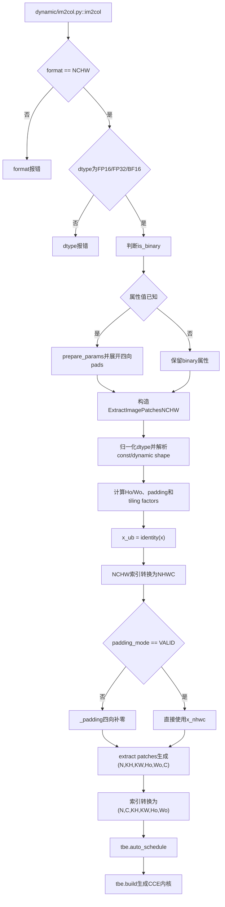
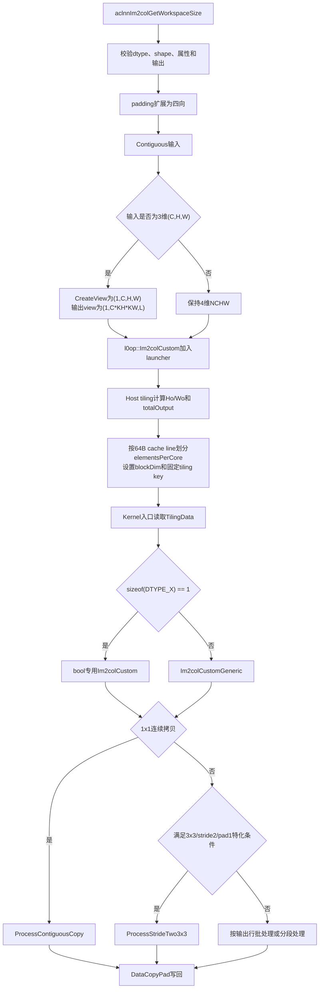

# Im2col算子开发设计文档

# 需求背景

## 需求来源

本需求来源于 CANN 社区任务 2026 年 5 月发放的 `Im2col` 算子开发任务。任务要求参考
CANN 内置 `aclnnIm2col` 的 TBE 实现，使用 Ascend C 实现功能一致的算子，并新增
`bool` 数据类型支持。

适配硬件为 Atlas A2 训练系列产品和 Atlas A3 系列产品。交付内容包括算子代码、README、
aclnn 调用测试、自验证报告和通过评审的设计文档。

## 背景介绍

### Im2col算子实现优化

`Im2col` 将输入图像的滑动窗口展开为列矩阵，常用于将卷积转换为矩阵乘法。该算子只进行
数据重排和越界补零，不改变有效输入元素的数值。

本任务需要保持 `aclnnIm2col` 的接口语义，覆盖原有浮点类型，并为 `bool` 增加一条
Ascend C 实现路径。

### Im2col算子（TBE）实现路径和相关API路径

以下路径基于 CANN 8.5.2 安装环境、ascend910b算子信息库和 `ops-math` 接口源码核验。安装路径中的 `{ASCEND_OPP_PATH}` 在本次调查环境中为`/home/developer/Ascend/cann-8.5.2/opp`。

| 层级 | 文件路径 | 作用 |
| --- | --- | --- |
| aclnn接口 | `ops-math/conversion/im2col/op_api/aclnn_im2col.cpp` | 参数校验、连续化、3维输入补batch维、NCHW格式规整和输出恢复 |
| l0op封装 | `ops-math/conversion/im2col/op_api/im2col.cpp` | 推导输出shape，将属性映射到内部 `Im2col` 并加入AICore launcher |
| ascend910b算子信息库 | `${ASCEND_OPP_PATH}/built-in/op_impl/ai_core/tbe/kernel/config/ascend910b/ops_legacy/im2col.json` | 注册9个NCHW动态二进制条目 |
| TBE动态入口 | `${ASCEND_OPP_PATH}/built-in/op_impl/ai_core/tbe/impl/ops_legacy/dynamic/im2col.py` | 校验NCHW和dtype，展开属性并创建 `ExtractImagePatchesNCHW` |
| TBE动态实现 | `${ASCEND_OPP_PATH}/built-in/op_impl/ai_core/tbe/impl/ops_legacy/dynamic/extract_image_patches_nchw.py` | 构造padding、滑窗提取和布局变换计算图，并执行auto schedule和build |
| TBE legacy参考 | `${ASCEND_OPP_PATH}/built-in/op_impl/ai_core/tbe/impl/ops_legacy/im2col.py` | 静态shape的NC1HWC0、L1/UB和无Cbuf实现，仅作为辅助参考 |
| TBE legacy公共函数 | `${ASCEND_OPP_PATH}/built-in/op_impl/ai_core/tbe/impl/ops_legacy/im2col_common_func.py` | legacy路径的 `im2col_compute` 和 `im2col_schedule` |
| 算子原型 | `${ASCEND_OPP_PATH}/built-in/op_proto/inc/transformation_ops.h` | `REG_OP(Im2col)` 原型定义 |

接口层完成以下映射：
1. `self` 为3维 `(C,H,W)` 时，在第0维补batch维，统一为4维NCHW输入。
2. 非连续输入先执行 `Contiguous`。
3. `padding=[paddingH,paddingW]` 扩展为
   `pads=[paddingH,paddingH,paddingW,paddingW]`。
4. l0op将 `kernelSize、stride、dilation、"CALCULATED"、pads` 下发给内部 `Im2col`。
5. 3维输入计算完成后去除batch维，恢复为2维输出。

### Im2col算子TBE实现现状分析

#### TBE支持的数据类型和数据格式

910B 的内置 Im2col TBE 配置覆盖 FP16/FP32/BF16 和 `CALCULATED/SAME/VALID` 三种 padding 模式，总共 9 个动态 NCHW 条目；当前公开 `aclnnIm2col` API 使用显式 `padding` 参数，并固定映射到 `CALCULATED` 模式。本文以 ascend910b 注册的动态 NCHW TBE 路径作为基线；legacy 静态实现用于补充说明历史调度结构。

| 层级 | 数据类型 | 数据格式 | 说明 |
| --- | --- | --- | --- |
| ascend910b算子信息库 | `float16`、`float32`、`bfloat16` | `NCHW` | 注册为动态Im2col，覆盖 `CALCULATED/SAME/VALID` 三种padding模式 |
| `dynamic/im2col.py` | `float16`、`float32`、`bfloat16` | `NCHW` | 910B动态入口，完成参数校验和属性规整 |
| `dynamic/extract_image_patches_nchw.py` | `float16`、`float32`、`bfloat16` | 逻辑输入 `NCHW` | 动态NCHW主实现，构造padding、滑窗提取、布局变换和build流程 |
| legacy静态实现 | 以浮点路径为主，部分分支涉及整数类型 | `NCHW/NHWC` 转内部 `NC1HWC0` | 静态shape和旧调度路径，仅作为实现参考 |
| **本任务新增（Ascend C `Im2colCustom`）** | **`NCHW`** | **`float16`、`float32`、`bfloat16`、`bool`** | **对齐内置浮点语义，新增 `bool` 支持，由自定义 Ascend C Kernel 实现** |

#### 动态TBE实现描述

**1. `dynamic/im2col.py`入口**

1. `@register_operator("Im2col", pattern="ExtractImagePatches")` 注册动态入口。
2. 校验输入format必须为 `NCHW`，dtype必须为
   `float16/float32/bfloat16`。
3. 通过 `None in (ksizes, strides, dilations, pads)` 判断属性是否为binary形式。
4. 属性已知时，`prepare_params` 将长度1或2的
   `ksizes/strides/dilations` 扩展为4维形式，并将pads扩展为四向。
5. 创建 `ExtractImagePatchesNCHW` 对象并调用 `build(kernel_name)`。

**2. `ExtractImagePatchesNCHW`初始化**

1. 归一化dtype；其中bfloat16在TVM内部按16位承载类型处理。
2. 根据shape中是否包含 `-1/-2` 区分常量shape和动态shape。
3. 解析 `kh/kw、sh/sw、rh/rw、pt/pb/pl/pr`。
4. `CALCULATED` 使用显式公式计算 `Ho/Wo`；
   `SAME/VALID` 通过 `_calc_output_size_and_pad` 计算输出尺寸和padding。
5. 常量shape调用 `op_tiling.do_op_tiling` 获取tiling key及
   `n/c/kh/kw/ho/wo/ub` 七个factor；动态shape使用TVM变量表示。

**3. `_compute()`计算图**

1. 创建输入placeholder，并通过 `x_ub=identity(x)` 标记UB计算节点。
2. 将逻辑索引从 `NCHW` 转换为 `NHWC`。
3. 非 `VALID` 模式调用 `_padding()`，通过四向 `tvm.select` 生成补零张量。
4. 生成6维滑窗结果：
   `y_nhwc[n,kh,kw,oh,ow,c] =
   x[n,oh*sh+kh*rh,ow*sw+kw*rw,c]`。
5. 将索引顺序转换为 `(N,C,KH,KW,Ho,Wo)`。
6. 生成输出tensor；其flatten语义为
   `(N,C*KH*KW,Ho*Wo)`。

**4. `build()`构建过程**

`build()` 依次执行 `tbe.compute()`、`_compute()`、注册compile info、`tbe.auto_schedule(y)` 和 `tbe.build(...)`，最终生成CCE内核二进制。

#### 动态TBE源码构建流程图



### Im2col算子功能分析

设输入为 `(N,C,H,W)`，属性为 `(kernelH,kernelW)`、`(dilationH,dilationW)`、
`(paddingH,paddingW)` 和 `(strideH,strideW)`：

```text
outH = floor((H + 2*paddingH - dilationH*(kernelH-1) - 1) / strideH + 1)
outW = floor((W + 2*paddingW - dilationW*(kernelW-1) - 1) / strideW + 1)
L = outH * outW
```

输出shape为：

```text
4维输入: (N, C*kernelH*kernelW, L)
3维输入: (C*kernelH*kernelW, L)
```

输出元素映射为：

```text
row = c*kernelH*kernelW + kh*kernelW + kw
col = oh*outW + ow
ih = oh*strideH - paddingH + kh*dilationH
iw = ow*strideW - paddingW + kw*dilationW
```

`(ih,iw)` 有效时复制输入值，否则写0；`bool` 的越界填充值为 `false`。当 `outH<=0` 或 `outW<=0` 时按非法参数报错。

# 需求分析

## 需求描述

使用 Ascend C 实现 `aclnnIm2col`，对齐原 TBE 的功能和公开接口语义，支持 `float16、float32、bfloat16、bool`，并满足泛化、精度和性能要求。

## 需求拆解

1. 支持3维 `(C,H,W)` 和4维 `(N,C,H,W)` 输入。
2. 支持 `float16、float32、bfloat16、bool`，输入输出dtype一致。
3. 支持长度为2的 `kernelSize、dilation、padding、stride` 及其合法组合。
4. 支持非连续输入、非32B对齐尾块、小shape和大shape。
5. 有效位置保持二进制一致，padding区域写0或 `false`。
6. 大shape使用多核并行；bool性能按任务书与TBE float16基线比较。

# 详细设计

## 算子分析

### 算子原型、支持数据类型和形状

| 项目 | 原型设计 |
| --- | --- |
| 内部算子名 | `Im2colCustom` |
| 输入 | `x`，必选，`ND`；支持3维 `(C,H,W)` 或4维 `(N,C,H,W)` |
| 输入dtype | `float16`、`float32`、`bfloat16`、`bool` |
| 输出 | `y`，必选，`ND`；输入为3维时输出shape为 `(C*kernelH*kernelW,L)`，输入为4维时输出shape为 `(N,C*kernelH*kernelW,L)` |
| 输出dtype | 与输入dtype一致 |
| 属性 | `ksizes: ListInt`、`strides: ListInt`、`dilations: ListInt`、`padding_mode: String`、`pads: ListInt` |
| SoC配置 | `ascend910b`、`ascend910_93` |
| 动态能力 | 支持dynamic shape，不支持dynamic rank和dynamic format |

`aclnnIm2col` 接口层接收 `self、kernelSize、dilation、padding、stride、out`。其中 `padding` 在接口层扩展为四边 `pads`，`padding_mode` 固定为 `CALCULATED` 后下发给
`Im2colCustom`。Im2col不执行数值运算，浮点类型直接搬运原始元素；`bool` 按1字节类型搬运。

## 算子实现

### 实现方案

对外接口保持 `aclnnIm2col`，内部AICore算子注册为 `Im2colCustom`，与系统内置 `Im2col` 区分；aclnn层将参数规整后加入该算子的AICore launcher。实现采用以下分层：

1. aclnn层校验参数、扩展四向padding、连续化输入，并通过view将3维输入统一为4维。
2. Host tiling按64B cache line对输出线性区间分核，填充统一的
   `Im2colCustomTilingData`，使用一个固定tiling key。
3. Kernel入口按 `sizeof(DTYPE_X)` 分派：1字节类型进入bool专用实现，2/4字节类型进入
   `Im2colCustomGeneric<T>`。
4. 两类Kernel均在 `Process()` 内根据实际shape选择连续拷贝、特化
   `3x3/stride=2/padding=1` 或通用按行处理路径。

### Ascend C实现流程图



#### host侧设计

**参数处理**

1. 校验非空指针、输入维度、属性长度和属性取值。
2. 校验输入输出dtype一致，输出shape与公式一致。
3. 非连续输入执行 `Contiguous`。
4. 3维输入补batch维；padding从两元素扩展为四边。
5. `outH/outW<1` 时返回参数错误，不启动kernel。

**分核和tiling**

1. 根据dtype计算元素字节数：bool为1B，float16/bfloat16为2B，float32为4B。
2. 将总输出元素数换算为64B cache line数量，按平台AIV核数均分cache line。
3. `elementsPerCore` 按cache line元素数对齐，使每个核写回独立的cache line区间。。
4. 实际核数不超过平台AIV核数和输出cache line数量。
5. tiling数据记录输入shape、卷积属性、输出shape、总输出元素数和
   `elementsPerCore`。
6. 当前Host只设置 `IM2COL_CUSTOM_TILING_KEY`，具体优化路径由Kernel根据dtype和shape判断。

#### kernel侧设计

**连续拷贝快路径**

输入输出元素数量和线性顺序一致。每个核处理连续区间，以对齐tile执行 `DataCopyPad` 或 等价DMA搬运；尾tile按真实长度写回。

**特化3x3 stride2路径**

当 `kernel=3x3、stride=2、dilation=1、padding=1`，且输入输出宽度、plane大小和 tile容量满足对齐条件时，Kernel按 `(n,c)` plane分配任务，将输入plane搬入UB后完成 stride2抽取和9个kernel位置的输出组织。

**通用按行路径**

固定 `(n,c,kh,kw,oh)`，计算：

```text
ih = oh*strideH - paddingH + kh*dilationH
```

Kernel由输出线性区间得到 `flatOutputRow` 和 `outputWStart`。当从完整输出行开始时：

1. `strideW=1` 尝试批量处理连续输出行。
2. `strideW!=1` 尝试批量处理strided输出行。
3. 无法批量处理时，按当前行剩余元素和tile容量生成segment。
4. 每个segment计算有效W区间；有效位置读取输入，无效位置写0。

浮点类型使用 `Im2colCustomGeneric<T>`，bool使用1字节专用实现。两者共享相同输出索引语义，但UB组织和可用指令不同。

**bool和尾块**

1. `bool` 使用 `uint8_t` 等1字节承载类型，值0表示 `false`。
2. 输出优先在UB形成连续块后DMA写回。
3. 非32B对齐尾块使用按真实长度的安全搬运方式，避免越界覆盖。

### Ascend C实现与TBE动态路径的差异点和原因

| 差异点 | TBE动态实现 | 当前Ascend C实现 | 原因 |
| --- | --- | --- | --- |
| 编程模型 | TVM DSL声明计算图并auto schedule | 手写Ascend C Kernel和Host tiling | 任务目标是原生Ascend C实现 |
| 内部布局 | 逻辑上执行NCHW→NHWC→滑窗提取→NCHW | 直接按NCHW线性地址计算输入位置 | 减少中间layout tensor和索引变换开销 |
| padding | `_padding()`生成四向补零compute | Kernel按行计算有效区间并写0 | 直接结合数据搬运处理边界 |
| tiling | `op_tiling`产生7个factor并由auto schedule组织多核 | Host按64B cache line线性分核，Kernel内部选择优化路径 | 保证多核写回互不共享cache line |
| dtype分派 | FP16/FP32/BF16动态TBE二进制 | 1B bool专用Kernel，2/4B进入泛型Kernel | 新增bool且不同字节宽度可用指令不同 |
| 专项优化 | 由auto schedule和TBE模板生成 | 显式1x1拷贝与3x3 stride2特化 | 针对当前验收shape降低地址计算和搬运开销 |
| BOOL | 不支持 | 按 `uint8_t` 承载并写0表示false | 本任务新增能力 |

## 支持硬件

| 支持的芯片版本 | 涉及勾选 |
| --- | --- |
| Atlas A2 训练系列产品 | √ |
| Atlas A3 系列产品 | √ |

## 算子约束限制

1. 输入维度为3或4。
2. `kernelSize、dilation、padding、stride` 长度均为2。
3. `kernelSize、dilation、stride` 各元素大于0，`padding` 各元素大于等于0。
4. 输入输出dtype一致。
5. 推导的 `outH/outW` 必须大于0。
6. 非连续输入在aclnn层转连续后进入kernel。

# 可维可测分析

## 精度标准/性能标准

| 验收标准 | 描述 | 标准来源 |
| --- | --- | --- |
| 精度标准 | 与参考实现功能一致；重排数据和bool结果按二进制一致校验 | 任务书 |
| 性能标准 | 全核场景下bool不低于TBE float16，其他类型不低于对应TBE实现 | 任务书 |

小shape的TBE耗时低于10us且差距不超过3us时，按任务书补充流水图和瓶颈分析。

## 自验证用例设计

| 类别 | 覆盖场景 |
| --- | --- |
| 输入维度 | 3维、4维 |
| dtype | `float16、float32、bfloat16、bool` |
| kernel | `1x1`、`3x3`、`1x3` 等非方形kernel |
| 属性 | 无padding、大padding、stride 1/2、dilation 1/2、H/W非对称属性 |
| shape | 小shape、大shape、32B对齐、非32B对齐尾块 |
| 输入布局 | 连续输入、非连续输入 |
| 异常 | 属性长度错误、非正kernel/stride/dilation、负padding、输出尺寸非法 |
| 性能 | `1x1` 连续拷贝、`3x3/stride2/pad1` 特化、`strideW=1` 与 `strideW!=1` 通用行路径，以及BOOL/FP16/BF16/FP32分派 |

正确性测试使用CPU参考实现生成golden。浮点按任务书精度标准验收，并对数据重排场景增加严格相等检查；bool逐元素严格相等，padding区域单独检查0值。性能使用 `msprof` 的内核 `Task Duration(us)`，每个shape独立运行多次并保留原始日志。

## 兼容性分析

1. 继承 `aclnnIm2col` 的函数签名、3维/4维输入语义和输出shape。
2. 在原有浮点类型行为基础上扩展 `bool` 数据类型。
3. 对外保持ND Tensor语义，3维输入view变换和内部tiling封装在实现内部。
4. aclnn层完成非连续输入规整，kernel接收连续NCHW数据。

# 参考资料

1. `04_tasks/01_community-task-2026/docs/202605/im2col_task_doc.md`
2. `04_tasks/01_community-task-2026/resources/design_template.md`
3. `ops-math/conversion/im2col`
4. CANN 8.5.2 内置 TBE `Im2col` 源码、Proto和ascend910b信息库
5. `aclnnIm2col` API文档：
   https://www.hiascend.com/document/detail/zh/canncommercial/850/API/aolapi/context/ops-math/aclnnIm2col.md
