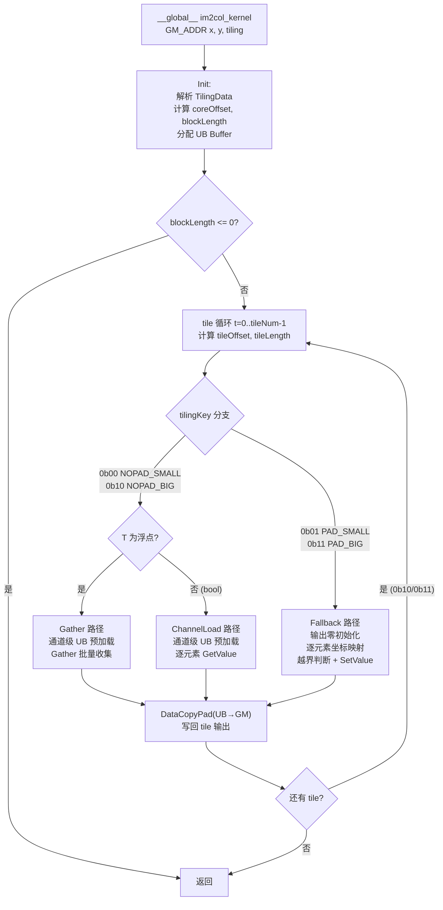

# Im2col 算子设计文档

## 一、需求背景

### 1.1 需求来源

社区任务要求参考内置 aclnnIm2col 算子的 TBE 实现，在昇腾 NPU 上使用 Ascend C 编程语言实现功能一致的 Im2col 算子，并在原有能力基础上补充 **BOOL** 数据类型支持，完成算子设计、开发、测试全流程。

- 适配硬件：Atlas A2 训练系列产品 / Atlas A3 系列产品
- 开源仓地址：https://gitcode.com/cann/ops-math
- 目标合入路径：`experimental/conversion`
- 开发语言：Ascend C
- 参考 baseline：CANN 内置 TBE 实现，CANN 9.0.0

### 1.2 背景介绍

#### 1.2.1 Im2col 算子 TBE 实现优化

**TBE 源码路径（CANN 9.0.0 内置，kernel 实现）：**

| 文件 | 路径 | 行数 | 作用 |
|------|------|------|------|
| im2col.py | `.../tbe/impl/ops_legacy/im2col.py` | 461 行 | TBE 传统路径主入口：参数校验、格式转换、compute + schedule 调度 |
| im2col_common_func.py | `.../tbe/impl/ops_legacy/im2col_common_func.py` | 1298 行 | compute 核心计算链（10 步）+ schedule 多核/多策略 Tiling |
| dynamic/im2col.py | `.../tbe/impl/ops_legacy/dynamic/im2col.py` | 83 行 | 动态 shape NCHW 路径，使用 ExtractImagePatchesNCHW |

**算子信息库路径（910B）：**

| 文件 | 路径 | 作用 |
|------|------|------|
| im2col.json | `.../tbe/kernel/config/ascend910b/ops_legacy/im2col.json` | 910B 上 Im2col 的 kernel 注册表（9 个 binList 条目） |

**ACLNN 接口头文件：**

| 文件 | 路径 | 作用 |
|------|------|------|
| aclnn_im2col.h | `.../aarch64-linux/include/aclnnop/aclnn_im2col.h` | 两段式 ACLNN 接口声明 |

#### 1.2.2 Im2col 算子现状分析

##### 1.2.2.1 TBE 算子支持的数据类型和数据格式

**传统 TBE 路径（ops_legacy/im2col.py，line 311-461）：**

该路径通过 `@para_check` + TVM DSL 实现，支持静态 shape。从源码 line 108 和 line 338-343 可知：

| 项目 | 值 |
|------|-----|
| 输入 dtype（line 338） | int8、uint8 → BLOCK_SIZE_INT8=32, type_size=1; float16、float32（源码中"float"）→ BLOCK_SIZE=16, type_size=2 |
| 输入 format（line 346） | NHWC、NCHW |
| 内部 format | NC1HWC0（5D 分形，C1=ceil(C/16), C0=16） |
| SAME/VALID 支持 | 是（通过 tf_get_windowed_output_size_verbose_v2） |
| padding | 4 向：top/bottom/left/right，CALCULATED / SAME / VALID |

**动态 TBE 路径（ops_legacy/dynamic/im2col.py，line 41-83）：**

| 项目 | 值 |
|------|-----|
| 输入 dtype（line 68） | float16、float32、bfloat16 |
| 输入 format（line 63-65） | 仅 NCHW（`data_format != "NCHW"` 时报错） |
| 实现方式 | ExtractImagePatchesNCHW |

**910B 算子信息库注册（im2col.json）：**

从 kernel config JSON 的 9 个 binList 条目提取：

| dtype | format | padding_mode | opMode | 说明 |
|-------|--------|-------------|--------|------|
| bfloat16 | NCHW | CALCULATED | dynamic | 简码 `d=0,p=0/27,0/27,0/` |
| bfloat16 | NCHW | SAME | dynamic | |
| bfloat16 | NCHW | VALID | dynamic | |
| float16 | NCHW | CALCULATED | dynamic | 简码 `d=0,p=0/1,0/1,0/` |
| float16 | NCHW | SAME | dynamic | |
| float16 | NCHW | VALID | dynamic | |
| float32 | NCHW | CALCULATED | dynamic | 简码 `d=0,p=0/0,0/0,0/` |
| float32 | NCHW | SAME | dynamic | |
| float32 | NCHW | VALID | dynamic | |

说明：im2col.json 中 910B 注册的全部为 NCHW format + dynamic opMode，使用动态 shape 路径（ExtractImagePatches）。bfloat16/fp16/fp32 三 dtype 各搭配 CALCULATED/SAME/VALID 三种 padding_mode。

**ACLNN 接口声明（aclnn_im2col.h）：**

ACLNN 接口声明数据类型支持范围宽泛（INT8/16/32/64/UINT8/16/32/64/BF16/FLOAT16/FLOAT/DOUBLE/BOOL），但注释明确标注：
> "其中，Ascend950之前芯片仅支持数据类型BF16、FLOAT16、FLOAT。"

即 Ascend910B 上实际可用的 dtype 为 BF16、FLOAT16、FLOAT。BOOL 在接口声明中存在，但底层 TBE kernel 不支持。

**TBE 对比总表：**

| 实现 | 格式 | 支持 dtype | 备注 |
|------|------|-----------|------|
| ops_legacy/im2col.py | NC1HWC0（静态） | float16、float32、(int8、uint8) | 实际对齐 BLOCK_SIZE: 16(fp)/32(int8) |
| ops_legacy/dynamic/im2col.py | NCHW（动态） | float16、float32、bfloat16 | 通过 ExtractImagePatchesNCHW |
| im2col.json (910B) | NCHW（动态注册） | bfloat16、float16、float32 | 三 dtype × 三 padding_mode = 9 条目 |
| ACLNN 接口声明 | NCHW | 含 BOOL（声明），910B 仅 BF16/FP16/FP32（实际） | BOOL 内核未实现 |
| **本任务 (Ascend C)** | **NCHW** | **float16、float32、bfloat16、bool** | **新增 BOOL** |

##### 1.2.2.2 ExtractImagePatchesNCHW 类实现深度分析

910B 上 Im2col 的 TBE 实现仅使用动态路径。算子信息库 `im2col.json` 全部 9 条 binList 的 `opMode` 均为 `dynamic`，覆盖 bfloat16/float16/float32 x CALCULATED/SAME/VALID，format 均为 NCHW。

入口为 `ops_legacy/dynamic/im2col.py`（83 行），经 `@register_operator` 注册后，运行时调用链为：ACLNN/GE IR -> im2col.json -> dynamic/im2col.py -> 参数校验（NCHW format + fp16/fp32/bf16 dtype）-> `ExtractImagePatchesNCHW(...).build(kernel_name)`。

核心实现在 `ops_legacy/dynamic/extract_image_patches_nchw.py`（291 行），封装为 `ExtractImagePatchesNCHW` 类。该类接受 6 个构造参数 `x`（tensor dict）、`ksizes`、`strides`、`rates`、`padding`（string）、`pads`（list），通过 TVM DSL 构建完整 compute DAG，最终由 `tbe.build` 编译产出 CCE kernel。

**`__init__` 构造函数逐段分析（`extract_image_patches_nchw.py` line 44-129）：**

**1. dtype 归一化（line 47-54）：**
```python
dtype_dict = {
    "int8": "int8", "uint8": "uint8",
    "float16": "float16", "fp16": "float16", "bfloat16": "int16",
    "float32": "float32", "fp32": "float32", "float": "float32"}
```
关键点：bfloat16 被映射为 `"int16"`（而非 `"bfloat16"`），这是因为 TVM 内部将 bfloat16 视为 int16 类型，通过 reinterpret_cast 语义处理；"float" 是 float32 的 TBE 别名，映射为 `"float32"`。int8/uint8 虽在字典中有映射，但 `im2col.py` 的 dtype 校验（line 68）已将其排除，故动态路径实际仅支持 float16、float32（含 float 别名）、bfloat16。

**2. const/dynamic shape 判断 + 分支处理（line 56-65）：**
```python
if -1 not in x_shape and -2 not in x_shape:
    self.is_const = True
    self.n, self.c, self.hi, self.wi = x_shape
else:
    self.is_const = False
    self.n = var("n", (1, None), "int64")
    self.c = var("c", (1, None), "int64")
    self.hi = var("hi", (1, None), "int64")
    self.wi = var("wi", (1, None), "int64")
```
判断条件：x_shape 中任何元素为 -1 或 -2 即判定为动态 shape（`is_const=False`），用 TVM `var` 符号变量替代具体数值，编译时生成符号化 compute DAG，shape 在运行时绑定。全部为正整数的静态 shape 则直接解包赋值。

**3. is_binary 属性默认/展开逻辑（line 67-86）：**
```python
self.is_binary = None in (ksizes, strides, rates, pads)
```
此处的 `is_binary` 指 TBE 属性是否以 binary 形式（None，即未提供具体数值）传入。`None in (...)` 检查四个属性中任一为 None：
- **`is_binary=True`（任一属性为 None）**：所有属性（kh/kw/sh/sw/rh/rw/pt/pb/pl/pr + ho/wo）均创建 TVM `var` 符号变量（line 69-80），编译时不绑定具体值，由运行时 Tiling 或 op_tiling 机制推导
- **`is_binary=False`（全部属性有确定值）**：调用 `prepare_params()` 展开属性数组（line 74-82）：
  - ksizes/strides/dilations: 1 元素 `[v]` → `[1,1,v,v]`，2 元素 `[v0,v1]` → `[1,1,v0,v1]`；前两维 1,1 为 N/C 占位
  - 解包：`_, _, self.kh, self.kw = ksizes`（同理 strides、rates）
  - pads: len=1 `[p]` → `[p,p,p,p]`，len=2 `[p0,p1]` → `[p0,p0,p1,p1]`，len=4 不变
  - 解包为 4 向：`self.pt, self.pb, self.pl, self.pr = pads`

**4. padding_mode 三种分支的 OH/OW 计算（line 88-94）：**
```python
if self.padding == "CALCULATED":
    if not self.is_binary:
        self.ho = (self.hi + self.pt + self.pb - (self.rh * (self.kh - 1) + 1)) / self.sh + 1
        self.wo = (self.wi + self.pl + self.pr - (self.rw * (self.kw - 1) + 1)) / self.sw + 1
else:
    self.ho, self.pt, self.pb = _calc_output_size_and_pad(self.hi, self.kh, self.sh, self.rh, self.padding)
    self.wo, self.pl, self.pr = _calc_output_size_and_pad(self.wi, self.kw, self.sw, self.rw, self.padding)
```
三种分支：
- **CALCULATED + 非 binary**：显式公式 `Ho = (Hi + Pt + Pb - (rh*(kh-1)+1)) / Sh + 1`，其中 `rh*(kh-1)+1` 为 dilation 调整后的有效卷积核高度。CALCULATED 模式下 Pt/Pb/Pl/Pr 来自 pads 参数，不重新计算
- **CALCULATED + binary**：ho/wo 已在 binary 分支（line 75/78）创建为 TVM var，不在此重复计算
- **SAME/VALID**：调用 `_calc_output_size_and_pad()` 静态方法计算输出尺寸并重新确定 pad 值

静态方法 `_calc_output_size_and_pad(input_size, k, s, r, padding)`（line 30-41）：
```python
k_eff = (k - 1) * r + 1  # dilation 调整后的有效卷积核尺寸
if padding == "VALID":
    output_size = (input_size - k_eff + s) // s
    pad_before = pad_after = 0
else:  # "SAME"
    output_size = (input_size + s - 1) // s
    pad = tvm.max(0, (output_size - 1) * s + k_eff - input_size)
    pad_before = pad // 2
    pad_after = pad - pad_before
```
VALID 模式无 padding；SAME 模式自动计算总 pad 量并居中分配（`pad_before = pad // 2`，`pad_after = pad - pad_before`，左侧可能少 1）。

**关键函数列表：**

| 方法 | 行号 | 功能 |
|------|------|------|
| `_calc_output_size_and_pad()`(静态) | 30-41 | 先按 dilation 调整有效卷积核 `k_eff=(k-1)*r+1`，再按 VALID/SAME 计算输出尺寸和 pad 值 |
| `__init__()` | 44-129 | 构造函数：dtype 归一化、shape 解析、padding 计算、TilingKey 获取 |
| `build()` | 131-138 | 入口：`tbe.compute()` 上下文内 `_compute()` 构建 DAG → `tvm.target.cce()` 上下文内 `tbe.auto_schedule(y)` TVM 自动多级循环优化 + 多核切分 → `tbe.build(sch, tensor_list + kernel_name)` 编译生成 CCE kernel 二进制 |
| `_padding()` | 140-199 | TVM 4 向 zero-padding: 5 独立 compute（x_data/top/bottom/left/right）+ 1 合并 x_p，4 层级联 tvm.select 实现区域合并 |
| `_get_run_info()` | 201-228 | 构造 input/attr 列表，调 `op_tiling.do_op_tiling()` 获 tiling 参数 |
| `_compute()` | 230-281 | **核心 compute DAG**（6 步：NCHW->NHWC->pad->extract->NHWC->NCHW） |
| `_add_compile_info()` | 283-291 | 注册 8 项编译元信息：coreNum、SIZE_UB、nchw_format、dtypeInput、paddingType、isBinary、isConst、pads |

**内部 compute 6 步流程（`_compute` 方法）：**

```
输入: x(N, C, Hi, Wi)                             -- NCHW 4D placeholder
  |
  +-- Step 1: x_ub = identity(x)                   -- 显式 UB 放置标记
  |   x_ub[N, C, Hi, Wi] = x[N, C, Hi, Wi]
  |
  +-- Step 2: x_nhwc = transpose(NCHW->NHWC)
  |   x_nhwc[N, Hi, Wi, C][n,h,w,c] = x_ub[n,c,h,w]
  |   -- 内部数据布局从 NCHW 转为 NHWC，便于按空间坐标索引
  |
  +-- Step 3（可选）: x_p = zero_pad(x_nhwc)       -- 仅 padding != "VALID"
  |   - 4 向分别创建 tvm.select 表达式
  |   - 越界：tvm.const(0, dtype)，有效：透传原值
  |   - 合并为 x_p(N, Hi+Pt+Pb, Wi+Pl+Pr, C)
  |   - padding="VALID" 时跳过，tmp_compute = x_nhwc
  |
  +-- Step 4: y_nhwc = extract_patches(tmp_compute)
  |   y_nhwc[N, KH, KW, Ho, Wo, C][n,kh,kw,oh,ow,c] =
  |       tmp_compute[n, oh*sh + kh*rh, ow*sw + kw*rw, c]
  |   -- 标准 im2col 滑动窗口索引映射
  |   -- oh*sh (步长定位) + kh*rh (dilation 膨胀, 源码中 dilation 称为 rates, 成员变量 rh/rw)
  |   -- ow*sw + kw*rw 同理
  |   -- 注: 源码中 rh(rate_h) = dilations[2], rw(rate_w) = dilations[3]
  |   -- + tvm.const(0, self.dtype) 为 TVM 类型推导强制表达式: 乘积 oh*sh 等为 int64,
  |   -- 加上 dtype 的 const(0) 确保结果张量元素类型与输入 dtype 一致, 防止类型升级
  |
  +-- Step 5: y_ub = transpose(NHWC->NCHW)
  |   y_ub[N, C, KH, KW, Ho, Wo][n,c,kh,kw,oh,ow] =
  |       y_nhwc[n,kh,kw,oh,ow,c]
  |   -- 从 6D NHWC 转回 NCHW 格式
  |
  +-- Step 6: y = identity(y_ub)
      -- 附加 computes 元组 + tiling_key
      -- 输出 6D NCHW 张量 (N, C, KH, KW, Ho, Wo)
```

**内部数据布局转换链：**

```
外部接口: NCHW (4D)
  |
  v
内部流程: NCHW -> NHWC -> [zero_pad] -> extract_patches -> NHWC -> NCHW
  |
  v
外部接口: NCHW (6D) -> ACLNN 输出 flatten 为 [N, C*KH*KW, Ho*Wo]
```

说明：ACLNN 接口语义始终为纯 NCHW，但 TVM compute 在 Step 2 和 Step 5 分别执行 NCHW->NHWC 和 NHWC->NCHW 两次索引重排。这是 TVM DSL 表达式层的坐标变换，编译时由 TVM schedule 消除为等效的 UB 地址偏移计算，无传统意义上的运行时显式 Buffer Transpose 开销。

**Padding 处理细节（`_padding` 方法）：**

`_padding` 使用 **5 个独立 TVM compute 张量 + 1 个合并张量** 的结构实现 4 向 zero-padding：

1. **`x_data`**（`extract_image_patches_nchw.py` line 141-152）：仅当坐标 `ih in [pt, pt+hi)` 且 `iw in [pl, pl+wi)` 范围内时，读取原值 `x_nhwc[ih-pt, iw-pl]`，其余位置不指定值（TVM 默认补 0）
2. **`top`**（line 155-158）：`tvm.select(i1 < pt, tvm.const(0, self.dtype))` — padding 上侧区域
3. **`bottom`**（line 161-164）：`tvm.select(i1 >= pt+hi, tvm.const(0, self.dtype))` — padding 下侧区域
4. **`left`**（line 167-170）：`tvm.select(i2 < pl, tvm.const(0, self.dtype))` — padding 左侧区域
5. **`right`**（line 173-176）：`tvm.select(i2 >= pl+wi, tvm.const(0, self.dtype))` — padding 右侧区域

合并张量 `x_p`（line 181-197）通过**4 层级联 `tvm.select`** 合并 5 个区域：

```
x_p = select(i1<pt -> top; i1>=pt+hi -> bottom;
             i2<pl -> left; i2>=pl+wi -> right;
             else -> x_data)
```

最终产出 x_p(N, Hi+Pt+Pb, Wi+Pl+Pr, C)，越界区域已填充为 0，后续 extract 步骤直接在 x_p 上索引，无需额外越界判断。5 个独立 compute + 1 合并张量的结构是 TVM 常见模式，允许 auto_schedule 分别优化各区域的访存模式。

**Tiling 策略来源（`_get_run_info` -> `op_tiling`）：**

| 参数 | 来源 | 说明 |
|------|------|------|
| tiling_key | `op_tiling.do_op_tiling()` 返回 int | 编译时根据 shape + dtype 选择优化策略编号 |
| n_factor / c_factor | 同上（decode 后字典 key 为小写） | N/C 维度分块因子 |
| kh_factor / kw_factor / ho_factor / wo_factor | 同上 | 空间维度分块因子 |
| ub_factor | 同上 | 单次 UB 加载元素数 |
| coreNum | `tbe_platform.get_soc_spec("CORE_NUM")` | AI Core 数量 |
| SIZE_UB | `tbe_platform.get_soc_spec("UB_SIZE")` | UB 容量 |

tiling_data 以 int64 编码的 7 个 factor 通过 `decode(run_info["tiling_data"], format)` 解码为字典，实际成员变量名为小写 `n_factor / c_factor / kh_factor / kw_factor / ho_factor / wo_factor / ub_factor`（`extract_image_patches_nchw.py` line 103-120）。静态 shape（`is_const=True`）在 `__init__` 中即完成 tiling 参数计算，赋值为具体 int64 值；动态 shape（`is_const=False`）时 `tiling_key = -1`，全部 factor 设为 TVM `var` 符号变量，在运行时由 op_tiling 推导后传入。

`build()` 方法（line 131-138）的执行流程如下：
1. `with tbe.compute():` — 在 compute 上下文内调用 `_compute()` 构建完整 TVM compute DAG
2. `with tvm.target.cce():` — 切换到 CCE（Cube Core Engine）target 上下文
3. `self._add_compile_info()` — 注册 8 项编译元信息到 IR
4. `sch = tbe.auto_schedule(y)` — 以输出张量 y 为根，向后遍历 DAG，自动优化循环分片、内存层次排布、多核并行化
5. `tbe.build(sch, {"tensor_list": [x, y], "name": kernel_name})` — 将优化后的 TVM IR 编译为可在 NPU 上执行的 CCE kernel 二进制

**输出格式约定：**

动态 TBE 路径的输出经 `im2col.json` 注册后，ACLNN 接口返回的 flat tensor 布局为：

```
输出 shape: [N, C * KH * KW, Ho * Wo]
```

对应 6D compute 输出 `(N, C, KH, KW, Ho, Wo)` 的 flatten 语义：dim-1 = C x KH x KW 展平（通道 x 卷积核），dim-2 = Ho x Wo 展平（空间）。本任务完全对齐此约定。

传统 TVM 路径（`ops_legacy/im2col.py` 461 行 + `im2col_common_func.py` 1298 行）在 910B 上未注册使用，其内部使用 NHWC->NC1HWC0 5D 分形格式链，仅作为语义参考。

##### 1.2.2.3 动态 TBE 路径流程图（含 ExtractImagePatchesNCHW 内部）

以下流程图基于 `ops_legacy/dynamic/im2col.py`（83 行）及 `extract_image_patches_nchw.py`（291 行）绘制，完整覆盖入口注册、参数校验、属性分发与展开、ExtractImagePatchesNCHW 初始化、内部 compute DAG（6 步）、build 编译的全流程。

```mermaid
flowchart TD
    subgraph ENTRY["入口 — dynamic/im2col.py:37-42"]
        A["@register_operator('Im2col', pattern='ExtractImagePatches')<br/>@para_check 7+1 entries<br/>im2col(images, y, ksizes, strides,<br/>dilations, padding_mode, pads)"]
    end

    subgraph VALIDATE["参数校验 — L63-70"]
        A --> B{"format == NCHW?"}
        B -->|"否"| ERR1["报错退出<br/>raise_err_input_format_invalid"]
        B -->|"是"| C{"dtype in (float16, float,<br/>float32, bfloat16)?"}
        C -->|"否"| ERR2["报错退出<br/>raise_err_specific_reson"]
    end

    subgraph ATTR_DISPATCH["属性分发 — L72-82"]
        C -->|"是"| D["is_binary = None in<br/>(ksizes, strides, dilations, pads)"]
        D --> E{"is_binary?"}
        E -->|"True（存在 None）"| G["透传给 EIPNCHW<br/>由后者处理属性默认值"]
        E -->|"False"| F["prepare_params(ksizes/strides/dilations)<br/>1元素→[1,1,v,v], 2元素→[1,1,v0,v1]<br/>pads 展开: 1/2/4元素→4向格式"]
    end

    subgraph INIT["EIPNCHW.__init__ — L44-129"]
        G --> I1["dtype 归一化: int8→int8,uint8→uint8,<br/>float16→float16,fp16→float16,<br/>bfloat16→int16,float32→float32,<br/>fp32→float32,float→float32<br/>实际仅支持float16/float32(含float)/bfloat16"]
        F --> I1
        I1 --> I2["shape 解析: 检查-1/-2<br/>const→直接赋值(N,C,Hi,Wi)<br/>dynamic→TVM var(n,c,hi,wi)"]
        I2 --> I3["padding 输出尺寸计算<br/>CALCULATED+非binary: 显式四则公式<br/> Ho=(Hi+Pt+Pb-(rh*(kh-1)+1))/Sh+1<br/>SAME/VALID: _calc_output_size_and_pad<br/> →k_eff=(k-1)*r+1"]
        I3 --> I4["Hi_p=Hi+Pt+Pb, Wi_p=Wi+Pl+Pr"]
        I4 --> I5{"is_const?"}
        I5 -->|"是"| I6["_get_run_info()→op_tiling<br/>→ tiling_key + decode 7 factor<br/>(n_factor/c_factor/kh_factor<br/>kw_factor/ho_factor/wo_factor/ub_factor)"]
        I5 -->|"否"| I7["tiling_key=-1<br/>7 factor 全部设为 TVM var<br/>(n_factor..ub_factor)"]
    end

    subgraph COMPUTE["_compute DAG — L230-281"]
        I6 --> C1["Step 1: x=placeholder(N,C,Hi,Wi)<br/>x_ub = identity(x)"]
        I7 --> C1
        C1 --> C2["Step 2: x_nhwc = transpose(NCHW→NHWC)<br/>x_nhwc[N,H,W,C] = x_ub[N,C,H,W]"]
        C2 --> C3{"padding == VALID?"}
        C3 -->|"否"| C4["Step 3: _padding(x_nhwc) → x_p<br/>4 向 tvm.select: 越界→0<br/>x_p(N,Hi_p,Wi_p,C)"]
        C3 -->|"是"| C5["tmp_compute = x_nhwc"]
        C4 --> C6["tmp_compute = x_p"]
        C5 --> C7["Step 4: y_nhwc = extract_patches<br/>[:6D: N,KH,KW,Ho,Wo,C]<br/>[n,kh,kw,oh,ow,c] =<br/>tmp_compute[n, oh*sh+kh*rh, ow*sw+kw*rw, c]<br/>rh/rw = rates = dilations<br/>+ tvm.const(0,dtype)强制T类型"]
        C6 --> C7
        C7 --> C8["Step 5: y_ub = transpose(NHWC→NCHW)<br/>y_ub[N,C,KH,KW,Ho,Wo]<br/>= y_nhwc[N,kh,kw,oh,ow,c]"]
        C8 --> C9["Step 6: y = identity(y_ub)<br/>附加 computes 元组 + tiling_key"]
    end

    subgraph BUILD["build — L131-138"]
        C9 --> B1["tbe.compute() 上下文<br/>_compute() 返回 x, y"]
        B1 --> B2["_add_compile_info()<br/>8项: coreNum, SIZE_UB,<br/>nchw_format, dtypeInput,<br/>paddingType, isBinary,<br/>isConst, pads"]
        B2 --> B3["sch = tbe.auto_schedule(y)<br/>TVM 自动多级循环优化"]
        B3 --> B4["tbe.build(sch, tensor_list)<br/>→ CCE kernel binary"]
    end

    subgraph OUTPUT["输出"]
        B4 --> J["输出 shape (N, C*KH*KW, Ho*Wo)<br/>NCHW语义 flat tensor<br/>由6D (N,C,KH,KW,Ho,Wo) flatten:<br/>dim1 = C*KH*KW, dim2 = Ho*Wo<br/>运行时build或预编译缓存命中"]
    end
```



**动态图例表（源码行号注释）：**

| 图节点 / 子图 | 源码文件 | 行号 | 说明 |
|--------------|---------|------|------|
| ENTRY 子图 | `dynamic/im2col.py` | 37-41 | `@register_operator` 注册 + `@para_check` + 函数签名 |
| format 校验 B | 同上 | 63-65 | format 强制 NCHW，非 NCHW 报错退出 |
| dtype 校验 C | 同上 | 67-70 | dtype 限 float16/float/float32/bfloat16; "float" 为 float32 别名 |
| is_binary 检查 D | 同上 | 72-73 | None in (ksizes, strides, dilations, pads); 任一 None→is_binary True，全部 var 化 |
| prepare_params F | 同上 | 27-34, 74-76 | ksizes/strides/dilations 展开: 1 元素→[1,1,v,v], 2 元素→[1,1,v0,v1] |
| pads 展开（F 内） | 同上 | 77-82 | pads 1→[p,p,p,p]; 2→[p0,p0,p1,p1]; 4→不变 |
| INIT 子图 | `extract_image_patches_nchw.py` | 44-129 | 构造函数: dtype 归一化（含 dict 全映射）、shape 解析（-1/-2→dynamic）、padding 尺寸计算（CALCULATED/SAME/VALID 三分支）、tiling 初始化（const→op_tiling, dynamic→var） |
| COMPUTE 子图 | 同上 | 230-281 | 6 步 compute DAG（NCHW<->NHWC<->extract<->NCHW） |
| Step 3 _padding | 同上 | 140-199 | 5 独立 TVM compute（x_data/top/bottom/left/right）+ 1 合并 x_p，4 层级联 tvm.select |
| Step 4 extract | 同上 | 247-252 | 6D 滑动窗口索引: [n,oh*sh+kh*rh, ow*sw+kw*rw, c]; rh/rw=dilation(rates); + tvm.const(0,dtype) 确保类型 |
| Step 5 transpose | 同上 | 254-258 | 6D NHWC→NCHW: y_ub[n,c,kh,kw,oh,ow] = y_nhwc[n,kh,kw,oh,ow,c] |
| Step 6 output | 同上 | 265-279 | identity(y_ub) + attrs 含 14 项 params(shape/attr/tiling factor) + computes 元组 + tiling_key; 附加到 output tensor |
| BUILD 子图 | 同上 | 131-138 | tbe.compute()→tvm.target.cce()→_add_compile_info→tbe.auto_schedule(y)→tbe.build(sch, tensor_list+kernel_name) |
| _add_compile_info | 同上 | 283-291 | 注册 8 项编译元信息: coreNum, SIZE_UB, nchw_format, dtypeInput, paddingType, isBinary, isConst, pads |
| _get_run_info | 同上 | 201-228 | 构造 input_list+attr_list+compile_info，调 op_tiling.do_op_tiling() 获 tiling_key + tiling_data（7 factor 编码） |
| 6D→3D 输出 flatten | — | — | 6D(N,C,KH,KW,Ho,Wo) → ACLNN 3D(N, C*KH*KW, Ho*Wo) 在 ACLNN/GE 接口层完成 |

---

## 二、需求分析

### 2.1 外部组件依赖

| 组件 | 依赖类型 | 说明 |
|------|---------|------|
| Ascend C API | 编译时 + 运行时 | Kernel 开发依赖 Ascend C 向量化 API（DAV_2201 Vector 路线） |
| CANN Toolkit (>= 8.5.0) | 编译时 | 提供算子编译工具链 |
| CANN OPP | 运行时 | 算子信息库和原型注册 |
| ops-math | 代码组织 | 算子提交至 ops-math 仓的 experimental/conversion 目录 |
| ACLNN | 接口标准 | 对外暴露 aclnnIm2col 两段式接口（aclnnIm2colGetWorkspaceSize + aclnnIm2col） |

### 2.2 内部适配模块

| 模块 | 说明 |
|------|------|
| op_host/im2col_def.cpp | 算子原型注册（OpDef）：算子名 Im2col、输入/输出/属性声明 |
| op_host/im2col_infershape.cpp | Shape 推导：输出 shape `(N, C*kH*kW, OH*OW)` |
| op_host/im2col_tiling.cpp | Tiling 计算：分核策略、UB 分块、TilingKey 选择 |
| op_kernel/arch22/im2col_kernel.h | Kernel 核心实现（Im2Col\<T\>，含 Gather/ChannelLoad/Fallback 三条路径） |
| op_kernel/arch22/im2col_tiling_data.h | TilingData 结构体 |
| op_kernel/arch22/im2col_tiling_key.h | TilingKey 枚举 + ASCENDC_TPL 声明 |
| op_api/im2col.cpp | L0 API（InferShape + Kernel 调度） |
| op_api/aclnn_im2col.cpp | L2 API（参数校验 + Contiguous + ViewCopy） |
| op_graph/im2col_proto.h | 图模式适配（GE IR） |
| tests/ | 单元测试和系统测试 |

### 2.3 需求模块设计

#### 2.3.1 AscendC 算子原型

与 TBE 对齐，属性名采用社区规范命名，新增 BOOL 支持。

**算子注册名：** `Im2col`

**输入/输出/属性表：**

| 类型 | 名称 | dtype | format | 说明 |
|------|------|-------|--------|------|
| 输入 | self | FLOAT16、FLOAT32、BFLOAT16、**BOOL** | ND | 3D `(N,C,H)` 或 4D `(N,C,H,W)` NCHW 语义 |
| 输出 | out | 与 self 一致 | ND | 3D `(N, C*kH*kW, OH*OW)` |
| 属性 | kernelSize | list_int(2) | — | 卷积核尺寸，值 > 0 |
| 属性 | dilation | list_int(2) | — | 膨胀系数，值 > 0 |
| 属性 | padding | list_int(2) | — | 填充大小，值 >= 0 |
| 属性 | stride | list_int(2) | — | 步长，值 > 0 |

**与 TBE 的属性名差异：**

| TBE 属性 | 本任务属性 | 差异说明 |
|----------|-----------|---------|
| ksizes (ListInt) | kernelSize (list_int(2)) | 语义相同，命名对齐社区规范 |
| strides (ListInt, 默认[1]) | stride (list_int(2)) | 语义相同 |
| dilations (ListInt, 默认[1]) | dilation (list_int(2)) | 语义相同 |
| pads (ListInt, 4向) | padding (list_int(2), 对称) | TBE 支持非对称 4 向 padding（top/bottom/left/right），本任务使用对称 padding（2 向） |
| padding_mode (String, 默认"CALCULATED") | — | 本任务不支持 SAME/VALID，固定 CALCULATED |

**TBE vs Ascend C 实现差异总表：**

| 维度 | TBE 实现 | Ascend C 实现（本任务） |
|------|---------|----------------------|
| 编程模型 | TVM DSL（Python）→ TVM build 生成 | 手写 Ascend C（C++ Kernel） |
| 数据类型 | float16, float32, int8, uint8 (+bfloat16 dynamic) | float16, float32, bfloat16, **bool** |
| 内部数据布局 | NC1HWC0（5D 分形） | ND（3D/4D 原生 NCHW） |
| 内存层级 | L1 + UB（TVM schedule 自动管理） | UB（直接从 GM 到 UB，手动管理） |
| 多核策略 | TVM Schedule 内自动分核（blockIdx.x） | TilingData 显式多核切分 |
| 索引计算 | TVM Compute lambda 表达式 | 手动索引映射 + DataCopy/Gather |
| padding | 4 向（top/bottom/left/right），支持 SAME/VALID/CALCULATED | 2 向对称，仅 CALCULATED |
| 格式转换 | NCHW→NHWC→NC1HWC0（复杂格式链） | 纯 NCHW，无格式转换 |
| 性能调控 | Auto Tiling + TVM Schedule | 手动 Tiling + 3 路径分支 |

**dtype 支持对照表：**

| 数据类型 | sizeof | Ascend C 类型 | TBE (ops_legacy) | TBE (dynamic) | ACLNN 声明 (910B) | 本任务 |
|----------|--------|--------------|-----------------|---------------|-------------------|:------:|
| FLOAT16 | 2 | half | ✅ | ✅ | ✅ | ✅ |
| FLOAT32 | 4 | float | ✅ | ✅ | ✅ | ✅ |
| BFLOAT16 | 2 | bfloat16_t | ❌ | ✅ | ✅ | ✅ |
| INT8 | 1 | int8_t | ✅ | ❌ | ❌ (声明但910B不支持) | ❌ |
| UINT8 | 1 | uint8_t | ✅ | ❌ | ❌ | ❌ |
| BOOL | 1 | bool (kernel 内映射 uint8_t) | ❌ | ❌ | ✅ (声明，底层未实现) | ✅ **新增** |

#### 2.3.2 AscendC 算子相关约束

与 TBE 相比，本任务 Ascend C 实现的约束差异：

| 约束项 | TBE | 本任务 | 说明 |
|--------|-----|--------|------|
| 输入格式 | NHWC/NCHW 双格式 | 仅 NCHW (ND) | 简化实现 |
| SAME/VALID padding | 支持 | 不支持 | 固定 CALCULATED |
| 非对称 padding | 支持（4 向） | 不支持（2 向对称） | TBE 的 pads 为 [Pt, Pb, Pl, Pr] |
| INT8/UINT8 | 支持 | 不支持 | 任务书未要求 |
| BOOL | 不支持 | 新增支持 | 核心新增需求 |
| 3D 输入 | 隐式支持（W=1） | 显式处理 | Shape 推导中处理 |
| 输出 shape 语义 | (N, C*kH*kW, OH*OW) NCHW | (N, C*kH*kW, OH*OW) NCHW | 与 TBE aclnnIm2col 一致 |

---

## 三、需求详细设计

### 3.1 使能方式

通过 ACLNN 两段式接口使能：

```
aclnnIm2colGetWorkspaceSize(self, kernelSize, dilation, padding, stride, out, &workspaceSize, &executor)
    → 计算 workspace 大小 + 内部 InferShape + Tiling
aclnnIm2col(workspace, workspaceSize, executor, stream)
    → 执行 Kernel 计算
```

同时注册 GE IR 图模式 `Im2col` 算子，支持图模式构图。

### 3.2 需求总体设计

#### 3.2.0 Im2col 数学公式定义

**4D 输入 [N, C, H, W]：**

输出空间维度（OH/OW）计算公式：

```
OH = floor((H + 2*padH - dilH*(kH-1) - 1) / strideH + 1)
OW = floor((W + 2*padW - dilW*(kW-1) - 1) / strideW + 1)
```

输出 shape 推导：

```
out.shape = [N, C*kH*kW, OH*OW]
```

**3D 输入 [N, C, H]（视作 W=1）：**

退化规则：

```
kW=1, dilW=1, strideW=1, padW=0
OW = 1
out.shape = [N, C*kH, OH]
```

**索引映射公式（输出坐标 → 输入坐标）：**

```
col = oh*OW + ow                           // 空间扁平索引
row = c*kH*kW + kh*kW + kw                 // 通道-卷积核扁平索引
out[n, row, col] = self[n, c, oh*strideH - padH + kh*dilH, ow*strideW - padW + kw*dilW]
```

其中：
- `oh` 取值 `[0, OH)`，`ow` 取值 `[0, OW)`
- `c` 取值 `[0, C)`，`kh` 取值 `[0, kH)`，`kw` 取值 `[0, kW)`
- 当 `ih = oh*strideH - padH + kh*dilH` 或 `iw = ow*strideW - padW + kw*dilW` 越界时，输出填 0（对于 bool 类型填 false）

#### 3.2.1 Host 侧设计

##### 3.2.1.1 分核策略

按输出总元素数 `totalOut = N * C * kH * kW * OH * OW` 在所有 AI Core 间线性均分。

**核心公式：**
```
coreNum = GetBlockDim()     // 动态获取核数
perCoreElems = ceilAlign(ceilDiv(totalOut, coreNum), 32 / sizeof(T))
                              // 每核处理元素数，32 字节对齐
coreOffset = blockIdx.x * perCoreElems
blockLength = min(perCoreElems, totalOut - coreOffset)
```

若 `blockLength <= 0`，该核跳过（尾核处理余量后剩余核空闲）。

**多核维度选择：** 由于 Im2col 输出是 3D `(N, C*kH*kW, OH*OW)`，多核以 1D 线性化方式切分输出元素，简单高效，消除维度间负载不均衡。

##### 3.2.1.2 数据分块与内存优化策略

UB 容量约束（DAV_2201: 192 KB，其中向量可用约 184 KB）下，单次 tile 不能处理全部输出元素时，需分 tile 处理。

**tile 大小计算：**
```
// 按每 tile 最大 UB 占用反推 tile 元素数
ubAvailable = UB_SIZE - RESERVED_SIZE    // 约 184 KB
perTileElems = ubAvailable / (sizeof(T) * (1 + 1))  // 输入缓冲 + 输出缓冲
tileNum = ceilDiv(perCoreElems, perTileElems)
```

对于 bool 类型（1 字节），受 32 字节对齐约束，实际单 tile 处理元素数为 `floor(perTileElems / 32) * 32`。

UB 缓冲区规划（每个 tile 循环复用）：

| 缓冲 | 用途 | 大小 | 说明 |
|------|------|------|------|
| inputTile | 输入数据缓冲区 | tileH * tileW * sizeof(T) | 存输入切块 |
| outputTile | 输出数据缓冲区 | tileOut * sizeof(T) | 存输出切块 |
| padBuf | padding 临时缓冲 | 仅 padding 分支需要 | 越界判断用 |

##### 3.2.1.3 TilingKey 规划策略

4 分支 = IsPadding（0/1）x IsBigShape（0/1），对应 4 个 TilingKey：

| TilingKey | 二进制 | 触发条件 | 策略 |
|-----------|--------|---------|------|
| NOPAD_SMALL | 0b00 | 无 padding，总元素 ≤ ubThreshold | 单 tile，Gather 批量收集 |
| PAD_SMALL | 0b01 | 有 padding，总元素 ≤ ubThreshold | 单 tile，坐标映射 + 越界判断 |
| NOPAD_BIG | 0b10 | 无 padding，总元素 > ubThreshold | 多 tile 分批，Gather 批量收集 |
| PAD_BIG | 0b11 | 有 padding，总元素 > ubThreshold | 多 tile 分批，坐标映射 + 越界判断 |

**TilingKey 计算逻辑（Host 侧）：**

```
isPadding = (padding[0] > 0 || padding[1] > 0)
totalOut = N * C * kH * kW * OH * OW
ubThreshold = perTileElems   // 按 UB 容量计算
isBigShape = (totalOut > ubThreshold)
tilingKey = (isPadding << 1) | isBigShape
```

**TilingData 结构体：**

```
struct Im2ColTilingData {
    int64_t N, C, H, W;           // 输入形状
    int64_t kernelH, kernelW;      // 卷积核
    int64_t strideH, strideW;      // 步长
    int64_t dilationH, dilationW;  // 膨胀
    int64_t paddingH, paddingW;    // padding（对称 2 向）
    int64_t OH, OW;                // 输出 H/W
    int64_t totalElements;         // 总输出元素数
    int64_t perCoreElems;          // 每核元素数
    int64_t tileNum;               // 每核 tile 数
    int64_t perTileElems;          // 每 tile 元素数
    int64_t coreOffset;            // 该核起始偏移
    uint8_t tilingKey;             // 分支选择
    bool isPadding;                // 是否有 padding
};
```

#### 3.2.2 Kernel 侧设计

##### 3.2.2.1 Kernel 侧实现描述

Kernel 主体采用 `__global__ __aicore__` 函数，按 TilingKey 分发到三条处理路径：

**路径一：Gather 向量化（无 padding, float16/float32/bfloat16）**

适用于无 padding 且 dtype 为浮点类型的场景。按 channel 分组，每 channel 数据一次 DMA 搬入 UB，通过 Gather 指令批量收集所需元素：

```
1. 对每个 tile，计算该 tile 覆盖的输出索引范围 [startIdx, endIdx)
2. 对每个 channel c:
   a. DataCopyPad(GM→UB): 将源数据 channel c 的整行搬入 UB
   b. 计算每个输出元素对应的输入坐标 (ih, iw)
   c. Gather(UB, offsets): 批量从 UB 输入缓冲区收集值到输出缓冲区
3. DataCopyPad(UB→GM): 将输出缓冲区写回 GM
```

关键注意事项：
- DAV_2201 上 Gather 不支持 uint8_t/bool，因此仅浮点类型走该路径
- Gather 的 srcStride（UB 侧 stride）单位为 DataBlock（32B）
- 偏移表需按 srcStride 单位构建

**路径二：ChannelLoad（无 padding, bool）**

bool 类型因 DAV_2201 的 Gather/Duplicate 向量 API 不支持 uint8_t，采用通道级 UB 预加载 + 逐元素提取：

```
1. 对每个 tile，计算输出索引范围
2. 对每个 channel c:
   a. DataCopyPad(GM→UB): 搬入 uint8_t 数据
   b. 对 tile 内每个输出元素，通过坐标映射计算输入偏移
   c. 通过 UB GetValue 逐个提取，写入输出缓冲区
3. DataCopyPad(UB→GM): 写回
```

**路径三：Fallback（有 padding 或数据超 UB）**

适用于有 padding 或通道数据超出 UB 容量（大 shape 场景）：

```
1. 对每个 tile，零初始化输出缓冲区（Duplicate 填 0，不支持 dtype 时用标量循环）
2. 对每个输出元素，计算输入坐标 (ih, iw)
3. 越界判断：
   - 有效：DataCopyPad(GM→UB, 32B 对齐片段) → 提取值 → 写入输出
   - 越界：保持 0/false
4. DataCopyPad(UB→GM): 写回
```

对于 bool 类型 padding 越界区域填 `false`（0x00）。

**坐标映射公式（与 TBE 一致）：**

```
给定输出线性索引 idx:
  col   = idx / (C * kH * kW)         // 扁平化空间索引
  row   = idx % (C * kH * kW)         // 扁平化通道-卷积核索引
  oh    = col / OW
  ow    = col % OW
  c     = row / (kH * kW)
  kh    = (row % (kH * kW)) / kW
  kw    = (row % (kH * kW)) % kW
  ih    = oh * strideH - paddingH + kh * dilationH
  iw    = ow * strideW - paddingW + kw * dilationW
  if 0 <= ih < H and 0 <= iw < W:
     value = self[n][c][ih][iw]
  else:
     value = 0 (或 false for bool)
```

##### 3.2.2.2 AscendC 实现流程图



##### 3.2.2.3 AscendC 实现与 TBE 流程的差异点和原因

| 差异点 | TBE | Ascend C | 原因 |
|--------|-----|----------|------|
| 编程模型 | TVM DSL（声明式计算 + 自动调度） | 手写 Ascend C（命令式数据搬运 + 手动调度） | 目标平台 arch22 无 TBE TVM 后端 |
| 内部数据布局 | NC1HWC0 5D 分形（Ub_fractal 等复杂链） | NCHW 原生 3D/4D | Ascend C 直接使用 ND Tensor，无需分形转换 |
| 格式转换 | NCHW→NHWC→NC1HWC0 | 无格式转换，纯 NCHW | 简化实现，保持与 ACLNN NCHW 语义一致 |
| 内存层次 | L1 (cbuf) + UB 两级缓存 | UB 单级缓存（GM→UB） | DAV_2201 上手工管理 L1 复杂度高且收益有限 |
| padding 处理 | TVM 表达式自动越界判读（tvm.select/tvm.any） | 手动坐标映射 + 条件判断 | 无 TVM 运行时，纯 C++ 逻辑 |
| 多核划分 | TVM Schedule 自动 compute_at + blockIdx.x | TilingData 线性分核 | 更显式的多核控制 |
| Tiling 策略 | 4 策略自动择优（cut_howo_col/row/partial/min） | 3 路径预定义（Gather/ChannelLoad/Fallback） | 针对 arch22 Vector API 的简化策略 |
| C=1 特殊路径 | reduce_sum on C0（当 C=1 且非 int8/uint8）| 无特殊处理 | 输出 shape 固定为 (N, C*kH*kW, OH*OW)，C=1 时保持 3D |
| BOOL | 不支持 | 新增支持 | 核心新增需求 |
| Double Buffer | TVM schedule 自动 double_buffer | 可选实现 | tile 级流水线设计 |

### 3.3 支持硬件

| 芯片 | 架构 | 编译宏 | DAV 宏 | 本任务支持 |
|------|------|--------|--------|:--------:|
| Ascend910B | DAV_2201 | arch22 | __NPU_ARCH__=2201 | ✅ |
| Ascend910_93 | DAV_2201 | arch22 | __NPU_ARCH__=2201 | ✅ （兼容） |
| Ascend950DT/PR | DAV_3510 | arch35 | __NPU_ARCH__=3510 | ❌（不在任务范围） |

### 3.4 算子约束限制

| 限制项 | 条件 | 校验位置 |
|--------|------|---------|
| 输入维度 | 3 维（N,C,H）或 4 维（N,C,H,W）ND Tensor | L2 API + Infershape |
| 数据类型 | FLOAT16、FLOAT32、BFLOAT16、BOOL | L2 API |
| kernelSize | list_int(2)，每元素 > 0，< 256 | L2 API + Infershape |
| dilation | list_int(2)，每元素 > 0，< 256 | L2 API + Infershape |
| padding | list_int(2)，每元素 >= 0，< 256 | L2 API + Infershape |
| stride | list_int(2)，每元素 > 0，< 64 | L2 API + Infershape |
| 数据格式 | 仅 ND（NCHW 语义） | L2 API |
| 输出 OH/OW | OH >= 1 且 OW >= 1 | Infershape |
| 对齐约束 | 所有 GM↔UB 搬运需 32 字节对齐 | Kernel 实现 |
| 属性数组长度 | kernelSize/dilation/padding/stride 均为 2 | L2 API |
| padding 模式 | 仅 CALCULATED（对称 2 向），不支持 SAME/VALID | — |

> 约束阈值（kernel<256, stride<64, dilation<256, padding<256）与 TBE 对齐（源码 line 380-402）。

---

## 四、特性交叉分析

| 特性组合 | 特殊情况 | 处理策略 |
|---------|---------|---------|
| bool + padding | 越界需填 false（0） | padding 区域写 0x00，与 uint8_t 零值一致 |
| bool + 无 padding | 纯数据搬移 | ChannelLoad 路径，逐元素提取 |
| 大 shape + 有限 UB | UB 一次放不下 | 按 tile 分批处理，每 tile 循环复用 UB 缓冲 |
| 多核 + 负载均衡 | 输出元素数可能不均 | 按线性索引均分，尾核自动处理余量 |
| 3D 输入 | 隐含 W=1 | Host 侧统一转换为 W=1 的 4D 处理 |
| float16/bf16 混合支持 | 同为 2 字节，Gather 路径统一 | 模板参数 T 区分 half / bfloat16_t |
| padding + bool 大 shape | 最大计算量场景 | Fallback 路径 + 多 tile 分批 |

---

## 五、可维可测分析

### 5.1 精度标准/性能标准

**精度标准：**

满足 AscendOpTest 默认阈值：

| 数据类型 | 精度要求 |
|----------|----------|
| float16 | AscendOpTest 默认 |
| float32 | AscendOpTest 默认 |
| bfloat16 | AscendOpTest 默认 |
| bool | 二进制一致 |

**性能标准：**

| 数据类型 | 性能基线 | 目标 | 备注 |
|----------|---------|------|------|
| bool | TBE float16 性能 | >= TBE float16 性能 | 任务书硬性要求 |
| float16 | TBE float16 性能 | >= TBE | 同类型对比 |
| float32 | TBE float32 性能 | >= TBE | 同类型对比 |
| bfloat16 | TBE bfloat16 性能 | >= TBE | 同类型对比 |

### 5.2 兼容性分析

| 兼容性场景 | 分析 | 风险 |
|-----------|------|:----:|
| ACLNN 接口兼容 | 两段式接口 `aclnnIm2colGetWorkspaceSize` + `aclnnIm2col` 与 CANN 内置同名同签名 | 低 |
| GE IR 兼容 | OpDef 注册 Im2col 算子，支持图模式和动态 shape | 低 |
| ops-math 注册兼容 | 对齐社区算子注册规范，提交至 `experimental/conversion` | 低 |
| TBE 行为兼容 | 输出 shape 公式一致、padding 语义一致、索引映射一致 | 低 |
| BOOL 新增 | TBE 不支持，无兼容性风险；BOOL 接口声明已存在于 ACLNN 头文件 | 低 |
| TBE aclnnIm2col 兼容 | 输出 shape `(N, C*kH*kW, OH*OW)` 与 TBE aclnnIm2col 一致 | 低 |
| 参数名兼容 | kernelSize/dilation/padding/stride 使用社区规范命名，与 TBE (ksizes/dilations/pads) 不同，但与 ops-math 社区规范一致 | 中 |

