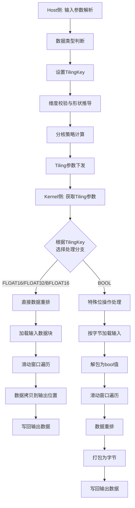

# Im2col算子开发设计文档

## 一、需求背景

### 1.1 需求来源

通过社区任务完成开源仓算子贡献的需求。

### 1.2 背景介绍

#### 1.2.1 Im2col算子实现优化

本次开发的核心任务是在 Ascend C 侧实现与 TBE 算子功能完全对齐的 Im2col 算子，并新增 bool 数据类型的支持。Im2col 算子是卷积操作的关键预处理步骤，将输入张量转换为适合矩阵乘法的形式，在深度学习框架中广泛应用。

**TBE算子源码获取路径：**
- kernel 实现：`/usr/local/Ascend/ascend-toolkit/latest/opp/built-in/op_impl/ai_core/tbe/impl`
- 算子原型：`/usr/local/Ascend/ascend-toolkit/latest/opp/built-in/op_proto/inc/`
- 算子信息库：`/usr/local/Ascend/ascend-toolkit/latest/opp/built-in/op_impl/ai_core/tbe/config/ascend910b`

#### 1.2.2 Im2col算子现状分析

##### 1.2.2.1 TBE算子支持的数据类型和数据格式

原有 TBE Im2col 算子支持的数据类型：
- **数据类型**：FLOAT16、FLOAT32、BFLOAT16
- **数据格式**：ND
- **输入维度**：3维或4维

本次开发需要在原有基础上新增对 BOOL 数据类型的支持。

##### 1.2.2.2 TBE算子实现描述

Im2col 算子的核心功能是将输入张量（通常是图像数据）按照卷积核大小、步长、膨胀和填充参数进行重排，转换为二维矩阵形式，以便后续进行高效的矩阵乘法运算。

**核心计算逻辑：**
1. **输入处理**：接收3维或4维输入张量（NCHW或CHW格式）
2. **参数解析**：解析 kernelSize、dilation、padding、stride 参数
3. **输出形状计算**：根据输入形状和参数计算输出矩阵的维度
4. **数据重排**：按照滑动窗口的方式将输入数据重排到输出矩阵中

**输出形状计算公式：**
- 对于4维输入 (N, C, H, W)：
  - 输出高度：`H_out = (H + 2*padding[0] - dilation[0]*(kernelSize[0]-1) - 1) / stride[0] + 1`
  - 输出宽度：`W_out = (W + 2*padding[1] - dilation[1]*(kernelSize[1]-1) - 1) / stride[1] + 1`
  - 输出形状：`(N, C*kernelSize[0]*kernelSize[1], H_out*W_out)`

- 对于3维输入 (C, H, W)：
  - 输出形状：`(C*kernelSize[0]*kernelSize[1], H_out*W_out)`

##### 1.2.2.3 TBE算子实现流程图

```mermaid
graph TD
    %% ==========================================
    %% PHASE 1: HOST SIDE ENTRY & VALIDATION
    %% ==========================================
    Start([Input: aclnnIm2col API Call]) --> Host_Init["Host侧: 接收输入张量 self 及数组参数 (kernelSize, dilation, padding, stride)"]
    
    subgraph Host_Validation ["Phase 1: Host侧参数校验与形态推导工作流"]
        Host_Init --> Check_Dim{"验证 self 维度约束"}
        Check_Dim -->|"不符合 3D 或 4D"| Err_Dim["抛出异常: 维度非 3D/4D 边界"]
        Check_Dim -->|"符合 3D 或 4D"| Check_Params{"验证数组参数合法性"}
        
        Check_Params -->|"大小 <= 0 或 padding < 0"| Err_Param["抛出异常: 参数超出边界约束"]
        Check_Params -->|"参数合法"| Calc_H_Out["计算输出高度: H_out = (H + 2*padding[0] - dilation[0]*(kernelSize[0]-1) - 1) / stride[0] + 1"]
        Check_Params -->|"参数合法"| Calc_W_Out["计算输出宽度: W_out = (W + 2*padding[1] - dilation[1]*(kernelSize[1]-1) - 1) / stride[1] + 1"]
        
        Calc_H_Out & Calc_W_Out --> Merge_Shape{"根据输入维度推导最终输出 Shape"}
        Merge_Shape -->|"4D 输入 (N, C, H, W)"| Shape_4D["输出 Shape 确立: (N, C * kernelSize[0] * kernelSize[1], H_out * W_out)"]
        Merge_Shape -->|"3D 输入 (C, H, W)"| Shape_3D["输出 Shape 确立: (C * kernelSize[0] * kernelSize[1], H_out * W_out)"]
    end

    %% ==========================================
    %% PHASE 2: HOST TILING & DISPATCH
    %% ==========================================
    Shape_4D & Shape_3D --> Host_Tiling["Host侧 Nost Tiling 策略分发模块"]
    
    subgraph Host_Tiling_Module ["Phase 2: Tiling 资源分配与多核切分策略"]
        Host_Tiling --> Get_Cores["获取硬件可用 AI Core 核心数"]
        Get_Cores --> Divide_Grid["负载均衡计算: 按照输出矩阵总列数 (H_out * W_out) 进行分块切分"]
        Divide_Grid --> Local_Mem_Plan["LocalMemory 优化配比计算 (输入/输出/工作空间缓存大小划分)"]
        
        Local_Mem_Plan --> Match_TilingKey{"匹配数据类型与高维矩阵映射"}
        Match_TilingKey -->|"FLOAT16 场景"| TK_01["设置 TilingKey = 0 (3D) 或 1 (4D)"]
        Match_TilingKey -->|"FLOAT32 场景"| TK_23["设置 TilingKey = 2 (3D) 或 3 (4D)"]
        Match_TilingKey -->|"BFLOAT16 场景"| TK_45["设置 TilingKey = 4 (3D) 或 5 (4D)"]
        Match_TilingKey -->|"BOOL 场景"| TK_67["设置 TilingKey = 6 (3D) 或 7 (4D)"]
    end

    TK_01 & TK_23 & TK_45 & TK_67 --> Dispatch_Param["将 Tiling 结构体参数通过参数空间下发至 Kernel 侧"]

    %% ==========================================
    %% PHASE 3: KERNEL SIDE DISPATCH
    %% ==========================================
    Dispatch_Param --> Kernel_Entry[[Kernel侧入口: 获取通用 Tiling 结构体参数]]
    Kernel_Entry --> Check_TK{"核心路由: 根据 TilingKey 分发内核处理分支"}

    %% ==========================================
    %% PHASE 4: BRANCH A - FLOATING POINT PATH
    %% ==========================================
    Check_TK -->|"Key 0 ~ 5: 浮点数据路径"| Float_Path["FLOAT16 / FLOAT32 / BFLOAT16 核心重排逻辑"]
    
    subgraph Float_Kernel_Core ["Phase 3-A: 浮点向量加速流水线 (通用路径)"]
        Float_Path --> Float_Buffer["初始化双缓冲 Ping-Pong Queue (隐藏 GM 与 Local UB 搬运延迟)"]
        Float_Buffer --> Float_Loop_Out["外层循环: 遍历当前核分配的输出位置坐标 (h_out, w_out)"]
        Float_Loop_Out --> Float_Loop_In["内层循环: 遍历通道与卷积核空间 (c, kh, kw)"]
        
        Float_Loop_In --> Float_Calc_Addr["寻址映射公式计算: h_in = h_out*stride[0] + kh*dilation[0] - padding[0]; w_in = w_out*stride[1] + kw*dilation[1] - padding[1]"]
        
        Float_Calc_Addr --> Float_Bound_Check{"边界判定: (h_in, w_in) 是否在有效矩阵网格内"}
        Float_Bound_Check -->|"Yes"| Float_Load["调用 Ascend C 向量加载接口: 高吞吐将数据由 GM 载入 Local UB"]
        Float_Bound_Check -->|"No (Padding区域)"| Float_Zero["Local UB 对应内存位置强刷为 0"]
        
        Float_Load & Float_Zero --> Float_Remap["重排映射矩阵填充: output(c*kH*kW + kh*kW + kw, h_out*W_out + w_out) = input(c, h_in, w_in)"]
        Float_Remap --> Float_Check_Tile{"检查当前 Tile 数据块是否遍历完毕"}
        Float_Check_Tile -->|"No"| Float_Loop_In
        Float_Check_Tile -->|"Yes"| Float_Write_GM["调用 DataCopy 向量化将结果块整批异步写回全局内存 (GM)"]
    end

    %% ==========================================
    %% PHASE 5: BRANCH B - BOOL SPECIAL PATH
    %% ==========================================
    Check_TK -->|"Key 6 ~ 7: 布尔数据路径"| Bool_Path["BOOL 类型高维位操作优化路径"]
    
    subgraph Bool_Kernel_Core ["Phase 3-B: BOOL 位深度指令优化流水线 (专用路径)"]
        Bool_Path --> Bool_Align["内存边界对齐调整: 8个 bool 值按 1 字节紧凑级进行存储与寻址处理"]
        Bool_Align --> Bool_Load_Byte["按字节大块加载输入特征图数据至本地缓冲区"]
        Bool_Load_Byte --> Bool_Unpack["硬件位指令操作: 将紧凑字节流高速解包为独立的布尔状态量"]
        
        Bool_Unpack --> Bool_Loop_Out["外层循环: 遍历当前核分配的布尔矩阵输出位置 (h_out, w_out)"]
        Bool_Loop_Out --> Bool_Loop_In["内层循环: 遍历布尔通道与核映射空间 (c, kh, kw)"]
        
        Bool_Loop_In --> Bool_Calc_Addr["寻址映射公式计算: h_in = h_out*stride[0] + kh*dilation[0] - padding[0]; w_in = w_out*stride[1] + kw*dilation[1] - padding[1]"]
        
        Bool_Calc_Addr --> Bool_Bound_Check{"边界判定: (h_in, w_in) 是否在有效矩阵网格内"}
        Bool_Bound_Check -->|"Yes"| Bool_Remap_True["提取对应解包后的布尔变量进行重排映射"]
        Bool_Bound_Check -->|"No (Padding区域)"| Bool_Remap_False["本地缓冲区直接赋值为 false"]
        
        Bool_Remap_True & Bool_Remap_False --> Bool_Pack["硬件专用位打包指令: 将 8 个重排后的布尔量重新压缩封装为 1 字节"]
        Bool_Pack --> Bool_Check_Tile{"检查当前布尔 Tile 块是否处理完毕"}
        Bool_Check_Tile -->|"No"| Bool_Loop_In
        Bool_Check_Tile -->|"Yes"| Bool_Write_GM["将压缩打包后的密集字节流通过高效指令批量刷新回 GM"]
    end

    %% ==========================================
    %% PHASE 6: OUTPUT & VERIFICATION
    %% ==========================================
    Float_Write_GM & Bool_Write_GM --> Valid_Check["可维可测与收敛验证质量阶段"]
    
    subgraph Validation_Standard ["Phase 4: 算子交付标准与多维收敛校验"]
        Valid_Check --> Precision_Verify{"精度验证: 二进制一致性对齐与全逻辑正确性判定"}
        Precision_Verify -->|"不达标 / 出现精度对齐偏置"| Fail_Loop["质量红线拦截: 重新排查指令、边界对齐或寻址偏置"]
        Precision_Verify -->|"符合 AscendOpTest 默认阈值"| Perf_Verify{"性能验证: 吞吐率与耗时多维对比"}
        
        Perf_Verify -->|"BOOL性能 >= FP16基础基准"| Pass_Exit["全指标达成: 输出张量生成并完全释放空间"]
        Perf_Verify -->|"小 Shape 耗时等未达标"| Simulation_Analyze["进入性能仿真分析: 导出仿真图并输出收敛结论报告"]
    end

    Pass_Exit --> End_Node([End: 最终输出张量返回并销毁临时空间])
    Fail_Loop --> Host_Init
    Simulation_Analyze --> Pass_Exit
```




---

## 二、需求分析

### 2.1 外部组件依赖

本算子的主要外部依赖为 ACLNN 框架，框架层需完成：
- 入参校验（维度、数据类型、参数合法性）
- 维度解析与形状推导
- 参数预处理（将 dim、index 参数转化为适配层所需的格式）

### 2.2 内部适配模块

算子内部需在 Ascend C 的以下模块进行开发：

1. **Host 侧 Tiling 模块**：
   - 为不同数据类型配置切分策略
   - 配置 TilingKey 以区分不同数据类型和维度场景
   - 计算数据分块参数

2. **Kernel 侧实现模块**：
   - 实现核心的数据重排逻辑
   - 针对 bool 类型进行特殊处理
   - 优化内存访问模式

3. **API 层参数注册**：
   - 更新算子原型，新增 bool 数据类型支持

### 2.3 需求模块设计

#### 2.3.1 AscendC算子原型

更新后的算子原型如下，已明确增加对 BOOL 的支持：

| 参数名 | 输入/输出/属性 | 描述 | 使用说明 | 数据类型 | 数据格式 | 维度(shape) | 非连续Tensor |
|---|---|---|---|---|---|---|---|
| self | 输入 | 输入张量 | shape为3维或4维 | FLOAT16、FLOAT、BFLOAT16、**BOOL** | ND | [3,4] | - |
| kernelSize | 输入数组 | 卷积核的大小 | size为2，kernelSize[0]表示'H'方向，kernelSize[1]表示'W'方向 | INT64 | - | - | - |
| dilation | 输入数组 | 膨胀参数 | size为2，dilation[0]表示'H'方向，dilation[1]表示'W'方向 | INT64 | - | - | - |
| padding | 输入数组 | 填充大小 | size为2，padding[0]表示H方向，padding[1]表示W方向 | INT64 | - | - | - |
| stride | 输入数组 | 步长 | size为2，stride[0]表示H方向，stride[1]表示W方向 | INT64 | - | - | - |
| out | 输出 | 输出张量 | shape根据参数推导得出 | FLOAT16、FLOAT、BFLOAT16、**BOOL** | ND | - | - |

#### 2.3.2 AscendC算子相关约束

与 TBE 算子相比，Ascend C 算子需要补充的功能：
1. **BOOL 数据类型支持**：TBE 算子原生不支持 bool 类型，需要在 Ascend C 实现中新增该数据类型的支持
2. **性能优化要求**：bool 类型输入性能不低于原 TBE 算子的 float16 类型

---

## 三、需求详细设计

### 3.1 使能方式

通过 ACLNN 接口进行算子的调用和使能。算子调用框架为 ACLNN，需完成 aclnnIm2col 接口的实现。

### 3.2 需求总体设计

#### 3.2.1 host侧设计

##### 3.2.1.1 分核策略

1. **数据量计算**：
   - 计算输入张量的总数据量
   - 根据输出形状计算输出数据量

2. **核数分配**：
   - 获取设备可用核心数
   - 依据输入总数据量进行均分
   - 对于 bool 类型，考虑其特殊的数据表示方式（1 bit vs 8 bits），需要调整数据分块策略

3. **数据分块策略**：
   - 按照输出矩阵的列（H_out*W_out）进行分块
   - 每个核处理若干列的数据重排
   - 确保数据对齐，避免跨核数据依赖

##### 3.2.1.2 数据分块和内存优化策略

**LocalMemory 使用情况：**
- 输入数据缓存：根据 kernelSize 和 dilation 计算所需缓存大小
- 输出数据缓存：按照分块大小分配输出缓存
- 临时工作空间：用于存储中间计算结果

**计算公式：**
```
输入缓存大小 = C * kernelSize[0] * kernelSize[1] * dilation_factor
输出缓存大小 = tile_size * C * kernelSize[0] * kernelSize[1]
其中 dilation_factor = (dilation[0]-1) * kernelSize[0] + (dilation[1]-1) * kernelSize[1] + 1
```

##### 3.2.1.3 TilingKey规划策略

根据不同场景设置 TilingKey：

| TilingKey | 数据类型 | 输入维度 | 说明 |
|---|---|---|---|
| 0 | FLOAT16 | 3D | 3维输入，float16类型 |
| 1 | FLOAT16 | 4D | 4维输入，float16类型 |
| 2 | FLOAT32 | 3D | 3维输入，float32类型 |
| 3 | FLOAT32 | 4D | 4维输入，float32类型 |
| 4 | BFLOAT16 | 3D | 3维输入，bfloat16类型 |
| 5 | BFLOAT16 | 4D | 4维输入，bfloat16类型 |
| 6 | BOOL | 3D | 3维输入，bool类型 |
| 7 | BOOL | 4D | 4维输入，bool类型 |

#### 3.2.2 kernel侧设计

##### 3.2.2.1 kernel侧实现描述

**核心实现逻辑：**

1. **数据类型处理**：
   - **FLOAT16/FLOAT32/BFLOAT16**：直接进行数据拷贝和重排
   - **BOOL**：需要特殊的位操作处理
     - 输入读取：按字节读取，解包为 bool 值
     - 数据处理：按照 bool 逻辑进行重排
     - 输出写入：将 bool 值打包为字节输出

2. **滑动窗口实现**：
   ```
   for each output position (h_out, w_out):
       for each channel c:
           for each kernel position (kh, kw):
               计算输入位置：
               h_in = h_out * stride[0] + kh * dilation[0] - padding[0]
               w_in = w_out * stride[1] + kw * dilation[1] - padding[1]
               
               if (h_in, w_in) 在有效范围内:
                   output[c*kH*kW + kh*kW + kw, h_out*W_out + w_out] = input[c, h_in, w_in]
               else:
                   output[c*kH*kW + kh*kW + kw, h_out*W_out + w_out] = 0 (或 false for bool)
   ```

3. **内存访问优化**：
   - 使用双缓冲技术隐藏内存延迟
   - 向量化加载和存储
   - 针对 bool 类型使用位操作指令

4. **边界处理**：
   - 处理 padding 区域（填充0或false）
   - 处理 dilation 造成的空洞

##### 3.2.2.2 AscendC实现流程图



##### 3.2.2.3 AscendC实现流程图与TBE流程图存在的差异点和原因

**差异点：**

1. **BOOL 数据类型处理**：
   - TBE：不支持 bool 类型
   - Ascend C：新增 bool 类型支持，需要特殊的位操作处理

2. **内存访问模式**：
   - TBE：使用高级 API 进行数据访问
   - Ascend C：直接操作底层内存，使用向量化指令优化

3. **并行策略**：
   - TBE：基于 TIK 的自动并行化
   - Ascend C：手动设计分核策略和数据分块

**原因：**

1. **硬件贴近性**：Ascend C 更贴近底层硬件架构，可以直接使用硬件提供的向量化指令和位操作指令，从而实现更高效的 bool 类型处理。

2. **性能优化需求**：任务要求 bool 类型性能不低于 float16，需要充分利用 Ascend C 的底层优化能力，包括：
   - 位操作指令加速 bool 数据处理
   - 手动优化内存访问模式
   - 精细控制数据分块和核间负载均衡

3. **泛化能力**：Ascend C 实现需要支持更广泛的输入场景，包括不同维度、不同参数组合，需要更灵活的 Tiling 策略。

### 3.3 支持硬件

支持 **Atlas A2 训练系列产品 / Atlas A3 系列产品**。

### 3.4 算子约束限制

1. **输入维度约束**：输入张量的维度必须是3维或4维
2. **参数大小约束**：
   - kernelSize、dilation、padding、stride 的 size 必须为2
   - kernelSize、dilation、stride 的值必须大于0
   - padding 的值不能小于0
3. **数据类型约束**：
   - 输入和输出的数据类型必须一致
   - 支持 FLOAT16、FLOAT32、BFLOAT16、BOOL 四种数据类型
4. **内存约束**：
   - bool 类型数据在内存中以字节形式存储（每8个bool值占用1字节）
   - 需要考虑内存对齐要求

---

## 四、特性交叉分析

本算子是对已有 Im2col 功能在数据类型维度的扩展，主要涉及：
1. **数据类型扩展**：新增 bool 类型支持，与原有浮点类型实现并行
2. **内存布局**：bool 类型的特殊内存表示（位打包）需要独立的处理路径
3. **与其他算子的关系**：Im2col 通常作为卷积操作的预处理步骤，需要与后续矩阵乘法算子保持数据格式兼容

**交叉影响分析：**
- 与卷积算子：Im2col 的输出直接作为矩阵乘法的输入，需要确保输出格式符合后续算子的要求
- 与数据类型转换算子：bool 类型的处理逻辑独立，不影响其他数据类型的转换流程
- 与内存管理模块：bool 类型的位打包/解包需要额外的内存管理逻辑

---

## 五、可维可测分析

### 5.1 精度标准/性能标准

#### 精度标准

1. **计算精度**：算子计算精度需满足 AscendOpTest 工具默认阈值
2. **二进制一致性**：与原 TBE 算子核心功能完全对齐，精度标准为二进制一致（对于相同的数据类型）
3. **bool 类型精度**：需要确保 bool 类型的逻辑正确性，所有 true/false 值准确无误

#### 性能标准

1. **基础性能要求**：
   - 所有核参与计算场景下，bool 类型输入性能不低于原 TBE 算子的 float16 类型
   - 其他类型（FLOAT16、FLOAT32、BFLOAT16）性能不低于原 TBE 算子

2. **小 shape 场景处理**：
   - 如小 shape 无法达标（10us以下场景相差3us），需提供性能仿真图和分析结论
   - 证明 Ascend C 实现与 TBE 完全一致或优于 TBE 实现

3. **性能测试维度**：
   - 不同输入维度（3D、4D）
   - 不同数据类型（FLOAT16、FLOAT32、BFLOAT16、BOOL）
   - 不同参数组合（kernelSize、dilation、padding、stride）
   - 不同输入大小（小、中、大 shape）

### 5.2 兼容性分析

1. **向下兼容**：
   - 新增 bool 类型不影响原有浮点类型的算子行为
   - API 接口保持向后兼容，原有调用方式继续有效

2. **框架兼容**：
   - 外层 API 调用时，不同数据类型的转发基于 TilingKey 透明完成
   - 深度学习框架（如 PyTorch）可以无缝对接底层新支持的 bool 类型

3. **硬件兼容**：
   - 支持 Atlas A2 训练系列产品 / Atlas A3 系列产品
   - 不同硬件平台上的性能表现可能有差异，但功能保持一致

4. **测试覆盖**：
   - 需参考内置 TBE 算子自行设计全场景自验证用例
   - 验收阶段将采用泛化数据进行功能、精度、性能全维度验证
   - 自验证报告需完整、可复现，所有测试用例执行通过