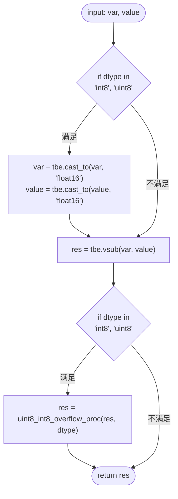
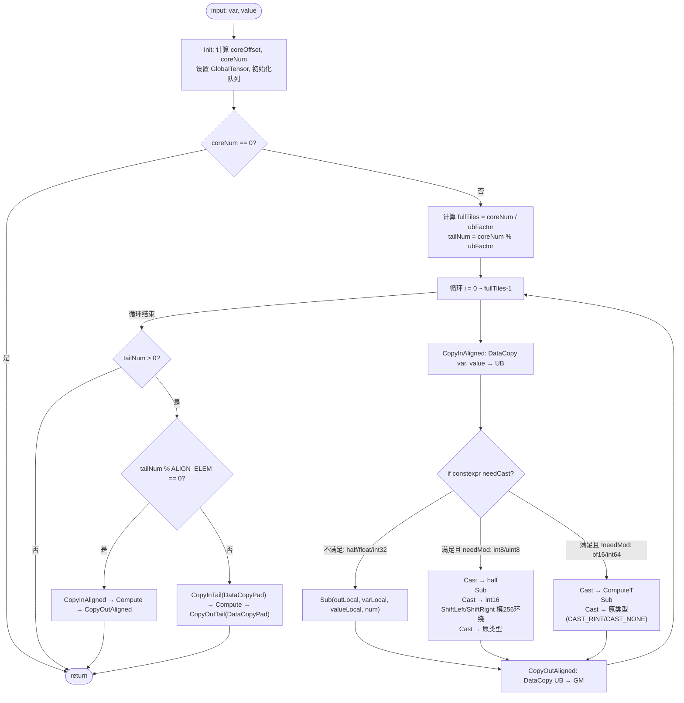

# AssignSub 算子设计方案

## 1 需求背景（required）

### 1.1 需求来源

CANN 训练营 2026 暑期季 — 西北工业大学专场 AssignSub 算子开发任务。参考昇腾内置 AssignSub 算子的 TBE 实现，基于 Ascend C 编程语言在昇腾 NPU（Atlas A2 训练系列产品 / Atlas A3 系列产品）上实现功能一致、支持泛化输入的自定义算子，并完成设计、开发、测试全流程，验收通过后提交至昇腾算子开源仓 ops-math。

### 1.2 背景介绍

#### 1.2.1 AssignSub 算子实现优化

基于 AssignSub 算子历史 TBE 版本，使用 Ascend C 编程语言重新实现并优化。AssignSub 为逐元素（element-wise）算子，功能为将输入张量 `value` 从 `var` 中逐元素减去，即 `var_out = var − value`，`var` 与 `value` 具有相同的 shape 与 dtype。

#### 1.2.2 AssignSub 算子（TBE）实现路径和相关 API 路径

- kernel 实现路径：`/usr/local/Ascend/ascend-toolkit/latest/opp/built-in/op_impl/ai_core/tbe/impl/dynamic/`
- 算子原型路径：`/usr/local/Ascend/ascend-toolkit/latest/opp/built-in/op_proto/inc/`
- 算子信息库路径：`/usr/local/Ascend/ascend-toolkit/latest/opp/built-in/op_impl/ai_core/tbe/config/ascend910b`

#### 1.2.3 AssignSub 算子现状分析

通过对 AssignSub 算子 TBE 版本的功能分析，当前支持的能力如下：

- ① `var`、`value` 两个输入支持 float16、float32、int32、int8、uint8 等数据类型，二者 shape 与 dtype 完全一致，输出 `var_out` 与 `var` 同 shape、同 dtype。
- ② 算子按 ELEWISE（逐元素）模式进行 classify 与 variable_shape 处理，计算过程与数据维度无关，可视为一维向量处理。
- ③ 核心计算调用 `vsub` 接口实现 `var − value`；对 int8、uint8 输入，先 cast 到 float16 做减法，再通过 `uint8_int8_overflow_proc` 对结果按 256 取模实现溢出环绕（wrap-around），最后 cast 回原类型。

AssignSub 算子 TBE 版本核心计算逻辑：`res = tbe.vsub(var, value)`；int8/uint8 场景增加 cast 与溢出取模处理。

**AssignSub 算子 TBE 版本整体流程图：**

## 2 需求分析

### 2.1 外部组件依赖

不涉及外部组件依赖。

### 2.2 内部适配模块

适配 Aclnn 接口和图模式（ATC 推理）调用。

### 2.3 需求模块设计

#### 2.3.1 算子原型

**原型设计**

| 名称 | 类别 | dtype | format | shape | 介绍 |
| --- | --- | --- | --- | --- | --- |
| var | 输入 | fp16/fp32/int32/int8/uint8/bf16/int64 | ND | all | 被减数张量 |
| value | 输入 | fp16/fp32/int32/int8/uint8/bf16/int64 | ND | all | 减数张量，与 var 同 shape、同 dtype |
| var_out | 输出 | fp16/fp32/int32/int8/uint8/bf16/int64 | ND | 同输入 | 计算结果 var − value，与 var 同 shape、同 dtype |

**相关约束**

Atlas A2 训练系列产品 / Atlas A3 系列产品，支持 float16、float32、int32、int8、uint8、bfloat16、int64 数据类型；var 与 value 的 shape 和 dtype 必须一致，算子不涉及广播。

## 3 需求详细设计

### 3.1 使能方式

| 上层框架 | 涉及的框架勾选 |
| --- | --- |
| TF 训练/推理 |  |
| Pytorch 训练/推理 |  |
| ATC 推理 | √ |
| Aclnn 直调 | √ |
| OPAT 调优 |  |
| SGAT 子图切分 |  |

### 3.2 需求总体设计

#### 3.2.1 host 侧设计

**tiling 策略：** AssignSub 为逐元素算子，计算过程不涉及数据的维度信息，故在 host 侧将 `var`、`value` 视为一维向量，仅通过 `GetInputShape(0)->GetStorageShape().GetShapeSize()` 获取总元素数 `totalNum`，不关心具体维度。通过 `GetInputDesc(0)->GetDataType()` 获取输入数据类型，据此确定单元素在 UB 中占用的字节数并选择 tilingKey。需要传到 kernel 侧的 tiling 参数为 `totalNum`、`blockFactor`、`ubFactor` 三个变量（`AssignSubTilingData` 结构体）。

**分核策略**

- 优先使用满核的原则：`coreNum` 取平台 AIV 核数（`GetCoreNumAiv`）。
- 每核处理元素数 `perCore = CeilDiv(totalNum, coreNum)`，并向上对齐到一个 32B block 的元素个数 `alignNum`（= 32 / dtypeSize），得到 `blockFactor = CeilAlign(perCore, alignNum)`。
- 实际启用核数 `usedCoreNum = CeilDiv(totalNum, blockFactor)`，通过 `SetBlockDim(usedCoreNum)` 设置；核间能均分则大小核一致，不能均分则余出数据由靠前的核多承担一个 `blockFactor`，尾核处理剩余数据。
- 大 shape 时进一步将每核边界对齐到 512B（`COARSE_ALIGN_BYTES`），使各核 GM 访问起始落在 HBM burst 边界以提升带宽利用率；仅当不减少参与核数时才启用，避免拖累中小 shape。

**数据分块和内存优化策略**

- 充分使用 UB 空间的原则：通过 `GetCoreMemSize(UB, ubSize)` 获取 UB 大小，开启 double buffer（`BUFFER_NUM=2`）。
- 按数据类型分别估算单元素在 UB 中的占用字节 `perElemBytes`：不需要类型转换的 half/float/int32 为 `3×BUFFER_NUM×dtypeSize`（var/value/out 三块队列）；int8/uint8 额外加两块 half 临时缓存；bf16 额外加两块 float 临时缓存；int64 额外加两块 int32 临时缓存。
- 单次 UB 循环处理的元素数 `ubFactor = FloorAlign(ubSize / perElemBytes, alignNum)`，并保证 `alignNum ≤ ubFactor ≤ blockFactor`，从而将单核数据切分为若干次 UB 循环处理。
- 空 tensor（`totalNum ≤ 0`）场景直接置 `totalNum=0`、`SetBlockDim(1)` 并正常返回，kernel 侧不做计算。

**tilingkey 规划策略**

需要感知 host 侧的数据类型信息，让 kernel 侧走不同计算分支。在 host 侧按输入 dtype 设置 tilingKey（模板参数 `schMode`）：

| dtype | tilingKey / schMode | kernel 计算路径 |
| --- | --- | --- |
| float16 | 0 | 直接 Sub |
| int8 | 1 | cast→half，Sub，模 256 环绕，cast 回 int8 |
| float32 | 2 | 直接 Sub |
| int32 | 3 | 直接 Sub |
| uint8 | 4 | cast→half，Sub，模 256 环绕，cast 回 uint8 |
| bfloat16 | 5 | cast→float，Sub，cast 回 bf16（CAST_RINT） |
| int64 | 6 | cast→int32，Sub，cast 回 int64 |

`schMode` 使用 3-bit 位宽声明（`ASCENDC_TPL_UINT_DECL(schMode, 3, ...)`），覆盖 0~6 共 7 个取值。

**数据检测：** 在 tiling 阶段对不支持的数据类型（`GetDtypeInfo` 的 default 分支）直接返回 `ge::GRAPH_FAILED` 并打印错误日志，避免非法 dtype 进入 kernel 计算。

#### 3.2.2 kernel 侧设计

kernel 侧采用 Init 和 Process 两个阶段，其中 Process 包括数据搬入（CopyIn）、计算（Compute）、搬出（CopyOut）三个阶段，并通过 double buffer 实现搬运与计算的流水并行。

**Ascend C 的 AssignSub 算子流程图：**

- **Init**：根据 tiling 参数 `totalNum`、`blockFactor`、`ubFactor`，结合 `GetBlockIdx()` 计算本核全局起始偏移 `coreOffset` 与本核实际处理元素数 `coreNum`，设置 var/value/var_out 的 GlobalTensor，并按 `ubFactor` 初始化输入/输出队列及必要的类型转换临时缓存。
- **CopyIn**：整块 32B 对齐时使用更轻量的 `DataCopy`，非对齐尾块使用 `DataCopyPad`，从而在保证任意泛化 shape 正确性的同时降低搬运指令开销。
- **Compute**：按 tilingKey 对应的数据类型走不同分支——half/float/int32 直接调用 `AscendC::Sub`；int8/uint8 先 cast 到 half 做减法，再 cast 到 int16/uint16 并用 `ShiftLeft/ShiftRight` 保留低 8 位实现模 256 环绕（int8 用算术移位符号扩展至 [−128,127]，uint8 用逻辑移位至 [0,255]），最后 cast 回原类型，与 TBE 的 `uint8_int8_overflow_proc` 溢出语义一致；bf16 先 cast 到 float 做减法，再以 CAST_RINT 舍入 cast 回 bf16；int64 先 cast 到 int32 做减法，再 cast 回 int64。
- **CopyOut**：整块用 `DataCopy`、尾块用 `DataCopyPad` 将结果从 UB 搬回 GM 的 var_out。
- **Process**：按 `coreNum` 与 `ubFactor` 计算循环次数 `loopCount`，逐次执行 CopyIn→Compute→CopyOut，尾次自动处理不足 `ubFactor` 的余量。

由于支持 Ascend C 开发的硬件中 `AscendC::Sub` 支持 half、float、int16、int32 数据的输入，故对 int8/uint8/bf16/int64 等不被 Sub 直接支持的类型，均先转换到受支持的中间类型（half/float/int32）计算后再转回原类型，其余类型保持原类型直接计算。根据不同的 tilingkey 执行不同的核函数分支。

### 3.3 支持硬件

| 支持的芯片版本 | 涉及勾选 |
| --- | --- |
| 香橙派 OrangePi AIpro |  |
| Atlas 200I/500 A2 推理产品 |  |
| Atlas A2 训练系列产品 / Atlas 800I A2 | √ |
| Atlas A3 系列产品 | √ |

### 3.4 算子约束限制

- 不支持广播：var 与 value 必须 shape、dtype 完全一致。
- int8/uint8 溢出按 256 取模环绕，与 TBE 保持一致（非饱和）。
- int64 的减法经 int32 中间类型计算，输入数值需在 int32 表示范围内以保证结果精确。

## 4 特性交叉分析

AssignSub 为独立的逐元素基础算子，不与其他特性交叉，无特殊交叉场景。

## 5 可维可测分析

### 5.1 精度标准/性能标准

| 验收标准 | 描述（不涉及说明原因） | 标准来源 |
| --- | --- | --- |
| 精度标准 | 满足 CANN Judge 平台对应题目默认阈值：整数类型（int8/uint8/int32/int64）二进制一致或绝对误差为 0；浮点类型 MERE < 阈值且 MARE < 10×阈值（fp16 阈值 2^-10、bf16 阈值 2^-7、fp32 阈值 2^-13）。 | CANN Judge / TBE 版本 |
| 性能标准 | 所有核参与计算场景下不低于原 TBE 算子的 95%。真机实测带宽稳定在约 1190 GB/s，高于华为官方 aclnnSub（约 1170 GB/s），已达该硬件逐元素 HBM 带宽上限。 | 不低于 TBE 版本 |

### 5.2 兼容性分析

新算子，不涉及兼容性分析。
