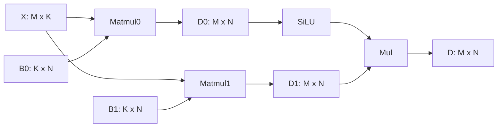
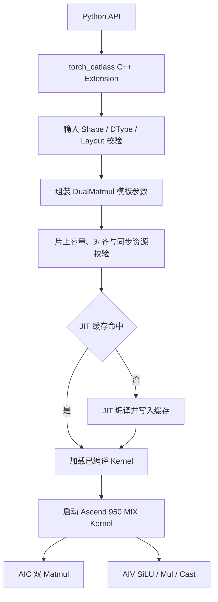
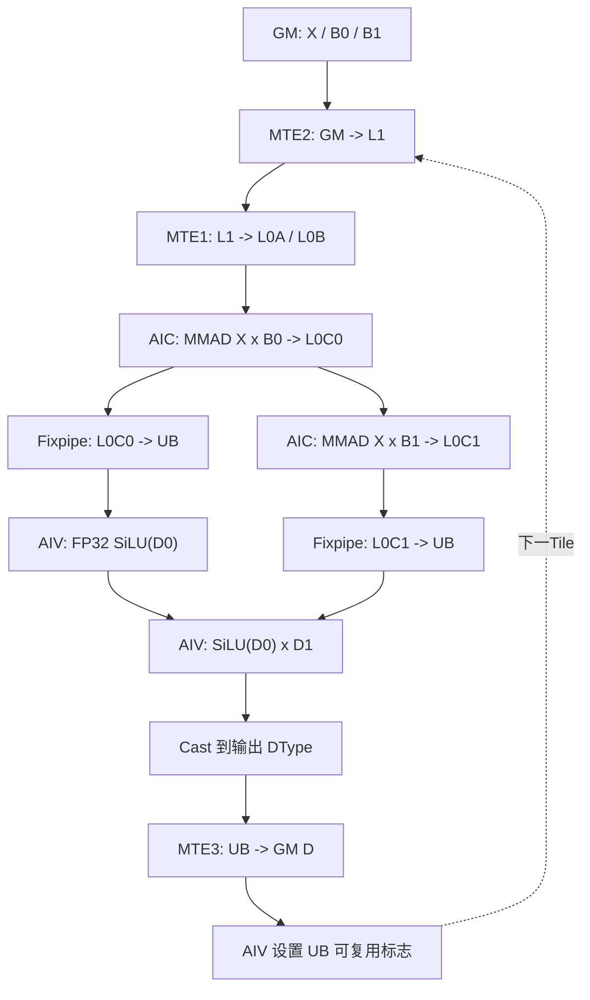

# 【社区任务】DualMatmul算子设计文档

## 一、需求背景

### 1.1 需求来源

本需求来源于 2026 年 7 月社区任务 DualMatmul，目标是在 `cann/catlass` 仓中新增共享输入矩阵的双 Matmul 与逐元素融合实现，并补充 CATLASS-optest 测试交付件。适配硬件为 Ascend 950，开发语言为 Ascend C。

算子在一次 kernel launch 内完成以下计算：

$$
\begin{aligned}
D_0 &= X \times B_0 \\
D_1 &= X \times B_1 \\
D &= \operatorname{SiLU}(D_0) \odot D_1
\end{aligned}
$$

其中：

$$
\operatorname{SiLU}(x)=x\cdot\sigma(x)=\frac{x}{1+e^{-x}}
$$

该计算对应 GLU 变体中的门控融合结构。与依次调用两次 Matmul、SiLU 和 Mul 的小算子拼接方案相比，融合实现避免了两个 FP32 中间矩阵写入 Global Memory 后再次读回，减少 kernel launch、同步和显存访问开销。

### 1.2 背景介绍

#### 1.2.1 现有实现与优化目标

CATLASS 已提供 Matmul、Matmul + SiLU、Ascend 950 Matmul、FullLoadA Matmul，以及 L0C 到 UB 的 Fixpipe 数据通路等基础组件，但现有通用样例未直接提供“共享 X 的两个独立 Matmul + SiLU + Mul”完整实现。

本任务的主要优化目标如下：

1. 两个 Matmul 在同一 MIX kernel 内执行，共享输入矩阵 `X` 的分块及流水资源。
2. AIC 产生的两个 FP32 累加结果通过 Fixpipe 由 L0C 搬运到 UB，不落 Global Memory。
3. AIV 在 UB 中完成 SiLU、逐元素乘法和输出类型转换。
4. 根据问题规模和片上资源约束配置编译期 TileShape 与流水级数，适配不同的 M/N/K 组合。
5. 通过 CATLASS-optest 提供 Python 调用接口、正确性测试和性能采集入口。

#### 1.2.2 参考实现流程

小算子拼接参考流程如下：

| 阶段 | 输入 | 处理 | 输出 |
|---|---|---|---|
| 1 | `X`、`B0` | `Matmul(X, B0)` | `D0` 写入 GM |
| 2 | `X`、`B1` | `Matmul(X, B1)` | `D1` 写入 GM |
| 3 | `D0` | `SiLU(D0)` | 激活结果 |
| 4 | `SiLU(D0)`、`D1` | 逐元素 `Mul` | `D(M,N)` |

数据依赖关系如下：



该流程至少包含两个 Matmul kernel 和逐元素 kernel，并产生两个完整中间矩阵的 GM 写入与读取。本设计将其合并为一个 AIC/AIV 协同 kernel。

#### 1.2.3 CATLASS 适配说明

CATLASS 同时包含 Host 侧模板组装/JIT 调度代码和 Device 侧 Ascend C kernel 代码，并非纯 Host 库。本任务按 CATLASS 的交付范式实现：

- Host 侧完成输入校验、模板实例化和 JIT kernel 发起。
- Device 侧由 AIC 执行双 Matmul，由 AIV 执行融合后处理。
- `tests/optest` 提供 PyTorch 扩展入口和测试入口。

## 二、需求分析

### 2.1 外部组件依赖

本任务不新增第三方依赖，复用以下已有组件：

| 组件 | 用途 |
|---|---|
| CATLASS/TLA Tensor 与 Layout | 描述 GM、L1、L0A/L0B/L0C、UB 中的矩阵及布局 |
| CATLASS TileCopy/TileMmad | 完成分级搬运和 Cube 矩阵乘 |
| Ascend C Fixpipe | 将 FP32 累加结果由 L0C 搬运到 UB |
| Ascend C Vector API | 完成 Exp、Adds、Div、Mul、Cast 等逐元素计算 |
| CATLASS JIT Compiler | 按 dtype 和编译期 TileShape 生成 kernel |
| CATLASS-optest | Python 接口、正确性测试和性能验收 |

### 2.2 内部适配模块

| 类型 | 模块 | 说明 |
|---|---|---|
| 新增 | `examples/74_ascend950_dual_matmul_silu_mul/` | 独立编译运行的 CATLASS 创新样例与使用说明 |
| 新增 | `include/catlass/gemm/kernel/dual_matmul_silu_mul_tla.hpp` | MIX Kernel 参数、Tile 调度及 AIC/AIV 总体编排 |
| 新增 | `include/catlass/gemm/block/block_mmad_dual_shared_a.hpp` | 共享 A 的双 B BlockMmad、L1/L0 流水及双 L0C 累加 |
| 新增 | `include/catlass/epilogue/block/block_epilogue_dual_silu_mul.hpp` | Fixpipe 结果区、AIV 子块划分和块级后处理编排 |
| 新增 | `include/catlass/epilogue/tile/tile_silu_mul.hpp` | Tile 级 FP32 SiLU、Mul 与输出 Cast |
| 新增 | `tests/optest/kernels/74_ascend950_dual_matmul_silu_mul/` | Host 选择、JIT 宏生成和 Device kernel 实现 |
| 新增 | `tests/optest/src/include/template/dual_matmul.h` | C++ 调用模板与参数封装 |
| 修改 | `tests/optest/include/catlass_kernel_jit.h` | 注册 DualMatmul JIT kernel 接口 |
| 修改 | `tests/optest/include/catlass_torch.h`、`tests/optest/src/catlass_torch.cpp` | 注册 PyTorch 扩展接口 |
| 新增 | `tests/optest/torch_catlass/ops/ascend950_dual_matmul_silu_mul.py` | Python API 封装 |
| 新增 | `tests/optest/tests/test_74_ascend950_dual_matmul_silu_mul.py` | optest 正确性测试 |

上述组件按 `gemm/kernel`、`gemm/block`、`epilogue/block` 和 `epilogue/tile` 分层新增，不修改既有通用 BlockMmad 行为。算子入口仅负责模板组装，各层分别承担调度、双路矩阵计算和融合后处理职责。

### 2.3 需求模块设计

#### 2.3.1 算子接口与参数

Python 侧接口语义为：

```python
torch_catlass.ascend950_dual_matmul_silu_mul(x, b0, b1, out_dtype)
```

参数定义如下：

| 名称 | 输入/输出 | 数据类型 | 数据格式/布局 | Shape | 说明 |
|---|---|---|---|---|---|
| `X` | 输入 | FP16/BF16 | ND/RowMajor | `(M, K)` | 两个 Matmul 的共享左矩阵 |
| `B0` | 输入 | FP16/BF16 | ND/ColumnMajor | `(K, N)` | 门控分支右矩阵 |
| `B1` | 输入 | FP16/BF16 | ND/ColumnMajor | `(K, N)` | 上投影分支右矩阵 |
| `D` | 输出 | FP16/BF16 | ND/RowMajor | `(M, N)` | `SiLU(X@B0) * (X@B1)` |

上表中的 `(K,N)` 是 B 矩阵的逻辑 shape。PyTorch 接口接收连续物理 Tensor `b0/b1`，其物理 shape 为 `(N,K)`；CATLASS 将该连续内存按 ColumnMajor 逻辑矩阵 `(K,N)` 解释。因此 Python 参考计算使用 `x @ b0.T` 和 `x @ b1.T`，C++/CATLASS 侧数学语义仍为 `X@B0` 和 `X@B1`。

`X`、`B0`、`B1` 使用相同输入 dtype；输出 dtype 独立选择 FP16 或 BF16，因此支持以下组合：

| 输入 dtype | 输出 dtype |
|---|---|
| FP16 | FP16 |
| FP16 | BF16 |
| BF16 | FP16 |
| BF16 | BF16 |

两个 Matmul 的累加类型统一为 FP32，SiLU 与 Mul 在 FP32 域计算，仅在最终写回前转换为输出 dtype。

#### 2.3.2 算子相关约束

1. `M`、`N`、`K` 必须大于 0。
2. `B0` 与 `B1` 的 shape、dtype 和布局必须一致。
3. `X.shape[1]` 必须等于 `B0.shape[0]`，输出 shape 为 `(M,N)`。
4. 当前任务范围为二维连续矩阵，不支持 batch 和任意非连续 stride。
5. 单次调用只产生最终输出 `D`，`D0`、`D1` 均为 UB 内部临时数据，不暴露 GM workspace。

## 三、需求详细设计

### 3.1 使能方式

| 调用方式 | 是否支持 | 说明 |
|---|---|---|
| CATLASS-optest/PyTorch 扩展 | 支持 | 本任务正式测试与验收入口 |
| CATLASS C++ JIT 调用 | 支持 | 由 optest C++ 层封装 |
| ACLNN/GE 图注册 | 不涉及 | 不属于本任务交付范式 |

调用链如下：



### 3.2 需求总体设计

#### 3.2.1 Block/Tile 模板参数选择与 AIC/AIV 编排

CATLASS 的数据分块和流水配置由 C++ 模板参数在编译期固化，不使用标准自定义算子的运行时 `TilingData/TilingKey`。Host 侧负责校验输入 shape、dtype 和布局，组装 kernel 参数，并加载对应的 JIT kernel。

##### 3.2.1.1 分核策略

输出矩阵按 M/N 方向划分为二维 Tile。Host 根据运行时可用 AIC 核数设置 kernel block 数，每个 AIC block 负责一个或多个输出 Tile，配对的 AIV block 完成对应 Tile 的融合后处理。边界 Tile 按实际有效区域完成计算和搬运。

##### 3.2.1.2 数据分块与 LocalMemory 使用

数据分块需要同时满足 L1、L0A、L0B、L0C 和 UB 的容量限制，并符合矩阵指令、Fixpipe 搬运及 Vector 计算的数据对齐要求。双路 Matmul 的累加结果在片上完成搬运和消费，不申请保存完整中间矩阵的 Global Memory workspace。

##### 3.2.1.3 编译期模板实例化

Host 侧根据输入和输出 dtype 选择模板元素类型，计算任务规模和边界信息，并校验片上容量、流水级数、数据对齐及同步资源等约束。合法模板通过 JIT 机制加载和缓存，不同模板实例共享同一套 Device 数学流程。

#### 3.2.2 Kernel 侧设计

##### 3.2.2.1 AIC 双 Matmul 主循环

每个 AIC block 为当前输出 Tile 建立：

- A 的 L1/L0A stage 缓冲；
- B0、B1 两组独立的 L1/L0B stage 缓冲；
- D0、D1 两个 L0C FP32 累加器；
- 指向 UB ping/pong 结果区的两个 Tensor。

K 方向主循环按 Tile 分段迭代，不要求完整 K 轴数据一次性驻留 L1，可适配不同的 K 规模。A 数据只加载一份并同时供 B0、B1 两路 MMAD 使用；B0 和 B1 使用独立事件组进行流水搬运。每个 K 分块中依次完成两路 MMAD，并分别累加到 D0/D1。

当前输出 Tile 的 B0 分支完成后，AIC 立即使用 Fixpipe 将 D0 从 L0C0 搬运到 UB，并通知 AIV 启动 SiLU；AIC 随后复用同一 A Tile 执行 B1 分支。D1 完成后再由 Fixpipe 搬入 UB，供 AIV 完成逐元素 Mul。Fixpipe 同时完成 NZ 到 ND 的格式转换，并删除矩阵计算产生的 dummy 数据。

##### 3.2.2.2 AIV 融合后处理

AIV 收到 D0 就绪标志后立即从 UB 读取 D0 并计算 SiLU，此时 AIC 可并行执行 B1 的 MMAD。收到 D1 就绪标志后，AIV 再完成 Mul、Cast 与写回。向量计算流程为：

```text
tmp0 = -D0
tmp1 = exp(tmp0)
tmp1 = tmp1 + 1
tmp0 = D0 / tmp1
tmp0 = tmp0 * D1
D = cast<output_dtype>(tmp0)
UB -> GM(D)
```

SiLU 与 Mul 均使用 FP32 中间结果。AIV 完成 UB 消费后设置完成标志，允许 AIC 复用 UB 区域处理下一输出 Tile。

##### 3.2.2.3 AIC-AIV 同步与 PIPE 流水

单个输出 Tile 的主要流水如下：

| 阶段 | AIC/MTE/Cube | AIV/Vector | 同步关系 |
|---|---|---|---|
| T0 | 等待上一 Tile 的 AIV 完成标志 | 上一 Tile 写回 D | 防止 UB ping/pong 被提前覆盖 |
| T1 | GM→L1 搬运 A、B0、B1 当前 K panel | — | MTE2 与 MTE1 event 管理 stage 所有权 |
| T2 | L1→L0A/L0B 搬运，预取下一 panel | — | MTE1 与 Cube event 交替 |
| T3 | MMAD(A,B0) 累加到 L0C0 | — | D0 独立累加器 |
| T4 | Fixpipe L0C0→UB 后执行 MMAD(A,B1) | SiLU(D0) | D0 就绪标志启动同一 Tile 的 CV 并行 |
| T5 | Fixpipe L0C1→UB，NZ→ND | 等待 D1 就绪 | D1 独立就绪标志 |
| T6 | 等待 UB 可复用 | Mul(D1)→Cast | AIC/AIV 完成同一 Tile 汇合 |
| T7 | 等待 UB 可复用 | UB→GM(D)，设置 AIV 完成标志 | CrossCore flag 完成握手 |

PIPE 流水排布如下。`Tile i` 表示当前输出 Tile；不同 PIPE 在满足数据依赖和同步条件时并行执行。

```text
GM(X/B0/B1)
      |
      v
PIPE_MTE2: GM -> L1
      |
      v
PIPE_MTE1: L1 -> L0A/L0B
      |
      v
PIPE_M:    MMAD -> L0C0/L0C1
      |
      v
PIPE_FIX:  L0C0/L0C1 -> UB
      |
      v
PIPE_V:    SiLU(D0) * D1 -> Cast
      |
      v
PIPE_MTE3: UB -> GM(D)
```

| 时间阶段 | PIPE_MTE2 | PIPE_MTE1 | PIPE_M | PIPE_FIX | PIPE_V | PIPE_MTE3 |
|---|---|---|---|---|---|---|
| P0 | 搬入 `Tile i` 的 A/B | - | - | - | - | - |
| P1 | 持续搬入 | A/B 进入 L0 | - | - | - | - |
| P2 | - | 持续搬入 | `MMAD B0` | - | - | - |
| P3 | - | - | - | `D0 -> UB` | - | - |
| P4 | - | - | `MMAD B1` | - | `SiLU(D0)` | - |
| P5 | - | - | - | `D1 -> UB` | 持续计算 | - |
| P6 | - | - | - | - | `Mul(D1) / Cast` | - |
| P7 | - | - | - | - | - | 写回 GM |

关键依赖关系为：`MMAD B0→Fixpipe D0→SiLU` 与 `MMAD B1→Fixpipe D1→Mul→Cast`。D0 和 D1 使用独立就绪标志，使同一 Tile 的 `SiLU(D0)` 与 `MMAD B1` 并行；K 方向内部继续通过多 stage event 重叠当前 MMAD 与后续 panel 搬运。

简化数据流与同步关系如下：



各阶段职责如下：

| 流水阶段 | AIC 侧 | AIV 侧 | 数据位置变化 |
|---|---|---|---|
| 1 | 搬入 `X`、`B0` | 等待数据 | `GM -> L1/L0A/L0B` |
| 2 | `MMAD(X,B0)` | 等待数据 | `L0C0` 生成 `D0` |
| 3 | 搬入 `B1`，复用 `X` | 等待数据 | `B1: GM -> L1/L0B` |
| 4 | Fixpipe 搬运 D0 后执行 `MMAD(X,B1)` | FP32 `SiLU(D0)` | `D0: L0C0 -> UB`，生成 `D1` |
| 5 | Fixpipe 搬运 D1 并通知 AIV | 等待 D1 标志 | `D1: L0C1 -> UB` |
| 6 | 等待 UB 复用 | FP32 `Mul + Cast` | 中间结果保持在 UB |
| 7 | 等待 UB 复用标志 | 写回并通知 AIC | `D: UB -> GM` |

总体依赖关系：`Host 参数校验与模板实例化 -> MIX Kernel -> AIC 双 Matmul -> Fixpipe(L0C->UB) -> AIV SiLU/Mul/Cast -> GM 输出`。

##### 3.2.2.4 与小算子拼接流程的差异

| 项目 | 小算子拼接 | 本设计 |
|---|---|---|
| Kernel launch | 多次 | 单次 MIX kernel |
| X 数据 | 两个 Matmul 分别读取 | 同一 Tile 内共享 |
| D0/D1 中间量 | 写 GM 后再读 | L0C 经 Fixpipe 直写 UB |
| 后处理 | 独立 SiLU/Mul kernel | AIV 在 UB 内融合计算 |
| 输出转换 | 各算子独立处理 | FP32 融合完成后一次 Cast |

### 3.3 支持硬件

| 支持的芯片版本 | 是否支持 |
|---|---|
| Atlas A2 训练系列产品 / Atlas A2 推理系列产品 | × |
| Atlas A3 训练系列产品 / Atlas A3 推理系列产品 | × |
| Ascend 950PR | √ |

### 3.4 算子约束限制

1. 当前仅支持二维 ND 矩阵和 RowMajor/ColumnMajor 布局组合。
2. 输入类型仅支持 FP16/BF16，输出类型仅支持 FP16/BF16。
3. 不支持 Batch、转置属性、Bias、量化、稀疏或 MoE 分组语义。
4. 所有编译期配置必须通过 Host 资源合法性检查；不存在合法配置时不发起 kernel。

## 四、特性交叉分析

| 特性 | 是否涉及 | 分析 |
|---|---|---|
| 混合输入 dtype | 不涉及 | 三个输入保持同 dtype |
| 独立输出 dtype | 涉及 | 支持 FP16/BF16 输出，最终 Cast 处理 |
| 动态 shape | 涉及 | M/N/K 为运行时输入，Host 选择已编译模板配置 |
| 非连续 Tensor | 不涉及 | 当前为连续二维矩阵 |
| Batch | 不涉及 | 任务书未要求 |
| 量化/反量化 | 不涉及 | 中间累加为 FP32，不使用量化 scale |
| 多核同步 | 涉及 | AIC/AIV 通过 CrossCore flag 协同 |
| L0C→UB | 涉及 | Ascend 950 Fixpipe 通路，是减少 GM 中间量的关键 |

## 五、可维可测分析

### 5.1 精度标准/性能标准

| 验收标准 | 描述 | 标准来源 |
|---|---|---|
| 精度标准 | 基于 CATLASS-optest 对算子输出与参考结果进行比对，计算精度满足生态算子开源精度标准 | 任务书 |
| 性能标准 | 以两次 Matmul、SiLU 和逐元素 Mul 的小算子拼接方案为基线，融合算子整体性能达到基线的 1.3 倍 | 任务书 |

通过 CATLASS-optest 验证算子精度。参考计算采用更高精度的 CPU FP32
标杆，输入取算子实际接收的 FP16/BF16 数值，两路 Matmul、SiLU、Mul
及最终 Golden 均保持 FP32：

```python
x_ref = x.cpu().float()
b0_ref = b0.cpu().float()
b1_ref = b1.cpu().float()
d0 = torch.mm(x_ref, b0_ref.transpose(-1, -2))
d1 = torch.mm(x_ref, b1_ref.transpose(-1, -2))
golden = torch.nn.functional.silu(d0) * d1
actual = result.cpu().float()
error = torch.abs(actual - golden) / torch.clamp(torch.abs(golden), min=1.0)
mere = torch.mean(error)
mare = torch.max(error)
```

FP16 输出的 Threshold 为 `2^-10`，BF16 输出的 Threshold 为 `2^-7`。
当 `MERE < Threshold` 且 `MARE < 10 * Threshold` 时，判定精度通过。

性能基线为 `torch.mm + torch.mm + torch.nn.functional.silu + 逐元素 Mul` 的小算子拼接方案。

### 5.2 兼容性分析

本算子为新增 optest kernel 和 API，不修改现有算子的函数签名。公共 CATLASS BlockMmad、Layout、TileCopy 和 Vector 组件保持原有行为。新增注册项仅在显式调用 DualMatmul API 时生效，不影响其他 optest kernel。
