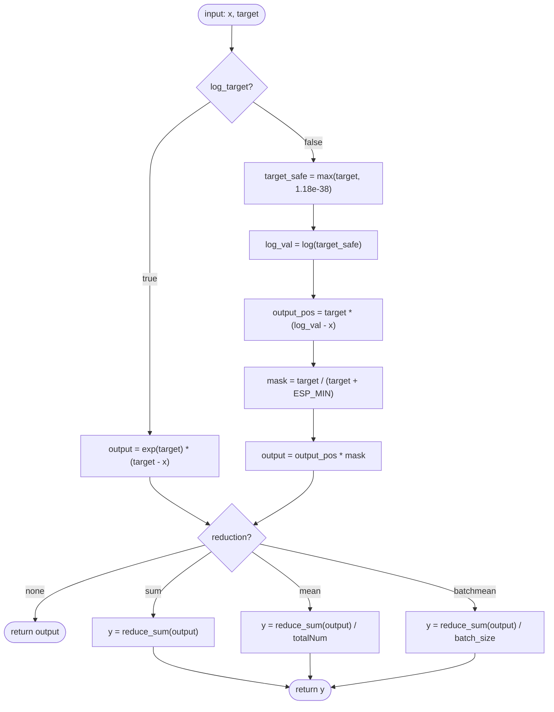
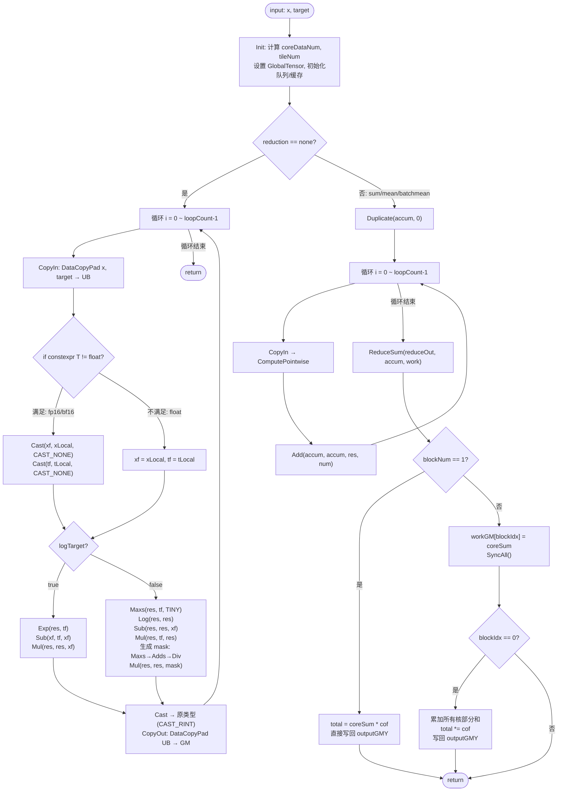

# KlDivV2 算子设计方案

## 1 需求背景

### 1.1 需求来源

CANN 训练营 2026 暑期季 - 西北工业大学专场 - KlDivV2 算子开发任务。参考昇腾版本内置 KLDiv/KlDivV2 算子的 TBE 实现，在昇腾 NPU 上基于 Ascend C 编程语言实现功能一致的算子，完成算子设计、开发、测试全流程工作。

### 1.2 背景介绍

#### 1.2.1 KlDivV2 算子实现优化

基于 KlDivV2 算子历史 TBE 版本，使用 Ascend C 编程语言进行重构与优化。参考实现路径：

- kernel 实现：`/usr/local/Ascend/ascend-toolkit/latest/opp/built-in/op_impl/ai_core/tbe/impl/dynamic/kl_div.py`
- 算子原型：`/usr/local/Ascend/ascend-toolkit/latest/opp/built-in/op_proto/inc/`
- 算子信息库：`/usr/local/Ascend/ascend-toolkit/latest/opp/built-in/op_impl/ai_core/tbe/config/ascend910b`

#### 1.2.2 KlDivV2 算子现状分析

通过对 KlDivV2 算子 TBE 版本（kl_div.py）的功能分析，当前支持的能力如下：

1. 输入 `x`、`target` 支持 float16、float32（本 Ascend C 版本额外补充 bfloat16），输出 `y` 的数据类型与输入一致；数据格式为 ND。

2. KlDivV2 逐元素计算 Kullback-Leibler 散度：

   - 当 `log_target=false` 时：`output_pos = target * (log(target) - x)`，`output = where(target > 0, output_pos, 0)`。
   - 当 `log_target=true` 时（target 已为对数概率）：`output = exp(target) * (target - x)`。

3. 支持

    

   ```
   reduction
   ```

    

   属性，取值 none/sum/mean/batchmean：

   - `none`：不做归约，逐元素输出；
   - `sum`：对所有元素求和输出标量；
   - `mean`：求和后除以元素总数；
   - `batchmean`：求和后除以第 0 维（batch size）。

4. TBE 版本对 float32 输入，为保证 log 定义域，对 target 取 `max(target, 1.18e-38)` 后再取对数；掩码 `where(target>0)` 采用 `y = x/(x+ESP_MIN)` 近似实现，本 Ascend C 版本沿用等价策略保证精度对齐。

**KlDivV2 算子 TBE 版本整体流程图：**



## 2 需求分析

### 2.1 外部组件依赖

不涉及外部组件依赖。

### 2.2 内部适配模块

适配 Aclnn 接口和图模式（ATC）调用。

### 2.3 需求模块设计

#### 2.3.1 算子原型

| 名称       | 类别 | dtype          | format | shape                   | 介绍                                        |
| ---------- | ---- | -------------- | ------ | ----------------------- | ------------------------------------------- |
| x          | 输入 | fp16/fp32/bf16 | ND     | all                     | 输入分布（对数概率或分值）                  |
| target     | 输入 | fp16/fp32/bf16 | ND     | 同 x                    | 目标分布                                    |
| reduction  | 属性 | string         | -      | -                       | 归约方式 none/sum/mean/batchmean，默认 mean |
| log_target | 属性 | bool           | -      | -                       | target 是否已取对数，默认 false             |
| y          | 输出 | fp16/fp32/bf16 | ND     | none: 同输入; 其余: {1} | 输出结果                                    |

相关约束：Atlas A2 训练系列产品 / Atlas 800I A2 推理产品支持 float16、float32、bfloat16。`x` 与 `target` 的 shape、dtype 必须一致；本算子不涉及广播。

## 3 需求详细设计

### 3.1 使能方式

| 上层框架          | 涉及的框架勾选 |
| ----------------- | -------------- |
| TF 训练/推理      |                |
| Pytorch 训练/推理 | √              |
| ATC 推理          | √              |
| Aclnn 直调        | √              |
| OPAT 调优         |                |

### 3.2 需求总体设计

#### 3.2.1 host 侧设计（tiling 策略）

KlDivV2 为逐元素计算叠加可选的全归约，计算过程不涉及数据维度信息，故在 host 侧将数据视为一维向量，仅考虑元素总数 `totalNum`（batchmean 场景额外读取第 0 维用于计算缩放系数 cof）。

- **任务均分**：coreNum 根据输入元素总数动态调整，确保每个核处理的数据量尽量均匀。
- **批量搬运**：`tileDataNum` 计算单次搬运的数据量，通过 `finalSmallTileNum` 和 `finalBigTileNum` 确定小核/大核的搬运次数，尾块（`smallTailDataNum`/`bigTailDataNum`）单独处理，避免数据碎片。
- **分核策略**：优先满核。若核间能按元素均分则无大小核区分；否则将余出的元素逐个分配到前 `tailBlockNum` 个大核。为保证 sum/mean/batchmean 归约结果准确，按“元素”而非“对齐块”精确切分，避免尾部越界读入无效数据污染求和。
- **数据分块与内存优化**：综合 UB 大小、double buffer、kernel 侧升 float32 计算的临时缓存及归约累加缓存计算切分。fp32 直接在原类型上计算，无需承载 target 的 fp32 临时缓存，占用更少，因此对 fp32 使用更小的 UB 占用系数（`UB_BLOCK_FACTOR_FP32`）换取更大的 Tile；fp16/bf16 用 `UB_BLOCK_FACTOR`。
- **tilingkey 规划**：按输入数据类型区分模板分支：float16 → schMode 0，float32 → schMode 1，bfloat16 → schMode 2。reduction 与 log_target 的分支通过 tiling 字段在 kernel 内运行时判断，不额外占用 tilingkey。归约场景下当元素总数不超过阈值（`REDUCE_SINGLE_CORE_MAX=8192`）时，host 侧仅分配 1 个核，kernel 走单核快路径，跳过跨核 SyncAll 与 workspace 往返，降低小 shape 归约的固定开销。
- **空输入处理**：totalNum ≤ 0 时直接设置 BlockDim=1 并返回。

#### 3.2.2 kernel 侧设计

进行 Init 和 Process 两个阶段，Process 包括数据搬入（CopyIn）、计算（Compute）、搬出（CopyOut）。


**Ascend C 的 KlDivV2 算子流程图：**



- **数据类型处理**：float32 直接在原类型上计算；float16/bfloat16 先 Cast 到 float32 计算，最终结果按 CAST_RINT 转回原类型，保证精度对齐 TBE。
- **逐元素计算**：`log_target=false` 时用 `max(target, TINY)` 保证 log 定义域，计算 `target*(log(target)-x)`，再用 `target/(target+TINY)` 生成 target>0 的 0/1 掩码并相乘；`log_target=true` 时计算 `exp(target)*(target-x)`。
- **搬运**：使用 DataCopyPad 处理非 32B 对齐尾块，避免越界。
- **归约（sum/mean/batchmean）**：单核内在搬运-计算循环中，用向量 `Add` 将各 tile 的逐元素结果累加到 UB 累加张量（accum），循环结束后仅做一次 `ReduceSum` 得到本核部分和——相比每个 tile 都做 ReduceSum，可消除每 tile 的标量同步（V_S），使向量计算与 MTE 搬运充分重叠、显著提升向量流水利用率。多核场景下，各核将部分和写入 workspace 中属于本核的独立槽位（`workGM[blockIdx]`），经一次 SyncAll 同步后由 0 号核累加所有槽位得到总和；单核场景（小 shape）直接写回，无需跨核同步。最终乘以缩放系数 cof（sum:1；mean:1/totalNum；batchmean:1/batch）写回输出标量。
- **none 场景**：逐 tile 计算后直接 CopyOut 到与输入同形的输出。

### 3.3 支持硬件

| 支持的芯片版本             | 涉及勾选 |
| -------------------------- | -------- |
| 香橙派 OrangePi AIpro      |          |
| Atlas 200I/500 A2 推理产品 |          |
| Atlas 800I/T A2            | √        |

### 3.4 算子约束限制

不支持广播；`x` 与 `target` 的 shape 与 dtype 必须完全一致。

## 4 特性交叉分析

新增 Ascend C 实现，功能与内置 TBE KLDiv/KlDivV2 对齐，不涉及与其它特性的交叉影响。

## 5 可维可测分析

### 5.1 精度标准/性能标准

| 验收标准 | 描述(不涉及说明原因)                          | 标准来源   |
| -------- | --------------------------------------------- | ---------- |
| 精度标准 | 不低于 TBE 版本，满足 CANN Judge 平台默认阈值 | CANN Judge |
| 性能标准 | 满核场景下不低于原算子的 95%                  | 任务书     |

### 5.2 兼容性分析

新算子，不涉及兼容性分析。
