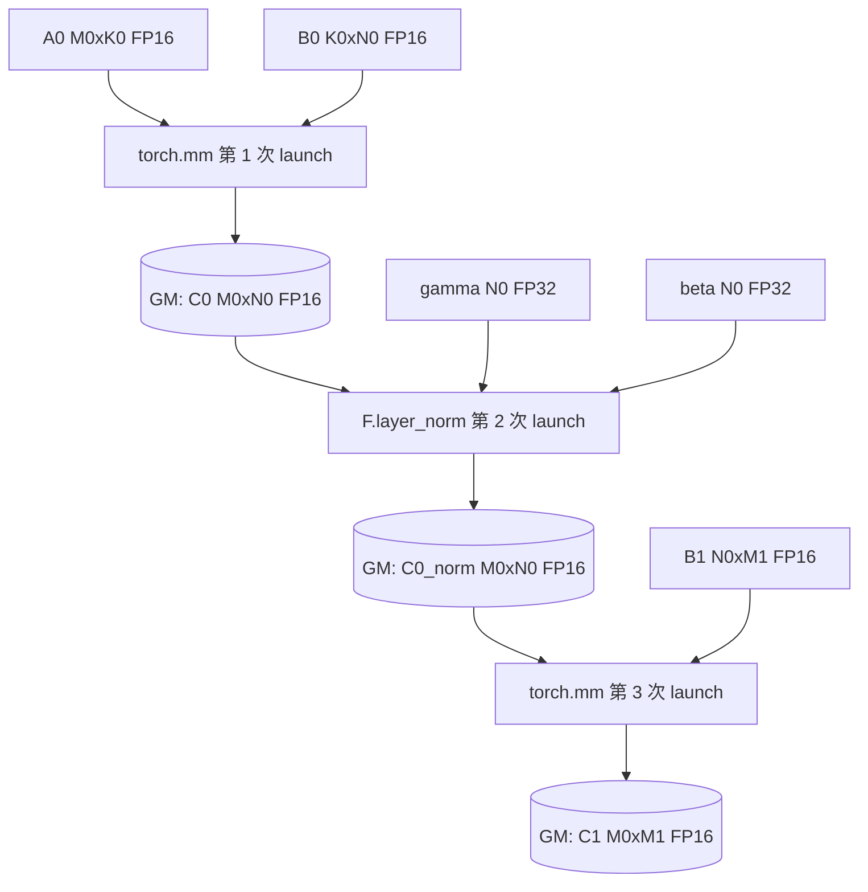
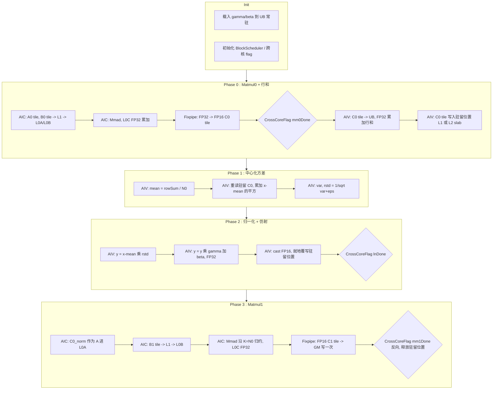

# MatmulLayerNormMatmul 算子设计文档

## 一、需求背景

### 1.1 需求来源

本需求来自 2026 年 9 月 CANN 社区任务 **「MatmulLayerNormMatmul 算子开发」**（任务编号
`07-04-MatmulLayerNormMatmul`）。任务要求在 **Ascend 950** 上，基于 Ascend C / CATLASS
模板库实现融合 LayerNorm 的双 Matmul 算子，单次 kernel launch 完成
`Matmul -> LayerNorm -> Matmul` 三段计算，并以
`torch.mm + F.layer_norm + torch.mm` 小算子拼接方案为性能标杆，要求
`平均标杆时延 / 平均测试时延 > 1.1`。

- 开源仓：<https://gitcode.com/cann/catlass>
- 任务测试集：`MatmulLayerNormMatmul_测试集.csv`，共 116 条 `(M0, K0, N0, M1)` 组合，
  附 Ascend 950PR 实测标杆时延。
- 交付目录：`experimental/matmul/${op_name}` + `tests/optest` 接入件。

### 1.2 背景介绍

#### 1.2.1 MatmulLayerNormMatmul 算子实现优化

`Matmul -> LayerNorm -> Matmul` 是 Transformer FFN / Adapter 结构中的常见片段：
第一个投影得到隐层激活，对隐层做行级 LayerNorm，再投影回输出维度。在框架侧它被拆成三次
kernel launch，中间激活 `C0` 需要完整落 GM 并被反复读写：

| 环节 | 读 | 写 |
| --- | --- | --- |
| `torch.mm`（Matmul0） | `A0`、`B0` | `C0` |
| `F.layer_norm` | `C0`、`gamma`、`beta` | `C0_norm` |
| `torch.mm`（Matmul1） | `C0_norm`、`B1` | `C1` |

即 `C0` 规模的数据被搬运 4 次（1 写 + 1 读 + 1 写 + 1 读），且三次 launch 之间串行，
LayerNorm 这段纯带宽负载完全暴露在关键路径上。对 `M0=2048, N0=8192` 这类 shape，
`C0` 达 32 MiB，这部分开销不可忽略；而对 `M0=128` 这类小 shape，三次 launch 的固定开销
直接主导了端到端时延。

融合算子的收益来源因此有三条，并且随 shape 变化此消彼长：

1. **launch 合并**：3 次 launch 合为 1 次，小 shape 收益最大；
2. **LayerNorm 隐藏**：LayerNorm 在 AIV 上执行，与 AIC 的 Cube 计算在行块之间重叠，
   把一段纯带宽时间从关键路径上摘掉；
3. **中间激活片上化 / L2 驻留**：以行块为任务粒度后，`C0` 的生产与消费在同一个任务内闭环，
   可以常驻 L1，或退化为 L2 命中的 workspace slab，不再走 HBM 往返。

#### 1.2.2 现状分析

##### 1.2.2.1 Baseline 支持的数据类型和数据格式

标杆为 PyTorch 小算子拼接，本任务只需覆盖任务书给定的组合：

| 项目 | 取值 |
| --- | --- |
| `A0` | FP16，ND，`(M0, K0)`，RowMajor |
| `B0` | FP16，ND，`(K0, N0)`，ColumnMajor |
| `B1` | FP16，ND，`(N0, M1)`，ColumnMajor |
| `gamma` / `beta` | FP32，ND，`(N0,)` |
| `C1` | FP16，ND，`(M0, M1)`，RowMajor，唯一对外输出 |
| `epsilon` | `1e-6`，常量 |

测试集 shape 取值域：

| 维度 | 取值 |
| --- | --- |
| `M0` | 128 / 512 / 1024 / 2048 |
| `K0` | 768 / 2048 / 4096 / 8192 |
| `N0` | 2048 / 3072 / 4096 / 8192 |
| `M1` | 768 / 2048 / 4096 |

全部取值均为 256 的整数倍（`M0=128` 为 128 的整数倍），对 Cube 的 16 元素分形和
FP16 的 32 B 对齐天然友好；但实现仍须覆盖非对齐尾块，详见 3.4。

##### 1.2.2.2 Baseline 实现描述与性能基线分析

对测试集 116 条标杆时延做效率折算（`FLOPs = 2·M0·K0·N0 + 2·M0·N0·M1`）：

| 分位 | 等效算力 |
| --- | --- |
| 最低 | 42.4 TFLOPS（`128, 768, 2048, 768`） |
| 25% | 136.2 TFLOPS |
| 中位 | 236.9 TFLOPS |
| 75% | 288.6 TFLOPS |
| 最高 | 398.9 TFLOPS（`2048, 2048, 4096, 4096`） |

结论：

- **小 `M0` 档（`M0=128`）** 等效算力仅 42~73 TFLOPS，远低于同硬件可达的 ~399 TFLOPS，
  说明这些 case 由 launch 与拖尾开销主导，融合后收益空间最大；
- **大 shape 档（`K0=N0=8192`）** 稳定在 ~347 TFLOPS，而同硬件其它 case 可达 ~399 TFLOPS，
  说明标杆在该档并未跑满，融合算子在 Cube 效率不劣化的前提下仍有余量；
- 全测试集标杆时延合计 15395.6 µs，是性能验收的分母基准。

##### 1.2.2.3 Baseline 实现流程图



关键观察：`C0` 规模的中间量在 GM 上被写 2 次读 2 次，三段之间无重叠。

## 二、需求分析

### 2.1 外部组件依赖

- CANN Toolkit 9.1.0（开发环境实测 `innerversion V100R001C11SPC001B243`）提供的
  `ccec/ASC` 编译器、runtime、`platform_ascendc` tiling 平台信息；
- CATLASS 模板库 master 分支的 `Arch`、`Gemm::Block`、`Epilogue::Block`、`Gemm::Tile`
  与 `Epilogue::Tile` 分层组件；
- CATLASS `tests/optest` PyTorch 接入框架（`torch_catlass`）与 `ATK` 测试框架；
- 硬件：Ascend 950PR（`npu-smi` 实测 `Ascend950PR`，HBM 128 GiB），编译目标
  `CATLASS_ARCH=3510`。

### 2.2 内部适配模块

| 模块 | 职责 |
| --- | --- |
| Host 样例入口 | 参数解析、shape 校验、`workspace` 申请、TileShape 分档、kernel 分发 |
| Kernel 层 | AIC/AIV 双核角色的四阶段调度、跨核同步、行块 ownership |
| BlockMmad | 复用 CATLASS 已有 950 Mmad 组件，承担 Matmul0 / Matmul1 |
| BlockEpilogue（新增） | LayerNorm 行统计、归一化、`gamma`/`beta` 仿射、FP16 回写 |
| Tile 层 | 复用 `copy_gm_to_ub` / `copy_ub_to_gm` / `copy_ub_to_l1_tla` / `tile_cast` / `tile_broadcast_*` |
| optest 接入 | `torch.ops.catlass.matmul_layernorm_matmul` 注册、JIT 参数传递、pytest 用例 |

### 2.3 需求模块设计

#### 2.3.1 算子原型

样例入口（CATLASS example 形态，非 aclnn 形态）：

```cpp
// experimental/matmul/matmul_layernorm_matmul/matmul_layernorm_matmul.cpp
void MatmulLayerNormMatmul(
    uint32_t  m0,        // A0 行数
    uint32_t  k0,        // Matmul0 归约维
    uint32_t  n0,        // LayerNorm 归一化维 / Matmul1 归约维
    uint32_t  m1,        // Matmul1 输出列数
    uint8_t  *gmA0,      // FP16, (M0, K0), RowMajor
    uint8_t  *gmB0,      // FP16, (K0, N0), ColumnMajor
    uint8_t  *gmB1,      // FP16, (N0, M1), ColumnMajor
    uint8_t  *gmGamma,   // FP32, (N0,)
    uint8_t  *gmBeta,    // FP32, (N0,)
    uint8_t  *gmC1,      // FP16, (M0, M1), RowMajor   —— 唯一对外输出
    uint8_t  *gmWorkspace,
    aclrtStream stream);
```

optest / PyTorch 侧：

```python
c1 = torch_catlass.matmul_layernorm_matmul(a0, b0, b1, gamma, beta)
# a0: (M0, K0) fp16;  b0: (K0, N0) fp16 列主序;  b1: (N0, M1) fp16 列主序
# gamma/beta: (N0,) fp32;  返回 (M0, M1) fp16
```

`mean` / `rstd` 等中间量全部由算子内部 `workspace` 承载，不出现在接口上。

#### 2.3.2 相关约束

- `M0`、`K0`、`N0`、`M1` 均须 `> 0`；
- `gamma`、`beta` 长度须等于 `N0`；
- 输入张量须为 NPU 上的连续张量（`optest` 侧对非连续输入做 `contiguous()`）；
- `epsilon` 固定为 `1e-6`，与任务书一致，不开放为入参。

## 三、需求详细设计

### 3.1 算子分析

#### 3.1.1 数学公式

阶段一：

$$\mathbf{C0} = \mathbf{A0}\times\mathbf{B0},\qquad \mathbf{C0}\in\mathbb{R}^{M_0\times N_0}$$

阶段二（对 `C0` 每一行独立）：

$$
\mu[m]=\frac{1}{N_0}\sum_{n} \mathbf{C0}[m,n],\qquad
\sigma^2[m]=\frac{1}{N_0}\sum_{n}\big(\mathbf{C0}[m,n]-\mu[m]\big)^2
$$

$$
\mathbf{C0}_{\text{norm}}[m,n]=\frac{\mathbf{C0}[m,n]-\mu[m]}{\sqrt{\sigma^2[m]+\epsilon}}\cdot\gamma[n]+\beta[n]
$$

阶段三：

$$\mathbf{C1}=\mathbf{C0}_{\text{norm}}\times\mathbf{B1},\qquad \mathbf{C1}\in\mathbb{R}^{M_0\times M_1}$$

#### 3.1.2 dtype 语义

与标杆 `torch` 路径逐段对齐，避免"精度更高但与标杆不可比"的实现：

| 阶段 | 输入 dtype | 累加 dtype | 输出 dtype |
| --- | --- | --- | --- |
| Matmul0 | FP16 | FP32（L0C） | FP16（Fixpipe 下变换） |
| LayerNorm 统计 | FP16 → FP32 | FP32 | FP32（`mean`/`rstd`） |
| LayerNorm 仿射 | FP16 → FP32，`gamma`/`beta` FP32 | FP32 | FP16 |
| Matmul1 | FP16 | FP32（L0C） | FP16 |

`C0` 以 FP16 落盘/驻留，与 `torch.mm` 输出 FP16 的语义一致；行统计与仿射在 FP32 上完成，
与 `F.layer_norm` 内部升精度的行为一致。

#### 3.1.3 数值稳定性

`sigma^2` 有两种算法：

| 算法 | 遍数 | 风险 |
| --- | --- | --- |
| `E[x^2] - (E[x])^2` 单遍 | 1 | 当 `|mu|` 远大于 `sigma` 时发生灾难性抵消 |
| 先求 `mu`，再求 `E[(x-mu)^2]` 两遍 | 2 | 无抵消，需要两次读取行数据 |

本设计采用 **两遍中心化方差**。因为行块在本设计中已经片上驻留（或 L2 命中），
第二遍不产生额外 HBM 流量，代价仅为一次片上重读，用可忽略的开销换掉一类精度风险。
`rstd = 1 / sqrt(var + eps)` 用 FP32 计算，`eps` 在开方前相加。

### 3.2 需求总体设计

#### 3.2.1 核心思想：行块 ownership

LayerNorm 的归一化维是 `N0`，它同时是 Matmul0 的输出列维和 Matmul1 的归约维。
若沿 `N0` 分核，则：行统计需要跨核归约，且 Matmul1 需要跨核 split-K 累加（FP32 partial `C1`
落 GM，`M0×M1×4 B` 量级的额外流量）。

因此本设计把 **`M0` 方向的一个行块作为一个任务的完整 ownership**：
一个 AIC / AIV 配对独占 `BM` 行，并在该任务内覆盖这 `BM` 行的全部 `N0` 列。由此：

- 行统计在任务内闭环，无跨核归约；
- Matmul1 的 `K=N0` 归约在任务内闭环，无 split-K，无 atomic；
- 不同任务写 `C1` 的行区间互不重叠；
- 归一化后的行块可被 `M1` 方向的多个输出列 tile 重复消费，Matmul0 不重算。

#### 3.2.2 C0 驻留策略（两档 tilingKey）

行块 ownership 的代价是：`BM × N0` 的中间激活必须在任务生命周期内保活。
`Arch::Ascend950` 的片上资源为 L1 512 KiB、UB 248 KiB、L0A/L0B 64 KiB、L0C 256 KiB。
在 L1 中为 `C0` 预留 `CACHE ≤ 256 KiB` 时：

| `N0` | 每行字节（FP16） | L1 可容纳的 `BM` |
| ---: | ---: | ---: |
| 2048 | 4 KiB | 64 |
| 3072 | 6 KiB | 42 → 取 32 |
| 4096 | 8 KiB | 32 |
| 8192 | 16 KiB | 16 |

`BM` 越小，Matmul0 的 B 矩阵复用越差：Matmul0 的输入读取量约为
`M0·N0·K0·(1/BN0 + 1/BM)`，`BM=16` 时 `1/BM` 项完全主导。对
`M0=2048, K0=N0=8192`（`B0` 本身 128 MiB）这类 case，小 `BM` 会把 Matmul0 变成访存瓶颈。

因此设置 **两档 C0 驻留策略**，由 host 侧按 `N0` 选择 tilingKey：

| tilingKey | 适用档 | `C0` 驻留 | `BM` | 设计动机 |
| --- | --- | --- | ---: | --- |
| `KEY_L1_RESIDENT` | `N0 ≤ 4096` | L1（`UB → L1`，不落 GM） | 32 / 64 | 完全消除中间显存读写 |
| `KEY_L2_SLAB` | `N0 = 8192` | 每任务 GM slab，按 L2 驻留尺寸规划 | 128 / 256 | 保住 Cube 的 B 矩阵复用率 |

`KEY_L2_SLAB` 档的 slab 总量为 `min(aicCoreNum, rowTasks) × BM × N0 × 2 B`。
以 24 个 AIC、`BM=128`、`N0=8192` 估算为 48 MiB，处于 L2 可承载量级；
并通过 `L2_CACHE_HINT` 编译选项与写回策略提示，使该 slab 的读写尽量在 L2 闭环。
该档下中间量仍不对外暴露，符合任务书「中间结果由算子内部 workspace 管理」的要求；
"无中间显存读写"的目标在 `N0 ≤ 4096` 档严格成立，在 `N0=8192` 档以 L2 驻留近似达成，
两档的实际收益由 116 case profiling 给出对比数据后确定最终切换点。

> 说明：表中 `BM` 为设计候选值，不是已验证的最优值。最终取值以 profiling 结果为准，
> PR 中将附候选对比数据。

#### 3.2.3 Host 侧设计

##### 3.2.3.1 分核策略

```text
rowTasks   = CeilDiv(M0, BM)
aicUsed    = min(GetCoreNumAic(), rowTasks)
任务分配   = for (task = blockIdx; task < rowTasks; task += aicUsed)
```

`M0=128` 且 `BM=64` 时只有 2 个行任务，远少于可用核数。为此在 host 侧对
**小 `M0` 档**额外启用 `N0` 方向的 Matmul0 协同（见 3.2.3.2 的 `BM` 减半档）
与 `M1` 方向的输出列分核：Matmul1 的 `M1` 维可以安全地跨核切分（列方向无归约），
把行任务数从 `CeilDiv(M0, BM)` 扩展为 `CeilDiv(M0, BM) × CeilDiv(M1, BN1_core)`，
使小 shape 也能占满核。该扩展只作用于 Matmul1 阶段，Matmul0 与 LayerNorm 仍按行块独占。

##### 3.2.3.2 数据分块和内存优化策略

记 `N0a = RoundUp(N0, 16)`（FP16 32 B 对齐）。

L1 预算（两个阶段分别校验峰值）：

```text
CACHE   = BM * N0a * sizeof(half)                      # 仅 KEY_L1_RESIDENT 档占用
L1_MM0  = CACHE + A1_STAGES * BM  * BK0 * sizeof(half)
                + B1_STAGES * BK0 * BN0 * sizeof(half) + GUARD
L1_MM1  = CACHE + B1_STAGES * BK1 * BN1 * sizeof(half) + GUARD
max(L1_MM0, L1_MM1) <= 512 KiB
```

UB 预算：

```text
UB = UB_STAGES * BMV * BN0 * sizeof(half)   # C0 tile ping-pong（BMV = AIV 子块行数）
   + BMV * BN0 * sizeof(float)              # FP32 归一化工作区
   + 2 * BN0 * sizeof(float)                # gamma / beta
   + 4 * BM  * sizeof(float)                # sum / mean / var / rstd
   + GUARD
UB <= 248 KiB
```

L0C 预算：`max(BM*BN0, BM*BN1) * sizeof(float) <= 256 KiB`。

初始候选（`BN0 = BN1 = 256`，`A1_STAGES=1`，`B1_STAGES=2`，`UB_STAGES=2`）：

| 档位 | 条件 | `BM` | `BK0`/`BK1` | `CACHE` | 驻留策略 |
| --- | --- | ---: | ---: | ---: | --- |
| T0 | `N0 ≤ 2048` | 64 | 128 | 256 KiB | L1 |
| T1 | `N0 = 3072` | 32 | 128 | 192 KiB | L1 |
| T2 | `N0 = 4096` | 32 | 128 | 256 KiB | L1 |
| T3 | `N0 = 8192` | 128 | 128 | — | L2 slab |
| T4 | `M0 ≤ 128`（并行度档） | T0–T2 的一半 | 128 | ≤128 KiB | L1 |
| T5 | 通用尾块 / 非对齐 | 保守固定值，16 对齐 | 128 | ≤128 KiB | L1 |

所有静态容量约束以 `static_assert` 落到代码里，运行期 shape 约束由 `CanImplement` 校验；
文档中的估算值不作为实现依据，以组件真实静态分配复算为准。

##### 3.2.3.3 tilingKey 规划

| tilingKey | 触发条件 | 差异 |
| --- | --- | --- |
| `KEY_L1_RESIDENT` | `BM * N0a * 2 <= L1_CACHE_BUDGET` | `C0` 走 `UB → L1`，Matmul1 的 A 直接取自 L1 |
| `KEY_L2_SLAB` | 否则 | `C0` 走 `UB → GM slab`，Matmul1 的 A 从 slab 读回 L1 |
| `KEY_SMALL_M` | `M0 <= 128` | 叠加 `M1` 方向输出列分核，提高占核率 |
| `KEY_TAIL` | 任一维非 `BM`/`BN` 整除 | 走带尾块保护的 `DataCopyPad` 路径 |

`KEY_SMALL_M` 与 `KEY_TAIL` 是正交开关，与前两档组合使用。

##### 3.2.3.4 GM workspace 布局

```text
[0)                mean   : M0 * sizeof(float)
[1)                rstd   : M0 * sizeof(float)
[2) 仅 KEY_L2_SLAB  C0 slab: aicUsed * BM * N0a * sizeof(half)
```

`mean`/`rstd` 常驻 workspace 的目的是让 AIV 的两遍统计与后续仿射之间不依赖寄存器保活，
并为调试时 dump 中间量留出位置；它们不对外暴露。

#### 3.2.4 Kernel 侧设计

##### 3.2.4.1 组件构成

| 组件 | 开发方式 | 来源 / 说明 |
| --- | --- | --- |
| `BlockMmad`（Matmul0/1） | 直接复用 | CATLASS 950 Mmad 组件（`MmadPingpong` 系 dispatch policy） |
| `BlockScheduler` | 参考改写 | 行块 ownership 调度，参考 `GemmIdentityBlockSwizzle` |
| `BlockEpilogueLayerNorm` | **新增** | 行统计 + 归一化 + 仿射 + FP16 回写，CATLASS 现无 LayerNorm 类 epilogue |
| `TileRowReduceSum`（FP32） | **新增 / 复用评估** | 行向归约，优先复用 `epilogue/tile` 既有归约能力，不足时新增 |
| `copy_gm_to_ub` / `copy_ub_to_gm` | 直接复用 | `epilogue/tile/copy_*.hpp` |
| `copy_ub_to_l1_tla` | 直接复用 | `KEY_L1_RESIDENT` 档把归一化结果送回 L1 供 Matmul1 |
| `tile_cast` / `tile_broadcast_mul` / `tile_broadcast_add` | 直接复用 | FP16↔FP32 转换与 `gamma`/`beta` 行广播 |
| `Arch::CrossCoreFlagWithReverse` | 直接复用 | AIC/AIV 四阶段同步 |

遵循 CATLASS「最大化复用、最小化创新」原则：真正新增的只有 `BlockEpilogueLayerNorm`
及其行归约 tile 组件，其余均复用或参考改写。

##### 3.2.4.2 四阶段流水

一个行任务（`BM` 行）内部分四个阶段，阶段之间用跨核 flag 串接；
阶段之间在**行任务维度**上重叠——AIC 处理任务 `t+1` 的 Phase 0 时，
AIV 正在做任务 `t` 的 Phase 1/2，AIC 的 Phase 3 处理任务 `t-1`：

| 阶段 | 执行核 | 内容 |
| --- | --- | --- |
| Phase 0 | AIC → AIV | Matmul0：沿 `N0` 逐 `BN0` tile 计算 `C0`；Fixpipe 转 FP16；AIV 收 tile 后累加 FP32 行和，并把 tile 写入驻留位置（L1 或 slab） |
| Phase 1 | AIV | 由行和得 `mean`；重读驻留的 `C0` 行块，累加 `(x-mean)^2`，得 `var`、`rstd` |
| Phase 2 | AIV | 再遍历行块：`(x-mean)*rstd*gamma[n]+beta[n]`，FP32 计算后 cast 回 FP16，就地覆写驻留位置 |
| Phase 3 | AIV → AIC | Matmul1：以驻留的 `C0_norm` 为 A、`B1` 为 B，沿 `K=N0` 归约，逐 `BN1` 输出列 tile 写 `C1` |

`gamma`/`beta` 为 `N0` 长度的 FP32 向量，在 kernel Init 阶段一次性载入 UB 常驻
（`N0=8192` 时 2×32 KiB = 64 KiB，在 UB 预算内），Phase 2 不重复搬运。

##### 3.2.4.3 Ascend C 实现流程图



##### 3.2.4.4 同步与死锁约束

- 使用 `Arch::CrossCoreFlagWithReverse`，遵守同一 flag 连续 set 不超过
  `MAX_REVERSE_DEPTH = 15` 次的硬件约束，Phase 3 完成后回送反向 flag 释放驻留 buffer；
- flag 分配：`mm0Done`(AIC→AIV)、`lnDone`(AIV→AIC)、`mm1Done`(AIC→AIV，反向释放)，
  以及各自的 reverse flag，总数在 `FFTS_MAX_FLAG = 7` 的可用范围内；
- 驻留 buffer 采用 2 stage ping-pong，保证任务 `t` 的 Phase 3 与任务 `t+1` 的 Phase 0
  不争用同一块空间；
- 所有 `CrossCoreWaitFlag` 前不得存在条件分支导致的"部分核不参与"路径，
  尾块行任务同样要走完四个阶段（可能是空计算），避免跨核等待不配对。

##### 3.2.4.5 尾块与对齐

- `M0 % BM != 0`：最后一个行任务按实际行数计算，`DataCopyPad` 保护 GM 读写；
- `N0 % BN0 != 0`：`N0a = RoundUp(N0, 16)`，padding 区在 Phase 0 写入 `0`，
  且**不计入**行统计的元素计数（统计始终除以真实 `N0`）；Phase 2 对 padding 区写 `0`，
  使其对 Matmul1 的 `K` 归约贡献为 `0`；
- `M1 % BN1 != 0`：最后一个输出列 tile 用 `DataCopyPad` 按实际列数写回；
- 本任务测试集全部对齐，尾块路径由自建泛化用例覆盖（见 5.2）。

##### 3.2.4.6 与 Baseline 的差异点和原因

| 差异 | 原因 | 正确性措施 |
| --- | --- | --- |
| 3 次 launch → 1 次 MIX kernel | 消除 launch 固定开销，使 LayerNorm 可与 Cube 重叠 | 四阶段跨核 flag 严格串接，行块内语义与三段串行等价 |
| `C0`/`C0_norm` 不落 GM（`N0≤4096`）或只落 L2 驻留 slab（`N0=8192`） | 去掉 `C0` 规模的 4 次 HBM 往返 | 行块 ownership 保证生产与消费在同一任务内，无跨核可见性问题 |
| 方差用两遍中心化算法，而非 `E[x²]-E[x]²` | 规避大均值下的灾难性抵消 | 行块已片上驻留，第二遍不产生 HBM 流量 |
| `mean`/`rstd` 用 FP32，`C0` 用 FP16 | 与 `F.layer_norm` 内部升精度、输出 FP16 的语义对齐 | golden 用 FP32/FP64 计算，按开源精度标准比对 |
| `M1` 方向额外分核仅在 `M0 ≤ 128` 时启用 | 小 shape 行任务数不足以占满核 | 列方向无归约，分核不改变数值结果 |

### 3.3 支持硬件

| 支持的芯片版本 | 是否支持 |
| --- | :--: |
| Ascend 950PR | √ |
| Ascend 950DT | 同 `CATLASS_ARCH=3510` 架构，代码可编译；本任务未做真机验收，不作交付承诺 |
| Atlas 800I/T A2 | × （本任务不涉及，`Arch::AtlasA2` 的 L0C 仅 128 KiB，TileShape 需重新分档） |

### 3.4 算子约束限制

- 仅支持 FP16 输入 / FP16 输出、`gamma`/`beta` FP32；
- 仅支持 2 维 `A0`/`B0`/`B1`（无 batch 维）；
- `B0`、`B1` 必须为 ColumnMajor，`A0`、`C1` 必须为 RowMajor；
- `epsilon` 固定 `1e-6`；
- `mean`/`variance` 不对外输出。

## 四、特性交叉分析

| 维度 | 覆盖组合 |
| --- | --- |
| `M0` | 128 / 512 / 1024 / 2048（测试集）＋ 1 / 17 / 127 / 129（尾块自建） |
| `K0` | 768 / 2048 / 4096 / 8192 ＋ 1 / 33 / 255（尾块自建） |
| `N0` | 2048 / 3072 / 4096 / 8192（覆盖 L1 驻留档与 L2 slab 档）＋ 非 16 对齐自建 |
| `M1` | 768 / 2048 / 4096 ＋ 非 `BN1` 整除自建 |
| tilingKey | `KEY_L1_RESIDENT` × `KEY_SMALL_M`、`KEY_L2_SLAB` × `KEY_TAIL` 等组合全覆盖 |
| 数值分布 | 标准正态、大均值小方差（考验中心化方差）、`gamma=0`、`beta=0`、`gamma` 含负值 |
| 边界 | 单行 `M0=1`、单列 `M1=1`、`N0` 恰好等于 `BN0`、`N0` 恰好等于 `BN0+1` |

## 五、可维护可测分析

### 5.1 精度标准和性能标准

| 验收标准 | 描述 | 标准来源 |
| --- | --- | --- |
| 精度标准 | 满足生态算子开源精度标准（实验标准）FP16 档 | <https://gitcode.com/cann/opbase/blob/master/docs/zh/ops_precision_standard/experimental_standard.md> |
| 性能标准 | `平均标杆时延 / 平均测试时延 > 1.1`，标杆为 `torch.mm + F.layer_norm + torch.mm` | 任务书 + `MatmulLayerNormMatmul_测试集.csv` |

精度比对采用 FP32/FP64 golden（NumPy 或 `torch.float32` 参考实现），按 FP16 档的
相对误差、误差匹配率和最大绝对误差三项同时判定。

性能采集使用 `msprof op`，环境为 Ascend 950PR + CANN 9.1.0，与标杆同机同批次采集。
测试集标杆时延合计 15395.6 µs，目标是全量 116 case 的测试时延合计低于 13996 µs。

分档性能目标（基于 1.2.2.2 的效率分析）：

| 档位 | 标杆等效算力 | 主要收益来源 | 目标 |
| --- | --- | --- | --- |
| `M0=128` 小 shape | 42–73 TFLOPS | launch 合并 + LayerNorm 隐藏 | ≥ 1.5× |
| 中等 shape | ~237 TFLOPS（中位） | LayerNorm 隐藏 + 中间量片上化 | ≥ 1.15× |
| `K0=N0=8192` 大 shape | ~347 TFLOPS | L2 slab + Cube 效率不劣化 | ≥ 1.05×，不低于标杆 |

### 5.2 测试设计

#### 5.2.1 Golden

CPU / FP32 参考实现，逐段对齐 dtype 语义：

```python
def golden(a0, b0, b1, gamma, beta, eps=1e-6):
    c0 = (a0.float() @ b0.float()).half()            # Matmul0 -> FP16
    x = c0.float()
    mu = x.mean(dim=-1, keepdim=True)
    var = ((x - mu) ** 2).mean(dim=-1, keepdim=True)
    y = (x - mu) / torch.sqrt(var + eps) * gamma + beta
    c0n = y.half()                                   # LayerNorm -> FP16
    return (c0n.float() @ b1.float()).half()         # Matmul1 -> FP16
```

#### 5.2.2 测试件

1. **optest（必交付）**：`experimental/matmul/matmul_layernorm_matmul/test_matmul_layernorm_matmul.py`，
   接入 `torch_catlass`，用 `@only_on_3510` 限定 950 执行，覆盖测试集 116 条 shape 全量精度；
2. **ATK（必交付）**：基于 optest 测试件生成，**泛化 ≥ 200 例** 精度通过，
   在 116 条基础上叠加第四章的尾块 / 边界 / 数值分布组合；
3. **异常用例**：零维、`gamma` 长度不匹配、非连续张量，验证 host 侧校验与报错信息；
4. **性能用例**：116 条逐条 `msprof op` 采集，与 CSV 标杆逐条比对并汇总平均比值。

#### 5.2.3 自验证报告

含用例参数表、逐条精度结论、整体通过截图、逐条性能数据与平均比值、
以及不同 TileShape 候选的对比数据（用于说明最终固化值的依据）。

### 5.3 兼容性和可维护性

- 新增算子，不修改 CATLASS 已有组件的对外行为，无兼容性影响；
- `BlockEpilogueLayerNorm` 按 CATLASS Epilogue 约定实现，后续 `RMSNorm`、
  `Matmul+LayerNorm`（单 Matmul）等算子可直接复用；
- TileShape 分档集中在 host 侧一处表驱动，新增 shape 档不改 kernel 代码；
- 所有静态资源约束用 `static_assert` 固化，运行期约束用 `CanImplement` 拦截。

## 六、参考资料

1. CATLASS 创新样例开发流程指南：`docs/zh/1_Practice/10_innovative_example_development_guide.md`
2. CATLASS 参考样例 44：`examples/44_quant_matmul_full_loadA_tla`
3. CATLASS optest 框架：`tests/optest/README.md`
4. 参考合入 PR：<https://gitcode.com/cann/catlass/pull/678>
5. 生态算子开源精度标准（实验标准）：<https://gitcode.com/cann/opbase/blob/master/docs/zh/ops_precision_standard/experimental_standard.md>
6. `msprof op` 使用说明与 CATLASS 性能调试：`docs/zh/1_Practice/evaluation/performance_tools.md`
7. 任务书：`9月社区任务-MatmulLayerNormMatmul算子开发/MatmulLayerNormMatmul_task_doc.md`
