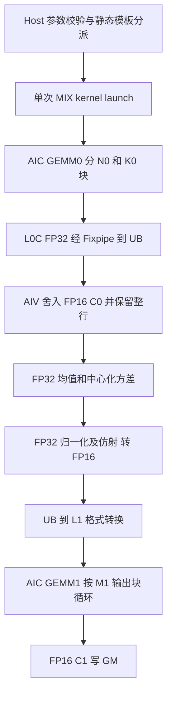

# 【社区任务】MatmulLayerNormMatmul 算子设计文档

> 任务：2026 年 9 月社区任务 MatmulLayerNormMatmul。
> 目标代码仓：`cann/catlass`；开发语言：Ascend C；目标硬件：Ascend 950，性能验收使用 Ascend 950PR。
> 本文为实现前的设计方案，精度、性能和目标设备编译结果将在实现后提供，不将估算视为实测结果。

# 一、需求背景

## 1.1 需求来源

依据 9 月任务书压缩包中的 `MatmulLayerNormMatmul_task_doc.md` 和 `MatmulLayerNormMatmul_测试集.csv`，
实现单次 kernel launch 的 `Matmul -> LayerNorm -> Matmul` 融合算子。设计文档按社区模板组织，并参考
`20260801-radius/zhouzirui/docs/design.md` 的需求追踪、Host/Kernel 分层、测试矩阵和风险分析方式。

上游任务列表当前仍以 `07-04-MatmulLayerNormMatmul` 收录同名任务，因此沿用该任务目录，在 `xfx321/docs/`
提交本次设计。验收以收到的 9 月任务书为准：除 optest 任务测试集外，还需提供 ATK 至少 200 例泛化测试交付件；
代码交付使用任务书要求的 `experimental/matmul/` 目录。

## 1.2 背景介绍与参考实现

两次矩阵乘之间插入 LayerNorm 的模型结构，在小算子拼接方式下需要多个设备任务，并将 `C0` 和 `C0_norm`
分别写回、再从 GM 读取。融合的目标是减少 launch 和中间矩阵的显存访问，同时保持整行归一化语义。

本任务不是已有 TBE 算子的迁移。功能与性能参考为：

```python
c0 = torch.mm(a0, b0)
c0_norm = torch.nn.functional.layer_norm(
    c0, normalized_shape=(n0,), weight=gamma, bias=beta, eps=1e-6
)
c1 = torch.mm(c0_norm, b1)
```

参考张量的逻辑 shape 与算子一致，B0/B1 使用列主 stride；gamma/beta 保持 FP32。需要在目标 torch_npu
版本核验混合 dtype 的 LayerNorm 调用，不能通过将 gamma/beta 降为 FP16 来绕过接口问题。

关键困难是 LayerNorm 依赖 `N0` 全行统计量：对不同 N 分块独立归一化，再拼接结果，不等价于任务公式。
设计由一个 AIC 及其关联 AIV 协作处理完整的行块，统计归约不跨独立核组。

## 1.3 任务书条款基线

| 编号 | 要求 | 设计落点 |
| --- | --- | --- |
| RQ-01 | 一次 launch 完成三阶段计算 | 一个 MIX kernel，内部调度两次 GEMM 和 LayerNorm。 |
| RQ-02 | 不产生中间矩阵显存读写 | `L0C -> UB -> L1 -> L0A`；超容量时片上分块重计算。 |
| RQ-03 | Mean、Variance 由内部 workspace 管理，不对外暴露 | 每核组的片上 scratch；公共接口只返回 C1。 |
| RQ-04 | A0/B0/B1 为 FP16，gamma/beta 为 FP32，C1 为 FP16 | 明确布局、累加类型及两个中间舍入边界。 |
| RQ-05 | LayerNorm 沿 N0，epsilon 为 1e-6 | 总体方差，分母为真实 N0，无仿射广播歧义。 |
| RQ-06 | optest 任务测试集通过 | 按 CSV 原始 idx 覆盖全部 116 例。 |
| RQ-07 | ATK 泛化至少 200 例精度通过 | 独立的 240 例正常泛化矩阵及额外边界/异常测试。 |
| RQ-08 | 平均加速比大于 1.1 | 950PR、msprof op、逐例时延及算术平均加速比。 |
| RQ-09 | 设计评审、README、自验报告和代码交付 | 本仓先提交设计；实现与测试交付到 CATLASS。 |

## 1.4 交付范围

本设计覆盖前向融合计算、CATLASS Kernel/Block/Tile 组件、样例、optest 接入、ATK 泛化和性能验证。
反向传播、额外激活、量化、训练参数更新和多设备通信不属于本算子的接口。本文中的文件名和 tile 候选为实现规划。

# 二、需求分析

## 2.1 数学定义

设 A0 为 `(M0,K0)`、B0 为 `(K0,N0)`、B1 为 `(N0,M1)`：

$$
C0_{m,n}=\sum_{k=0}^{K_0-1} A0_{m,k}B0_{k,n},\qquad
\mu_m=\frac{1}{N_0}\sum_{n=0}^{N_0-1}C0_{m,n}
$$

$$
v_m=\frac{1}{N_0}\sum_{n=0}^{N_0-1}(C0_{m,n}-\mu_m)^2,\qquad
Y_{m,n}=(C0_{m,n}-\mu_m)(v_m+10^{-6})^{-1/2}\gamma_n+\beta_n
$$

$$
C1_{m,j}=\sum_{n=0}^{N_0-1}Y_{m,n}B1_{n,j}.
$$

这里 `Y` 即 `C0_norm`。方差使用总体方差，不使用 `N0-1`；gamma、beta 按列作用于每一行。

## 2.2 输入输出契约

| 参数 | 方向 | dtype | 逻辑 shape | 物理布局及元素 stride |
| --- | --- | --- | --- | --- |
| A0 | 输入 | FP16 | `(M0,K0)` | RowMajor，`(K0,1)`。 |
| B0 | 输入 | FP16 | `(K0,N0)` | ColumnMajor，`(1,K0)`。 |
| B1 | 输入 | FP16 | `(N0,M1)` | ColumnMajor，`(1,N0)`。 |
| gamma | 输入 | FP32 | `(N0,)` | 连续，stride 1。 |
| beta | 输入 | FP32 | `(N0,)` | 连续，stride 1。 |
| C1 | 唯一输出 | FP16 | `(M0,M1)` | RowMajor，`(M1,1)`。 |

B0 的地址为 `base + k + n*K0`，B1 的地址为 `base + n + j*N0`。Torch 可通过
`torch.empty((N0,K0), ...).t()` 构造 B0；不能使用无条件 `.contiguous()` 把列主数据改为行主后仍沿用原地址公式。
退化维度按实际地址等价性检查布局，避免仅因 singleton stride 不同拒绝有效输入。

规划的 optest 接口为：

```python
torch_catlass.matmul_layer_norm_matmul(a0, b0, b1, gamma, beta) -> Tensor
```

epsilon 固定为 `1e-6`，不增加用户可修改属性。所有输入位于同一 NPU，输出新分配且不覆盖输入。
不支持任意步长切片或批次广播；列主 B 张量属于指定布局，不属于任意非连续 Tensor 扩展。

## 2.3 精度路径

| 阶段 | 计算与存储类型 | 原因 |
| --- | --- | --- |
| GEMM0 | FP16 乘数、FP32 L0C 累加，完整 K0 归约后舍入到 FP16 C0 | 对齐 FP16 `torch.mm` 输出边界。 |
| LayerNorm | C0 转 FP32，均值、方差、rsqrt、仿射运算均为 FP32 | 降低长行统计误差，保留 FP32 gamma/beta。 |
| LayerNorm 输出 | 仿射运算完成后舍入到 FP16 Y | 对齐拼接基线的 LayerNorm 输出及第二次 GEMM 输入。 |
| GEMM1 | FP16 乘数、FP32 L0C 累加，完整 N0 归约后转 FP16 C1 | 不在 K 分片之间引入 FP16 累加舍入。 |

不采用 `E[x*x]-E[x]^2` 直接相减计算方差。驻留路径采用两遍中心化归约；重计算路径采用分块 Welford 合并。
FP16 转换使用目标 API 可明确验证的舍入模式，并与参考中间转换一致。不同归约顺序按生态精度标准判定，
不承诺与 torch 的所有元素逐位相同。

## 2.4 外部依赖与规模

依赖 CATLASS、CANN Ascend C、配套驱动与 `cann-950-ops`；测试依赖 PyTorch/torch_npu、optest、ATK 和 msprof。
所检查 CATLASS 快照为 `1e5684737b8aa544534b735b3e179ff8ec21bfca`，其 README 对 Ascend 950 C++ 样例要求
CANN 9.0.0 或以上；实际实现锁定所选 CATLASS revision 要求的配套版本，构建使用 `CATLASS_ARCH=3510`。

任务 CSV 共 116 例：M0 为 128/512/1024/2048，K0 为 768/2048/4096/8192，
N0 为 2048/3072/4096/8192，M1 为 768/2048/4096。它不是这些集合的完整笛卡尔积，验收按 CSV 逐行执行。
N0=8192 的 12 例必须覆盖，不能仅为 N0<=4096 实现驻留方案。

# 三、需求详细设计

## 3.1 总体方案

使用 Ascend 950 MIX kernel，由一个 AIC 及其关联的两个 AIV 构成核组。AIC 执行两次 GEMM，两个 AIV
分别处理行块的不同半区，每个有效行只归属于一个 AIV。输出主分块为 `(Bm,M1)`，各核组按 M0 分块分工。



图示为驻留主路径。若整行驻留不满足容量约束，则在同一个 MIX kernel 内先分块计算统计量，再重计算 C0
生成当前 Y 分片并立即参与 GEMM1。两条路径都不将 C0/Y 写入 GM，不依赖全设备 barrier。

## 3.2 CATLASS 分层与文件规划

实现复用已有组件的结构和同步方式，LayerNorm 新增独立 block/tile 组件，不复制一个完整的独立 GEMM 框架。

| 层级 | 规划路径，相对于 CATLASS 根目录 | 职责 |
| --- | --- | --- |
| 样例 | `experimental/matmul/matmul_layer_norm_matmul/{CMakeLists.txt,matmul_layer_norm_matmul.cpp,README.md}` | Host、模板组装、构建和运行说明。 |
| 样例测试 | `experimental/matmul/matmul_layer_norm_matmul/test_matmul_layer_norm_matmul.py` | optest 调用、任务 CSV 和功能验证。 |
| Kernel | `include/catlass/gemm/kernel/matmul_layer_norm_matmul.hpp` | 三阶段编排、核组任务与生命周期。 |
| Block/Tile | `include/catlass/epilogue/block/block_epilogue_layer_norm_ascend950.hpp`、对应 tile 头文件 | 行统计、仿射、mask 和 UB 到 L1。 |
| Kernel 适配 | `tests/optest/kernels/matmul_layer_norm_matmul/` | `.cpp`、`_impl.cpp`、CMake 构建及 launch。 |
| ABI/runner | `tests/optest/include/catlass_kernel_jit.h`、`tests/optest/kernels/common/kernel_runner.h` | 注册签名、当前 stream 与 workspace 传递。 |
| C++ extension | `tests/optest/src/catlass_matmul_layer_norm_matmul.cpp`、`src/include/template/matmul_layer_norm_matmul.h` | Tensor 校验、输出创建、模板适配。 |
| Python | `tests/optest/torch_catlass/ops/matmul_layer_norm_matmul.py`、两层 `__init__.py` | 导出公共测试接口。 |
| 框架构建/说明 | `tests/optest/kernels/CMakeLists.txt`、`tests/optest/README.md` | 接入测试入口。 |

ATK 交付沿用实际接入时的 CATLASS ATK 支持规范，包含算子适配、参数生成、golden 和执行说明。
不将临时分析脚本、二进制或测量日志提交到算子源码 PR。

可复用的已检查组件：

| 现有路径 | 复用范围 |
| --- | --- |
| `examples/44_quant_matmul_full_loadA_tla` | 任务书指定参考，学习模板及全载策略，不复用量化语义。 |
| `examples/73_ascend950_matmul_full_loadA` | 950 构建及容量满足时的 A 全载；容量不足时采用 K 分块。 |
| `include/catlass/gemm/tile/ascend950/copy_l0c_to_ub.hpp` | FP32 L0C 到 UB，行分配。 |
| `include/catlass/epilogue/tile/copy_ub_to_l1_tla.hpp` | RowMajor UB 到 zN L1 的转换。 |
| `include/catlass/gemm/kernel/matmul_mix_fixpipe_opti.hpp` | AIC/AIV 核组索引及双向同步协议。 |
| `include/catlass/epilogue/block/block_epilogue_fa_softmax_ascend950.hpp` | Vector 结果送回 L1 的事件管理方式，不复用 softmax 公式。 |

## 3.3 Host 侧设计

### 3.3.1 校验、分派与 stream

Host 校验维数、dtype、device、shape 联动、物理布局及地址范围；所有维度乘积、字节数和偏移采用检查溢出的
64 位算术。超出底层字段范围时报错，不能截断成 uint32。基于真实 shape 和平台容量选择已编译的静态模板，
公共接口不暴露 tiling 调参开关。实验用模板选择仅由样例/测试入口提供并记入报告。

分派顺序为：参数检查、空输出处理、片上资源检查、模板选择、输出分配、当前 stream 上一次 launch。
M0=0 或 M1=0 时返回对应空输出；N0=0 无有效归一化域，报参数错误。K0=0 且 N0>0 时定义 C0 为零，
kernel 跳过 GEMM0 并执行 `FP16(beta) @ B1`。任务书没有额外对齐限制，非对齐正维度使用 mask/padding 路径。

所有内部内存随当前调用/stream 管理，不保存跨调用的可变统计量。JIT 编译和输入构造在正式计时前完成。
布局不符时明确报错，不在公共接口内部增加一个未计入的转置 kernel。

### 3.3.2 Tiling 数据与核组任务

| 字段 | 作用 |
| --- | --- |
| M0、K0、N0、M1、各 leading dimension | 原始逻辑维度与 64 位寻址。 |
| Bm、Bn0、Bk0、Bn1、Bk1 | 两个 GEMM 的静态块形状，运行时携带实际尾块。 |
| alignedN0、有效行列数 | 片上存储跨度与逻辑归约范围区分。 |
| pathKey、tileId、stageCount | 驻留/重计算模板及流水深度。 |
| rowTaskCount、outputGroupCount、activeCoreGroups | 核组调度及小 M 并行模式。 |
| 片上 offset/size、runtime workspace size | 由同一布局计算器生成，避免组件重复占用。 |

普通路径中任务数为 `ceil(M0/Bm)`，核组以 grid-stride 遍历行块，逐个输出列块写回。
当小 M0 导致核组不足时，可将 M1 划分为若干不相交的列组：每个 `(行块,列组)` 独立重复 GEMM0/LayerNorm，
只写自己的 C1 区域。重复计算换取并行度，选择阈值由 950PR profiling 决定，不能假定必然更快。
不沿 N0 跨核拆分统计量，不采用跨核 Split-K 原子累加。

### 3.3.3 片上容量与 workspace

当前 `Arch::Ascend950` 定义每 AIV UB 为 248 KiB、每 AIC L1 为 512 KiB，L0A/L0B 各 64 KiB、
L0C 为 256 KiB。实际分配同时满足平台查询结果、模板静态检查和编译资源检查。
设 `Nv=align(N0)`，`Mv=Bm/2` 为每 AIV 的物理行数，FP16 为 2 bytes，FP32 为 4 bytes。

驻留路径每 AIV 的预算上界按以下活跃区间计算：

```text
UB = 2*Mv*Nv                         # FP16 C0 整行驻留
   + 2*4*Mv*Bn0                     # 两个 FP32 Fixpipe tile
   + 3*4*Mv*max(Bn0,Bk1)            # FP32 统计/归一化临时片
   + 2*Mv*Bk1                      # FP16 Y 中转
   + 2*4*max(Bn0,Bk1)              # gamma/beta 分片
   + stats_and_reduce_scratch + alignment_and_event_reserve

L1_GEMM0 = 2*(2*Bm*Bk0 + 2*Bk0*Bn0)
L1_GEMM1 = 2*Bm*Nv + 2*(2*Bk1*Bn1)
L1_peak  = max(L1_GEMM0, L1_GEMM1) + layout_reserve
L0C_peak = max(4*Bm*Bn0, 4*Bm*Bn1)   # 主路径阶段间复用
```

两次 GEMM 串行复用 L1 的输入缓存区；转换 Y 前必须等待 GEMM0 的 L1 消费结束。L0A/L0B 按各自 tile
及真实 stage 数单独检查。gamma/beta 分片搬入，不把 N0 个 FP32 参数各复制一份常驻每个 UB。

例如 `Bm=16,N0=8192,Bn0=Bk0=Bn1=Bk1=128`，每 AIV 的 C0 为 128 KiB，两个 Fixpipe tile
共 8 KiB，三个 FP32 临时片共 12 KiB，Y 中转 2 KiB，gamma/beta 1 KiB，合计 151 KiB；
若再预留 32 KiB 给统计、归约 scratch 和对齐，总计 183 KiB，低于 248 KiB。
GEMM1 L1 为 256 KiB 的 Y 加 64 KiB 的 B1 双缓冲，共 320 KiB，尚需核验布局及事件预留。
这是容量候选，不是最优性能结论；真实临时空间超过预算时，减小 tile 或采用重计算路径。

Mean、Variance、rstd 位于算子内部的片上 workspace，每 AIV 按行私有，至少预留 `3*4*Mv` bytes。
默认算法的 GM workspace 为 0 bytes；若 CANN launch ABI 要求系统 workspace，按框架规则分配并单独记录，
不用于保存 C0/Y 或对外输出统计量。任务中的 workspace 管理要求不等于必须把统计量写入 GM。

## 3.4 Kernel 侧设计

### 3.4.1 GEMM0 与整行驻留

AIC 按 Bn0 遍历 N0，各 N 分片内部沿 Bk0 完成整个 K0 的 FP32 累加，再通过 Fixpipe 送 FP32 tile 到 UB。
使用已支持的 FP32 行分割输出，AIV 再转 FP16 写入自己的 C0 行缓存；不假设带 FP32-to-FP16 转换的
Fixpipe 能直接复用所有 dual-destination 模式。保留 FP32 tile 中转也便于检查 C0 舍入。

两个 AIV 各持有连续的半个 Bm 行块，每个有效行包含全部 N0 列。K0 尾块输入补零；N0 尾块仅存有效值，
为对齐分配的额外列不计入后续统计。无有效行的 AIV 仍履行核组事件协议。

### 3.4.2 LayerNorm 与 GEMM1

第一遍把驻留的 FP16 C0 分片转 FP32，用分块树形求和得到每行均值；第二遍读取同一 C0，求中心化平方和
并除以真实 N0。第三遍计算 `(C0-mean)*rstd*gamma+beta`，最后一次转 FP16，送入 L1 的 Y 对应区域。
方差仅对舍入产生的微小负值作 `max(v,0)` 防护；不修改 NaN/Inf 来伪造有限结果。

AIC 等两个 AIV 的 Y 写入完成后，以整行 Y 作为 GEMM1 左矩阵，按 Bn1 遍历 M1，沿 Bk1 遍历 N0。
Y 在 L1 中复用，B1 双缓冲，输出在 L0C 中 FP32 累加，完整归约后转 FP16 写 C1。
尾列屏蔽写回；补齐的 Y 和 B1 乘数清零，不允许 gamma/beta 使无效 padding 列产生贡献。

### 3.4.3 超容量重计算路径

不能将 N0=8192 设为功能上限。当减小 Bm 仍无法驻留整行时，采用片上分块重计算：

1. 分 N0 块执行 GEMM0，每个块完成 K0 归约并舍入为 FP16；AIV 转 FP32，计算该块的 count、mean、M2。
2. 使用 Welford 合并得到整行统计，仅保留每行 count、mean、M2、rstd，不保存整行 C0。
3. 对每个输出列块，重新逐 N0 块计算 C0，使用最终统计量生成 FP16 Y 分片并送入 L1。
4. AIC 立即执行该 Y 分片与 B1 分片的 GEMM1，所有 N0 块完成后才将当前 C1 块写回。

两个统计块的合并公式为：

$$
\delta=\mu_b-\mu_a,\quad c=c_a+c_b,\quad
\mu=\mu_a+\delta\frac{c_b}{c},\quad
M2=M2_a+M2_b+\delta^2\frac{c_a c_b}{c},\quad v=M2/N_0.
$$

count 使用可覆盖 N0 的整数，实际参与计算的是有效元素；初始空状态直接接收第一个非空块。
重计算保持相同 GEMM0 tile、K0 累加次序和 FP16 舍入，使统计阶段与重算阶段基于同一组 C0 值。

该路径 GEMM0 总执行量约为 `1+ceil(M1/Bn1)` 遍（无输出列分组时）。它提供容量无关的功能路径，
不作为未经测量的性能优化。GEMM0 和当前 GEMM1 输出累加器同时存活，必须分配不重叠 L0C 区域，
满足 `4*Bm*Bn0 + 4*Bm*Bn1 + reserve <= L0C_capacity`，不能套用主路径的 max 预算。
L1 中只驻留 Y 分片、GEMM0/B1 输入缓存；AIC 在两个计算阶段切换前显式完成相应搬运与矩阵指令。

### 3.4.4 同步与缓冲区生命周期

| 缓冲区 | 生产者 -> 消费者 | 复用条件 |
| --- | --- | --- |
| GEMM0 FP32 UB tile | AIC Fixpipe -> AIV | 两个 AIV 均已读取并将有效值转存/归约。 |
| FP16 C0 行缓存 | AIV -> 同一 AIV | 当前行块 LayerNorm 结束，不跨行块提前覆盖。 |
| FP16 Y 中转 UB | AIV Vector -> MTE3 | UB 到 L1 拷贝完成才复用。 |
| L1 Y | AIV MTE3 -> AIC MTE1/MMAD | 所有使用该 Y 的输出块完成后才覆盖。 |
| GEMM1 L0C | AIC MMAD -> Fixpipe | 输出写回完成；重计算时独立于 GEMM0 L0C。 |

采用 CATLASS 既有 cross-core flag 和 pipeline event；ready 在生产数据的指令队列完成后发布，free 在消费者
完成读取后发布。双缓冲以 `tile_index % stageCount` 选择槽，每槽独立 flag；两个 AIV 使用各自的完成通知，
AIC 收齐后再复用。首轮初始化 free，结束时排空在途事件；尾块、空行子块也执行匹配的 set/wait。
核组索引按现有 MIX task ratio 计算，不能把 AIV 的物理 block index 直接当作 AIC 行任务索引。

主路径先实现行块内三个阶段串行，再在不改变依赖的前提下重叠搬运和计算。不采用普通 GM 标志轮询构造
全设备同步，也不使用额外初始化 kernel，否则会破坏单 launch 要求。

### 3.4.5 简化伪代码

```text
for task in tasks_of_this_core_group:
    determine valid rows and owned output columns
    if resident:
        for n_tile in full N0:
            C0_tile = fp16(gemm0_fp32_accumulate_over_full_K0())
            retain valid C0_tile in row-local UB
        mean, variance = centered_two_pass_reduce(C0, valid_N0)
        Y_L1 = fp16(affine_normalize_fp32(C0, mean, variance, gamma, beta))
        for j_tile in owned output columns:
            C1_tile = gemm1_fp32_accumulate_over_full_N0(Y_L1, B1)
            store fp16(C1_tile), masked by valid rows/columns
    else:
        stats = welford_merge_of_rounded_gemm0_tiles()
        for j_tile in owned output columns:
            initialize separate GEMM1 L0C accumulator
            for n_tile in full N0:
                C0_tile = recompute_and_round_gemm0_tile()
                Y_tile = fp16(affine_normalize_fp32(C0_tile, stats))
                accumulate GEMM1(Y_tile, B1_tile)
            store fp16(C1_tile), masked by valid rows/columns
```

## 3.5 性能优化方案

首轮候选 Bm 为 16/32/64，Bn0/Bn1 为 64/128/256，Bk0/Bk1 为 64/128/256；不编译全部组合，
先按容量、布局和硬件指令约束筛选，再为小 M、常规 N 和 N=8192 保留少量模板。

优先优化 Y 的 L1 全载复用、B 的双缓冲和 gamma/beta 的分片复用。GEMM0 的 A 全载仅在剩余 L1 容量足够时
启用；K0=8192 不强制全载 A。小 M 并行不足时比较缩小 Bm 和输出列分组重复计算的收益。
同步次数、Fixpipe、Vector 归约与 UB bank conflict 纳入 profiling，不只观察 Cube 利用率。

FP16 C0/Y 各省去一次写与一次读，理想省去的中间流量为 `8*M0*N0` bytes。
这不包括输入重复读取、输出列分组重算、缓存命中和内部系统开销，因此不能据此直接断言加速比超过 1.1。

## 3.6 硬件和约束

| 项目 | 支持与处理 |
| --- | --- |
| Ascend 950 / 950PR | 实现目标，950PR 为任务性能验收平台。 |
| A2/A3、其他 dtype | 本任务不提供对应实现。 |
| 非对齐 M0/K0/N0/M1 | 片上补齐、真实范围归约、输出 mask；不新增整除限制。 |
| N0 超出驻留容量 | 同 kernel 重计算路径，不落 GM 中间矩阵。 |
| 非法 shape/dtype/device/布局 | Host 报错；底层启动失败透传运行时异常。 |
| NaN/Inf、溢出和常数行 | 按浮点语义传播，测试分类核对，不任意裁剪输入。 |

# 四、特性交叉分析

| 交叉项 | 处理原则 |
| --- | --- |
| 列主布局 x 非方阵 | 分别校验 B0/B1 的逻辑 shape 与 stride，使用非对称数据检测转置错误。 |
| N0 尾块 x LayerNorm | count、sum、M2 只包含有效列，分母始终为真实 N0。 |
| FP16 x 常数/近常数行 | 先对齐 C0 的 FP16 舍入，再计算 FP32 方差；epsilon 位于 sqrt 内。 |
| gamma/beta x padding | 对无效列强制中性乘数，防止 beta 污染第二次 GEMM。 |
| 小 M x 列组并行 | 重复统计但输出区域互斥，不做原子累加。 |
| 大 N x workspace | 容量分派与重计算保证语义，不能静默改为分块 LayerNorm。 |
| 尾行 x 两 AIV 同步 | 无有效行仍完成事件，不提前退出造成 AIC 永久等待。 |
| 多 stream x 内存复用 | 每调用独立输出与 scratch，按当前 stream 生命周期释放。 |

# 五、可维可测分析

## 5.1 验收标准

| 项目 | 标准 | 来源 |
| --- | --- | --- |
| 任务精度 | CSV 全部 116 例通过 optest，满足生态算子精度标准 | 9 月任务书及 opbase 标准。 |
| 泛化精度 | ATK 至少 200 例正常输入精度通过，另测异常 | 9 月任务书。 |
| 融合 | 每次正常非空调用一个融合 kernel，C0/Y 无 GM 中转 | 任务定义与功能要求。 |
| 性能 | 全部任务用例的平均标杆时延/测试时延大于 1.1 | 9 月任务书。 |

设 CSV 第 i 例给出的基准时延为 `T_ref_i`，实际融合 kernel 时延为 `T_fused_i`，按以下主指标报告：

$$
S_i=T_{ref,i}/T_{fused,i},\qquad
S_{avg}=\frac{1}{116}\sum_{i=1}^{116}S_i>1.1.
$$

同时列出逐例 S_i、最慢/退化用例和 `sum(T_ref)/sum(T_fused)` 辅助指标，不用辅助指标替代算术平均。
全部 116 例参与，不删掉慢例，不将单例目标 `T_ref_i/1.1` 当作已经测得的融合时延。

## 5.2 Golden 与精度比较

使用同精度的 NPU 小算子拼接标杆和 CPU FP64 高精度标杆。后者分别提供数学公式结果与含 FP16 中间
舍入边界的结果，区分算法误差和必要舍入误差；任务验收仍以生态标准及 ATK 对应类别的判定为准。
不能以最终一次 `to(float16)` 的高精度结果代替拼接基线的两个中间 FP16 转换。

记录最大绝对误差、标准要求的相对/均方根误差指标及异常值分类；接入时固定 opbase 标准 revision 和 ATK 配置，
不自行放宽容差。接近零、常数行、FP16 舍入临界点另做定向分析。调试构建可按阶段检查 C0、mean、variance、Y；
调试导出不进入验收接口和性能数据，正式接口始终只返回 C1。

## 5.3 测试矩阵

| 用例 | 输入/操作 | 验证重点 |
| --- | --- | --- |
| TC-01 | 任务 CSV 原始 idx 1~116 | 全量精度，行列映射及公开性能。 |
| TC-02 | 矩形 B0/B1，确定性的非对称值 | ColumnMajor 解释和两个 K 维不混淆。 |
| TC-03 | M/K/N/M1 在 16/32/64/128 附近取 ±1 | 补齐、尾块、mask 和寻址。 |
| TC-04 | N0=1，N0=2，常数 C0 | 零方差、epsilon、gamma/beta；N0=1 时 Y=FP16(beta)。 |
| TC-05 | 近常数 C0、均值大方差小 | 中心化归约稳定性，禁用平方差公式。 |
| TC-06 | gamma=0、beta=0/非零，gamma/beta 非均匀 | FP32 仿射、按列广播、Y 的 FP16 转换。 |
| TC-07 | A0/B0/B1 全零及正负混合 | 零输出、消减误差及输入只读。 |
| TC-08 | 小幅、大幅、舍入临界、NaN/Inf 数据 | 标准精度与异常值传播，不溢出后伪造有限值。 |
| TC-09 | 强制驻留与重计算，及 N0=8193/更大行 | 两路径语义一致、容量阈值前后无遗漏。 |
| TC-10 | 强制列组数 1/2/4，多个合法 tile | 每输出唯一写入，归约和舍入契约一致。 |
| TC-11 | M0=0、M1=0、K0=0；N0=0 | 空输出、零 K 语义及非法归一化域。 |
| TC-12 | 错误 dtype/device/shape/stride | Host 在 launch 前报错，不隐式转置。 |
| TC-13 | 同 stream 重复、非默认 stream、并发调用 | flag 平衡、workspace 隔离和生命周期。 |
| TC-14 | 用例尾行仅落到一个 AIV | 空子块无死锁、不越界读写。 |
| TC-15 | profiler、源代码与编译产物检查 | 单 launch、无 C0/Y 的 GM 分配与读写路径。 |
| TC-16 | 维度/字节数溢出和分配失败 | Host 算术边界与错误传播。 |

ATK 正常泛化集合单独构造 60 个互不相同且不重复 CSV 的合法 shape：对齐中小型 20 个、带尾块 20 个、
退化小维度 10 个、跨驻留容量边界的长 N0 10 个。每个 shape 配四类数据分布，共 240 例：
尺度受控的零均值随机输入、正负交替消减、零/常数构造、近常数并带非均匀 FP32 gamma/beta。
长 N0 用例限制 M0/K0/M1，保证资源可执行，同时至少覆盖 N0=8191/8193/16384/32768。

生成器固定 seed 并输出去重后的 case manifest，记录 shape、dtype、stride、数据分布、pathKey、tileId 和结果。
异常、skip、仅重复运行同一 case 的条目不计入 240 例；正式报告明确实际成功条数。
路径等价测试使用同一输入，按标准精度比较；并发测试使用设备同步/超时检查发现同步死锁。

## 5.4 性能测试协议

仅在 Ascend 950PR 正式采集任务性能。记录硬件型号、驱动、CANN、torch/torch_npu、CATLASS commit、
编译选项、频率/功耗设置、pathKey、TileShape、stage 数、列组数和 workspace 大小。

每例先做正确性检查，再至少预热 30 次、采集 100 次设备执行数据，报告统一口径的平均值及 P50/P90。
采用 `msprof op`，通过 kernel-name 过滤并核对 profiler 中的任务序列，防止把输入生成或 JIT 作为被测算子。
Host wall time 只作辅助，不能作为异步 kernel 时延。设备正式测试前后同步，正确性检查与文件写入不计时。

公共 CSV 的小算子拼接时延为主标杆，保留原值；相同环境再测 `torch.mm + F.layer_norm + torch.mm`
以诊断版本差异，同时报告实际框架 kernel 序列。两者不得混列或挑选较慢标杆。
框架端到端测量应包含公共接口的全部设备工作，不能靠额外未计时的预处理使融合结果获益。

无中间 GM 流量的证明结合三项证据：源码中无 C0/Y GM 地址、内存规划中无对应分配、profiling/编译分析的
访存路径符合 `L0C -> UB -> L1`。仅看到一个 kernel 名称不能证明没有内部显存中转。

## 5.5 条款到实现与测试映射

| 条款 | 实现位置 | 验证 |
| --- | --- | --- |
| RQ-01/RQ-02 | MIX Kernel、片上布局、重计算分支 | TC-09、TC-13~15，launch 和访存证据。 |
| RQ-03 | 内部资源布局、optest ABI | 接口只返回 C1，统计 scratch 无外部别名。 |
| RQ-04/RQ-05 | GEMM 类型、LayerNorm Block、布局校验 | TC-02~08、TC-11/12。 |
| RQ-06 | 样例测试与 optest | TC-01，116 条 idx 全部成功。 |
| RQ-07 | ATK 适配、生成器及 golden | 240 例泛化 manifest 和逐例结果。 |
| RQ-08 | 模板选择、性能采集 | 116 例时延、S_avg、退化分析。 |
| RQ-09 | 设计 PR、代码 PR、README、自验证报告 | 评审记录与交付清单。 |

## 5.6 可维护性与兼容性

新增算子注册使用独立名称；不改变已接入算子的 schema。样例、optest 和 ATK 共用同一 kernel 入口与
参数语义，避免测试路径与实际实现分叉。模板选择函数只依赖 shape、布局和硬件信息，不依赖输入数据值。
平台 API 的细节局限于既有 CATLASS copy/sync 组件，归一化公式不散布在框架适配层。

代码实现后进行 3510 编译、样例运行、optest/ATK 精度、profiler 检查和当前 stream 验证。
其他硬件的仿真、静态检查或 CPU golden 可以用于开发，但不能替代 950PR 验收结果。

# 六、风险与规避

| 风险 | 规避和验收门槛 |
| --- | --- |
| N0=8192 片上缓存不足 | 明确预算，Bm=16 容量候选，最终以真实布局/编译资源为准；保留重计算分支。 |
| FP16 中间值与数学公式精度不同 | 对齐拼接基线的舍入边界，保留高精度诊断标杆，按生态标准判断。 |
| FP32-to-FP16 Fixpipe 的双目的限制 | 先 FP32 L0C 到 UB，再 AIV 转 FP16；上板验证行分割和尾行。 |
| UB 到 L1 格式或偏移不一致 | 共用布局计算器，使用确定性非方阵与逐 tile 调试检查。 |
| 两个 AIV 的 flag 不平衡 | 明确 ready/free 生命周期，尾块也参与，重复和并发压力测试。 |
| 重计算覆盖 GEMM1 累加器 | 单独预算两个 L0C 区域，测试强制重计算及长 N。 |
| 小 M 并行度低、重复 GEMM0 代价高 | 测量缩小 Bm 与列组分工的盈亏点，保留逐例调参记录。 |
| 平均性能未达 1.1 | 用 profiler 定位瓶颈，优化后重跑全部 CSV；未达标如实报告，不剔除用例。 |
| task 旧版缺少 ATK 要求 | 本设计明确 9 月基线和 240 例交付计划。 |
| NPU 混合 dtype LayerNorm 版本差异 | 目标环境先验证参考调用，不降低 gamma/beta 精度规避问题。 |

# 七、提交规范与实施顺序

设计文档提交路径：

```text
04_tasks/01_community-task-2026/tasklist/07-04-MatmulLayerNormMatmul/xfx321/docs/design.md
```

设计 PR 标题为 `【社区任务】MatmulLayerNormMatmul算子设计文档`，目标为 `cann/cann-ops-competitions`。
设计评审后，在 `cann/catlass` 实现片上融合与边界路径，再接入 optest、ATK，完成 950PR 精度和性能验收。
README 记录依赖、构建、输入布局、执行和测试方式；自验证报告保留环境、用例、日志/截图、性能和复现步骤。

代码 PR 只提交必要的源码、测试接入和文档。自验报告作为 PR 描述中的验收证据，不混入源码变更；不提交
令牌、个人邮箱、编译产物或临时调试文件。算子目录、分支、代码仓路径和所需访问方式在交付时明确列出。
当前设计 PR 不宣称已完成算子开发或任何硬件验收。

# 八、参考资料

1. 9 月任务书：`MatmulLayerNormMatmul.zip` 内的 `MatmulLayerNormMatmul_task_doc.md` 和 116 例测试 CSV。
2. [仓库中的同名任务书（7 月版）](https://gitcode.com/cann/cann-ops-competitions/blob/master/04_tasks/01_community-task-2026/docs/202607/MatmulLayerNormMatmul_task_doc.md)。
3. [社区设计模板](https://gitcode.com/cann/cann-ops-competitions/blob/master/04_tasks/01_community-task-2026/resources/design_template.md)。
4. [radius 参考设计](https://gitcode.com/cann/cann-ops-competitions/blob/master/04_tasks/01_community-task-2026/tasklist/20260801-radius/zhouzirui/docs/design.md)。
5. [社区任务流程及注意事项](https://gitcode.com/org/cann/discussions/39)。
6. [CATLASS 仓库](https://gitcode.com/cann/catlass)及本文列出的 950 copy/sync、full-load 和 epilogue 组件。
7. [CATLASS optest](https://gitcode.com/cann/catlass/blob/master/tests/optest/README.md)、[ATK](https://gitcode.com/Ascend/ATK/blob/master/README.md)。
8. [生态算子精度标准](https://gitcode.com/cann/opbase/blob/master/docs/zh/ops_precision_standard/experimental_standard.md)。
9. [CATLASS 性能调试](https://gitcode.com/cann/catlass/blob/master/docs/zh/1_Practice/evaluation/performance_tools.md)。
10. [CATLASS 创新样例开发流程](https://gitcode.com/cann/catlass/blob/master/docs/zh/1_Practice/10_innovative_example_development_guide.md)及[任务参考 PR #678](https://gitcode.com/cann/catlass/pull/678)。
