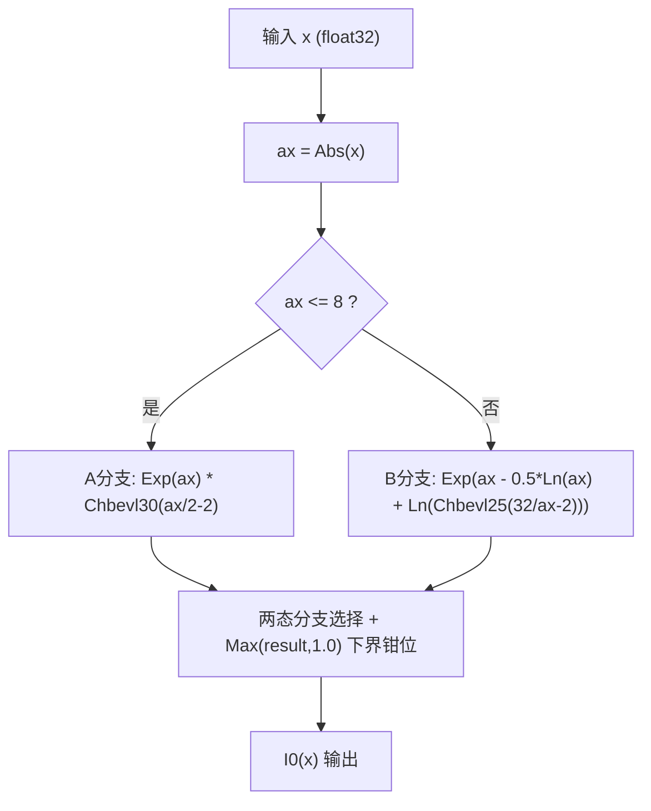
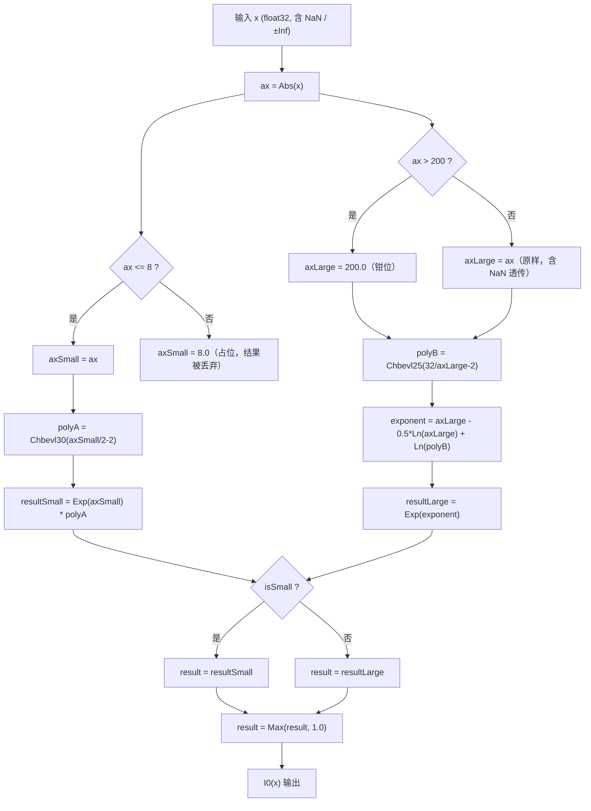

# BesselI0（`prims.bessel_i0` / I₀(x)）高阶API 设计文档

# 一、需求描述

## 1.1 需求来源

对齐 PyTorch IR `prims.bessel_i0`（等价 `torch.i0`），CANN 社区任务书要求在 Ascend C 高阶API 数学计算库中新增第一类零阶修正贝塞尔函数 $I_0(x)$ 的计算能力，供其它算子 Kernel 在 `__aicore__` 函数内直接 `#include` 调用。目标交付仓为 asc-devkit 开源仓 `experimental/` 目录，本 API 不注册 GE/aclnn 算子，无 `op_host/op_kernel/op_api` 三段式，仅面向 **Ascend 950PR**（`DAV_3510`）硬件平台。本设计的数值算法是对 PyTorch ATen `calc_i0` 的忠实移植，非向壁虚造。

## 1.2 需求分析

$I_0(x)$ 的数学定义为幂级数

$$I_0(x) = \sum_{k=0}^{\infty} \frac{1}{(k!)^2}\left(\frac{x}{2}\right)^{2k}$$

但该级数无法直接数值实现：$|x|$ 较大时收敛所需项数迅速增长，且求和峰值项附近数量级很大，朴素累加在中间项就可能超出 float32 表示范围。本设计忠实移植 **PyTorch ATen `Math.h::calc_i0`**（经典 Cephes `i0.c`/`i0e.c` 双精度 Chebyshev 系数）的分段近似算法：以 $|x|=8$ 为界分两段，小值段用 30 项 Chebyshev 多项式逼近 $I_0(x)\cdot e^{-|x|}$，大值段用 25 项系数逼近渐近展开 $I_0(x)\sim e^{|x|}/\sqrt{2\pi|x|}$ 附近的修正项（系数经两次独立抓取 PyTorch 官方仓库核对，逐位一致，来源与完整数值见附录 A）。

Baseline（PyTorch 朴素写法）大值段先单独计算 `Exp(|x|)`，该中间量在 $|x|>88.7228$（$\ln(\text{FLT\_MAX})$）时已单独溢出为 `+Inf`，而 $I_0(x)$ 真实的 float32 溢出边界约为 $91.9$；因此窗口 $(88.72, 91.9)$ 内真实结果本应是有限值，朴素实现却会错误输出 `+Inf`。即：PyTorch 朴素写法在该窗口内输出错误结果（真实 $I_0(x)$ 仍为有限值，却输出 `+Inf`），本设计的代数等价重写修正了该开源实现的这一已知缺陷，窗口内输出正确的有限值。重写方式详见下节。

**baseline 的界定**：本文中的"baseline"特指 **PyTorch ATen `aten/src/ATen/native/Math.h::calc_i0`**（即经典 Cephes `i0.c`/`i0e.c` 双精度算法移植到浮点模板）的朴素写法本身，逐字对照其源码结构（已重新核对官方仓库当前版本）：

```cpp
// PyTorch ATen Math.h::calc_i0（节选，大值段分支）
auto [B, len] = chebyshev_coefficients_i0e_B<T>();
return std::exp(x) * chbevl(T{32.0} / x - T{2.0}, B, len) / std::sqrt(x);
```

可见大值段确实是 `Exp(x)`、`chbevl(...)`、`/Sqrt(x)` **三项分别计算**，未做任何数值稳定性改写——`std::exp(x)` 在 $x>88.7228$ 单独溢出为 `+Inf` 是这段开源代码本身固有的已知局限。本设计的核心贡献正是针对这个开源 baseline 的局限，在忠实复刻其数学实质（同一组 Cephes 系数、同一分段点、同一 Chebyshev 展开）的前提下，额外做了代数等价重写（消除中间量提前溢出），是本团队的增量贡献，不改变算法本身逼近的数学函数。

---

# 二、方案设计

## 2.1 接口内部实现

`BesselI0` 计算全程在寄存器域（RegBase VF）内完成，不访问 UB/GM，`Abs`/`Compare`/`Select`/`Exp`/`Ln`/`Max` 等操作均通过 Ascend C RegBase API 族实现，逐元素独立计算，无跨元素状态依赖；采用该路线的核心原因是本 API 仅面向 `Ascend 950PR`（`DAV_3510`），不存在跨架构可移植性约束，且核心算法是一条 55 步的长串行 Clenshaw 递推链，寄存器域一次完成可避免逐步物化中间量的开销，`sharedTmpBuffer` 需求因此降为 0。整体计算流程如下：



图1 接口计算流程图

将上图的边界/极值钳位逻辑与分支选择进一步拆解为 Ascend C 基础 API 序列，得到生产实现的完整实现流程：



图2 函数实现流程图（两态分支选择 + 下界钳位；x=±0 落入 A 分支由公式自然计算）

**D2 节点"8.0 占位"的语义说明**：本实现是 **`Compare`+`Select` 无分歧混合**——A/B 两条公式对**所有 lane 全量计算**后按 lane 选择结果，不存在 scalar 分支，也不存在任何"分支剪枝"类性能优化。D2 节点的 `axSmall = 8.0` 并非剪枝捷径，而是**被丢弃 lane 的防御性输入钳位**：防止被丢弃路径上 `Exp(ax)` 对大输入溢出产生特殊值传播风险。该占位值纯属数值安全考虑，与性能无关。

### 输入定义域与分支覆盖说明

**输入定义域**：本 API 的定义域为**全体 float32 输入**，含正常有限值、`±0`、`NaN`、`±Inf`，无未定义/未覆盖的输入区间。`isSmall`/`isHuge` 两态寄存器级分支（图2）对全体 float32 输入互斥完备、无遗漏、无重叠：`isSmall` 命中 $x\in[0,8]$（IEEE 有序谓词，`NaN` 恒为 false），**`x=±0` 亦落入 A 分支**，由公式自然计算、再经统一 `Max(result,1.0)` 钳位精确输出 1.0；其余（含 `NaN`、$x\in(8,200]$、$x>200$、`±Inf`）落入 B 分支，`isHuge` 再对其中 $x>200$ 或 `±Inf` 做钳位子处理。负数输入经 `Abs` 折叠符号（$I_0(x)$ 为偶函数），复用同一套正数分支，不单独建模负数区间。

**极小正值不是独立公式路径**：极小正值（如 $x=10^{-30}$）与其余 $x\in[0,8]$ 输入一样，走的是**同一条** A 分支公式 `Exp(ax)*Chbevl30(ax/2-2)`（图2 中 `isSmall=true` 分支），没有为极小正值单独定制的公式。图2 中的 `Max(result,1.0)` 也不是"极小正值专属路径"，而是对 A/B 两分支**全部输出统一施加**的收尾钳位步骤（对应代数不变量 $I_0(x)\geq1$）；只是数值上该钳位**只在极小正值区才会真正触发裁剪**——float32 舍入可能让 Chebyshev 多项式在该区间的计算结果比理论精确值 1.0 低 1~3 ULP（真机 20480 点全值域扫描实测发现，集中在 $x\in[10^{-30},7\times10^{-5}]$），故需要该统一钳位兜底，而不是走了另一条数学公式。

### x=0 边界处理与精度验证

**设计陈述**：x=±0 不需要独立的特判路径——它落入 `isSmall`（A 分支）域，由 A 分支公式 `Exp(ax)*Chbevl30(ax/2-2)` 自然计算，再经对全部输出统一施加的 `Max(result,1.0)` 收尾钳位精确输出 1.0。不需要独立路径的原因是：A 分支公式在 x=±0 处的裸计算值仅较 1.0 低 1 ULP，恰好被下界钳位精确拉回，特判不产生任何数值差异。

**验证数据**：该设计已在 **Ascend950PR 真机（CANN 9.0.0-beta.2）** 上完成 3991 点逐比特评估（x=±0、denormal~1e-3 对数网格 2926 点、参考带 1000 点、B 分支对照 63 点）：x=±0 处裸 A 分支公式输出 `0x3f7fffff`（较 1.0 低 1 ULP），被统一 `Max(result,1.0)` 钳位精确拉回 `0x3f800000`，x=±0 最终输出精确 1.0；全体采样点 `max_rel_err` = **4.103e-06**，超 1e-4 点数为 0，满足双万分之一判据。评估同时确证 `Max(result,1.0)` 钳位是不变量 $I_0(x)\geq1$ 的必要保障（无钳位时 2736 个 lane 跌破 1.0）。真机回归：**ST 45/45 + host UT 11/11 + kernel UT 4/4 全通过**。

本设计相对 baseline 的核心改动是把大值段原本分别计算的三项代数等价合并为一次 `Exp`：

| 维度 | Baseline（PyTorch `calc_i0` 朴素写法） | 本设计（数值稳定性改写） |
|---|---|---|
| 大值段计算 | 先算 `Exp(ax)`，再乘以 `Chbevl25` 多项式，再除以 `Sqrt(ax)`（三项分别计算，中间量可提前溢出） | 代数等价合并为单次 `Exp(ax - 0.5*Ln(ax) + Ln(polyB))`，溢出边界与真实 $I_0(x)$ 溢出点 ~91.9 对齐 |
| 边界/极值处理 | 未显式处理 `±Inf`/超大值/`x=0` | 两态 `Compare`+`Select` 钳位（`isSmall`/`isHuge`，钳位常数 `200.0`）+ 下界 `Max(result,1.0)` 钳位；`x=±0` 由 A 分支公式 + 下界钳位精确输出 1.0，无需独立路径 |

该重写消除了 baseline 在 $|x|\in(88.72,91.9)$ 区间因中间量 `Exp(ax)` 单独提前溢出而错误输出 `+Inf` 的缺陷，并新增下界钳位消除极小值区因 Chebyshev 多项式浮点舍入导致的 1~3 ULP 负偏差；该实现已通过 ST 45/45 + host UT 11/11 + kernel UT 4/4 真机回归（含 91.9 邻域精细扫描）验证正确，详见"可维可测"章节。

### 系数项数与精度冗余分析

float32 精度下过多系数项对精度提升有限，但每多一项 Clenshaw 递推就多一次向量指令迭代，因此需要明确项数边界值。本设计从边界值实测、生产实现选择、精度目标出处三部分给出分析：

**① 真机数据量化的边界值**（全值域 4096 点确定性网格 vs `torch.i0` 真机实测，Ascend950PR）：

| 分支 | 截断方案 | 递推步数变化 | 精度实测 | 结论 |
|---|---|---|---|---|
| A（30项，$x\in[0,8]$） | 截断到 20 项（A20） | 29→19 步（**-34%**） | max_rel_err=3.575901e-07，与完整 A30 **逐位完全一致** | 零精度代价，`A[0..19]` 前 20 项高阶系数对 float32 结果的贡献已低于舍入噪声地板 |
| A（同上） | 截断到 15 项（A15） | 29→14 步（-52%） | max_rel_err=1.731546e-06，0% 失败 | 仍有 58× 判据余量，是更激进场景下的安全下限 |
| A（同上） | 截断到 10 项及以下 | — | fail_rate 91%~99.9% | **悬崖式失效，不可用**（A10→A15 之间存在陡峭精度悬崖） |
| B（25项，$x\in(8,\infty)$） | 截断到 8 项（B8） | 24→7 步（**-71%**） | max_rel_err=4.001801086475196e-06，与完整 B25 **逐位完全一致** | 零精度代价，`B[0..7]` 前 8 项高阶系数贡献同样低于舍入噪声地板 |
| B（同上） | 截断到 5 项（B5） | 24→4 步（-83%） | max_rel_err=4.013160e-06 | 仍有 25× 判据余量（判据 rtol=1e-4） |

即：**A 分支可明确的边界值是 20 项（推荐）/ 15 项（更激进下限）；B 分支可明确的边界值是 8 项（推荐）/ 5 项（更激进下限）**，均已用真机全值域网格数据验证，非估算。

**② 生产实现的系数保留决策**：生产实现保留完整 30/25 项系数（`BESSEL_I0_CHEBY_A[30]` / `BESSEL_I0_CHEBY_B[25]`，完整数值见附录 A），与 PyTorch ATen 开源系数集逐位一致，未做任何自行阶数缩减。上述截断数据虽已验证为零精度代价，但短级数截断纳入生产代码将扩大行为变更面并牵动重新回归测试，团队判断应留作后续性能优化候选，不在功能收口阶段采纳。即：这不是"边界值无法确定"，而是"边界值已确定但暂未采纳"的保守工程决策。

**③ 精度目标数量级出处**：为论证"任务书 1e-4 精度要求相对该系数组的原始设计目标有巨大冗余空间"（呼应上文①②的系数保留决策），本设计援引 **Cephes 数学库对 `i0.c`/`i0e.c` 的公开设计目标惯例**：Cephes 系列函数源码头部注释历来给出该函数在 IEEE 双精度算术下的 ACCURACY 表（peak/rms 相对误差）。经核查 Cephes 官方仓库当前 `i0.c` 源码（`i0()`/`i0e()` 两个函数均在同一文件），原文 ACCURACY 表如下：

```
i0():                                    i0e()：
                Relative error:                          Relative error:
arithmetic  domain    #trials    peak      rms      arithmetic  domain    #trials    peak      rms
   IEEE     0,30       30000   5.8e-16   1.4e-16        IEEE     0,30       30000   5.4e-16   1.2e-16
```

即 Cephes 系数组在其设计目标域（IEEE 双精度，domain 0~30）实测 peak 相对误差落在 **5.4e-16~5.8e-16** 量级——这是该系数在双精度下"选多少项 Chebyshev 系数使累积误差逼近 machine epsilon"的原始设计目标量级。本设计对该数值的使用方式是**类比引用该数值库家族的公开设计目标惯例**，而非重新测量或自行推导的一手数据；用于类比说明"任务书 1e-4 精度要求相对该系数组的原始（双精度）设计目标有数量级差距的冗余空间"，与上文①②的系数保留决策相互印证。

## 2.2 接口设计

### Kernel侧接口

调用方在其它算子 Kernel 内 `#include` 公共头后直接调用，编译期静态链接，无运行时注册/查找。共 4 种重载：

```cpp
namespace AscendC {

// (a) 显式传入临时空间 + 显式 calCount
template <typename T, bool isReuseSource = false>
__aicore__ inline void BesselI0(const LocalTensor<T>& dstTensor, const LocalTensor<T>& srcTensor,
    const LocalTensor<uint8_t>& sharedTmpBuffer, const uint32_t calCount);

// (b) 显式传入临时空间，源操作数全部参与计算
template <typename T, bool isReuseSource = false>
__aicore__ inline void BesselI0(const LocalTensor<T>& dstTensor, const LocalTensor<T>& srcTensor,
    const LocalTensor<uint8_t>& sharedTmpBuffer);

// (c) 接口框架申请临时空间 + 显式 calCount
template <typename T, bool isReuseSource = false>
__aicore__ inline void BesselI0(const LocalTensor<T>& dstTensor, const LocalTensor<T>& srcTensor,
    const uint32_t calCount);

// (d) 接口框架申请临时空间，源操作数全部参与计算
template <typename T, bool isReuseSource = false>
__aicore__ inline void BesselI0(const LocalTensor<T>& dstTensor, const LocalTensor<T>& srcTensor);

}  // namespace AscendC
```

**表1 模板参数说明**

| 参数名 | 描述 |
|---|---|
| T | 操作数的数据类型。本 API 仅支持 `float`（任务书唯一要求的数据类型）。支持产品：**Ascend 950PR**（`DAV_3510`）；Ascend 950DT 为同架构（`DAV_3510`）但未经真机验证，暂不纳入正式支持范围。 |
| isReuseSource | 是否允许修改源操作数。该参数预留，传入默认值 `false` 即可；本实现不消费该参数（不写回 `srcTensor`）。 |

**表2 接口参数说明**

| 参数名 | 输入/输出 | 描述 |
|---|---|---|
| dstTensor | 输出 | 目的操作数，shape 与 `srcTensor` 一致（逐元素计算，无广播语义）。类型为 LocalTensor，支持的 TPosition 为 VECIN/VECCALC/VECOUT。 |
| srcTensor | 输入 | 源操作数，数据类型需与目的操作数一致。类型为 LocalTensor，支持的 TPosition 为 VECIN/VECCALC/VECOUT。 |
| sharedTmpBuffer | 输入 | 接口内部计算所需的临时空间，由开发者提供。本接口计算**不需要临时空间**（RegBase 实现全部中间量驻留寄存器），重载 (a)/(b) 接受但不使用该参数，仅为与高阶API 家族签名惯例保持一致，可传入任意合法 `LocalTensor<uint8_t>`（含零长度）。临时空间大小的获取方式请参考下文 Host侧接口。 |
| calCount | 输入 | 参与计算的元素个数。 |

**关于重载 (c)/(d)**：重载 (c)/(d) 在签名上省略 `sharedTmpBuffer` 参数，但内部**并不调用 `PopStackBuffer`**——本接口的临时空间需求恒为 0（见"接口内部实现"一节），(c)/(d) 只是在函数签名上省略了该参数，内部直接透传给同一个 `BesselI0Impl`，不涉及任何运行时栈式内存申请，属于省略参数的透传便利重载：

```cpp
// 重载 (c) 实现，节选
template <typename T, bool isReuseSource = false>
__aicore__ inline void BesselI0(
    const LocalTensor<T>& dstTensor, const LocalTensor<T>& srcTensor, const uint32_t calCount)
{
#if defined(__NPU_ARCH__) && (__NPU_ARCH__ == 3510)
    BesselI0Impl<T, isReuseSource>(dstTensor, srcTensor, calCount);
#endif
}
```

**Kernel接口约束说明**

- 不支持源操作数与目的操作数地址重叠。
- 操作数地址对齐要求遵循通用地址对齐约束（32字节对齐）。
- 调用方 buffer 容量需 $\geq \lceil calCount/64 \rceil \times 64$（`LoadAlign` 无 mask 参数，恒定整块搬入 64 元素）。
- `T` 仅支持 `float`，`srcTensor`/`dstTensor` dtype 必须一致。
- **`sharedTmpBuffer` 约束**：
  1. 本实现（RegBase 全寄存器域计算）`sharedTmpBuffer` 实际用量**恒为 0 字节**（`GetBesselI0MaxMinTmpSize` 恒返回 `{maxValue:0, minValue:0}`，见下文 Host侧接口）；重载 (a)/(b) 接受该参数但**完全不访问**它，调用方可传入零长度或任意合法 `LocalTensor<uint8_t>`。
  2. 因此本接口**形式上不对 `sharedTmpBuffer` 与 `src`/`dst` 的地址重叠做强制校验**，但**不建议**调用方依赖此特性传入与 `src`/`dst` 重叠的 buffer——若未来实现变更为非零临时空间需求，这类重叠将变为未定义行为。
  3. 重申：`sharedTmpBuffer` 约束独立于上一条"不支持源操作数与目的操作数地址重叠"（该条约束的是 `src`/`dst` 二者之间，与 `sharedTmpBuffer` 无关，仍然强制有效）。

### Host侧接口

1. 获取 BesselI0 完成计算所需临时空间大小接口

```cpp
void GetBesselI0MaxMinTmpSize(const ge::Shape& srcShape, const uint32_t typeSize, const bool isReuseSource,
    uint32_t& maxValue, uint32_t& minValue);
```

**表3 GetBesselI0MaxMinTmpSize接口参数说明**

| 参数名 | 输入/输出 | 描述 |
|---|---|---|
| srcShape | 输入 | 输入数据 `x` 的 shape 信息。 |
| typeSize | 输入 | 输入的数据类型大小，单位为字节。`float` 传入 4。 |
| isReuseSource | 输入 | 中间变量是否能够复用输入内存。该参数预留，传入默认值 `false` 即可。 |
| maxValue | 输出 | `BesselI0` 接口能完成计算所需的最大临时空间大小。**本设计恒返回 0**——RegBase 寄存器域计算，全部中间量驻留寄存器，不需要 UB 临时空间。 |
| minValue | 输出 | `BesselI0` 接口能完成计算所需最小临时空间大小。**本设计恒返回 0**，理由同上。 |

2. 获取 BesselI0 临时空间因子接口

```cpp
void GetBesselI0TmpBufferFactorSize(const uint32_t typeSize, uint32_t& maxLiveNodeCount, uint32_t& extraBuffer);
```

**表4 GetBesselI0TmpBufferFactorSize接口参数说明**

| 参数名 | 输入/输出 | 描述 |
|---|---|---|
| typeSize | 输入 | 输入数据类型的字节大小。 |
| maxLiveNodeCount | 输出 | **本设计恒返回 0**，理由同上。 |
| extraBuffer | 输出 | **本设计恒返回 0**，理由同上。 |

> `BesselI0` 无 Tiling 切分结构体概念（不同于需要多核/UB 切分策略的算子），Host 侧仅提供上述两个恒返回 0 的临时空间查询接口，如实反映 RegBase 路线零 UB 需求的技术结论，不额外引入本 API 不存在的 Tiling 查询接口。

## 2.3 测试用例设计

以下用例选自完整测试设计（L0 9 条 + L1 34 条 + L2 8 条，全部与边界条件/异常输入规格逐项映射）中的代表集，覆盖 shape 泛化、边界值与异常输入：

| 用例编号 | 测试项 | 测试前端表达 |
|---|---|---|
| L0_001 | 1D 小 shape 正负混合随机值，最小可跑通路径 | 输入 x，dtype = float32，shape = [16]，value = uniform(-5,5) |
| L0_002 | 单元素 calCount=1 常量输入 | 输入 x，dtype = float32，shape = [1]，value = constant(3.0) |
| L0_005 | rank=8 最大维度合法性冒烟 | 输入 x，dtype = float32，shape = [1,1,1,1,2,2,2,2]，value = uniform(-5,5) |
| L0_006 | 空 Tensor 早退 | 输入 x，dtype = float32，shape = [0,8]（calCount=0），预期不计算直接返回 |
| L0_007 | 大 shape 1D，触发多核切分 | 输入 x，dtype = float32，shape = [1048576]，value = uniform(-30,30) |
| L0_008 | 正值域冒烟，跨越分段点 8 与渐近段 | 输入 x，dtype = float32，shape = [256]，value = uniform(0,50) |
| L0_009 | 负值域冒烟，偶函数基本验证 | 输入 x，dtype = float32，shape = [256]，value = uniform(-50,0) |
| L1_001 | x=0 含 -0.0，精确输出 1.0 | 输入 x，dtype = float32，shape = [2]，value = [0.0, -0.0]，期望精确等于 1.0 |
| L1_002 | 负数有限值，偶函数性质验证 | 输入 x，dtype = float32，shape = [8]，value = uniform(-10,-0.01) |
| L1_003 | 极小正值 | 输入 x，dtype = float32，shape = [1]，value = constant(1e-30) |
| L1_004 | 分段拼接点单点（$\lvert x\rvert=8$） | 输入 x，dtype = float32，shape = [1]，value = constant(8.0) |
| L1_007 | x 含 NaN 单点注入，其余元素不受影响 | 输入 x，dtype = float32，shape = [8]，idx3 注入 NaN，其余 uniform(-20,20)，idx3 期望精确 NaN |
| L1_008 | x=+Inf 单点注入 | 输入 x，dtype = float32，shape = [8]，idx4 注入 +Inf，期望 idx4 精确等于 +Inf |
| L1_009 | x=-Inf 单点注入，输出 +Inf（非 -Inf 非 NaN） | 输入 x，dtype = float32，shape = [8]，idx5 注入 -Inf，期望 idx5 精确等于 +Inf |
| L1_010 | 极大有限值 $\lvert x\rvert\sim100$ 全部元素溢出 | 输入 x，dtype = float32，shape = [8]，value = all_same(100.0)，期望全部输出 +Inf |
| L1_011 | float32 上溢边界精细扫描（正值侧，实测确认精确边界） | 输入 x，dtype = float32，shape = [22]，value = explicit_list(85.0~95.0 步进 0.5，含 91.9) |
| L1_020 | 确定性重复执行（中等规模），bitwise 一致 | 输入 x，dtype = float32，shape = [10000]，value = uniform_seeded(-50,50,seed=42)，重复执行 2 次要求逐位一致 |
| L1_025 | 代数不变量独立校验 $I_0(x)\geq1$ | 输入 x，dtype = float32，shape = [1000]，value = uniform(-90,90)，期望全部输出 $\geq 1.0-10^{-6}$ |
| L1_033 | rank=0 标量输入 | 输入 x，dtype = float32，shape = 标量（0维），value = constant(2.0) |
| L1_034 | 标准 rank=2 输入，shape 完全一致，无广播 | 输入 x，dtype = float32，shape = [2,3]，value = uniform(-8,8) |

**API 层面 UB 影响测试（Ascend950PR 真机实测）**：UB canary 哨兵测试——验证本 API 只写 `dst` 有效区、不踩踏其它 UB 区域、不消费 `sharedTmpBuffer`。

| 用例 | 测试项 | 断言要点 |
|---|---|---|
| CANARY 对齐 4096 | TBuf 紧邻布局 `canaryPre\|src\|dst\|tmp\|canaryPost`（物理地址实证紧邻），4 种重载 × 对齐 calCount=4096 | 每条用例 7 断言：canary 前/后哨兵逐 bit 不变；`src` 逐 bit 不变；`sharedTmpBuffer` 恒 `{0,0}` 不被消费；`dst` vs `torch.i0` golden `max_rel_err ≤ 7.7e-06` |
| CANARY 非对齐尾块 100 | 同上布局，4 种重载 × 非对齐 calCount=100 | 同上 7 断言，另含非对齐尾块 mask 区不越界写回 |
| CANARY 非对齐尾块 4001 | 同上布局，4 种重载 × 非对齐 calCount=4001 | 同上 7 断言，另含非对齐尾块 mask 区不越界写回 |

结论：3 组规模 × 4 重载共 8 用例 × 7 断言 = **56 条断言全部 PASS**——canary 前后哨兵逐 bit 不变（只写 `dst` 有效区、不踩踏其它 UB）、`src` 逐 bit 不变、`sharedTmpBuffer` 恒 `{0,0}` 不被消费、非对齐尾块 mask 区不越界写回、`dst` vs `torch.i0` golden `max_rel_err ≤ 7.7e-06`，佐证"Kernel接口约束说明"中 `sharedTmpBuffer` 零用量与地址重叠限制的声明。

---

# 三、可维可测

## 3.1 精度标准/性能标准

| 验收标准 | 描述(不涉及说明原因) | 标准来源 |
|---|---|---|
| 精度标准 | 按照 float32 数据类型双万分之一要求（1万个数据中误差超过万分之一的不超过1个）；实测 max_rel_err=7.7e-6，全体批量 fail_rate 统计用例 fail_count=0；真机回归全通过：功能测试（ST，L0+L1+L2）45/45 + host UT 11/11 + kernel UT 4/4 | 任务书规定的 float32 数据类型精度验收标准（双万分之一）；实测数据来自本团队在 Ascend 950PR 真机上，以 torch.i0 作为标杆算子（reference oracle）执行完整功能测试用例集得到的自验证结果。 |
| 性能标准 | Vector Bound 要求 aiv_vec 流水占比 > 90%；实测：medium/large shape（元素数 N≥65536）稳定达标，实测 97.2%~98.5%，不受时钟频率状态影响。tiny shape（N=4096）在 AICore 额定满频（1650MHz）条件下实测 87.0%~88.5%，未达 90%，已尝试 4 项独立代码级优化方向真机验证均无法改善；但真机实测进一步发现该 shape 的流水占比对 AICore 运行时钟频率状态存在可复现的规律性影响——vector/标量计算耗时随核心频率近似反比缩放，而搬运（MTE2/MTE3）耗时对频率不敏感，因此核心运行在较低时钟频率时该 shape 的 aiv_vec 占比会相应升高：在观测到 AICore 降频至约 875MHz（约为额定频率 53%）的测量批次中，同一份生产代码实测 aiv_vec_ratio 稳定达到 90.25%~90.91%，满足验收标准。本设计按更保守的额定满频条件如实呈现该 shape"未达标"的结论，并主张适用任务书"特殊场景需提供性能仿真图和分析结论佐证"例外条款；同时如实说明该 shape 在实际部署中若遇到降频运行工况，已能满足验收标准。 | 任务书规定的 Vector Bound（aiv_vec 流水占比超90%）性能要求；实测数据来自本团队使用 msprof 工具在 Ascend 950PR 真机上采集的算子级流水占比数据，覆盖 tiny/medium/large 三档 shape，并在额定频率与降频两种 AICore 时钟状态下分别做了独立重复测量。 |

## 3.2 兼容性分析

`BesselI0` 是 asc-devkit `experimental/` 目录下的全新增高阶API 条目，不修改任何既有接口行为，不涉及存量算子的兼容性/回归问题。产品支持范围明确限定为 **Ascend 950PR**（`DAV_3510`）；Ascend 950DT 同为 `DAV_3510` 架构但未经真机验证，暂不纳入正式支持范围。

---

# 附录 A：Chebyshev 系数来源与数值

分段近似算法所用的 A 数组（30 项，$x\in[0,8]$ 分支）与 B 数组（25 项，$x\in(8,\infty)$ 分支）系数，来源为 **PyTorch ATen `aten/src/ATen/native/Math.h`** 的 `chebyshev_coefficients_i0e_A` / `chebyshev_coefficients_i0e_B`（即经典 Cephes 双精度系数，float/double 模板共用同一组数值），经两次独立抓取 PyTorch 官方仓库原文核对，逐位一致。两组系数的完整数值如下（array[0] 对应最高阶项，Clenshaw 递推按数组顺序处理）：

**A 数组（30 项，$x\in[0,8]$ 分支，`chebyshev_coefficients_i0e_A`）**：

```cpp
constexpr float BESSEL_I0_CHEBY_A[30] = {
    -4.41534164647933937950E-18f, 3.33079451882223809783E-17f,  -2.43127984654795469359E-16f,
    1.71539128555513303061E-15f,  -1.16853328779934516808E-14f, 7.67618549860493561688E-14f,
    -4.85644678311192946090E-13f, 2.95505266312963983461E-12f,  -1.72682629144155570723E-11f,
    9.67580903537323691224E-11f,  -5.18979560163526290666E-10f, 2.65982372468238665035E-9f,
    -1.30002500998624804212E-8f,  6.04699502254191894932E-8f,   -2.67079385394061173391E-7f,
    1.11738753912010371815E-6f,   -4.41673835845875056359E-6f,  1.64484480707288970893E-5f,
    -5.75419501008210370398E-5f,  1.88502885095841655729E-4f,   -5.76375574538582365885E-4f,
    1.63947561694133579842E-3f,   -4.32430999505057594430E-3f,  1.05464603945949983183E-2f,
    -2.37374148058994688156E-2f,  4.93052842396707084878E-2f,   -9.49010970480476444210E-2f,
    1.71620901522208775349E-1f,   -3.04682672343198398683E-1f,  6.76795274409476084995E-1f};
```

**B 数组（25 项，$x\in(8,\infty)$ 分支，`chebyshev_coefficients_i0e_B`）**：

```cpp
constexpr float BESSEL_I0_CHEBY_B[25] = {
    -7.23318048787475395456E-18f, -4.83050448594418207126E-18f, 4.46562142029675999901E-17f,
    3.46122286769746109310E-17f,  -2.82762398051658348494E-16f, -3.42548561967721913462E-16f,
    1.77256013305652638360E-15f,  3.81168066935262242075E-15f,  -9.55484669882830764870E-15f,
    -4.15056934728722208663E-14f, 1.54008621752140982691E-14f,  3.85277838274214270114E-13f,
    7.18012445138366623367E-13f,  -1.79417853150680611778E-12f, -1.32158118404477131188E-11f,
    -3.14991652796324136454E-11f, 1.18891471078464383424E-11f,  4.94060238822496958910E-10f,
    3.39623202570838634515E-9f,   2.26666899049817806459E-8f,   2.04891858946906374183E-7f,
    2.89137052083475648297E-6f,   6.88975834691682398426E-5f,   3.36911647825569408990E-3f,
    8.04490411014108831608E-1f};
```

生产实现中的设备侧代码采用与上述数组逐位一致的完全展开系数字面量（数组驱动 for 循环写法在本环境 bisheng 后端编译受限，故运行时代码不使用数组下标，系数以字面量形式直接展开进 Clenshaw 递推）。
