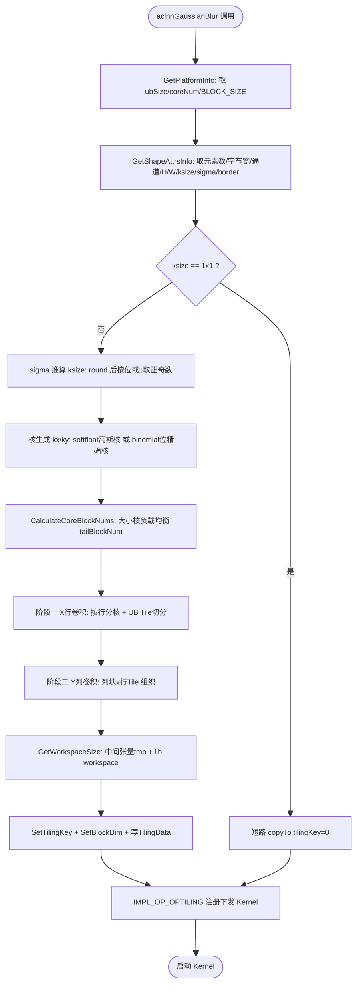
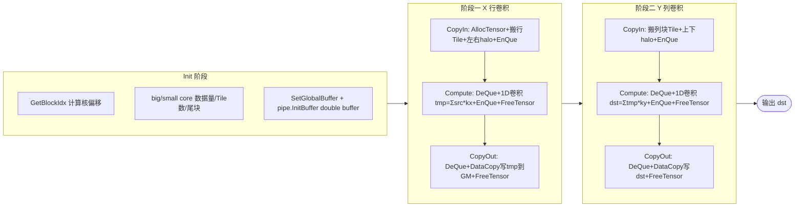

# [社区任务]-GaussianBlur 算子设计文档


# 需求背景（required）

## 需求来源

昇腾 CANN 2026 年 7 月社区任务：参考 OpenCV `imgproc` 模块中的 `cv::GaussianBlur`，在 Ascend 950PR NPU 上基于 **Ascend C Kernel + OpenCV C++ 适配层** 实现功能与接口完全对齐的高斯滤波算子，完成算子设计、开发、测试全流程，测试通过后合入昇腾 CV 算子开源仓 `ops-cv`。

- **对标实现**：OpenCV `modules/imgproc`，主入口 `src/smooth.dispatch.cpp`（`GaussianBlur`）、定点/位精确核 `src/smooth.simd.hpp`（`GaussianBlurFixedPoint`、`getGaussianKernelBitExact`）、HAL 接口 `src/hal_replacement.hpp`（`cv_hal_gaussianBlur`）、测试 `test/test_smooth_bitexact.cpp`、`test/test_filter.cpp`。
- **验收口径**：以 **OpenCV C++ 层 `cv::GaussianBlur()`** 的功能、精度、性能为唯一验收基准；**aclnn C++ 接口为必选交付项**（须与 OpenCV 层前向结果一致）；`cv_hal_gaussianBlur` 替换接口为可选。

## 背景介绍

### GaussianBlur 算子功能

高斯滤波对输入图像做**可分离二维卷积**（先沿 X 方向、再沿 Y 方向），等价于与二维高斯核卷积：

$$
\text{dst}(x,y) = \sum_{i,j} \text{src}(x+i,\, y+j) \cdot G_{\sigma_x}(i) \cdot G_{\sigma_y}(j)
$$

其中 $G_\sigma$ 为由 `getGaussianKernelBitExact` 生成的一维高斯核（softfloat 位精确），经定点化后用于 `CV_8U` / `CV_16U` 位精确路径。可分离性将 $O(k^2)$ 卷积降为两趟 $O(k)$ 一维卷积，是 NPU 高吞吐实现的基础。

典型应用场景：图像去噪、边缘检测预处理（Canny/Sobel 前）、SSIM/光流、目标检测与视觉 pipeline 基础算子。

### OpenCV 实现现状分析

通过对 OpenCV `cv::GaussianBlur` 的功能分析，当前支持能力与须对齐点如下：

| 维度 | OpenCV 现状 | 本算子须对齐点 |
| --- | --- | --- |
| 一维核生成 | `createGaussianKernels` 由 `sigmaX/sigmaY/ksize` 生成 `kx`、`ky`；`sigma=0` 且 ksize∈{3,5,7,9} 时走 `getGaussianKernelBitExact` 的 binomial 位精确核 | 核系数须与 `getGaussianKernelBitExact` 一致，不得用 float32 生成后量化 |
| 可分离卷积 | `sepFilter2D`：先 X 后 Y 两趟 1D 卷积 | NPU 两趟 1D separable conv，32F 累加顺序差异允许在 ATK 阈值内 |
| 通道处理 | 各通道独立 | 多通道不得混通道卷积 |
| 边界 | 支持 BORDER_REPLICATE/REFLECT/REFLECT101/CONSTANT 等 | **L1 仅须支持 BORDER_REPLICATE**；BORDER_WRAP 禁止 |
| in-place | 支持，bit-exact 路径内部 clone | 须支持 |
| ksize 推算 | `ksize.width==0 && sigmaX>0` → `round(sigmaX×(8U?3:4)×2+1)\|1` | 须实现 |
| 1×1 短路 | `ksize.width==1 && ksize.height==1` 直接 copyTo | 须实现 |
| 数据类型 | CV_8U/16U/16S/32F/64F | **L1 验收仅 CV_32F**；其余为预留扩展 |

### 与 TBE/已有实现关系

新算子，`ops-cv` 仓内无 `gaussian_blur` 既有实现，不涉及与 TBE 算子原型对齐；aclnn 接口使用开源仓已有源码框架（参考 `ops-math/experimental/math/bitwise_and` 工程骨架）。

# 需求分析（required）

## 需求描述

使用 Ascend C 编程语言实现 GaussianBlur 算子 Kernel，并通过 CANN 标准 aclnn 接口封装，使 OpenCV C++ 层 `cv::GaussianBlur()` 在 Ascend 950PR 上经适配层调用 NPU 路径，前向结果与 OpenCV CPU/GPU 一致。

## 需求拆解

1. **接口分层交付**：OpenCV 层（基准）+ aclnn 层（必选）+ Ascend C Kernel（必选，sepFilter2D 两趟 1D 卷积 + 边界处理）+ cv_hal 层（可选）。
2. **数据类型**：L1 验收档为 **CV_32F**；设计预留 CV_8U/16U 位精确、CV_16S/64F 扩展路径。
3. **ksize/sigma 推算**：实现 OpenCV `createGaussianKernels` 推算规则与 binomial 位精确核。
4. **边界**：L1 仅支持 BORDER_REPLICATE；BORDER_WRAP 禁止。
5. **功能对齐**：通过任务书 §4 全部功能验收用例（TC-03 ~ TC-11）。
6. **精度达标**：CV_32F 对标 OpenCV CPU，单标杆不满足时走 ATK 双标杆（最大相对误差比例 ≤ 2、平均 ≤ 1.2、均方根 ≤ 1.2）。
7. **性能达标**：S1 档（1024×1024 / CV_32FC1 / 5×5 / sigma 1.2）≥ A100 OpenCV 的 0.45×。
8. **in-place / 非连续 Mat / 任意合法 step**：均须支持。

# 详细设计（required）

## 算子分析

### 数学公式

二维可分离高斯卷积，可分解为两趟一维卷积：

$$
\text{dst}(x,y) = \sum_{i,j} \text{src}(x+i,\, y+j) \cdot kx_i \cdot ky_j
\quad\Longleftrightarrow\quad
\begin{cases}
\text{tmp}(x,y) = \sum_{i} \text{src}(x+i,\, y) \cdot kx_i \\
\text{dst}(x,y) = \sum_{j} \text{tmp}(x,\, y+j) \cdot ky_j
\end{cases}
$$

一维高斯核（位精确 softfloat 生成，定点化用于 8U/16U）：

$$
G_\sigma(i) = \alpha \cdot \exp\!\left(-\frac{i^2}{2\sigma^2}\right),\quad
\text{中心 } i=0,\ \text{半径 } r=(k-1)/2,\ \text{归一化 } \sum_i G_\sigma(i)=1
$$

`sigma=0` 且 ksize∈{3,5,7,9} 时，8U 路径使用 binomial 位精确核（Pascal 三角对应行定点化）。

### 支持数据类型

| depth | 路径 | 精度策略 | 验收 |
| --- | --- | --- | --- |
| **CV_32F**（L1） | Ascend C float32 separable conv | 对标 OpenCV CPU；累加顺序差异允许 ATK 阈值内 | 纳入性能/精度验收 |
| CV_8U / CV_16U（预留） | 位精确定点 separable conv | bit-exact，核须与 `getGaussianKernelBitExact` 一致 | 预留 |
| CV_16S / CV_64F（预留） | 升精度/拆分计算 | 对标 OpenCV CPU | 预留 |

### 支持形状与通道

- 1～4 通道（及 OpenCV 支持的多通道），**通道独立**处理，多通道不得混通道卷积。
- 任意 H×W；ROI / 非连续 Mat / 任意合法 step 须支持（HAL 接口含 step）。

### 支持边界

L1 仅实现 **BORDER_REPLICATE**（边缘像素复制）。BORDER_WRAP 禁止（与 OpenCV 一致报错或拒绝）；其余模式（REFLECT/REFLECT101/CONSTANT）为预留扩展，Kernel 设计预留 halo 处理接口。

## 算子实现

### 实现方案

#### 与 OpenCV 接口对照

**OpenCV C++ 层接口（必选，逐字对齐）**：

```cpp
CV_EXPORTS_W void GaussianBlur(
    InputArray src, OutputArray dst, Size ksize,
    double sigmaX, double sigmaY = 0,
    int borderType = BORDER_DEFAULT,
    AlgorithmHint hint = cv::ALGO_HINT_DEFAULT);
```

**aclnn 层接口（必选）**：

```c
aclnnStatus aclnnGaussianBlurGetWorkspaceSize(
    const aclTensor *src,
    const aclIntArray *ksize,       /* [width, height]，0 表示由 sigma 推算 */
    double sigmaX, double sigmaY,
    int64_t borderType,
    const aclTensor *dst,
    uint64_t *workspaceSize, aclOpExecutor **executor);

aclnnStatus aclnnGaussianBlur(
    void *workspace, uint64_t workspaceSize, aclOpExecutor *executor,
    const aclTensor *src, const aclIntArray *ksize,
    double sigmaX, double sigmaY, int64_t borderType,
    aclTensor *dst, aclrtStream stream);
```

| OpenCV 参数 | aclnn 参数 | 语义对照 |
| --- | --- | --- |
| `src` InputArray | `src` aclTensor* | 输入图像，非空，depth ∈ {8U/16U/16S/32F/64F} |
| `dst` OutputArray | `dst` aclTensor* | 与 src 同尺寸同 type，自动 create |
| `ksize` Size | `ksize` aclIntArray* `[w,h]` | 正奇数或 0（0 由 sigma 推算） |
| `sigmaX` double | `sigmaX` double | ≥ 0 |
| `sigmaY` double | `sigmaY` double | ≤ 0 时取 sigmaX |
| `borderType` int | `borderType` int64_t | L1 仅 BORDER_REPLICATE；BORDER_WRAP 禁止 |
| `hint` AlgorithmHint | （内部固定 ALGO_HINT_DEFAULT） | L1 仅支持 ALGO_HINT_DEFAULT |

**HAL 替换接口（可选）**：按 `modules/imgproc/src/hal_replacement.hpp` 的 `cv_hal_gaussianBlur` 原型实现，便于 OpenCV HAL 集成。

#### 工程骨架

```
gaussian_blur/
├── op_host/
│   ├── gaussian_blur_def.cpp          # OpDef：输入输出/dtype/format + Attr(ksize/sigma/border) + OP_ADD(GaussianBlur)
│   ├── gaussian_blur_infershape.cpp   # 输出=输入尺寸（同尺寸同type）
│   ├── gaussian_blur_tiling.cpp       # Host tiling：核生成 + 两阶段分核
│   └── CMakeLists.txt                 # add_modules_sources(OPTYPE gaussian_blur ACLNNTYPE aclnn)
├── op_kernel/
│   ├── gaussian_blur.cpp              # Kernel 入口（极薄：tiling 解包 + Init + Process）
│   ├── gaussian_blur.h                # Kernel 类：Init/CopyIn/Compute/CopyOut（两阶段）
│   ├── gaussian_blur_tiling_data.h    # TilingData 结构（host↔kernel 共享）
│   └── gaussian_blur_tiling_key.h     # TilingKey（区分阶段/dtype/边界分支）
├── op_api/                            # aclnn Host 实现（GetWorkspaceSize + 执行入口）
├── examples/test_aclnn_gaussian_blur.cpp
├── tests/ut/{op_host,op_kernel}/      # UT + gen_data.py/compare_data.py（numpy 金标准）
├── docs/aclnnGaussianBlur.md
├── CMakeLists.txt
└── README.md
```

构建：进入 `ops-cv/` 根目录，`bash build.sh --genop=image/gaussian_blur` 生成骨架；`bash build.sh --pkg --soc=ascend950 --experimental --ops=gaussian_blur -j16` 编译。上层 CMake 自动发现，无需改动中心注册表。

#### host 侧设计

**Host 侧 tiling 与核生成流程**：



##### 1. 核生成与定点化（须与 OpenCV `createGaussianKernels` 对齐）

在 host 侧（tiling 或 aclnn preprocess）根据 `ksize/sigmaX/sigmaY` 生成一维核 `kx`、`ky`，下发到 Kernel：

- `sigmaY ≤ 0` → `sigmaY = sigmaX`。
- ksize 推算（逐字实现 OpenCV）：
  - `ksize.width == 0 && sigmaX > 0` → `ksize.width = round(sigmaX × (depth==CV_8U ? 3 : 4) × 2 + 1) | 1`；
  - `ksize.height == 0 && sigmaY > 0` → 同上（用 sigmaY）。
- `ksize.width == 1 && ksize.height == 1` → **短路 copyTo**，不走卷积 Kernel（走 aclnn 极简 copy 路径，tilingKey=0）。
- `sigmaX == sigmaY == 0` 且 ksize∈{3,5,7,9} → 8U/16U 路径用 `getGaussianKernelBitExact` 的 binomial 位精确核；32F 路径用 softfloat 高斯核。
- **32F 核生成**：softfloat 计算 $G_\sigma(i)=\alpha\exp(-i^2/2\sigma^2)$ 后归一化，以 float32 下发到 Kernel 的 Constant/Workspace。
- **核系数须与 `getGaussianKernelBitExact` 一致**，不得用 float32 生成后量化（除非文档化且通过 bit-exact 用例）。sigma=0 的 binomial 核（3/5/7/9）为常见 fast path，须专门优化。

##### 2. tiling 策略（分函数组织 + 大小核负载均衡）

GaussianBlur 为两趟 separable conv，按 **行卷积（X 方向）→ 列卷积（Y 方向）** 两阶段切分。tiling 分函数组织：

- `GetPlatformInfo`：经 `platform_ascendc::PlatformAscendC` 取 `ubSize`、`coreNum`、`BLOCK_SIZE`，每步 `OP_CHECK_IF` 判 0。
- `GetShapeAttrsInfo`：取输入元素数、`GetDataTypeLength` 字节宽、通道数、H/W；解析 `ksize/sigma/border` 属性。
- `CalculateCoreBlockNums`：大小核负载均衡——核间能均分则无大小核区分；不能均分则余出数据块分到前 `tailBlockNum` 个核（big core），其余 small core。
- `GetWorkspaceSize`：`GetLibApiWorkSpaceSize()` + 中间张量 `tmp` 大小，写入 `context->GetWorkspaceSizes(1)[0]`。

**阶段一（X 方向，行卷积）**：每行独立卷积，按行并行。单核处理多行，核内按 Tile 切分以适配 UB。
- 分核：按行均分到多核，满核优先。
- Tile：单行数据按 UB 容量切 Tile，`tileLen = f(ubSize, BLOCK_SIZE, BUFFER_NUM=2, ksize)`；`tileBlockNum = (ubSize/BLOCK_SIZE)/UB_NUM`（`UB_NUM` 覆盖输入/输出/中间各 double buffer）。
- halo：半径 `r=(ksize-1)/2`，Tile 间通过 halo 交换避免重复搬移；BORDER_REPLICATE 下边缘像素复制。

**阶段二（Y 方向，列卷积）**：以阶段一输出 `tmp` 为输入，按列卷积。列方向访存跨行，按「列块 × 行 Tile」组织，利用 NPU Vector 指令对连续列块做 1D 卷积；halo 为上下各 `r` 行。

**double buffer**：两阶段均开启 CopyIn/Compute/CopyOut 三级流水与 double buffer（`BUFFER_NUM=2`），掩盖搬运延迟。**尾块处理**：行/列尾块单独切分，避免数据碎片（主循环 + 尾块标准结构）。

**多通道**：通道独立，按通道维度扩展分核或循环，不混通道卷积。

**tilingKey 规划**：
- `0`：1×1 短路 copy 路径（host 已判定，Kernel 不进入卷积）；
- `1`：32F separable conv X 阶段；
- `2`：32F separable conv Y 阶段；
- `10`：8U/16U 位精确路径（预留）。

注册：`IMPL_OP_OPTILING(GaussianBlur).Tiling(GaussianBlurTilingFunc).TilingParse<GaussianBlurCompileInfo>(...)`。

##### 3. 输入校验与边界

- `src` 非空校验，空则与 OpenCV 一致抛异常（TC-05）。
- `ksize` 宽高为正奇数或 0；非法则报错。
- `borderType == BORDER_WRAP` → 拒绝/报错；L1 仅接受 `BORDER_REPLICATE`（及默认 `BORDER_DEFAULT` 映射）。
- `AlgorithmHint`：L1 仅接受 `ALGO_HINT_DEFAULT`。
- in-place：`src.data == dst.data` 或重叠时，bit-exact 路径内部 clone；32F 路径两阶段中间张量 `tmp` 天然解耦 src/dst，支持 in-place。

#### kernel 侧设计

**Kernel 侧三段式流水线**：



按 Ascend C 标准三段式（参考 bitwise_and `op_kernel/bitwise_and.h`）：`Init` + `Process(CopyIn/Compute/CopyOut)`，命名空间 `NsGaussianBlur` 包裹，dtype 经编译宏 `DTYPE_X` 注入，入口 `.cpp` 保持极薄。

1. **X 阶段（行卷积）**：
   - `CopyIn`：`AllocTensor` → 搬入行 Tile + 左右 halo（BORDER_REPLICATE 下边缘像素复制）→ `EnQue`；
   - `Compute`：`DeQue` → Vector 做 1D 卷积 `tmp(x,y)=Σ src(x+i,y)·kx_i`，float32 累加 → `EnQue` 输出 → `FreeTensor` 输入；
   - `CopyOut`：`DeQue` → `DataCopy` 写出 `tmp` 到 Global（中间张量）→ `FreeTensor`。
2. **Y 阶段（列卷积）**：
   - `CopyIn`：搬入列块 Tile + 上下 halo；
   - `Compute`：`dst(x,y)=Σ tmp(x,y+j)·ky_j`；
   - `CopyOut`：写出 `dst`。
3. **边界 halo**：Tile 级 halo 交换实现 BORDER_REPLICATE；`gaussian_blur_tiling_key.h` 预留 REFLECT/REFLECT101/CONSTANT 分支。
4. **累加顺序**：32F 允许累加顺序差异，须在 ATK 阈值内；8U/16U 位精确路径须严格实现 OpenCV 定点累加顺序。
5. **`Process`**：主循环处理整 tile，最后一个 tile 用尾块大小处理（主循环 + 尾块标准结构）。

#### aclnn 接口设计（必选，参考 bitwise_and 两段式套路）

按 CANN 标准 aclnn 两阶段封装，落在 `op_api/`：

**第一段 `aclnnGaussianBlurGetWorkspaceSize`** 固定套路：
1. `L2_DFX_PHASE_1(aclnnGaussianBlur, DFX_IN(src,dst), DFX_OUT(dst))`；
2. `CREATE_EXECUTOR()` → `CheckParams`（`CheckNotNull` → `CheckDtypeValid`(白名单) → `CheckFormat` → `CheckShape`）；
3. 空 tensor 短路（`src->IsEmpty()` → `*workspaceSize=0` 返回）；
4. preprocess：`ksize/sigma` 推算、核生成、边界校验（BORDER_WRAP 拒绝）；
5. `l0op::Contiguous(src)` 处理非连续 Mat（支持任意 step）；
6. 调 L0 `l0op::GaussianBlur` → `l0op::ViewCopy` 拷回 dst（支持非连续 out）；
7. `*workspaceSize = uniqueExecutor->GetWorkspaceSize()` → `ReleaseTo(executor)`。

**第二段 `aclnnGaussianBlur`**：`L2_DFX_PHASE_2(...)` + `return CommonOpExecutorRun(workspace, workspaceSize, executor, stream)`。

**L0 层**（`op_api/gaussianblur.cpp`）：`OP_TYPE_REGISTER(GaussianBlur)`（OpType 名须与 `op_host` 的 `OP_ADD(GaussianBlur)` 一致）+ `ADD_TO_LAUNCHER_LIST_AICORE(GaussianBlur, OP_INPUT(src), OP_OUTPUT(dst))` + 按 soc/dtype 白名单做 AiCore/AiCpu 分发。

| 要求项 | 说明 |
| --- | --- |
| 调用流程 | GetWorkspaceSize →（核生成/校验 preprocess）→ aclnnGaussianBlur |
| 参数语义 | 与 OpenCV `ksize/sigmaX/sigmaY/borderType` 一致 |
| 结果一致性 | aclnn 与 OpenCV 适配层前向 **bit-exact（8U/16U）或 ATK 阈值内（32F）** |
| 交付物 | aclnn 头文件、Host 实现、C++ 调用示例与测试 |

#### OpenCV 适配层 / cv_hal（可选）

OpenCV C++ 层 `cv::GaussianBlur` 经适配层路由到 `aclnnGaussianBlur`，前向结果与 OpenCV CPU 一致。`cv_hal_gaussianBlur` 按 `hal_replacement.hpp` 原型实现，便于 OpenCV HAL 集成（可选交付）。

### 多路径性能对比与 CV_64F L2 策略（预留）

- **多路径性能对比**：32F separable conv（L1 主路径）vs 整张 im2col+gemm（备选）vs 直接 2D 卷积（小核备选）；自验证报告须分档给出吞吐���比，验收取最优实现。
- **CV_64F L2 策略（预留）**：NPU 无原生 float64，L2 拟采用「升 float32 计算 → 误差可控时直接输出 / 不可控时分段补偿」策略，精度对标 OpenCV CPU double 路径；具体阈值待 L2 阶段用 ATK 标定。
- **8U bit-exact 路径（预留）**：核须与 `getGaussianKernelBitExact` 一致，定点累加顺序严格实现 OpenCV `GaussianBlurFixedPoint`；sigma=0 的 binomial 核（3/5/7/9）为 fast path 专门优化。

## 支持硬件

| 支持的芯片版本 | 涉及勾选 |
| --- | --- |
| Ascend 950PR | √ |

## 算子约束限制

1. **通道独立**：多通道不得混通道卷积。
2. **BORDER_WRAP 禁止**：调用时若指定须与 OpenCV 一致报错或拒绝。
3. **L1 边界**：仅支持 BORDER_REPLICATE；其余边界模式预留。
4. **L1 AlgorithmHint**：仅支持 ALGO_HINT_DEFAULT。
5. **L1 数据类型**：验收仅纳入 CV_32F；8U/16U/16S/64F 为预留扩展。
6. **in-place**：须支持（bit-exact 路径内部 clone；32F 两阶段天然解耦）。
7. **非连续 Mat / step**：须支持任意合法 step（HAL 接口含 step）。
8. **仅验收前向**（GaussianBlur 无 backward）。
9. **核系数**：须与 `getGaussianKernelBitExact` 一致，不得用 float32 生成后量化（除非文档化且通过 bit-exact 用例）。

# 可维可测分析

## 精度标准/性能标准

| 验收标准 | 描述 | 标准来源 |
| --- | --- | --- |
| 功能标准 | 通过任务书 §4 全部用例（TC-03~TC-11），功能比对以 OpenCV CPU（同版本）为标杆 | 任务书 §4 |
| 精度标准 | 采《生态算子开源精度标准》，用 AscendOpTest 测试；FLOAT32 单标杆阈值 2⁻¹³（MERE<阈值 且 MARE<10×阈值）；CV_32F 对标 OpenCV CPU；单标杆不满足时走 ATK 双标杆（最大相对误差比例 ≤ 2、平均 ≤ 1.2、均方根 ≤ 1.2） | 任务书 §6、`doc/experimental_standard.md` |
| 性能标准 | S1 档（1024×1024 / CV_32FC1 / 5×5 / sigma 1.2）≥ A100 OpenCV 的 0.45×；整体取最优实现，分档说明 | 任务书 §5 |

### 功能验收用例（须全部通过）

| 编号 | 场景 | 参考来源 |
| --- | --- | --- |
| TC-03 | 1/2/3/4 通道 256×128 | test_filter.cpp |
| TC-04 | borderTypes + ROI | `Imgproc_GaussianBlur.borderTypes` |
| TC-05 | 空 src 抛异常 | test_filter.cpp issue 16857 |
| TC-06 | 仅 sigma 推 ksize（Size()） | regression_11303 |
| TC-07 | 32F 大分辨率 | 同上 |
| TC-08 | ksize 1×1 copy | smooth.dispatch.cpp |
| TC-09 | 非方形 ksize（宽≠高） | 自行构造 |
| TC-10 | BORDER_ISOLATED ROI | 自行构造 |
| TC-11 | ALGO_HINT_ACCURATE vs APPROX | test_smooth_bitexact.cpp |

### 测试组织（参考 bitwise_and 三层分离）

- **op_kernel UT**：`ICPU_RUN_KF` CPU 孪生仿真，`tests/ut/op_kernel/gaussian_blur_data/gen_data.py`（numpy `cv2.GaussianBlur` 金标准）+ `compare_data.py` 比对。
- **op_host tiling UT**：`gert::TilingContextPara` 构造输入，`ExecuteTestCase` 对比预期 tiling 字段与 workspace。
- **op_api L2 UT**：`OP_API_UT(aclnnGaussianBlur, ...)` + `ut.TestGetWorkspaceSize`。
- **端到端**：`examples/test_aclnn_gaussian_blur.cpp`，`export LD_LIBRARY_PATH=$ASCEND_HOME_PATH/opp/vendors/custom_cv/op_api/lib:$LD_LIBRARY_PATH` 后运行。
- 自验证报告须含 OpenCV gtest 执行日志、aclnn C++ 调用测试、AscendOpTest/ATK 日志、性能截图。

## 兼容性分析

新算子，不涉及与既有 TBE 算子原型的兼容性对齐；ACLNN 接口使用开源仓已有源码框架。前向-only，无反向兼容负担。

## 关键参考资料

- 任务书：`GaussianBlur_task_doc.md`；
- 开发指南：`aicore_develop_guide.md`；
- 精度标准：`experimental_standard.md`；
- 设计模板：`design_template.md`；
- 流程：`流程及注意事项 .md`
- OpenCV 源码：`modules/imgproc/include/opencv2/imgproc.hpp`（L1575）、`src/smooth.dispatch.cpp`、`src/smooth.simd.hpp`、`src/hal_replacement.hpp`、`test/test_smooth_bitexact.cpp`、`test/test_filter.cpp`
- 精度标准：https://gitcode.com/cann/opbase/blob/master/docs/zh/ops_precision_standard/experimental_standard.md
- 测试工具：AscendOpTest https://gitcode.com/HIT1920/AscendOpTest ；
- ATK 双标杆 https://gitcode.com/AscendTest/ATK
