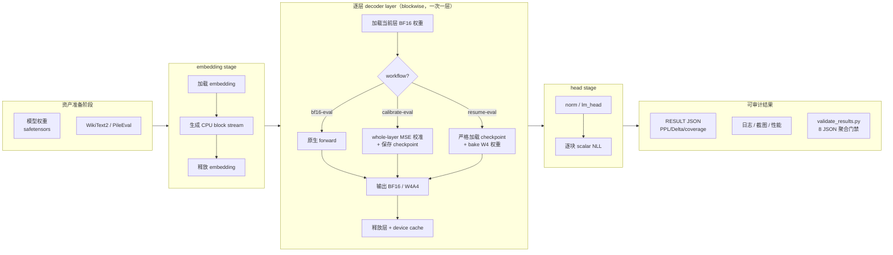
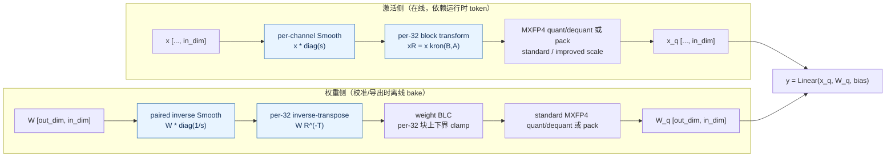
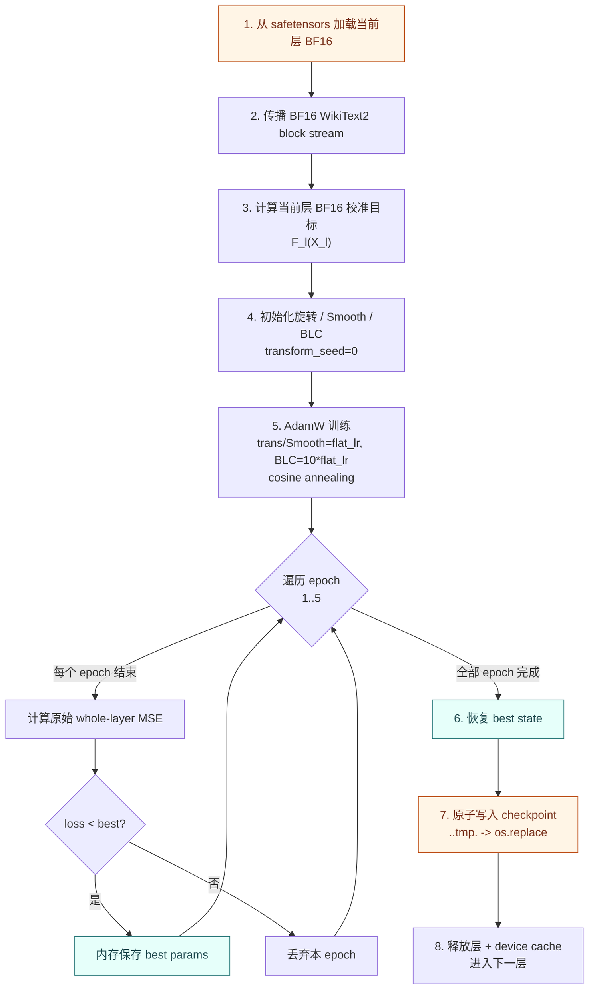
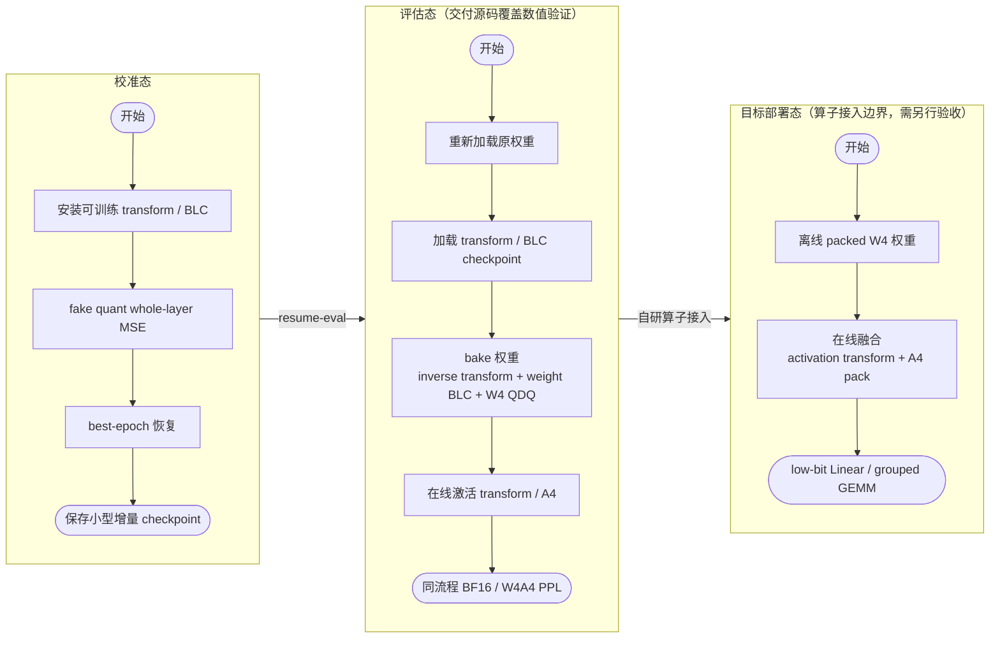
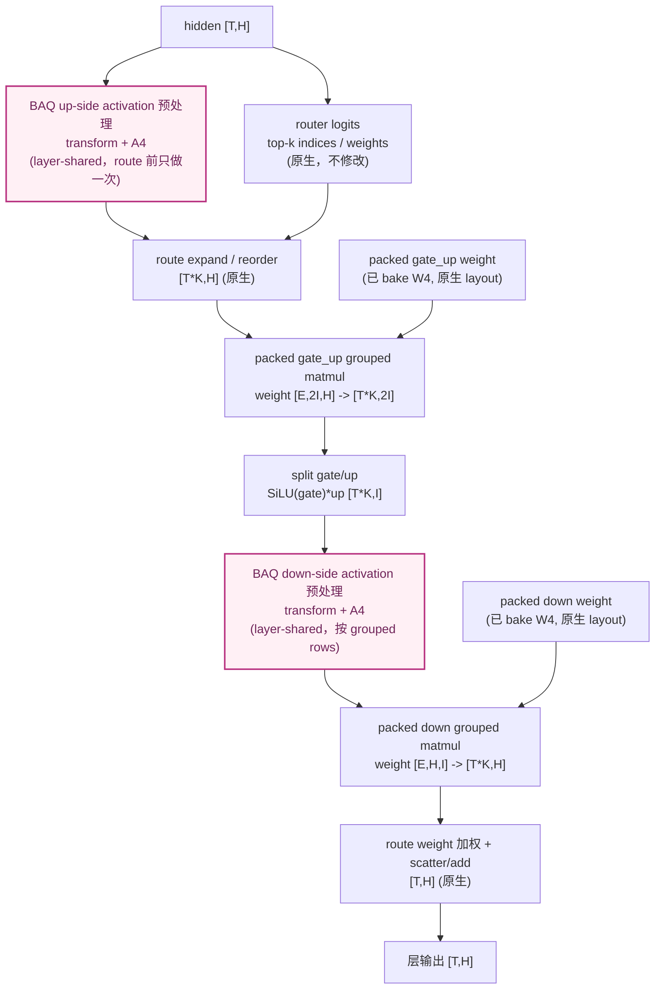
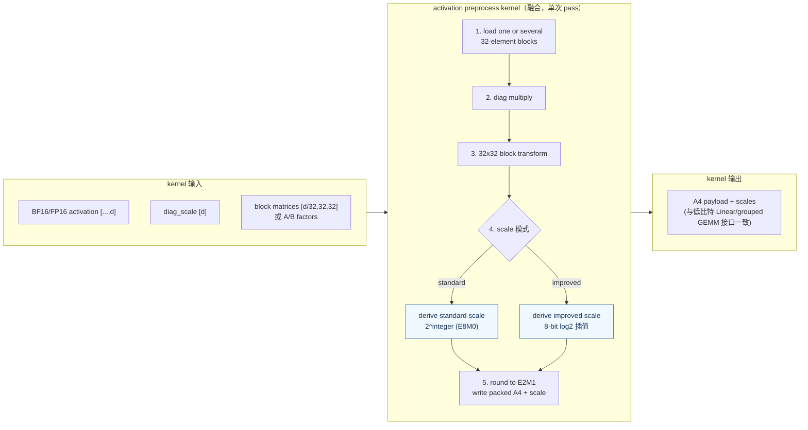
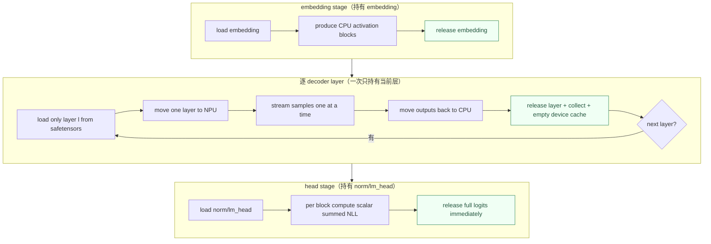

# 【社区任务】BAQ / BAQ-MoE 低比特量化算法开发设计文档

> 文档属性：算法方案与部署设计，不替代自验证报告  
> 算法：BAQ（Block-Aligned Quantization）  
> 目标格式：MXFP4 W4A4  
> 测试模型：Qwen3-8B、Qwen3.6-35B-A3B  
> 测试数据集：WikiText2 raw test  
> 验收门槛：相对同流程 BF16 的 PPL 劣化不超过 0.4，量化 Linear 占比不低于 70%

任务书中的 hifloat8 指标（Delta PPL 不超过 0.1、Linear 占比不低于 80%）适用于 hifloat8 算法，不是本设计的输出格式。BAQ/BAQ-MoE 输出 MXFP4 W4A4，按任务书 mxfp4/int4 档验收：相对 BF16 的 Delta PPL 不超过 0.4，量化 Linear 占比不低于 70%。

需求来源：[低比特量化算法开发任务书](https://gitcode.com/cann/cann-ops-competitions/blob/master/04_tasks/01_community-task-2026/docs/202607/low_bit_quantilization_task.md)。本设计的 W4A4 数值内核在需要时复用 AMCT 的 `QuantDequantMx(bits=4,is_act=True)` 等既有 quant/dequant op（见 3.4.1 节），不重复实现标准 MXFP4 语义。AMCT CLI 已支持 FlatQuant、LWC、LAC、OmniQuant 等可学习算法；BAQ 保留独立端到端入口的主要原因不是 CLI 缺少逐层学习能力，而是现有 blockwise workflow 在 decoder layer 内继续按 `quant_target` 拆成独立 `PtqUnit`，没有把完整 decoder layer 作为单一训练对象。BAQ 需要以完整层输出为 target，联合训练 attention 与 MLP/MoE 中共享和配对的参数；仅把 BAQ 原语注册到 `amct_pytorch/algorithms` 无法保持该 whole-layer MSE 语义。

完整迁移还涉及标准在线链路 `Smooth -> 32x32 block transform -> standard MXFP4 A4`（不含 activation clip）、逐层原子 checkpoint 与严格 resume、32 GiB 容器上限下的 blockwise BF16/W4A4 评估，以及 packed MoE/mixed attention 结构适配。这些属于 CLI、数据流、solver、模型 adapter 和 checkpoint 的联合扩展面，详细边界见 2.1.1 节。评估流程的工程参考可见 [AMCT OFMR 示例](https://gitcode.com/cann/amct/tree/master/examples/algorithms/ofmr)，但 OFMR 面向权重量化，其评估编排与 BAQ 的 W4A4 blockwise 路径不同，本设计仅参考其示例组织方式，不复用其代码。

Improved activation scale 的直接参考来源是论文 **DuQuant++: Fine-grained Rotation Enhances Microscaling FP4 Quantization** 的[官方源码仓库](https://github.com/Hsu1023/DuQuant-v2)，对应 [`quantize/fp4_ops.py`](https://github.com/Hsu1023/DuQuant-v2/blob/main/quantize/fp4_ops.py) 中的 `cast_to_eBm0_improved` 和 `cast_to_fp4`。本设计将在第 3.4.2、5.4 节逐项说明源码映射、BAQ 适配和算子边界。

## 一、需求背景

### 1.1 任务目标

本任务在 AMCT PyTorch experimental 体系内新增 Dense BAQ 与 BAQ-MoE，完成：

1. 可按 README 独立安装环境、下载模型和数据；
2. 支持从零校准后评估，以及从已保存 checkpoint 直接恢复评估；
3. 同一条 blockwise 评估路径输出 BF16 PPL、W4A4 PPL、Delta PPL；
4. 输出可审计的物理 `torch.nn.Linear` 数量、packed expert 等价 Linear 数量及计算公式；
5. 在服务器分配给运行容器的内存上限（32 GiB）下串行完成 Qwen3-8B 和 Qwen3.6-35B-A3B 验证；
6. 代码组织、命名、README 和测试边界与 `amct_pytorch/experimental` 现有算法一致。

任务设计文档、自验证报告、原始日志和截图位于独立验收仓，不进入算法源码包。

### 1.2 设计范围与非目标

本设计的核心交付是“可校准、可恢复、可审计的 W4A4 数值算法与模型结构适配”。算法需要解决的是低比特量化前的数据分布整形，以及 Dense/MoE 在同一套实现上的一致性。以下内容属于本设计范围：

- 权重和激活的 MXFP4 fake-quant 数值语义；
- 与 32 元素量化块对齐的 Smooth、可逆块变换和可学习 weight 裁剪；
- Dense Linear、Qwen3.6 mixed attention、shared expert 和 packed routed experts 的包装；
- 逐 decoder layer 校准、原子 checkpoint 和断点恢复；
- 在线激活变换与自研低比特算子的融合边界；
- BF16/W4A4 使用同一 blockwise 模型执行路径的设计。

以下物理部署功能不在交付源码范围内，文档只给出接口边界：

- 将 fake-quant BF16 tensor 导出为物理 4-bit packed 模型；
- 直接复用某个既有 NPU MXFP4 kernel；
- 真实低比特 grouped GEMM 的吞吐、峰值 HBM 和端到端时延结论；
- 把 Improved 激活格式描述成 OCP E8M0 标准格式。

因此，“自研算子时部署差异局部且可控”是结构分析，不等同于“无需实现算子”或“已经兼容现有算子”。

### 1.3 MXFP4 与量化难点

标准 MXFP4 使用 32 个 E2M1 元素共享一个 E8M0 指数。对块 `x_b`：

```text
e_b = clamp(round_log2(max(abs(x_b))) - 2, -127, ...)
s_b = 2 ** e_b
q_b = round_E2M1(x_b / s_b)
x_hat_b = q_b * s_b
```

块内单个激活 outlier 会控制共享 scale，使其余元素量化步长变粗。BAQ 因此把旋转和平滑对齐到相同的 32 元素边界，直接优化产生 MXFP4 scale 的局部分布；权重再使用块级可学习裁剪。标准交付配置不对在线激活执行裁剪，仍保留完整的 activation MXFP4 量化。

E2M1 可表示的非负值为 `{0, 0.5, 1, 1.5, 2, 3, 4, 6}`。若第 `b` 个 32 元素块的最大绝对值为 `m_b`，standard 模式选择 2 的整数次幂 scale，使 `m_b / s_b` 落入 E2M1 动态范围。量化误差可分成两部分：

```text
总误差 = 裁剪误差 + 网格舍入误差
```

不裁剪时，outlier 抬高 `s_b`，使块内大多数正常值落入更粗的 E2M1 间隔；裁剪过强时，虽然 scale 下降，却会增加尾部截断误差。BAQ 校准的目标就是通过分布变换和可学习上下界，在这两类误差之间找到 whole-layer output MSE 更小的平衡。

### 1.4 为什么是“块对齐”而不是跨块旋转

全维旋转可以降低整个向量的最大值，但 MXFP4 scale 是每 32 个连续元素独立计算。跨块旋转可能把一个块的 outlier 搬到另一个块，而不是降低每个实际量化块的局部最大值。BAQ 采用 block-diagonal 结构，保证：

1. 第 `i` 个输出量化块只依赖第 `i` 个输入块；
2. 每个旋转块和一个 MXFP4 scale block 一一对应；
3. 不需要跨块 gather/scatter，便于后续在激活量化预处理算子中融合；
4. 变换参数量与 hidden size 线性增长，而不是二次增长。

FlatQuant 的可逆变换、Smooth 和 learnable clipping 为本设计提供了基础思路；BAQ 的关键选择是把变换粒度下放到 32 元素量化块，并让 Dense 与 packed MoE 共享同一个量化核心。

### 1.5 BAQ 相对现有方案的设计点

- 块对齐变换：旋转只在同一个 32 元素量化块内进行，不跨块搬移 outlier；
- 可逆配对：激活使用正向变换，权重使用逆转置，未量化时保持 Linear 数学等价；
- 块级可学习裁剪：权重学习每 32 元素块的上下界；实现也保留可选 activation BLC，但标准交付关闭该在线裁剪；
- Dense/MoE 共核：MXFP4、旋转、裁剪、校准和 checkpoint 只在 BAQ 中实现一次；
- packed MoE 扩展：BAQ-MoE 仅保留 packed expert 包装与原生运行时，不复制通用算法代码；
- blockwise 执行：一次只加载一个 decoder layer，避免 35B 模型整体加载超过本任务所用服务器分配给运行容器的内存上限（32 GiB）。

### 1.6 设计原则

- **数学等价优先**：未量化时，插入的激活/权重变换必须保持原 Linear 输出等价；
- **显式失败**：非 32 对齐、缺层、错模型、错配置和错 tensor keys 均抛出错误，不静默退化；
- **单一实现源**：BAQ-MoE 只扩展 packed expert，不复制 quantizer、变换、校准或 checkpoint；
- **部署语义可分解**：权重侧尽量离线 bake，激活侧保留可融合的在线预处理；
- **评估协议独立**：PPL、BF16 baseline 和覆盖率策略属于示例层，不污染算法模块；
- **结论可审计**：standard、improved、物理 Linear、packed 等价 Linear 和参数比例分别报告。

## 二、模块与边界设计

### 2.1 目录职责

| 路径 | 职责 |
|---|---|
| `amct_pytorch/experimental/baq/` | Dense/MoE 共用 MXFP4、变换、裁剪、校准、checkpoint |
| `amct_pytorch/experimental/baq_moe/` | packed expert、shared activation、原生 packed runtime |
| `examples/algorithms/baq/` | 环境/资产说明、BF16/W4A4 PPL、覆盖率、三类工作流、结果校验 |
| `tests/unit_test/experimental/baq/` | BAQ 与 BAQ-MoE 共用定向测试 |
| 验收仓根目录 | 任务书文档、自验证报告、日志、截图和最终证据 |

BF16 baseline、WikiText2 PPL 和覆盖率验收策略不写入具体算法包。这样 BAQ/BAQ-MoE 与其他 experimental 算法保持“算法实现”和“示例验证”分离，也避免两个算法各自维护不同的评估实现。

#### 2.1.1 与现有 CLI 的训练粒度边界

AMCT 现有 CLI 已支持 FlatQuant、LWC、LAC 等可学习量化算法，不能概括为只支持静态权重量化。其 `LlmPtqWorkflow` 采用 blockwise 调度：按 decoder layer index 依次处理模型，但在一个 layer 内继续拆分为 attention Linear、MLP、MoE 等独立 `PtqUnit`；一次 workflow 选择一个 `quant_target`，为当前 unit 生成 BF16 target，并把 `unit.module` 交给 `BlockwiseSolver` 优化。这是“按层调度的 unit-level 学习”。

BAQ 的训练目标不同。第 `l` 个 decoder layer 的原始输出记为 `F_l(X_l)`，BAQ 包装后的输出记为 `Q_l(X_l; theta_l)`；`theta_l` 同时覆盖 attention、MLP 或 MoE 内相互配对的 Smooth、block transform、weight BLC 和量化参数，损失直接比较完整 decoder layer 的输出。若只把 BAQ 注册到 `amct_pytorch/algorithms` 并沿用单个 `PtqUnit` 接口，attention 与 MLP/MoE 会被拆开，无法保留 whole-layer target 和跨投影共享参数的联合优化语义。

因此 BAQ 放在 `experimental` 并提供端到端入口，原因不是 CLI 缺少可学习算法，而是 CLI 尚未提供“以完整 decoder layer 为一个训练单元”的数据捕获、联合参数管理、solver 调用和 checkpoint 合同。若移入通用 `algorithms`，需要先为 CLI 增加 decoder-layer `PtqUnit`（或等价复合 unit），并同步扩展数据流、模型 adapter、联合 solver 与逐层 checkpoint；仅新增算法注册项不足以完成语义等价迁移。

### 2.2 BAQ 与 BAQ-MoE 复用关系

```text
amct_pytorch.experimental.baq
  calibration.py
  config.py
  modeling.py
  linear.py
  quantizer.py
  transforms.py
  utils.py

amct_pytorch.experimental.baq_moe
  packed_experts.py
  runtime.py
  shared_packed_experts.py
          |
          +-- import BAQ quantizer / transform / calibration / config
```

BAQ-MoE 不再拥有独立 quantizer、训练器、数据加载器或 PPL runner。两个算法使用同一套参数名、checkpoint 元数据和数值模式。

### 2.3 组件调用关系

```text
examples/algorithms/baq/run_qwen3*.py
  -> official Qwen blockwise pipeline adapter
  -> BAQ common calibration/checkpoint
  -> Dense wrapper OR BAQ-MoE packed wrapper
  -> one-layer-at-a-time BF16/W4A4 forward
  -> common WikiText2 head evaluation and coverage JSON
```

算法包不反向依赖示例目录。`baq_moe` 只依赖 `baq`，`baq` 不依赖 `baq_moe`，从依赖方向上避免循环和双份实现。

#### 2.3.1 端到端流水线总览

下图给出从模型/数据资产到最终可审计结果的完整流程。三类工作流共享 embedding、layer 顺序、norm、lm_head 与交叉熵实现，仅在 decoder layer 内部切换 original/BAQ wrapper。



### 2.4 层内总体数据流

对一个 `Linear(in_dim -> out_dim)`，输入 `x` 的末维为 `in_dim`，权重 `W` 形状为 `[out_dim, in_dim]`：

```text
激活侧（在线）
x [..., in_dim]
  -> per-channel Smooth
  -> per-32 block transform
  -> activation MXFP4 quant/dequant or pack
  -> x_q [..., in_dim]

权重侧（校准/导出时离线）
W [out_dim, in_dim]
  -> paired inverse Smooth
  -> per-32 inverse-transpose transform
  -> weight BLC
  -> standard MXFP4 quant/dequant or pack
  -> W_q [out_dim, in_dim]

输出
y = Linear(x_q, W_q, bias)
```

注意：Smooth 和旋转不是额外改变模型函数的自由操作，它们必须成对作用在激活与权重上。weight BLC 与量化会引入近似误差，校准优化的是完整 layer output 的近似误差。实现保留可选 activation BLC，但标准交付配置关闭该在线 clamp。

下图把激活侧（在线）与权重侧（离线/校准时 bake）的成对变换画在一起，强调二者共用 32 元素量化块边界，未量化时 `x_t W_t^T = x W^T` 保持数学等价。



### 2.5 外部依赖与硬件边界

| 组件 | 用途 | 约束 |
|---|---|---|
| PyTorch / torch_npu | tensor、autograd、NPU 执行 | 版本与 CANN 匹配 |
| CANN Toolkit / Ops | Ascend runtime 和算子 | 正式模型评估需要 |
| transformers | Qwen tokenizer/config/module 语义 | 使用本地模型资产 |
| safetensors | blockwise 权重读取和 header fingerprint | 不整体加载模型 |
| pandas + fastparquet | 本地 WikiText2 parquet | 无网络 fallback |
| huggingface_hub + zstandard | 资产下载/流式解压 | 只用于准备阶段 |

正式模型目标为 Atlas A5/Ascend 950 系列 NPU 环境。MXFP4 数值、变换和 checkpoint 的小型单元测试可以在 CPU 执行；这不能替代目标 NPU 的完整模型和算子验证。

### 2.6 核心配置接口

| 配置 | 默认/正式值 | 含义 |
|---|---|---|
| `a_bits`, `w_bits` | 4, 4 | W4A4 |
| `a_dim`, `b_dim` | 8, 4 | `a_dim*b_dim=32` 的 Kronecker block |
| `a_mode` | `invertible` | UDV 中 D 可学习；可选 orthogonal |
| `ortho_method` | `qr` | 正交因子投影方法 |
| `add_diag` | true | 启用 Smooth `diag_scale` |
| `blc` | true | 启用 weight block clipping 总开关 |
| `activation_blc` | false（standard 交付） | 关闭在线 activation clip；不关闭 activation MXFP4 |
| `diag_alpha` | 0.3 | Smooth 初始化权衡 |
| `mxfp_mode` | `standard` | 可显式选择 `improved` activation |
| `train_blocks` | false | 默认固定 per-block B 因子，只训共享部分 |
| `use_o_quant` | Dense false / MoE true | o/out projection 策略 |
| `use_down_quant` | Dense false / MoE true | down projection 策略 |
| `packed_shared_activation` | MoE 正式路径 true | layer-shared activation BAQ |
| `epochs` | Dense standard 8；其余 5 | 每层 whole-layer MSE epochs |
| `cali_bsz` | 1 | 校准 stream batch |
| `flat_lr` | Dense standard `3e-3`；其余 `5e-3` | transform/Smooth 学习率 |

checkpoint metadata 保存实际 config，resume 时不依赖表中默认值猜测；命令参数必须与 checkpoint 一致。

## 三、算法详细设计

### 3.1 块对齐 Kronecker 变换

对输入维度 `d`，要求 `d % 32 == 0`。设 `n=d/32`：

```text
R = block_diag(R_0, ..., R_(n-1))
R_i = kron(B_i, A)
A in R^(8x8), B_i in R^(4x4)
```

`A` 在所有 32 元素块间共享，`B_i` 描述每块差异。实现把输入 reshape 为 `[..., n, 32]`，批量应用 `n` 个 32x32 矩阵，不物化 `d x d` 全矩阵。

完整 32x32 自由矩阵每块参数多且容易过拟合；Kronecker 分解同时保留块内表达能力和可控校准成本。遇到不满足 32 整除的维度时显式报错，不静默降级。

#### 3.1.1 Kronecker 结构选择

若直接为每个 32 元素块学习一个完整可逆 32x32 矩阵，单块 UDV 参数量为：

```text
2 * 32^2 + 32 = 2080
```

hidden size 为 4096 时共有 128 个块，仅一个变换就需要约 26.6 万参数。BAQ 将单块分解为 `R_i=kron(B_i,A)`：`A` 为所有 block 共享的 8x8 因子，`B_i` 为每个 block 独立的 4x4 因子，`8*4=32`。参数量变为：

```text
A:   2 * 8^2 + 8 = 136
B_i: 2 * 4^2 + 4 = 36 / block
diag_scale: d
total(d) = 136 + (d/32)*36 + d
```

以 `d=4096` 为例，参数量为 `136+128*36+4096=8840`。与完整 block 参数化相比，它保留每块差异，又通过共享 `A` 约束自由度，降低校准成本。

#### 3.1.2 向量化实现

实现不调用 `torch.block_diag` 生成 `d*d` 稠密矩阵。`BlockDiagKronTransMatrix` 先批量生成：

```text
A_m = A.matrix(inv_t)                     # [8, 8]
B_m = Bs.matrices(inv_t)                  # [n, 4, 4]
R_m = kron(B_m, A_m)                      # [n, 32, 32]
x   = reshape(x, [..., n, 32])
y   = batched_matmul(x, R_m)              # [..., n, 32]
```

`R_m` 的 eval 值可缓存为 buffer；模型迁移 device 时 buffer 随 module 一起迁移。训练阶段可以选择只训练共享 `A`、`diag_scale` 和 weight BLC，固定每块 `B_i`，也可以通过 `--train-blocks` 训练全部 block 因子。

代码中的 `Bs` 是全部 per-block `B_i` 变换因子的容器，不是 batch size、bias 或单独的裁剪参数。对 `n=d/32` 个块，它保存 `n` 组 4x4 UDV 参数，并通过 `Bs.matrices(inv_t)` 一次生成 `[n,4,4]` 矩阵。`train_blocks=false` 时这些 `B_i` 仍参与前向变换但冻结梯度；`train_blocks=true` 时其 U/D/V 参数与共享 `A` 一起接受 whole-layer MSE 更新。

#### 3.1.3 变换方向约定

代码统一按最后一维右乘矩阵：激活使用 `xR`，权重行向量使用 `WR^(-T)`。`inv_t=True` 始终表示生成逆转置方向，而不是先物化矩阵后调用通用 inverse。这个约定由 `BaqLinear.apply_trans()`、attention/MLP wrapper 和 packed expert wrapper 共同使用。

### 3.2 可逆参数化与 Linear 等价

每个矩阵因子参数化为：

```text
R = U diag(D) V^T
R^(-T) = U diag(1 / D) V^T
```

`U`、`V` 通过 FP32 QR 投影得到，`D` 在 invertible 模式可学习，在 orthogonal 模式固定为 1。对 `y=xW^T`：

```text
x_t = xR
W_t = WR^(-T)
x_t W_t^T = xR (WR^(-T))^T = xW^T
```

因此变换在量化前不改变 BF16 映射，只改变权重和激活分布。评估时缓存投影矩阵，避免重复 QR。

#### 3.2.1 UDV^T 的逆转置闭式形式

若 `U`、`V` 正交且 `D_i` 非零：

```text
R      = U diag(D) V^T
R^-1   = V diag(1/D) U^T
R^-T   = U diag(1/D) V^T
```

因此正向和逆转置复用同一组 `U/V`，只把 `D` 替换为 `1/D`。Kronecker 还满足：

```text
kron(B, A)^(-T) = kron(B^(-T), A^(-T))
```

实现无需对 32x32 block 调用 `torch.linalg.inv`，避免训练中接近奇异矩阵时 inverse 梯度不稳定。

#### 3.2.2 QR 与 Cayley 两种正交化

- `qr`：自由矩阵每次前向做 FP32 QR，使用 `Q*sign(diag(R))` 固定符号；它是默认路径；
- `cayley`：由反对称矩阵构造 Cayley retraction，需要 `linalg.solve`；作为可选实现保留。

QR 固定使用 FP32，因为 CPU/NPU 对 BF16 QR 的支持并不一致；最终 32x32 block 在 matmul 前转换到输入计算 dtype。eval 模式缓存投影后的矩阵，推理不重复 QR/Cayley。

#### 3.2.3 Smooth 的配对等价

设逐通道正值向量为 `s`。激活先做 `x_s=x*diag(s)`，则权重输入维需要做 `W_s=W*diag(1/s)`。再叠加旋转：

```text
x_t = x diag(s) R
W_t = W diag(1/s) R^(-T)
x_t W_t^T = x W^T
```

代码把 `diag_scale` 作为变换对象的一部分：正向乘 `s`，`inv_t` 权重方向除以 `s`。它的初始化确实需要校准样本先通过当前 decoder layer：激活通道最大值来自捕获的校准 activation，权重通道最大值直接由当前层原始权重计算，二者按 `diag_alpha` 合成初值；随后 `diag_scale` 参与 whole-layer MSE 训练。旋转矩阵不同：`A` 和各 `B_i` 由 `transform_seed` 确定的随机矩阵经 QR 初始化，不使用校准数据做初始化，校准数据只通过 MSE 梯度更新允许训练的旋转参数。

### 3.3 Smooth 与块级可学习 weight 裁剪

可选逐通道 `diag_scale` 在旋转前平滑激活，并由权重侧配对吸收。标准交付配置只对权重维护每 32 输入元素块的上下界参数：

```text
lower_i = sigmoid(alpha_min_i) * min(x_i)
upper_i = sigmoid(alpha_max_i) * max(x_i)
x_clip_i = clamp(x_i, lower_i, upper_i)
```

初始 alpha 为 4，使训练开始时接近原始范围。权重裁剪顺序固定为“inverse Smooth/transform -> weight BLC -> W4”。激活链路为“Smooth/transform -> A4”，不执行 activation clamp。

#### 3.3.1 参数粒度与广播

对 `in_features=d` 的 `BaqLinear`，标准交付配置维护 `d/32` 个 weight lower alpha 和 `d/32` 个 weight upper alpha：

```text
alpha_w_min, alpha_w_max: [d/32]
```

权重张量 `[out_dim,d]` 的同一输入 block 在所有输出行共享一对 weight alpha。这一粒度直接控制每个 MXFP4 weight block 的最大值，又避免为每个元素学习阈值。实现保留 `activation_blc=true` 的可选配置，此时才额外创建同粒度的 `alpha_a_min/alpha_a_max`；两个首选 standard checkpoint 均为 `activation_blc=false`，checkpoint 中不存在 activation alpha。

#### 3.3.2 非对称裁剪与梯度

权重正负尾部分布通常不对称，因此 lower/upper 独立。`sigmoid(alpha)` 把比例约束到 `(0,1)`；只有落在裁剪区间之外的权重元素会通过 clamp 边界向 alpha 提供有效梯度。量化整体使用 STE，使 loss 对旋转、Smooth 和 weight BLC 的梯度不会被离散 E2M1 round 截断。

#### 3.3.3 为什么先变换后裁剪

旋转会改变块内极值和正负尾部，若权重先裁剪再做 inverse transform，变换后仍可能重新产生大值。BAQ 对权重固定执行：

```text
inverse Smooth -> inverse-transpose block transform -> weight BLC
-> scale calculation -> E2M1
```

激活侧在线只执行配对的正向 Smooth、block transform 和 MXFP4。关闭 activation BLC 后，算子无需读取 activation alpha、计算裁剪上下界或执行 clamp，但激活仍被量化为 A4。

### 3.4 数值模式

| 模式 | 权重量化 | 激活量化 | 定位 |
|---|---|---|---|
| `standard` | 标准 E8M0+E2M1 | 标准 E8M0+E2M1 | NPU MXFP4 兼容性验收 |
| `improved` | 标准 MXFP4 | DuQuant++ 借鉴的 8-bit（0..255）log2 插值 scale | 精度增强，不宣称现有 E8M0 算子原生支持 |

两个模式均把全零块 scale 设为恒等值后再除法，避免 Ascend flush-to-zero 下产生 `0/0` 和 NaN。fake-quant 使用整体 STE 传递梯度。

standard 是主交付模式：Qwen3-8B Dense standard 的 Delta 为 `0.279159`，覆盖率为 `71.4286%`；Qwen3.6-35B-A3B MoE standard Delta 为 `0.184089`，NPU-deployable 等价覆盖率为 `70.0161%`。两者均关闭 activation BLC、保留 standard A4 并满足验收。Improved 作为可选 scale 编码能力保留，Dense Delta 为 `0.374754`，MoE Delta 为 `0.204334`。

#### 3.4.1 Standard scale

standard 对每个 32 block 计算最大绝对值，并将 scale 限制为 2 的整数次幂。E2M1 的阈值使用显式比较实现，避免某些 NPU 图融合对 `log2/pow` 的 routed batch shape 产生不一致行为。激活正式路径也可调用 AMCT 的 `QuantDequantMx(bits=4,is_act=True)` 保持标准数值语义。

#### 3.4.2 Improved scale

Improved 保持 32 元素 block 和 E2M1 数据值不变，只改变激活 scale 的表达。该规则明确借鉴 DuQuant++ 官方源码 `quantize/fp4_ops.py::cast_to_eBm0_improved`：先得到每块基础 scale `r_b=max(abs(x_b))/6`，再把当前 scale 集合的 log2 区间分成 255 个间隔，以 `t_b in [0,255]` 表示最多 256 个码点：

```text
l_min = min_b(log2(max(r_b, tiny)))
l_max = max_b(log2(max(r_b, tiny)))
t_b   = floor(255 * (log2(max(r_b,tiny))-l_min) / max(l_max-l_min, eps))
s_b   = 2 ** (l_min + (l_max-l_min) * t_b / 255)
```

之后仍执行 `E2M1(x_b/s_b)*s_b`。它比纯整数 exponent 的 standard scale 更细，但 `s_b` 不一定是单独的 2 的整数次幂，因此不属于标准 E8M0。权重始终使用 standard MXFP4，Improved 只作用于激活。

源码映射和 BAQ 适配如下：

| DuQuant++ 官方实现 | BAQ 实现 | 关系 |
|---|---|---|
| `cast_to_eBm0_improved` | `baq.quantizer.cast_to_eBm0_improved` | 保留 255 个 log2 间隔/256 级 scale 重构核心规则 |
| `cast_to_fp4` | `baq.quantizer.cast_to_fp4` | 保留 E2M1 `{0,.5,1,1.5,2,3,4,6}` 阈值网格 |
| group size 32 | group size 32 | 与 MXFP4 block 对齐 |
| 通用 PyTorch fake quant | BAQ activation fake quant | 增加全零/常量范围、NPU dtype/device 和 STE 保护 |

借鉴范围只包含 Improved activation scale/E2M1 fake-quant 规则。BAQ 的 block-diagonal Kronecker transform、UDV 参数化、Smooth/BLC、whole-layer MSE 校准、best-epoch 恢复、portable checkpoint、Dense/MoE wrapper 和 packed runtime 是本项目自己的结构，不应把 BAQ 整体描述成 DuQuant++ 的直接复制。

#### 3.4.3 全零与常量 scale 集合

全零 block 的 scale 被替换为 1，保证输出仍为全零且不会出现 `0/0`。当全部基础 scale 相同时，`l_max-l_min` 通过 epsilon 保护，8-bit 插值退化为同一 scale。CPU 测试覆盖 standard/improved 的全零输出和 STE 梯度有限性。

### 3.5 逐层校准

正式配置使用 PileEval 64 个文档、`calib_seed=42`、`transform_seed=0`、每文档最多 512 token，并拼成完整 512-token 校准块。加载器只保存打乱后的 JSONL 文件偏移，不在内存中解析并保留 1.4 GiB 全数据。数据抽样与变换初始化使用两个独立 RNG：改变数据 seed 不会隐式改变旋转初始化，重复执行相同配置也不会受到前序模型加载或随机调用次数影响。

每个 decoder layer 顺序执行：

1. 从 safetensors 加载当前 BF16 层；
2. 传播 BF16 WikiText2 block stream；
3. 计算当前层 BF16 校准目标；
4. 初始化旋转、Smooth 和 BLC；
5. 使用 whole-layer output MSE 训练可配置 epochs；正式 Dense standard 为 8 epochs，其余主结果为 5 epochs；
6. 原子写入该层 checkpoint；
7. 释放层对象与 device cache，再处理下一层。

优化器为 AdamW；旋转/Smooth 使用 `flat_lr`，BLC 使用 `10 * flat_lr`；调度器为 cosine annealing。每个 epoch 结束后比较原始 whole-layer MSE，并在内存中保存截至该 epoch 最低 loss 对应的可训练参数；全部 epoch 完成后恢复 best state，再原子写入 checkpoint。这样保存的 checkpoint 对应观测到的最优 epoch，而不是机械使用最后一个 epoch，避免后期震荡导致结果退化。

下图把单个 decoder layer 的校准流程展开，强调 best-epoch 恢复和原子写入检查点。



#### 3.5.1 校准目标

第 `l` 个 decoder layer 的原始输出为 `F_l(X_l)`，包装后的量化输出为 `Q_l(X_l;theta_l)`。逐层目标为：

```text
L_l(theta_l) = MSE(Q_l(X_l;theta_l), F_l(X_l))
```

训练反向使用 `L/L.detach()` 归一化梯度量级，但日志记录原始 MSE。每层校准完成后，下一层的 calibration input 使用当前层原始 BF16 target，而不是把量化误差逐层传入训练 target；正式 W4A4 评估则真实传播量化输出。

#### 3.5.2 可训练参数组

校准开始时先冻结全部原模型参数，再按名称收集：

- `alpha_*`：BLC 参数，学习率 `10*flat_lr`；
- `*trans*`：旋转和 Smooth 参数，学习率 `flat_lr`；
- `Bs`：仅在 `train_blocks=True` 时参与训练。

原始 Linear 权重不通过 optimizer 更新；权重的量化值由可学习变换/BLC 决定。调度器按实际 batch steps 计算 `T_max=epochs*ceil(samples/cali_bsz)`。

#### 3.5.3 数据选择与内存

PileEval 选择顺序由 `calib_seed` 固定。实现先扫描非空 JSONL 行的文件 offset，打乱 offset，再逐条 seek/解析直到获得 64 个满足 token 长度限制的文档。它保持确定性，同时避免把全部 JSON record 和 text 常驻 host memory。选中 token 串联后只保留完整 512-token blocks，并把选中/丢弃 token 数和 token SHA256 写入 checkpoint metadata。`transform_seed` 单独记录在 BAQ config 中；resume 时配置不一致会明确拒绝。

### 3.6 checkpoint 合同

每层 checkpoint 文件包含：

- layer index；
- portable 模型 artifact fingerprint（配置/索引内容、权重文件名/大小与 safetensors header，不含路径和 mtime）；
- 模型结构、BAQ 配置（包括独立 `transform_seed`）和 dtype；
- PileEval 统计与 token SHA256；
- 当前层 alpha/transform 参数。

文件先写临时路径，再通过 `os.replace` 原子替换。resume 要求所有层存在、tensor keys 严格匹配；fingerprint 同时覆盖模型结构、BAQ 配置和数据，三者必须全部一致。fingerprint 只依赖配置/索引/header 内容，不含文件路径和 mtime，因此跨机器可复现，可用于严格跨机一致性校验。

#### 3.6.1 原子保存与完整性

每层先写 `.<name>.tmp.<pid>`，成功后 `os.replace` 到 `layer_NNN.pt`。`resume-eval` 在加载模型前检查期望层数；每层加载再比较 `layer_index`、metadata 和完整 state key 集合。缺 key、多 key、错层、错配置都停止执行。

### 3.7 关键类与职责

| 类/函数 | 输入/输出 | 设计职责 |
|---|---|---|
| `BaqConfig` | 配置字段 | Dense/MoE 共用 bit、变换、BLC、训练参数 |
| `MxFP4Quantizer` | tensor -> fake-quant tensor | standard weight；standard/improved activation |
| `BlockDiagKronTransMatrix` | `[...,d] -> [...,d]` | per-32 online transform 与 inverse-transpose |
| `SVDSingleTransMatrix` | 小维度 tensor | attention head/cache 结构的小矩阵配对变换 |
| `BaqLinear` | Linear + config | weight BLC、可选 activation BLC、W4A4、离线 bake |
| `BaqAttention` / mixed attention wrappers | decoder attention | 保留原 attention/cache 语义，替换投影 |
| `BaqMLP` | dense/shared MLP | 共享 gate/up transform 与 down transform |
| `BaqPackedExperts` | packed experts | per-expert activation state 与 packed 权重 view |
| `BaqSharedPackedExperts` | packed experts | layer-shared activation state、per-expert weight BLC |
| `calibrate_or_resume_layer` | layer stream | 严格恢复或 whole-layer MSE 校准 |
| `export_layer_for_packed_eval` | wrapped layer | bake 权重并恢复 packed runtime |

### 3.8 校准态、评估态与部署态

```text
校准态:
  原权重 + trainable transform/BLC + fake quant
  -> whole-layer MSE
  -> 保存小型增量 checkpoint

评估态:
  重新加载原权重
  -> 加载 transform/BLC checkpoint
  -> inverse transform + weight BLC + W4 QDQ 一次性 bake
  -> activation transform/A4 在线

目标部署态:
  离线保存已变换/裁剪/量化的 packed W4 权重
  -> 在线融合 activation transform + A4 pack
  -> low-bit Linear/grouped GEMM
```

交付源码覆盖前两态的数值验证。第三态是算子接入边界，不能用 fake-quant 权重文件大小替代。

下图为三态转换的状态视图：校准态产出的小型增量 checkpoint 是评估态与目标部署态的共同输入。




## 四、模型适配

### 4.1 Qwen3-8B Dense

36 个 decoder layers 中包装 q/k/v/o 和 gate/up/down。正式精度配置量化 q/k/v、gate/up，o/down 保持 BF16。

```text
每层目标 Linear = q + k + v + o + gate + up + down = 7
每层量化 Linear = q + k + v + gate + up = 5
全模型目标       = 36 * 7 = 252
全模型量化       = 36 * 5 = 180
物理 Linear 占比 = 180 / 252 = 71.4286%
```

`lm_head`、embedding、norm 和 BAQ transform helper 不进入分母。

#### 4.1.1 Attention 适配

Qwen3 Dense attention 的 q/k/v 共享 `ln_trans`，避免对同一个 hidden input 重复学习三套大变换。q/k/v 分别保留独立 weight BLC，共享 activation transform/A4；标准交付不执行 activation BLC。若启用 cache transform 或 o transform，小维度 head 结构使用 `SVDSingleTransMatrix` 保持 Q/K/V/O 的配对关系。original mode 直接调用原 projection，用于产生 BF16 校准 target。

```text
hidden [B,S,H]
  -> RMSNorm
  -> shared ln Smooth/block transform
  -> q_proj A4/W4
  -> k_proj A4/W4
  -> v_proj A4/W4
  -> rotary + attention
  -> o_proj (正式 Dense 配置保持 BF16)
```

#### 4.1.2 MLP 适配

gate/up 使用相同 input 和 `up_gate_trans`，down 使用 `down_trans`：

```text
x [B,S,H]
  -> shared up/gate online transform
  -> gate_proj + up_proj
  -> SiLU(gate) * up
  -> down online transform
  -> down_proj
```

正式 Dense 覆盖率配置保持 down BF16，是显式精度/覆盖率选择，不是 shape 不支持。训练与评估读取同一个 config，避免校准时量化、评估时跳过的语义漂移。

### 4.2 Qwen3.6-35B-A3B MoE

目标模型包含 40 个 decoder layers，其中 30 个 linear-attention layer、10 个 full-attention layer、每层 256 个 routed experts、top-8 路由。mixed attention wrapper 保留官方 cache/attention 语义，只替换投影 Linear；router 与 shared-expert gate 保持 BF16。

packed expert 的 `gate_up_proj` 和 `down_proj` 是三维 Parameter，不拆成 256 个拥有权重副本的 Python Linear。BAQ-MoE 支持：

- per-expert activation state；
- layer-shared activation transform/A4，weight BLC 仍按 expert 独立；标准交付不执行 activation BLC。

正式保守策略先校准 40 层，再选择前 28 个完整 packed expert layers 量化。选择发生在校准之后，避免后 12 层在训练阶段提前切回 BF16。

#### 4.2.1 Packed 权重形状

每个 decoder layer 的 routed experts 保留模型原始 packed parameter：

```text
gate_up_proj: [E, 2I, H]
down_proj:    [E, H, I]
E=256, H=2048, I=512
```

gate/up 在物理上合并存储，但覆盖率按每个 expert 的 gate、up、down 三个逻辑 Linear 计数。per-expert wrapper 使用不拥有参数的轻量 weight view，保证同一 packed Parameter 在 module tree 中只注册一次，不复制 `E` 份权重。

#### 4.2.2 原生路由数据流

设当前层输入为 `[T,H]`，top-k 为 `K=8`：

```text
hidden [T,H]
  -> router logits / top-k indices and weights
  -> up-side activation transform/A4
  -> route expand/reorder [T*K,H]
  -> packed gate_up grouped matmul
       weight [E,2I,H]
       output [T*K,2I]
  -> split gate/up, SiLU(gate)*up [T*K,I]
  -> down-side activation transform/A4
  -> packed down grouped matmul
       weight [E,H,I]
       output [T*K,H]
  -> route weight + scatter/add [T,H]
```

路由 indices、route weights、group list 和最终 scatter/add 不由 BAQ 改写。BAQ 只作用在进入 packed GEMM 前的激活和 packed weight 上，因此量化逻辑与路由正确性解耦。

下图把 BAQ（shared activation 路径）与原生 packed MoE 路由的位置关系画清。粗框是 BAQ 接管的部分，其余维持原生语义。



#### 4.2.3 Shared 与 per-expert 激活参数

| 方案 | up/down activation transform | weight BLC | 优点 | 代价 |
|---|---|---|---|---|
| per-expert | 每 expert 独立 | 每 expert 独立 | 表达能力高 | route 后需按 expert 应用不同预处理，参数/调度更复杂 |
| layer-shared | 每 layer 一套 up、一套 down | 每 expert 独立 | 变换可在 route 前或 routed batch 上统一执行，适合融合 | 激活参数自由度较低 |

shared 并不把 expert weight clipping 合并：每个 expert 的权重分布不同，weight BLC 仍独立。标准交付共享的是 activation transform/A4，因为同一 layer 的 routed expert 接收同一个 hidden 特征空间。

#### 4.2.4 Mixed attention

Qwen3.6 同时包含 30 个 GatedDeltaNet linear-attention layer 和 10 个 full-attention layer。`build_baq_attention()` 根据原 module 结构选择 wrapper：

- full attention：q/k/v/o 投影；
- linear attention：`in_proj_qkv`、`in_proj_z`、`in_proj_a`、`in_proj_b`、`out_proj`；
- cache、mask、rotary 或 recurrent state 继续使用原模型语义。

`in_proj_a/b` 的输出维为 32，不满足当前 standard NPU 64 对齐规则，因此在 NPU-deployable 保守分子中排除；它们仍是物理 BAQ Linear，并进入普通 W4A4 数值覆盖率。

#### 4.2.5 校准与选层解耦

校准阶段所有 40 个 packed expert layers 均保持 W4A4 训练语义并写入参数。评估/部署阶段再按完整 layer 选择：前 28 层的 256 experts 全部启用 W4A4，后 12 层全部恢复 BF16。这样做的原因是：

1. checkpoint 保存的是所有层的候选量化参数；
2. 选层不改变某一已选层内部的校准语义；
3. 可以在不重新校准的情况下比较不同 prefix layer 数；
4. shared wrapper 只接受 whole-layer selection，避免一个 layer 内混合 expert 造成 grouped GEMM 分裂。

checkpoint metadata 记录校准时配置；`resume-eval` 的选层是评估策略。缺失 checkpoint 层仍然会被拒绝，不能用“未选中”掩盖不完整校准。

### 4.3 MoE Linear 占比详细计算

物理普通 Linear 口径：

```text
direct target Linear = 350
direct quantized Linear =
  30 个 linear-attention layer * 5
  + 10 个 full-attention layer * 4
  + 40 个 shared expert * 3
  = 150 + 40 + 120
  = 310
direct physical coverage = 310 / 350 = 88.5714%
```

分母 350 的完整来源是 310 个已量化 ordinary Linear，加上每层 1 个保持 BF16 的 routing/shared gate 共 40 个。`lm_head` 不计入分母。运行时 JSON 必须打印 ordinary target 和 ordinary quantized 两条公式，避免只给百分比。

packed routed expert 是三维 Parameter，按每个 expert 的 gate/up/down 三个逻辑 Linear 单独列等价口径：

```text
packed target equivalent = 40 * 256 * 3 = 30,720
packed quantized equivalent = 28 * 256 * 3 = 21,504
all equivalent target = 350 + 30,720 = 31,070
all equivalent quantized = 310 + 21,504 = 21,814
equivalent Linear coverage = 21,814 / 31,070 = 70.2092%
```

Standard MXFP4 中有 60 个 `in_proj_a/b` 因输出维 32 不满足部署对齐条件，不计为 NPU-deployable quantized Linear：

```text
NPU-deployable direct quantized = 310 - 60 = 250
NPU-deployable equivalent coverage
  = (250 + 21,504) / 31,070
  = 21,754 / 31,070
  = 70.0161%
```

报告必须同时输出物理普通 Linear、packed 等价 Linear、NPU-deployable 等价 Linear 和权重参数覆盖率。不得把这四种分子/分母混成一个“占比”。由于任务原文写 `torch.nn.Linear`，packed 等价计数需要评审方确认；物理口径始终单独保留。

## 五、在线变换与 Improved 激活的算子部署分析

### 5.1 离线与在线操作边界

BAQ 有意把权重侧和激活侧分开：

| 操作 | 权重侧 | 激活侧 | 部署时机 |
|---|---|---|---|
| Smooth | 除以 `diag_scale` | 乘以 `diag_scale` | 权重离线，激活在线 |
| block transform | 乘 `R^(-T)` | 乘 `R` | 权重离线，激活在线 |
| BLC | weight alpha | standard 交付关闭 | 仅权重离线 |
| MXFP4 | W4 pack/QDQ | A4 pack/QDQ | 权重离线，激活在线 |

权重在 checkpoint 加载后可以一次性完成 inverse Smooth、inverse-transpose transform、weight BLC 和 W4 quantization。真正部署时应把结果直接保存为低比特 packed weight，不在每次 forward 重复计算。

激活依赖运行时 token，无法离线消除。它的在线链路为：

```text
x -> diag multiply -> 32x32 block transform -> scale -> E2M1 pack
```

这条链路是 BAQ 相比“只做动态 MXFP4 activation quant”新增的预处理，但所有操作都沿最后一维分块，输入/输出 shape 不变，不改变后续 Linear/grouped GEMM 的矩阵维度。标准交付不读取 activation alpha、不做运行时 min/max 裁剪上下界和 clamp，因此无需为现有 activation MXFP4 算子增加 clip 功能；只需要在量化前端融合对角乘和 32x32 块变换。

### 5.2 在线 block transform 的计算与存储开销

对一行长度为 `d` 的激活，每个 32 block 做一次 `1x32` 乘 `32x32`：

```text
block count = d / 32
transform MACs per row = (d/32) * 32 * 32 = 32d
Linear MACs per row = d * out_features
theoretical transform / Linear = 32 / out_features
```

典型输出维下的理论算术比例：

| `out_features` | 单次 transform / 单次 Linear MAC |
|---:|---:|
| 2048 | 1.5625% |
| 4096 | 0.78125% |
| 12288 | 0.26042% |

该比较只说明大 Linear 下额外乘加的数量级，不是端到端性能结论。小 batch/短序列时，kernel launch、矩阵参数读取、reorder 和 reduction 可能比 MAC 更显著，必须通过目标算子实测。

变换还具有两种复用：

- Dense q/k/v 共享一次 input transform，而不是三个 projection 各做一次；
- MLP gate/up 共享一次 input transform；
- shared MoE 的 up-side transform 在同一 layer 共享，避免为 256 experts 分别调度；
- down-side transform 对已按 expert 分组的 `[T*K,I]` 连续数据统一执行。

packed eval runtime 可缓存展开后的 `[d/32,32,32]` block matrix，共 `32d` 个数；`d=4096`、FP32 时约 512 KiB。通用 Dense transform 则缓存已投影的 `A/B` 因子并按 forward 生成 block view。自研算子可以选择预展开到 device 常量区，或只保存 Kronecker 因子并在 kernel 内按 tile 生成；选择取决于常量缓存、带宽和 kernel 实现。

### 5.3 在线变换的融合方式

在线操作之间没有必须落回 host 或改变 tensor layout 的边界。推荐自研一个 activation preprocess kernel：

```text
输入:
  BF16/FP16 activation [...,d]
  diag_scale [d]
  block matrices [d/32,32,32] 或 A/B factors

kernel 内:
  1. load one or several 32-element blocks
  2. apply diag multiply
  3. apply 32x32 transform
  4. derive standard/improved scale
  5. round to E2M1 and write packed A4 + scale metadata

输出:
  与低比特 Linear/grouped GEMM 约定一致的 A4 payload + scales
```

融合后无需为 Smooth、transform、quant 各发一个 kernel，也不需要写回每一步的中间 BF16 tensor。对于 standard 模式，preprocess 输出 standard MXFP4 payload 后，可以接支持相同布局的低比特 GEMM；对于自研端到端 kernel，也可以把 preprocess 和 GEMM input loader 进一步融合。

下图展示自研 activation preprocess kernel 内部把多个在线操作融合为单次 pass 的流程，避免中间 BF16 tensor 写回。



在线变换不改变：

- weight pack 的 expert/order/layout；
- GEMM 的 M/N/K 和 group list；
- MoE top-k indices、route weights；
- attention 或 MLP 的输出 shape；
- residual、norm 和后续算子接口。

因此自研算子的改动面主要在 GEMM 前端，而不是重写模型主计算图。

### 5.4 Improved activation scale 的算子实现

本节的数值目标与 DuQuant++ 官方 `cast_to_eBm0_improved` 保持一致：为 group scales 计算 `s_min/s_max`，在 log2 区间内生成 8-bit `t_b`，再解码为插值 scale。BAQ 的算子设计不是要求现有底层必须已经支持这一格式，而是说明自研/可扩展算子怎样以局部改动实现相同语义。

#### 5.4.1 与 standard 相同的部分

Improved 仍然：

- 以最后一维连续 32 元素为一个 block；
- 使用相同 E2M1 4-bit 数据网格；
- 每个 block 只需要一个共享 scale 标识；
- 输出 payload 的 block 顺序与 standard 相同；
- 权重保持 standard MXFP4；
- 后续仍是同一个 Linear/grouped GEMM 拓扑。

所以它不是重新设计一种 GEMM，而是替换 activation scale 的生成和解释规则。

低比特 GEMM 的 block dot-product 主体仍处理相同 E2M1 payload；每个结果 block 的缩放由 `s_activation * s_weight` 决定。Improved 只把 activation 侧 `s_activation` 的解码从 E8M0 `2^integer` 换成插值 scale，weight scale、乘加/累加结构和输出聚合均不变。这是自研算子改动局部的直接原因。

#### 5.4.2 与 standard 不同的部分

standard 的 scale 是 `2^integer`，可以直接编码成 E8M0 exponent。Improved 的 `s_b` 是 `[l_min,l_max]` 间 8-bit log2 插值值，不一定是 `2^integer`。当前数值实现对一次 quantizer invocation 中的 block scales 求 `l_min/l_max`；自研算子必须保持相同 scale scope，不能随意改成每 block 独立范围，否则数值不等价。

可选的物理 metadata 表达有两种：

1. 保存每 block 的 8-bit `t_b`，并为 tensor/tile 保存 `l_min`、`l_max`；GEMM input loader 解码 `exp2(l_min+(l_max-l_min)*t_b/255)`；
2. 直接保存每 block 的 FP16/BF16 decoded scale，省去 GEMM 内解码，但 scale metadata 从约 1 byte/block 增到 2 bytes/block。

第一种方案的数据 payload 和 standard 同为 4 bit，scale index 也为 8 bit/block，只多两个范围常量；第二种方案实现更直接，但 scale metadata 略增。两者都不要求改变 packed weight 或 grouped GEMM 的分组方式。

#### 5.4.3 kernel 数据流

Improved scale 至少需要：

```text
pass/tile stage 1: per-32 absmax -> base scale r_b
reduction:         min/max of log2(r_b) over the defined scope
pass/tile stage 2: quantize log2(r_b) to t_b -> E2M1 pack
```

可采用两遍 kernel、persistent kernel、tile 级范围或先写临时 scale buffer 的实现。若必须严格复现当前整次 invocation 的范围，跨 tile reduction 会带来一次同步；若定义 tile-local 变体，则必须作为新的数值模式重新校准和验证，不能沿用当前 checkpoint 结论。

Improved 相比 standard 多出的 `log2/exp2` 只作用于每 32 元素一个 scale，而不是每个激活元素，运算数量约为数据元素的 `1/32`。在自研 kernel 中可用硬件指令、近似或 256-entry decode table 实现。它的额外成本通常比主 GEMM 小，但具体延迟仍取决于 reduction scope、batch 和融合程度，必须实测。

更具体地说，若激活共有 `N` 个元素，则 group 数 `G=N/32`。Improved 的新增 scale 运算量为 `O(G)`，主 Linear/GEMM 为 `O(N*out_features)`；当 `out_features` 为 2048/4096/12288 时，scale encoder/decoder 的标量工作相对矩阵乘主体处于低阶。第一种 metadata 方案仍为每 block 一个 8-bit `t_b`，只额外共享 `l_min/l_max` 两个范围值。因而“开销很小”指算术量、metadata 和改动面的数量级小，不等于在没有真实 kernel benchmark 时宣称时延严格为零。

#### 5.4.4 与既有算子的兼容边界

- 若既有 MXFP4 算子的 scale decoder 固定为 E8M0，Improved **不能**直接无改动调用；
- 若既有算子允许传任意 per-block scale，可以复用 GEMM 主体，只替换/增加 activation preprocess；
- 若自研 fused low-bit operator，主要增加 Improved scale encoder/decoder，GEMM 累加、weight layout 和 MoE group scheduling 不变。

所以“对底层算子实际部署影响不大”的准确含义是：**在自研算子前提下，差异局限在 scale 与输入预处理，不需要重构主 GEMM/路由；它不表示必须对齐或已经对齐某个现有算子。**

### 5.5 MoE 场景的融合边界

layer-shared activation 是部署友好的主要路径：

```text
up side:
  hidden [T,H]
  -> shared BAQ preprocess
  -> route expand/reorder
  -> packed gate_up grouped GEMM

down side:
  expert intermediate [T*K,I]
  -> shared BAQ preprocess on grouped rows
  -> packed down grouped GEMM
  -> weighted scatter/add
```

up-side transform 可以在 route expand 前只对 `[T,H]` 做一次；如果 grouped GEMM 要求 route 后连续输入，也可以把 transform 与 reorder 融合，避免额外中间 tensor。down-side 输入天然已经按 routed rows 组织，可直接按最后一维 32 block 处理。

per-expert activation 需要根据 group list 为不同 expert 选择不同 transform 参数；若另行启用 activation BLC，还需选择对应的裁剪参数。它仍可在 grouped preprocess kernel 中实现，但参数索引和常量读取更复杂。它不会改变 grouped GEMM 数学形状，但调度开销大于 layer-shared，因此 shared 是更适合作为自研部署算子接口的方案。

### 5.6 部署影响汇总

| 设计项 | 直接复用固定 standard 算子 | 自研/可扩展算子 | 不受影响的部分 |
|---|---|---|---|
| online block transform | 需要前置 kernel 或融合接口 | 增加 32x32 block preprocess | GEMM M/N/K、weight layout |
| Smooth + BLC | 需要前置 kernel | 与 transform/quant 一次融合 | 模型拓扑、输出 shape |
| standard activation | 可输出标准 MXFP4 后接入 | 常规 E8M0 encoder | packed experts、group list |
| improved activation | 固定 E8M0 decoder 无法直接复用 | 替换 scale encoder/decoder | E2M1 payload、主 GEMM/路由 |
| packed MoE | 保持原 grouped matmul 接口 | preprocess 读取 group/shared 参数 | top-k、route weight、scatter |

### 5.7 数值实现与部署结论边界

当前 `MxFP4Quantizer` 输出 quantize-dequantize 后的浮点 tensor，`export_layer_for_packed_eval` 将 fake-quant 权重值 bake 回原 tensor，用来验证数值精度和执行语义。它证明 online transform/Improved 可以与模型 forward 正确组合，但不证明：

- 4-bit payload 已物理存储；
- 自研 kernel 已实现；
- HBM 降低或吞吐提升已经发生；
- Improved 可以调用固定 E8M0 硬件路径。

真实部署验收必须另行提供 pack 格式、算子接口、峰值 HBM、kernel/端到端耗时和数值对齐测试。

## 六、评估与复现设计

### 6.1 统一三类工作流

Dense 和 MoE runner 使用相同的参数名和工作流：

| `--workflow` | 行为 | 是否读取 PileEval | 是否需要 checkpoint |
|---|---|---:|---:|
| `bf16-eval` | 只计算 BF16 PPL | 否 | 否 |
| `calibrate-eval` | 从零/续层校准后计算 BF16 与 W4A4 | 是 | 是 |
| `resume-eval` | 严格加载完整 checkpoint 后计算 BF16 与 W4A4 | 否 | 是 |

三类工作流共用官方 blockwise adapter、embedding、decoder 顺序、norm、lm_head 和交叉熵实现。BF16 baseline 不走另一套 whole-model evaluator，避免 Dense/MoE 或 BF16/W4A4 协议漂移。

### 6.2 WikiText2 PPL 协议

WikiText2 raw test 使用两个换行连接全文，slow tokenizer 一次 tokenize，按 4096 token 切为不重叠完整块，尾块丢弃。每块第一个 token 不计 loss，device 上累加 scalar NLL，不在 host 保存全量 vocabulary logits。

| 模型 | total tokens | blocks | predicted tokens | dropped tokens |
|---|---:|---:|---:|---:|
| Qwen3-8B | 299078 | 73 | 298935 | 70 |
| Qwen3.6-35B-A3B | 297193 | 72 | 294840 | 2281 |

设置非零 `--eval-max-blocks` 的结果只用于烟测，必须标记 `formal=false`，不能进入精度验收。

### 6.3 机器可读结果

每次运行输出一个 `RESULT` JSON，至少包含：workflow、model type、numeric mode、formal、evaluated blocks、predicted tokens、BF16 PPL、W4A4 PPL、Delta、checkpoint/calibration provenance 和完整 coverage 字段。

`validate_results.py` 验证两模型、两模式、校准/恢复共 8 个 JSON：

- 正式 block/token 数精确匹配；
- PPL 有限；
- 同 checkpoint 的校准/恢复 PPL 差不超过 `1e-4`；
- Linear 占比不低于 70%；
- standard 的 NPU-deployable 占比不低于 70%；
- 每个模型至少一种模式 Delta PPL 不超过 0.4。

### 6.4 为什么 BF16 与 W4A4 必须共用执行路径

若 BF16 使用 whole-model Hugging Face evaluator，而 W4A4 使用 AMCT blockwise pipeline，tokenizer、attention backend、cache、尾块、dtype 或 head loss 的任何差异都会污染 Delta。统一 workflow 在同一进程中：

1. 只 tokenize 一次 WikiText2；
2. 只生成一套 embedding output/forward kwargs；
3. BF16 和 W4A4 使用相同 layer 顺序；
4. 使用同一 norm/lm_head 和 next-token CE；
5. 只在 decoder layer 内切换 original/BAQ wrapper。

这样 Delta 只反映量化路径差异。`bf16-eval` 是独立基线检查；`calibrate-eval`/`resume-eval` 仍会在自己的同流程内重新计算 BF16，避免引用外部历史值。

`calibrate-eval` 的 BF16 分支在包装当前 layer 之前，先从原始 safetensors 加载未包装 native layer，并通过与 `resume-eval` 相同的 `eval_pipeline` 传播 WikiText2 stream；完成 baseline 后再独立加载 calibration layer、安装 BAQ wrapper 并训练/恢复参数。BF16 不复用校准 target，也不依赖 wrapper 的 `quant=False` 近似旁路。这个顺序保证 fresh 与 resume 的 baseline 都是同一原生模块语义，同时 calibration target 仍保持独立，Dense 与 MoE 不再存在不同 BF16 评估方式。

### 6.5 覆盖率结果模型

结果 JSON 同时包含：

| 字段类别 | 分子/分母含义 |
|---|---|
| physical Linear | 实际 module tree 中目标 `nn.Linear` 与 W4A4 `BaqLinear` |
| packed equivalent Linear | packed Parameter 按 expert gate/up/down 逻辑展开 |
| NPU shape-eligible | 对 standard 额外检查当前 64 对齐规则 |
| parameter coverage | 量化 weight numel / text-model weight numel |
| storage estimate | 按 4.25/16 bit 理论估算，明确 fake-quant |

Improved 的 `npu_numeric_format_compatible=false`，因此 `npu_deployable_*` 正式字段为 null；仍可报告 shape-eligible 计数，用于说明如果自研 Improved decoder，模型 shape 本身是否满足同一 grouped GEMM 规划。不得把 shape-eligible 改写成“已兼容现有 NPU standard 算子”。

## 七、资源、性能与限制

### 7.1 服务器容器内存上限约束（32 GiB）

> 说明：本节中的“32 GiB”指本任务开发与验收所用的**服务器为运行容器分配的内存上限**（cgroup memory limit = 34,359,738,368 bytes = 32 GiB），**不是**硬件物理内存、NPU 显存或算法本身的硬性要求。算法设计在该容器内存约束下保证可运行性；若实际部署环境的容器/机器内存更大，相关串行与按层加载策略仍可启用，但不再是必需约束。

- 禁止 formal workflow 使用 `AutoModelForCausalLM.from_pretrained` 整体加载模型；
- safetensors 按 decoder layer 加载；
- PileEval 只保留文件偏移；
- block stream 保留在 CPU，一次只把一个样本送到 NPU；
- lm_head 后立即释放 logits，只保留 scalar NLL；
- Dense、MoE、build 和性能测试必须串行执行。

### 7.2 Blockwise 生命周期

```text
embedding stage:
  load embedding -> produce CPU activation blocks -> release embedding

for layer l:
  load only layer l from safetensors
  -> move one layer to NPU
  -> stream samples one at a time
  -> move outputs back to CPU
  -> release layer + collect + empty device cache

head stage:
  load norm/lm_head
  -> per block compute scalar summed NLL
  -> release full logits immediately
```

校准 workflow 同时持有 evaluation 和 calibration activation streams，但不持有全模型权重。MoE packed 权重在 wrapper/runtime 中只注册一次；weight bake 原位覆盖，不保留第二份完整 fake-quant 权重。

下图说明在服务器分配给运行容器的内存上限（32 GiB）下，embedding / decoder layer / head 三个阶段如何串行、一次只持有一层的权重，避免整体加载 35B 模型。



### 7.3 理论复杂度

设 token rows 为 `N`、输入维 `d`、输出维 `o`：

| 操作 | 时间复杂度 | 额外状态 |
|---|---|---|
| online block transform | `O(N*d*32)` | eval blocks `O(d*32)` 或 Kronecker factors |
| activation MXFP4 | `O(N*d)` | `O(d/32)` scale |
| Linear/GEMM | `O(N*d*o)` | W4 weight/scale |
| weight transform/bake | `O(d*o*32)` 离线一次 | 原位输出或 packed W4 |
| checkpoint | 与 alpha/transform 参数线性相关 | 不保存 BF16 原权重 |

对 packed MoE，`N` 替换为 routed rows `T*K`，但 grouped GEMM 只计算命中的 experts。shared up transform 可在 route 前使用 `T` 而不是 `T*K`，这是 shared 路径的重要部署优势。

### 7.4 特性交叉与兼容性

- **dtype**：模型主 dtype 为 BF16；QR、scale 统计和 CE 使用 FP32/FP64 累加以保证稳定；
- **attention backend**：wrapper 保留原 attention/cache API，不修改 tokenizer 或位置编码协议；
- **MoE EP**：当前 shared packed route 显式拒绝带 EP sentinel 的 group list，需要单独设计跨 rank expert ownership；
- **shape**：被 block transform 的末维必须 `%32==0`；standard NPU 计数另应用 `%64` input/output 对齐；
- **模式**：standard/improved checkpoint 配置不混用；shared/per-expert checkpoint 不直接互换；
- **重入**：weight bake 消耗原 weight，不能在同一 module 上重复 bake 或切回 original mode；需要重新从模型权重加载；
- **并发**：受本任务所用服务器分配给运行容器的内存上限（32 GiB）约束，禁止 Dense/MoE/build 并行，避免 host/NPU 资源竞争。

### 7.5 已知边界

交付实现是 fake-quant 数值验证。理论 4.25-bit 权重节省不能作为物理模型文件缩小、HBM 降低或低比特 kernel 吞吐证据。`improved` 激活格式不宣称 NPU 原生 MXFP4。报告必须把数值精度、理论存储估算和真实部署性能分开描述。

## 八、可测性与评审检查点

1. standard/improved 全零块输出与梯度有限；
2. 变换的未量化数学等价和 checkpoint round-trip；
3. checkpoint 严格加载，缺层/错配置显式失败；
4. Dense attention/MLP original mode 控制；
5. WikiText2/PileEval token 与 block 统计固定；
6. packed 权重注册一次且 parameter identity 保持；
7. whole-layer 选层、shared/per-expert 语义正确；
8. fresh calibration 与 resume 的 PPL 可复现；
9. BF16/W4A4/Delta 和四类覆盖率字段齐全；
10. Ruff、compile、experimental build/install、定向及全量测试通过；
11. 两模型、两模式、两工作流均有原始日志、JSON、截图与性能资源证据。

### 8.1 算法设计评审关注点

1. block transform 是否严格限制在实际 32 元素量化块内；
2. Smooth/旋转的权重配对方向是否为 `R^(-T)`；
3. original mode 是否完全绕过量化近似；
4. BLC 参数是否按输入 block，而不是错误按输出 channel 或单 scalar；
5. standard 与 Improved 是否只在 activation scale 语义上分叉；
6. packed routed weights 是否保持单份 Parameter 和原 group order；
7. shared activation 是否仍保留 per-expert weight BLC；
8. 选层是否在全部 40 层校准完成后应用；
9. online transform/Improved 的部署结论是否明确区分现有算子和自研算子；
10. fake-quant 是否被错误宣传为真实 pack/HBM/性能结果。
11. Improved 是否明确引用 DuQuant++ 官方 `cast_to_eBm0_improved`，并区分借鉴的 scale 规则与 BAQ 自有设计；
12. 是否明确说明 Dense/MoE standard 均已达到精度与覆盖率门槛。

### 8.2 代码定位附录

| 设计内容 | 代码位置 |
|---|---|
| 配置 | `amct_pytorch/experimental/baq/config.py` |
| standard/improved fake quant | `.../baq/quantizer.py` |
| block transform / UDV | `.../baq/transforms.py` |
| Linear BLC / bake | `.../baq/linear.py` |
| attention / dense/shared MLP | `.../baq/modeling.py` |
| 校准 / checkpoint | `amct_pytorch/experimental/baq/calibration.py` |
| per-expert packed wrapper | `.../baq_moe/packed_experts.py` |
| layer-shared packed wrapper | `.../baq_moe/shared_packed_experts.py` |
| packed evaluation runtime | `.../baq_moe/runtime.py` |
| Dense/MoE unified workflow | `examples/algorithms/baq/workflow.py` |
| PPL / coverage | `examples/algorithms/baq/evaluation.py` |
| aggregate gate | `examples/algorithms/baq/validate_results.py` |
