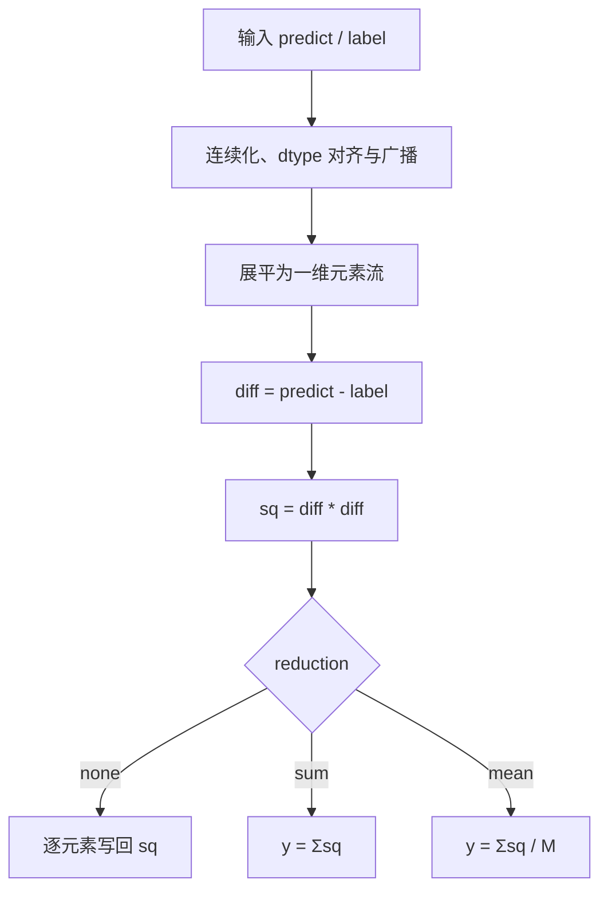
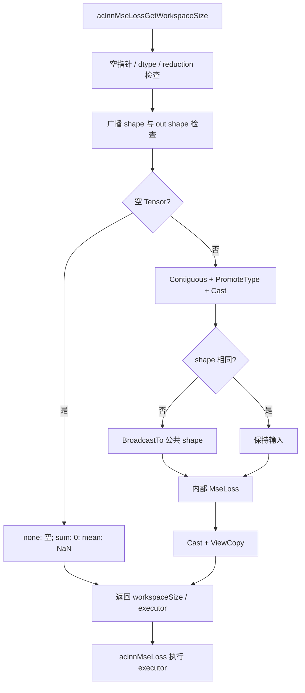
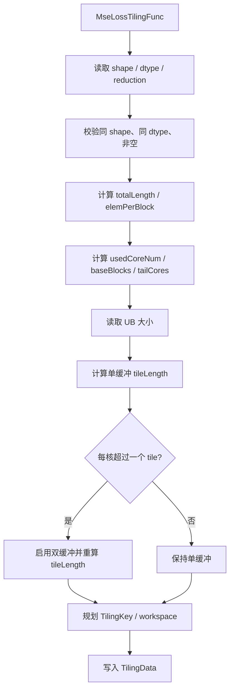
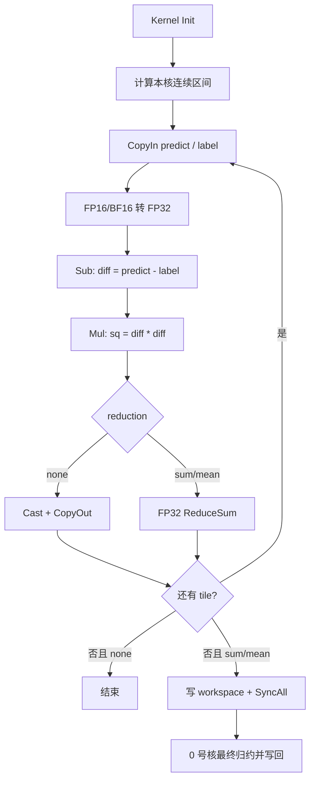

# **需求背景**

## **需求来源**

基于 CANN 内置 `MseLoss` 算子及上层 `aclnnMseLoss` 接口的历史 TBE 能力，使用 Ascend C 编程语言完成 Atlas A2 训练系列产品和 Atlas A3 系列产品上的算子改造。设计目标是在保持原有接口、数据类型、数据格式、广播和 `reduction` 语义一致的前提下，补齐可开源的 host、kernel、ACLNN 调用及测试能力，并使所有核参与计算场景下的性能不低于原 TBE 实现的 95%。

任务书：[`MseLoss_task_doc.md`](https://gitcode.com/cann/cann-ops-competitions/blob/master/04_tasks/01_community-task-2026/docs/202607/MseLoss_task_doc.md)

目标开源目录：[`ops-nn/experimental/loss`](https://gitcode.com/cann/ops-nn/tree/master/experimental/loss)

接口及现有实现参考：

- [`aclnnMseLoss`](https://gitcode.com/cann/ops-nn/blob/master/loss/mse_loss/docs/aclnnMseLoss.md)
- [`loss/mse_loss`](https://gitcode.com/cann/ops-nn/tree/master/loss/mse_loss)
- [`loss/mse_loss_v2`](https://gitcode.com/cann/ops-nn/tree/master/loss/mse_loss_v2)
- [`aclnn_mse_loss.cpp`](https://gitcode.com/cann/ops-nn/blob/master/loss/mse_loss/op_api/aclnn_mse_loss.cpp)

TBE kernel 参考路径：`${ASCEND_INSTALL_PATH}/opp/built-in/op_impl/ai_core/tbe/impl/dynamic`

算子原型参考路径：`${ASCEND_INSTALL_PATH}/opp/built-in/op_proto/inc`

算子信息库参考路径：`${ASCEND_INSTALL_PATH}/opp/built-in/op_impl/ai_core/tbe/config/ascend910b`

TBE DSL API 参考路径：`${ASCEND_INSTALL_PATH}/python/site-packages/tbe/dsl`

## **TBE 源码分析**

`MseLoss`（Mean Squared Error Loss）计算预测值和目标值的逐元素平方差，并根据 `reduction` 决定输出逐元素结果、平方差之和或平方差均值。内部算子接收已经完成 dtype 对齐、连续化和广播处理的同 shape Tensor；ACLNN 侧负责支持混合 dtype、非连续 Tensor 和广播输入。

### **1. 算子原型**

内部算子包含两个必选输入、一个输出和一个属性。

```cpp
REG_OP(MseLoss)
    .INPUT(predict, TensorType({DT_FLOAT16, DT_FLOAT, DT_BF16}))
    .INPUT(label, TensorType({DT_FLOAT16, DT_FLOAT, DT_BF16}))
    .OUTPUT(y, TensorType({DT_FLOAT16, DT_FLOAT, DT_BF16}))
    .ATTR(reduction, String, "mean")
    .OP_END_FACTORY_REG(MseLoss)
```

参数语义：

| **名称** | **类别** | **说明** |
| -------- | -------- | -------- |
| predict | 输入 | 预测值 Tensor。 |
| label | 输入 | 目标值 Tensor；内部算子中 dtype 和 shape 与 `predict` 一致。 |
| reduction | 属性 | `none` / `mean` / `sum`，默认 `mean`。 |
| y | 输出 | MSE 损失；`none` 时与输入同 shape，`mean` / `sum` 时为标量。 |

对应 ACLNN 两段式接口：

```cpp
aclnnStatus aclnnMseLossGetWorkspaceSize(
    const aclTensor* self,
    const aclTensor* target,
    int64_t reduction,
    aclTensor* out,
    uint64_t* workspaceSize,
    aclOpExecutor** executor);

aclnnStatus aclnnMseLoss(
    void* workspace,
    uint64_t workspaceSize,
    aclOpExecutor* executor,
    aclrtStream stream);
```

ACLNN 中 `reduction` 的数值映射为：

| **数值** | **字符串** | **含义** |
| -------- | ---------- | -------- |
| 0 | none | 不归约。 |
| 1 | mean | 求均值。 |
| 2 | sum | 求和。 |

### **2. 数学公式**

设完成 dtype 提升和广播后的输入为 `x`、`t`，元素总数为 `M`：

```text
diff[i] = x[i] - t[i]
sq[i]   = diff[i] * diff[i]
```

不同 `reduction` 的输出为：

```text
reduction == none:
    y[i] = sq[i]

reduction == sum:
    y = sum(sq[i])

reduction == mean:
    y = sum(sq[i]) / M
```

平方差始终为非负有限值或 IEEE 特殊值；当输入包含 NaN 时对应输出传播 NaN，当差值或平方运算溢出时输出 Inf。

### **3. 数据类型**

内部算子支持：

| **参数** | **支持 dtype** | **说明** |
| -------- | -------------- | -------- |
| predict | float16 / float32 / bfloat16 | 预测值。 |
| label | float16 / float32 / bfloat16 | dtype 与 `predict` 一致。 |
| y | float16 / float32 / bfloat16 | dtype 跟随 `predict`。 |

ACLNN 接口允许 `self` 和 `target` 在支持范围内进行 dtype 推导。第一段接口先通过 `PromoteType` 得到公共 dtype，再分别 Cast 后调用内部 MseLoss；最终结果转换为用户 `out` dtype。

kernel 计算策略：

- float32 直接完成减法、平方和归约。
- float16 / bfloat16 搬入 UB 后提升到 float32，完成减法、平方和归约。
- `none` 模式在写回前转换为原 dtype。
- `sum` / `mean` 的跨核 partial 始终使用 float32 workspace。

### **4. 数据格式**

内部算子和 ACLNN 文档约定使用 ND 格式，不依赖具体维度语义。ACLNN 支持非连续 ND Tensor，执行前转换为连续 Tensor；FRACTAL_NZ 不作为本设计的直接支持格式，接口检测到该格式时提示潜在精度风险。

| **参数** | **format** | **说明** |
| -------- | ---------- | -------- |
| predict | ND | kernel 展平为一维元素流。 |
| label | ND | 与 predict 同 shape。 |
| y | ND | `none` 时同 shape，归约时为标量。 |

### **5. Shape 与广播约束**

内部 MseLoss：

| **约束项** | **规则** |
| ---------- | -------- |
| predict / label | shape 完全一致。 |
| rank | 动态 shape；kernel 不依赖 rank，只使用元素总数。 |
| y | `none` 时与输入一致，`mean` / `sum` 时为标量。 |
| 广播 | 内部 kernel 不直接广播。 |

ACLNN：

| **约束项** | **规则** |
| ---------- | -------- |
| self / target rank | 支持 1～8 维。 |
| shape | 两个输入必须满足广播关系。 |
| none 输出 | shape 为广播后的 shape。 |
| mean / sum 输出 | 0 维标量。 |
| 非连续 Tensor | 支持，执行前连续化。 |

ACLNN 在 shape 不一致时计算广播结果 shape，并对需要扩展的输入调用 `BroadcastTo`，保证进入内部 MseLoss 的两个输入 shape 一致。

### **6. 空 Tensor 语义**

| **reduction** | **输出** |
| ------------- | -------- |
| none | 空 Tensor。 |
| sum | 标量 0。 |
| mean | 标量 NaN。 |

空 Tensor 在 ACLNN 侧直接构造结果，不启动 AICore kernel。

### **7. 计算语义**

TBE 计算可抽象为：

1. 将 `predict` 和 `label` 按连续一维地址搬入 UB。
2. FP16 / BF16 提升到 FP32。
3. 计算 `diff = predict - label`。
4. 计算 `sq = diff * diff`。
5. `none` 模式直接转换并写回。
6. `sum` / `mean` 对平方差进行核内和跨核归约。
7. `mean` 将最终和除以总元素数。

任务书要求“比较方式从二进制比较改为逻辑值比较”。MseLoss kernel 本身不包含相等判断或位模式比较，因此该要求主要落实在自验证：输出使用数值误差阈值比较，NaN 使用同位置等价规则，Inf 检查位置和符号，不以输出文件逐字节一致作为唯一判据。

### **TBE 计算流程**



# **需求分析**

## **外部组件依赖**

不涉及第三方组件依赖。实现依赖 CANN / Ascend C 基础组件、ACLNN 两段式接口框架、BroadcastTo、Contiguous、Cast、ViewCopy、op_host tiling 框架、`kernel_operator.h` 和多核同步能力。

## **内部适配模块**

设计包含以下模块：

- op graph：声明 `MseLoss` 原型及 `reduction` 属性。
- op host：完成 InferShape、InferDataType、参数校验、平台信息读取、分核、UB 切分、TilingKey 和 workspace 规划。
- op kernel：完成双输入搬运、FP32 提升、平方差、逐元素输出或双级归约。
- op api：实现 `aclnnMseLossGetWorkspaceSize` 与 `aclnnMseLoss`，处理广播、混合 dtype、非连续 Tensor 和空 Tensor。
- tests / docs：覆盖 dtype、广播、归约、特殊值、尾块、精度和性能验证。

## **需求模块设计**

### **内部算子原型**

| **名称** | **类别** | **dtype** | **format** | **shape** | **介绍** |
| -------- | -------- | --------- | ---------- | --------- | -------- |
| predict | 输入 | FP16 / FP32 / BF16 | ND | 任意合法 shape | 预测值。 |
| label | 输入 | 与 predict 一致 | ND | 与 predict 一致 | 目标值。 |
| y | 输出 | 与 predict 一致 | ND | 输入 shape 或标量 | MSE 损失。 |

属性：

| **属性** | **类型** | **默认值** | **说明** |
| -------- | -------- | ---------- | -------- |
| reduction | String | `mean` | `none` / `mean` / `sum`。 |

## **算子支持型号**

Atlas A2 训练系列产品 / Atlas 800I A2 推理产品（ascend910b）、Atlas A3 系列产品（ascend910_93）。

# **需求详细设计**

## **使能方式**

| **上层框架** | **涉及的框架勾选** |
| ------------ | ------------------ |
| TF训练/推理 | |
| Pytorch训练/推理 | √ |
| ATC推理 | √ |
| Aclnn直调 | √ |
| OPAT调优 | |
| SGAT子图切分 | |

## **总体设计**

MseLoss 是逐元素计算与全量归约组合算子。总体采用“ACLNN 完成广播与 dtype 对齐 + 内部按连续元素分核 + 核内 UB tile 流水 + workspace 跨核归约”的方案：

- `none`：各核独立处理连续元素区间，执行 CopyIn、Sub、Mul、CopyOut，无核间依赖。
- `sum`：每核计算 FP32 局部平方差和，写入 workspace；同步后由 0 号核完成最终归约。
- `mean`：复用 sum 路径，最终结果除以广播后元素总数。
- 小 shape 动态减少参与核数；单 tile 使用单缓冲，多 tile 使用双缓冲。
- FP16 / BF16 只在 UB 内提升到 FP32，避免额外整 Tensor Cast 和往返 GM 搬运。


## **ACLNN 侧设计**

第一段接口完成：

1. 检查 `self`、`target`、`out`、`workspaceSize`、`executor` 非空。
2. 检查输入输出 dtype 属于 FP16 / FP32 / BF16，并满足类型推导和结果转换规则。
3. 检查 `self`、`target` rank 不超过 8，且 shape 可广播。
4. 检查 `reduction` 为 0、1、2。
5. 校验 `out` shape：none 为广播 shape，mean / sum 为 0 维标量。
6. 空 Tensor 按 none 空输出、sum 0、mean NaN 处理。
7. 对两个输入执行 Contiguous。
8. 使用 PromoteType 得到公共 dtype，并按需 Cast。
9. shape 不一致时分别 BroadcastTo 到公共 shape。
10. 调用内部 MseLoss，再 Cast 和 ViewCopy 到用户输出。

性能快路径：

- 输入已经连续时跳过实际拷贝。
- dtype 相同时跳过 Cast。
- shape 相同时跳过 BroadcastTo。
- 输出 dtype 与内部结果一致且连续时减少额外转换和拷贝。

## **host 侧设计方案**

### **1. InferShape 与 InferDataType**

内部算子输入 shape 已一致：

```text
reduction == none:
    y.shape = predict.shape

reduction == mean or sum:
    y 为标量

y.dtype = predict.dtype
```

### **2. 参数校验**

| **校验项** | **处理** |
| ---------- | -------- |
| predict / label shape | 元素数和 shape 一致。 |
| dtype | 两输入一致，且为 FP16 / FP32 / BF16。 |
| reduction | `none` / `mean` / `sum`。 |
| totalLength | 进入 kernel 的非空输入必须大于 0。 |
| platform | AIV 核数、UB 大小和系统 workspace 信息有效。 |

### **3. 分核策略**

host 将输入展平为 `totalLength` 个元素，并以 32B block 为最小切分单位：

```text
elemPerBlock = 32 / sizeof(T)
totalBlocks  = ceilDiv(totalLength, elemPerBlock)
minBlocksPerCore = 128                  # 约 4KB 数据/核

usedCoreNum = min(aivCoreNum, ceilDiv(totalBlocks, minBlocksPerCore))
usedCoreNum = max(usedCoreNum, 1)

baseBlocks = totalBlocks / usedCoreNum
tailCores  = totalBlocks % usedCoreNum
```

每核负责连续 block：

```text
coreBlocks = baseBlocks + (blockIdx < tailCores ? 1 : 0)
blockStart = blockIdx * baseBlocks + min(blockIdx, tailCores)
elemStart  = blockStart * elemPerBlock
coreLength = min(coreBlocks * elemPerBlock, totalLength - elemStart)
```

大 shape 使用全部 AIV 核，小 shape 降低核数以减少调度和同步成本。`minBlocksPerCore` 需结合真实 TBE profile 调优。

### **4. UB 切分**

`none` 模式缓存：

| **缓存** | **用途** |
| -------- | -------- |
| predictQueue | predict 输入队列。 |
| labelQueue | label 输入队列。 |
| outQueue | y 输出队列。 |
| predictFloatBuf | FP16 / BF16 转 FP32 缓冲。 |
| labelFloatBuf | FP16 / BF16 转 FP32 缓冲。 |
| squareFloatBuf | 平方差结果，可与输入缓冲复用。 |

`sum` / `mean` 模式无需逐 tile 输出队列，但需要 ReduceSum 临时缓冲和每核 partial 写回缓冲。

单双缓冲：

- 若每核仅一个 tile，使用单缓冲减少 UB 占用和队列管理开销。
- 若每核至少两个 tile，使用双缓冲重叠 MTE2 与 Vector。
- `tileLength` 按 32B 和矢量 repeat 对齐向下取整。
- 尾块使用 DataCopyPad，补齐区初始化为 0，Compute 只覆盖有效元素。

### **5. TilingKey 规划**

沿用“reduction 十位 + dtype 个位”的紧凑编码：

| **TilingKey** | **reduction** | **dtype** |
| ------------- | ------------- | --------- |
| 11 | none | FP32 |
| 12 | none | FP16 |
| 13 | none | BF16 |
| 21 | sum | FP32 |
| 22 | sum | FP16 |
| 23 | sum | BF16 |
| 31 | mean | FP32 |
| 32 | mean | FP16 |
| 33 | mean | BF16 |

单双缓冲由 TilingData 的 `bufferNum` 表达，不增加二进制组合数。

### **6. TilingData 参数**

`MseLossTilingData` 规划如下：

| **字段** | **类型** | **含义** |
| -------- | -------- | -------- |
| totalLength | uint64 | 广播后的总元素数。 |
| usedCoreNum | uint32 | 实际参与计算的核数。 |
| baseBlocks | uint64 | 每核基础 block 数。 |
| tailCores | uint32 | 多处理一个 block 的前置核数。 |
| tileLength | uint64 | 每次 UB 迭代的元素数。 |
| bufferNum | uint32 | 1 单缓冲，2 双缓冲。 |
| reductionMode | uint32 | none / mean / sum。 |
| dtypeMode | uint32 | FP32 / FP16 / BF16。 |
| meanScale | float | `1.0 / totalLength`，用于 mean。 |
| workspaceOffset | uint64 | 每核 partial 区偏移。 |

### **7. Workspace 规划**

`none` 无跨核归约：

```text
userWorkspace = 0
```

`sum` / `mean` 保存每核 FP32 partial，并预留同步空间：

```text
partialBytes = 32 * usedCoreNum

workspace = systemWorkspace
          + syncWorkspace
          + partialBytes
```

每核使用独立 32B 对齐槽位，避免多个核写同一 cache line。

## **kernel 侧设计方案**

### **1. 初始化**

kernel 根据分核数据计算本核区间：

```text
coreBlocks = baseBlocks + (blockIdx < tailCores ? 1 : 0)
blockStart = blockIdx * baseBlocks + min(blockIdx, tailCores)
globalOffset = blockStart * elemPerBlock
coreLength   = min(coreBlocks * elemPerBlock, totalLength - globalOffset)
```

随后绑定两个输入 GlobalTensor、输出 GlobalTensor 和 workspace，并根据 dtype / reduction 初始化相应队列和临时缓冲。

### **2. CopyIn**

每次迭代处理：

```text
currentLength = min(tileLength, coreLength - tileOffset)
```

- predict、label 使用 DataCopy 或 DataCopyPad 搬入 UB。
- FP32 直接进入 Compute。
- FP16 / BF16 分别转换到 FP32 缓冲。
- 尾块补齐位置置 0，避免 ReduceSum 读到未初始化数据。

### **3. Compute**

核心计算：

```text
diff = predictFloat - labelFloat
sq   = diff * diff
```

FP32 路径可复用输入缓冲：

```text
Sub(labelLocal, predictLocal, labelLocal)
Mul(squareLocal, labelLocal, labelLocal)
```

FP16 / BF16 路径只在 UB 内进行 Cast，不产生中间 GM Tensor。

### **4. none 路径**

- FP32 平方差直接进入输出队列。
- FP16 / BF16 使用 `CAST_RINT` 转换为原 dtype。
- DataCopyPad 按真实 `currentLength` 写回。
- 各核只访问自己的连续区间，无原子操作、无 workspace、无核间同步。

### **5. sum 路径**

每个 tile 对 `sq` 执行 FP32 ReduceSum，得到 `tileSum`；多 tile 使用 FP32 标量或局部 Tensor 累计为 `coreSum`。

```text
coreSum += ReduceSum(sq[0:currentLength])
```

为控制大 shape 累计误差，可使用成对归约或补偿累加。每核最终将 `coreSum` 写入自己的 workspace 槽位。

### **6. mean 路径**

mean 与 sum 共用平方差和归约路径，最终仅执行一次除法：

```text
y = globalSum / totalLength
```

相比每个 tile 预乘 `1 / totalLength`，最终除法可减少多次缩放和累计舍入误差。`meanScale` 可作为乘法优化备选，由硬件 profile 决定。

### **7. 跨核归约**

1. 各核将 `coreSum` 写入 32B 对齐 workspace。
2. 执行 `SyncAll()`。
3. 0 号核搬入 `usedCoreNum` 个 FP32 partial。
4. 按固定树形顺序 ReduceSum。
5. sum 直接写回；mean 除以 `totalLength` 后写回。
6. 输出转换为 FP16 / FP32 / BF16。

固定 partial 布局和归约顺序保证结果可复现，并满足确定性验证需求。

### **8. Process 主流程**

```text
for each tile in core range:
    CopyIn(predict, label)
    CastToFloatIfNeeded()
    diff = predict - label
    sq = diff * diff

    if reduction == none:
        CastBackIfNeeded()
        CopyOut()
    else:
        coreSum += ReduceSum(sq)

if reduction != none:
    WritePartial(coreSum)
    SyncAll()
    Core0FinalReduceAndWrite()
```

## **Ascend C 流程图**

### **1. ACLNN 调用流程**



### **2. Host Tiling 流程**



### **3. Kernel 主流程**



## **支持硬件**

| **支持的芯片版本** | **涉及勾选** |
| ------------------ | ------------ |
| 香橙派 OrangePi AIpro | |
| Atlas 200I/500 A2 推理产品 | |
| Atlas A2 训练系列产品 / Atlas A3 系列产品 | √ |

## **算子约束限制**

- 内部算子支持 ND 格式，输入 shape 和 dtype 必须一致。
- 内部算子支持 FP16、FP32、BF16。
- reduction 仅支持 `none`、`mean`、`sum`。
- ACLNN 支持 1～8 维、广播、混合 dtype 和非连续 Tensor。
- none 输出 shape 为广播 shape；mean / sum 输出为 0 维标量。
- 空 Tensor：none 返回空 Tensor，sum 返回 0，mean 返回 NaN。
- none 模式不需要用户 workspace；sum / mean 使用 workspace 保存每核 partial。

# **特性交叉分析可维可测分析**

## **功能测试设计**

| **类别** | **测试点** |
| -------- | ---------- |
| 内部 dtype | FP16、FP32、BF16。 |
| ACLNN dtype | 同 dtype、FP16+FP32、BF16+FP32 等合法推导组合。 |
| reduction | none、sum、mean。 |
| rank | 1D、2D、4D、8D。 |
| shape | 单元素、32B 对齐、非对齐、小 shape、大 shape、满核、多 tile。 |
| 广播 | 相同 shape、标量维广播、前导维广播、多维双向广播。 |
| 内存 | 连续 Tensor、非连续 Tensor、尾块、空 Tensor。 |
| 数值 | 正数、负数、0、接近值、大差值。 |
| 特殊值 | NaN、+Inf、-Inf、正负 0、平方溢出。 |

Golden 参考：

```python
def mse_loss_golden(self, target, reduction):
    self_b, target_b = np.broadcast_arrays(self, target)
    square = (self_b.astype(np.float32) - target_b.astype(np.float32)) ** 2
    if reduction == "none":
        return square
    if reduction == "sum":
        return np.sum(square, dtype=np.float32)
    return np.mean(square, dtype=np.float32)
```

正式自验证使用 PyTorch `torch.nn.functional.mse_loss` 生成 ACLNN Golden，并使用内部同 shape 用例验证 kernel。

## **逻辑值比较验证**

MseLoss 不进行元素相等判断，任务书中的逻辑值比较要求体现在结果校验：

- FP16 / FP32 / BF16 使用对应 rtol / atol，不要求文件二进制一致。
- NaN 要求输出位置一致。
- Inf 要求位置和符号一致。
- `+0` 与 `-0` 按数值相等处理。
- 对 none 输出逐元素比较，对 sum / mean 比较标量误差。

## **精度标准**

| **验收标准** | **描述** | **标准来源** |
| ------------ | -------- | ------------ |
| 精度标准 | 满足 CANN Judge 对应题目的默认精度阈值。 | 任务书 / CANN Judge |
| none | 每个元素与广播后的平方差 Golden 一致。 | MseLoss 数学语义 |
| sum / mean | FP32 归约结果满足对应 dtype 阈值。 | TBE / PyTorch 语义 |
| 空 Tensor | none 为空、sum 为 0、mean 为 NaN。 | ACLNN 语义 |

精度策略：

- FP16 / BF16 统一提升到 FP32 计算。
- workspace partial 使用 FP32。
- 采用固定树形归约顺序。
- mean 最终仅执行一次除法。
- 超大 shape 必要时使用补偿求和降低累计误差。

## **性能标准**

| **验收标准** | **描述** | **标准来源** |
| ------------ | -------- | ------------ |
| 满核性能 | 所有核参与计算场景下，Ascend C 性能不低于 TBE 的 95%。 | 任务书 |
| 小 shape | 10 us 以下场景若相差不超过 3 us，可结合性能仿真图分析启动和调度开销。 | 任务书 |
| 测试一致性 | Ascend C 与 TBE 使用相同 dtype、shape、reduction、预热次数和测量次数。 | 自验证规范 |

性能优化关注点：

- none 模式的双输入读取和单输出写回带宽。
- sum / mean 的核内 ReduceSum 和一次全核同步。
- 小 shape 动态收敛核数。
- 单双缓冲切换阈值。
- FP16 / BF16 Cast 缓冲复用。
- 同 shape / 同 dtype ACLNN 快路径，避免额外 BroadcastTo 和 Cast。
- 广播场景中物化中间 Tensor 的开销；若 profile 显示占比过高，可增加 kernel 内广播寻址优化。

性能报告需分别覆盖：

1. none、sum、mean。
2. FP16、FP32、BF16。
3. 小 shape、满核 shape、超大 shape。
4. 同 shape 快路径和广播路径。
5. TBE、Ascend C 单次耗时与性能比。

## **910b3 实测验证**

验证环境：

| **项目** | **配置** |
| -------- | -------- |
| 设备 | Atlas 800T A2，910b3，device 4。 |
| CANN | 8.5.0，`squaresumv1` 环境内 CANN。 |
| 自定义 OPP | 安装到独立 `custom_opp` 目录，未覆盖环境内置 OPP。 |
| 性能输入 | FP32，shape 为 `[16777216]`，`reduction=mean`。 |
| 统计方式 | 单次进程预创建 50 个 executor，顺序提交；取第 20～39 次算子记录均值。 |

编译与精度结果：

| **用例** | **结果** | **workspace / byte** | **最大误差** |
| -------- | -------- | -------------------- | ------------ |
| FP32，none，非 32B 对齐尾块 | PASS | 0 | 0 |
| FP16，mean | PASS | 16777280 | 0 |
| FP32，sum，多核 | PASS | 16777472 | 0 |
| BF16，none，非 32B 对齐尾块 | PASS | 0 | 0 |
| FP32，mean，16777216 元素 | PASS，输出 4 | 16779776 | 0 |

设备侧完整构建成功，生成 MseLoss kernel object 和自定义 OPP 安装包。上述用例覆盖三种 dtype、三种 reduction、尾块、多核归约和大 shape。

性能结果：

| **实现** | **Task Duration / us** | **相对内置性能** |
| -------- | ---------------------- | ---------------- |
| 内置 `aclnnMseLoss` / `MSELossV2` | 35.0360 | 100% |
| 本设计，16KB reduction tile | 41.7190 | 83.98% |
| 本设计，64KB reduction tile | 35.7367 | 98.04% |

64KB tile 版本满足任务书“所有核参与计算场景下性能不低于原实现 95%”的要求。主要流水指标如下：

| **实现** | **AIV / us** | **Vector / us** | **Scalar / us** | **MTE2 / us** | **MTE3 / us** |
| -------- | ------------ | --------------- | --------------- | ------------- | ------------- |
| 内置 `MSELossV2` | 34.1411 | 25.3870 | 11.1258 | 27.9130 | 0.1382 |
| 本设计，64KB tile | 34.7135 | 24.6560 | 11.0605 | 27.2635 | 0.1452 |

将 reduction tile 从 16KB 扩大到 64KB 后，减少了大 shape 下的 tile 循环次数和标量控制开销；Scalar 从 23.8628 us 降至 11.0605 us，已与内置实现基本一致。none 路径仍使用 16KB 目标 tile，避免三队列场景下 UB 占用过大。

## **兼容性分析**

本算子为 TBE 到 Ascend C 的等价迁移。内部算子名称、输入输出、reduction 默认值和数学语义保持不变；ACLNN 继续使用 `aclnnMseLoss` 两段式接口，广播、混合 dtype、非连续 Tensor 和空 Tensor 行为保持一致。

新增 A2 / A3 Ascend C kernel 不改变上层框架调用方式。固定 workspace 归约路径满足确定性要求；关闭确定性开关时也可复用同一实现，避免维护两套数值路径。

## **风险分析**

| **风险** | **应对方案** |
| -------- | ------------ |
| FP16 / BF16 平方和误差 | UB 内提升 FP32，workspace 使用 FP32。 |
| mean 重复缩放误差 | 先求全局和，最终只除一次 totalLength。 |
| 尾块脏数据进入归约 | DataCopyPad 补 0，Compute 和 ReduceSum 使用有效长度。 |
| 多核 partial 覆盖 | 每核使用独立 32B 对齐 workspace 槽位。 |
| 小 shape 多核开销 | 根据工作量动态减少 usedCoreNum，单 tile 使用单缓冲。 |
| 广播中间 Tensor 开销 | 同 shape 快路径跳过；必要时评估 kernel 内广播融合。 |
| 空 Tensor mean 错误返回 0 | ACLNN 侧明确填充 NaN，不启动 kernel。 |
| 特殊值传播不一致 | 覆盖 NaN、Inf、正负 0 和溢出专项用例。 |
| 超大 shape 累计误差 | 固定树形归约，必要时使用补偿求和。 |

## **关联的 Issue**

暂无。

## **文档更新**

本文档。

## **类型标签**

- [ ] Bug 修复
- [ ] 新特性
- [ ] 性能优化
- [ ] 文档更新
- [x] 其他：社区任务算子设计文档
