# **需求背景**

## **需求来源**

基于 CANN TBE 内置 NllLoss 算子历史实现，使用 Ascend C 编程语言进行改造与优化，在 Atlas A2 / Atlas A3（ascend910b / ascend910_93）场景下补齐 loss 类算子的 Ascend C 能力，并提升算子在昇腾芯片上的执行效率和泛化能力。

NllLoss（Negative Log Likelihood Loss，负对数似然损失）常用于配合 `LogSoftmax` 完成多分类训练。算子根据 `target` 给出的类别索引，从 `x` 每一行中取出对应类别的预测值 `x[i, target_i]`（gather 语义），取负并乘以对应类别权重得到单样本损失，再按 `reduction` 归约输出，同时输出参与计算样本的权重之和 `total_weight`。本文先分析 TBE 历史实现的原型、支持范围与计算流程，再基于这些能力约束规划 Ascend C host、kernel 和 ACLNN 接口设计。

TBE 算子实现路径：`${ASCEND_INSTALL_PATH}/opp/built-in/op_impl/ai_core/tbe/impl`

TBE 实现依赖的 DSL API 路径：`${ASCEND_INSTALL_PATH}/python/site-packages/tbe/dsl`

## **TBE 源码分析**

通过对 NllLoss 算子 TBE 版本的功能分析，其原型、支持范围与核心计算流程如下。

### **1. 算子原型**

NllLoss 原型语义如下。该原型包含 `x`、`target` 两个必选输入和 `weight` 一个可选输入，`reduction`、`ignore_index` 为属性，输出 `y` 与 `total_weight`。

```cpp
REG_OP(NllLoss)
    .INPUT(x, TensorType({DT_FLOAT, DT_FLOAT16, DT_BF16}))
    .INPUT(target, TensorType({DT_INT32, DT_INT64}))
    .OPTIONAL_INPUT(weight, TensorType({DT_FLOAT, DT_FLOAT16, DT_BF16}))
    .OUTPUT(y, TensorType({DT_FLOAT, DT_FLOAT16, DT_BF16}))
    .OUTPUT(total_weight, TensorType({DT_FLOAT, DT_FLOAT16, DT_BF16}))
    .ATTR(reduction, String, "mean")
    .ATTR(ignore_index, Int, -100)
    .OP_END_FACTORY_REG(NllLoss)
```

原型语义：

| **名称** | **类别** | **说明** |
| -------- | -------- | -------- |
| x | 输入 | 每类别输入值（logits / log-prob），最后一维为类别数 `C`，其余维度展平为样本数 `N`。 |
| target | 输入 | 每个样本的目标类别索引，元素个数为样本数 `N`。 |
| weight | 可选输入 | 各类别权重，长度为 `C`，未提供时按 `1` 处理。 |
| reduction | 属性 | 归约方式 `none` / `mean` / `sum`，默认 `mean`。 |
| ignore_index | 属性 | 被忽略、不参与损失计算的目标类别值，默认 `-100`。 |
| y | 输出 | 损失结果。`none` 时 shape 与 `target` 一致；`sum` / `mean` 时为标量 `(1,)`。 |
| total_weight | 输出 | 参与计算样本的权重之和，shape 为 `(1,)`。 |

计算公式：

```text
for i in range(N):
    t = target[i]
    if t == ignore_index:
        loss[i] = 0
        w[i]    = 0
    else:
        w[i]    = weight[t]           # 未提供 weight 时 w[i] = 1
        loss[i] = -w[i] * x[i, t]

reduction == none : y[i] = loss[i]
reduction == sum  : y    = sum(loss)
reduction == mean : y    = sum(loss) / sum(w)
total_weight       = sum(w)
```

### **2. 支持的数据类型**

| **参数** | **支持 dtype** | **说明** |
| -------- | -------------- | -------- |
| x | float16 / float32 / bfloat16 | 每类别输入值。 |
| target | int32 / int64 | 目标类别索引。 |
| weight | float16 / float32 / bfloat16 | 可选输入，dtype 与 `x` 一致。 |
| y | float16 / float32 / bfloat16 | 输出 dtype 跟随 `x`。 |
| total_weight | float16 / float32 / bfloat16 | 输出 dtype 跟随 `x`。 |

说明：

- `x`、`weight`、`y`、`total_weight` 的 dtype 保持一致，均跟随 `x`。
- `bfloat16` 分支在不支持的硬件（如 `__CCE_AICORE__ == 200`）上不启用。

### **3. 支持的数据格式**

NllLoss 按样本行展平后进行 gather 与归约，所有输入输出均为 ND，不涉及 NC1HWC0、FRACTAL_NZ 等特殊 format。

| **场景** | **x/weight/y/total_weight format** | **target format** | **触发条件** |
| -------- | ---------------------------------- | ----------------- | ------------ |
| 普通动态 shape 路径 | ND | ND | 所有输入输出 format 均为 ND。 |

### **4. Shape 与属性约束**

| **约束项** | **规则** |
| ---------- | -------- |
| x 维度 | 至少 1-D，最后一维为类别数 `C`，其余维度展平为样本数 `N`。 |
| target 维度 | 元素个数为样本数 `N`。 |
| weight 维度 | 提供时为 1-D，长度等于 `C`。 |
| target 取值 | 落在 `[0, C)` 区间内，或等于 `ignore_index`。 |
| reduction | `none` / `mean` / `sum`，默认 `mean`。 |
| ignore_index | 整型，默认 `-100`；等于该值的样本不计入损失与权重。 |
| 是否广播 | 不涉及广播。 |

### **5. 计算语义分析**

通过对 NllLoss TBE 版本的功能分析，其计算语义可拆解为以下三步：

- **索引取值**：根据 `target` 给出的类别索引，从 `x` 每一行取出对应类别的预测值 `x[i, target_i]`（gather 语义），不涉及对输入数据的广播。
- **加权取负**：对取出的预测值取负并乘以对应类别权重得到单样本损失 `loss_i = -weight[target_i] × x[i, target_i]`；当 `target_i` 等于 `ignore_index` 时该样本不计入损失与权重。
- **归约输出**：按 `reduction` 对损失进行归约，`none` 直接输出各样本损失，`sum` 输出损失之和，`mean` 输出损失之和除以有效权重之和；同时输出 `total_weight = Σ weight[target_i]`。

### **TBE 整体计算流程图**

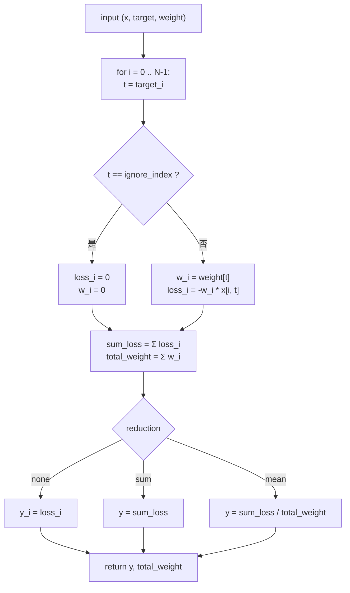

### **TBE 索引取值流程图**

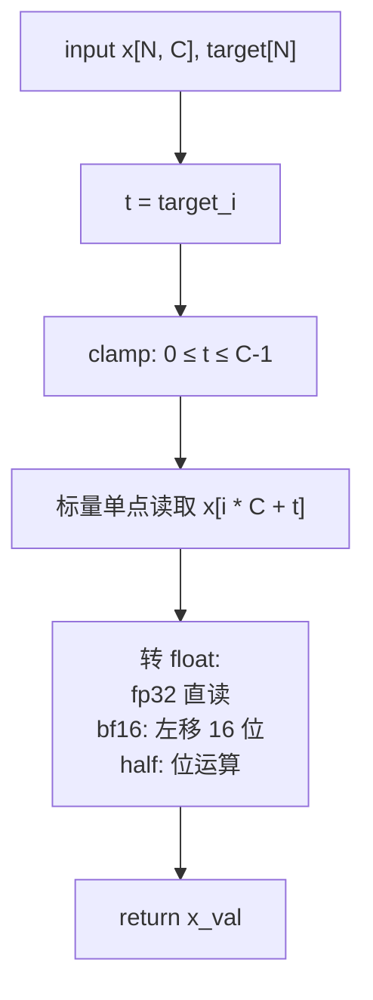

### **TBE 加权取负流程图**

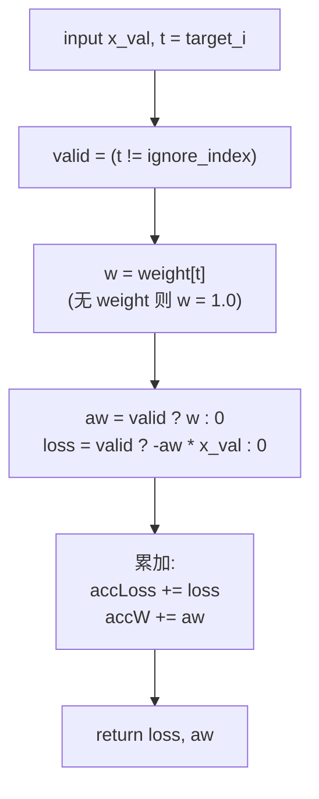

### **TBE 归约输出流程图**

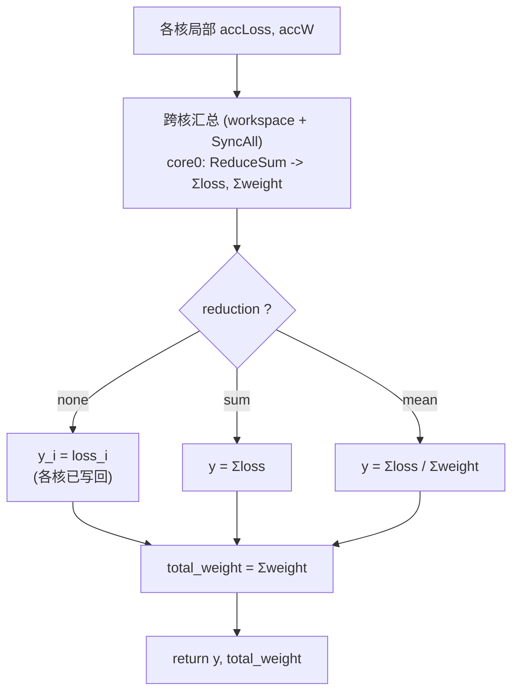

# **需求分析**

## **外部组件依赖**

不涉及额外外部组件依赖。算子实现依赖 CANN / Ascend C 基础组件、ACLNN 调用框架、op_host tiling 框架和 kernel_operator。

## **内部适配模块**

适配 ACLNN 接口调用与图模式调用，补充 NllLoss 的 Ascend C 设计。设计包含：

- op def 中声明 `x`、`target`、`weight`、`y`、`total_weight` 的 dtype、format 和输入输出关系，以及 `reduction`、`ignore_index` 属性。
- op host 中完成输出 shape 推导（InferShape）、dtype 推导（InferDataType）、tiling 校验、平台信息读取、UB 容量计算、模式选择、分核策略和 tilingkey 规划。
- op kernel 中根据 tiling 信息完成按行分块搬运、gather 取值、加权取负、`ignore_index` 掩码、样本内累加以及跨核归约。
- docs 中记录 TBE 来源、计算语义、TBE 流程和 Ascend C 设计流程。

## **需求模块设计**

### **算子原型**

| **名称** | **类别** | **dtype** | **format** | **shape** | **介绍** |
| -------- | -------- | --------- | ---------- | --------- | -------- |
| x | 输入 | float16 / float32 / bfloat16 | ND | `(N, C)` | 每类别输入值（logits / log-prob），`C` 为类别数。 |
| target | 输入 | int32 / int64 | ND | `(N,)` | 每个样本的目标类别索引。 |
| weight | 可选输入 | 与 `x` 一致 | ND | `(C,)` | 各类别权重，未提供时按 `1` 处理。 |
| y | 输出 | 与 `x` 一致 | ND | `none` 时同 `target`；`sum` / `mean` 时 `(1,)` | 损失结果。 |
| total_weight | 输出 | 与 `x` 一致 | ND | `(1,)` | 参与计算样本的权重之和。 |

**属性**：

| **属性** | **类型** | **默认值** | **说明** |
| -------- | -------- | ---------- | -------- |
| reduction | String | `mean` | 归约方式：`none` / `mean` / `sum`，host 侧映射为 `0` / `1` / `2`。 |
| ignore_index | Int | `-100` | 被忽略、不参与损失计算的目标类别值。 |

说明：

- 输出 `y`、`total_weight` 的 dtype 与 `x` 一致。
- 当前设计支持 `int32` / `int64` 作为 `target` dtype；`weight` dtype 与 `x` 一致。
- 不涉及广播。

## **算子支持型号**

Atlas A2 训练系列产品 / Atlas 800I A2 推理产品（ascend910b）、Atlas A3 系列产品（ascend910_93）。

# **需求详细设计**

## **使能方式**

| **上层框架**     | **涉及的框架勾选** |
| ---------------- | ------------------ |
| TF训练/推理      |                    |
| Pytorch训练/推理 |                    |
| ATC推理          | √                  |
| Aclnn直调        | √                  |
| OPAT调优         |                    |
| SGAT子图切分     |                    |

## **需求总体设计**

### **host侧设计方案**

NllLoss host 侧负责完成输出 shape 推导、dtype 推导、输入合法性校验、平台信息读取、tiling 计算、模式选择、分核策略和 tilingkey 规划。NllLoss 不涉及广播；host 侧从 `x` 的最后一维得到类别数 `classNum`（`C`），从 `target` 的元素个数得到样本数 `rowNum`（`N`），解析 `reduction`、`ignore_index`、是否提供 `weight`、`target` 是否为 `int64` 等信息，通过 `NllLossTilingData` 下发到 kernel 侧。

#### **1) InferShape**

NllLoss 输出 shape 由 `reduction` 与 `target` 决定：

```text
reduction == none : y.shape = target.shape
reduction != none : y.shape = (1,)
total_weight.shape = (1,)
y.dtype = total_weight.dtype = x.dtype
```

host 侧 `InferShapeNllLoss` 依据 `reduction` 判定 `y` 的 shape：`none` 时将 `target` 的 shape 赋给 `y`，否则将 `y` 置为 1-D 长度 1；`total_weight` 恒为 1-D 长度 1。`InferDataTypeNllLoss` 将 `x` dtype 赋给 `y` 和 `total_weight`。

#### **2) dtype 校验**

op def 支持范围与 tiling 校验如下：

- `x` 支持 `float16`、`float32`、`bfloat16`；不属于该集合时 tiling 返回失败。
- `target` 支持 `int32`、`int64`；不属于该集合时 tiling 返回失败。
- `weight` dtype 与 `x` 一致（可选输入）。
- `y`、`total_weight` dtype 跟随 `x`。
- `classNum`（`x` 最后一维）或 `rowNum`（`target` 元素个数）为 0 时 tiling 返回失败。

#### **3) format 和 shape 语义**

当前设计仅支持 ND 格式，所有输入输出均为 ND。

host 侧从 shape 提取规模信息：

| **约束项** | **校验 / 提取逻辑** |
| ---------- | ------------------- |
| x rank | `x` rank 必须 `>= 1`。 |
| classNum | `classNum = x.shape[-1]`，必须不为 0。 |
| rowNum | `rowNum = target` 元素个数（`GetShapeSize`），必须不为 0。 |
| weight | 存在且 `size > 0` 时 `hasWeight = 1`，长度需与 `C` 一致。 |
| target dtype | `int32` / `int64`，`int64` 时 `targetIsInt64 = 1`。 |

#### **4) 分核策略**

分核遵循优先满核、按样本行均分的原则：损失按样本行展开且各行相互独立，host 侧按样本数 `N` 对 AI Core 进行分核。

- 计算等效工作量 `workAmount = rowNum × (classNum × xElemSize + COMPUTE_EQV_BYTES)`，其中 `COMPUTE_EQV_BYTES = 512`，`xElemSize` 为 `x` 单元素字节数（float32 为 4，float16 / bfloat16 为 2）。
- `usedCoreNum = ceilDiv(workAmount, WORK_PER_CORE)`，其中 `WORK_PER_CORE = 16 × 1024`；随后上限收敛到 `aivCoreNum` 与 `rowNum`，下限为 1。
- `rowsPerCore = ceilDiv(rowNum, usedCoreNum)`，再回代 `usedCoreNum = ceilDiv(rowNum, rowsPerCore)`，保证各核处理的样本行尽量均匀。
- 若核间能均分，视作无大小核区分；若不能均分，前面的核按 `rowsPerCore` 满额处理，剩余不足一份的样本行由最后一个参与计算的核处理。
- 核数量通过平台信息 `PlatformAscendC::GetCoreNumAiv()` 获取，结合 `rowNum` 确定实际使用核数 `usedCoreNum`，并 `SetBlockDim(usedCoreNum)`。

#### **5) UB 容量计算与执行路径选择**

UB 切分遵循充分利用 UB 空间的原则，需综合考虑硬件 UB 大小、`weight` 常驻缓冲和临时数据储存：

- UB 预算 `ubBudget = 140 × 1024`；若提供 `weight`，先扣除 `weight` 常驻缓冲 `wBytes = classNum × (xElemSize + 4) + 256`（扣除后不低于 32KB）。
- 单行开销 `perRow = classNum × xElemSize + 320`，`tileRows = ubBudget / perRow`（下限 1，上限 `rowsPerCore`）。
- 每个核在其 `[rowStart, rowEnd)` 区间内按 `tileRows` 分多个 tile 循环处理，末个 tile 处理不足 `tileRows` 的剩余行。

依据每核代表行数选择向量化 / 标量执行路径：

- `repRows = (usedCoreNum <= 1) ? rowNum : rowsPerCore`。
- `useVector = (repRows >= VEC_THRESHOLD) ? 1 : 0`，其中 `VEC_THRESHOLD = 128`。
- `repRows >= 128` 时 kernel 走向量化 Gather 路径；否则走标量 4 路展开路径。

Workspace 规划：

```text
workspace = sysWs + syncAllWs + reduceWs
sysWs      = GetLibApiWorkSpaceSize()          # 系统预留
syncAllWs  = 32 * usedCoreNum                  # SyncAll 同步区
reduceWs   = 2 * 32 * usedCoreNum              # 跨核 loss / weight 归约区
```

#### **6) tilingkey 规划**

NllLoss 依据 `x` 的数据类型选择 tilingkey（`schMode`），kernel 侧据此实例化对应的计算数据类型 `T`：

| **x dtype** | **schMode** | **kernel T** |
| ----------- | ----------- | ------------ |
| float16 | `NLLLOSS_TPL_SCH_MODE_0`（0） | `half` |
| float32 | `NLLLOSS_TPL_SCH_MODE_1`（1） | `float` |
| bfloat16 | `NLLLOSS_TPL_SCH_MODE_2`（2） | `bfloat16_t` |

模板参数通过 `ASCENDC_TPL_ARGS_DECL` 声明 `schMode`（取值 `0` / `1` / `2`），host 侧 `SetTilingKey(GET_TPL_TILING_KEY(...))` 下发。

#### **7) TilingData 参数**

`NllLossTilingData` 字段如下：

| **字段** | **类型** | **含义** |
| -------- | -------- | -------- |
| rowNum | uint64 | 样本数 `N`（`target` 元素个数）。 |
| classNum | uint64 | 类别数 `C`（`x` 最后一维）。 |
| reduction | int64 | 归约方式：`0`=none，`1`=mean，`2`=sum。 |
| ignoreIndex | int64 | 被忽略的目标类别值，默认 `-100`。 |
| hasWeight | uint64 | 是否提供 `weight`（1 / 0）。 |
| targetIsInt64 | uint64 | `target` 是否为 int64（1 / 0）。 |
| usedCoreNum | uint64 | 实际参与计算的核数。 |
| rowsPerCore | uint64 | 每核负责的样本行数。 |
| tileRows | uint64 | 单次搬运处理的样本行数。 |
| useVector | uint64 | 执行路径选择：1 走向量化 Gather，0 走标量 4 路展开。 |

### **kernel侧设计方案**

Kernel 侧执行 `Init` 和 `Process` 两个阶段，`Process` 包括数据搬入（CopyIn）、计算（Compute）、搬出（CopyOut）。kernel 入口 `nll_loss<schMode>` 根据 `schMode` 实例化 `Run<half>` / `Run<float>` / `Run<bfloat16_t>`。

1. **初始化阶段（Init）**：
   - 读取 `NllLossTilingData`，计算 `coreIdx = GetBlockIdx()`、本核区间 `rowStart = coreIdx × rowsPerCore`、`rowEnd = min(rowStart + rowsPerCore, N)`、`myRows`。
   - 绑定 `x`、`target`（int32 / int64）、`weight`、`y`、`total_weight` 的 GlobalTensor；`wsGm` 从 `workspace + BLK_BYTES × usedCore`（`BLK_BYTES = 32`）偏移开始，跳过 SyncAll 同步区。
   - 计算对齐参数 `trA`、`blkA`、`cA`、`segLen`（按 `VEC_ALIGN = 64` 对齐，`BLK_ELEM = 8`）。
   - 分配各 UB buffer：`xInQue`、`tInQue`、`wInQue`、`yOutQue`、`wF32Buf`、`yF32Buf`；`useVector` 时额外分配 `rowBaseBuf`、`accLossBuf`、`accWBuf`、`tFBuf`、`idxBuf`、`offBuf`、`xGathBuf`、`gRawBuf`、`wGathBuf`、`maskBuf`；跨核归约用 `redTmpBuf`、`redOutBuf`、`partialOutQue`、`finalInQue`。

2. **weight 预加载**：
   - 若 `hasWeight`，Process 开始时一次性 `DataCopyPad` 搬入 `weight` 整段并 cast 为 `float`（float 直接 `Adds` 拷贝，half / bf16 用 `Cast`），常驻 `wF32Buf`；未提供 weight 时按 `1.0` 处理。

3. **向量化 Gather 路径（useVector = 1，RunVector / ProcessTileVector）**：
   - `rowBase = CreateVecIndex × C`，`accLoss` / `accW` 清零。
   - 按 `tileRows` 分 tile：`DataCopyPad` 搬入 `x` 若干整行与 `target`；将 `target` cast 为 float。
   - `CompareScalar` 生成 `ignore_index` 掩码（`NE`）；`Maxs` / `Mins` 将索引 clamp 到 `[0, C-1]`。
   - 计算 gather 偏移 `offI = (rowBase + idx) × sizeof(T)`，`Gather` 取出 `x[i, t]`（half / bf16 先 gather 原始 dtype 再 `Cast` 到 float）。
   - `weight` 通过 `Gather` 取 `w[t]`，否则 `Duplicate(1.0)`；`loss = -w × x`。
   - `Select` 用掩码将无效样本的 `loss` 与 `w` 置 0；`reduction != none` 时 `accLoss` / `accW` 逐元素累加。
   - `reduction == none` 时将 `loss` cast 回 `T` 并 `DataCopyPad` 写回 `yGm`。
   - tile 循环结束后对 `accLoss` / `accW` 做 `ReduceSum`，得到本核局部 `accLossVal` / `accWVal`。

4. **标量 4 路展开路径（useVector = 0，ProcessTileScalar）**：
   - `DataCopyPad` 搬入 `x` 若干整行与 `target`，合并一次 `MTE2 -> S` 同步。
   - 主循环以 4 路展开：读 `target`，判断 `valid = (t != ignore_index)`，`ClampIdx` 到 `[0, C-1]`，`ReadXVal` 以标量方式按需读取单个元素并转 float（float 直读，bf16 / half 位运算转 float），取 `weight`；`aw = valid ? w : 0`，`loss = valid ? -aw × x : 0`。
   - `reduction == none` 时 `yF.SetValue`；累加 `accLoss` / `accW`；尾部不足 4 行单独收尾。
   - `reduction == none` 时经 `S -> V` 同步后 cast 回 `T` 并 `DataCopyPad` 写回 `yGm`。

5. **跨核归约（CrossCoreReduce / FinalReduceAndWrite）**：
   - `usedCore == 1` 时直接 `WriteReduced`。
   - 多核时各核将局部 `accLoss` / `accW` 写入 `wsGm` 的独立 block（loss 段与 weight 段分别偏移 `coreIdx × BLK_ELEM`），`SyncAll` 同步。
   - `coreIdx == 0` 时执行 `FinalReduceAndWrite`：从 `wsGm` 读回全部核的 loss / weight，`ReduceSum` 得到 `totalLoss` / `totalWeight`，再 `WriteReduced`。

6. **归约写回（WriteReduced）**：
   - `total_weight` 写标量 `totalWeight`。
   - `reduction == sum(2)`：`y = totalLoss`。
   - `reduction == mean(1)`：`y = totalWeight != 0 ? totalLoss / totalWeight : 0`。
   - `reduction == none(0)`：`y` 已在各核 tile 处理中逐样本写回。
   - 标量结果按 `T` 类型写回（float 直写，half / bf16 位运算转 uint16 写回）。

7. **数据类型转换（辅助函数）**：
   - `FloatToHalfBits` / `HalfBitsToFloat`：float 与 half 的位运算互转。
   - `FloatToBf16Bits` / `Bf16BitsToFloat`：float 与 bfloat16 的位运算互转（bf16 取高 16 位）。
   - `ClampIdx`：将索引夹逼到 `[0, C-1]`；`ReadXVal`：按 `T` 读标量并转 float。

### **Ascend C 流程图**

#### **1. ACLNN 调用流程图**

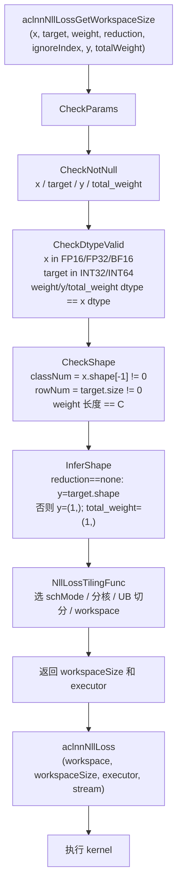

#### **2. Kernel 入口流程图**

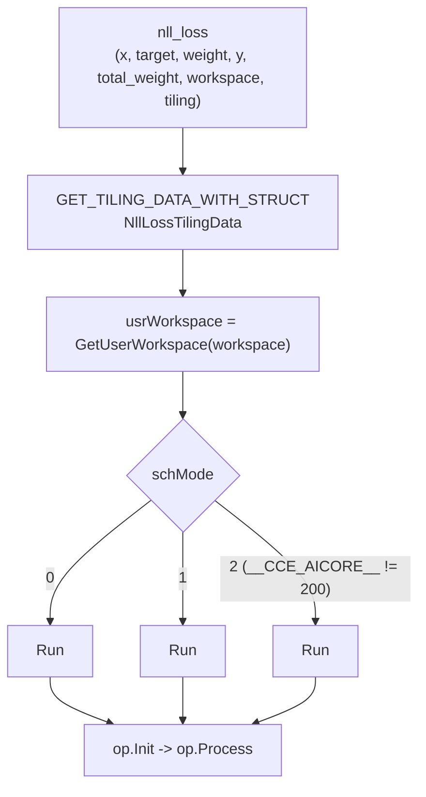

#### **3. Host Tiling 流程图**

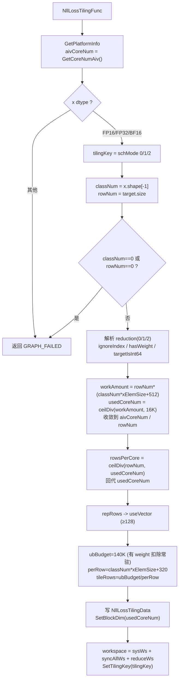

#### **4. Init 流程图**

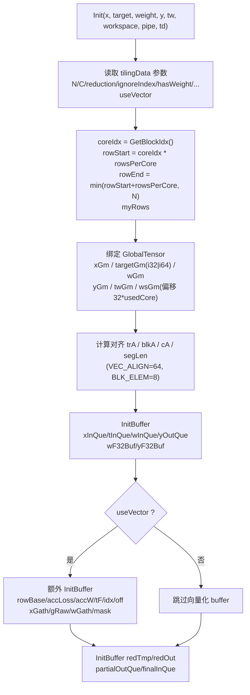

#### **5. Process 主流程图**

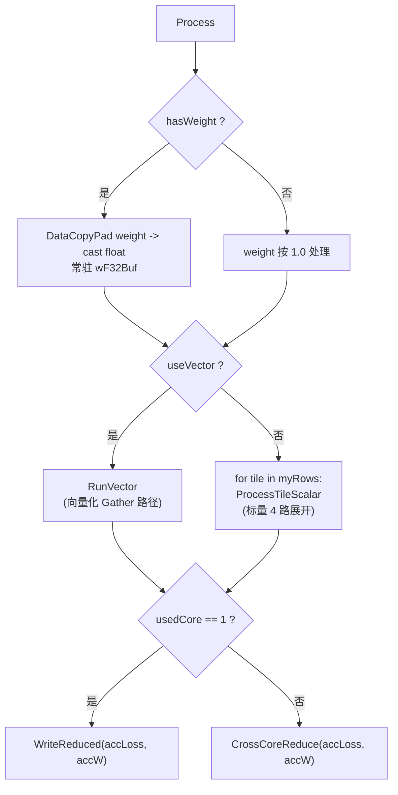

#### **6. 向量化 Tile 流程图（ProcessTileVector）**

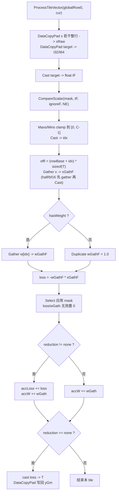

#### **7. 标量 4 路展开 Tile 流程图（ProcessTileScalar）**

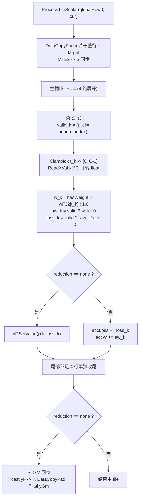

#### **8. 跨核归约流程图（CrossCoreReduce / FinalReduce）**

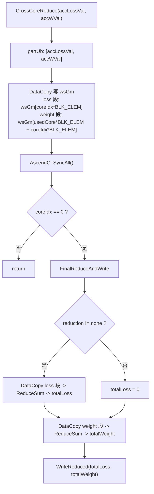

#### **9. WriteReduced 流程图**

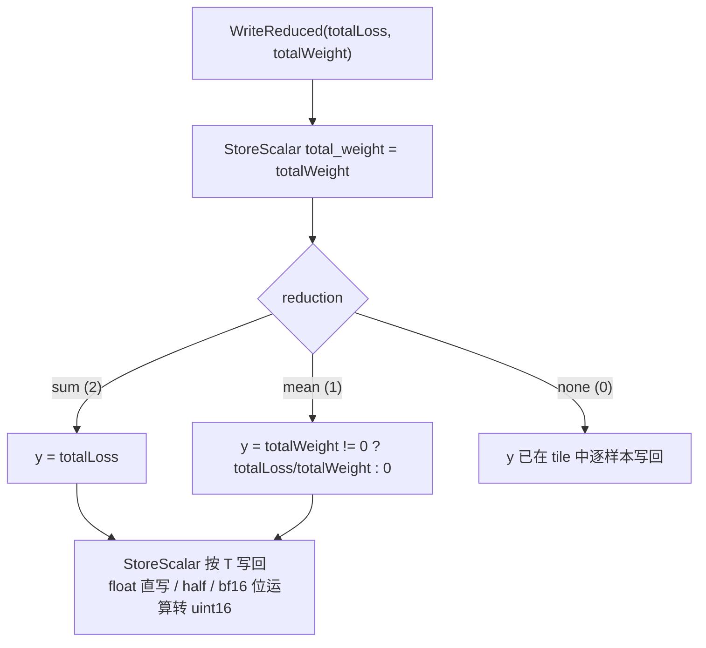

#### **10. 索引取值与加权（GetXVal / weight）流程图**

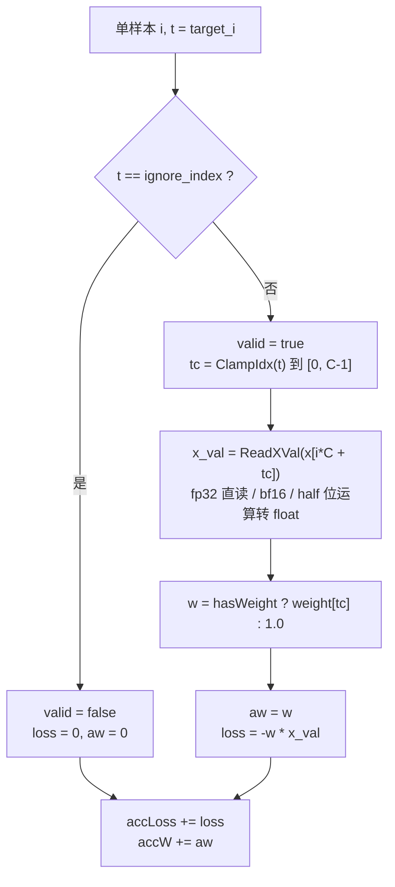

## **支持硬件**

| **支持的芯片版本** | **涉及勾选** |
| ------------------ | ------------ |
| 香橙派OrangePi AIpro | |
| Atlas 200I/500 A2推理产品 | |
| Atlas A2 训练系列产品 / Atlas A3 系列产品 | √ |

## **算子约束限制**

暂无

# **特性交叉分析可维可测分析**

## **验收标准**

| **验收标准** | **描述** |
| ------------ | -------- |
| 精度标准 | 不低于 TBE 版本。 |
| 性能标准 | 算子整体性能与原 TBE 实现算子持平。 |

## **关联的 Issue**

暂无

## **文档更新**

本文档。

## **类型标签**

* [ ] Bug修复
* [ ] 新特性
* [ ] 性能优化
* [ ] 文档更新
* [x] 其他，请描述：社区任务算子设计文档
