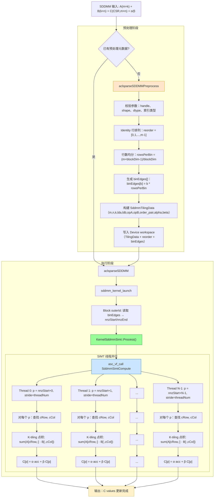

# SDDMM 算子设计文档

# 1. 需求背景（required）

## 1.1 需求来源

参考 cuSPARSE SDDMM（Sampled Dense-Dense Matrix Multiplication）实现，在昇腾 NPU 上基于 Ascend C 编程语言实现功能一致的算子，完成算子设计、开发、测试全流程工作，验收通过后合入昇腾算子开源仓 `ops-sparse`。

SDDMM 的核心计算为：两个稠密矩阵相乘后，由一个稀疏矩阵的结构掩码过滤，仅保留稀疏矩阵非零位置对应的乘积结果。其数学定义为：

$$
C = \alpha \cdot (op(A) \cdot op(B)) \circ spy(C_{pattern}) + \beta \cdot C
$$

其中：

- A ∈ R(m×k)、B ∈ R(k×n) 为**稠密**矩阵；
- C ∈ R(m×n) 为**稀疏 CSR**，仅更新**已有非零位置**的值；
- ⊙ 为 Hadamard 积，$spy(C_{pattern})$ 为 C 的结构掩码（即 C 的非零元素位置矩阵）；
- op(A)、op(B) 支持非转置（N）和转置（T）两种模式；
- α、β 为标量系数，对标 cuSPARSE 通用 α/β。

SDDMM 在 **GNN（图神经网络）** 中是最核心的算子之一。典型用途为：在固定边结构（邻接矩阵）上计算注意力分数 $(Q \cdot K^T) \odot A$，其中 Q、K 为稠密特征矩阵，A 为稀疏邻接矩阵。此类计算广泛出现于 GAT、GCN 等模型的推理与训练流程中。


---

# 2. 背景介绍

## 2.1 CSR 格式与 SDDMM 计算特点

### 2.1.1 CSR 格式回顾

CSR（Compressed Sparse Row）使用三个数组描述稀疏矩阵：

```
csrRowPtr : 每行非零元素的起止位置，长度 M + 1
csrColInd : 每个非零元素对应的列索引，长度 NNZ
csrVal    : 每个非零元素的数值，长度 NNZ
```

对于 SDDMM，稀疏矩阵 C 以 CSR 格式存储，其 values 数组为输入/输出（in-place 更新），结构（rowPtr、colInd）为只读。

### 2.1.2 SDDMM 计算过程

以 opA=N、opB=N（非转置）为例，SDDMM 的逐元素计算为：

```
for row i in [0, m):
    load A[i, :]                          // A 的第 i 行，长度 k
    for each non-zero j in row i of C:
        load B[:, j]                      // B 的第 j 列，长度 k
        acc = 0
        for l in [0, k):
            acc += A[i, l] * B[l, j]      // 点积
        C[i, j] = alpha * acc + beta * C[i, j]
```

### 2.1.3 与 GEMM 关系

| 特性 | GEMM | SDDMM |
|------|------|-------|
| 输入 A | 稠密 (m×k) | 稠密 (m×k) |
| 输入 B | 稠密 (k×n)  | 稠密 (k×n) |
| 输出 C | 稠密 (m×n) | 稀疏 CSR (m×n) |
| 计算筛选 | 全部位置  | 由稀疏 C 结构决定 |
| 核心操作 | Cube/MMAD | 选择性点积（SIMT 并行） |

## 2.2 算子现状分析

ops-sparse 仓中当前已有 `aclsparseSpMM`（稀疏矩阵-稠密矩阵乘）的完整实现，其采用 "Preprocess → Execute" 两阶段 + 贪心装箱分桶的方案，在 Ascend 950PR 上已验证有效。SDDMM 作为该仓的全新算子（`src/sddmm/`），可以参考 SpMM 的两阶段架构，但核心计算逻辑和分桶策略有本质差异：

| 对比维度 | SpMM | SDDMM |
|----------|------|-------|
| 稀疏侧 | A（输入，CSR） | C（输出 mask，CSR） |
| 稠密侧 | B（输入，稠密矩阵） | A、B（输入，均为稠密） |
| 核心计算 | 稀疏行 × 稠密列 | 稠密行 · 稠密列（点积） |
| K 维度 | 1 次乘加 / nnz | k 次乘加 / nnz |
| 分桶策略 | 贪心装箱（Greedy Bin Pack）——整行不可拆分，需按 NNZ 负载均衡 | 行数均分（Identity）——NNZ 是原子单元，Block 间按 NNZ 范围切分即可自然负载均衡 |

SDDMM 相比 SpMM 多了一个 K 维度（点积长度），这使得：
- 短 K 场景下每个非零位置计算量小，overhead 占比高；
- 长 K 场景下点积本身计算密集，K-tiling 成为必要；
- NNZ 级别的并行天然适合 SIMT 线程模型——每个线程独立处理一个 NNZ 条目的完整 K 维点积。

---

# 3. 需求分析

## 3.1 功能需求

算子需要支持以下功能：

| 需求项 | 说明 |
|--------|------|
| CSR 稀疏输出 | C 以 CSR 格式存储，仅更新已有非零位置的 values |
| opA / opB | 支持 N（非转置）和 T（转置），默认 NN |
| alpha / beta | 支持标量系数，包括 β=0（纯 SDDMM）和 β≠0（累加模式） |
| 多 dtype | 同精度 fp32（U1）；混精度 fp16→fp32（M1）、fp16→fp16（M2） |
| computeType | 支持 fp32 中间累加精度 |
| 索引类型 | int32 |
| DnMat order | row-major / column-major，推荐 row-major + NON_TRANSPOSE |
| Preprocess | 支持预处理生成执行元数据，提升重复执行性能 |


对标 cuSPARSE cusparseSDDMM，SDDMM 需支持以下数据类型组合：

#### 同精度（Uniform-precision）

| ID | A/B / C / computeType | 对应 cuSPARSE 枚举 | 说明 |
|----|----------------------|---------------------|------|
| U1 | fp32 / fp32 / fp32 | CUDA_R_32F | 全 fp32 路径，A、B、C values 和中间累加均为 fp32 |

#### 混精度（Mixed-precision）

| ID | A/B（稠密） | C values（稀疏） | computeType | 说明 |
|----|------------|------------------|-------------|------|
| M1 | fp16 (CUDA_R_16F) | fp32 (CUDA_R_32F) | fp32 | fp16 稠密输入，fp32 稀疏输出，fp32 累加 |
| M2 | fp16 (CUDA_R_16F) | fp16 (CUDA_R_16F) | fp32 | fp16 稠密输入，fp16 稀疏输出，fp32 累加 |

从实现角度看，上述 dtype 组合影响三个关键位置：

1. **A/B 加载与类型提升**：A[i, :] 和 B[:, j] 进入乘加前需按 computeType 做类型提升（fp16 → fp32）。
2. **中间累加精度**：fp16 输入路径使用 fp32 累加，避免精度损失。
3. **C values 写回类型转换**：完成 `C = alpha * acc + beta * C_old` 后，按 C values 的 dtype 做 cast 再写回（M1/M2 差异在此）。fp16 输出需做 `±65504` 溢出保护。

因此，Kernel 模板设计需将 `ValT`（A/B 稠密数据类型）、`CT`（C 稀疏值类型）和 `ScalarT`（alpha/beta/累加类型）三者解耦。

## 3.2 性能需求

SDDMM 是典型的 **sparsity-pattern-driven compute** workload。性能优化重点为：

1. **NNZ 级别的负载均衡**：CSR 不同行的非零数量差异可能很大，通过 NNZ 级别的 SIMT 交错分配，每个线程处理的 NNZ 均匀散布在整个范围，统计意义上负载自然均衡。
2. **SIMT 线程级并行**：每个 AIV Core 内通过 `asc_vf_call` 启动 SIMT 线程，线程间交错处理 NNZ 条目，充分利用 VF 单元的并行计算能力。
3. **K 维度的 K-Tiling**：K 较大时按 `kChunk` 分 tile 迭代，平衡寄存器压力和指令缓存效率；`#pragma unroll` 完全展开内层循环以消除分支开销。

性能验收标准：NPU 性能须达到 A100 cuSPARSE 参考实现的 **≥1.0×**（在固定参考用例 + 200 组泛化用例上均达标）。

## 3.3 数据分布需求

SDDMM 的计算单元是单个 NNZ（独立的 K 维点积），而非整行。因此，与 SpMM 需要将不可拆分的行装入不同 bin 不同，SDDMM 可以将所有 NNZ 摊平为一个长列表，然后按 Block 数均分 NNZ 范围。每个 Block 处理一段连续的 NNZ 条目，Block 之间的 NNZ 数量自然均衡（因为每 Block 处理的 NNZ 范围是从连续的行范围映射而来，每 Block 的行数大致相等）。

Host 侧采用 **Identity 行数均分策略**：保持原始行顺序不变（`reorder[i] = i`），按行数均分到各 Block：

| 参数 | 说明 |
|------|------|
| blockDim | AIV Core 数量（从 CANN platform config 读取），fallback = 24 |
| rowsPerBin | `(m + blockDim - 1) / blockDim`，每 Block 约 m/blockDim 行 |
| reorder[] | 恒等排列 `[0, 1, 2, ..., m-1]`（保持原始行序） |
| binEdges[b] | `b * rowsPerBin`，第 b 个 Block 处理的行范围起止索引 |

示例（m=100, blockDim=24）：

```
rowsPerBin = (100 + 24 - 1) / 24 = 5

binEdges = [0, 5, 10, 15, ..., 95, 100, 100, ..., 100]
           ↑   ↑   ↑              ↑
          Block0 处理           Block19 处理        Block20-23 为空
          行 0-4                行 95-99           （兜底，无实际工作）
```

Block 内部的行范围通过 CSR `rowOff` 映射为 NNZ 范围：

```
Block b:
    rowStart = binEdges[b]
    rowEnd   = binEdges[b+1]
    nnzStart = rowOff[rowStart]      // 该 Block 的第一个 NNZ 索引
    nnzEnd   = rowOff[rowEnd]        // 该 Block 的最后一个 NNZ 索引 + 1
```


---

# 4. 总体设计思想

本方案采用 **3.3 数据分布需求** 中提到的 **Identity 行数均分策略** 进行数据的分块，每个线程块根据各自的 `binEdges[outerId]` 获取对应的 NNZ 范围。

## 4.1 算子实现流程

启动 SIMT Kernel，所有 Block 运行同一 Kernel 实例，根据各自的 `binEdges[outerId]` 获取对应的 NNZ 范围：

```
每个 Block (outerId):
    1. 读取 binEdges[outerId] 和 binEdges[outerId+1] 获取行范围
    2. 通过 CSR rowOff 将行范围映射为 NNZ 范围 [nnzStart, nnzEnd)
    3. 根据 NNZ 数量动态确定 SIMT 线程数：simtThreadNum = min(numNnz, 512)
    4. asc_vf_call 启动 SddmmSimtCompute：
       - 每个线程交错处理 NNZ：p = nnzStart + threadIdx, p += threadNum
       - 对每个 NNZ 位置 (r, c)，做 K 维点积
       - 应用 alpha/beta → 写回 C.values[p]
```
该设计的核心是：**不再根据 row_nnz 分桶走不同 Kernel 路径，而是利用 SIMT 的细粒度线程并行，统一处理所有 NNZ——无论它们来自短行还是长行。** K 维度的 tiling 统一内嵌于 SIMT 线程的点积循环中（`kChunk` 分 tile + `#pragma unroll` 展开）。



---

## 4.2 C++三阶段接口

接口命名、参数顺序和描述符语义参考 cuSPARSE，统一使用 `aclsparse` 前缀。SDDMM 对外提供 buffer size、preprocess 和 compute 三阶段接口，调用流程与 cuSPARSE cusparseSDDMM 保持一致。

```c
/**
 * @brief 获取 SDDMM 所需 workspace 大小
 */
aclsparseStatus_t aclsparseSDDMMGetBufferSize(
    aclsparseHandle_t           handle,
    aclsparseOperation_t        opA,
    aclsparseOperation_t        opB,
    const void                 *alpha,
    aclsparseConstDnMatDescr_t  matA,
    aclsparseConstDnMatDescr_t  matB,
    const void                 *beta,
    aclsparseSpMatDescr_t       matC,
    aclDataType                 computeType,
    aclsparseSDDMMAlg_t         alg,
    size_t                     *bufferSize);

/**
 * @brief SDDMM 预处理：生成恒等行排列、Tiling 元数据并写入 workspace
 */
aclsparseStatus_t aclsparseSDDMMPreprocess(
    aclsparseHandle_t           handle,
    aclsparseOperation_t        opA,
    aclsparseOperation_t        opB,
    const void                 *alpha,
    aclsparseConstDnMatDescr_t  matA,
    aclsparseConstDnMatDescr_t  matB,
    const void                 *beta,
    aclsparseSpMatDescr_t       matC,
    aclDataType                 computeType,
    aclsparseSDDMMAlg_t         alg,
    void                       *externalBuffer);

/**
 * @brief 执行 SDDMM 计算
 */
aclsparseStatus_t aclsparseSDDMM(
    aclsparseHandle_t           handle,
    aclsparseOperation_t        opA,
    aclsparseOperation_t        opB,
    const void                 *alpha,
    aclsparseConstDnMatDescr_t  matA,
    aclsparseConstDnMatDescr_t  matB,
    const void                 *beta,
    aclsparseSpMatDescr_t       matC,
    aclDataType                 computeType,
    aclsparseSDDMMAlg_t         alg,
    void                       *externalBuffer);
```

三阶段职责如下：

1. **`aclsparseSDDMMGetBufferSize`**：完成参数、shape、索引类型和 dtype 组合校验；计算 `SddmmTilingData` + `reorder[m]` + `binEdges[blockDim+1]` 所需的 workspace 大小，通过 `bufferSize` 返回。
2. **`aclsparseSDDMMPreprocess`**：以 Identity 方式生成行排列和 bin 边界；构建 `SddmmTilingData`（含 shape、ld、opA/opB、order_pair、alpha/beta）；将元数据写入 `externalBuffer`；将 `activeBuffer` 绑定到 `matC`，供后续 Execute 复用。
3. **`aclsparseSDDMM`**：检查 workspace 签名与当前矩阵参数是否匹配——若 `matC->activeBuffer == buffer`，仅刷新 opA/opB/order_pair 和 alpha/beta（轻量更新）；否则重新执行完整 Preprocess。在 handle 绑定的 stream 上启动 Kernel。

`alpha` 和 `beta` 支持 HOST / DEVICE 两种指针模式，其指向的数据类型须与 `computeType` 一致。当前实现仅支持 fp32 computeType 的 alpha/beta。`aclsparseSDDMMAlg_t` 默认使用 `ACLSPARSE_SDDMM_ALG_DEFAULT`。

## 4.3 算子实现

代码实现分为 Host 预处理和 Device 执行两部分，主要文件规划如下：

```
src/sddmm/
└── arch35/
    ├── sddmm_host.cpp         # Host 侧：参数校验、描述符解析 + TilingData + kernel 异步 launch
    ├── sddmm_kernel.cpp       # Kernel 侧：kernel_do  dispatcher + AscendC kernel 类
    ├── sddmm_kernel.h         # kernel_do 签名（host/kernel 共用）+ kernel 类声明
    ├── sddmm_tiling_data.h    # TilingData 结构体（Host/Kernel 共用）
    └── sddmm.h                # 公共头文件：类型映射、描述符转换函数、宏定义
```

### 4.3.1 Host 侧实现

Host 侧首先检查 handle、描述符、workspace、op、alg、shape 和 dtype 组合的有效性，并限制 CSR 索引为 int32、idxBase 为 zero。当前支持以下 dtype 组合：

| A/B 类型 | computeType | C values 类型 | 对应 ID |
|-----------|-------------|---------------|---------|
| fp32 | fp32 | fp32 | U1 |
| fp16 | fp32 | fp32 | M1 |
| fp16 | fp32 | fp16 | M2 |

Dtype 组合通过 `SddmmDataTypeEncode(matA->valueType, matC->valueType, ACL_FLOAT)` 编码为单个 `dataType` 参数传入 Kernel launch。

`GetSddmmBlockDim()` 通过 `platform_ascendc::PlatformAscendCManager` 获取当前芯片的 AIV Core 数量作为 `blockDim`（fallback = 24）。

Workspace 布局（由 `ComputeWsOffsets` 计算，均 64B 对齐）：

```
Workspace 布局:
┌──────────────┬───────────────────┬─────────────────┬──────────────────────────┐
│ Header       │ SddmmTilingData   │ reorder[m]      │ binEdges[blockDim + 1]   │
│ SDDMM_WS_    │ (m,n,k,lda,ldb,   │ (m × sizeof      │ ((blockDim+1) ×           │
│ HEADER_BYTES │  reorder_offset,   │  (int32_t))      │  sizeof(int32_t))         │
│ (64B)        │  bin_edge_offset,  │                  │                          │
│              │  opA,opB,          │                  │                          │
│              │  order_pair,       │                  │                          │
│              │  alpha_host,       │                  │                          │
│              │  beta_host)        │                  │                          │
└──────────────┴───────────────────┴─────────────────┴──────────────────────────┘
 ↑              ↑ tilingOff          ↑ reorderOff       ↑ binEdgeOff
```

Preprocess 阶段执行步骤（`SddmmBuildTilingToBuffer`）：

1. Identity 行排列：`BuildIdentityReorderAndBins(m, blockDim, &reorder, &binEdges)` —— reorder = [0,1,...,m-1]，binEdges 按行数均分。
2. 写入 reorder 和 binEdges 到 Device workspace（`WriteReorderToWorkspace`，通过 `aclrtMemcpy H2D`）。
3. 构建 `SddmmTilingData`：填充 m、n、k、lda、ldb、reorder_offset、bin_edge_offset、opA、opB、order_pair（`matA->order * 2 + matB->order`）、alpha_host、beta_host。
4. 写入 `SddmmTilingData` 到 Device workspace（`aclrtMemcpy H2D`）。

opA/opB 与 DnMat order 的校验：推荐组合为 row-major + NON_TRANSPOSE（与 cuSPARSE 性能建议一致）；若用户传入非推荐组合，Host 侧打印 warning 但不阻止执行。

Tiling 复用机制（`SddmmEnsureTilingReady`）：若 `matC->activeBuffer == buffer`（同一 workspace 被复用），仅刷新 TilingData 中的 opA/opB、order_pair 和 alpha/beta（`SddmmRefreshActiveTiling`）——无需重建 reorder 和 binEdges。否则执行完整 `SddmmBuildTilingToBuffer`。

### 4.3.2 Kernel 侧实现

执行入口 `sddmm_kernel_launch` 启动 `blockDim` 个 Block，每个 Block 运行 `KernelSddmmSimt`：

```
KernelSddmmSimt::Init(tilingGM):
    1. LoadSddmmTilingData(tilingGM) → 加载 tiling 元数据到寄存器
    2. 设置指针：matA, matB, rowOff, colInd, csrValues
    3. 定位 binEdge_：wsBase_ + tilingData_.bin_edge_offset

KernelSddmmSimt::Process():
    1. 从 tilingData_ 读取 m, n, k, lda, ldb, opA, opB, orderPair, alpha, beta
    2. outerId = GetBlockIdx()
    3. rowStart = binEdge_[outerId], rowEnd = binEdge_[outerId + 1]
    4. nnzStart = rowOff_[rowStart], nnzEnd = rowOff_[rowEnd]
    5. simtThreadNum = min(numNnz, kMaxSimtThreadsPerBlock=512)
    6. asc_vf_call SddmmSimtCompute(simtThreadNum, ...)
```

SIMT 计算核心 `SddmmSimtCompute`：

- 每个线程交错处理 NNZ：`p = nnzStart + threadIdxX; p < nnzEnd; p += threadNum`
- 对每个 NNZ 位置 p：从 `colInd[p]` 获取列索引 cCol，通过线性扫描 `rowOff` 查找所在行 cRow
- K 维度分 tile：`kTiles = (k + kChunk - 1) / kChunk`，`kChunk = 8`
- 内层 `#pragma unroll` 完全展开 kChunk 次迭代，每次做 A/B 索引计算 + 乘累加
- A/B 索引计算支持 4 种 op×order 组合（全部使用 `int64_t` 中间量防止溢出）
- 收尾：`C[p] = alpha * dot + beta * C_old[p]`（beta=0 时跳过 C_old 读取）
- fp16 输出路径：写入前做 `±65504` 溢出保护（clamp）

---

# 5. 关键方案设计

## 5.1 基于行数均分的负载均衡策略

### 5.1.1 策略概述

SDDMM 的核心设计决策是：**以 NNZ 为计算单元，而非以行为计算单元**。这使得负载均衡天然简单——将所有 CSR 行的 NNZ 摊平为连续列表，按 Block 数均分即可，无需贪心装箱。

```
原始 CSR 结构:
行 0: ████████                           NNZ 连续排列:
行 1: ██                     →           [0][1][2][3][4][5][6][7][8][9]...[NNZ-1]
行 2: ████████████████                   ↑
行 3: █████                              Block0 分配 [0, NNZ/blockDim)
行 4: ████████████                       Block1 分配 [NNZ/blockDim, 2*NNZ/blockDim)
                                         ...
```

### 5.1.2 与 SpMM 贪心装箱的对比

| 维度 | SpMM 贪心装箱 | SDDMM 行数均分 |
|------|-------------|---------------|
| 计算单元 | 整行（不可拆分） | 单个 NNZ（可任意切分） |
| 分桶策略 | 按 NNZ 降序排列 → 装入负载最小的 bin | 保持原始行序，按行数均分 |
| 负载均衡机制 | 贪心逼近最优装箱 | NNZ 列表均分天然均衡 |
| Host 侧开销 | 需 `aclrtMemcpy D2H` 读取 CSR rowOff | 无需读取 CSR 数据 |
| reorder | 按装箱结果重排 | Identity（恒等排列） |
| Block 边界 | 不可切分行 | 可切分行（行的部分 NNZ 可跨 Block） |

### 5.1.3 策略选取理由

1. **NNZ 是原子计算单元**：SDDMM 每个非零位置需要独立完成 K 维点积，不依赖同行的其他 NNZ。Block 边界可以安全地切分"行"——某行的前 5 个 NNZ 在 Block A，后 3 个在 Block B，各自独立计算，结果正确。

2. **行数均分已足够均衡**：按行数均分后，通过 `rowOff` 转换为 NNZ 范围。虽然每 Block 的行数相同，NNZ 可能有差异（稀疏度不均），但由于 Block 数量（~24）远小于行数（通常 ≥ 10³），且每 Block 行数较多，统计意义上 NNZ 总数趋于均匀。

3. **避免 H2D/D2H 通信开销**：贪心装箱需要先通过 `aclrtMemcpy D2H` 将 CSR rowOff 从 Device 拷回 Host 进行 NNZ 统计。SDDMM 的行数均分不需要读取 CSR 数据，Host 侧仅根据 m 和 blockDim 即可完成全部计算。

4. **SIMT 线程级二次均衡**：即使某 Block 的 NNZ 略多于其他 Block，Block 内部 SIMT 线程的交错分配（`p += threadNum` stride）进一步分散了负载。

## 5.2 SIMT Kernel 设计

### 5.2.1 执行模型

SIMT Kernel 运行在 AIV（AI Vector）单元的 Vector Facility 上，采用 GPU-like 的线程模型：

```
┌──────────────────────────────────────────────────────────┐
│                  Block (AIV Core)                        │
│                                                          │
│  Thread 0 ──→ NNZ[nnzStart+0], NNZ[nnzStart+N], ...     │
│  Thread 1 ──→ NNZ[nnzStart+1], NNZ[nnzStart+N+1], ...   │
│  Thread 2 ──→ NNZ[nnzStart+2], NNZ[nnzStart+N+2], ...   │
│  ...                                                     │
│  Thread N-1 → NNZ[nnzStart+N-1], ...                     │
│                                                          │
│  每个线程独立完成：                                       │
│    1. CSR 行查找（线性扫描 rowOff）                       │
│    2. K 维点积（kChunk tiling + #pragma unroll）          │
│    3. alpha/beta 融合 + 写回                              │
└──────────────────────────────────────────────────────────┘
```

**Key attributes**:
- `__simt_vf__`：编译为 SIMT 模式，线程在 VF 上并行执行
- `__aicore__`：运行在 AI Core 上
- `__launch_bounds__(kMaxSimtThreadsPerBlock)`：编译期指定最大线程数 = 512

### 5.2.2 模板参数解耦

```cpp
template<typename ValT, typename CT, typename ScalarT>
```

| 参数 | 含义 | U1 值 | M1 值 | M2 值 |
|------|------|-------|-------|-------|
| `ValT` | A/B 稠密矩阵的元素类型 | `float` | `__fp16` | `__fp16` |
| `CT` | C 稀疏 values 的元素类型 | `float` | `float` | `__fp16` |
| `ScalarT` | alpha/beta 及累加类型 | `float` | `float` | `float` |

三者解耦使得同一套 Kernel 模板代码覆盖全部 3 种 dtype 组合，仅通过编译期 `if constexpr` 区分 fp16 输出的溢出保护。


### 5.2.3 fp16 溢出保护

```cpp
if constexpr (is_same<CT, float>::value) {
    csrValues[p] = cNew;                // fp32: 直接写回
} else {
    cNew = clamp(cNew, -65504.0f, 65504.0f);  // fp16: clamp 后写回
    csrValues[p] = static_cast<CT>(cNew);
}
```

`if constexpr` 编译期分支——CT=float 时零开销（不生成 clamp 代码）。

## 5.3 Workspace 与 Tiling 数据结构

### 5.3.1 SddmmTilingData

```cpp
struct SddmmTilingData {
    int32_t m, n, k;           // 矩阵 shape
    int32_t lda, ldb;          // A/B 的 leading dimension
    int32_t reorder_offset;    // workspace 中 reorder[m] 的字节偏移
    int32_t bin_edge_offset;   // workspace 中 binEdges[blockDim+1] 的字节偏移
    int32_t opA;               // 0=NON_TRANSPOSE, 1=TRANSPOSE
    int32_t opB;               // 0=NON_TRANSPOSE, 1=TRANSPOSE
    int32_t order_pair;        // matA->order * 2 + matB->order
    float alpha_host;          // alpha 标量值（fp32）
    float beta_host;           // beta 标量值（fp32）
};
```

`LoadSddmmTilingData` 从 GM 逐字段拷贝到寄存器（避免 `reinterpret_cast` 直接解引用非对齐的 `__gm__` 指针）。

### 5.3.2 Workspace 大小计算

```cpp
WsOffsets ComputeWsOffsets(int64_t m, int32_t blockDim):
    tilingOff  = SDDMM_WS_HEADER_BYTES   // 64
    reorderOff = align_up(tilingOff  + sizeof(SddmmTilingData), 64)
    binEdgeOff = align_up(reorderOff + sizeof(int32_t) * m, 64)
    totalBytes = align_up(binEdgeOff + sizeof(int32_t) * (blockDim + 1), 64)
```

以 m=10000、blockDim=24 为例：

```
sizeof(SddmmTilingData) = 48B
reorderOff = align_up(64 + 48, 64) = 128
binEdgeOff = align_up(128 + 40000, 64) = 40128
totalBytes = align_up(40128 + 100, 64) = 40256
```

## 5.4 A/B 索引计算 — 转置与布局支持

### 5.4.1 索引公式

Kernel 内 A/B 索引计算支持全部 4 种 (op × order) 组合：

```
A[cRow, kIdx] 的实际地址（opA=0: A 为 m×k, opA=1: A 存储为 k×m）:

  opA=0, RowMajor:     aIdx = cRow * lda + kIdx
  opA=0, ColMajor:     aIdx = kIdx * lda + cRow
  opA=1, RowMajor:     aIdx = kIdx * lda + cRow     // 存储为 k×m 行主序
  opA=1, ColMajor:     aIdx = cRow * lda + kIdx     // 存储为 k×m 列主序

B[kIdx, cCol] 的实际地址（opB=0: B 为 k×n, opB=1: B 存储为 n×k）:

  opB=0, RowMajor:     bIdx = kIdx * ldb + cCol
  opB=0, ColMajor:     bIdx = cCol * ldb + kIdx
  opB=1, RowMajor:     bIdx = cCol * ldb + kIdx     // 存储为 n×k 行主序
  opB=1, ColMajor:     bIdx = kIdx * ldb + cCol     // 存储为 n×k 列主序
```

所有中间量使用 `int64_t` 防止大矩阵下 `r * lda` 的 int32 溢出。

### 5.4.2 order_pair 编码

`order_pair = matA->order * 2 + matB->order`（order 取值：0=RowMajor, 1=ColMajor）。

Kernel 内解码：

```cpp
const bool aRowMajor = (orderPair == SDDMM_ORDER_RR || orderPair == SDDMM_ORDER_RC);
const bool bRowMajor = (orderPair == SDDMM_ORDER_RR || orderPair == SDDMM_ORDER_CR);
```

| order_pair | A order | B order | aRowMajor | bRowMajor |
|-----------|---------|---------|-----------|-----------|
| 0 (RR) | RowMajor | RowMajor | true | true |
| 1 (RC) | RowMajor | ColMajor | true | false |
| 2 (CR) | ColMajor | RowMajor | false | true |
| 3 (CC) | ColMajor | ColMajor | false | false |

---

# 6. 支持硬件

| 支持的芯片版本 | 涉及勾选 | 说明 |
|---------------|---------|------|
| Ascend 950PR | √ | 本任务书指定适配硬件，算子设计、开发、测试和性能验收均以 Ascend 950PR 为准 |

---

# 7. 可维可测分析

## 7.1 可维护性分析

SIMT 统一执行方案将全部 NNZ 走同一 Kernel 路径：

```
所有行 → 行数均分 → NNZ 范围 → SIMT 线程并行 → K-tiling 点积
```

这种统一路径的设计有利于后续维护：

1. 单一 Kernel 路径，代码量小，调试和测试范围明确。
2. 分桶策略简单（Identity 均分），不依赖 CSR 行分布，对任意稀疏模式均适用。
3. K-tiling 的 `kChunk` 和最大线程数 `kMaxSimtThreadsPerBlock`（512）可配置，便于后续根据性能数据调优。
4. opA/opB 转置组合在 Kernel 内通过条件分支适配，不需要额外的 Host 侧路径切换。
5. dtype 组合通过模板参数 `ValT`/`CT`/`ScalarT` 控制，新增 dtype 只需添加模板实例化，不改核心逻辑。

## 7.2 可测试性与精度验证

### 7.2.1 测试覆盖维度

| 维度 | 覆盖内容 |
|------|---------|
| 数据类型 | U1 (fp32)、M1 (fp16→fp32)、M2 (fp16→fp16) |
| 稀疏度分布 | 均匀稀疏、极端不均匀稀疏、全满行、全空行 |
| alpha / beta | β=0（纯 SDDMM）、β≠0（累加）、α=0/1/非1 |
| opA / opB | NN（必测）、NT、TN、TT |
| 矩阵 shape | 方阵 (m=n)、宽矩阵 (m≪n)、窄矩阵 (m≫n) |
| K 维度 | k=16、64、128、256、512 |
| 稀疏度 | nnz 从 10² 到 10⁷ |
| 边界 | nnz=0、m=1（单行）、n=1（单列）、row_nnz 极端不均匀 |
| stride | 连续 / 非连续 DnMat（ld > cols） |

### 7.2.2 功能验收用例（对标任务书 §4）

| 编号 | 场景 | 说明 |
|------|------|------|
| TC-01 | 基础 SDDMM，β=0 | 纯 SDDMM，验证基本功能 |
| TC-02 | 含 β·C 累加 | 验证累加语义 |
| TC-03 | 1D 向量外积语义 | m=1 或 n=1 的特殊 shape |
| TC-04 | GNN 边特征 (E,1)·(1,E) | 模拟 GNN 典型 attention pattern |
| TC-05 | 非连续 / 非方阵 | ld > cols，宽矩阵 / 窄矩阵 |
| TC-06 | 空 nnz | 边界条件 |

### 7.2.3 精度验证标准

满足《生态算子开源精度标准》和 ATK 双标杆 L2（2 / 1.2 / 1.2）要求。

#### 单标杆精度验证

以高精度 CPU 计算结果作为 `golden`，对 NPU 输出 `actual` 进行误差评估：

$$
\mathrm{MERE} = \operatorname{avg}\left(\frac{|actual - golden|}{|golden| + 10^{-7}}\right)
$$

$$
\mathrm{MARE} = \max\left(\frac{|actual - golden|}{|golden| + 10^{-7}}\right)
$$

通过条件：`MERE < Threshold` 且 `MARE < 10 × Threshold`。

| 输出 C values 类型 | Threshold |
|-------------------|----------:|
| float32 | $2^{-13}$ |
| float16 | $2^{-10}$ |

#### 双标杆精度验证

浮点用例未通过单标杆且排除功能错误后，使用 cuSPARSE 结果进行双标杆复核：

```
MARE_Ratio = MARE_NPU / MARE_GPU
MERE_Ratio = MERE_NPU / MERE_GPU
RMSE_Ratio = RMSE_NPU / RMSE_GPU
```

双标杆通过条件：

| 指标 | 阈值 |
|------|-----:|
| MARE_Ratio | ≤ 2 |
| MERE_Ratio | ≤ 1.2 |
| RMSE_Ratio | ≤ 1.2 |

三项指标均满足要求时判定精度通过。CPU、NPU 和 GPU 必须使用相同输入数据、alpha/beta、dtype、computeType 和随机种子。ATK 双标杆测试需要 A100 环境，开发者自行准备。

---

## 附录 A：性能参考用例（对标任务书 §5）

| 编号 | 场景 | m×n | nnz | k | dtype | GPU 参考耗时 (μs) | 达标要求 |
|------|------|-----|-----|---|-------|------------------:|----------|
| 01 | fp32 基础 SDDMM，β=0 | 256×256 | 327 | 64 | fp32 | 1912 | NPU ≥ 1.0× |
| 02 | 含 β·C 累加 | 128×128 | 163 | 32 | fp32 | 1683 | NPU ≥ 1.0× |
| 03 | fp16 混精 M1 | 256×256 | 327 | 64 | A/B fp16，C fp32 | 1768 | NPU ≥ 1.0× |

泛化覆盖范围（另抽 200 组用例，由维度组合抽样生成）需覆盖矩阵规模 m/n: 10³~10⁵、k: 16/64/128/256/512、nnz: 10⁴~10⁷、dtype U1+M1+M2、布局 row-major 推荐组合与非连续 stride 各 10 组、β≠0 累加至少 10 组，以及 nnz=0、1D 外积、GNN 边特征等边界场景。全部用例性能须 ≥ 1.0×。


