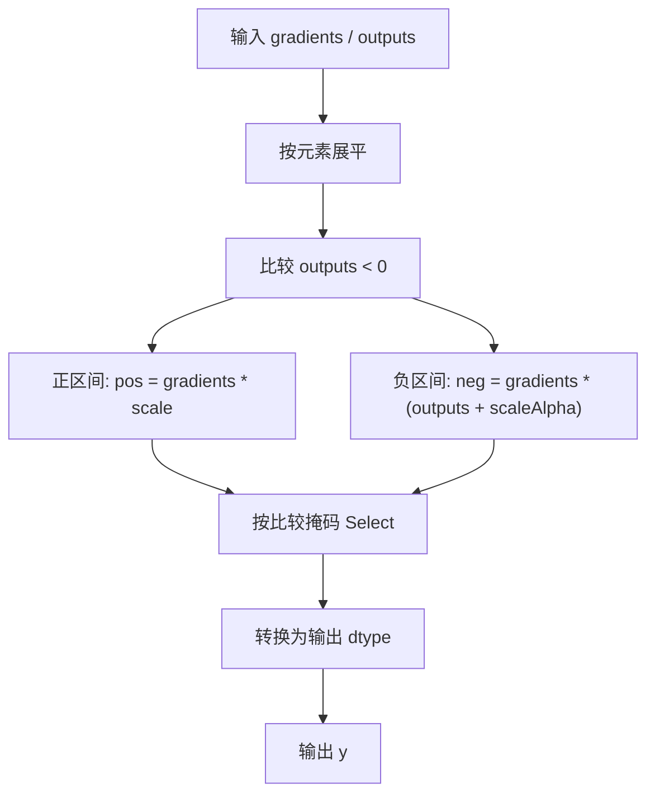
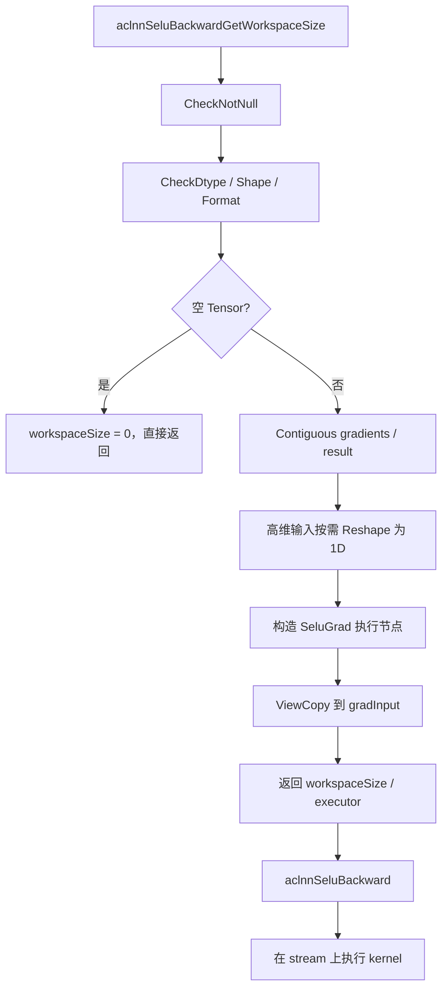
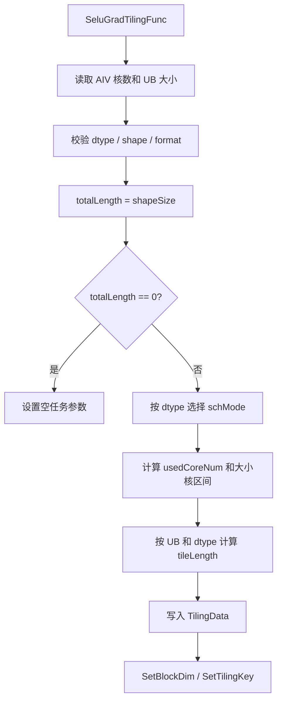
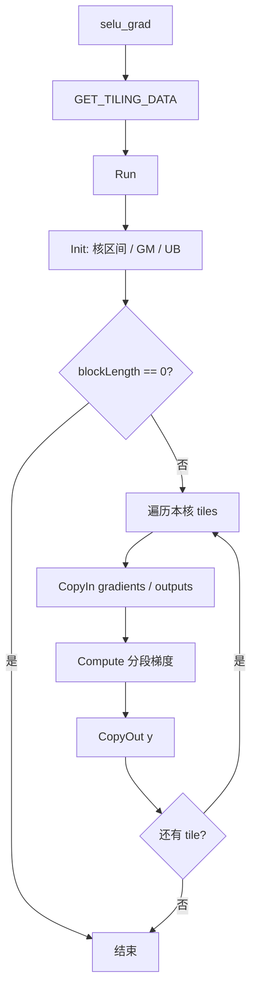
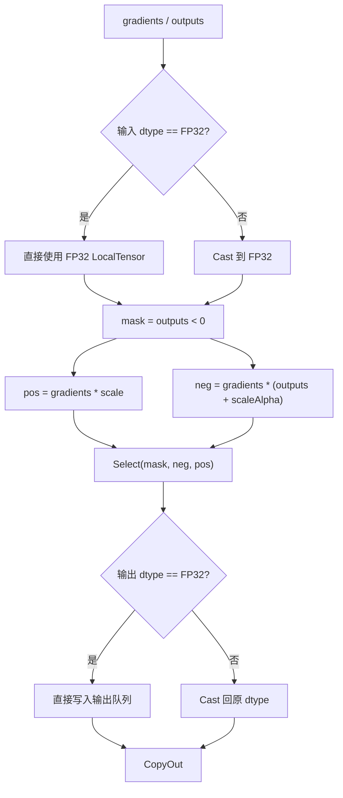

# **需求背景**

## **需求来源**

基于 CANN 内置 `SeluGrad`（上层接口为 `aclnnSeluBackward`）历史 TBE 实现，使用 Ascend C 编程语言完成 Atlas A2 训练系列产品和 Atlas A3 系列产品上的算子改造。设计目标是在保持原有接口、数据类型、数据格式和计算语义一致的前提下，补齐 Ascend C host、kernel、ACLNN 调用及测试能力，并使所有核参与计算的场景下性能不低于原 TBE 实现的 95%。

任务书：[`SeluGrad_task_doc.md`](https://gitcode.com/cann/cann-ops-competitions/blob/master/04_tasks/01_community-task-2026/docs/202607/SeluGrad_task_doc.md)

目标开源目录：[`ops-nn/experimental/activation`](https://gitcode.com/cann/ops-nn/tree/master/experimental/activation)

## **背景介绍**

SELU（Scaled Exponential Linear Unit）是一种带固定缩放系数的激活函数。`SeluGrad` 接收反向传播的上游梯度 `gradients` 和 SELU 正向输出 `outputs`，根据 `outputs` 所处的正、负区间计算输入梯度 `y`。

历史 TBE 实现路径：

```text
${ASCEND_INSTALL_PATH}/opp/built-in/op_impl/ai_core/tbe/impl/dynamic/
```

算子原型和信息库路径：

```text
${ASCEND_INSTALL_PATH}/opp/built-in/op_proto/inc/
${ASCEND_INSTALL_PATH}/opp/built-in/op_impl/ai_core/tbe/config/ascend910b/
```

ACLNN 接口和既有算子说明可参考：

- [`aclnnSeluBackward`](https://www.hiascend.com/document/detail/zh/CANNCommunityEdition/850/API/aolapi/context/ops-nn/aclnnSeluBackward.md)
- [`ops-nn/activation/selu_grad`](https://gitcode.com/cann/ops-nn/tree/master/activation/selu_grad)

## **TBE 源码分析**

### **1. 算子原型**

`SeluGrad` 包含两个必选输入和一个输出，无额外属性。

```cpp
REG_OP(SeluGrad)
    .INPUT(gradients, TensorType::RealNumberType())
    .INPUT(outputs, TensorType::RealNumberType())
    .OUTPUT(y, TensorType::RealNumberType())
    .OP_END_FACTORY_REG(SeluGrad)
```

| **名称** | **类别** | **说明** |
| -------- | -------- | -------- |
| gradients | 输入 | SELU 反向传播的上游梯度。 |
| outputs | 输入 | SELU 正向计算结果，用于判断分段区间。 |
| y | 输出 | SELU 输入的反向梯度。 |

### **2. 数学公式**

SELU 正向函数为：

```text
selu(x) = scale * x                    , x >= 0
selu(x) = scale * alpha * (exp(x) - 1), x < 0
```

常量为：

```text
alpha       = 1.6732632423543772848170429916717
scale       = 1.0507009873554804934193349852946
scaleAlpha  = scale * alpha
            = 1.7580993408473768599402175208123
```

由于 `outputs` 是 SELU 正向输出，反向计算可直接写为：

```text
y[i] = gradients[i] * scale                         , outputs[i] >= 0
y[i] = gradients[i] * (outputs[i] + scaleAlpha)    , outputs[i] < 0
```

该表达式避免在反向阶段再次计算指数函数，kernel 仅需完成比较、标量乘、标量加、逐元素乘和分支选择。

### **3. 支持的数据类型**

任务目标硬件为 Atlas A2 / Atlas A3。根据既有 ACLNN 接口约束，输入输出 dtype 必须一致。

| **参数** | **Atlas A2 / Atlas A3 支持 dtype** | **说明** |
| -------- | ---------------------------------- | -------- |
| gradients | float16 / float32 / bfloat16 / int32 / int8 | 上游梯度。 |
| outputs | 与 `gradients` 一致 | SELU 正向输出。 |
| y | 与 `gradients` 一致 | 计算结果转换回原 dtype。 |

说明：

- 浮点和整数分支均按数值语义计算，不进行二进制位模式比较。
- `float16`、`bfloat16` 和整数类型在 UB 中提升为 `float32` 完成含小数常量的计算，最终转换回输出 dtype。
- 整数回写的舍入和饱和行为与目标平台 `Cast` 语义及 TBE 基线保持一致。

### **4. 数据格式与 Shape 约束**

| **约束项** | **规则** |
| ---------- | -------- |
| format | `gradients`、`outputs`、`y` 均为 ND。 |
| dtype | 三者 dtype 一致。 |
| shape | 三者 shape 一致，不涉及广播。 |
| rank | 原始算子支持 1～8 维；ACLNN 层可将更高维连续视图展平后调用。 |
| 空 Tensor | ACLNN 层检测到空 Tensor 时直接返回，不启动无效 kernel。 |
| 非连续 Tensor | ACLNN 层先执行 `Contiguous`，kernel 处理连续 ND 数据。 |

### **5. TBE 计算流程**

TBE 实现本质为逐元素分段计算。输入展平后，各元素之间无依赖，也不需要核间同步或跨核归约。



# **需求分析**

## **外部组件依赖**

不涉及额外第三方组件。实现依赖 CANN / Ascend C 基础组件、ACLNN 两段式接口框架、op_host tiling 框架、`kernel_operator` 以及算子工程构建与测试框架。

## **内部适配模块**

设计包含以下模块：

- `op_graph`：声明 `SeluGrad` 原型、输入输出 dtype、format 和 shape 关系。
- `op_host`：完成 InferShape、dtype 校验、平台信息读取、分核、UB 切分、TilingKey 和 workspace 规划。
- `op_kernel`：完成数据搬入、dtype 提升、正负分支计算、逻辑值比较、结果选择和数据搬出。
- `op_api`：实现 `aclnnSeluBackwardGetWorkspaceSize` 与 `aclnnSeluBackward`，处理参数校验、非连续 Tensor 和空 Tensor。
- `tests`：覆盖功能、精度、泛化和性能场景。
- `docs`：记录接口、设计、约束、调用和验证方式。

## **需求模块设计**

### **算子原型**

| **名称** | **类别** | **dtype** | **format** | **shape** | **介绍** |
| -------- | -------- | --------- | ---------- | --------- | -------- |
| gradients | 输入 | fp16 / fp32 / bf16 / int32 / int8 | ND | 1～8 维 | 上游梯度。 |
| outputs | 输入 | 与 `gradients` 一致 | ND | 与 `gradients` 一致 | SELU 正向输出。 |
| y | 输出 | 与 `gradients` 一致 | ND | 与 `gradients` 一致 | 输入反向梯度。 |

### **功能拆解**

1. 支持 FP16、FP32、BF16、INT32、INT8。
2. 支持 1～8 维 ND Tensor，kernel 内部统一按一维连续数据处理。
3. 支持正值、负值、`+0`、`-0`、混合符号及尾块场景。
4. 支持 ACLNN 非连续 Tensor 输入，接口层转换为连续 Tensor 后执行。
5. 支持空 Tensor 快速返回。
6. 比较采用数值逻辑 `outputs < 0`，`outputs == 0` 进入线性区间。
7. 所有核参与计算的场景下性能达到 TBE 基线的 95% 以上。

## **算子支持型号**

Atlas A2 训练系列产品、Atlas A3 系列产品，对应 `ascend910b`、`ascend910_93`。

# **需求详细设计**

## **使能方式**

| **上层框架** | **涉及的框架勾选** |
| ------------ | ------------------ |
| TF训练/推理 | √ |
| Pytorch训练/推理 | √ |
| ATC推理 | √ |
| Aclnn直调 | √ |
| OPAT调优 | √ |
| SGAT子图切分 | |

## **需求总体设计**

### **ACLNN 接口设计**

`aclnnSeluBackwardGetWorkspaceSize` 完成参数检查、连续化和执行器构造，`aclnnSeluBackward` 在指定 stream 上执行算子。

#### **1. 参数校验**

- `gradOutput`、`result`、`gradInput` 均不能为空指针。
- 三者 dtype 必须一致并位于目标平台支持集合中。
- 三者 shape 必须一致。
- 输入输出 format 为 ND。
- 非连续输入通过 `Contiguous` 转换。

#### **2. 特殊输入**

- 任一输入为空 Tensor 时，返回 `workspaceSize = 0`，不下发 kernel。
- rank 大于底层算子直接支持上限时，在 ACLNN 层将连续数据 reshape 为一维，计算结束后恢复原视图。
- 输出通过 `ViewCopy` 写入用户提供的 `gradInput`。

### **host 侧设计方案**

host 侧负责 InferShape、dtype 和 shape 校验、平台信息获取、TilingKey 选择、多核切分、UB tile 规划和 tiling data 下发。

#### **1. InferShape**

`SeluGrad` 不改变 Tensor shape：

```text
y.shape = gradients.shape
y.dtype = gradients.dtype
```

InferShape 同时校验 `outputs.shape == gradients.shape`。InferDataType 将 `gradients` dtype 赋给 `y`，并校验 `outputs` dtype 一致。

#### **2. 数据展平**

计算不依赖维度语义，host 侧仅提取元素总数：

```text
totalLength = gradients.storageShape.GetShapeSize()
```

kernel 将输入输出视为长度为 `totalLength` 的连续一维数组，避免传递冗余维度信息。

#### **3. TilingKey 规划**

TilingKey 按 dtype 区分编译实例和转换路径：

| **dtype** | **schMode** | **kernel 类型** | **计算路径** |
| --------- | ----------- | --------------- | ------------ |
| float32 | 0 | `float` | FP32 直接计算。 |
| float16 | 1 | `half` | 提升到 FP32，计算后转回 FP16。 |
| bfloat16 | 2 | `bfloat16_t` | 提升到 FP32，计算后转回 BF16。 |
| int32 | 3 | `int32_t` | 转换到 FP32，计算后按 TBE 语义回写 INT32。 |
| int8 | 4 | `int8_t` | 转换到 FP32，计算后按 TBE 语义回写 INT8。 |

如果目标芯片不支持整数与 FP32 的直接 `Cast`，整数分支使用 `int -> half -> float` 和 `float -> half -> int` 的编译期特化路径，不在运行时增加分支判断。

#### **4. 分核策略**

单个元素需要读取两个输入并写回一个输出，算子主要受 GM 带宽和 vector 计算吞吐影响。分核遵循以下原则：

1. 以 32 Byte 数据块为基本对齐单位。
2. 大 shape 优先使用全部可用 AIV 核。
3. 小 shape 根据最小有效工作量收敛核数，避免启动大量空核或每核仅处理极少元素。
4. 数据不能整除时采用大小核切分，前 `formerCoreNum` 个核处理 `formerCoreLength` 个元素，其余核处理 `tailCoreLength` 个元素。
5. 每个核负责连续区间，不发生核间数据重叠。

计算过程如下：

```text
alignNum       = 32 / sizeof(T)
alignedLength  = ceilAlign(totalLength, alignNum)
usedCoreNum    = min(aivCoreNum, ceilDiv(alignedLength, minWorkPerCore))
baseCoreLength = floorAlign(totalLength / usedCoreNum, alignNum)
remainder      = totalLength - baseCoreLength * usedCoreNum
```

当 `totalLength == 0` 时设置单核空任务或由 ACLNN 层直接返回。

#### **5. UB 切分策略**

UB 采用输入、输出队列与计算临时区分离的设计。

基础缓冲：

- `gradQueue`：`gradients` 输入队列。
- `outQueue`：`outputs` 输入队列。
- `yQueue`：结果输出队列。
- `gradFp32` / `outFp32`：非 FP32 输入的转换缓冲。
- `posBranch` / `negBranch` / `tmp`：正分支、负分支和中间值。
- `selectMask`：`outputs < 0` 的逻辑比较掩码。
- `yFp32`：非 FP32 输出的计算缓冲。

tile 长度根据实际 UB 大小、dtype 字节数、缓冲数量和 32 Byte 对齐动态计算：

```text
availableUb = ubSize - apiReserve
tileLength  = floorAlign(availableUb / bytesPerElementInUb, alignNum)
tileLength  = min(tileLength, maxCoreLength)
```

FP32 直接路径不需要输入输出转换缓冲，可获得更大的 `tileLength`。其他 dtype 使用统一 FP32 中转路径，优先保证精度一致。

输入输出队列开启双缓冲，在大 shape 下重叠 MTE2 搬入、Vector 计算和 MTE3 搬出。小 shape 仅执行一个 tile，不产生额外循环开销。

#### **6. Workspace 规划**

各元素互相独立，无跨核归约、原子操作和核间同步，kernel 不需要用户 workspace：

```text
workspaceSize = GetLibApiWorkSpaceSize()
```

除系统库预留空间外，算子自定义 workspace 为 0。

#### **7. TilingData 参数**

`SeluGradTilingData` 设计如下：

| **字段** | **类型** | **含义** |
| -------- | -------- | -------- |
| totalLength | uint64 | 输入输出元素总数。 |
| usedCoreNum | uint32 | 实际参与计算的 AIV 核数。 |
| formerCoreNum | uint32 | 处理较长区间的核数。 |
| formerCoreLength | uint64 | 大核处理元素数。 |
| tailCoreLength | uint64 | 小核处理元素数。 |
| tileLength | uint64 | 单次 UB 处理元素数。 |
| alignNum | uint32 | 32 Byte 对齐对应的元素数。 |
| reserved | uint32 | 对齐预留。 |

### **kernel 侧设计方案**

kernel 入口 `selu_grad<schMode>` 根据 TilingKey 实例化对应 dtype 的 `Run<T>`，主体分为 `Init` 和 `Process` 两个阶段。

#### **1. Init 阶段**

1. 读取 `SeluGradTilingData`。
2. 根据 `GetBlockIdx()` 判断本核属于大核或小核，计算 `blockOffset` 和 `blockLength`。
3. 绑定 `gradientsGm`、`outputsGm`、`yGm`。
4. 根据 `tileLength` 初始化输入、输出队列和计算缓冲。
5. `blockLength == 0` 的核直接结束。

#### **2. Process 阶段**

每核按 tile 循环执行：

```text
CopyIn -> Compute -> CopyOut
```

最后一个 tile 使用实际 `currentLength`，通过 `DataCopyPad` 处理非 32 Byte 整块尾部。

#### **3. CopyIn**

- 从 GM 搬入 `gradients` 和 `outputs`。
- 两个输入使用相同的全局偏移和元素数量。
- 输入队列负责 MTE2 与 Vector 之间的同步。

#### **4. Compute**

FP32 直接路径：

```text
mask      = outputs < 0
posBranch = gradients * scale
tmp       = outputs + scaleAlpha
negBranch = gradients * tmp
y         = Select(mask, negBranch, posBranch)
```

FP16、BF16、INT32、INT8 中转路径：

```text
gradFp32  = Cast(gradients)
outFp32   = Cast(outputs)
mask      = outFp32 < 0
posBranch = gradFp32 * scale
tmp       = outFp32 + scaleAlpha
negBranch = gradFp32 * tmp
yFp32     = Select(mask, negBranch, posBranch)
y         = Cast(yFp32)
```

比较使用 `CompareScalar(..., CMPMODE::LT)` 生成数值逻辑掩码：

- `outputs < 0` 进入负分支。
- `outputs == 0`、`+0`、`-0` 均进入线性分支。
- 不使用输入二进制位的符号位直接判断，保证比较语义与数值逻辑一致。

#### **5. CopyOut**

- 将 `yQueue` 中的有效元素写回 GM。
- 尾块按 `currentLength` 搬出，不覆盖输出边界之外的数据。
- 各核写回区间互不重叠，无需原子操作。

### **Ascend C 流程图**

#### **1. ACLNN 调用流程**



#### **2. Host Tiling 流程**



#### **3. Kernel 主流程**



#### **4. Tile 计算流程**



## **支持硬件**

| **支持的芯片版本** | **涉及勾选** |
| ------------------ | ------------ |
| 香橙派 OrangePi AIpro | |
| Atlas 200I/500 A2 推理产品 | |
| Atlas A2 训练系列产品 / Atlas A3 系列产品 | √ |

## **算子约束限制**

- 输入输出均为 ND 格式。
- `gradients`、`outputs`、`y` dtype 必须一致。
- 支持 `float16`、`float32`、`bfloat16`、`int32`、`int8`。
- `gradients`、`outputs`、`y` shape 必须一致，不支持广播。
- 原始算子支持 1～8 维；ACLNN 可对连续高维输入展平后调用。
- kernel 按连续一维数据处理，非连续 Tensor 由 ACLNN 层执行 `Contiguous`。
- 计算常量使用 FP32 精度；非 FP32 类型提升到 FP32 计算后转换回原 dtype。
- 逻辑比较条件为 `outputs < 0`，零值进入线性分支。
- 算子无跨核依赖，默认确定性实现。

# **特性交叉分析可维可测分析**

## **功能验证设计**

功能用例至少覆盖：

| **维度** | **覆盖场景** |
| -------- | ------------ |
| dtype | FP16、FP32、BF16、INT32、INT8。 |
| shape | 单元素 1D、普通 1D、2D、4D、8D；小 shape、整块、非整块、大 shape。 |
| 数值分布 | 全正、全负、正负混合、全零、包含 `+0` / `-0`。 |
| 边界 | 1 个元素、31/32/33 Byte 附近尾块、单核与多核边界、UB 单 tile 与多 tile 边界。 |
| Tensor 属性 | 连续输入、非连续输入、空 Tensor。 |
| 整数 | 正负整数、INT8 上下界附近、回写舍入与饱和边界。 |

Golden 计算统一使用 FP32：

```text
golden = where(outputs < 0,
               gradients * (outputs + scaleAlpha),
               gradients * scale)
```

随后根据输出 dtype 执行与目标算子一致的类型转换。

## **精度验证设计**

验收比较采用逻辑值比较，不要求逐 bit 完全一致：

- FP32：按 CANN Judge 默认 FP32 误差阈值比较。
- FP16 / BF16：按 CANN Judge 默认半精度误差阈值比较。
- INT32 / INT8：转换后进行逐元素数值一致性比较。
- 正负分支交界处单独验证 `outputs == 0` 的线性分支行为。

## **性能验证设计**

1. 在相同 shape、dtype、stream 和运行环境下对比 Ascend C 与 TBE。
2. 预热后多次执行，统计稳定区间的中位数或平均值。
3. 覆盖单核小 shape、多核中等 shape、满核大 shape和尾块场景。
4. 使用 profiler 检查 AIV 利用率、MTE2/MTE3 搬运、Vector 指令和启动开销。
5. 所有核参与计算场景下，Ascend C 性能不低于 TBE 的 95%。
6. 对 10 us 以下且绝对差异不超过 3 us 的小 shape，提供仿真图和流水分析，证明核心计算流程与 TBE 一致或更优。

## **验收标准**

| **验收标准** | **描述** |
| ------------ | -------- |
| 功能标准 | 支持任务要求的全部 dtype、ND format、合法 shape、空 Tensor 和非连续 ACLNN 输入。 |
| 精度标准 | 满足 CANN Judge 对应题目的默认精度阈值，整数输出数值一致。 |
| 性能标准 | 所有核参与计算场景下不低于原 TBE 性能的 95%。 |
| 泛化标准 | 不依赖固定 shape，分核和 UB 切分由运行时输入规模与平台信息动态生成。 |
| 文档标准 | 设计文档、README、自验证报告内容完整且可复现。 |

## **兼容性分析**

- 算子名称、输入输出顺序和 ACLNN 接口保持不变，上层调用无需修改。
- 输出 shape 和 dtype 规则与历史 TBE 实现一致。
- Ascend C 实现替换底层计算路径，不改变用户可见语义。
- 不引入额外 workspace、核间同步或非确定性行为。

## **风险与规避**

| **风险** | **规避措施** |
| -------- | ------------ |
| FP16/BF16 常量截断导致误差 | 常量和核心计算统一使用 FP32。 |
| 整数 Cast 路径与 TBE 不一致 | 对照 TBE 输出校准舍入和饱和模式，建立边界用例。 |
| 小 shape 多核启动开销过高 | host 侧根据最小有效工作量动态收敛核数。 |
| 尾块越界读写 | 使用实际 `currentLength` 和 `DataCopyPad` 处理尾块。 |
| 非连续 Tensor 直接进入 kernel | ACLNN 层统一执行 `Contiguous`。 |
| 零值分支判断错误 | 统一使用 `outputs < 0`，零值进入线性分支。 |

## **关联的 Issue**

暂无。

## **文档更新**

本文档。

## **类型标签**

* [ ] Bug修复
* [ ] 新特性
* [ ] 性能优化
* [x] 文档更新
* [x] 其他，请描述：社区任务算子设计文档
