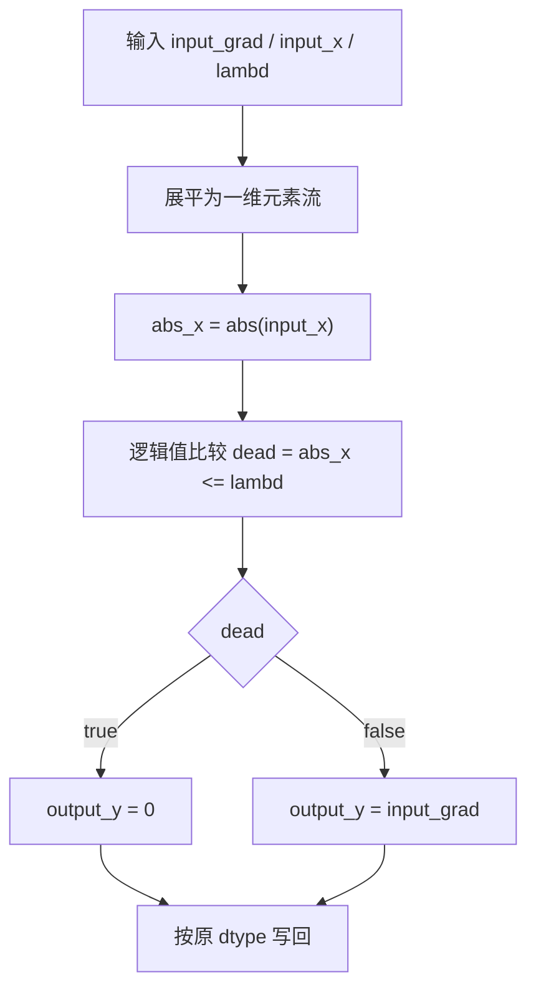
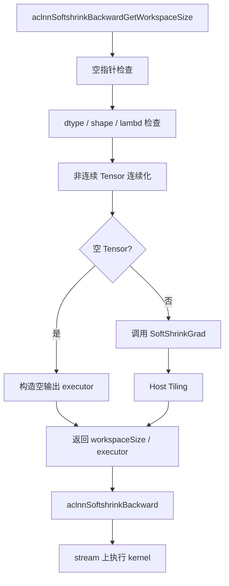
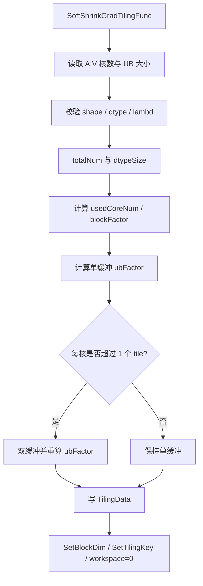
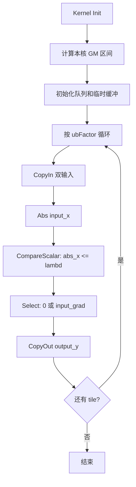

# **需求背景**

## **需求来源**

基于 CANN 内置 `SoftShrinkGrad` 算子历史 TBE 实现，使用 Ascend C 编程语言完成改造与优化，在 Atlas A2 / Atlas A3（ascend910b / ascend910_93）场景下补齐 Softshrink 激活函数反向传播能力，并保证功能、精度、数据类型、数据格式和性能与原 TBE 算子对齐。

SoftShrinkGrad 是 Softshrink 的反向算子。它根据正向输入 `input_x` 与阈值 `lambd` 的关系，选择透传上游梯度 `input_grad` 或输出 0，得到本层输入梯度 `output_y`。本设计先分析 TBE 原型与计算语义，再给出 Ascend C 的 host、kernel、ACLNN 适配和测试方案。

TBE kernel 参考路径：`${ASCEND_INSTALL_PATH}/opp/built-in/op_impl/ai_core/tbe/impl/dynamic`

算子原型参考路径：`${ASCEND_INSTALL_PATH}/opp/built-in/op_proto/inc`

算子信息库参考路径：`${ASCEND_INSTALL_PATH}/opp/built-in/op_impl/ai_core/tbe/config/ascend910b`

TBE DSL API 参考路径：`${ASCEND_INSTALL_PATH}/python/site-packages/tbe/dsl`

## **TBE 源码分析**

通过对 SoftShrinkGrad 原型、TBE 计算表达式和 `aclnnSoftshrinkBackward` 语义的分析，算子属于无归约、无广播的逐元素激活反向算子。核心过程可归纳为：对 `input_x` 取绝对值，进行逻辑值比较，再按比较结果选择 0 或 `input_grad`。

### **1. 算子原型**

SoftShrinkGrad 原型包含两个必选 Tensor 输入、一个 float 属性和一个 Tensor 输出。

```cpp
REG_OP(SoftShrinkGrad)
    .INPUT(input_grad, TensorType({DT_FLOAT16, DT_FLOAT, DT_BF16}))
    .INPUT(input_x, TensorType({DT_FLOAT16, DT_FLOAT, DT_BF16}))
    .OUTPUT(output_y, TensorType({DT_FLOAT16, DT_FLOAT, DT_BF16}))
    .ATTR(lambd, Float, 0.5)
    .OP_END_FACTORY_REG(SoftShrinkGrad)
```

原型语义：

| **名称** | **类别** | **说明** |
| -------- | -------- | -------- |
| input_grad | 输入 | 上游回传梯度 Tensor。 |
| input_x | 输入 | Softshrink 正向输入 Tensor，与 `input_grad` 的 dtype、format 和 shape 一致。 |
| lambd | 属性 | Softshrink 阈值，float，默认值为 `0.5`，要求 `lambd >= 0`。 |
| output_y | 输出 | 本层输入梯度，与 `input_grad` 的 dtype、format 和 shape 一致。 |

对应 ACLNN 两段式接口：

```cpp
aclnnStatus aclnnSoftshrinkBackwardGetWorkspaceSize(
    const aclTensor* gradOutput,
    const aclTensor* self,
    const aclScalar* lambd,
    aclTensor* gradInput,
    uint64_t* workspaceSize,
    aclOpExecutor** executor);

aclnnStatus aclnnSoftshrinkBackward(
    void* workspace,
    uint64_t workspaceSize,
    aclOpExecutor* executor,
    const aclrtStream stream);
```

其中 `gradOutput`、`self`、`gradInput` 分别对应内部算子 `input_grad`、`input_x`、`output_y`。

### **2. 数学公式**

Softshrink 正向函数为：

```text
softshrink(x) = x - lambd,  x >  lambd
                x + lambd,  x < -lambd
                0,          -lambd <= x <= lambd
```

因此反向梯度为：

```text
output_y[i] = input_grad[i],  input_x[i] >  lambd
output_y[i] = input_grad[i],  input_x[i] < -lambd
output_y[i] = 0,              -lambd <= input_x[i] <= lambd
```

等价写法：

```text
dead[i]     = abs(input_x[i]) <= lambd
output_y[i] = dead[i] ? 0 : input_grad[i]
```

边界 `input_x == lambd` 和 `input_x == -lambd` 均输出 0。比较结果按逻辑真假参与选择，不要求通过二进制逐位相等判断结果。

### **3. 支持的数据类型**

| **参数** | **支持 dtype** | **说明** |
| -------- | -------------- | -------- |
| input_grad | float16 / float32 / bfloat16 | 上游梯度。 |
| input_x | float16 / float32 / bfloat16 | dtype 与 `input_grad` 一致。 |
| output_y | float16 / float32 / bfloat16 | dtype 跟随 `input_grad`。 |
| lambd | float | host 侧读取后写入 tiling data。 |

说明：

- `input_grad`、`input_x`、`output_y` 的 dtype 必须一致。
- float32 直接参与比较与选择。
- float16 可在原类型上执行矢量运算；对阈值附近精度敏感场景，可将比较输入提升到 float32。
- bfloat16 的比较路径提升到 float32，选择结果再转换回 bfloat16。

### **4. 支持的数据格式**

SoftShrinkGrad 按元素处理，不依赖维度语义。TBE 核心路径按 ND 连续地址展平计算，不涉及 NC1HWC0、FRACTAL_NZ 等特殊数据排布。

| **参数** | **format** | **说明** |
| -------- | ---------- | -------- |
| input_grad | ND | ACLNN 侧将非连续 Tensor 转为连续 Tensor 后调用内部算子。 |
| input_x | ND | 与 `input_grad` 保持相同 shape。 |
| output_y | ND | shape 与输入一致。 |

### **5. Shape 与属性约束**

| **约束项** | **规则** |
| ---------- | -------- |
| input_grad / input_x shape | 两个输入 shape 一致，逐元素一一对应。 |
| output_y shape | 与 `input_grad` shape 一致。 |
| rank | 支持标量及 1～8 维 Tensor。 |
| dtype | 三个 Tensor dtype 一致，且属于 FP16 / FP32 / BF16。 |
| lambd | float，默认 `0.5`，必须大于或等于 0。 |
| 广播 | 内部 SoftShrinkGrad 不涉及广播。 |
| 空 Tensor | ACLNN 侧识别后直接返回空输出，不启动 AICore kernel。 |

### **6. 计算语义**

TBE 计算可抽象为以下阶段：

1. 将 `input_grad` 与 `input_x` 搬入 UB。
2. 计算 `abs_x = abs(input_x)`。
3. 对 `abs_x <= lambd` 进行逻辑值比较，生成有效元素掩码。
4. 掩码为真时选择 0，掩码为假时选择 `input_grad`。
5. 将结果按原 dtype 写回 `output_y`。

特殊值语义：

- 当 `lambd` 为有限值时，`input_x` 为 `+Inf` 或 `-Inf`，`abs(input_x) > lambd`，透传 `input_grad`。
- `input_x` 为 NaN 时，`abs(input_x) <= lambd` 的逻辑比较结果为 false，透传 `input_grad`。
- `input_x` 为 `+0` 或 `-0` 时，当 `lambd >= 0`，输出 0。

### **TBE 计算流程图**



# **需求分析**

## **外部组件依赖**

不涉及第三方组件依赖。算子实现依赖 CANN / Ascend C 基础组件、ACLNN 调用框架、op_host tiling 框架、`kernel_operator.h` 和算子开源仓公共构建能力。

## **内部适配模块**

设计包含以下模块：

- op graph：声明 `SoftShrinkGrad` 原型及 `lambd` 属性。
- op host：完成 InferShape、InferDataType、参数校验、平台信息读取、分核、UB 切分、单双缓冲选择和 tiling 下发。
- op kernel：完成双输入搬运、绝对值、逻辑值比较、选择和结果写回。
- op api：实现 `aclnnSoftshrinkBackwardGetWorkspaceSize` 与 `aclnnSoftshrinkBackward` 两段式接口，处理非连续 Tensor、空 Tensor 和参数检查。
- tests / docs：覆盖边界值、特殊值、尾块、泛化 shape、精度和性能验证。

## **需求模块设计**

### **算子原型**

| **名称** | **类别** | **dtype** | **format** | **shape** | **介绍** |
| -------- | -------- | --------- | ---------- | --------- | -------- |
| input_grad | 输入 | FP16 / FP32 / BF16 | ND | 标量或 1～8 维 | 上游梯度。 |
| input_x | 输入 | 与 `input_grad` 一致 | ND | 与 `input_grad` 一致 | Softshrink 正向输入。 |
| output_y | 输出 | 与 `input_grad` 一致 | ND | 与 `input_grad` 一致 | 本层输入梯度。 |

属性：

| **属性** | **类型** | **默认值** | **说明** |
| -------- | -------- | ---------- | -------- |
| lambd | Float | `0.5` | Softshrink 阈值，要求非负。 |

## **算子支持型号**

Atlas A2 训练系列产品 / Atlas 800I A2 推理产品（ascend910b）、Atlas A3 系列产品（ascend910_93）。

# **需求详细设计**

## **使能方式**

| **上层框架** | **涉及的框架勾选** |
| ------------ | ------------------ |
| TF训练/推理 | |
| Pytorch训练/推理 | √ |
| ATC推理 | √ |
| Aclnn直调 | √ |
| OPAT调优 | |
| SGAT子图切分 | |

## **总体设计**

SoftShrinkGrad 是纯 AIV 逐元素算子，无归约、无核间依赖。总体采用“按连续元素分核 + 核内按 UB tile 流水”的方案：host 将输入展平并均分到多个 Vector Core；kernel 通过 CopyIn、Compute、CopyOut 流水执行。大 shape 使用全部可用 AIV 核，小 shape 收敛核数以控制启动和调度开销。


## **ACLNN 侧设计**

第一段接口完成以下处理：

1. 检查 `gradOutput`、`self`、`lambd`、`gradInput`、`workspaceSize`、`executor` 非空。
2. 检查 `gradOutput`、`self`、`gradInput` dtype 一致且属于 FP16 / FP32 / BF16。
3. 检查输入输出 shape 一致，输出 shape 等于 `self` shape。
4. 检查 `lambd` 可转换为 float 且 `lambd >= 0`。
5. 对非连续 Tensor 生成连续 Tensor，内部以 ND 连续地址执行。
6. 空 Tensor 直接构造空输出 executor，不启动 kernel。
7. 非空 Tensor 调用 `SoftShrinkGrad`，返回 workspace 大小和 executor。

第二段接口在给定 stream 上执行 executor。内部算子无需用户 workspace，除框架系统预留外 `workspaceSize` 可为 0。

## **host 侧设计方案**

### **1. InferShape 与 InferDataType**

推导规则：

```text
output_y.shape = input_grad.shape
output_y.dtype = input_grad.dtype
```

InferShape 将 `input_grad` 的 shape 复制给 `output_y`；InferDataType 将 `input_grad` dtype 复制给 `output_y`。

### **2. 参数校验**

host tiling 校验内容：

| **校验项** | **处理** |
| ---------- | -------- |
| shape size | `input_grad`、`input_x`、`output_y` 元素个数一致。 |
| dtype | 两个输入 dtype 一致，且为 FP16 / FP32 / BF16。 |
| lambd | 属性存在且 `lambd >= 0`。 |
| totalNum | ACLNN 空 Tensor 已提前返回；进入 kernel 的 `totalNum > 0`。 |
| platform | AIV 核数和 UB 大小均大于 0。 |

### **3. 分核策略**

按连续元素切分，保证每个核处理一段不重叠地址：

```text
elemPerBlock = 32 / sizeof(T)
totalBlocks  = ceilDiv(totalNum, elemPerBlock)
targetBlocksPerCore = 128            # 约 4 KB 有效数据/核的下限
usedCoreNum = min(aivCoreNum, ceilDiv(totalBlocks, targetBlocksPerCore))
usedCoreNum = max(usedCoreNum, 1)
blockFactor = ceilDiv(totalNum, usedCoreNum)
usedCoreNum = ceilDiv(totalNum, blockFactor)
```

大 shape 的 `usedCoreNum` 收敛到全部 AIV 核；小 shape 减少空闲核和调度开销。每核区间为：

```text
start = blockIdx * blockFactor
end   = min(start + blockFactor, totalNum)
coreLength = end - start
```

最后一个核自然吸收非均分尾部，不需要核间同步。

### **4. UB 切分**

UB 预算扣除 TPipe、队列管理和矢量 API 临时空间后计算 `ubFactor`。缓存布局：

| **缓存** | **用途** |
| -------- | -------- |
| gradInQueue | `input_grad` 搬入队列。 |
| xInQueue | `input_x` 搬入队列。 |
| outQueue | `output_y` 搬出队列。 |
| maskBuf | 逻辑值比较结果。 |
| xFloatBuf | FP16 高精度或 BF16 比较路径的 float32 临时缓冲。 |
| gradFloatBuf | BF16 选择路径的 float32 临时缓冲，可与输出计算缓冲复用。 |

单双缓冲策略：

- `coreLength <= singleBufferUbFactor` 时使用单缓冲，减少队列初始化和 UB 占用。
- 需要两个及以上 tile 时使用双缓冲，使 MTE2、Vector、MTE3 在相邻 tile 间流水重叠。
- `ubFactor` 按 32B 搬运对齐和矢量 repeat 对齐向下取整，且至少能容纳一个 block。

### **5. TilingKey 规划**

TilingKey 同时表达 dtype 与缓冲模式：

| **dtypeMode** | **Tensor 类型** | **计算路径** |
| ------------- | --------------- | ------------ |
| 0 | half | 原类型选择；阈值比较按实现模式选择 half 或 float32。 |
| 1 | float | float32 原类型计算。 |
| 2 | bfloat16_t | input_x / input_grad 转 float32 后比较选择，再转回 BF16。 |

| **bufferMode** | **含义** |
| -------------- | -------- |
| 0 | 单缓冲。 |
| 1 | 双缓冲。 |

kernel 入口通过模板参数实例化 `Run<T, BUFFER_MODE>`，避免在主循环中重复判断 dtype 和缓冲模式。

### **6. TilingData 参数**

`SoftShrinkGradTilingData` 规划如下：

| **字段** | **类型** | **含义** |
| -------- | -------- | -------- |
| totalNum | uint64 | 总元素数。 |
| usedCoreNum | uint32 | 实际参与计算的 AIV 核数。 |
| blockFactor | uint64 | 每核最多处理的元素数。 |
| ubFactor | uint64 | 每次 UB 迭代处理的元素数。 |
| bufferMode | uint32 | 0 单缓冲，1 双缓冲。 |
| dtypeMode | uint32 | 0 FP16，1 FP32，2 BF16。 |
| lambd | float | 非负阈值。 |
| reserved | uint32 | 对齐预留字段。 |

### **7. Workspace 规划**

SoftShrinkGrad 不涉及跨核归约、全核同步和中间结果落盘，因此无用户 workspace：

```text
workspace[0] = 0
```

## **kernel 侧设计方案**

### **1. 初始化**

kernel 根据 `GetBlockIdx()` 计算本核区间，绑定三个 GlobalTensor：

```text
globalOffset = blockIdx * blockFactor
coreLength   = min(blockFactor, totalNum - globalOffset)

gradGm = input_grad + globalOffset
xGm    = input_x    + globalOffset
outGm  = output_y   + globalOffset
```

随后按 TilingKey 初始化输入输出队列、比较 mask 和必要的 float32 临时缓冲。

### **2. CopyIn**

每次迭代处理 `currentNum = min(ubFactor, coreLength - offset)` 个元素：

- 使用 `DataCopyPad` 将 `input_grad`、`input_x` 搬入 UB。
- 对齐区间之外的 lane 填 0，避免尾块未初始化数据参与比较。
- FP32 直接进入计算；FP16 / BF16 根据计算路径转换 `input_x`，BF16 同时转换 `input_grad`。

### **3. Compute**

核心计算采用逻辑值比较和选择：

```text
absX = Abs(input_x)
dead = CompareScalar(absX, lambd, CMPMODE::LE)
zero = Duplicate(0)
out  = Select(dead, zero, input_grad)
```

实现要点：

- 使用 `CMPMODE::LE` 生成“死区”逻辑掩码，保证 `±lambd` 边界输出 0。
- `Select` 在掩码为真时选择 0，为假时选择上游梯度。
- 比较与选择只覆盖 `currentNum` 个有效元素；若矢量 API 需要对齐计数，先将补齐区数据初始化为 0。
- FP32 路径直接计算。
- FP16 路径优先避免对 `input_grad` 的无效转换；仅比较精度需要时将 `input_x` 提升到 FP32。
- BF16 路径统一提升到 FP32 完成比较和选择，最后使用 `CAST_RINT` 转回 BF16。

### **4. CopyOut**

- FP16 / FP32 原类型路径直接写回。
- BF16 或其他提升计算路径先转换回 `T`。
- 使用 `DataCopyPad` 按真实 `currentNum` 写回，尾块不覆盖输出边界外地址。

### **5. Process**

```text
loopCount = ceilDiv(coreLength, ubFactor)
for i in [0, loopCount):
    currentNum = min(ubFactor, coreLength - i * ubFactor)
    CopyIn(i, currentNum)
    Compute(currentNum)
    CopyOut(i, currentNum)
```

各核只访问自己的连续区间，无原子操作、无 workspace、无 `SyncAll`。

## **Ascend C 流程图**

### **1. ACLNN 调用流程**



### **2. Host Tiling 流程**



### **3. Kernel 主流程**



## **支持硬件**

| **支持的芯片版本** | **涉及勾选** |
| ------------------ | ------------ |
| 香橙派 OrangePi AIpro | |
| Atlas 200I/500 A2 推理产品 | |
| Atlas A2 训练系列产品 / Atlas A3 系列产品 | √ |

## **算子约束限制**

- 支持 ND 格式，内部 kernel 按连续一维地址处理。
- `input_grad`、`input_x`、`output_y` 的 dtype 和 shape 必须一致。
- 支持 float16、float32、bfloat16。
- `lambd` 为 float，默认 `0.5`，要求 `lambd >= 0`。
- 内部 SoftShrinkGrad 不支持广播。
- ACLNN 支持非连续 Tensor，执行前转换为连续 Tensor。
- ACLNN 支持空 Tensor，空输入不启动 AICore kernel。
- 边界 `input_x == ±lambd` 输出 0。

# **特性交叉分析可维可测分析**

## **功能测试设计**

自验证需覆盖以下场景：

| **类别** | **测试点** |
| -------- | ---------- |
| dtype | FP16、FP32、BF16。 |
| rank | 标量、1D、2D、4D、8D。 |
| shape | 单元素、32B 对齐、非 32B 对齐、小 shape、大 shape、满核场景、多 tile 场景。 |
| lambd | `0`、默认 `0.5`、普通正数、大于全部输入绝对值的阈值。 |
| 边界 | `-lambd`、`+lambd`、阈值内外相邻可表示值。 |
| 特殊值 | `+0`、`-0`、`+Inf`、`-Inf`、NaN。 |
| 梯度值 | 正数、负数、0、Inf、NaN。 |
| 内存 | 连续 Tensor、非连续 Tensor、空 Tensor、尾块。 |

Golden 参考：

```python
def softshrink_grad_golden(input_grad, input_x, lambd):
    return np.where(np.abs(input_x) <= lambd, 0, input_grad)
```

比较方式使用逻辑值与数值误差阈值比较，不将输出文件的二进制逐位一致作为唯一判定条件。对 NaN 使用同位置 NaN 等价规则，对 Inf 检查符号和位置一致。

## **精度标准**

| **验收标准** | **描述** | **标准来源** |
| ------------ | -------- | ------------ |
| 精度标准 | 满足 CANN Judge 对应题目的默认精度阈值；非边界有限值场景输出应为 0 或原 `input_grad`。 | 任务书 / CANN Judge |
| 边界标准 | `input_x == ±lambd` 必须输出 0；阈值外侧透传 `input_grad`。 | TBE / PyTorch 语义 |
| 特殊值标准 | NaN、Inf 按逻辑比较语义处理，结果位置与 Golden 一致。 | IEEE 比较语义 |

## **性能标准**

| **验收标准** | **描述** | **标准来源** |
| ------------ | -------- | ------------ |
| 满核性能 | 所有核参与计算场景下，Ascend C 性能不低于 TBE 的 95%。 | 任务书 |
| 小 shape | 10 us 以下场景若与 TBE 相差不超过 3 us，可结合性能仿真图分析启动与调度开销。 | 任务书 |
| 测试一致性 | Ascend C 与 TBE 使用相同 dtype、shape、lambd、预热次数、测量次数和运行环境。 | 自验证规范 |

性能优化关注点：

- 大 shape 满核切分和负载均衡。
- 单双缓冲切换阈值。
- FP16 路径避免无必要的 `input_grad -> float32 -> FP16` 往返转换。
- BF16 临时缓冲复用。
- Compare + Select 矢量指令流水和尾块开销。

## **兼容性分析**

本算子为 TBE 到 Ascend C 的等价迁移。算子名称、输入输出、属性默认值和数学语义保持不变；ACLNN 接口保持 `aclnnSoftshrinkBackward` 两段式调用方式，不影响现有上层框架调用。

## **风险分析**

| **风险** | **应对方案** |
| -------- | ------------ |
| 阈值边界比较错误 | 使用 `abs_x <= lambd` 生成死区掩码，专项覆盖 `±lambd`。 |
| FP16 / BF16 阈值精度差异 | 比较路径提升到 FP32，并对相邻可表示值做测试。 |
| 尾块脏数据影响比较 | CopyIn 补零，Compute 限定有效长度，CopyOut 按真实长度写回。 |
| 小 shape 多核开销 | 根据工作量动态收敛核数，单 tile 使用单缓冲。 |
| BF16 性能损失 | 复用 float32 缓冲，减少 Cast 次数，保持搬运与计算流水。 |

## **关联的 Issue**

暂无。

## **文档更新**

本文档。

## **类型标签**

- [ ] Bug 修复
- [ ] 新特性
- [ ] 性能优化
- [ ] 文档更新
- [x] 其他：社区任务算子设计文档
