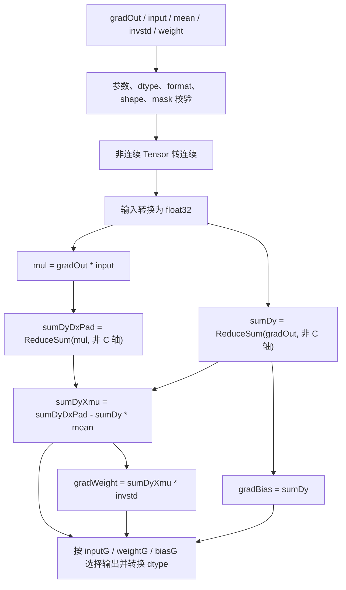
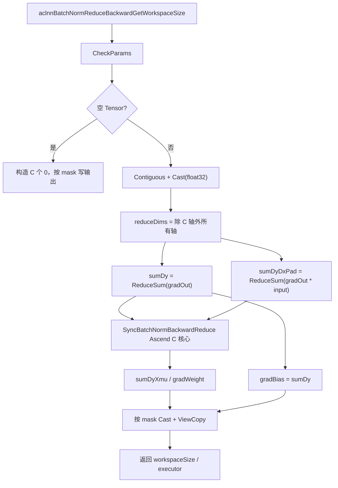
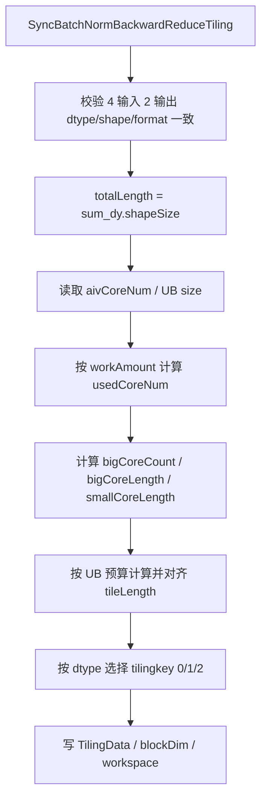
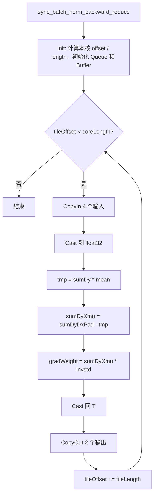
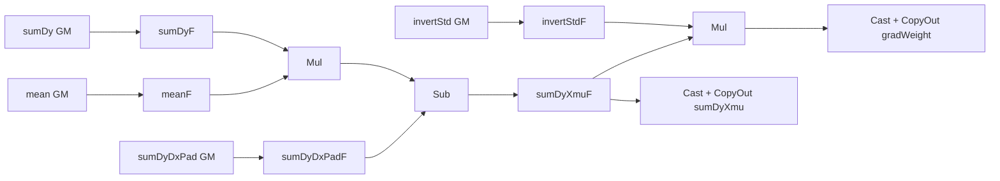

# **需求背景**

## **需求来源**

基于 CANN 内置 `aclnnBatchNormReduceBackward` 算子的历史 TBE 实现，使用 Ascend C 编程语言完成 `SyncBatchNormBackwardReduce` 核心算子的改造与优化，在 Atlas A2 训练系列产品 / Atlas A3 系列产品上补齐同步 BatchNorm 反向传播规约阶段的 Ascend C 能力，并保证功能、精度、性能和泛化能力与原实现对齐。

任务书：[SyncBatchNormBackwardReduce 算子开发任务书](https://gitcode.com/cann/cann-ops-competitions/blob/master/04_tasks/01_community-task-2026/docs/202607/SyncBatchNormBackwardReduce_task_doc.md)

算子开源仓参考实现：[ops-nn/norm/sync_batch_norm_backward_reduce](https://gitcode.com/cann/ops-nn/tree/master/norm/sync_batch_norm_backward_reduce)

TBE 算子实现路径：`${ASCEND_INSTALL_PATH}/opp/built-in/op_impl/ai_core/tbe/impl/dynamic`

TBE 算子原型路径：`${ASCEND_INSTALL_PATH}/opp/built-in/op_proto/inc`

TBE 算子信息库路径：`${ASCEND_INSTALL_PATH}/opp/built-in/op_impl/ai_core/tbe/config/ascend910b`

## **TBE 源码分析**

`aclnnBatchNormReduceBackward` 对应同步 BatchNorm 反向传播中的规约阶段。对外 ACLNN 接口先沿除 channel 轴以外的维度计算 `sumDy` 和 `sumDyDxPad`，再调用 `SyncBatchNormBackwardReduce` 核心算子完成中心化修正和 `gradWeight` 计算。

### **1. ACLNN 接口原型**

```cpp
aclnnStatus aclnnBatchNormReduceBackwardGetWorkspaceSize(
    const aclTensor* gradOut,
    const aclTensor* input,
    const aclTensor* mean,
    const aclTensor* invstd,
    const aclTensor* weight,
    const bool inputG,
    const bool weightG,
    const bool biasG,
    aclTensor* sumDy,
    aclTensor* sumDyXmu,
    aclTensor* gradWeight,
    aclTensor* gradBias,
    uint64_t* workspaceSize,
    aclOpExecutor** executor);
```

ACLNN 接口语义如下。

| **名称** | **类别** | **说明** |
| -------- | -------- | -------- |
| gradOut | 输入 | 损失函数对 BatchNorm 输出的梯度，记为 `dy`。 |
| input | 输入 | BatchNorm 正向输入，记为 `x`。 |
| mean | 输入 | 正向阶段按 channel 统计的均值 `μ`。 |
| invstd | 输入 | 正向阶段标准差的倒数 `1 / sqrt(σ² + eps)`。 |
| weight | 可选输入 | BatchNorm 缩放参数 `γ`。该规约阶段的四个输出公式不依赖其数值，保留该参数用于接口兼容。 |
| inputG | 属性 | 是否需要输出 `sumDy` 和 `sumDyXmu`。 |
| weightG | 属性 | 是否需要输出 `gradWeight`。 |
| biasG | 属性 | 是否需要输出 `gradBias`。 |
| sumDy | 可选输出 | `dy` 沿非 channel 轴的规约和。 |
| sumDyXmu | 可选输出 | `dy * (x - μ)` 沿非 channel 轴的规约和。 |
| gradWeight | 可选输出 | 缩放参数 `γ` 的梯度。 |
| gradBias | 可选输出 | 偏置参数 `β` 的梯度，数值等于 `sumDy`。 |

### **2. 核心算子原型**

ACLNN 规约得到 channel 向量后，调用以下核心算子。核心算子为纯逐元素计算，不再执行跨 channel 规约。

```cpp
REG_OP(SyncBatchNormBackwardReduce)
    .INPUT(sum_dy, TensorType({DT_FLOAT16, DT_FLOAT, DT_BF16}))
    .INPUT(sum_dy_dx_pad, TensorType({DT_FLOAT16, DT_FLOAT, DT_BF16}))
    .INPUT(mean, TensorType({DT_FLOAT16, DT_FLOAT, DT_BF16}))
    .INPUT(invert_std, TensorType({DT_FLOAT16, DT_FLOAT, DT_BF16}))
    .OUTPUT(sum_dy_xmu, TensorType({DT_FLOAT16, DT_FLOAT, DT_BF16}))
    .OUTPUT(y, TensorType({DT_FLOAT16, DT_FLOAT, DT_BF16}))
    .OP_END_FACTORY_REG(SyncBatchNormBackwardReduce)
```

其中 `y` 对应 `gradWeight`。

### **3. 数学语义**

设输入张量逻辑 shape 为 `(N, C, D1, ..., Dk)`，channel 轴固定为第 1 维，规约轴集合为：

```text
reduceDims = {0, 2, 3, ..., rank - 1}
```

对每个 channel `c`：

```text
sumDy[c]       = Σ gradOut[n, c, ...]
sumDyDxPad[c]  = Σ (gradOut[n, c, ...] * input[n, c, ...])
sumDyXmu[c]    = sumDyDxPad[c] - sumDy[c] * mean[c]
gradWeight[c]  = sumDyXmu[c] * invstd[c]
gradBias[c]    = sumDy[c]
```

等价形式为：

```text
sumDyXmu[c]   = Σ gradOut[n, c, ...] * (input[n, c, ...] - mean[c])
gradWeight[c] = Σ gradOut[n, c, ...] * (input[n, c, ...] - mean[c]) * invstd[c]
```

### **4. 支持的数据类型**

| **参数** | **支持 dtype** | **说明** |
| -------- | -------------- | -------- |
| gradOut / input | float16 / float32 / bfloat16 | 两者 dtype 一致。 |
| mean / invstd / weight | float16 / float32 / bfloat16 | ACLNN 层统一转换为 float32 参与计算。 |
| sumDy / sumDyXmu / gradWeight / gradBias | float16 / float32 / bfloat16 | 根据输出 Tensor dtype 从 float32 结果转换。 |
| 核心算子六个 Tensor | float16 / float32 / bfloat16 | 直接图模式调用时输入输出 dtype 保持一致。 |

Atlas A2 / Atlas A3 支持 float16、float32、bfloat16。计算过程统一使用 float32 累加或中间计算，最终转换为目标输出 dtype。

### **5. 支持的数据格式**

ACLNN 接口支持公开格式 `ND`、`NCHW`、`NHWC`、`HWCN`、`NCDHW`、`NDHWC`，不支持私有格式。`gradOut` 与 `input` 的逻辑 shape、dtype 和数据格式保持一致，非连续 Tensor 先转换为连续 Tensor。

`SyncBatchNormBackwardReduce` 核心算子的输入输出均为 channel 统计向量，统一使用 ND 格式。

### **6. Shape 与属性约束**

| **约束项** | **规则** |
| ---------- | -------- |
| gradOut / input rank | 2～8 维。 |
| gradOut / input shape | 两者逻辑 shape 完全一致。 |
| channel 轴 | 固定为逻辑 shape 的第 1 维，`C > 0`。 |
| mean / invstd / weight | 1 维，元素个数为 `C`；`weight` 可为空。 |
| 四个 ACLNN 输出 | 1 维，元素个数为 `C`；由三个 mask 控制是否必须提供。 |
| 核心算子输入输出 | shape、dtype、format 一致，典型 shape 为 `(C,)`。 |
| 空 Tensor | 当 `N` 或空间维为 0 且 `C > 0` 时支持空输入，所需输出填 0。 |
| 广播 | ACLNN 规约阶段不涉及输入广播；核心算子六个 Tensor 一一对应，不支持广播。 |

### **7. TBE 计算流程**



# **需求分析**

## **外部组件依赖**

算子依赖 CANN / Ascend C 基础组件、ACLNN 两段式接口框架、op_host tiling 框架、`kernel_operator` 以及现有 `Contiguous`、`Cast`、`Mul`、`ReduceSum`、`ViewCopy` 基础算子。

不引入第三方组件。

## **内部适配模块**

设计包含以下模块：

- op_api：对齐 `aclnnBatchNormReduceBackward` 接口，完成参数校验、非连续转换、空 Tensor 处理、规约子图编排、mask 输出选择和反向转换。
- op_def / op_graph：声明 `SyncBatchNormBackwardReduce` 的四输入、两输出、dtype 和 ND format 约束。
- op_host：完成输出 shape 推导、dtype 一致性校验、平台信息读取、按 channel 向量长度分核、UB 切分、tilingkey 和 workspace 设置。
- op_kernel：融合执行 `Mul + Sub + Mul`，对 float16 / bfloat16 使用 float32 中间计算，并完成尾块处理。
- tests / docs：覆盖 ACLNN、图模式、空 Tensor、非连续 Tensor、mask 组合、动态 shape、dtype 和性能场景。

## **需求模块设计**

### **ACLNN 算子原型**

| **名称** | **类别** | **dtype** | **format** | **shape** | **介绍** |
| -------- | -------- | --------- | ---------- | --------- | -------- |
| gradOut | 输入 | fp16 / fp32 / bf16 | 公开非私有格式 | 2～8 维 | 输出梯度。 |
| input | 输入 | 与 `gradOut` 一致 | 与 `gradOut` 一致 | 与 `gradOut` 一致 | 正向输入。 |
| mean | 输入 | fp16 / fp32 / bf16 | ND | `(C,)` | channel 均值。 |
| invstd | 输入 | fp16 / fp32 / bf16 | ND | `(C,)` | channel 标准差倒数。 |
| weight | 可选输入 | fp16 / fp32 / bf16 | ND | `(C,)` | 接口兼容参数。 |
| sumDy | 可选输出 | fp16 / fp32 / bf16 | ND | `(C,)` | `inputG=true` 时输出。 |
| sumDyXmu | 可选输出 | fp16 / fp32 / bf16 | ND | `(C,)` | `inputG=true` 时输出。 |
| gradWeight | 可选输出 | fp16 / fp32 / bf16 | ND | `(C,)` | `weightG=true` 时输出。 |
| gradBias | 可选输出 | fp16 / fp32 / bf16 | ND | `(C,)` | `biasG=true` 时输出。 |

### **核心算子原型**

| **名称** | **类别** | **dtype** | **format** | **shape** | **介绍** |
| -------- | -------- | --------- | ---------- | --------- | -------- |
| sum_dy | 输入 | fp16 / fp32 / bf16 | ND | 任意相同 shape，典型为 `(C,)` | `dy` 的规约和。 |
| sum_dy_dx_pad | 输入 | 与 `sum_dy` 一致 | ND | 与 `sum_dy` 一致 | `dy * x` 的规约和。 |
| mean | 输入 | 与 `sum_dy` 一致 | ND | 与 `sum_dy` 一致 | 均值。 |
| invert_std | 输入 | 与 `sum_dy` 一致 | ND | 与 `sum_dy` 一致 | 标准差倒数。 |
| sum_dy_xmu | 输出 | 与 `sum_dy` 一致 | ND | 与 `sum_dy` 一致 | 中心化后的乘积规约和。 |
| y | 输出 | 与 `sum_dy` 一致 | ND | 与 `sum_dy` 一致 | `gradWeight`。 |

## **算子支持型号**

Atlas A2 训练系列产品、Atlas A3 系列产品。

# **需求详细设计**

## **使能方式**

| **上层框架** | **涉及的框架勾选** |
| ------------ | ------------------ |
| TF训练/推理 | |
| Pytorch训练/推理 | √ |
| ATC推理 | √ |
| Aclnn直调 | √ |
| OPAT调优 | √ |
| SGAT子图切分 | |

## **需求总体设计**

整体采用“ACLNN 规约子图 + Ascend C 融合尾处理核心”的分层方案：

1. ACLNN 层复用 `Mul` 和 `ReduceSum`，得到 `sumDy` 与 `sumDyDxPad`。
2. Ascend C 核心算子一次读取四个 channel 向量，融合完成 `sumDyXmu` 与 `gradWeight` 两个结果，避免拆分为三个独立逐元素 kernel。
3. `gradBias` 直接复用 `sumDy`，根据 mask 决定是否写入用户输出。
4. 对非连续、混合输出 dtype、空 Tensor 等接口语义在 ACLNN 层统一处理，核心 kernel 保持连续、同 dtype、同 shape 的纯逐元素计算。

### **host侧设计方案**

#### **1) ACLNN 参数校验**

`CheckParams` 完成以下检查：

- `gradOut`、`input`、`mean`、`invstd` 必须非空指针；`weight` 允许为空。
- 当 `inputG=true` 时，`sumDy`、`sumDyXmu` 必须非空；当 `weightG=true` 时，`gradWeight` 必须非空；当 `biasG=true` 时，`gradBias` 必须非空。
- `gradOut` 与 `input` dtype、format、shape 一致，rank 为 2～8。
- 输入 format 必须为公开非私有格式。
- `C = input.shape[1]` 且 `C > 0`。
- `mean`、`invstd` 以及非空 `weight` 的元素个数为 `C`。
- 所有被 mask 选中的输出元素个数为 `C`，dtype 在支持集合内。

#### **2) 空 Tensor 与可选 weight**

当 `gradOut` 或 `input` 的元素总数为 0、但 `C > 0` 时，规约结果按数学定义均为 0：

```text
sumDy = 0
sumDyXmu = 0
gradWeight = 0
gradBias = 0
```

ACLNN 层直接构造长度为 `C` 的零 Tensor，并按 mask 写入输出，不启动规约和核心 kernel。

当 `weight == nullptr` 时，为保持接口流程统一，可构造长度为 `C`、值为 1 的临时 Tensor；该参数不参与本算子的输出计算。

#### **3) ACLNN 计算编排**

1. 对 `gradOut`、`input`、`mean`、`invstd` 和非空 `weight` 执行 `Contiguous`。
2. 将参与计算的输入统一转换为 float32。
3. 构造 `reduceDims = [0, 2, ..., rank - 1]`。
4. 计算 `sumDyDxPad = ReduceSum(gradOut * input, reduceDims, keepDim=false)`。
5. 计算 `sumDy = ReduceSum(gradOut, reduceDims, keepDim=false)`。
6. 调用 `SyncBatchNormBackwardReduce(sumDy, sumDyDxPad, mean, invstd)`。
7. 按 mask 和目标 dtype 执行反向 Cast 与 ViewCopy；`gradBias` 直接复用 `sumDy`。

#### **4) InferShape 与 InferDataType**

核心算子两个输出的 shape 均继承 `sum_dy`：

```text
sum_dy_xmu.shape = sum_dy.shape
y.shape           = sum_dy.shape
```

op def 中六个 Tensor 使用同一 dtype 组合，输出 dtype 与 `sum_dy` 一致。tiling 阶段再次校验四个输入和两个输出的 dtype、shape、format 一致。

#### **5) 分核策略**

核心算子按展平后的 `totalLength` 做连续区间分核，不需要跨核同步。

```text
bytesPerElement = 4 * sizeof(T) + 2 * sizeof(T)
workAmount      = totalLength * bytesPerElement
usedCoreNum     = min(aivCoreNum,
                      ceilDiv(workAmount, WORK_PER_CORE),
                      ceilDiv(totalLength, minElementsPerCore))
```

其中 `WORK_PER_CORE` 初始取 16KB，并通过性能测试调整。小 shape 收敛为单核，避免多核启动开销；大 shape 尽可能使用满核，提高 GM 带宽利用率。

采用大小核均分：

```text
baseLength   = totalLength / usedCoreNum
bigCoreCount = totalLength % usedCoreNum
bigCoreLength   = baseLength + 1
smallCoreLength = baseLength
```

前 `bigCoreCount` 个核处理 `bigCoreLength` 个元素，其余核处理 `smallCoreLength` 个元素。

#### **6) UB 切分策略**

host 侧通过平台信息获取 UB 大小，预留系统和临时空间后计算 tile 大小。UB 主要包含：

- 四个输入 Queue：`sumDy`、`sumDyDxPad`、`mean`、`invertStd`。
- 两个输出 Queue：`sumDyXmu`、`gradWeight`。
- float32 中间 Buffer：输入转换、`sumDy * mean`、`sumDyXmu` 和 `gradWeight`。

初始估算：

```text
queueBytesPerElement   = BUFFER_NUM * 6 * sizeof(T)
scratchBytesPerElement = 4 * sizeof(float)
tileLength = floor(ubBudget / (queueBytesPerElement + scratchBytesPerElement))
```

`BUFFER_NUM=2` 时启用 double buffer，使 MTE2 搬入、Vector 计算和 MTE3 搬出在相邻 tile 间重叠。`tileLength` 按 32B 对齐，并限制不超过单核处理长度。

#### **7) tilingkey 规划**

| **dtype** | **tilingkey** | **kernel 类型** | **计算类型** |
| --------- | ------------- | --------------- | ------------ |
| float16 | 0 | `half` | float32 |
| float32 | 1 | `float` | float32 |
| bfloat16 | 2 | `bfloat16_t` | float32 |

不同 dtype 使用模板实例化，kernel 内不做 dtype 运行时分支。

#### **8) TilingData 参数**

| **字段** | **类型** | **含义** |
| -------- | -------- | -------- |
| totalLength | uint64 | 展平后的元素总数。 |
| usedCoreNum | uint32 | 实际参与计算的 AIV 核数。 |
| bigCoreCount | uint32 | 大核数量。 |
| bigCoreLength | uint64 | 每个大核处理的元素数。 |
| smallCoreLength | uint64 | 每个小核处理的元素数。 |
| tileLength | uint64 | 单次 tile 处理的元素数。 |
| bufferNum | uint32 | Queue buffer 数，默认 2。 |
| reserved | uint32 | 对齐预留。 |

#### **9) Workspace 规划**

核心算子无跨核归约和中间 GM 缓存，仅申请系统 API 所需 workspace：

```text
workspaceSize = GetLibApiWorkSpaceSize()
```

ACLNN 层的 `Mul`、`ReduceSum`、`Cast` 等子算子 workspace 由 `aclOpExecutor` 汇总返回。

### **kernel侧设计方案**

Kernel 入口根据 tilingkey 实例化 `Run<T>`，处理逻辑分为 Init、CopyIn、Compute、CopyOut 四个阶段。

#### **1) Init**

- 读取 TilingData 和 `GetBlockIdx()`。
- 根据大小核规则计算当前核的 `coreOffset` 与 `coreLength`。
- 绑定四个输入和两个输出 GlobalTensor，并偏移到当前核起始位置。
- 初始化四个输入 Queue、两个输出 Queue和 float32 临时 Buffer。

#### **2) CopyIn**

按 `tileLength` 循环，从 GM 搬入：

```text
sumDy
sumDyDxPad
mean
invertStd
```

整 tile 使用对齐 `DataCopy`；尾 tile 使用 `DataCopyPad` 或按对齐长度搬运并通过有效元素数控制计算，保证不越界。

#### **3) Compute**

float16 / bfloat16 分支先 Cast 到 float32，float32 分支直接计算：

```text
tmpMulF       = sumDyF * meanF
sumDyXmuF     = sumDyDxPadF - tmpMulF
gradWeightF   = sumDyXmuF * invertStdF
```

随后将 `sumDyXmuF` 和 `gradWeightF` 转换为 `T`，分别放入输出 Queue。float16 / bfloat16 转换采用与 CANN 精度规范一致的舍入模式。

#### **4) CopyOut**

将两个输出 tile 搬回 GM：

```text
sum_dy_xmu[coreOffset + tileOffset]
y[coreOffset + tileOffset]
```

每个核仅写自己的连续区间，不需要原子操作或 `SyncAll`。

#### **5) 特殊场景**

- `totalLength == 0`：由 ACLNN 层提前返回；图模式直接调用时 kernel 不执行有效搬运。
- `totalLength` 小于 32B 对齐元素数：单核单 tile，尾块按有效长度写回。
- `usedCoreNum == 1`：不引入多核分支额外开销。
- `mean`、`invstd` 中包含 `NaN` / `Inf`：遵循 IEEE 计算语义，不额外修改数值。

### **Ascend C 流程图**

#### **1. ACLNN 调用流程图**



#### **2. Host Tiling 流程图**



#### **3. Kernel 主流程图**



#### **4. 单 Tile 数据流图**



## **支持硬件**

| **支持的芯片版本** | **涉及勾选** |
| ------------------ | ------------ |
| 香橙派 OrangePi AIpro | |
| Atlas 200I/500 A2 推理产品 | |
| Atlas A2 训练系列产品 | √ |
| Atlas A3 系列产品 | √ |

## **算子约束限制**

* ACLNN 接口中 `gradOut` 与 `input` 的 dtype、format、shape 必须一致，rank 为 2～8。
* channel 轴固定为逻辑 shape 的第 1 维，且 `C > 0`。
* `mean`、`invstd`、非空 `weight` 和所有有效输出的元素个数必须为 `C`。
* 支持 float16、float32、bfloat16；中间计算和规约统一使用 float32。
* ACLNN 接口支持公开非私有格式和非连续 Tensor；核心算子仅处理连续 ND Tensor。
* 核心算子四个输入和两个输出的 shape、dtype、format 必须一致，不支持广播。
* `inputG` 同时控制 `sumDy` 和 `sumDyXmu`，`weightG` 控制 `gradWeight`，`biasG` 控制 `gradBias`。
* `weight` 为可选输入，但不参与该规约阶段四个输出的数学计算。
* 空 Tensor 仅允许 channel 维非 0，输出按规约恒等值填 0。

# **特性交叉分析可维可测分析**

## **测试设计**

功能与精度用例覆盖：

- float16、float32、bfloat16 三种 dtype。
- rank 2～8，包含 NCHW、NCDHW、ND 以及公开格式场景。
- `C=1`、32B 对齐边界、tile 边界、大小核分界和大 channel 场景。
- N 或空间维为 0 的空 Tensor，`weight=nullptr`。
- `inputG`、`weightG`、`biasG` 的 8 种组合。
- 连续与非连续 Tensor。
- 正常值、负数、0、极小值、极大值、`NaN`、`Inf`。
- 动态 shape、多核均分和非均分尾块。

性能测试覆盖：

- 小 shape 单核快路径，关注 kernel 启动和多子算子调度开销。
- 所有核参与的大 shape 场景，对比 TBE baseline 的端到端 ACLNN 时间。
- 分别统计 `Mul/ReduceSum` 规约阶段和 Ascend C 核心阶段，确认瓶颈来自规约带宽而非尾处理 kernel。
- 对 float16 / bfloat16 检查 Cast 带宽开销，必要时评估 Cast 与 ReduceSum 融合优化。

## **验收标准**

| **验收标准** | **描述** |
| ------------ | -------- |
| 功能标准 | 对齐原 TBE 算子的全部合法输入、dtype、format、空 Tensor、非连续 Tensor和 mask 组合，比较方式使用逻辑值比较。 |
| 精度标准 | 满足 CANN Judge 对应题目的默认精度阈值，不低于 TBE 版本。 |
| 性能标准 | 所有核参与计算场景下，性能不低于原 TBE 算子的 95%。小 shape 低于 10us 且相差不超过 3us 时，提供性能仿真图和等价性分析。 |

## **兼容性分析**

本需求将历史 TBE 核心实现迁移为 Ascend C，ACLNN 接口名称、参数顺序、可选输入、输出 mask、dtype、format、shape 和空 Tensor 语义保持不变，不改变已有上层调用行为。

## **关联的 Issue**

暂无。

## **文档更新**

本文档。

## **类型标签**

* [ ] Bug修复
* [ ] 新特性
* [ ] 性能优化
* [ ] 文档更新
* [x] 其他，请描述：社区任务算子设计文档
