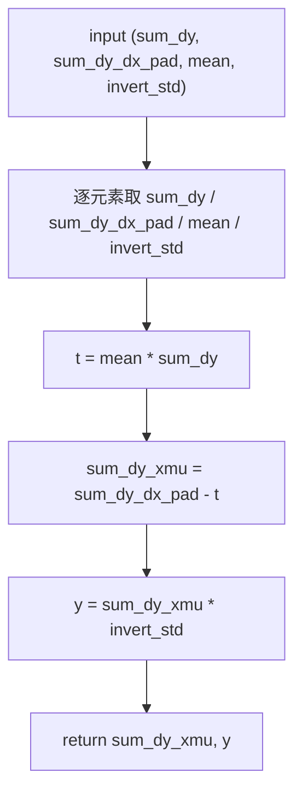
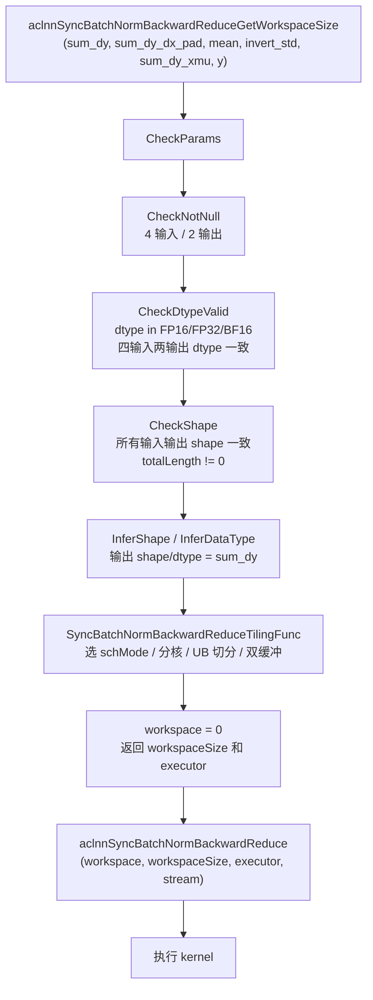
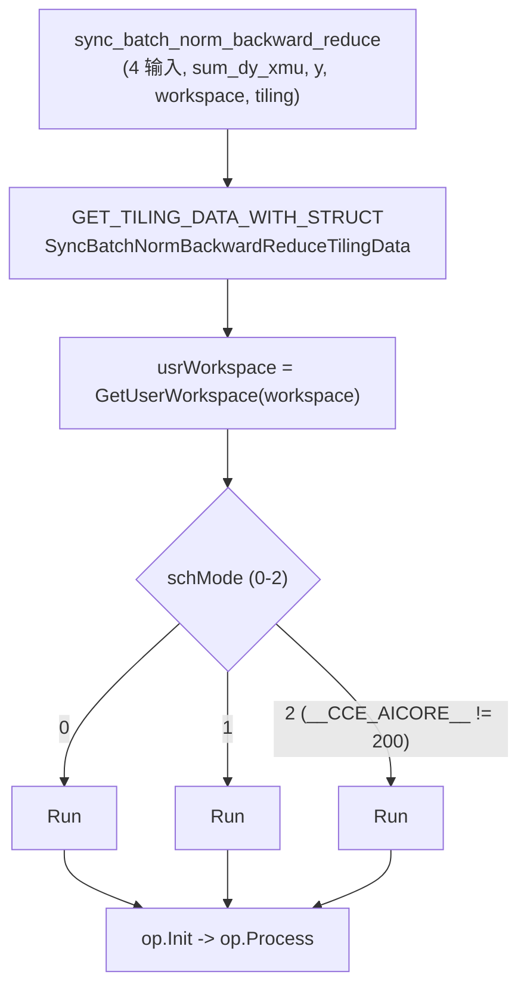
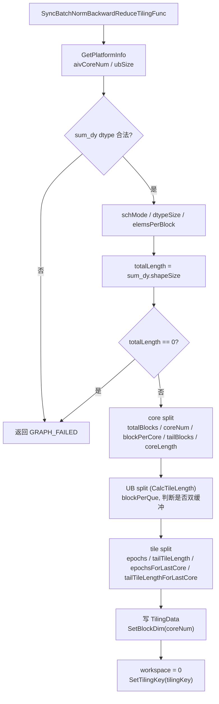
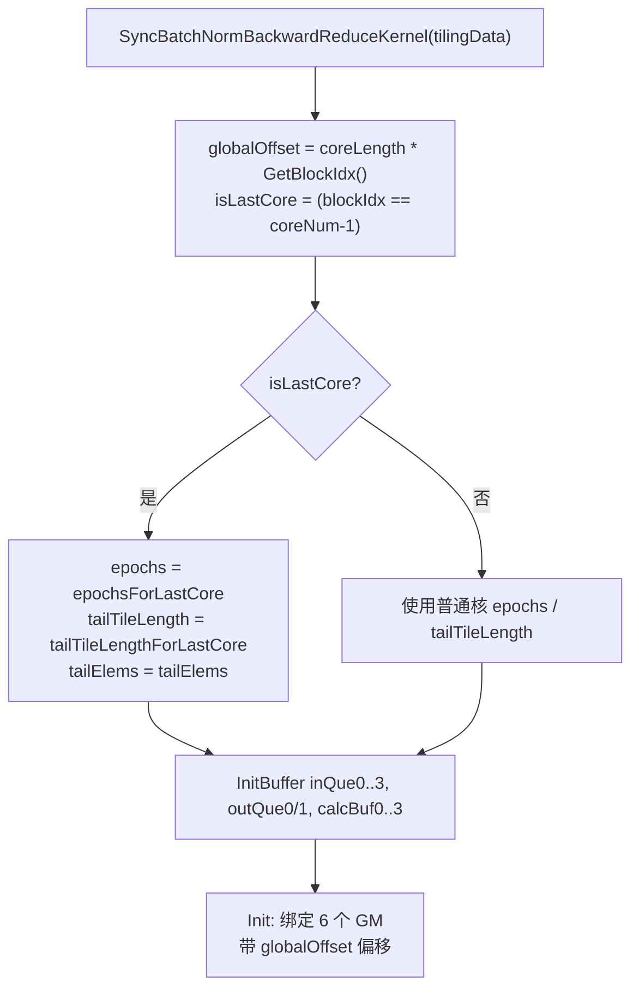
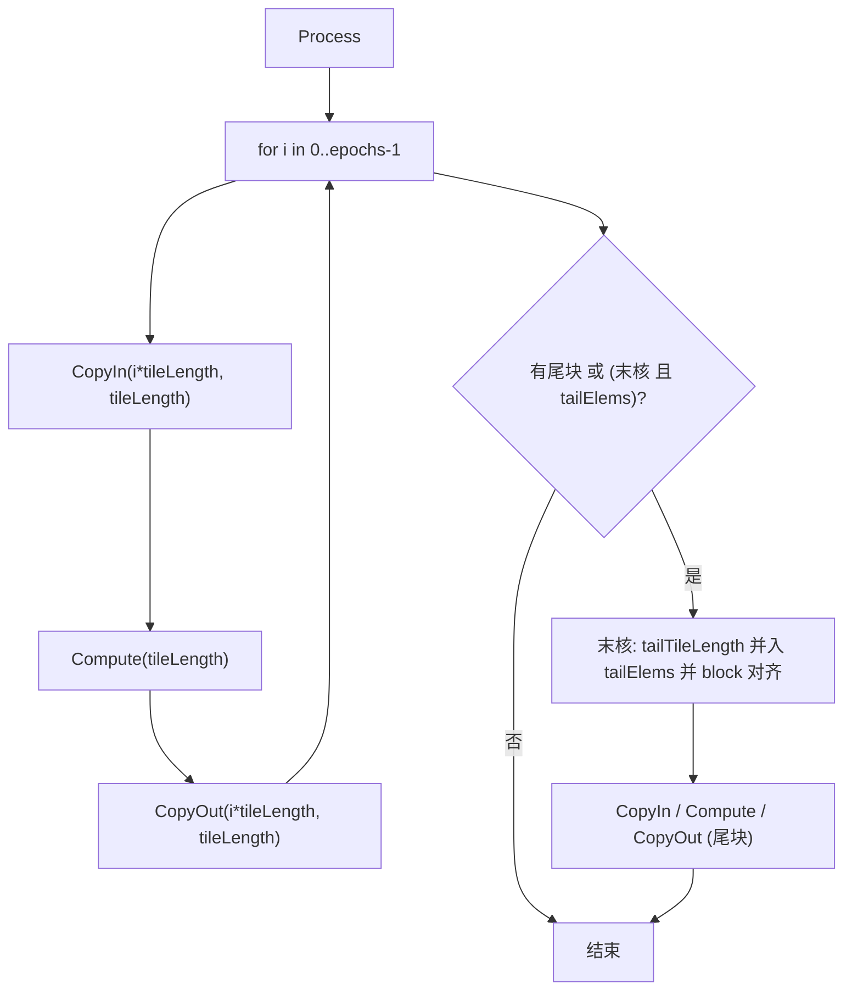
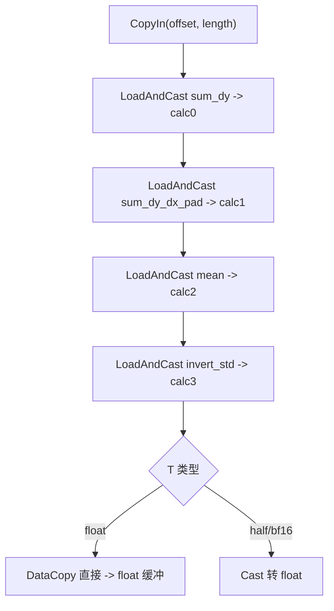
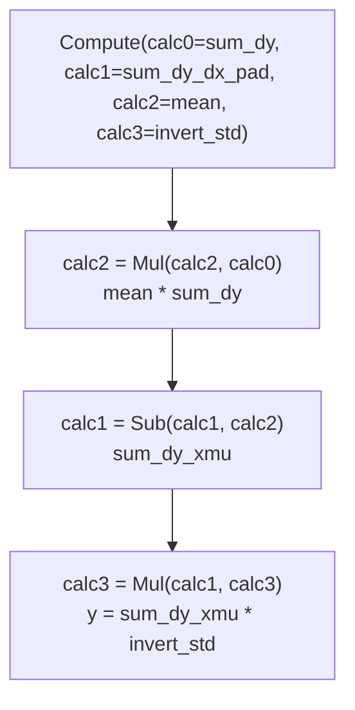
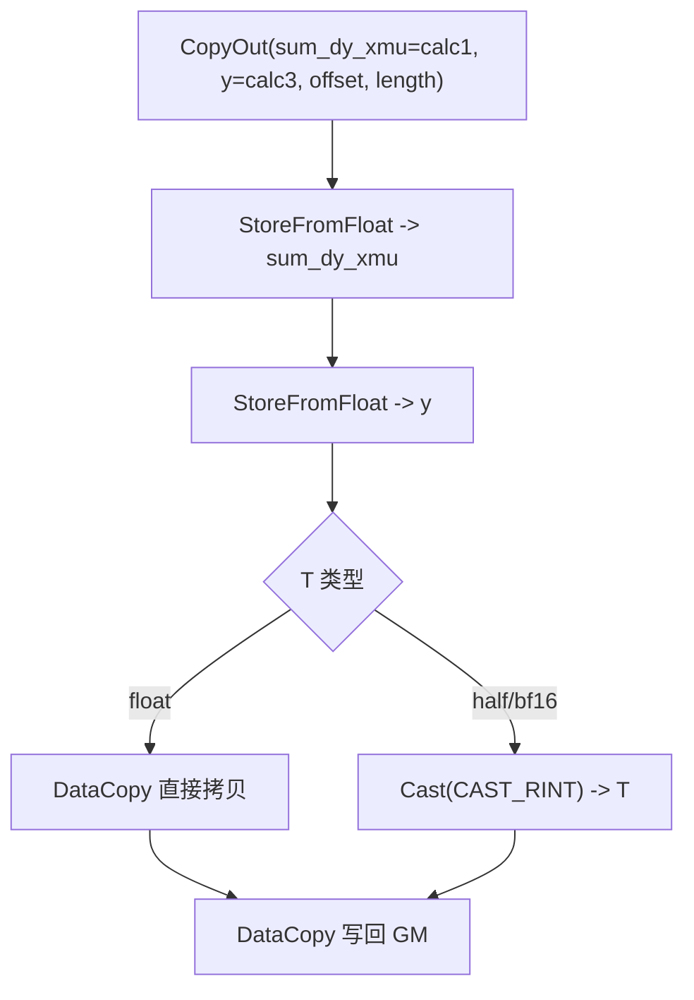

# **需求背景**

## **需求来源**

基于 CANN 内置 SyncBatchNormBackwardReduce 算子历史实现，使用 Ascend C 编程语言进行改造与优化，在 Atlas A2（ascend910b）与 Ascend 950（ascend950）场景下补齐同步批归一化反向归约类算子的 Ascend C 能力，并提升算子在昇腾芯片上的执行效率和泛化能力。

SyncBatchNormBackwardReduce 算子用于同步 BatchNorm 反向阶段的按通道归约：在已聚合的 `sum_dy`、`sum_dy_dx_pad` 基础上，结合每通道 `mean`、`invert_std` 计算 `sum_dy_xmu` 与 `y`，为后续权重/偏置梯度提供输入。本文先分析 TBE 历史实现的原型、支持范围与计算语义，再基于这些能力约束规划 Ascend C host、kernel 和 ACLNN 接口设计。

TBE 算子实现路径：`${ASCEND_INSTALL_PATH}/opp/built-in/op_impl/ai_core/tbe/impl`

TBE 实现依赖的 DSL API 路径：`${ASCEND_INSTALL_PATH}/python/site-packages/tbe/dsl`

## **TBE 源码分析**

通过对 SyncBatchNormBackwardReduce 算子 TBE 版本的功能分析，其原型、支持范围与核心计算语义如下。

### **1. 算子原型**

SyncBatchNormBackwardReduce 原型语义如下。该原型包含 `sum_dy`、`sum_dy_dx_pad`、`mean`、`invert_std` 四个必选输入，无属性，输出 `sum_dy_xmu` 与 `y`。

```cpp
REG_OP(SyncBatchNormBackwardReduce)
    .INPUT(sum_dy, TensorType({DT_FLOAT16, DT_FLOAT, DT_BF16}))
    .INPUT(sum_dy_dx_pad, TensorType({DT_FLOAT16, DT_FLOAT, DT_BF16}))
    .INPUT(mean, TensorType({DT_FLOAT16, DT_FLOAT, DT_BF16}))
    .INPUT(invert_std, TensorType({DT_FLOAT16, DT_FLOAT, DT_BF16}))
    .OUTPUT(sum_dy_xmu, TensorType({DT_FLOAT16, DT_FLOAT, DT_BF16}))
    .OUTPUT(y, TensorType({DT_FLOAT16, DT_FLOAT, DT_BF16}))
    .OP_END_FACTORY_REG(SyncBatchNormBackwardReduce)
```

原型语义：

| **名称** | **类别** | **说明** |
| -------- | -------- | -------- |
| sum_dy | 输入 | 每通道回传梯度求和 `Σ dy`。 |
| sum_dy_dx_pad | 输入 | 每通道 `Σ dy·x` 的聚合值。 |
| mean | 输入 | 每通道均值。 |
| invert_std | 输入 | 每通道标准差倒数 `1/√(var+eps)`。 |
| sum_dy_xmu | 输出 | 每通道 `Σ dy·(x-mean)`，dtype 与 `sum_dy` 一致。 |
| y | 输出 | 每通道 `sum_dy_xmu × invert_std`，dtype 与 `sum_dy` 一致。 |

计算公式：

```text
sum_dy_xmu[i] = sum_dy_dx_pad[i] - mean[i] * sum_dy[i]
y[i]          = sum_dy_xmu[i] * invert_std[i]
```

四个输入按通道逐元素一一对应，两个输出 shape / dtype 均与 `sum_dy` 一致。

### **2. 支持的数据类型**

| **参数** | **支持 dtype** | **说明** |
| -------- | -------------- | -------- |
| sum_dy | float16 / float32 / bfloat16 | 每通道 `Σ dy`。 |
| sum_dy_dx_pad | float16 / float32 / bfloat16 | 与 `sum_dy` 一致。 |
| mean | float16 / float32 / bfloat16 | 与 `sum_dy` 一致。 |
| invert_std | float16 / float32 / bfloat16 | 与 `sum_dy` 一致。 |
| sum_dy_xmu | float16 / float32 / bfloat16 | 输出 dtype 跟随 `sum_dy`。 |
| y | float16 / float32 / bfloat16 | 输出 dtype 跟随 `sum_dy`。 |

说明：

- 四个输入与两个输出 dtype 一致，均跟随 `sum_dy`。
- `bfloat16` 分支在不支持的硬件（如 `__CCE_AICORE__ == 200`）上不启用。

### **3. 支持的数据格式**

SyncBatchNormBackwardReduce 为按通道逐元素算子，按扁平化 ND 地址处理，所有输入输出均为 ND，不涉及 NC1HWC0、FRACTAL_NZ 等特殊 format。

| **场景** | **所有输入输出 format** | **触发条件** |
| -------- | ----------------------- | ------------ |
| 普通动态 shape 路径 | ND | 所有输入输出 format 均为 ND。 |

### **4. Shape 与属性约束**

SyncBatchNormBackwardReduce 无显式 attr。核心约束如下：

| **约束项** | **规则** |
| ---------- | -------- |
| 输入 shape | `sum_dy`、`sum_dy_dx_pad`、`mean`、`invert_std` shape 一致，逐元素一一对应。 |
| 输出 shape | `sum_dy_xmu.shape == y.shape == sum_dy.shape`。 |
| dtype 一致 | 四输入两输出 dtype 一致。 |
| 元素个数 | `sum_dy` 元素个数不能为 0。 |
| 属性 | 无。 |
| 是否广播 | 不涉及广播。 |

### **5. 计算语义分析**

通过对 SyncBatchNormBackwardReduce TBE 版本的功能分析，其计算语义为：

- **中心化梯度求和**：`sum_dy_xmu = sum_dy_dx_pad - mean * sum_dy`，即 `Σ dy·(x - mean)`。
- **标准差缩放**：`y = sum_dy_xmu * invert_std`。
- **dtype 转换**：四输入在 UB 上统一提升到 float32 计算，两输出结果转换为输出 dtype。

### **TBE 计算流程图**



# **需求分析**

## **外部组件依赖**

不涉及额外外部组件依赖。算子实现依赖 CANN / Ascend C 基础组件、ACLNN 调用框架、op_host tiling 框架和 kernel_operator。

## **内部适配模块**

适配 ACLNN 接口调用与图模式调用，补充 SyncBatchNormBackwardReduce 的 Ascend C 设计。设计包含：

- op def 中声明 `sum_dy`、`sum_dy_dx_pad`、`mean`、`invert_std`、`sum_dy_xmu`、`y` 的 dtype、format 和输入输出关系。
- op host 中完成输出 shape 推导（InferShape）、dtype 推导（InferDataType）、schMode 选择、平台信息读取、分核策略、UB 切分与双缓冲决策。
- op kernel 中根据 tiling 信息完成按元素分核、分块搬运、统一提升 float32 计算、中心化梯度求和与标准差缩放、dtype 落盘。
- docs 中记录 TBE 来源、计算语义、TBE 流程和 Ascend C 设计流程。

## **需求模块设计**

### **算子原型**

| **名称** | **类别** | **dtype** | **format** | **shape** | **介绍** |
| -------- | -------- | --------- | ---------- | --------- | -------- |
| sum_dy | 输入 | bf16 / fp16 / fp32 | ND | 每通道 | 每通道 `Σ dy`。 |
| sum_dy_dx_pad | 输入 | 与 `sum_dy` 一致 | ND | 与 `sum_dy` 一致 | 每通道 `Σ dy·x`。 |
| mean | 输入 | 与 `sum_dy` 一致 | ND | 与 `sum_dy` 一致 | 每通道均值。 |
| invert_std | 输入 | 与 `sum_dy` 一致 | ND | 与 `sum_dy` 一致 | 每通道标准差倒数。 |
| sum_dy_xmu | 输出 | 与 `sum_dy` 一致 | ND | 与 `sum_dy` 一致 | 每通道 `Σ dy·(x-mean)`。 |
| y | 输出 | 与 `sum_dy` 一致 | ND | 与 `sum_dy` 一致 | 每通道缩放结果。 |

**属性**：无。

说明：

- 四输入两输出 dtype 一致，均跟随 `sum_dy`。
- 不涉及广播，所有张量 shape 一致。

## **算子支持型号**

Atlas A2 训练系列产品 / Atlas 800I A2 推理产品（ascend910b）、Ascend 950（ascend950）。

# **需求详细设计**

## **使能方式**

| **上层框架**     | **涉及的框架勾选** |
| ---------------- | ------------------ |
| TF训练/推理      |                    |
| Pytorch训练/推理 |                    |
| ATC推理          | √                  |
| Aclnn直调        | √                  |
| OPAT调优         |                    |
| SGAT子图切分     |                    |

## **需求总体设计**

### **host侧设计方案**

SyncBatchNormBackwardReduce host 侧负责完成输出 shape / dtype 推导、schMode 选择、平台信息读取、按元素个数分核、UB tile 切分与双缓冲决策。该算子为 element-wise（按通道）算子，无 reduction、无 workspace（`workspace[0] = 0`）。

#### **1) InferShape**

输出 shape 与 dtype 推导规则：

```text
sum_dy_xmu.shape = y.shape = sum_dy.shape
sum_dy_xmu.dtype = y.dtype = sum_dy.dtype
```

host 侧 `InferShapeSyncBatchNormBackwardReduce` 将 `sum_dy` 的 shape 赋给两个输出；`InferDataTypeSyncBatchNormBackwardReduce` 将 `sum_dy` dtype 赋给两个输出。

#### **2) dtype 校验**

op def 支持范围与 tiling 校验如下：

- 四个输入 dtype 由算子定义保证一致，tiling 依据 `sum_dy` dtype 选择 tilingkey（schMode）。
- 支持 `float16`、`float32`、`bfloat16`；不属于该集合时 tiling 返回失败。

#### **3) format 和 shape 语义**

当前设计仅支持 ND 格式，所有输入输出均为 ND。

host 侧从 shape 提取规模信息：

| **约束项** | **校验 / 提取逻辑** |
| ---------- | ------------------- |
| totalLength | `sum_dy` 元素个数（`GetShapeSize`），必须不为 0。 |
| shape 一致 | 四输入两输出 shape 一致（不支持广播）。 |
| dtype | 由 `sum_dy` dtype 决定 schMode。 |

#### **4) 分核策略**

分核按元素个数、以 32B block 为粒度均分：

- `BYTES_PER_BLOCK = 32`，`elemsPerBlock = 32 / dtypeSize`，`BYTES_PER_CORE = 4096`，`BLOCK_PER_CORE = 128`。
- `totalBlocks = floorDiv(totalLength, elemsPerBlock)`，`tailElems = totalLength % elemsPerBlock`。
- `coreNum = aivCoreNum`；当 `totalBlocks < coreNum × BLOCK_PER_CORE` 时收敛为 `coreNum = ceilDiv(totalBlocks, BLOCK_PER_CORE)`，下限为 1。
- `blockPerCore = floorDiv(totalBlocks, coreNum)`，`tailBlocks = totalBlocks % coreNum`，`coreLength = blockPerCore × elemsPerBlock`。
- 非 block 对齐的尾部（`tailBlocks` 与 `tailElems`）由最后一个核吸收处理。
- `SetBlockDim(coreNum)`。

#### **5) UB 容量计算与双缓冲**

UB tile 切分以单元素总字节开销为基准（`CalcTileLength`）：

- 单元素开销 `perElem = 6 × dtypeSize × bufferNum + 4 × sizeof(float)`，对应 6 条队列（4 输入 + 2 输出）+ 4 个 float32 计算缓冲。
- 可用容量 `usable = ubSize - 2048`；`maxElems = usable / perElem`；`blockPerQue = floorDiv(maxElems, elemsPerBlock)`。
- 先按单缓冲计算 `blockPerQue`，当 `floorDiv(blockPerCore, blockPerQue) > 1`（不止一个 tile）时启用双缓冲 `bufferNum = 2` 并重算；`tileLength = blockPerQue × elemsPerBlock`。

tile 切分：`epochs = floorDiv(blockPerCore, blockPerQue)`，`tailTileLength = (blockPerCore % blockPerQue) × elemsPerBlock`；末核额外计入 `tailBlocks`，得到 `epochsForLastCore` 与 `tailTileLengthForLastCore`。

#### **6) tilingkey 规划**

依据 `sum_dy` dtype 选择 tilingkey（`schMode`），kernel 侧据此实例化对应的计算数据类型 `T`：

| **dtype** | **schMode** | **kernel T** |
| --------- | ----------- | ------------ |
| float16 | `SYNCBNBR_TPL_SCH_MODE_0`（0） | `half` |
| float32 | `SYNCBNBR_TPL_SCH_MODE_1`（1） | `float` |
| bfloat16 | `SYNCBNBR_TPL_SCH_MODE_2`（2） | `bfloat16_t` |

模板参数通过 `ASCENDC_TPL_ARGS_DECL` 声明 `schMode`（位宽 2，取值 0–2），host 侧 `SetTilingKey(GET_TPL_TILING_KEY(...))` 下发。

#### **7) TilingData 参数**

`SyncBatchNormBackwardReduceTilingData` 字段如下（所有 `*Length` / `tail*` 均为元素个数，已按 block 对齐）：

| **字段** | **类型** | **含义** |
| -------- | -------- | -------- |
| coreNum | uint64 | 实际参与计算的核数。 |
| bufferNum | uint64 | 1 单缓冲，2 双缓冲。 |
| tailElems | uint64 | 末核非 block 对齐的余数元素。 |
| epochs | uint64 | 普通核处理的完整 UB tile 数。 |
| epochsForLastCore | uint64 | 末核处理的完整 UB tile 数。 |
| coreLength | uint64 | 普通核负责的对齐元素数。 |
| tileLength | uint64 | 单次 UB 迭代处理的元素数。 |
| tailTileLength | uint64 | 普通核的对齐尾块元素数。 |
| tailTileLengthForLastCore | uint64 | 末核的对齐尾块元素数。 |

### **kernel侧设计方案**

Kernel 入口 `sync_batch_norm_backward_reduce<schMode>` 根据 `schMode` 实例化 `Run<T>`。四个输入在 UB 上统一提升到 float32 计算，两个输出由 float32 结果转回 `T`。

1. **构造与缓冲分配（SyncBatchNormBackwardReduceKernel 构造函数）**：
   - 由 `GetBlockIdx()` 计算 `globalOffset = coreLength × blockIdx` 与 `isLastCore`；末核使用 `epochsForLastCore` / `tailTileLengthForLastCore` / `tailElems`。
   - 分配 UB：`inQue0`~`inQue3`（4 输入队列）、`outQue0` / `outQue1`（2 输出队列），每条 `bufferNum × tileLength × sizeof(T)`；`calcBuf0`~`calcBuf3`（4 个 `tileLength × sizeof(float)` 计算缓冲）。

2. **Init**：将 `sum_dy`、`sum_dy_dx_pad`、`mean`、`invert_std`、`sum_dy_xmu`、`y` 的 GlobalTensor 绑定到带 `globalOffset` 偏移的 GM 地址。

3. **Process**：先按 `epochs` 循环处理满 tile（CopyIn → Compute → CopyOut），再处理尾块（普通核 `tailTileLength`；末核额外把 `tailElems` 并入并按 block 对齐）。

4. **CopyIn**：对 4 个输入分别执行 `LoadAndCast`：`DataCopy` 搬入后，`float` 直接 `DataCopy` 到 float 缓冲，`half` / `bfloat16` 通过 `Cast` 转 float，分别得到 `calc0`（sum_dy）、`calc1`（sum_dy_dx_pad）、`calc2`（mean）、`calc3`（invert_std）。

5. **Compute（输入 calc0/1/2/3，输出 calc1=sum_dy_xmu、calc3=y）**：
   - `Mul(calc2, calc2, calc0)` 得到 `mean × sum_dy`。
   - `Sub(calc1, calc1, calc2)` 得到 `sum_dy_xmu = sum_dy_dx_pad - mean×sum_dy`。
   - `Mul(calc3, calc1, calc3)` 得到 `y = sum_dy_xmu × invert_std`。

6. **CopyOut**：对两个输出分别执行 `StoreFromFloat`：`float` 直接 `DataCopy`；`half` / `bfloat16` 用 `CAST_RINT`（`__CCE_AICORE__ == 200` 用 `CAST_NONE`）转回 `T`，`DataCopy` 写回 `sum_dy_xmu` 与 `y`。

### **Ascend C 流程图**

#### **1. ACLNN 调用流程图**



#### **2. Kernel 入口流程图**



#### **3. Host Tiling 流程图**



#### **4. 构造与 Init 流程图**



#### **5. Process 主流程图**



#### **6. CopyIn 流程图**



#### **7. Compute 流程图**



#### **8. CopyOut 流程图**



## **支持硬件**

| **支持的芯片版本** | **涉及勾选** |
| ------------------ | ------------ |
| 香橙派OrangePi AIpro | |
| Atlas 200I/500 A2推理产品 | |
| Atlas A2 训练系列产品 / Ascend 950 | √ |

## **算子约束限制**

* 支持 ND 格式，暂不支持特殊 format。
* `sum_dy`、`sum_dy_dx_pad`、`mean`、`invert_std`、`sum_dy_xmu`、`y` 的 shape 必须一致，不支持广播。
* 四输入两输出 dtype 必须一致，且为 `float16`、`float32`、`bfloat16` 之一。
* `sum_dy` 元素个数不能为 0。
* 计算统一提升到 float32，输出由 float32 转回原 dtype。
* `bfloat16` 分支在不支持的硬件（`__CCE_AICORE__ == 200`）上不启用。
* 不涉及广播。

# **特性交叉分析可维可测分析**

## **验收标准**

| **验收标准** | **描述** |
| ------------ | -------- |
| 精度标准 | 不低于 TBE 版本。`float32` 最大绝对误差 ≤ `1e-5`，`float16` / `bfloat16` 最大绝对误差 ≤ `1e-3`。 |
| 性能标准 | 算子整体性能与原 TBE 实现算子持平。 |

## **关联的 Issue**

暂无。

## **文档更新**

本文档。

## **类型标签**

* [ ] Bug修复
* [ ] 新特性
* [ ] 性能优化
* [ ] 文档更新
* [x] 其他，请描述：社区任务算子设计文档
