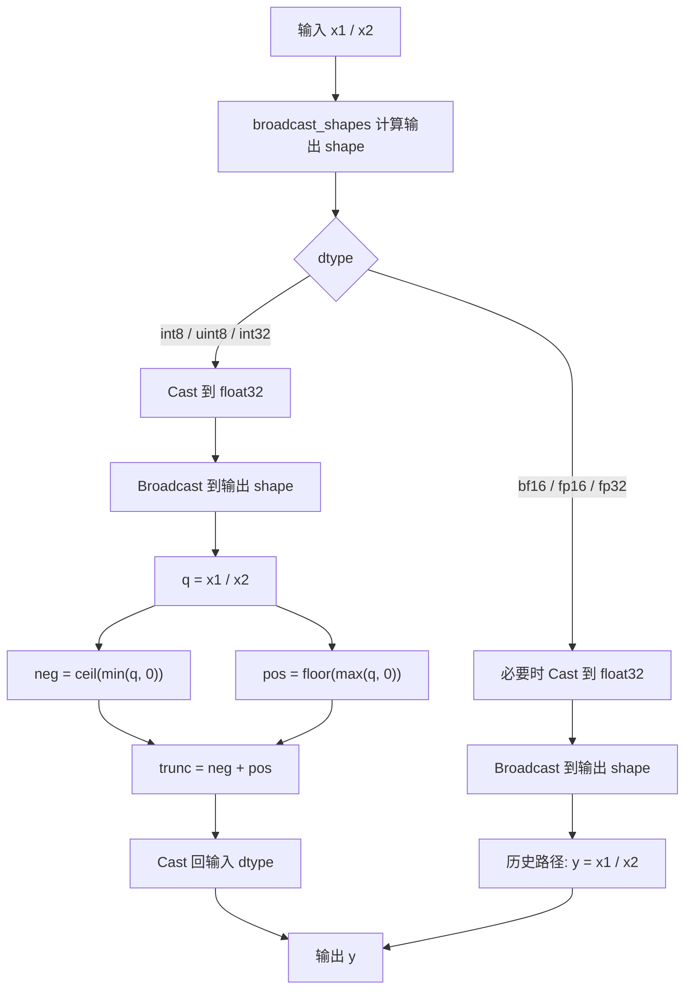
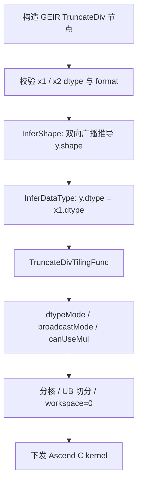
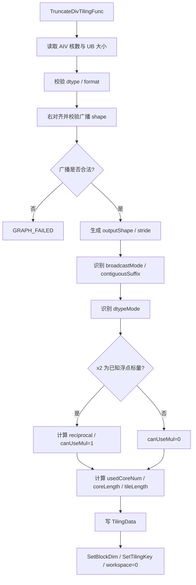
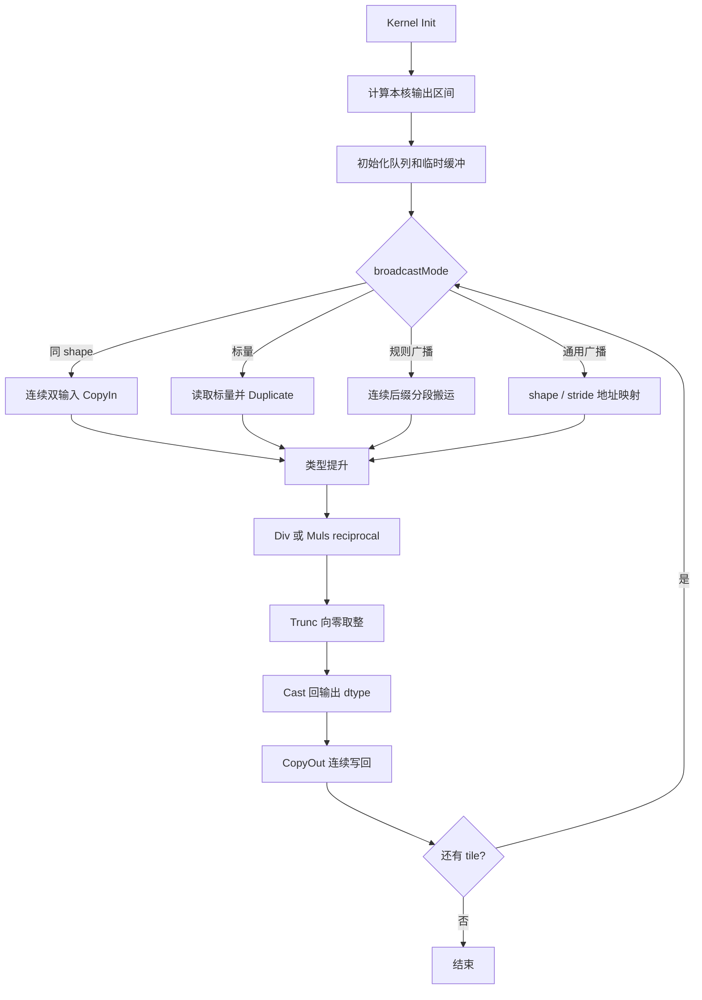
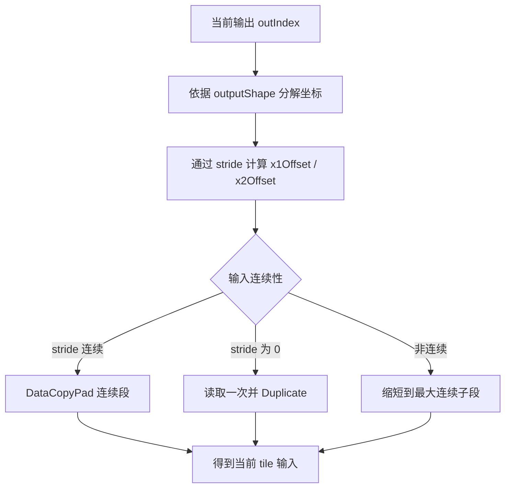
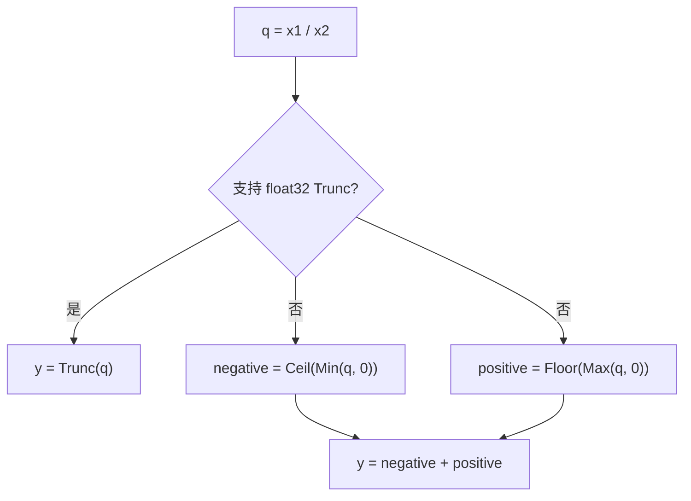

# **需求背景**

## **需求来源**

基于 CANN 训练营 2026 暑期季西安交通大学专场 [TruncateDiv 算子开发任务书](https://gitcode.com/cann/cann-ops-competitions/blob/master/04_tasks/01_community-task-2026/docs/202607/TruncateDiv_task_doc.md)，参考 CANN 内置 TruncateDiv 算子的 TBE 实现，使用 Ascend C 编程语言在 Atlas A2 / Atlas A3（ascend910b / ascend910_93）上实现功能一致、支持泛化广播且性能达标的 AICore 算子。

TruncateDiv 对完成广播后的两个输入逐元素相除，并将商向零取整：

```text
y = trunc(x1 / x2)
```

其中正数向下取整、负数向上取整。例如：

```text
TruncateDiv( 7,  3) =  2
TruncateDiv(-7,  3) = -2
TruncateDiv( 7, -3) = -2
TruncateDiv(-7, -3) =  2
```

该语义与 TensorFlow `TruncateDiv` 及当前 [ops-math 同名算子](https://gitcode.com/cann/ops-math/tree/master/math/truncate_div)的接口定义一致。

本设计分析所依据的 CANN 8.5.1 内置实现路径如下：

- 动态 TBE 实现：`<ASCEND_INSTALL_PATH>/opp/built-in/op_impl/ai_core/tbe/impl/ops_legacy/dynamic/truncate_div.py`
- 静态 TBE 实现：`<ASCEND_INSTALL_PATH>/opp/built-in/op_impl/ai_core/tbe/impl/ops_legacy/truncate_div.py`
- 算子原型：`<ASCEND_INSTALL_PATH>/opp/built-in/op_graph/inc/elewise_calculation_ops.h`
- Atlas A2 信息库：`<ASCEND_INSTALL_PATH>/opp/built-in/op_impl/ai_core/tbe/kernel/config/ascend910b/ops_legacy/truncate_div.json`

## **TBE 源码分析**

### **1. 算子原型**

内置算子原型包含 `x1`、`x2` 两个必选输入，无属性，输出 `y`。

```cpp
REG_OP(TruncateDiv)
    .INPUT(x1, TensorType({DT_FLOAT, DT_FLOAT16, DT_BF16, DT_INT8, DT_UINT8,
                           DT_INT32, DT_DOUBLE, DT_UINT16, DT_INT16, DT_INT64,
                           DT_COMPLEX64, DT_COMPLEX128}))
    .INPUT(x2, TensorType({DT_FLOAT, DT_FLOAT16, DT_BF16, DT_INT8, DT_UINT8,
                           DT_INT32, DT_DOUBLE, DT_UINT16, DT_INT16, DT_INT64,
                           DT_COMPLEX64, DT_COMPLEX128}))
    .OUTPUT(y, TensorType({DT_FLOAT, DT_FLOAT16, DT_BF16, DT_INT8, DT_UINT8,
                           DT_INT32, DT_DOUBLE, DT_UINT16, DT_INT16, DT_INT64,
                           DT_COMPLEX64, DT_COMPLEX128}))
    .OP_END_FACTORY_REG(TruncateDiv)
```

原型语义如下：

| **名称** | **类别** | **说明** |
| -------- | -------- | -------- |
| x1 | 输入 | 被除数 Tensor。 |
| x2 | 输入 | 除数 Tensor，dtype 与 `x1` 相同，shape 需与 `x1` 满足广播规则。 |
| y | 输出 | 截断除法结果，dtype 与输入相同，shape 为两个输入的广播结果。 |

### **2. 目标硬件有效数据类型**

算子原型声明的 dtype 多于 Atlas A2 / Atlas A3 上历史 TBE 实际生成的 AICore 二进制。CANN 8.5.1 的 ascend910b 动态信息库和 `truncate_div.py` 有效覆盖以下 6 种同类型组合，本次 Ascend C 版本以该范围作为 A2 / A3 的基础交付范围。

| **dtype** | **原型声明** | **A2 TBE 有效支持** | **Ascend C 设计** |
| --------- | ------------ | ------------------ | ----------------- |
| bfloat16 | √ | √ | √ |
| float16 | √ | √ | √ |
| float32 | √ | √ | √ |
| int8 | √ | √ | √ |
| uint8 | √ | √ | √ |
| int32 | √ | √ | √ |
| float64 / int16 / uint16 / int64 / complex | √ | 未生成对应 A2 TBE 动态二进制 | 不纳入本次 A2 / A3 AICore 基础范围 |

约束如下：

- `x1`、`x2` 必须为相同 dtype。
- `y` dtype 与输入 dtype 相同。
- 不支持混合 dtype 组合。
- 若后续目标 CANN 版本要求扩展 int16 / int64 等类型，需新增独立 TilingKey 和计算路径，不能通过 float32 中转直接宣称完整支持。

### **3. 数据格式**

Atlas A2 TBE 信息库将 `x1`、`x2`、`y` 注册为 ND，并使用 `FormatAgnostic` 匹配模式。算子只依赖逻辑 shape，不依赖 NCHW、NHWC 等维度语义。

| **参数** | **format** | **说明** |
| -------- | ---------- | -------- |
| x1 | ND | 动态 shape，逻辑输入格式。 |
| x2 | ND | 动态 shape，逻辑输入格式。 |
| y | ND | 输出为广播后的逻辑 shape。 |

### **4. Shape 与广播约束**

动态 TBE 实现使用 `ELEWISE_WITH_BROADCAST` 分类，并通过 `broadcast_shapes` 计算输出 shape，因此支持两个输入的双向广播。

广播规则：

1. 从尾维开始比较 `x1` 与 `x2` 的 shape。
2. 两个维度相等，或其中一个维度为 1 时可以广播。
3. 缺失的高维按 1 补齐。
4. 输出维度取两个输入对应维度的最大值。

示例：

| **x1 shape** | **x2 shape** | **y shape** | **场景** |
| ------------ | ------------ | ----------- | -------- |
| `(2, 3, 4)` | `(2, 3, 4)` | `(2, 3, 4)` | 同 shape。 |
| `(2, 3, 4)` | `(4,)` | `(2, 3, 4)` | `x2` 尾维广播。 |
| `(1, 3, 1)` | `(2, 1, 4)` | `(2, 3, 4)` | 双输入多维广播。 |
| `()` | `(2, 3, 4)` | `(2, 3, 4)` | `x1` 标量广播。 |
| `(2, 3, 4)` | `()` | `(2, 3, 4)` | `x2` 标量广播。 |

### **5. TBE 计算流程**

CANN 8.5.1 动态 TBE 实现按 dtype 分为整数和浮点两类。

整数路径（int8 / uint8 / int32）：

1. 将 `x1`、`x2` 转换为 float32。
2. 将两个输入广播到输出 shape。
3. 计算 `q = x1 / x2`。
4. 计算 `neg = ceil(min(q, 0))`。
5. 计算 `pos = floor(max(q, 0))`。
6. 得到 `trunc(q) = neg + pos`。
7. 转换回输入 dtype。

浮点路径（bf16 / fp16 / fp32）：

1. 在平台支持时将输入提升到 float32。
2. 将两个输入广播到输出 shape。
3. 执行 `vdiv`。
4. 转换回输入 dtype。

### **6. 历史实现语义差异**

算子原型、TensorFlow 兼容说明和当前 ops-math 同名实现均定义为“所有 dtype 的商向零取整”。但 CANN 8.5.1 `ops_legacy` TBE 的浮点分支只执行 `vdiv`，没有显式 `trunc`；整数分支才执行 `ceil(min) + floor(max)`。

本设计采用以下处理原则：

- **功能语义**：以算子原型、TensorFlow `TruncateDiv` 和当前 ops-math 同名实现为准，6 种 dtype 均执行 `trunc(x1 / x2)`。
- **性能基线**：仍使用任务书指定的历史 TBE 算子进行同环境对比。
- **差异验证**：浮点测试同时记录“契约 Golden”和“历史 TBE 输出”，避免将历史浮点实现差异误判为 Ascend C 精度问题。
- **提交前确认**：以 CANN Judge 对应题目实际 Golden 为最终验收依据；若平台明确要求兼容某个历史包的浮点普通除法行为，应通过独立兼容 TilingKey 处理，不能静默改变主语义。

### **TBE 计算流程图**



# **需求分析**

## **外部组件依赖**

不涉及第三方组件。算子实现依赖 CANN / Ascend C 基础组件、GE 图算子注册框架、op_host tiling 框架、`kernel_operator.h` 向量接口及 ops-math 公共构建与测试框架。

## **内部适配模块**

TruncateDiv 的 Ascend C 实现包含以下模块：

- `op_graph`：声明算子原型和广播 shape 推导。
- `op_host`：完成 dtype / format 校验、广播 shape 推导、广播模式识别、平台信息读取、分核、UB 切分和 TilingKey 下发。
- `op_kernel`：完成按核切分、分块搬运、广播展开、除法、向零取整、类型转换和尾块写回。
- `examples`：提供 GEIR 图模式调用样例。
- `tests`：覆盖 InferShape、tiling、kernel 精度、边界值、广播泛化和性能用例。
- `docs`：记录算子接口、约束、设计和验证方法。

## **需求模块设计**

### **算子原型**

| **名称** | **类别** | **dtype** | **format** | **shape** | **介绍** |
| -------- | -------- | --------- | ---------- | --------- | -------- |
| x1 | 输入 | bf16 / fp16 / fp32 / int8 / uint8 / int32 | ND | 动态 shape | 被除数。 |
| x2 | 输入 | 与 `x1` 相同 | ND | 与 `x1` 满足广播规则 | 除数。 |
| y | 输出 | 与 `x1` 相同 | ND | `broadcast(x1, x2)` | 向零取整后的商。 |

**属性**：无。

### **功能拆解**

1. 支持目标硬件 TBE 有效覆盖的 6 种 dtype。
2. 支持同 shape、任一输入标量、单维广播、多维广播和双输入广播。
3. 支持动态 shape 和非 32B 对齐尾块。
4. bf16 / fp16 使用 float32 中间计算，fp32 直接计算。
5. int8 / uint8 通过可精确表示其值域的提升类型完成计算。
6. int32 默认对齐 TBE 的 float32 中间路径，并通过大数专项用例确认 CANN Judge 期望；必要时增加高精度兼容路径。
7. 所有核参与计算的场景下，性能不低于 TBE 的 95%。

## **算子支持型号**

Atlas A2 训练系列产品（ascend910b）、Atlas A3 系列产品（ascend910_93）。

# **需求详细设计**

## **使能方式**

| **上层框架** | **涉及的框架勾选** |
| ------------ | ------------------ |
| TF训练/推理 | √ |
| Pytorch训练/推理 | |
| ATC推理 | √ |
| Aclnn直调 | |
| OPAT调优 | |
| SGAT子图切分 | |

TruncateDiv 是 TensorFlow 兼容的 GE 图算子。本次提供图模式接口，不新增任务书未定义的公共 ACLNN 接口。

## **总体设计**

TruncateDiv 是纯 AIV 二元逐元素算子，无归约、无核间依赖。总体采用“输出线性空间分核 + 广播模式分类 + 核内 UB tile 流水”的方案：

1. Host 推导广播输出 shape，并为两个输入生成广播 stride。
2. Host 根据输入 shape 识别同 shape、标量、规则广播和通用广播。
3. 各 Vector Core 负责一段连续输出地址。
4. Kernel 按最大连续段搬入输入，在 UB 中完成类型提升、除法和向零取整。
5. 结果转换回输出 dtype 并连续写回。


## **op_graph 设计**

### **1. InferShape**

`InferShapeTruncateDiv` 对两个输入 shape 做右对齐广播推导：

```text
rank = max(rank(x1), rank(x2))

for axis from last to first:
    d1 = x1 对应维度，缺失时为 1
    d2 = x2 对应维度，缺失时为 1
    require d1 == d2 or d1 == 1 or d2 == 1
    y[axis] = max(d1, d2)
```

任一维度不满足广播规则时返回 `GRAPH_FAILED`。动态未知维保留未知信息，运行时 tiling 使用实际 storage shape 再次校验。

### **2. InferDataType**

```text
require dtype(x1) == dtype(x2)
require dtype(x1) in {bf16, fp16, fp32, int8, uint8, int32}
dtype(y) = dtype(x1)
```

### **3. 算子定义**

- 输入输出均为 ND。
- 开启动态 shape、动态 rank 和静态图动态编译能力。
- `x2` 可声明 `ValueDepend(OPTIONAL)`，仅用于“编译期已知标量除数”的倒数乘法优化；普通运行时 Tensor 不依赖其值完成 tiling。
- AICore 同时注册 `ascend910b` 和 `ascend910_93`。

## **host 侧设计方案**

### **1. 参数校验**

| **校验项** | **处理** |
| ---------- | -------- |
| dtype | `x1`、`x2` 相同且属于 6 种支持类型。 |
| format | 输入输出均为 ND。 |
| 广播 | 每一维满足“相等或至少一方为 1”。 |
| 输出 shape | 等于两个输入的广播结果。 |
| totalLength | 非空输出大于 0；空 Tensor 由图框架空输入机制处理，不启动普通 kernel。 |
| platform | AIV 核数、UB 大小均大于 0。 |
| 除数 | `x2 == 0` 属于数据值约束，Host 不扫描 Tensor；测试数据必须避免。 |

### **2. 广播 shape 标准化**

Host 将两个输入 shape 右对齐，并生成固定长度的 shape / stride 表：

```text
x1Shape[MAX_DIM_NUM]
x2Shape[MAX_DIM_NUM]
outputShape[MAX_DIM_NUM]
x1Stride[MAX_DIM_NUM]
x2Stride[MAX_DIM_NUM]
```

广播维 stride 置 0，非广播维使用连续 ND stride。相邻且广播模式相同的维度优先合并，减少 kernel 坐标分解次数。

### **3. 广播模式分类**

| **broadcastMode** | **场景** | **kernel 策略** |
| ----------------- | -------- | --------------- |
| 0 | `x1.shape == x2.shape == y.shape` | 两输入连续搬运。 |
| 1 | `x1` 为标量 | `x1` 读取一次并 `Duplicate`，`x2` 连续搬运。 |
| 2 | `x2` 为标量 | `x2` 读取一次并 `Duplicate`，`x1` 连续搬运。 |
| 3 | 单边规则广播 | 连续输入直接搬运，广播输入按连续后缀分段展开。 |
| 4 | 双边 / 通用广播 | 根据输出坐标和输入 stride 生成最大连续段。 |

规则广播包含 `(N,C,H,W) / (W,)`、`(N,C,H,W) / (1,C,1,1)` 等常见场景。通用广播覆盖 `(1,3,1) / (2,1,4)` 等两个输入都需要扩展的场景。

### **4. dtype 模式**

| **dtypeMode** | **dtype** | **计算路径** |
| ------------- | --------- | ------------ |
| 0 | float16 | 提升到 float32，`Div + Trunc`，再转换回 half。 |
| 1 | float32 | float32 直接 `Div + Trunc`。 |
| 2 | bfloat16 | 提升到 float32，`Div + Trunc`，再转换回 bfloat16。 |
| 3 | int8 | int8 → half → float32，计算后反向转换。 |
| 4 | uint8 | uint8 → half / uint16 → float32，计算后反向转换。 |
| 5 | int32 | TBE 兼容 float32 路径；大数场景由专项兼容策略处理。 |

### **5. 分核策略**

按输出元素线性空间切分，各核负责互不重叠的连续区间：

```text
totalLength = product(outputShape)
elemBytes = sizeof(x1) + sizeof(x2) + sizeof(y)
targetBytesPerCore = 16 KiB
usedCoreNum = ceilDiv(totalLength * elemBytes, targetBytesPerCore)
usedCoreNum = clamp(usedCoreNum, 1, min(aivCoreNum, totalLength))

coreLength = alignUp(ceilDiv(totalLength, usedCoreNum), elemsPer256B)
usedCoreNum = ceilDiv(totalLength, coreLength)
```

设计原则：

- 大 shape 尽量使用全部 AIV 核。
- 小 shape 收敛核数，避免核启动和调度开销。
- 末核处理实际尾部长度。
- 通用广播仍按输出空间分核，所有核连续写回且无写冲突。

### **6. UB 切分**

UB 缓存规划：

| **缓存** | **用途** |
| -------- | -------- |
| x1InQueue | `x1` 输入队列。 |
| x2InQueue | `x2` 输入队列。 |
| yOutQueue | `y` 输出队列。 |
| x1Fp32Buf | `x1` 提升后的 float32 数据。 |
| x2Fp32Buf | `x2` 提升后的 float32 数据。 |
| quotientBuf | 除法结果和截断结果。 |
| negativeBuf | `ceil(min(q, 0))` 临时结果，可与输入缓冲复用。 |
| castBuf | int8 / uint8 的 half 中转或广播索引临时区。 |

Host 按 dtype 计算单元素 UB 开销：

```text
queueBytesPerElem = BUFFER_NUM * (sizeof(x1) + sizeof(x2) + sizeof(y))
calcBytesPerElem  = 4 * sizeof(float)
extraBytesPerElem = dtypeMode in {int8, uint8} ? sizeof(half) : 0
usableUb          = ubSize - ubReserve
tileLength        = floor(usableUb / perElem / alignElems) * alignElems
```

单 tile 场景使用单缓冲，两个及以上 tile 使用双缓冲，使 MTE2、Vector、MTE3 在相邻 tile 间流水重叠。

### **7. 标量除数优化**

当 `x2` 同时满足以下条件时，可启用 `canUseMul`：

- `x2` 为标量。
- `x2` 为 bf16 / fp16 / fp32。
- 图编译阶段能够读取常量值。
- 除数非 0。

Host 计算 float32 倒数，并执行一次 Newton 修正：

```text
inv = 1 / scalar
inv = inv * (2 - scalar * inv)
```

Kernel 将 `Div(x1, x2)` 替换为 `Muls(x1, inv)`。该优化必须用整数边界附近的浮点用例与直接 `Div` 做差分验证；若出现截断边界差异，则对应 shape / dtype 关闭 `canUseMul`，回退直接除法。

### **8. TilingKey 规划**

TilingKey 同时编码 dtype、广播模式和标量乘法优化：

```text
tilingKey = dtypeMode * 16 + broadcastMode * 2 + canUseMul
```

其中：

- `dtypeMode`：0～5。
- `broadcastMode`：0～4。
- `canUseMul`：0 / 1。

Kernel 入口通过模板参数实例化 dtype 和常用广播快路径，避免在主循环中反复判断。

### **9. TilingData 参数**

`TruncateDivTilingData` 规划如下：

| **字段** | **类型** | **含义** |
| -------- | -------- | -------- |
| totalLength | uint64 | 输出元素总数。 |
| coreLength | uint64 | 每核最多处理的输出元素数。 |
| tileLength | uint32 | 单 tile 最大元素数。 |
| usedCoreNum | uint32 | 实际使用 AIV 核数。 |
| rank | uint32 | 标准化后的有效维数。 |
| dtypeMode | uint32 | dtype 分支编号。 |
| broadcastMode | uint32 | 广播分支编号。 |
| canUseMul | uint32 | 是否使用标量倒数乘法。 |
| contiguousSuffix | uint32 | 可直接连续处理的最内层元素数。 |
| reciprocal | float | 标量除数的 float32 倒数。 |
| x1Shape[MAX_DIM_NUM] | uint64[] | 标准化后的 `x1` shape。 |
| x2Shape[MAX_DIM_NUM] | uint64[] | 标准化后的 `x2` shape。 |
| outputShape[MAX_DIM_NUM] | uint64[] | 标准化后的输出 shape。 |
| x1Stride[MAX_DIM_NUM] | uint64[] | `x1` stride，广播维为 0。 |
| x2Stride[MAX_DIM_NUM] | uint64[] | `x2` stride，广播维为 0。 |

### **10. Workspace 规划**

各核独立读取输入、写入不重叠的输出区间，无跨核同步和归约：

```text
workspaceSize = 0
```

## **kernel 侧设计方案**

Kernel 入口 `truncate_div<dtypeMode, broadcastMode, canUseMul>` 根据 TilingKey 实例化对应类型和广播策略，执行 `Init -> Process`。

### **1. 初始化**

1. 读取 `TruncateDivTilingData`。
2. 计算 `blockIdx`、本核输出起点和实际处理长度。
3. 绑定 `x1Gm`、`x2Gm`、`yGm`。
4. 初始化输入输出队列和计算缓冲。
5. 缓存 shape / stride 表，用于广播地址计算。

```text
coreOffset = blockIdx * coreLength
coreDataLength = min(coreLength, totalLength - coreOffset)
```

### **2. 连续搬运路径**

`broadcastMode == 0` 时：

```text
DataCopyPad x1[coreOffset + tileOffset] -> x1Local
DataCopyPad x2[coreOffset + tileOffset] -> x2Local
Compute(x1Local, x2Local)
DataCopyPad yLocal -> y[coreOffset + tileOffset]
```

该路径无坐标分解，是大 shape 满核场景的性能主路径。

### **3. 标量广播路径**

`broadcastMode == 1 / 2` 时：

1. 标量输入从 GM 读取一次。
2. 在核内通过 `Duplicate` 扩展到当前 tile。
3. 非标量输入连续搬运。
4. 标量值在本核循环中复用，不对每个 tile 重复读取 GM。
5. 对编译期常量浮点 `x2`，可直接使用 TilingData 中的 `reciprocal`。

### **4. 规则广播路径**

`broadcastMode == 3` 时，Host 下发 `contiguousSuffix`：

1. 由输出起点计算广播输入的首地址。
2. 非广播连续后缀使用 `DataCopyPad` 批量搬运。
3. stride 为 0 的段使用 `Duplicate` 或重复段复制。
4. 单次处理长度不跨越连续后缀边界。

### **5. 通用广播路径**

`broadcastMode == 4` 时，对输出线性下标恢复坐标：

```text
remaining = outIndex
x1Offset = 0
x2Offset = 0

for axis from last to first:
    coord = remaining % outputShape[axis]
    remaining /= outputShape[axis]
    x1Offset += coord * x1Stride[axis]
    x2Offset += coord * x2Stride[axis]
```

Kernel 以最大连续段为单位搬运：stride 连续时批量拷贝，stride 为 0 时读取一次并 `Duplicate`，仅在两个输入都不连续的最坏场景退化为小段循环。

### **6. 浮点计算路径**

bf16 / fp16 提升到 float32，fp32 直接计算：

```text
q = canUseMul ? x1 * reciprocal : x1 / x2
yFp32 = trunc(q)
y = Cast(yFp32, outputDtype)
```

`trunc` 实现优先级：

1. 编译环境支持 float32 `Trunc` 时直接使用。
2. 否则使用：

```text
negative = Ceil(Min(q, 0))
positive = Floor(Max(q, 0))
trunc(q) = negative + positive
```

3. 对 `-0`、NaN、Inf 做专项验证；若组合表达式不能保持目标特殊值语义，使用比较掩码恢复符号或回退专用实现。

### **7. int8 / uint8 计算路径**

int8 / uint8 的全部值可被 float32 精确表示：

1. int8 / uint8 转换为 half 或 uint16 中间类型。
2. 再转换为 float32。
3. 执行 `Div + Trunc`。
4. 转换回原 dtype。

合法输入要求 `x2 != 0`。截断商的绝对值不一定小于输入范围，例如 `INT8_MIN / -1`，因此溢出边界需按 TBE / CANN Judge 规则专项处理，不能依赖未定义的直接窄化转换。

### **8. int32 计算路径**

CANN 8.5.1 TBE 将 int32 转为 float32 后计算，绝对值超过 `2^24` 时可能丢失低位。本次设计分两阶段落地：

**基础兼容路径**

```text
x1Fp32 = Cast(x1)
x2Fp32 = Cast(x2)
qFp32 = Div(x1Fp32, x2Fp32)
qTrunc = Trunc(qFp32)
y = Cast(qTrunc, int32)
```

该路径与历史 TBE 的计算方式一致，是性能基线和首版实现。

**高精度兼容路径**

- 若目标 CANN / Ascend C 版本提供 int32 向量除法，直接使用整数除法，其结果天然向零取整。
- 若无 int32 向量除法，则对超过 float32 精确整数范围的 lane 使用独立兼容实现，例如标量 / SIMT 整数除法或经验证的商估计修正算法。
- `INT32_MIN / -1`、`x2 == 0` 单独掩码处理，避免 C++ 有符号除法溢出或设备异常。
- 是否启用高精度路径由 CANN Judge 大整数用例和性能结果决定；文档、代码和测试必须保持同一口径。

### **9. CopyOut 与尾块**

- 使用 `DataCopyPad` 按真实元素数写回。
- 对齐填充区在 Compute 前初始化，不参与有效输出。
- 尾块不覆盖输出边界外地址。
- 各核输出区间互不重叠，不需要原子操作或 `SyncAll`。

### **10. Process**

```text
loopCount = ceilDiv(coreDataLength, tileLength)

for tile in [0, loopCount):
    currentNum = min(tileLength, coreDataLength - tile * tileLength)
    CopyInOrBroadcast(tile, currentNum)
    Compute(currentNum)
    CopyOut(tile, currentNum)
```

## **Ascend C 流程图**

### **1. 图模式调用流程**



### **2. Host Tiling 流程**



### **3. Kernel 主流程**



### **4. 广播地址计算流程**



### **5. Trunc 计算流程**



## **支持硬件**

| **支持的芯片版本** | **涉及勾选** |
| ------------------ | ------------ |
| 香橙派 OrangePi AIpro | |
| Atlas 200I/500 A2 推理产品 | |
| Atlas A2 训练系列产品 / Atlas A3 系列产品 | √ |

## **算子约束限制**

- 支持 ND 格式。
- `x1`、`x2` dtype 必须相同，且属于 bfloat16、float16、float32、int8、uint8、int32。
- 输出 `y` dtype 与输入相同，shape 为 `x1`、`x2` 的广播结果。
- 输入 shape 必须满足双向广播规则。
- `x2` 的所有元素必须非 0；除零结果不在功能契约内。
- 浮点结果按 `trunc(x1 / x2)` 语义输出为整数值浮点数。
- float64、int16、uint16、int64、complex 不在本次 A2 / A3 AICore 基础范围内。
- int32 大数和 `INT32_MIN / -1` 必须按 CANN Judge / 目标基线确认后的兼容规则处理。

# **特性交叉分析可维可测分析**

## **功能测试设计**

| **测试维度** | **覆盖内容** |
| ------------ | ------------ |
| dtype | bf16、fp16、fp32、int8、uint8、int32。 |
| rank / shape | 标量、1D、2D、4D、动态 shape、非 32B 对齐尾块、小 shape、大 shape。 |
| 广播 | 同 shape、`x1` 标量、`x2` 标量、尾维广播、多维单边广播、双边广播。 |
| 符号 | 正/正、负/正、正/负、负/负。 |
| 截断边界 | 商恰为整数、略大于整数、略小于整数、绝对值小于 1。 |
| 特殊值 | `+0`、`-0`、`+Inf`、`-Inf`、NaN；除数 0 作为非法输入单独验证报错或未定义约束。 |
| 整数边界 | int8 / uint8 极值、`INT32_MIN`、`INT32_MAX`、大于 `2^24` 的 int32。 |
| 性能 | 单核、小核数、满核、多 tile、同 shape、标量除数、规则广播、通用广播。 |

### **Golden 设计**

浮点契约 Golden：

```python
def truncate_div_float_golden(x1, x2):
    return np.trunc(np.divide(x1.astype(np.float64), x2.astype(np.float64)))
```

整数精确 Golden 避免先转换为 float：

```python
def trunc_div_int(a, b):
    q = abs(a) // abs(b)
    return -q if (a < 0) ^ (b < 0) else q
```

测试报告同时保留：

1. Ascend C 与契约 Golden 的对比。
2. Ascend C 与目标 CANN 包 TBE 的对比。
3. 历史 TBE 浮点普通除法与契约 Golden 的差异说明。

## **精度标准**

| **验收标准** | **描述** | **标准来源** |
| ------------ | -------- | ------------ |
| 功能语义 | 所有支持 dtype 均满足 `trunc(x1 / x2)`，广播结果正确。 | 算子原型 / TensorFlow / 当前 ops-math |
| 平台精度 | 满足 CANN Judge 对应题目的默认精度阈值。 | 任务书 / CANN Judge |
| 整数结果 | 非溢出合法输入应与整数精确 Golden 一致；若目标基线规定兼容行为，按专项规则验证。 | 算子语义 / 目标平台 |
| 特殊值 | NaN、Inf、正负零的位置和符号按目标契约验证。 | 浮点语义 / 目标平台 |

## **性能标准**

| **验收标准** | **描述** | **标准来源** |
| ------------ | -------- | ------------ |
| 满核性能 | 所有核参与计算场景下，Ascend C 性能不低于 TBE 的 95%。 | 任务书 |
| 小 shape | 10 μs 以下场景若与 TBE 相差不超过 3 μs，可结合性能仿真图分析启动与调度开销。 | 任务书 |
| 测试一致性 | Ascend C 与 TBE 使用相同 dtype、shape、广播关系、预热次数、测量次数和运行环境。 | 自验证规范 |

性能优化关注点：

- 同 shape 连续路径避免坐标计算。
- 标量输入只读取一次，`x2` 常量标量评估倒数乘法。
- 规则广播按最大连续后缀批量搬运。
- 大 shape 满核负载均衡。
- 单双缓冲切换阈值。
- FP32 路径避免无意义 Cast。
- int8 / uint8 减少中转缓冲和 Cast 次数。
- 通用广播索引计算与 `Div / Trunc` 流水的占比。

## **兼容性分析**

本需求新增 Atlas A2 / Atlas A3 的 Ascend C 实现，不改变 TruncateDiv 的算子名称、输入输出数量、同 dtype 约束、ND 格式和广播规则。

浮点历史 TBE 路径与算子契约存在差异。本设计明确以 `trunc(x1 / x2)` 为主语义，并通过差分测试记录目标包行为，避免在迁移过程中产生未说明的兼容性变化。

## **风险分析**

| **风险项** | **影响** | **应对措施** |
| ---------- | -------- | ------------ |
| 历史浮点 TBE 未执行 Trunc | Ascend C 与旧包逐值不一致 | 区分契约 Golden 与性能基线，提交前以 CANN Judge 确认语义；必要时增加显式兼容 TilingKey。 |
| 通用广播地址计算开销 | 复杂广播性能下降 | 广播模式分类、维度合并、连续后缀和分段搬运。 |
| 标量倒数乘法边界误差 | 商接近整数时截断结果偏 1 | 与直接 Div 做边界差分；不满足时关闭 `canUseMul`。 |
| int32 大数精度 | float32 中转丢失低位 | 大数专项测试；按平台能力增加整数向量、SIMT 或商修正路径。 |
| 窄整数溢出 | `INT8_MIN / -1` 等结果不可表示 | 明确兼容规则并用 mask 处理，不依赖未定义窄化。 |
| 小 shape 启动开销 | 低于 TBE 小 shape 性能 | 动态收敛核数，单 tile 使用单缓冲，标量核内复用。 |
| UB 占用过高 | tile 变小、循环次数增加 | 按 dtype 计算 UB 预算，复用临时缓冲，减少同时存活 Tensor。 |

## **关联的 Issue**

暂无。

## **文档更新**

本文档。

## **类型标签**

- [ ] Bug 修复
- [ ] 新特性
- [ ] 性能优化
- [ ] 文档更新
- [x] 其他：社区任务算子设计文档
