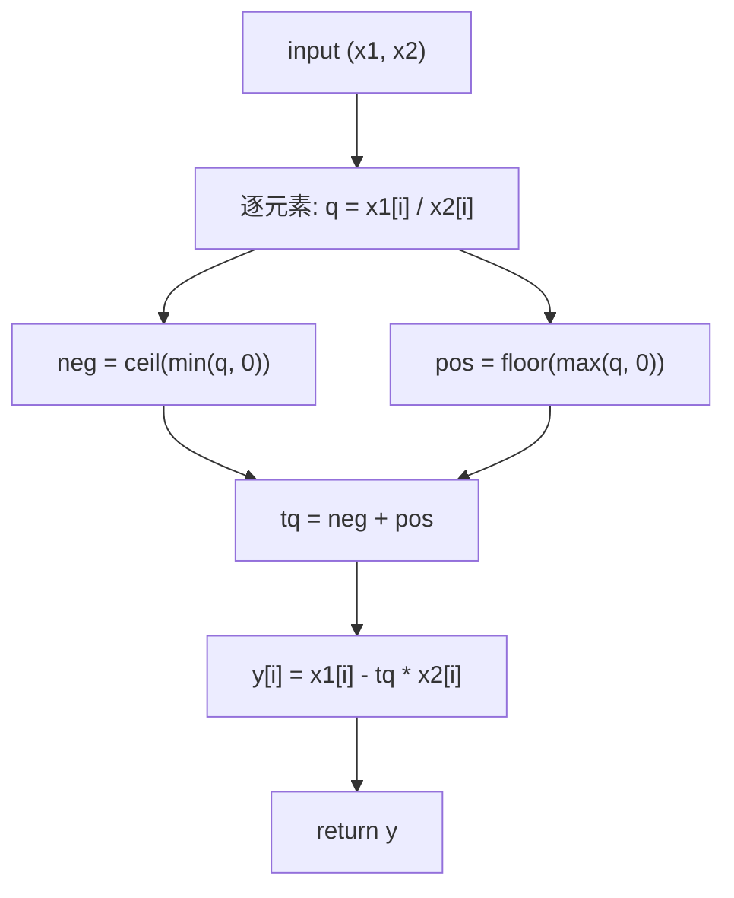
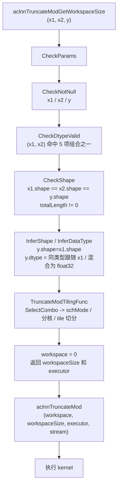
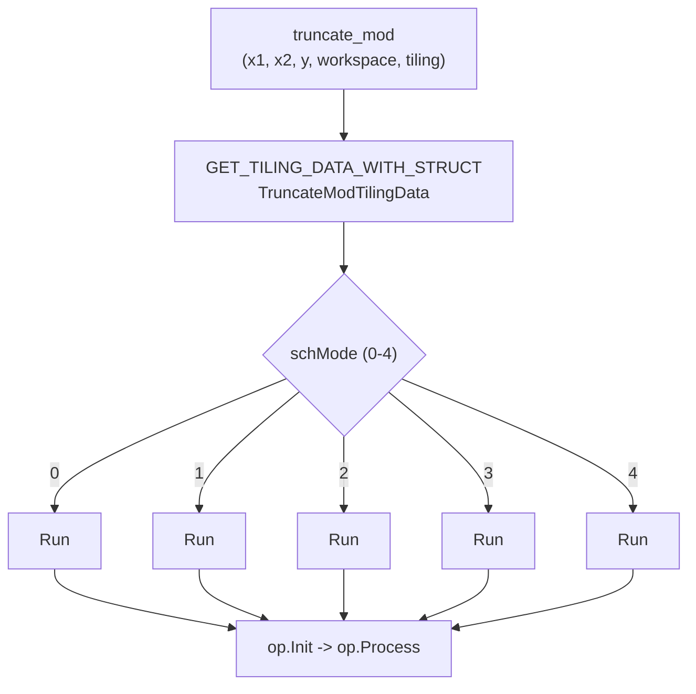
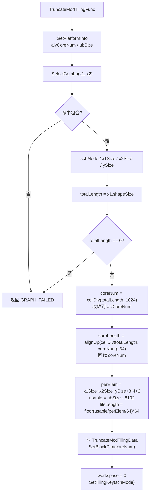
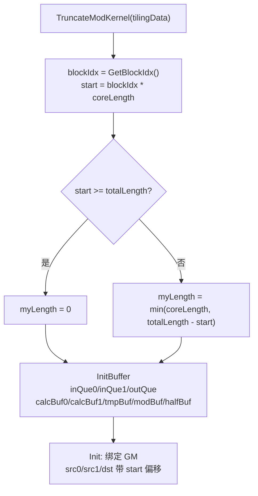
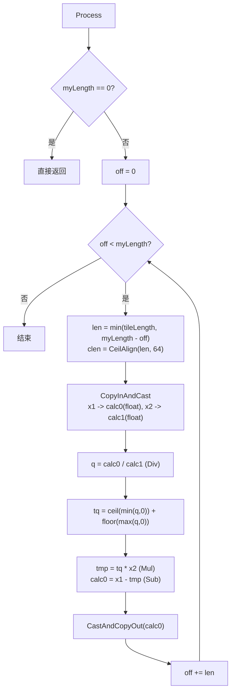
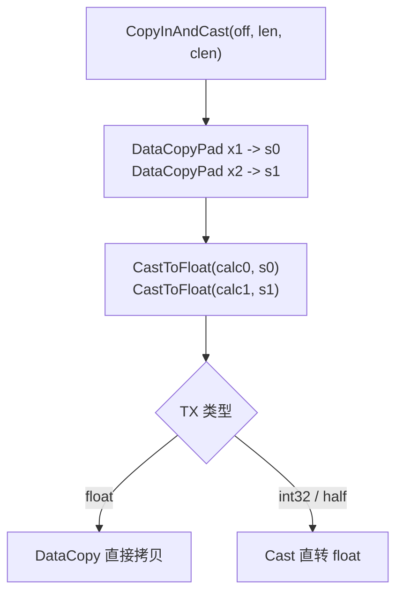
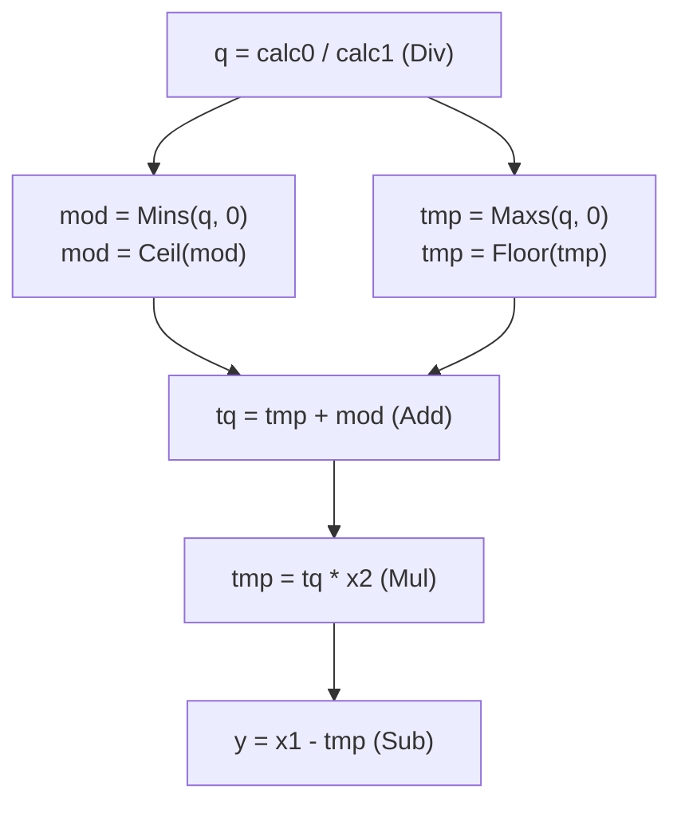
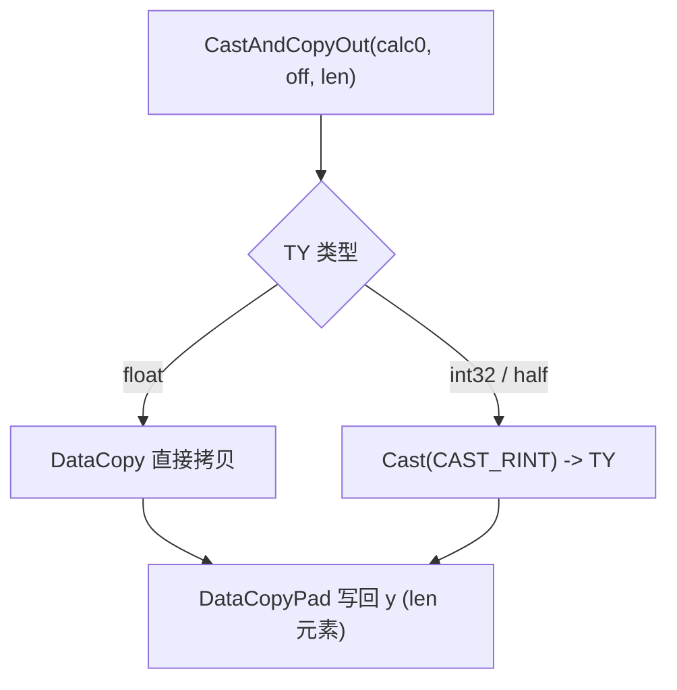

# **需求背景**

## **需求来源**

基于 CANN 内置 TruncateMod 算子历史实现，使用 Ascend C 编程语言进行改造与优化，在 Atlas A2 / Atlas A3（ascend910b / ascend910_93）场景下补齐 element-wise 二元 math 类算子的 Ascend C 能力，并提升算子在昇腾芯片上的执行效率和泛化能力。

TruncateMod 算子用于逐元素计算截断除法的余数：`y = x1 - trunc(x1 / x2) * x2`，余数与被除数 `x1` 同号。本文先分析 TBE 历史实现的原型、支持范围与计算语义，再基于这些能力约束规划 Ascend C host、kernel 和 ACLNN 接口设计。

TBE 算子实现路径：`${ASCEND_INSTALL_PATH}/opp/built-in/op_impl/ai_core/tbe/impl`

TBE 实现依赖的 DSL API 路径：`${ASCEND_INSTALL_PATH}/python/site-packages/tbe/dsl`

## **TBE 源码分析**

通过对 TruncateMod 算子 TBE 版本的功能分析，其原型、支持范围与核心计算语义如下。本设计与官方 `ops-math` `TruncateMod` 语义对齐。

### **1. 算子原型**

TruncateMod 原型语义如下。该原型包含 `x1`、`x2` 两个必选输入，无属性，输出 `y`。

```cpp
REG_OP(TruncateMod)
    .INPUT(x1, TensorType({DT_FLOAT16, DT_FLOAT, DT_INT32}))
    .INPUT(x2, TensorType({DT_FLOAT16, DT_FLOAT, DT_INT32}))
    .OUTPUT(y, TensorType({DT_FLOAT16, DT_FLOAT, DT_INT32}))
    .OP_END_FACTORY_REG(TruncateMod)
```

原型语义：

| **名称** | **类别** | **说明** |
| -------- | -------- | -------- |
| x1 | 输入 | 被除数 Tensor。 |
| x2 | 输入 | 除数 Tensor，shape 与 `x1` 一致。 |
| y | 输出 | 逐元素截断除法余数 `x1 - trunc(x1 / x2) * x2`，shape 与 `x1` 一致。 |

计算公式：

```text
q      = x1 / x2
tq     = trunc(q) = ceil(min(q, 0)) + floor(max(q, 0))   # 向零取整
y[i]   = x1[i] - tq * x2[i]
```

其中余数与被除数 `x1` 同号（截断除法的余数），例如 `(-7) mod 3 = -1`、`7 mod (-3) = 1`。

### **2. 支持的数据类型**

本设计覆盖的 `(x1, x2, y)` dtype 组合共 5 种（索引与 kernel `schMode` 一致）：

| **schMode** | **x1** | **x2** | **y** | **说明** |
| ----------- | ------ | ------ | ----- | -------- |
| 0 | float16 | float16 | float16 | 同类型。 |
| 1 | float32 | float32 | float32 | 同类型。 |
| 2 | int32 | int32 | int32 | 同类型。 |
| 3 | float16 | float32 | float32 | 混合，输出 float32。 |
| 4 | float32 | float16 | float32 | 混合，输出 float32。 |

说明：

- 同类型组合（`x1 == x2`）输出 dtype 与输入一致；混合类型组合（`x1 != x2`，即 schMode 3/4）输出为 `float32`。

### **3. 支持的数据格式**

TruncateMod 为逐元素二元算子，按扁平化 ND 地址处理，所有输入输出均为 ND，不涉及 NC1HWC0、FRACTAL_NZ 等特殊 format。

| **场景** | **x1/x2/y format** | **触发条件** |
| -------- | ------------------ | ------------ |
| 普通动态 shape 路径 | ND | 所有输入输出 format 均为 ND。 |

### **4. Shape 与属性约束**

TruncateMod 无显式 attr。核心约束如下：

| **约束项** | **规则** |
| ---------- | -------- |
| x1 / x2 shape | `x1.shape == x2.shape`，逐元素一一对应。 |
| y shape | `y.shape == x1.shape`。 |
| 是否广播 | 当前实现不支持广播。 |
| 元素个数 | `x1` 元素个数不能为 0。 |
| 属性 | 无。 |
| 除零 | 除零为未定义行为。 |

### **5. 计算语义分析**

通过对 TruncateMod TBE 版本的功能分析，其计算语义为：

- **逐元素除法**：对每个位置计算 `q = x1[i] / x2[i]`。
- **向零取整**：`tq = trunc(q) = ceil(min(q, 0)) + floor(max(q, 0))`，正数向下取整、负数向上取整。
- **求余**：`y = x1 - tq * x2`，余数与被除数 `x1` 同号。

### **TBE 计算流程图**



# **需求分析**

## **外部组件依赖**

不涉及额外外部组件依赖。算子实现依赖 CANN / Ascend C 基础组件、ACLNN 调用框架、op_host tiling 框架和 kernel_operator。

## **内部适配模块**

适配 ACLNN 接口调用与图模式调用，补充 TruncateMod 的 Ascend C 设计。设计包含：

- op def 中声明 `x1`、`x2`、`y` 的 dtype、format 和输入输出关系（5 种 dtype 组合）。
- op host 中完成输出 shape 推导（InferShape）、dtype 推导（InferDataType）、dtype 组合校验与 schMode 选择、平台信息读取、分核策略和 UB tile 切分。
- op kernel 中根据 tiling 信息完成按元素分核、分块搬运、统一提升 float32 计算、`trunc` 向零取整与求余以及 dtype 落盘。
- docs 中记录 TBE 来源、计算语义、TBE 流程和 Ascend C 设计流程。

## **需求模块设计**

### **算子原型**

| **名称** | **类别** | **dtype** | **format** | **shape** | **介绍** |
| -------- | -------- | --------- | ---------- | --------- | -------- |
| x1 | 输入 | fp16 / fp32 / int32 | ND | 任意 | 被除数。 |
| x2 | 输入 | 与组合对应（见 dtype 组合表） | ND | 与 `x1` 一致 | 除数。 |
| y | 输出 | 同类型组合与输入一致，混合组合为 fp32 | ND | 与 `x1` 一致 | 截断除法余数。 |

**属性**：无。

说明：

- 输入输出 dtype 组合共 5 种，见「支持的数据类型」表。
- 不涉及广播，`x1`、`x2`、`y` shape 一致。

## **算子支持型号**

Atlas A2 训练系列产品 / Atlas 800I A2 推理产品（ascend910b）、Atlas A3 系列产品（ascend910_93）。

# **需求详细设计**

## **使能方式**

| **上层框架**     | **涉及的框架勾选** |
| ---------------- | ------------------ |
| TF训练/推理      |                    |
| Pytorch训练/推理 |                    |
| ATC推理          | √                  |
| Aclnn直调        | √                  |
| OPAT调优         |                    |
| SGAT子图切分     |                    |

## **需求总体设计**

### **host侧设计方案**

TruncateMod host 侧负责完成输出 shape / dtype 推导、dtype 组合校验与 schMode 选择、平台信息读取、按元素个数分核与 UB tile 切分。TruncateMod 为 element-wise 二元算子，无 reduction、无 workspace（`workspace[0] = 0`）。

#### **1) InferShape**

TruncateMod 输出 shape 与 dtype 推导规则：

```text
y.shape = x1.shape
y.dtype = (x1.dtype == x2.dtype) ? x1.dtype : float32
```

host 侧 `InferShapeTruncateMod` 将 `x1` 的 shape 赋给 `y`；`InferDataTypeTruncateMod` 在同类型时令 `y` dtype 跟随 `x1`，混合类型时令 `y = float32`（与 def 中 2 组混合组合 fp16/fp32、fp32/fp16 → fp32 一致）。

#### **2) dtype 组合与 schMode 选择**

host 侧 `SelectCombo` 按 `(x1, x2)` dtype 组合在 5 项组合表中匹配，输出对应 `schMode` 与各张量字节数 `x1Size` / `x2Size` / `ySize`；未命中任何组合时 tiling 返回失败：

- 命中组合返回对应 `schMode`（0–4），并作为 tilingkey 下发。
- 未支持的 `(x1, x2)` dtype 组合返回 `GRAPH_FAILED`。

#### **3) format 和 shape 语义**

当前设计仅支持 ND 格式，所有输入输出均为 ND。

host 侧从 shape 提取规模信息：

| **约束项** | **校验 / 提取逻辑** |
| ---------- | ------------------- |
| totalLength | `x1` 元素个数（`GetShapeSize`），必须不为 0。 |
| shape 一致 | `x1`、`x2`、`y` shape 一致（不支持广播）。 |
| dtype 组合 | `(x1, x2)` 必须命中 5 项组合之一。 |

#### **4) 分核策略**

分核按元素个数均分，遵循每核最小工作量与对齐约束：

- 每核最小工作量 `MIN_ELEMS_PER_CORE = 1024`，避免小 shape 占满全部核。
- `coreNum = ceilDiv(totalLength, MIN_ELEMS_PER_CORE)`，上限收敛到 `aivCoreNum`，下限为 1。
- `coreLength = alignUp(ceilDiv(totalLength, coreNum), VEC_ALIGN)`，其中 `VEC_ALIGN = 64` 元素（`256B / sizeof(float)`），保证各类型 DMA 起始 ≥ 32B 对齐。
- 回代 `coreNum = ceilDiv(totalLength, coreLength)`，末核处理剩余元素。
- `SetBlockDim(coreNum)`。

#### **5) UB 容量计算与 tile 切分**

UB tile 切分以单元素总字节开销为基准：

- 单元素开销 `perElem = x1Size + x2Size + ySize + 3 × sizeof(float) + sizeof(uint16_t)`，对应 `(x1, x2, y)` 三条队列 + 3 个 float32 计算缓冲（calc0 / calc1 / tmp，另含 mod 缓冲）+ 1 个 half 中转缓冲。
- 可用容量 `usable = ubSize - UB_RESERVE`（`UB_RESERVE = 8192` 预留给 tiling 结构与栈）。
- `maxElems = usable / perElem`，`tileLength = floor(maxElems / VEC_ALIGN) × VEC_ALIGN`（下限 `VEC_ALIGN`，上限 `coreLength`）。

kernel 使用 `DataCopyPad`，切分仅需 64 元素对齐（保证各类型 DMA 起始对齐），尾部按精确元素数搬运，天然支持混合 dtype。

#### **6) tilingkey 规划**

TruncateMod 依据 `(x1, x2)` dtype 组合选择 tilingkey（`schMode`），kernel 侧据此实例化对应的 `Run<TX1, TX2, TY>`：

| **schMode** | **(x1, x2, y)** | **kernel 实例** |
| ----------- | --------------- | --------------- |
| 0 | half / half / half | `Run<half, half, half>` |
| 1 | float / float / float | `Run<float, float, float>` |
| 2 | int32 / int32 / int32 | `Run<int32_t, int32_t, int32_t>` |
| 3 | half / float / float | `Run<half, float, float>` |
| 4 | float / half / float | `Run<float, half, float>` |

模板参数通过 `ASCENDC_TPL_ARGS_DECL` 声明 `schMode`（位宽 3，取值 0–4），host 侧 `SetTilingKey(schMode)` 下发。

#### **7) TilingData 参数**

`TruncateModTilingData` 字段如下（所有 `*Length` 均为元素个数）：

| **字段** | **类型** | **含义** |
| -------- | -------- | -------- |
| coreNum | uint64 | 实际参与计算的核数。 |
| totalLength | uint64 | 输入总元素个数。 |
| coreLength | uint64 | 每核处理的元素数（末核 = `totalLength - (coreNum-1) × coreLength`）。 |
| tileLength | uint64 | 单 tile 最大元素数（64 的倍数）。 |

### **kernel侧设计方案**

Kernel 入口 `truncate_mod<schMode>` 根据 `schMode` 实例化 `Run<TX1, TX2, TY>`。所有 dtype 统一提升到 float32 计算 `q`、`trunc(q)` 与余数，再转回输出 dtype。

1. **构造与缓冲分配（TruncateModKernel 构造函数）**：
   - 由 `blockIdx` 计算本核区间 `start = blockIdx × coreLength`、`myLength = min(coreLength, totalLength - start)`。
   - `alignedTile = CeilAlign(tileLength, 64)`。
   - 分配 UB：`inQue0`（`tileLength × sizeof(TX1)`）、`inQue1`（`× sizeof(TX2)`）、`outQue`（`× sizeof(TY)`）、`calcBuf0` / `calcBuf1` / `tmpBuf` / `modBuf`（`alignedTile × sizeof(float)`）、`halfBuf`（`alignedTile × sizeof(half)`）。

2. **Init**：将 `x1`、`x2`、`y` 的 GlobalTensor 绑定到带 `start` 偏移的 GM 地址。

3. **Process（float32 提升路径）**：
   - `myLength == 0` 时直接返回。
   - 按 `tileLength` 分块循环：`len = min(tileLength, myLength - off)`，`clen = CeilAlign(len, 64)`。
   - `CopyInAndCast`：将 `x1` / `x2` 搬入并 cast 到 float32 的 `calc0` / `calc1`。
   - `Div(tmp, calc0, calc1)` 得到 `q`；`modBuf = Ceil(Mins(q, 0))`；`tmp = Floor(Maxs(q, 0))`；`tmp = tmp + modBuf`（即 `trunc(q)`）。
   - `Mul(tmp, tmp, calc1)` 得到 `trunc(q) × x2`；`Sub(calc0, calc0, tmp)` 得到余数 `y`。
   - `CastAndCopyOut`：将余数 cast 到 `TY` 并写回。

4. **CopyInAndCast**：
   - `DataCopyPad` 按 `len × sizeof(TX)` 搬入 `x1` / `x2`（尾部无效值不落盘）。
   - `CastToFloat`：`float` 直接 `DataCopy`；`int32` / `float16` 直接 `Cast` 到 float。

5. **CastAndCopyOut**：
   - `TY == float` 直接 `DataCopy`；`int32` 与 `float16` 用 `CAST_RINT` 转 `TY`。
   - `DataCopyPad` 按 `len × sizeof(TY)` 写回 `y`。

### **Ascend C 流程图**

#### **1. ACLNN 调用流程图**



#### **2. Kernel 入口流程图**



#### **3. Host Tiling 流程图**



#### **4. Kernel 构造与 Init 流程图**



#### **5. Process 主流程图**



#### **6. CopyInAndCast 流程图**



#### **7. Trunc 与求余流程图**



#### **8. CastAndCopyOut 流程图**



## **支持硬件**

| **支持的芯片版本** | **涉及勾选** |
| ------------------ | ------------ |
| 香橙派OrangePi AIpro | |
| Atlas 200I/500 A2推理产品 | |
| Atlas A2 训练系列产品 / Atlas A3 系列产品 | √ |

## **算子约束限制**

* 支持 ND 格式，暂不支持特殊 format。
* `x1`、`x2`、`y` 的 shape 必须一致，不支持广播。
* `(x1, x2)` dtype 必须命中 5 项组合之一：同类型组合（fp16 / fp32 / int32）输出与输入一致；混合组合（fp16+fp32、fp32+fp16）输出 float32。
* `x1` 元素个数不能为 0。
* 整型计算经由 float32 中转；int32 输入绝对值应小于 `2^23` 以保证精度无损。
* 除零为未定义行为。

# **特性交叉分析可维可测分析**

## **验收标准**

| **验收标准** | **描述** |
| ------------ | -------- |
| 精度标准 | 不低于 TBE 版本。`float32` 最大绝对误差 ≤ `1e-5`，`float16` 最大绝对误差 ≤ `1e-3`；整型结果精确。 |
| 性能标准 | 算子整体性能与原 TBE 实现算子持平。 |

## **关联的 Issue**

暂无。

## **文档更新**

本文档。

## **类型标签**

* [ ] Bug修复
* [ ] 新特性
* [ ] 性能优化
* [ ] 文档更新
* [x] 其他，请描述：社区任务算子设计文档
