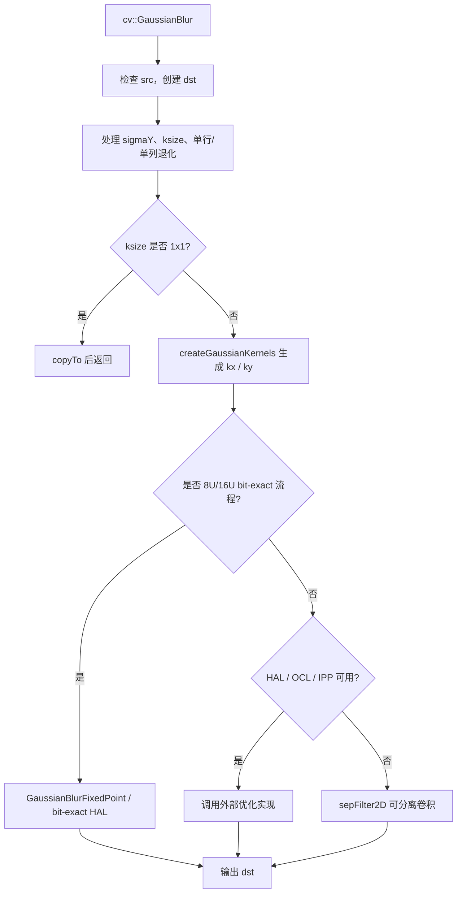
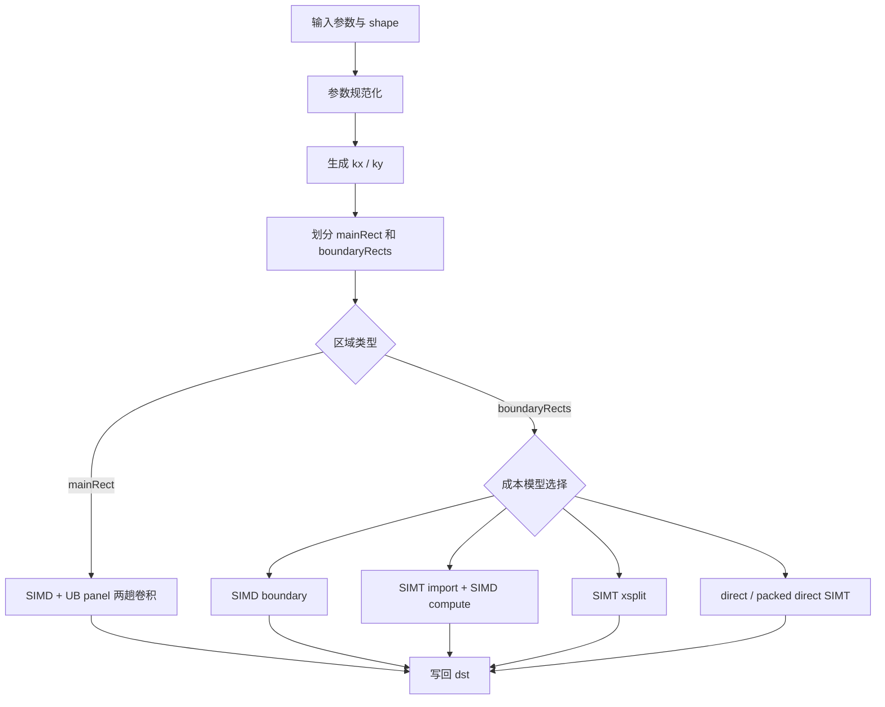
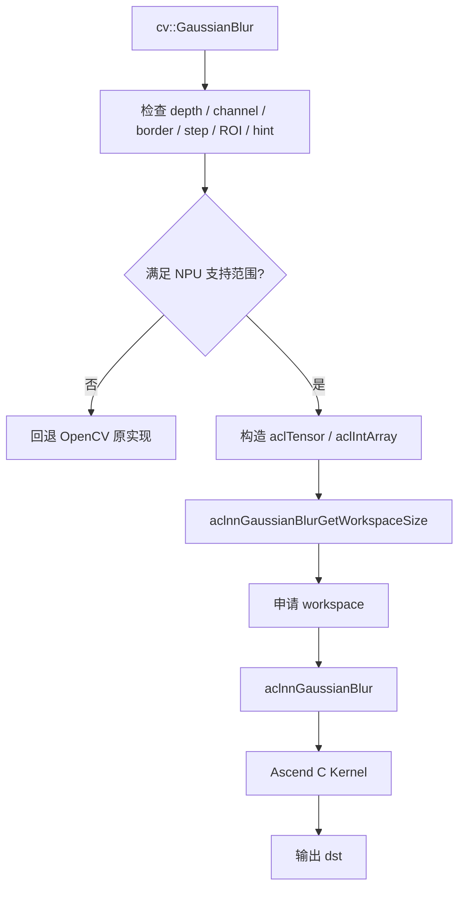
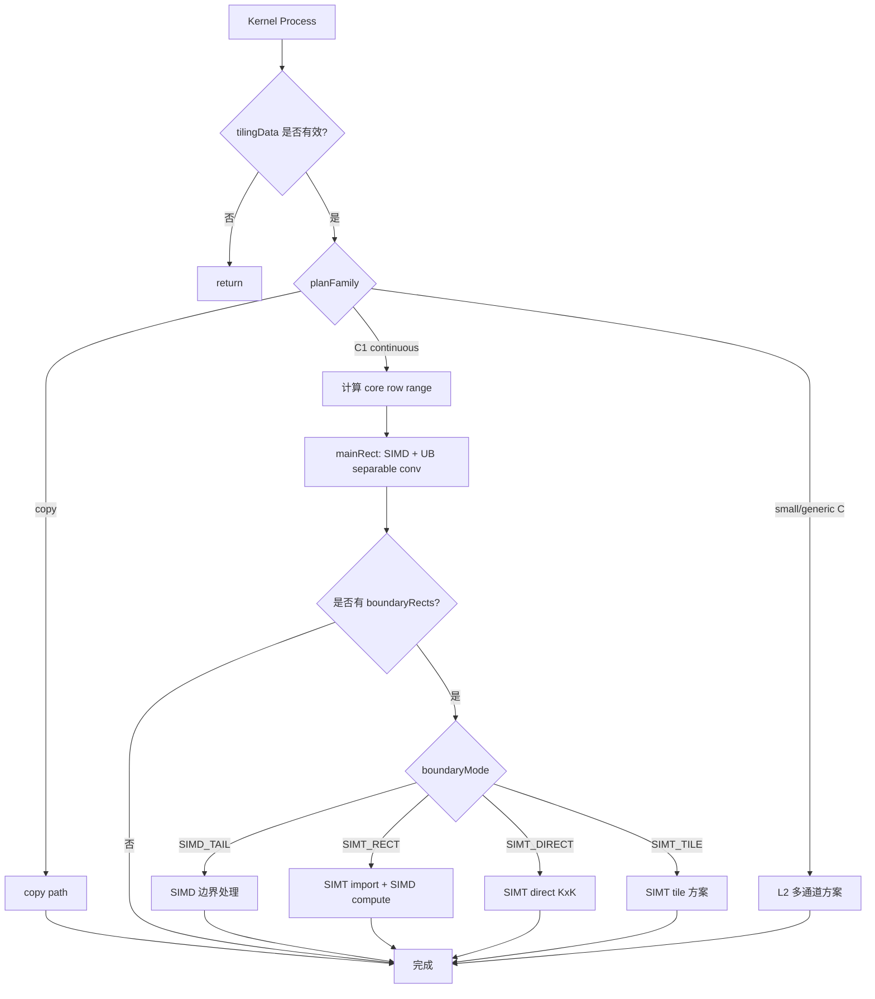

# 【社区任务】GaussianBlur算子设计文档

# 1. 需求背景（required）

## 1.1 需求来源

参考 OpenCV `cv::GaussianBlur`，在 Ascend 950PR 上基于 Ascend C Kernel、aclnn 接口和 OpenCV C++ 适配层实现高斯滤波算子。算子完成设计、开发、测试和性能验证后，提交至昇腾 CV 算子开源仓。

任务书明确要求：功能、精度、性能验收以 OpenCV C++ 层 `cv::GaussianBlur()` 为唯一基准；aclnn C++ 接口为必选交付项；`cv_hal_gaussianBlur` 为可选集成入口。

本设计文档以 OpenCV `cv::GaussianBlur` 的公开接口和参考实现作为分析对象，不引入其他实现作为验收基线。

## 1.2 背景介绍

### 1.2.1 GaussianBlur 算子实现优化

GaussianBlur 用于对图像做高斯平滑，常用于去噪、边缘检测预处理、特征提取、目标检测和视觉处理流程。二维高斯卷积可以拆成两个一维卷积，因此 OpenCV 实现中的核心流程是：

```text
生成横向一维核 kx
生成纵向一维核 ky
先做 X 方向一维卷积
再做 Y 方向一维卷积
```

数学表达为：

```text
dst(x, y) = sum_i sum_j src(x + i, y + j) * kx(i) * ky(j)
```

该算子的主要难点不在公式本身，而在于 OpenCV 语义比较细：

1. `ksize` 和 `sigma` 之间存在自动推导关系。
2. `CV_8U` / `CV_16U` 存在 bit-exact 定点路径，不能简单用 float32 近似替代。
3. `borderType`、ROI、step、in-place 会影响边界读数和内存访问。
4. 多通道必须通道独立计算，不能混通道卷积。
5. NPU 上要在规则主区域、边界区域和不同图像形状之间选择合适的执行方案。

本设计采用“OpenCV 语义对齐 + aclnn 两段式接口 + Host 生成执行计划 + Ascend C 可分离卷积”的总体方案。L1 阶段重点完成 Ascend 950PR 上 `CV_32F C1` 能力，L2 阶段扩展 8U bit-exact、CV_64F、HAL、ROI/step、in-place 和更多通道。

### 1.2.2 GaussianBlur 算子语义与实现分析

OpenCV 参考实现主要位于 `opencv2/imgproc.hpp`、`smooth.dispatch.cpp` 和 `hal_replacement.hpp`。NPU 侧实现按 aclnn、Host tiling 和 Ascend C Kernel 分层组织：

| 模块 | 作用 |
|---|---|
| aclnn 接口层 | 参数检查、输入连续化、executor 构造 |
| L0 调用层 | 将算子加入 AICore launcher |
| Host tiling 层 | 参数规范化、核生成、分核分块和方案选择 |
| OpenCV 语义工具 | 复现 ksize、sigma、border 和核生成规则 |
| Kernel 公共数据结构 | 承载 Host 传给 Kernel 的执行计划 |
| Ascend 950 Kernel | 执行 C1 主方案和后续扩展方案 |

#### 1.2.2.1 OpenCV 支持的数据类型、格式和参数

OpenCV C++ 接口为：

```cpp
CV_EXPORTS_W void GaussianBlur(
    InputArray src,
    OutputArray dst,
    Size ksize,
    double sigmaX,
    double sigmaY = 0,
    int borderType = BORDER_DEFAULT,
    AlgorithmHint hint = cv::ALGO_HINT_DEFAULT);
```

OpenCV HAL 替换接口为：

```cpp
int cv_hal_gaussianBlur(
    const uchar* src_data, size_t src_step,
    uchar* dst_data, size_t dst_step,
    int width, int height, int depth, int cn,
    size_t margin_left, size_t margin_top,
    size_t margin_right, size_t margin_bottom,
    size_t ksize_width, size_t ksize_height,
    double sigmaX, double sigmaY, int border_type);
```

OpenCV 完整语义与本项目分级如下：

| 项目 | OpenCV 语义 | L1 范围 | L2 目标 |
|---|---|---|---|
| depth | `CV_8U` / `CV_16U` / `CV_16S` / `CV_32F` / `CV_64F` | `CV_32F` | 补齐任务书列出的 depth |
| channel | 通道独立，支持多通道 | C1 | C1/C2/C3/C4 及更多通道 |
| shape | 单图 Mat | rank 2 `[H,W]`，rank 3 `[H,W,1]` | OpenCV 单图语义 |
| step/ROI | 支持非连续 Mat 和 ROI | OpenCV 适配层连续化后接管；aclnn 直接入口要求连续 ND | L2 通过 HAL/NDDMA 优化非连续访问 |
| in-place | 必要时执行 clone | OpenCV 适配层 clone 后接管；aclnn 直接入口拒绝同 storage | 保持 OpenCV 语义 |
| border | 不支持 `BORDER_WRAP` | 支持 replicate，扩展支持 constant/reflect/reflect101；拒绝 wrap/isolated | 补齐 ROI 下的 isolated |
| hint | default/accurate/approx | default | L2 区分 hint |

#### 1.2.2.2 OpenCV 实现描述

OpenCV `GaussianBlur` 的核心流程如下：

1. 检查 `src` 非空。
2. 创建与输入同尺寸、同类型的 `dst`。
3. 根据图像尺寸、ROI 和 border 条件处理 width/height 为 1 的退化场景。
4. 如果 `ksize.width == 1 && ksize.height == 1`，直接 `copyTo`。
5. 如果 `sigmaY <= 0`，令 `sigmaY = sigmaX`。
6. 调用 `createGaussianKernels` 生成 `kx`、`ky`。
7. 对 `CV_8U` 和 `CV_16U` 优先尝试 bit-exact 定点实现。
8. 对可走 HAL 的场景调用 `cv_hal_gaussianBlur` 或 `cv_hal_gaussianBlurBinomial`。
9. 通用流程调用 `sepFilter2D` 完成可分离卷积。

其中 8U/16U bit-exact 是后续 L2 的重点：核系数来自 OpenCV `getGaussianKernelBitExact` 的 softfloat 语义，再转换为固定点权重；不能先用普通 float32 重新生成再量化。

#### 1.2.2.3 OpenCV 实现流程图



# 2. 需求分析（required）

## 2.1 功能需求

GaussianBlur L1 需要支持任务书要求的 `CV_32F` 前向计算，并保证 aclnn 与 OpenCV 适配层结果一致。完整目标需要覆盖 OpenCV 的主要参数语义。

| 需求项 | 说明 |
|---|---|
| OpenCV C++ 接口 | 对齐 `cv::GaussianBlur` 参数和异常语义 |
| aclnn 接口 | 提供 `GetWorkspaceSize + 执行入口` 两阶段调用 |
| 可分离卷积 | 等价实现 `sepFilter2D(kx, ky)` |
| 通道独立 | 多通道不得混通道计算 |
| ksize/sigma 推导 | 复现 OpenCV 规则 |
| border | L1 必选 `BORDER_REPLICATE`；L2 扩展 constant/reflect/reflect101；wrap 必须拒绝 |
| copy 方案 | `ksize=1x1` 直接 copy |
| bit-exact | L2 支持 8U/16U 定点实现 |
| CV_64F | L2 支持或给出 ATK 证明的精度策略 |

## 2.2 接口需求

对外接口分三层：

```text
OpenCV cv::GaussianBlur
    -> aclnnGaussianBlurGetWorkspaceSize / aclnnGaussianBlur
    -> Ascend C Kernel
```

`cv_hal_gaussianBlur` 是可选入口，用于后续更自然地接入 OpenCV HAL。

## 2.3 性能需求

任务书 L1 性能场景：

| 场景 | depth | ksize | sigma | 要求 |
|---|---|---|---|---|
| 1024x1024 C1 | `CV_32F` | 5x5 | 1.2 | 达到任务书规定的 A100 OpenCV 0.45x 基线 |

GaussianBlur 在 NPU 上的性能瓶颈主要来自：

1. 两趟 separable 卷积需要读写中间结果。
2. 边界区域存在 clamp/reflect/constant 分支。
3. 小图固定调度开销占比高。
4. 宽图、高图和不同 kernel size 下最优边界方案不同。

因此性能设计不能只根据单个测试样例反推通用规则，必须通过测试样例矩阵校正成本模型。

## 2.4 外部组件依赖

| 组件 | 用途 |
|---|---|
| OpenCV | 唯一功能、精度、接口验收基准 |
| CANN aclnn | public 两段式 NPU 调用入口 |
| Ascend C | Kernel 实现 |
| AscendOpTest | 功能、精度、性能自测 |
| ATK | 双标杆精度验证 |
| msprof / opprof | 性能采集 |

## 2.5 适配模块

| 模块 | 作用 |
|---|---|
| OpenCV 适配层 | 处理 `InputArray`、`OutputArray`、Mat step、ROI、in-place，并决定是否接管 |
| aclnn 层 | 参数校验、参数规范化、输入连续化、构造 executor |
| L0 层 | 添加 AICore launcher |
| Host tiling | 生成核、分核、分块、写入执行计划 |
| Kernel | 执行 copy、主区域卷积、边界卷积和后续 dtype 方案 |
| 性能验证体系 | 多维测试样例矩阵和成本模型校正 |

# 3. 总体设计思想

本方案采用“语义对齐在 Host，性能分流在 tiling，计算执行在 Kernel”的设计。

```text
OpenCV 参数
  -> Host 规范化为 canonical params
  -> 生成 kx / ky
  -> 根据 shape、kernel、border、dtype 选择执行计划
  -> Kernel 按 plan 执行
```

C1 FP32 方案将图像分成两类区域：

1. **主区域**：不碰边界，输入访问连续规整，使用 SIMD + UB panel 做 separable 两趟卷积。
2. **边界区域**：需要处理 border 规则，按成本模型选择 SIMD、SIMT import、SIMT xsplit、direct SIMT 或 packed direct SIMT。

该设计不把 SIMD 和 SIMT 看成互斥关系。规则大块优先由 SIMD 执行，分支较多、访问较离散的边界区域可由 SIMT 执行，Host 侧通过成本模型决定执行方式。



# 4. 详细设计（required）

## 4.1 使能方式

OpenCV 适配层只在 NPU 支持范围内接管，不满足条件时回退 OpenCV 原实现。



## 4.2 接口设计

### 4.2.1 OpenCV C++ 接口

OpenCV C++ 接口为必选入口，函数声明、参数顺序和默认值与 OpenCV 逐字对齐：

```cpp
CV_EXPORTS_W void GaussianBlur(
    InputArray src,
    OutputArray dst,
    Size ksize,
    double sigmaX,
    double sigmaY = 0,
    int borderType = BORDER_DEFAULT,
    AlgorithmHint hint = cv::ALGO_HINT_DEFAULT);
```

OpenCV 层负责：

1. `dst.create(src.size(), src.type())`。
2. in-place 场景必要时 clone，保证与 OpenCV 行为一致。
3. 非连续 Mat、ROI 和 step 语义处理；aclnn 直接入口不能表达的 Mat 语义由 OpenCV 适配层完成连续化或回退。
4. 判断 NPU 是否支持对应参数组合。
5. 调用 aclnn 或回退 OpenCV。

OpenCV 参数与 aclnn 参数映射如下：

| OpenCV 参数 | aclnn 参数 | 说明 |
|---|---|---|
| `src` | `const aclTensor *src` | L1 为 `DT_FLOAT`、`FORMAT_ND`；OpenCV 适配层负责 Mat 到 tensor 的转换 |
| `dst` | `aclTensor *dst` / `const aclTensor *dst` | shape、dtype 与 `src` 保持一致 |
| `ksize` | `const aclIntArray *ksize` | `[width, height]`，0 表示由 sigma 推导 |
| `sigmaX` | `double sigmaX` | 与 OpenCV 语义一致 |
| `sigmaY` | `double sigmaY` | `sigmaY <= 0` 时按 OpenCV 规则取 `sigmaX` |
| `borderType` | `int64_t borderType` | L1 至少支持 `BORDER_REPLICATE`，拒绝 `BORDER_WRAP` |
| `hint` | OpenCV 适配层处理 | L1 支持 `ALGO_HINT_DEFAULT` |

### 4.2.2 aclnn 接口

aclnn 接口为必选交付项，按任务书保持 `GetWorkspaceSize + 执行入口` 两阶段调用。接口命名、参数顺序和参数类型如下：

```c
/**
 * @brief 获取 GaussianBlur 算子所需 workspace 大小
 */
aclnnStatus aclnnGaussianBlurGetWorkspaceSize(
    const aclTensor *src,
    const aclIntArray *ksize,       /* [width, height]，0 表示由 sigma 推算 */
    double sigmaX,
    double sigmaY,
    int64_t borderType,
    const aclTensor *dst,
    uint64_t *workspaceSize,
    aclOpExecutor **executor);

/**
 * @brief GaussianBlur 计算入口
 */
aclnnStatus aclnnGaussianBlur(
    void *workspace,
    uint64_t workspaceSize,
    aclOpExecutor *executor,
    const aclTensor *src,
    const aclIntArray *ksize,
    double sigmaX,
    double sigmaY,
    int64_t borderType,
    aclTensor *dst,
    aclrtStream stream);
```

调用职责：

| 阶段 | 职责 |
|---|---|
| `GetWorkspaceSize` | 参数检查、canonical 化、输入连续化、构造 executor、返回 workspace |
| `aclnnGaussianBlur` | 再次参数检查，提交 executor 到 stream |

aclnn 与 OpenCV 适配层的关系如下：

| 要求项 | 设计 |
|---|---|
| 调用流程 | `aclnnGaussianBlurGetWorkspaceSize` -> 申请 workspace -> `aclnnGaussianBlur` |
| 参数语义 | 与 OpenCV `ksize`、`sigmaX`、`sigmaY`、`borderType` 保持一致 |
| 结果一致性 | aclnn 直接入口与 OpenCV 适配层前向结果一致；32F 满足生态算子精度标准，8U/16U L2 需 bit-exact |
| 交付内容 | aclnn 头文件、Host 实现、C++ 调用示例和测试 |

aclnn 直接入口 L1 检查如下：

| 类别 | L1 约束 |
|---|---|
| 平台 | 仅 Ascend 950 |
| dtype | `DT_FLOAT` |
| format | `FORMAT_ND` |
| shape | rank 2/3，正尺寸，输入输出 shape 一致 |
| channel | C1 |
| 连续性 | 输入输出 tensor 为连续 ND；OpenCV Mat 的 step/ROI 语义由 OpenCV 适配层处理 |
| in-place | 拒绝同 tensor 或同 storage |
| ksize | 2 个元素，非负，显式值为奇数 |
| sigma | finite，`sigmaX >= 0` |
| border | L1 支持 `BORDER_REPLICATE`，拒绝 `BORDER_WRAP`、`BORDER_ISOLATED` |

### 4.2.3 HAL 接口

HAL 是可选入口。设计上保留以下能力：

```cpp
int cv_hal_gaussianBlur(
    const uchar* src_data, size_t src_step,
    uchar* dst_data, size_t dst_step,
    int width, int height, int depth, int cn,
    size_t margin_left, size_t margin_top,
    size_t margin_right, size_t margin_bottom,
    size_t ksize_width, size_t ksize_height,
    double sigmaX, double sigmaY, int border_type);
```

HAL 层比 aclnn tensor 入口更接近 OpenCV Mat 语义，适合承载后续 step、ROI margin 和 `BORDER_ISOLATED` 能力。L1 不把 HAL 作为必选交付。

### 4.2.4 接口分层与职责映射

接口分层按任务书要求设计，OpenCV C++ 与 aclnn 为必选交付，HAL 为可选集成入口：

| 层级 | 交付要求 | 输入表达 | 输出表达 | 主要职责 |
|---|---|---|---|---|
| OpenCV C++ | 必选 | `InputArray`、`Size`、`sigmaX/Y`、`borderType`、`hint` | `OutputArray` | 与 `cv::GaussianBlur` 逐字对齐；处理 Mat、ROI、step、in-place 与回退 |
| aclnn C++ | 必选 | `aclTensor`、`aclIntArray`、标量属性、stream | `aclTensor` | 提供两阶段调用；承接连续 ND tensor；与 OpenCV 适配层前向结果一致 |
| Ascend C Kernel | 必选 | GM tensor、workspace、tilingData | GM tensor | 执行 copy、核生成后的可分离两趟卷积、边界处理和写回 |
| `cv_hal_gaussianBlur` | 可选 | raw pointer、step、ROI margin、depth、channel | raw pointer | 后续承接更完整的 OpenCV HAL、ROI 和 step 语义 |

L1 阶段的直接计算入口聚焦 `CV_32F C1 FORMAT_ND`；OpenCV 入口负责把 Mat 语义转换为 aclnn 可表达的连续 tensor 语义，无法安全接管时回退 OpenCV 原实现。

### 4.2.5 Ascend C 算子原型

Ascend C 算子原型：

```text
Input:
    src: Tensor, DT_FLOAT, FORMAT_ND

Output:
    dst: Tensor, DT_FLOAT, FORMAT_ND

Attrs:
    ksize: ListInt, [width, height]
    sigma_x: Float
    sigma_y: Float
    border_type: Int
```

Kernel 入口：

```cpp
template <typename T, uint32_t schMode>
class GaussianBlurKernel {
public:
    __aicore__ inline void Init(GM_ADDR self, GM_ADDR out, GM_ADDR workspace,
                                const GaussianBlurTilingData* tilingData);
    __aicore__ inline void Process();
};
```

`schMode` 规划：

| schMode | 含义 | 规划 |
|---|---|---|
| `NHWC_C1` | ND C1 | L1 主方案 |
| `NHWC_PACKED` | ND packed C | L2 C3/C4/多通道 |
| `NCHW` | 平面格式 | 预留 |

## 4.3 Host 侧设计

### 4.3.1 参数规范化

Host 将 OpenCV 参数规范化为 Kernel 可直接使用的参数：

| 输入条件 | 处理 |
|---|---|
| `sigmaY <= 0` | `sigmaY = sigmaX` |
| `ksize.width == 0` | 由 `sigmaX` 推导 |
| `ksize.height == 0` | 由 `sigmaY` 推导 |
| 显式 ksize | 必须为正奇数 |
| `ksize == 1x1` | copy path |
| `BORDER_DEFAULT` | 视为 `BORDER_REFLECT_101` |
| `BORDER_WRAP` | 拒绝 |
| `BORDER_ISOLATED` | L1 拒绝，L2 由 OpenCV/HAL 适配层补齐 |

FP32 的自动 ksize 推导使用 OpenCV 非 8U 规则：

```text
ksize = round(sigma * 4 * 2 + 1) | 1
```

8U L2 必须使用 8U 规则：

```text
ksize = round(sigma * 3 * 2 + 1) | 1
```

### 4.3.2 核生成与定点化

FP32 L1：

1. `sigma <= 0` 且 kernel 为 1/3/5/7/9 时使用 OpenCV 预定义核。
2. 其他场景按 OpenCV `getGaussianKernelBitExact(...)->CV_32F` 数据流生成 double 系数，再 cast 到 float。
3. 生成的 `weightW`、`weightH` 写入 `GaussianBlurTilingData`。

预定义核：

| kernel | 权重 |
|---|---|
| 1 | `[1]` |
| 3 | `[1, 2, 1] / 4` |
| 5 | `[1, 4, 6, 4, 1] / 16` |
| 7 | `[2, 7, 14, 18, 14, 7, 2] / 64` |
| 9 | `[4, 13, 30, 51, 60, 51, 30, 13, 4] / 256` |

8U/16U L2：

1. 权重必须来自 OpenCV softfloat bit-exact 逻辑。
2. 8U 使用 `ufixedpoint16` 风格权重。
3. 16U 使用 `ufixedpoint32` 风格权重。
4. Kernel 使用整数累加、OpenCV 对齐的 rounding 和 saturate。
5. 不得自行使用 float32 生成核系数后再量化；如需采用替代实现，必须文档化说明并通过 bit-exact 用例。

### 4.3.3 分核策略

C1 方案按输出行分核，不硬编码 core 数：

```text
aivCoreNum = 平台查询得到的 AIV core 数
usedCoreNum = min(aivCoreNum, splitHeight)

baseRows = splitHeight / usedCoreNum
extraRows = splitHeight % usedCoreNum
coreY0 = splitY0 + coreIdx * baseRows + min(coreIdx, extraRows)
coreH = baseRows + (coreIdx < extraRows ? 1 : 0)
```

这样小图不会强行占满所有 core，大图会尽量使用平台可用 core。分核策略以平台查询结果为准，不写固定 core 数。

### 4.3.4 分块和 LocalMemory 使用

C1 tile 定义：

```text
outW / outH : tile 输出大小
radiusW = kernelW / 2
radiusH = kernelH / 2
rawW = outW + 2 * radiusW
rawH = outH + 2 * radiusH
```

UB 切片：

| UB 区域 | 用途 |
|---|---|
| `rawInput` | 带 halo 的输入 tile |
| `horizontalTmp` | 横向卷积中间结果 |
| `temp` | 单行或小块辅助计算 |
| `shiftOffset` | 边界索引或搬运偏移 |
| `outputTmp` | 输出写回前缓存 |

UB 估算：

```text
rawBytes        = align(rawW * rawH * sizeof(float), 32)
horizontalBytes = align(outW * rawH * sizeof(float), 32)
outBytes        = align(outW * outH * sizeof(float), 32)
totalBytes      = rawBytes + horizontalBytes + outBytes + tempBytes + offsetBytes
```

`totalBytes` 必须小于运行时查询得到的可用 UB。不同 950 环境不假设固定 UB 大小。

### 4.3.5 tilingKey 规划

tilingKey 只区分粗粒度 layout：

| tilingKey | 说明 |
|---|---|
| `SCH_MODE_NHWC_C1` | C1 主路 |
| `SCH_MODE_NHWC_PACKED` | packed 多通道预留 |
| `SCH_MODE_NCHW` | 平面格式预留 |

细粒度执行计划写入 `GaussianBlurTilingData`：

| 字段 | 说明 |
|---|---|
| `execArch` | generic 或 arch35 |
| `planFamily` | copy、C1 continuous、small fixed C、generic C |
| `mainMode` | 主区域执行模式 |
| `boundaryMode` | 边界执行模式 |
| `boundarySplitMode` | 边界是否横向拆分 |
| `kernelKind/kernelClass` | K1/K3/K5/K7/K9 和 binomial 信息 |
| `dtypePlan` | FP32 fast、integer exact、FP64 |

这样可以避免 tilingKey 过度膨胀，让 Host 成本模型决定具体方案。

## 4.4 Kernel 侧设计

### 4.4.1 C1 FP32 执行流程

```text
1. 读取 tilingData
2. 判断 copy / C1 / 后续多通道方案
3. 本 core 计算自己负责的输出行范围
4. mainRect 走 SIMD + UB panel
5. boundaryRects 按 boundaryMode 执行
6. 写回 dst
```

### 4.4.2 separable 两趟调度

每个 tile 的计算流程：

```text
GM src
  -> DataCopyPad 搬入 rawInput，包含 halo
  -> 横向卷积 rawInput * weightW -> horizontalTmp
  -> 纵向卷积 horizontalTmp * weightH -> outputTmp
  -> DataCopyPad 写回 dst
```

separable 设计将直接二维卷积的计算量：

```text
outW * outH * kernelW * kernelH
```

降低为：

```text
outW * rawH * kernelW + outW * outH * kernelH
```

因此主区域不应轻易改成完整 KxK direct SIMT。direct SIMT 更适合边界或小块输出区域。

### 4.4.3 边界 halo

主区域满足 raw tile 完全落在图像有效区域内，不需要边界映射。边界区域才处理 halo。

| border | 映射规则 |
|---|---|
| `BORDER_REPLICATE` | 越界坐标 clamp 到最近合法像素 |
| `BORDER_REFLECT` | 按 OpenCV reflect 规则镜像 |
| `BORDER_REFLECT_101` | 按 OpenCV reflect101 规则镜像 |
| `BORDER_CONSTANT` | 越界读常量 0 |

边界区域被拆成最多四类 rectangle：

```text
top
left
right
bottom
```

宽图 top/bottom 边界可以按列拆给多个 core；高图 left/right 后续也可以继续细分。

### 4.4.4 边界多方案设计

边界执行模式：

| 模式 | 说明 |
|---|---|
| `SIMD_TAIL` | SIMD 处理边界，适合边界工作量小或 SIMT 调用不划算 |
| `SIMT_RECT` | SIMT 负责导入边界，SIMD 继续 separable 计算 |
| `SIMT_DIRECT` | SIMT 直接读 GM、做完整 KxK、写 GM |
| `SIMT_DIRECT_PACKED` | 多个边界矩形打包进一次 SIMT 调用 |
| `SIMT_TILE` | SIMT 自管 tile/UB 方案，需在覆盖完整输出后再纳入自动选择策略 |

direct SIMT 可以完整接管边界，但不等于所有场景都应采用 direct SIMT。设计上通过测试样例矩阵校正成本模型，再由成本模型选择边界执行模式。

### 4.4.5 Ascend C 实现流程图



### 4.4.6 与 OpenCV CPU 流程差异

| 差异点 | OpenCV CPU | Ascend C 设计 | 原因 |
|---|---|---|---|
| 调度单位 | Mat 行块、HAL、CPU dispatch | Host tiling + AICore block dim | 适配 NPU 多核和 UB |
| 主区域 | 通用 `sepFilter2D` | C1 SIMD + UB panel | 规则连续访问更适合 SIMD |
| 边界 | filter 中处理 border | mainRect 和 boundaryRects 分开 | 主循环避免边界分支 |
| 8U/16U | fixed-point dispatch | L2 专用整数实现 | FP32 L1 不承担 bit-exact |
| ROI/step | Mat 原生支持 | L2 OpenCV/HAL/NDDMA 方案 | aclnn L1 先聚焦连续 ND |

# 5. 关键方案设计

## 5.1 C1 FP32 主方案

C1 FP32 是 L1 阶段优先实现和优化的方案。原因是 L1 性能场景为 `CV_32FC1`，且 C1 连续图可以覆盖 GaussianBlur 的核心问题：核生成、两趟卷积、边界 halo、core 分配和成本模型。

主方案原则：

1. 主区域必须稳定走 SIMD + UB separable conv。
2. 边界方案允许 SIMD/SIMT 混合。
3. Host 必须按平台可用 core 和 UB 大小生成计划。
4. 任何候选方案未覆盖完整输出前不能接入自动选择策略。

## 5.2 边界成本模型

边界矩形的第一版估算：

```text
rawW = boundaryOutW + 2 * radiusW
rawH = boundaryOutH + 2 * radiusH
importScore  = rawW * rawH
computeScore = boundaryOutW * boundaryOutH * (kernelW + kernelH)
rectScore    = importScore + computeScore
```

模型输入：

| 因素 | 影响 |
|---|---|
| `kernelW/kernelH` | 核越大，边界计算越重 |
| `width/height` | 宽图 top/bottom 更适合横向拆分 |
| `borderType` | reflect 类分支更多 |
| boundary pixel count | 边界活越多越能摊薄 SIMT 调用 |
| core count | 决定横向/纵向拆分收益 |
| SIMT call count | 调用过碎会降低收益 |

设计约束：

1. 不以单个 K3 小图测试样例推出“K3 不使用 SIMT”的通用结论。
2. 不以单个 SIMT tile 方案的验证结果推出“SIMT 不使用 UB”的通用结论。
3. 边界执行规则必须来自覆盖 kernel size、shape、border 和边界工作量的测试样例矩阵。

## 5.3 8U bit-exact 方案

8U bit-exact 是 L2 关键能力，必须单独设计，不能混入 FP32 快速实现。

设计步骤：

1. Host 复现 OpenCV `getGaussianKernelBitExact`。
2. 生成 `ufixedpoint16` 风格权重和 shift。
3. Kernel 用整数累加。
4. rounding、saturate 与 OpenCV 固定点实现对齐。
5. sigma=0 且 K3/K5/K7/K9 的 binomial 场景使用快速实现。

sigma=0 的 binomial 核是 L2 的专门优化项。K3/K5/K7/K9 使用 OpenCV 对齐的预定义 bit-exact 权重，避免运行时重复生成核，并保证与 OpenCV bit-exact 路径一致。

验收上，8U 输出要对齐 OpenCV bit-exact 用例。

## 5.4 CV_64F 策略

CV_64F 不应直接静默降到 FP32。设计策略分两级：

1. 先用 ATK 双标杆验证 FP32 计算再转回是否满足精度比例。
2. 如果不满足，增加 `dtypePlan=FP64` 或 mixed precision 方案。

FP64 方案不影响 C1 FP32 快速实现，独立进入 dtype 分发。

## 5.5 多方案性能对比

性能对比采用矩阵化测试方式，覆盖小图、中图、宽图、高图、不同 kernel size、不同 border 和不同边界执行方案。对比维度包括端到端耗时、block dim、向量利用率、标量占比、搬运带宽和结果正确性。

不同边界执行方案在不同形状下差异明显：

| 方案 | 适用倾向 | 主要风险 |
|---|---|---|
| SIMD boundary | 边界工作量较小、SIMT 调用开销不划算 | 宽图或大核下边界耗时偏高 |
| SIMT xsplit | 宽图 top/bottom 边界 | 需要控制拆分粒度和同步开销 |
| direct SIMT | 边界分支多、访问离散 | 完整 KxK 计算可能损失 separable 复用 |
| packed direct SIMT | 多个边界矩形可合并调度 | 需要保证任务打包和覆盖范围正确 |
| 自动混合调度 | 通用自动选择策略 | 成本模型需要持续用矩阵校正 |

设计结论：

1. 主区域仍然优先 SIMD + UB。
2. 边界区域必须按测试样例矩阵调整成本模型。
3. packed SIMT 的收益来自减少小 SIMT 调用次数。
4. SIMT tile 方案需要在正确性和覆盖范围充分验证后再作为候选方案。
5. 性能验收取当前支持范围内的最优实现结果，分档指标作为达标基线。

# 6. 支持硬件

| 支持的芯片版本 | 涉及勾选 | 说明 |
|---|---|---|
| Ascend 950PR | √ | 任务书指定硬件，设计、开发、测试和性能验收均以 Ascend 950PR 为准 |

# 7. 算子约束限制

## 7.1 L1 范围

| 项 | 范围 |
|---|---|
| 硬件 | Ascend 950PR |
| depth | `CV_32F` |
| channel | C1 |
| format | `FORMAT_ND` |
| shape | rank 2 `[H,W]`，rank 3 `[H,W,1]` |
| ksize | 正奇数或由 sigma 推导，最大 255 |
| border | L1 必选 `BORDER_REPLICATE`，拒绝 `BORDER_WRAP` |
| hint | `ALGO_HINT_DEFAULT` |
| in-place | OpenCV 适配层 clone 后接管；aclnn 直接入口拒绝同 storage |

## 7.2 L2 扩展范围

| 能力 | 说明 |
|---|---|
| `CV_8U/CV_16U` | bit-exact 定点实现 |
| `CV_16S` | 按 OpenCV 精度策略扩展 |
| `CV_64F` | ATK 验证或独立 FP64/mixed 方案 |
| C2/C3/C4/更多通道 | 通道独立计算 |
| ROI/step | OpenCV/HAL 适配层处理 |
| in-place | 必要时 clone |
| `BORDER_ISOLATED` | ROI 语义下补齐 |
| `BORDER_WRAP` | 始终拒绝 |
| `BORDER_CONSTANT/REFLECT/REFLECT101` | 扩展 OpenCV border 能力 |
| `ALGO_HINT_ACCURATE/APPROX` | 后续区分 |

# 8. 特性交叉分析

GaussianBlur 的实现方案受 dtype、channel、border、shape 和接口入口共同影响。为了避免把所有能力塞进一条 kernel，设计上按特性组合拆分。

| 特性组合 | L1 策略 | L2 策略 |
|---|---|---|
| `CV_32F + C1 + FORMAT_ND + 连续图` | C1 主方案，SIMD main + 边界多方案 | 完善成本模型自动选择策略 |
| `CV_32F + C3/C4` | 暂不接入默认方案 | small fixed C continuous，通道独立计算 |
| `CV_32F + 更多通道` | 暂不接入默认方案 | generic C continuous |
| `CV_8U + sigma=0 + K3/K5/K7/K9` | L1 不实现 | binomial bit-exact 快速实现 |
| `CV_8U/CV_16U + 一般 sigma` | L1 不实现 | softfloat 核生成 + 定点卷积 |
| `CV_16S` | L1 不实现 | 按 OpenCV 语义补齐整型实现 |
| `CV_64F` | L1 不实现 | ATK 验证 FP32 复用是否可行；不满足时走 FP64/mixed 方案 |
| `BORDER_REPLICATE` | L1 必须支持 | 保持快速实现 |
| `BORDER_CONSTANT/REFLECT/REFLECT101` | 可作为扩展 border 能力验证 | 纳入完整 OpenCV 验收矩阵 |
| `BORDER_ISOLATED + ROI` | L1 不作为 aclnn 直接入口能力 | OpenCV/HAL 适配层处理 ROI margin |
| 非连续 Mat / step | OpenCV 适配层连续化或回退 | HAL 或 OpenCV 适配层构造 view，规则搬运优先 NDDMA |
| in-place | OpenCV 适配层 clone 后调用 NPU；aclnn 直接入口拒绝同 storage | 保持 OpenCV 语义 |

# 9. 可维可测分析

## 9.1 验收标准与验证口径

| 验收项 | 标准 | 说明 |
|---|---|---|
| 功能标准 | 与 OpenCV C++ 层 `cv::GaussianBlur` 一致 | OpenCV CPU 同版本作为功能参考 |
| 接口标准 | OpenCV C++ 接口逐字对齐；aclnn 两阶段接口必选 | 提供 OpenCV 入口、aclnn C++ 调用测试 |
| 精度标准 | 满足生态算子开源精度标准 | 单标杆不满足时按任务书启用 ATK 双标杆 |
| 性能标准 | S1 `1024x1024 CV_32FC1 5x5 sigma=1.2` 达到 A100 OpenCV 0.45x 基线 | 验收取当前支持范围内最优实现，自验证报告输出 NPU 实测与 A100 对比 |
| 范围标准 | L1 覆盖 `CV_32F C1`、`BORDER_REPLICATE`、`ALGO_HINT_DEFAULT` | L2 扩展 8U/16U、CV_64F、多通道、HAL、ROI/step |
| 可复现 | 自验证报告含日志、截图和性能数据 | 包含 OpenCV gtest、aclnn C++ 调用、AscendOpTest/ATK 和性能截图 |

## 9.2 验证矩阵

| 验证项 | 典型场景 | 验证方式 / 产出 |
|---|---|---|
| OpenCV 接口 | `cv::GaussianBlur` 参数、默认值、异常行为 | 对齐 OpenCV gtest 与自构造用例 |
| aclnn 接口 | `GetWorkspaceSize`、workspace 申请、执行入口、stream 同步 | aclnn C++ 调用测试 |
| shape | 1x1、普通小图、中图、宽图、高图、1024x1024 | 输出与 OpenCV CPU 对比 |
| ksize/sigma | K1/K3/K5/K7、非方形 ksize、仅 sigma 推 ksize | 校验 copy、核生成和两趟卷积 |
| border | L1 必测 `BORDER_REPLICATE`、`BORDER_WRAP` 拒绝 | 输出对比与非法参数检查 |
| dtype | L1 `CV_32F` | AscendOpTest 单标杆；必要时 ATK 双标杆 |
| bit-exact | L2 8U/16U K3/K5/K7/K9 | 对齐 OpenCV bit-exact |
| ROI/step/in-place | 非连续 Mat、普通 ROI、同 data 输入输出 | OpenCV 适配层 clone/连续化或回退验证 |
| 性能 | S1、边界矩阵、K3/K5/K7、小图/宽图/高图 | 输出耗时、block dim、AIV 指标、MTE 带宽和达标系数 |
| 多方案选择 | SIMD、SIMT、SIMT xsplit、direct SIMT、packed SIMT | 成本模型阈值校正和正确性通过情况 |

## 9.3 可维护性分析

本设计把不同职责拆开：

```text
OpenCV 适配层 : 处理 Mat 语义和接管判断
aclnn 层      : public 参数检查和 executor
Host tiling   : 参数规范化、核生成、成本模型
Kernel        : 按 tilingData 执行具体方案
性能验证体系 : 验证方案和更新阈值
```

这样后续扩展 8U、64F、C3/C4、HAL 时，不需要反复改 FP32 C1 主方案。

设计维护原则：

1. 逻辑问题从任务拆分、索引、覆盖范围和边界公式进行定位。
2. API 用法、SIMT、UB、同步、NDDMA、RegBase/MicroAPI 等平台相关行为优先参考官方文档和已有算子实现。
3. 找到可复用先例后按先例设计；找不到先例时应在方案中说明限制，不将未验证方案纳入默认实现。
4. 性能判断必须来自测试样例矩阵。

## 9.4 精度验证

功能正确性以 OpenCV CPU 同版本 `cv::GaussianBlur` 为参考实现；精度验证按任务书《精度要求》和生态算子开源精度标准执行。NPU 结果通过 OpenCV 适配层调用获取，aclnn C++ 直接调用结果需与 OpenCV 适配层前向结果一致。

L1 必测：

| 类别 | 用例 |
|---|---|
| shape | 1x1、普通小图、中图、宽图、高图、1024x1024 |
| ksize | K1/K3/K5/K7，非方形 ksize |
| sigma | sigma=0、sigma>0、仅 sigma 推 ksize |
| border | L1 必测 replicate、wrap 拒绝；constant/reflect/reflect101 作为扩展验证 |
| dtype | `CV_32F` |
| 接口 | OpenCV C++ 入口、aclnn C++ 入口 |
| aclnn 调用 | `GetWorkspaceSize`、workspace 申请、执行入口、stream 同步 |

L2 必测：

| 类别 | 用例 |
|---|---|
| bit-exact | 8U/16U K3/K5/K7/K9 |
| channel | C1/C2/C3/C4 和更多通道 |
| ROI/step | 普通 ROI、非连续 Mat、`BORDER_ISOLATED` |
| in-place | src/dst 同 data |
| hint | default/accurate/approx |
| CV_64F | ATK 或高精度 CPU 真值 |

精度标准：

| 类型 | 真值/标杆 | 标准 |
|---|---|---|
| 功能比对 | OpenCV CPU 同版本 | 输出尺寸、类型、边界语义与 OpenCV 一致 |
| FP32 L1 单标杆 | OpenCV GPU 同版本 `cv::GaussianBlur` | 满足生态算子开源精度标准 |
| FP32 L1 双标杆 | ATK `cv_fused_double_benchmark`，高精度 CPU 结果作为真值 | 单标杆不满足时启用；满足 2、1.2、1.2 阈值 |
| 8U/16U L2 | OpenCV bit-exact 实现 | 输出 bit-exact |
| CV_64F L2 | ATK 双标杆或高精度 CPU 真值 | 不静默降精度；通过阈值后方可接入 |

单标杆不满足或不能解释差异时，按任务书使用 ATK 双标杆。双标杆以更高精度 CPU 实现为真值，同时计算同精度 CPU 与 NPU 算子相对于该真值的误差。NPU 通过条件为：

```text
最大相对误差比例 <= 2
平均相对误差比例 <= 1.2
均方根误差比例 <= 1.2
```

其中误差比例表示：

```text
NPU_error / Reference_error
```

双标杆阈值必须按任务书固定为：

| 指标 | 阈值 |
|---|---:|
| 最大相对误差比例 | <= 2 |
| 平均相对误差比例 | <= 1.2 |
| 均方根误差比例 | <= 1.2 |

## 9.5 性能验证

性能验证必须包含：

1. 任务书 S1 场景。
2. C1 边界测试矩阵。
3. K3/K5/K7。
4. 小图、中图、宽图、高图。
5. SIMD、SIMT、SIMT xsplit、direct SIMT、packed SIMT 对比。

性能报告需要同时给出耗时、block dim、AIV vector/scalar ratio、MTE 带宽和测试样例通过情况。

## 9.6 兼容性分析

本算子是 OpenCV 新增 NPU 接管方案，不改变 OpenCV 原有 CPU/GPU 行为。

兼容性原则：

1. 满足 NPU 支持范围时接管。
2. 不满足范围时回退 OpenCV 原实现。
3. aclnn 层对非法参数返回错误。
4. 未完成能力必须在 README、自验证报告和设计文档中标清楚。
5. `BORDER_WRAP` 按 OpenCV 和任务书要求拒绝。
