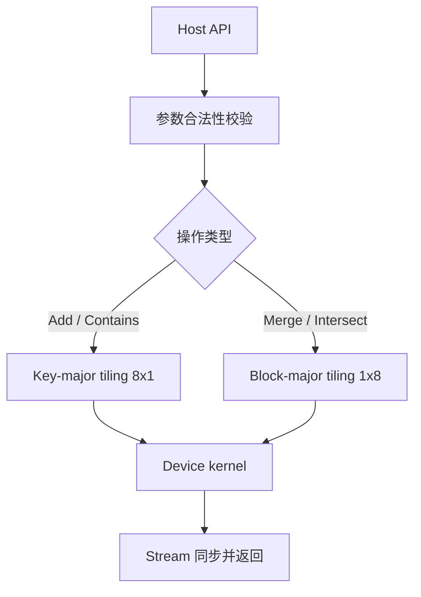

# BloomFilter 容器设计文档

# 需求背景（required）

## 需求来源

本任务来源于《7月社区任务-BloomFilter容器开发任务书》。任务要求参考 cuCollections 中的 `bloom_filter` 容器，在昇腾 NPU 上基于 Ascend C / C++ 实现功能一致的 BloomFilter 容器与算子，完成设计、开发、测试与性能验证，并在验收通过后提交至 `ops-collections` 开源仓。

## 背景介绍

cuCollections 的 `bloom_filter` 是一个 GPU 侧 blocked bloom filter。它以固定数量的 block 组成位图，每个 block 由 8 个 `uint32_t` word 组成，共 256 bit。对外提供的核心操作包括构造、析构、`add`、`contains`、`merge`、`intersect`。

任务书给出的基准配置如下：

| 项目 | 取值 |
| --- | --- |
| Key | `uint32`、`uint64`、`float32` |
| Hash | `XXHash_64` |
| Word | `uint32` |
| BlockBits | `256` |
| PatternBits | `8` |
| HorizontalLayout | `8` / `1` |
| VerticalLayout | `1` / `8` |

其中构造、析构、`Add`、`Contains` 采用 `HorizontalLayout=8`、`VerticalLayout=1`；`Merge`、`Intersect` 采用 `HorizontalLayout=1`、`VerticalLayout=8`。任务书性能要求以该基准为参照。

`merge` 在 cuCollections 中表示两个 bloom filter 的集合并，`intersect` 表示位图交集，且二者均为原地修改 `this` 的接口。`intersect` 只保证布隆过滤器语义上的交集近似，不要求恢复出真实集合交集。

blocked 形式的 bloom filter 之所以适合本任务，是因为 256 bit block 可以把一次 key 的多个 pattern bit 限制在同一个局部块内，减少完全随机的全局访存；这也是任务书把 `BlockBits` 固定为 256、`PatternBits` 固定为 8 的直接原因。

# 需求分析（required）

## 需求描述

实现 `BloomFilter<Key>` 容器，使其在 Atlas 950 系列产品上支持如下能力：

1. 支持构造、析构、`Add`、`Contains`、`Merge`、`Intersect`。
2. `Key` 支持 `uint32_t`、`uint64_t`、`float32`。
3. 接口入参顺序与 cuCollections 保持一致，Ascend C 当前缺少 device iterator 时，用 `void*` 起始地址 + `Extent` 元素个数替代。
4. 支持合法泛化输入，包括空输入、小规模输入、大规模输入、重复 key、不同滤波器大小、不同命中率查询。
5. 插入 key 后，`Contains` 对已插入 key 不得出现 false negative；未插入 key 允许 Bloom filter 固有的 false positive。
6. `Merge` / `Intersect` 对相同 policy、相同 block 数的滤波器执行原地位图运算，结果与 host 侧 bitwise golden 一致。

## 需求拆解

| 编号 | 需求项 | 设计拆解 |
| --- | --- | --- |
| 1 | 构造 / 析构 | 申请并初始化固定大小位图，析构时释放 device 内存 |
| 2 | Add | 对输入 key 计算 block index 与 pattern fingerprint，原地置位 |
| 3 | Contains | 对输入 key 复用相同 hash 路径，检查 8 个 pattern 位是否全部命中 |
| 4 | Merge | 对两个同构 bloom filter 做按 word 位或，原地合并 |
| 5 | Intersect | 对两个同构 bloom filter 做按 word 位与，原地交集 |
| 6 | dtype 适配 | `uint32_t` / `uint64_t` / `float32` 统一按 raw bytes 哈希 |
| 7 | 性能达标 | Key 路径走 8x1 布局，块路径走 1x8 布局，减少随机访存和无效同步 |

## 接口设计

建议的容器接口如下：

```cpp
template <class Key, class Extent = aclco::Extent<size_t>>
class BloomFilter {
 public:
  BloomFilter(Extent blockExtent, aclrtStream stream = nullptr);
  BloomFilter(BloomFilter const&) = delete;
  BloomFilter& operator=(BloomFilter const&) = delete;
  BloomFilter(BloomFilter&&) = default;
  BloomFilter& operator=(BloomFilter&&) = default;
  ~BloomFilter();

  void Add(void *keys, Extent keyNum, aclrtStream stream);
  void Contains(void *keys, void *outputValues, Extent keyNum, aclrtStream stream);
  void Merge(BloomFilter const& other, aclrtStream stream);
  void Intersect(BloomFilter const& other, aclrtStream stream);
};
```

接口语义如下：

| 接口 | 语义 |
| --- | --- |
| `BloomFilter` | 申请并清零 `blockExtent` 个 256-bit block |
| `~BloomFilter` | 释放 device 位图与元数据 |
| `Add` | 将输入 key 映射到 block 并置位 |
| `Contains` | 判断输入 key 对应的 8 个 pattern 位是否全部存在 |
| `Merge` | 原地执行位图 OR |
| `Intersect` | 原地执行位图 AND |

# 详细设计（required）

## 算子分析

### 数学公式

设 bloom filter 位图由 `B[i]` 表示，第 `i` 个 block 包含 256 bit，`word` 类型为 `uint32_t`，每个 block 有 8 个 word。

对 key 的 64 位哈希记为 `H(key)`，则：

$$
block\_id = H(key) \bmod block\_count
$$

$$
pos_j = f_j(H(key)), \quad j \in [0, 7]
$$

其中 `pos_j` 映射到 block 内的 256 个 bit 位置。`Add` 将这些 bit 置 1：

$$
B[block\_id][pos_j] = 1
$$

`Contains` 仅当 8 个 pattern bit 全部命中时返回真：

$$
Contains(key) = \bigwedge_{j=0}^{7} B[block\_id][pos_j]
$$

`Merge` / `Intersect` 分别为：

$$
dst = dst \lor src
$$

$$
dst = dst \land src
$$

### 支持数据类型

| Key 类型 | 哈希处理方式 | 说明 |
| --- | --- | --- |
| `uint32_t` | raw bytes | 直接按对象表示哈希 |
| `uint64_t` | raw bytes | 直接按对象表示哈希 |
| `float32` | raw bytes | 不做数值归一化，按位模式哈希 |

`float32` 采用按位语义，不做 `+0/-0` 归一化，也不做 NaN 数值折叠。这样可以与仓内 bitwise 语义保持一致。
`float32` 作为 4B key，性能路径与 I32 场景保持一致。

### 支持形状

1. `Add` / `Contains` 的输入为 1D device 连续数组。
2. `Contains` 输出为 1D bool 语义数组，device 侧可按 `uint8_t` 或 `bool` 存储。
3. `Merge` / `Intersect` 的输入为同构 bloom filter 对象，底层位图长度必须一致。
4. 任务书中的 `FilterSizeMB` 在实现层转换为 `blockCount`，一个 block 占用 32B，构造时按 `ceil(filterBytes / 32)` 计算 block 数。

## 算子实现

### 实现方案

#### 整体执行流程



#### 3.2.1 host 侧设计

host 侧主要负责参数校验、容量换算、内存生命周期管理和 kernel 调度。整体策略分为以下几层：

1. **容量换算**：将 `FilterSizeMB` 转换为字节数，再按 `32B/block` 计算 `blockCount`。任务书给出的 32MB、256MB、2048MB 三档基准都能得到整除的 block 数，因此默认路径可直接使用按位索引；若未来出现非 2 的幂大小，则回退到取模路径。
2. **对象构造**：构造阶段申请一段连续 device memory 作为位图，按 block 边界对齐，并通过清零 kernel 或 `aclrtMemset` 初始化为 0。构造不做额外逻辑，不引入多次小粒度分配。
3. **对象析构**：析构阶段只释放位图和少量元数据，保证 destructor 的时间主要是释放开销，不额外触发 compute kernel。
4. **接口校验**：`Add` / `Contains` 校验 key 指针和输出指针；`Merge` / `Intersect` 校验两侧 bloom filter 的 `blockCount`、`blockBits`、`patternBits`、`word_type` 是否一致。若不一致，host 侧直接拒绝进入 kernel。
5. **任务划分**：`Add` / `Contains` 走 key-major 路径，按 key 数量切 tile；`Merge` / `Intersect` 走 block-major 路径，按 block 数量切 tile。两类路径对应任务书的 8x1 与 1x8 layout。
6. **缓冲管理**：`Add` / `Contains` 侧维护 key tile、hash tile、mask tile 和输出 tile；`Merge` / `Intersect` 侧维护两个 block tile 缓冲，采用 ping-pong 方式减少等待。
7. **同步策略**：公开接口采用同步语义，kernel 下发后在返回前同步 stream，保证测试侧可直接读取结果。

更具体地说，host 侧的调度可以拆成下面几个子阶段：

| 子阶段 | 作用 | 说明 |
| --- | --- | --- |
| 参数预检 | 拦截非法输入 | 空指针、0 长度、非法 filter size、`Merge`/`Intersect` 不同构对象 |
| 容量换算 | 生成 blockCount | `blockCount = ceil(filterBytes / 32)` |
| 资源准备 | 申请 / 清零位图 | 构造时一次完成 |
| 任务切分 | 计算 coreNum 和 tileSize | key 路径和 block 路径分开处理 |
| 调度下发 | 选择 kernel 分支 | 依据 tilingKey 走不同执行路径 |
| 返回收口 | 同步并返回 | 确保结果可见 |

#### Add / Contains 的 host 调度

`Add` 与 `Contains` 的核心计算是“hash 一个 key，然后访问固定的 256-bit block”。因此 host 侧采用 key-major 调度：

1. 先按 `keyNum` 和平台 core 数量计算 `coreNum`。
2. 再结合 UB 容量计算每个 tile 能容纳的 key 数量。
3. 每个 core 处理一段连续 key tile，减少调度碎片。
4. 对于 `Contains`，输出 buffer 与 key buffer 同步切分，避免额外拷贝。
5. 若输入规模较小，直接使用单 tile 路径，避免过度调度。

#### Merge / Intersect 的 host 调度

`Merge` 与 `Intersect` 是纯位图运算，访问模式完全顺序化，因此 host 侧采用 block-major 调度：

1. 以 `blockCount` 作为主切分单位。
2. 每个 core 处理一段连续 block tile。
3. 由于每个 block 固定 32B，`uint4` / `uint8` 向量化读写可以直接对齐到 tile 边界。
4. 若两侧 filter 的 block 数不一致，host 侧直接报错，不进入 device 计算。

#### 3.2.2 kernel 侧设计

kernel 侧按照操作类型拆成四条主路径，所有路径都遵循“先读、后算、再写”的单向数据流：

1. **AddKernel**
   - 每个线程或线程组处理若干 key。
   - 计算 `XXHash_64`，得到 64-bit fingerprint。
   - 用低位选择 block，用后续位生成 8 个 pattern bit。
   - 将 pattern bit 转换为 `word_idx + bit_mask` 形式。
   - 采用 `atomicOr` 更新对应的 32-bit word，保证多线程写同一 block 时正确。
2. **ContainsKernel**
   - 复用相同 hash 路径和 block 映射规则。
   - 读取目标 block 的 8 个 word。
   - 逐 bit 判断是否全部命中；任一 bit 缺失则立即输出 false。
   - 不涉及原子操作，只做只读访问。
3. **MergeKernel**
   - 以 block 为粒度做顺序遍历。
   - 每次读取源 filter 和目标 filter 的同一 block。
   - 对 8 个 `uint32_t` word 做 OR，并回写目标 filter。
4. **IntersectKernel**
   - 以 block 为粒度做顺序遍历。
   - 每次读取源 filter 和目标 filter 的同一 block。
   - 对 8 个 `uint32_t` word 做 AND，并回写目标 filter。

kernel 的 bit 位置计算建议采用如下统一映射：

```text
hash64 = XXHash_64(key)
block_id = hash64 & (blockCount - 1)          // blockCount 为 2 的幂时可直接按位与
fp = Mix64(hash64)
pos_j = (fp >> (j * 8)) & 0xFF, j in [0, 7]   // 8 个 pattern bit
word_idx = pos_j >> 5
bit_mask = 1u << (pos_j & 31)
```

这样每个 key 恰好产生 8 个 bit 位点，既和任务书的 `PatternBits=8` 对齐，也保持了 block 内 256 bit 的完整利用率。对于 `blockCount` 不是 2 的幂的极端情况，可以改用取模，保证泛化合法输入可用。

#### 3.2.3 批量搬运和内存优化

1. `Add` / `Contains` 侧的 tile 以 key 为单位，UB 中只保留 hash 中间量、8 个 mask 和输出标志位，避免把整个 filter 搬进 UB。
2. `Merge` / `Intersect` 侧的 tile 以 block 为单位，连续 32B block 可直接按向量方式搬运。
3. 对 `Merge` / `Intersect`，目标和源 filter 都是连续块数组，适合用 128-bit 或 256-bit load/store 进行 unroll。
4. 对 `Add`，写操作以 atomicOr 为主，不做跨 key 的复杂聚合，避免引入额外的同步开销。
5. 对 `Contains`，读操作只需一次 block 访问，适合做尾块 mask 和 early-exit 优化。
6. 构造清零采用一次性大块清零，不按 block 循环发起大量小 kernel。

#### 3.2.4 tilingkey 规划策略

`tilingKey` 的作用是让 host 侧可以在不改接口的前提下分发不同的执行路径：

1. `tilingKey = 0`：`Add` / `Contains`，key-major，`HorizontalLayout=8`，`VerticalLayout=1`。
2. `tilingKey = 1`：`Merge` / `Intersect`，block-major，`HorizontalLayout=1`，`VerticalLayout=8`。
3. `tilingKey = 2`：构造清零，走初始化路径。

#### 3.2.5 典型执行流程

```text
Add:
  1) host 预检
  2) 选择 key-major tile
  3) kernel 计算 hash 和 bit mask
  4) atomicOr 更新 block
  5) stream 同步返回

Contains:
  1) host 预检
  2) 选择 key-major tile
  3) kernel 计算同样的 hash 和 bit mask
  4) 逐 bit 检查并输出 bool
  5) stream 同步返回

Merge / Intersect:
  1) host 校验两侧 filter 同构
  2) 选择 block-major tile
  3) kernel 顺序读写 block
  4) 对每个 word 做 OR / AND
  5) stream 同步返回
```

#### 3.2.6 数据检测

1. `keys == nullptr` 或 `outputValues == nullptr` 时直接返回或报错。
2. `keyNum == 0` 时直接返回，不启动 kernel。
3. `blockCount == 0` 或 `FilterSizeMB` 非法时拒绝构造。
4. `Merge` / `Intersect` 的两个输入必须是同一 policy、同一 block 数。
5. `float32` key 不做数值归一化，测试中避免把 NaN 作为有效 golden。
6. `Add` 允许重复 key，重复写同一 bit 是幂等操作，不改变结果。
7. `Contains` 对已插入 key 必须返回 true；对未插入 key 的 false positive 只要符合 Bloom filter 语义即可。
8. `Merge` / `Intersect` 如果 `this == &other`，允许作为自合并 / 自交集路径直接返回，不需要额外搬运。

#### 3.2.7 参数换算样例

为了让构造参数和任务书基线完全对齐，给出三档典型 filter size 的换算样例：

| FilterSizeMB | FilterBytes | BlockSize | BlockCount | 说明 |
| --- | --- | --- | --- | --- |
| 32 | 33,554,432 | 32B | 1,048,576 | 2^20 blocks |
| 256 | 268,435,456 | 32B | 8,388,608 | 2^23 blocks |
| 2048 | 2,147,483,648 | 32B | 67,108,864 | 2^26 blocks |

上述三档都满足 `blockCount` 为 2 的幂，因此 `block_id = hash & (blockCount - 1)` 的按位映射可以直接使用，减少取模开销。对于未来若出现非 2 的幂大小，host 侧切换到模运算即可，不影响接口兼容性。

#### 3.2.8 关键伪代码

**Add**

```text
for key in keys:
  h = XXHash_64(key)
  block_id = h & (blockCount - 1)
  fp = Mix64(h)
  for j in 0..7:
    pos = (fp >> (j * 8)) & 0xFF
    word_idx = pos >> 5
    bit_mask = 1u << (pos & 31)
    atomicOr(bits[block_id][word_idx], bit_mask)
```

**Contains**

```text
for key in keys:
  h = XXHash_64(key)
  block_id = h & (blockCount - 1)
  fp = Mix64(h)
  hit = true
  for j in 0..7:
    pos = (fp >> (j * 8)) & 0xFF
    word_idx = pos >> 5
    bit_mask = 1u << (pos & 31)
    hit = hit && ((bits[block_id][word_idx] & bit_mask) != 0)
  output[key] = hit
```

**Merge**

```text
for block in blocks:
  for w in 0..7:
    dst[block][w] = dst[block][w] | src[block][w]
```

**Intersect**

```text
for block in blocks:
  for w in 0..7:
    dst[block][w] = dst[block][w] & src[block][w]
```

这四段伪代码是实现层最核心的路径：`Add` 和 `Contains` 共享 hash 和 pattern 生成逻辑，`Merge` 和 `Intersect` 共享 block 级遍历框架，只替换 word 运算符。

### 支持硬件

| 支持的芯片版本 | 涉及勾选 |
| --- | --- |
| Atlas 950 系列产品 | √ |

### 算子约束限制

1. 仅支持 `uint32_t`、`uint64_t`、`float32` 三类 key。
2. 每个 block 固定为 256 bit，word 类型固定为 `uint32_t`。
3. `Merge` / `Intersect` 只能作用于同构 bloom filter。
4. `Contains` 对已插入 key 不得出现 false negative；未插入 key 允许 Bloom filter 固有 false positive。
5. `Merge` 是原地集合并，`Intersect` 是原地位图交集，均修改左值对象。

# 可维可测分析

## 精度标准/性能标准

| 验收标准 | 描述 | 标准来源 |
| --- | --- | --- |
| 精度标准 | 已插入 key 必须 100% 命中；`Merge` / `Intersect` 的 bitwise golden 必须一致 | 任务书 |
| 性能标准 | I32 场景耗时需满足 `Total Time / 0.8`，I64 场景耗时需满足 `Total Time / 0.6` | 任务书性能表 |
| 泛化标准 | 覆盖空输入、重复 key、大规模输入、不同 filter size、不同命中率 | 任务书 |

## 测试方案

| 测试场景 | 覆盖内容 | 预期结果 |
| --- | --- | --- |
| 构造 / 析构 | 32MB、256MB、2048MB 三档 filter size | 内存申请释放正确，无泄漏 |
| Add 基础 | 单 batch、重复 key、空输入、边界 key | 已插入 key 全部可查到，重复插入不破坏结果 |
| Contains 基础 | 全命中、全不命中、混合命中 | 已插入 key 全真，未插入 key 允许 false positive |
| Merge | 两个同构 filter 的并集 | 位图 OR 结果与 host golden 一致 |
| Intersect | 两个同构 filter 的交集 | 位图 AND 结果与 host golden 一致 |
| float32 | 按位模式一致的 float key | 按 raw bytes 处理，结果稳定 |
| 性能测试 | 80M key、任务书指定 filter size | 满足 I32 / I64 性能阈值 |

更细粒度的自测用例建议按下面几类展开：

| 用例组 | 具体场景 | 重点校验 |
| --- | --- | --- |
| 正向功能 | 插入 1-10、查询 1-10 | 1-10 全部命中，不出现 false negative |
| 负向查询 | 插入 1-10、查询 11-20 | 允许少量 false positive，但不能误伤已插入 key |
| 重复写入 | 同一个 key 连续 Add 多次 | 结果与单次 Add 一致 |
| 全零 filter | 构造后不插入直接 Contains | 全部为 false |
| 全一 filter | 人工置满位图后 Contains | 全部为 true |
| Merge 同构 | 两个相同 filter Merge | 结果与 bitwise OR golden 一致 |
| Intersect 同构 | 两个相同 filter Intersect | 结果与 bitwise AND golden 一致 |
| float32 位模式 | `1.0f`、`-0.0f`、`+0.0f` | 按 bit pattern 区分，不做数值折叠 |
| 大规模压力 | 80M key、32MB/256MB/2048MB | 验证吞吐和内存稳定性 |

性能测试建议按任务书场景分别记录：

| 场景 | 关键参数 | 关注点 |
| --- | --- | --- |
| 构造 | `FilterSizeMB=32/256/2048` | 清零效率、申请效率 |
| 析构 | `FilterSizeMB=32/256/2048` | 释放效率 |
| Add | `NumInput=80000000` | atomicOr 热点和 key-major tile 效率 |
| Contains | `NumInput=80000000` | 只读访问带宽和尾块处理 |
| Merge | `NumInput=80000000` | 顺序 block OR 带宽 |
| Intersect | `NumInput=80000000` | 顺序 block AND 带宽 |

## 性能优化策略

| 策略 | 适用操作 | 作用 |
| --- | --- | --- |
| 8x1 key-major 调度 | Add / Contains | 减少随机 key 访存带来的调度碎片 |
| 1x8 block-major 调度 | Merge / Intersect | 提高连续 block 的带宽利用率 |
| 32B block 对齐 | 所有操作 | 让 256-bit block 可以直接向量化处理 |
| raw-bit hash | Add / Contains | float32 与整数 key 走同一路径，减少分支 |
| atomicOr 仅用于 Add | Add | 避免在查询 / 合并路径引入原子瓶颈 |
| early-exit | Contains | 一旦发现 bit 缺失立即返回 false |
| 清零一次性大块写 | 构造 | 避免大量小粒度初始化开销 |

## 风险与规避措施

| 风险 | 影响 | 规避措施 |
| --- | --- | --- |
| key 访问完全随机 | Add / Contains 吞吐波动 | 使用 key-major tile，尽量把 hash 计算和 bit 更新留在同一核内 |
| atomicOr 热点 | 同一 block 被大量 key 命中时写冲突 | 以 block 8-bit pattern 分散写位，减少重复写同一 word |
| false positive 率偏高 | 非插入 key 也可能返回 true | 严格按 `PatternBits=8` 和 `BlockBits=256` 设计，不额外缩减 block |
| Merge / Intersect 尺寸不一致 | 运行结果错误 | host 侧先校验 blockCount、word_type、pattern_bits |
| 大 filter 内存不足 | 构造失败 | 构造前检查设备剩余显存，失败时给出明确错误 |
| float32 位模式差异 | 测试结果不稳定 | 不做数值归一化，测试用例避免使用 NaN 作为金标准 |

## 兼容性分析

本设计是新增容器，不破坏现有 `static_set`、`static_map`、`dynamic_map` 接口。`float32` 采用按位哈希，避免数值归一化带来的兼容歧义。`Merge` / `Intersect` 的同构约束在 host 侧提前检查，避免错误输入进入 kernel。
