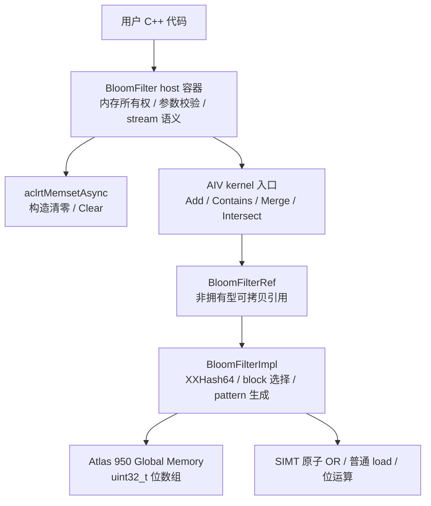
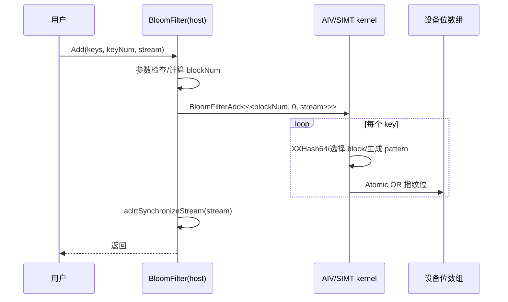
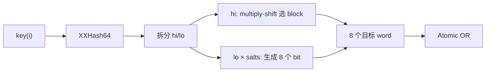

# 需求背景

## 需求来源

本需求来源于“7 月社区任务-BloomFilter 容器开发任务书”。任务要求参考
NVIDIA cuCollections 中的 `cuco::bloom_filter`，在昇腾 NPU 上使用 Ascend C/C++
实现功能一致的 BloomFilter 容器及算子，适配 Atlas 950 系列产品，并完成设计、
开发、功能测试、性能测试和验收交付。

## 背景介绍

### BloomFilter 容器目标

BloomFilter 是一种空间效率高的概率型集合成员查询结构。它使用位数组保存键的
哈希指纹：

- 对已 Add 的键，Contains 必须返回 `true`，即不允许假阴性；
- 对未 Add 的键，Contains 可能返回 `true`，即允许可控的假阳性；
- BloomFilter 不保存原始 key，不能枚举或还原已插入元素。

本任务需要实现以下核心能力：

1. 构造：申请并清零固定大小的过滤器存储；
2. 析构：释放设备存储；
3. Add：批量加入 key；
4. Contains：批量查询 key；
5. Clear：清空过滤器；
6. Merge：将另一个兼容过滤器按位或到当前过滤器，实现集合并的过滤器表示；
7. Intersect：将另一个兼容过滤器按位与到当前过滤器，得到集合交的保守近似。

key 类型支持 `uint32_t`、`uint64_t` 和 `float`。任务书性能基线使用 64 位
XXHash、32 位 Word、256 bit Block、8 bit Pattern，并要求适配 Atlas 950 系列产品。
当前 MVP 将设备 ABI 和位级兼容范围收敛为 `XXHash_64<Key>(seed)` 与
`uint32_t` Word；`PatternBits` 是编译期可配置项，但必须能被 `WordsPerBlock`
整除。模板参数的存在不表示当前版本已支持其他 hash 状态或 64 位 Word。

### 参考实现现状分析

cuCollections 参考实现采用 Sectorized Bloom Filter（SBF）设计。位数组被划分为
固定大小的 block，每个 key 只访问一个 block；一个 64 位哈希值的高 32 位用于
选择 block，低 32 位用于生成该 block 内的指纹位。默认参数为：

| 参数 | 默认值 | 含义 |
| --- | ---: | --- |
| `Word` | `uint32_t` | 位数组的最小存储字 |
| `WordsPerBlock` | `32 / sizeof(Word) = 8` | 每个 block 的 word 数 |
| `BlockBits` | `8 × 32 = 256` | 每个 block 的位数 |
| `PatternBits` | `8` | 每个 key 设置/检查的指纹位数 |
| Add 布局 | `Horizontal=8, Vertical=1` | 8 个协作 lane 分别处理 1 个 word |
| Contains 布局 | `Horizontal=1, Vertical=8` | 1 个 lane 纵向读取 8 个 word |
| Hash | `xxhash_64<Key>` | 产生 64 位哈希 |

cuCollections 公开同步和异步接口；同步接口在异步 kernel 下发后同步指定 stream。
Merge 对两个等长位数组逐 word 执行 OR，Intersect 逐 word 执行 AND。Intersect
不等价于对原始集合求交后重新构造 BloomFilter，但不会使两个输入集合交集中的元素
产生假阴性。

当前 `ops-collections` 已具备以下可复用基础：

| 已有能力 | 现有路径 | 本需求复用方式 |
| --- | --- | --- |
| 容器模板和 `void* + Extent + aclrtStream` 接口风格 | `include/static_set.h`、`include/dynamic_map.h` | 统一公开接口和同步/异步命名 |
| 设备内存分配器 | `include/utility/allocator.h` | 管理 BloomFilter 位数组 |
| SIMT AIV kernel 启动方式 | `include/detail/open_addressing/kernels.h` | 使用 `COLLECTION_AIV_GLOBAL` 和 `VF_CALL` |
| 32 位 XXHash | `include/detail/hash_functions/xxhash.h` | 复用结构，并新增 64 位 XXHash |
| ACL 测试环境、设备缓冲和生成器 | `tests/common/` | 构建功能测试和 CPU golden |
| 性能测试框架 | `tests/performance/` | 统一预热、重复测量和统计输出 |
| Atlas 950 编译配置 | 根目录和 `tests/CMakeLists.txt` | 沿用 `dav-c310` 编译架构 |

# 需求分析

## 需求描述

在 `ops-collections` 中新增 `aclco::BloomFilter` 容器，面向 Atlas 950 系列产品提供
构造、析构、Add、Contains、Clear、Merge 和 Intersect 能力。公开接口使用设备地址、
元素个数和 ACL stream 替代 CUDA device 迭代器和 CUDA stream；算法语义参考
cuCollections，接口形态和错误处理遵循当前仓库实现。

实现需要满足：

- `uint32_t`、`uint64_t`、`float` 三类 key；
- 任意合法 key 数量，包括 0、非对齐数量和超大批量；
- 32 MB、256 MB、2048 MB 等不同过滤器规模；
- 重复 key、高冲突、高/低命中率等数据分布；
- 多 stream 串行依赖场景下的正确性；
- 任务书规定的功能精度和性能上限。

## 需求拆解

1. 新增 64 位 XXHash，实现三种 key 的稳定 64 位哈希。
2. 新增 BloomFilterPolicy，描述 Word、Block、Pattern 和 Add/Contains 布局。
3. 新增拥有设备存储所有权的 `BloomFilter` host 容器。
4. 新增仅在 AICore 侧构造的非拥有型 `BloomFilterRef`，公开标量设备接口供用户
   自定义 kernel 使用；host 通过 raw pointer/长度/seed ABI 传参，由 kernel 在
   设备侧重建 Ref。
5. 构造和 Clear 使用 ACL 异步 memset 清零；Add、Contains、Merge 和 Intersect
   使用 AIV/SIMT kernel。
6. Add 使用原子 OR，保证多线程更新同一 word 时不丢位。
7. Contains 对预期指纹执行包含判断，输出逐 key 的 `uint8_t` 布尔结果。
8. Merge/Intersect 在 host 侧检查兼容性，在 device 侧分别执行逐 word OR/AND。
9. 对同步接口在任务下发后同步指定 stream；异步接口不做同步，但仍执行参数/对象
   状态检查，因而允许抛出异常。
10. 验收需提供 CPU golden、功能/泛化/异常边界测试和性能测试。
11. 将实际存在的 BloomFilter 测试接入 CMake，并补充 API 文档和自验证报告；未执行
    的测试不得在报告中标记为通过。

# 详细设计

## 算子分析

### 数学公式

设过滤器包含 `B` 个 block，每个 block 有 `W` 个 word，每个 word 有 `L` 位，
总位数为：

$$
m = B \times W \times L
$$

默认配置为 `W=8`、`L=32`，故每个 block 为 256 bit（32 byte），设备存储字节数为：

$$
\mathrm{bytes} = B \times 8 \times 4 = 32B
$$

使用 policy 保存的 seed 对 key 计算 64 位哈希：

$$
h = \mathrm{XXHash64}(key, seed)
$$

拆分为高、低 32 位：

$$
h_{hi} = h \gg 32,\qquad h_{lo} = h \bmod 2^{32}
$$

使用乘法缩放选择 block，避免普通取模：

$$
b = \left\lfloor\frac{h_{hi}\times B}{2^{32}}\right\rfloor,\quad 0\le b < B
$$

对第 `j` 个盐值 `s_j`，从乘法哈希的高位获得 word 内 bit 位置：

$$
p_j = (s_j \times h_{lo}) \gg (32-\log_2 L)
$$

默认 `L=32`，因此 `p_j∈[0,31]`。令 `k=PatternBits`，当前策略要求
`k mod W = 0`，每个 word 使用 `q=k/W` 个 salt。第 `r` 个 word 的 mask 为：

$$
\mathrm{mask}_r =
\bigvee_{t=0}^{q-1}
\left(1_{\mathrm{Word}}\ll p_{rq+t}\right),
\qquad r=0,\ldots,W-1
$$

默认 `W=8、k=8`，即每个 word 恰好生成 1 bit。Add 的更新公式为：

$$
\mathrm{filter}[bW+r]\leftarrow
\mathrm{filter}[bW+r]\ |\ \mathrm{mask}_r
$$

由于多个 key 可能并发命中同一 word，更新必须使用设备原子 OR。

Contains 的判断公式为：

$$
\mathrm{contains}(key)=
\bigwedge_{r=0}^{W-1}
\left(
(\mathrm{filter}[bW+r]\ \&\ \mathrm{mask}_r)=\mathrm{mask}_r
\right)
$$

Merge 原地更新当前过滤器：

$$
F_{this}[i]\leftarrow F_{this}[i]\ |\ F_{other}[i]
$$

Intersect 原地更新当前过滤器：

$$
F_{this}[i]\leftarrow F_{this}[i]\ \&\ F_{other}[i]
$$

在均匀独立哈希的近似假设下，普通 BloomFilter 的假阳性率估算为：

$$
P_{fp}\approx(1-e^{-kn/m})^k
$$

其中 `n` 是已 Add 的不同 key 数，`k=PatternBits`。SBF 将一次查询限制在一个
block，实际假阳性率还受 block 内负载偏斜影响，测试应以 CPU 位级 golden 和统计
结果为准，不能只用上式判定正确性。

### 支持数据类型

| 对象 | 数据类型 | 说明 |
| --- | --- | --- |
| key | `uint32_t` | 4 字节无符号整数 |
| key | `uint64_t` | 8 字节无符号整数 |
| key | `float` | 4 字节浮点数，按对象字节参与哈希 |
| Hash | `xxhash_64<Key>` | 当前 MVP 仅传递/保存一个 `uint64_t seed` |
| Word | `uint32_t` | 当前 MVP 固定为 32 位，不支持 `uint64_t` Word |
| Contains 输出 | `uint8_t` | `0` 表示不包含，非 0 表示可能包含 |
| 数量/范围 | `Extent<size_t>` | 表达 block 数和 key 数 |
| stream | `aclrtStream` | ACL 执行流 |

`float` key 的哈希输入为其对象表示。`+0.0f` 与 `-0.0f`、不同 NaN payload
可能产生不同哈希；容器不做数值归一化。测试应以相同 bit pattern 构造输入和查询。

### 支持形状

BloomFilter 是 C++ 容器直调接口，不接收框架 Tensor shape。`keys` 和
`outputValues` 均视为一维连续设备数组：

| 接口 | 逻辑形状 |
| --- | --- |
| Add | `keys[keyNum]` |
| Contains | `keys[keyNum] -> outputValues[keyNum]` |
| Clear | `words[numBlocks × wordsPerBlock]` |
| Merge/Intersect | 两个等长 `words[numBlocks × wordsPerBlock]` |

`keyNum` 可为 0 或任意正整数，不要求是线程数、核数、8 或 32 的倍数。尾部元素通过
有效位判断处理。设 `B=numBlocks`、`W=WordsPerBlock`，构造时逐项校验：

$$
0 < B \le UINT32\_MAX
$$

$$
B \le \left\lfloor\frac{SIZE\_MAX}{W}\right\rfloor,\qquad
B \le \left\lfloor\frac{\mathrm{numeric\_limits<SizeType>::max()}}{W}\right\rfloor
$$

$$
B \le \left\lfloor\frac{SIZE\_MAX}{W\times sizeof(WordType)}\right\rfloor
$$

因此 `NumWords=B×W` 同时可由 `size_t` 和 `Extent::ValueType` 表示，且
`SizeBytes=NumWords×sizeof(WordType)` 不发生 `size_t` 溢出。

## 算子实现

### 实现方案

#### 模块与文件规划

| 模块 | 当前实现/验证路径 | 设计职责 |
| --- | --- | --- |
| 公开容器 | `include/bloom_filter.h` | 所有权、公开同步/异步接口、参数检查、kernel 下发 |
| 公开策略 | `include/bloom_filter_policy.h` | SBF 编译期参数和静态约束 |
| 设备引用 | `include/bloom_filter_ref.h` | 非拥有型设备引用和单 key Add/Contains |
| host 转发实现 | `include/detail/bloom_filter/bloom_filter.inl` | 容器方法定义 |
| 核心算法 | `include/detail/bloom_filter/bloom_filter_impl.h` | 哈希拆分、指纹、原子更新、查询 |
| kernel 入口 | `include/detail/bloom_filter/kernels.h` | Add/Contains/Merge/Intersect AIV/SIMT 入口；保留 Clear 入口 |
| 64 位 XXHash | `include/detail/hash_functions/xxhash.h`、`include/hash_functions.h` | `XXHash_64` 与公开别名 |
| 功能测试 | `tests/bloom_filter/*.cpp`、`tests/common/bloom_filter_golden.h` | 已落盘的功能测试与 CPU golden |
| 性能测试 | `tests/performance/bloom_filter/perf_*.cpp` | 构造、析构及五个操作的性能用例源码已落盘；硬件数据待实测 |

#### 分层架构



#### 公开接口设计

当前公开模板如下：

```cpp
template <
    class Key,
    class Extent = aclco::Extent<size_t>,
    class Policy = aclco::BloomFilterPolicy<Key>,
    class Allocator = aclco::DefaultAllocator<typename Policy::WordType>>
class BloomFilter;
```

核心接口如下（省略属性宏；参数默认值与头文件一致）：

```cpp
using RefType = BloomFilterRef<Key, typename Extent::ValueType, Policy>;

explicit BloomFilter(ExtentType numBlocks,
                     PolicyType const& policy = PolicyType{},
                     AllocatorType const& allocator = AllocatorType{},
                     aclrtStream stream = nullptr);
~BloomFilter();

void Clear(aclrtStream stream = nullptr);
void ClearAsync(aclrtStream stream = nullptr);

void Add(void* keys, ExtentType keyNum, aclrtStream stream = nullptr);
void AddAsync(void* keys, ExtentType keyNum, aclrtStream stream = nullptr);

void Contains(void* keys, void* outputValues,
              ExtentType keyNum, aclrtStream stream = nullptr) const;
void Contains(void* keys, ExtentType keyNum, void* outputValues,
              aclrtStream stream = nullptr) const;
void ContainsAsync(void* keys, void* outputValues,
                   ExtentType keyNum, aclrtStream stream = nullptr) const;
void ContainsAsync(void* keys, ExtentType keyNum, void* outputValues,
                   aclrtStream stream = nullptr) const;

void Merge(BloomFilter const& other, aclrtStream stream = nullptr);
void MergeAsync(BloomFilter const& other, aclrtStream stream = nullptr);

void Intersect(BloomFilter const& other, aclrtStream stream = nullptr);
void IntersectAsync(BloomFilter const& other, aclrtStream stream = nullptr);

WordType* Data() noexcept;
WordType const* Data() const noexcept;
ExtentType BlockExtent() const noexcept;
SizeType NumWords() const noexcept;
std::size_t SizeBytes() const noexcept;
PolicyType const& GetPolicy() const noexcept;
```

两组 Contains 重载分别支持仓库现有顺序
`(keys, outputValues, keyNum, stream)` 和参考接口顺序
`(keys, keyNum, outputValues, stream)`；后者转发到前者，二者语义相同。

`BloomFilterRef` 不拥有存储，并且只能在 AICore kernel 内由 `__gm__ WordType*`、
block 数和 Policy 构造；host owning 容器不构造或传递 Ref 对象。其对外设备侧
标量接口为 `Add(KeyType const&)` 和 `Contains(KeyType const&)`，供用户自定义
kernel 做单 key 操作；`AddWord`/`ContainsWord` 是批量 H8 实现使用的分 word
辅助能力，不作为本 MVP 的协作式公开契约。

接口参数说明：

| 接口 | 名称 | 类别 | dtype | 含义 |
| --- | --- | --- | --- | --- |
| 构造 | `numBlocks` | 输入 | `Extent` | 过滤器 block 数，每个默认 block 为 32 byte |
| 构造 | `policy` | 输入 | `Policy` | 哈希和指纹布局策略 |
| 构造 | `allocator` | 输入 | `Allocator` | 设备内存分配器 |
| 全部 | `stream` | 输入 | `aclrtStream` | kernel、拷贝和同步所使用的 ACL stream |
| Add | `keys` | 输入 | `void*` | device 侧连续 key 数组首地址 |
| Add | `keyNum` | 输入 | `Extent` | key 数量 |
| Contains | `keys` | 输入 | `void*` | device 侧连续查询 key 数组首地址 |
| Contains | `outputValues` | 输出 | `void*` | device 侧 `uint8_t[keyNum]` 查询结果；支持上述两种参数顺序 |
| Merge/Intersect | `other` | 输入 | `BloomFilter const&` | 与当前过滤器配置兼容的另一过滤器 |

拷贝构造和拷贝赋值删除，移动构造和移动赋值允许。构造函数在指定 stream 上完成
清零并同步后才返回；同步操作接口同样等待指定 stream 完成。Async 接口只负责检查
并下发，不同步，但不是 `noexcept`：参数错误、无有效存储等状态错误，以及
`ClearAsync` 的 ACL 提交失败均可抛出异常。析构只释放自身设备存储，不隐式同步，
也不接管外部地址；调用方必须保证所有异步使用在析构或复用对象/缓冲区之前完成。

#### 3.2.1 host 侧设计

##### 构造与析构

构造流程：

1. 校验 `numBlocks > 0`；
2. 校验 `numBlocks <= UINT32_MAX`，以满足高 32 位 multiply-shift 的 block 索引 ABI；
3. 按“支持形状”中的三个上界校验 `NumWords` 和 `SizeBytes` 的乘法范围；
4. 通过 Allocator 申请设备位数组，空返回抛出 `std::bad_alloc`；
5. 调用同步 `Clear(stream)`：先执行 `aclrtMemsetAsync`，再
   `aclrtSynchronizeStream(stream)`，保证构造返回时位数组已经为 0；
6. 若清零或同步失败，先释放已申请存储，再传播异常。

析构调用 Allocator 释放设备存储。若此前仍有异步操作未完成，调用方必须先同步；
析构函数和移动赋值中的旧存储释放都不隐式同步未知 stream。

##### 参数检查

| 检查项 | 处理 |
| --- | --- |
| `keyNum == 0` | Add/Contains 快速返回，不下发 kernel；允许空指针 |
| `keyNum > 0 && keys == nullptr` | 报告参数错误，不下发 kernel |
| Contains 输出为空 | `keyNum > 0` 时报告参数错误 |
| Add/Contains 对象无存储 | Async 路径报告对象状态错误；常见于 moved-from 对象 |
| Merge/Intersect block 数不同 | 报告参数错误，不修改当前过滤器 |
| Merge/Intersect Policy 不兼容 | 要求模板类型相同，并比较有状态 hash/policy 的配置 |
| `other` 与 `this` 相同 | Merge 为幂等；Intersect 为幂等，可直接返回 |
| 分配失败 | 抛出 `std::bad_alloc` |
| ACL memset/stream 同步失败 | 抛出 `std::runtime_error`，不打印后继续 |

Async 后缀仅表示“不等待 stream 完成”，不表示“不检查参数”或“不抛异常”。

##### 任务划分策略

该容器采用头文件模板直接下发 kernel，不使用算子框架的独立 tiling data。当前
Add/Contains/Merge/Intersect 固定每个 AIV 核 `1024` 个 SIMT 线程，host 侧按下式
确定核数：

$$
\mathrm{workItems}_{key}=keyNum
$$

$$
\mathrm{workItems}_{word}=numBlocks\times WordsPerBlock
$$

$$
\mathrm{blockNum}=
\max\left(1,
\min\left(\mathrm{AivCoreNum},
\left\lceil\frac{\mathrm{workItems}}{1024}\right\rceil\right)\right)
$$

若平台查询返回 0 个 AIV 核，host 侧按 1 处理。kernel 内使用 grid-stride 循环
覆盖全部元素。`keyNum==0` 在计算核数前快速返回；Clear 当前直接调用
`aclrtMemsetAsync`，不使用此分核公式。

| kernel | work item | 分核依据 |
| --- | --- | --- |
| Clear | 连续字节区间 | `aclrtMemsetAsync`，当前不下发 Clear kernel |
| Add | 1 个 key 或 1 个 key 的协作组 | `keyNum` 和 AddHorizontalLayout |
| Contains | 1 个 key 或 1 个 key 的协作组 | `keyNum` 和 ContainsHorizontalLayout |
| Merge/Intersect | 1 个 `uint32_t` word | 总 word 数 |

##### tiling key / 编译期分支

本容器参数主要为 C++ 模板编译期常量，不设置运行时 tiling key。以下分支由模板实例化
生成：

- key dtype：`uint32_t` / `uint64_t` / `float`；
- `Word`：当前 MVP 固定为 `uint32_t`；
- Add 的 Horizontal/Vertical layout；
- Contains 的 Horizontal/Vertical layout；
- 是否启用“先读后原子 OR”的 ConditionalAdd；
- 是否启用 Contains early exit。

任务书基准配置固定为 `Word=uint32_t`、`WordsPerBlock=8`、`PatternBits=8`。
默认 Policy 的 Add 为 `8×1`、Contains 为 `1×8`；性能用 Contains Policy 使用
`8×1`。当前仅对 `W=8 && Horizontal=8 && Vertical=1` 提供 tile shuffle 批量
优化，其他满足静态约束的布局走逐线程标量 `BloomFilterRef::Add/Contains` 路径，
不会改变位级结果。

##### 调用链



#### 3.2.2 kernel 侧设计

##### 公共索引与尾块处理

每个 SIMT 线程计算全局线程号和总线程数：

```cpp
globalThreadIdx = blockIdx * threadNum + threadIdx;
totalThreadNum  = blockNum * threadNum;
for (i = globalThreadIdx; i < n; i += totalThreadNum) {
    // process i
}
```

因此 `n` 不要求对齐。kernel 的计数、全局线程索引和步长使用 `uint64_t`；block
索引经构造范围校验后使用 `uint32_t`，内置 bulk kernel 的 Ref 使用 `uint64_t`
计算 word 偏移，避免 2048 MB 过滤器场景发生 32 位字节偏移溢出。

##### Clear 清零路径

当前公开 `ClearAsync` 对 `[data, data+SizeBytes)` 调用
`aclrtMemsetAsync(data, SizeBytes, 0, SizeBytes, stream)`；`Clear` 在其后同步
stream。构造函数调用同步 `Clear`，所以构造返回时清零已经完成。
`kernels.h` 中虽保留 `BloomFilterClear`/`ClearSimt` 入口，当前 host 接口未调用它，
不能把该入口的预期性能当作公开 Clear 的实测性能。Clear 不需要原子操作，因为公开
契约要求调用方避免与 Add/Contains/Merge/Intersect 并发修改同一过滤器。

##### Add kernel

Add 流程：

1. 从 `keys[i]` 加载 key；
2. 计算 `XXHash64(key)`；
3. 使用高 32 位选择 block；
4. 使用低 32 位和 `PatternBits` 个固定 salt，按
   `PatternBits/WordsPerBlock` 均分生成各 word mask；
5. 对目标 word 执行原子 OR。



当前 `W=8、Horizontal=8、Vertical=1` 批量路径采用 8-lane tile shuffle 转置：

1. tile 中每个 lane 先加载并哈希自己的一个 key，得到 `valid/block/lowerHash`；
2. 依次枚举 `sourceLane=0..7`，用宽度为 8 的 `asc_shfl` 将该 source lane 的
   `valid/block/lowerHash` 广播给整个 tile；
3. 目标 lane `r` 对广播 key 的第 `r` 个 word 执行 `AddWord<r>`；
4. 因而一个 tile 的 8 个 lane 合作完成 8 个 key × 8 个 word 的转置处理，而不是
   让 8 个 lane 只处理一个 key 后立即前进；
5. 尾 tile 的所有 lane 仍参与 shuffle，通过被广播的 `valid` 抑制越界 key。

同一 word 的并发更新使用原子 OR。其他合法布局进入标量
`BloomFilterRef::Add(key)` 的 grid-stride 路径。

ConditionalAdd 优化可先普通读取：

```cpp
if ((oldWord & mask) != mask) {
    AtomicOr(wordPtr, mask);
}
```

它适用于重复 key 或高填充率场景，但增加一次读；默认关闭，通过性能数据决定是否
为特定配置启用。

##### Contains kernel

Contains 使用与 Add 完全相同的 hash、block 和 pattern 生成逻辑，逐 word 判断
所需 bit 是否全部存在，最终写 `outputValues[i]`。

默认 `Horizontal=1, Vertical=8` 当前走标量
`BloomFilterRef::Contains(key)`：一个线程依次检查一个 key 的 8 个 word。
性能用 `Horizontal=8, Vertical=1` 走与 Add 相同的 8-lane tile shuffle 转置：
每个 source lane 的 block 和 lower hash 依次广播，每个目标 lane 检查一个 word，
再通过 `asc_shfl_xor` 的 `1/2/4` 步执行 tile 内 AND 归约，最终由 source lane 写回
对应 key 的 `uint8_t` 结果。尾 tile 同样广播 `valid`，无越界读取/写回。两种布局
的结果必须逐 bit 一致。`EarlyExitContains` 只影响当前标量 Ref 路径；H8 协作路径
固定检查 8 个 word 后归约。

Contains 只读取过滤器，无需原子操作。若与同 stream 中先前 Add 串行，stream 顺序
保证可见性；跨 stream 并发时，调用方必须使用事件或显式同步建立依赖。

##### Merge / Intersect kernel

两个接口均要求过滤器的 `Key`、Policy、Word、block 数、hash seed 和布局配置兼容。
kernel 对总 word 数做线性遍历：

```cpp
thisWords[i] = thisWords[i] | otherWords[i]; // Merge
thisWords[i] = thisWords[i] & otherWords[i]; // Intersect
```

每个输出 word 只由一个线程写，因此不需要原子操作。当前实现按 `uint32_t` word
执行标量 load/OR(or AND)/store，并以连续线程加 grid-stride 循环覆盖
32 MB～2048 MB 位数组；尚未实现基于地址对齐选择宽 load/store 的分支。

##### kernel ABI 与 Policy 重建

host 不把 C++ Policy 对象或 Ref 对象直接作为 kernel 参数传递。当前 ABI 为：

```cpp
BloomFilterAdd(filterRaw, keysRaw, numBlocksU64, keyNumU64, hashSeedU64);
BloomFilterContains(
    filterRaw, keysRaw, outputRaw, numBlocksU64, keyNumU64, hashSeedU64);
BloomFilterMerge(destinationRaw, sourceRaw, numWordsU64);
BloomFilterIntersect(destinationRaw, sourceRaw, numWordsU64);
```

指针以 raw `uint8_t*` 传入，在设备函数内恢复为对应 `Word*`/`Key*`。Add/Contains
在 kernel 内通过 `Policy(typename Policy::Hasher{hashSeed})` 重建 Policy 和 Ref。
因此当前 ABI 只覆盖“XXHash64 + 一个 `uint64_t seed`”状态；含额外运行时状态或不能
由 seed 构造的替代 hasher 不属于 MVP。

##### 内存与并发一致性

| 场景 | 设计保证 |
| --- | --- |
| 多线程 Add 同一 bit/word | Atomic OR 防止丢更新 |
| 同 stream Add 后 Contains | stream 顺序保证 Contains 看到 Add 结果 |
| 同 stream Merge/Intersect | 原地更新按下发顺序执行 |
| 不同 stream 访问同一过滤器 | 调用方通过 event/sync 建立依赖 |
| Contains 并发 Contains | 只读，可并发 |
| Clear 与任何其他操作并发 | 不支持，属于数据竞争 |
| Merge/Intersect 与 Add 并发写同一过滤器 | 不支持，属于数据竞争 |

##### 64 位 XXHash 设计

当前实现已在 hash 目录提供 `XXHash_64<Key>`，返回 `uint64_t`，支持本任务的
4/8 字节 key，并通过下列公开别名使用：

```cpp
template <typename Key>
using xxhash_64 = detail::XXHash_64<Key>;
```

CPU golden 与 device 实现必须使用同一 seed 和同一对象字节序规则。仓内已存在
`tests/utility/xxhash64_test.cpp`，但 Atlas 950/CANN 环境中的 host/device 结果仍
需用固定向量和随机 key 执行后，才能形成验收结论，不能由源码存在推断测试通过。

##### 策略静态约束

`BloomFilterPolicy` 在编译期检查：

1. `Extent::ValueType` 为无符号整数，避免负数量转换成 kernel ABI 中的超大
   `uint64_t`；
2. `Word` 为无符号整数且 `sizeof(Word)==4`，即当前仅支持 `uint32_t` Word；
3. hash 返回类型严格为 `uint64_t`；
4. `WordsPerBlock` 非 0 且为 2 的幂，`WordBits` 也为 2 的幂；
5. `PatternBits >= WordsPerBlock`；
6. `PatternBits <= 64` 且
   `PatternBits <= WordBits × WordsPerBlock`；
7. `PatternBits % WordsPerBlock == 0`，各 word 获得相同数量的 fingerprint bit；
8. Add/Contains 的 Horizontal 和 Vertical 均非 0；
9. `WordsPerBlock` 分别可被
   `AddHorizontalLayout × AddVerticalLayout` 与
   `ContainsHorizontalLayout × ContainsVerticalLayout` 整除。

这些约束保证 salt 可平均分配到全部 word，并避免 Add 与 Contains 对同一 Policy
解释不一致。默认值为 `W=8、PatternBits=8、Add=H8V1、Contains=H1V8`。

### 支持硬件

| 目标芯片版本 | 当前可陈述状态 |
| --- | --- |
| Atlas 950 系列产品（`dav-c310`） | 代码按该编译目标设计；待对应 CANN 环境编译及实机功能/性能验证 |

本文不把源码审查等同于硬件支持结论。Atlas A2/A3 或其他 SoC 不在本次范围；如后续
扩展，应按架构能力隔离 SIMT、shuffle 和原子实现，并重新执行全部精度与性能验证。

## 算子约束限制

1. 仅支持 `uint32_t`、`uint64_t`、`float` key。
2. 当前 MVP 仅支持 `XXHash_64(seed)` 和 `uint32_t` Word；不支持替代 hasher 或
   `uint64_t` Word。
3. `PatternBits` 可配置，但必须满足 `PatternBits % WordsPerBlock == 0`、不大于
   64 且不超过 block 总 bit 数；性能验收值为 8。
4. `keys`/`outputValues` 必须是 device 可访问的连续数组，长度至少为 `keyNum`。
5. `keyNum > 0` 时输入输出指针不得为空。
6. `numBlocks` 必须满足“支持形状”中的 block 索引、word 数和字节数范围，且设备
   内存充足。
7. Merge/Intersect 两个过滤器必须具有相同 block 数和等价 Policy/hash seed。
8. BloomFilter 允许假阳性；在调用方满足生命周期与 stream 顺序约束时，已 Add key
   不允许出现假阴性。
9. Intersect 是位数组交的近似，不等价于对原始 key 集合求交后重建过滤器。
10. 同一过滤器上的并发写操作必须由调用方使用 stream/event 串行化。
11. 异步接口返回后，调用方必须保证容器、输入和输出生命周期覆盖设备任务执行期。
12. `float` key 按 bit pattern 哈希，不合并 `+0/-0` 或不同 NaN 表示。

### MVP 范围排除

本次 MVP 的范围内接口仅包括 owning host 容器的构造/析构、Clear、Add、Contains、
Merge、Intersect（含同步/Async 形式），以及非 owning Ref 的标量
`Add(key)`/`Contains(key)`。本次交付明确不包含以下能力：

- `AddIf`、`ContainsIf` 或其他谓词接口；
- 对外的协作组/批量 `BloomFilterRef` 重载；Ref 对外只承诺标量
  `Add(key)`/`Contains(key)`；
- 通过外部存储构造 owning `BloomFilter`，以及 range/iterator 风格接口；
- `uint64_t` Word、XXHash64(seed) 以外的 hasher 状态或运行时 Policy 序列化；
- Persisting L2、A2/A3 分支、框架 Tensor/算子注册或独立 tiling data；
- 跨 stream 的自动依赖管理或析构隐式同步；
- 删除 key、枚举 key、恢复 key、精确计数以及固定假阳性率保证；
- Clear/Merge/Intersect 与其他写操作并发，或多个 stream 对同一过滤器无序写入。

# 可维可测分析

## 精度标准/性能标准

### 精度标准

| 验收项 | 标准 | 验证方法 | 标准来源 |
| --- | --- | --- | --- |
| 哈希一致性 | host/device XXHash64 逐 bit 一致 | 固定向量 + 随机向量对拍 | 参考实现与任务书 Hash 配置 |
| 构造/Clear | 所有 word 为 0 | D2H 拷回与全 0 golden 比较 | 二进制一致 |
| Add | 位数组与 CPU SBF golden 逐 word 一致 | 完整拷回 `uint32_t[]` 比较 | 搬移/位运算类二进制一致 |
| Contains 已插入 key | 结果全部为 true，不得假阴性 | Add 后批量 Contains | BloomFilter 正确性 |
| Contains 未插入 key | 与 CPU 位级 golden 逐项一致 | 相同位数组和查询集对拍 | 实现一致性 |
| Merge | 输出位数组等于 `A OR B` | CPU 逐 word OR golden | 二进制一致 |
| Intersect | 输出位数组等于 `A AND B` | CPU 逐 word AND golden | 二进制一致 |
| 泛化 | dtype、规模、分布和尾块全通过 | 参数化 Catch2 测试 | 任务书泛化要求 |

任务书中“插入 1～10 后完整找到 1～10”应解释为 Contains 不得出现假阴性。
BloomFilter 不保存原始 key，因此不适用“取出 10 个整数”的接口验收。

### 功能测试矩阵

| 维度 | 覆盖值 |
| --- | --- |
| key dtype | `uint32_t`、`uint64_t`、`float` |
| keyNum | `0`、`1`、`7`、`8`、`9`、`31`、`32`、`33`、`1023`、`1024`、`1025`、`1<<20` |
| 数据分布 | 唯一、全重复、部分重复、顺序、均匀随机、热点冲突 |
| 查询命中率 | `0%`、`1%`、`50%`、`99%`、`100%` |
| 过滤器规模 | 小型边界，以及任务书的 32/256/2048 MB |
| Policy | seed `0/42`、PatternBits `8/16`、H8V1 协作路径、H1V8 标量 fallback、ConditionalAdd/EarlyExitContains |
| 生命周期 | 构造、Clear 后复用、移动构造、移动赋值、析构 |
| 组合操作 | Add→Contains、Add→Clear→Contains、Merge、Intersect |
| stream | 同 stream 顺序、event 建立的跨 stream 依赖 |
| 异常 | 空指针、block 不匹配、policy/seed 不匹配、分配失败 |

上述表格对应的测试源码已经编写并通过 `tests/CMakeLists.txt` 收录，但不是“已通过”
声明；当前未取得 Atlas 950/CANN 环境的编译、运行日志或截图，功能通过状态均待目标
环境执行后填写。32/256/2048 MB 功能 smoke 在分配前检查可用 HBM；若余量不足会
显式标记跳过，不能将跳过计作通过。

性能用例的 2048 MB 过滤器及多份 Merge/Intersect 输入会占用大量 HBM。测试启动前
必须检查可用设备内存，避免把 OOM 或换入换出开销误判为 kernel 性能。

### 性能标准

任务书要求：

$$
T_{I32}\le \frac{T_{ref}}{0.8},\qquad
T_{I64}\le \frac{T_{ref}}{0.6}
$$

按过滤器大小 `32/256/2048 MB` 排列，单用例时延上限必须直接使用任务书原始
`Total Time` 做除法（单位 ms）：

| 接口 | I32 上限（32/256/2048 MB） | I64 上限（32/256/2048 MB） |
| --- | --- | --- |
| 构造 | `0.96/0.8 / 9.19/0.8 / 73.57/0.8` | `0.96/0.6 / 9.44/0.6 / 73.1/0.6` |
| 析构 | `0.09/0.8 / 0.49/0.8 / 3.73/0.8` | `0.09/0.6 / 0.49/0.6 / 3.72/0.6` |
| Add，NumInput=80,000,000 | `14.77/0.8 / 18.82/0.8 / 20.24/0.8` | `14.82/0.6 / 18.83/0.6 / 20.25/0.6` |
| Contains，NumInput=80,000,000 | `8.52/0.8 / 19.19/0.8 / 20.62/0.8` | `8.56/0.6 / 19.2/0.6 / 20.63/0.6` |
| Clear | `0.09/0.8 / 0.49/0.8 / 3.71/0.8` | `0.09/0.6 / 0.49/0.6 / 3.71/0.6` |
| Intersect | `35.4/0.8 / 149.74/0.8 / 175.15/0.8` | `36.99/0.6 / 149.72/0.6 / 178.2/0.6` |
| Merge | `35.39/0.8 / 149.73/0.8 / 175.07/0.8` | `34.76/0.6 / 149.73/0.6 / 175.03/0.6` |

判定程序应保存并使用上表分子和除数计算阈值，不得把文档展示时截断或四舍五入后的
小数反向作为验收阈值。

Add/Contains 的基准 Policy 为 `Horizontal=8, Vertical=1`；Merge/Intersect 任务书
表中为 `Horizontal=1, Vertical=8`。Merge/Intersect 实质为线性 word 位运算，布局
字段只用于保持性能用例配置记录完整，不改变 OR/AND 语义。

性能测量口径：

1. 固定 Atlas 950 产品、CANN 版本、编译选项和频率策略，并在报告中记录；
2. Add、Contains、Clear、Merge、Intersect 使用对应 Async 接口：在同一 stream 上
   记录 ACL start event、下发唯一目标操作、记录 stop event，同步 stop event 所在
   stream（等价于等待 stop event 完成）后读取 device elapsed time；预热和数据准备
   必须在 start event 之前完成；
3. 构造和析构不能使用只覆盖 device kernel 的 event 口径。二者使用 host wall
   clock：构造计时从调用构造函数前到其返回（包含分配、memset 和构造内同步）；析构
   先在计时外确认无未完成异步任务，再仅包围析构/释放过程，不能依靠析构隐式同步；
4. 计时区间不包含 key 生成、H2D、D2H、结果校验、其他对象构造或预热；
5. Add 使用 `NumInput=80,000,000` 的约定输入；Contains 在计时外预填充
   `numBuildKeys = FilterSizeBytes×8/(2×PatternBits)` 个 key，再查询
   `80,000,000` 个约定 key。具体 seed 和数据序列写入原始日志；
6. Merge/Intersect 的 device 工作量只由 `numWords` 决定；任务书表中的
   `NumInput=80,000,000` 作为用例元数据保留，不得额外转化为 kernel 循环；
7. 重复测量，报告均值、标准差、迭代次数、原始 event/wall-time 数据和异常样本；
8. I32/I64 使用相同规模、分布、过滤器参数和测量流程；
9. 若未达标，分别分析哈希计算、原子冲突、HBM 带宽、核占用和同步/分配开销，不以
   未经实测的推断替代数据。

截至本文此次源码审查，尚无 Atlas 950 实机性能日志，所有性能结果均标记为“待实测”；
不得把任务书参考时间、公式上限或源码结构描述写成当前实现的实测结果。

### 可维护性与可测试性

| 关注点 | 设计措施 |
| --- | --- |
| 算法复用 | hash、block 选择、pattern 生成集中在 Policy/Impl，Add/Contains 共用 |
| 类型扩展 | 以模板实例化隔离 key dtype，不复制 kernel |
| 参数合法性 | Policy 使用 `static_assert`，运行时尺寸使用显式检查 |
| CPU 对拍 | CPU golden 独立实现位数组更新和查询，避免直接调用 device 代码自证 |
| 性能回归 | 各接口已有独立 perf 源码，参数包含 dtype、FilterSizeMB、NumInput 和布局；结果待实测 |
| 构建维护 | `tests/CMakeLists.txt` 已包含 `bloom_filter/*.cpp` 和 `performance/bloom_filter/perf_*.cpp` |
| 文档同步 | 公开接口、约束、默认 Policy 和实测性能变更时同步 API/设计/自验证报告 |

## 兼容性分析

BloomFilter 为目标仓新增容器，不修改 `StaticSet`、`StaticMap` 和 `DynamicMap` 的
公开接口，源代码兼容性风险较低。新增 `xxhash_64` 采用新名称，不改变现有
`xxhash_32` 行为。

需要关注以下兼容性事项：

1. 代码风格、许可证头、命名空间和模板命名应与 `ops-collections` 保持一致；
2. `dav-c310` 下使用的 SIMT、shuffle 和原子 OR API 必须由仓库指定 CANN 版本
   编译及实机验证后才能确认支持；
3. 容器是头文件模板，新增实现需避免未使用模板在其他编译架构下被错误解析；
4. `DefaultAllocator` 当前错误处理能力有限，BloomFilter 不应在分配失败后继续构造；
5. 64 位 XXHash 的 host/device 结果、字节序和 seed 必须稳定，后续版本不得无提示改变，
   否则不同版本构造的过滤器不能安全 Merge/Intersect；
6. 后续若支持更多 Word、hasher 或 SoC，应新增 ABI、模板实例和测试；扩展
   PatternBits 时仍须保持可被 WordsPerBlock 整除，且不得改变默认
   `XXHash64(seed)/uint32_t/256 bit/8 bit` 配置的位级结果。
