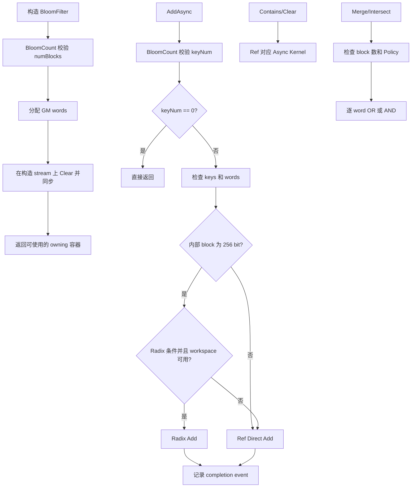
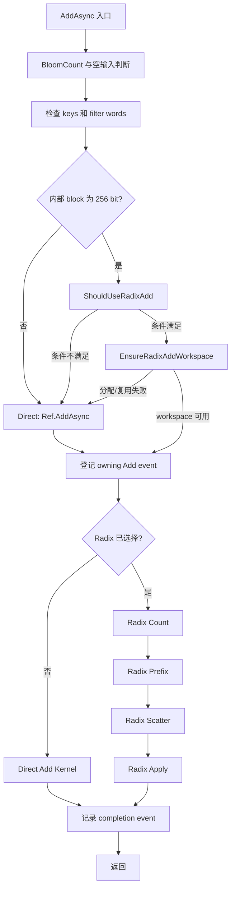
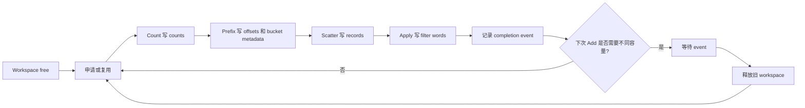
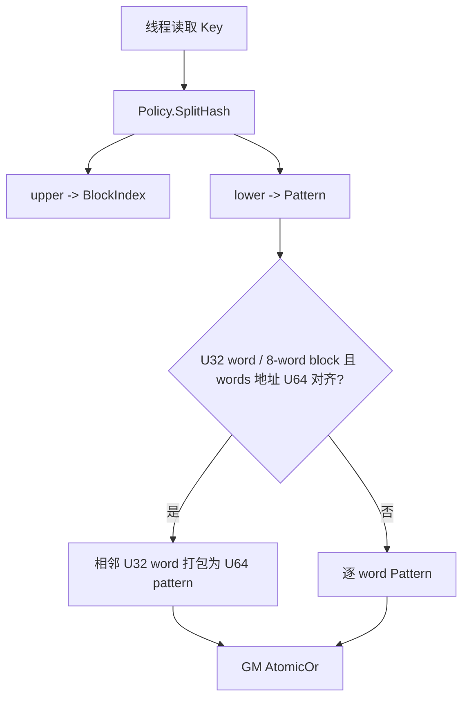
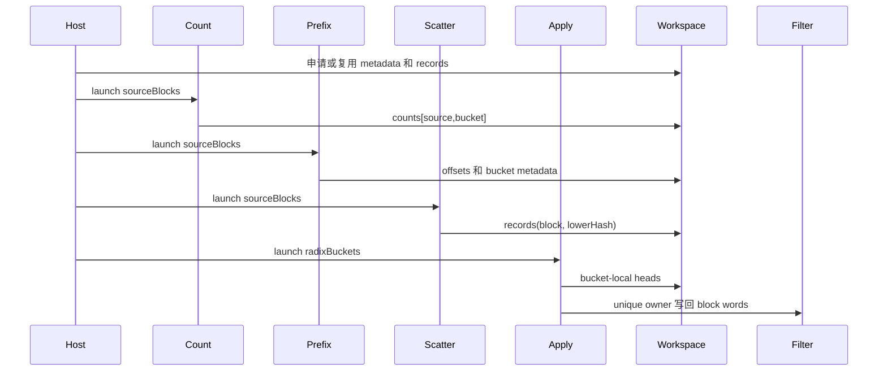
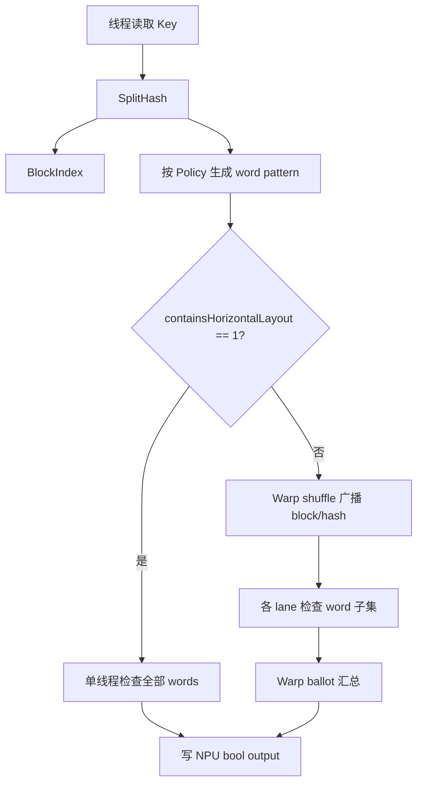
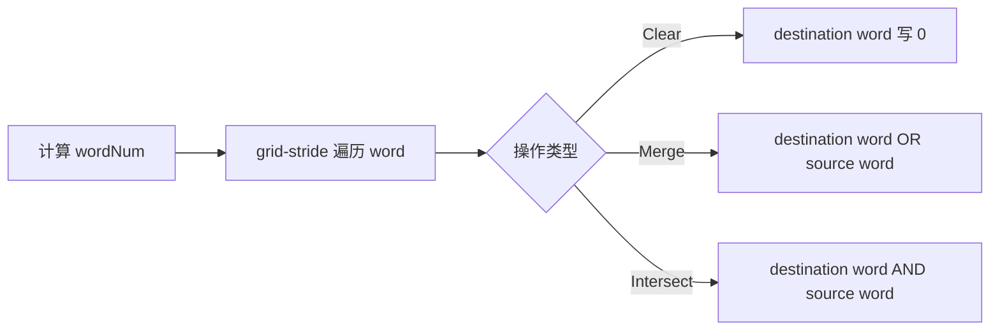
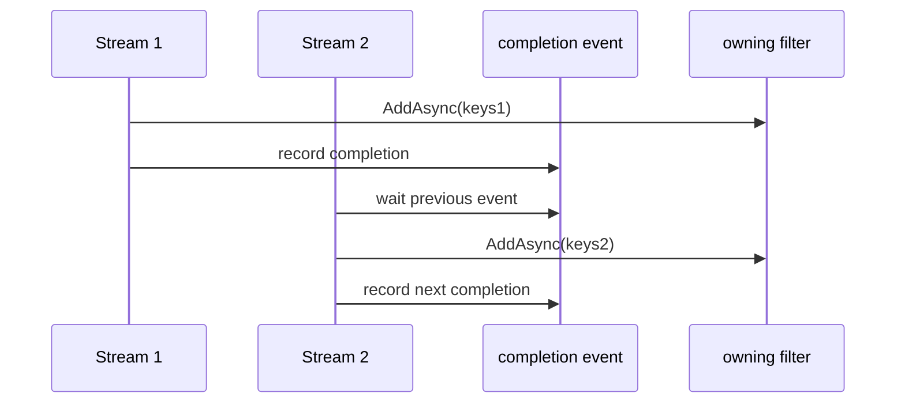

# BloomFilter 容器及算子设计文档

| 文档属性 | 内容 |
| --- | --- |
| 任务书 | `04_tasks/01_community-task-2026/docs/202607/BloomFilter_task_doc.md` |
| 目标代码仓/分支 | `https://gitcode.com/nudt_wsy/ops-collections` / `feat/bloom-filter` |
| 目标硬件 | Atlas 950 系列产品 |
| CANN 版本 | 任务书指定的开源仓版本；实现使用 ACL Runtime 与 Ascend C SIMT API |
| 设计文档仓 | `https://gitcode.com/nudt_wsy/cann-ops-competitions` |
| 设计文档路径 | `04_tasks/01_community-task-2026/tasklist/BloomFilter/nudt_wsy/design.md` |

# 需求背景（required）

## 需求来源

本文对应 2026 年 7 月社区任务《BloomFilter 容器开发任务书》。任务要求参考 cuCollections `dev` 分支的 `cuco::bloom_filter`，在 `ops-collections` 中使用 C++ 和 Ascend C 实现 owning BloomFilter 容器及 non-owning 引用，完成构造、析构、Add、Contains、Merge、Intersect、测试和设计交付。

任务书指定 Atlas 950 系列产品，Key 类型为 `uint32_t`、`uint64_t` 和 `float32`，并要求合法输入场景具有泛化能力。

## 背景介绍

BloomFilter 不保存 Key 本身，而是将 Key 的 Hash 映射到固定大小的 bit filter。查询结果具有概率语义：

- 已完成插入并满足 stream 顺序的 Key 不允许返回 false；
- 未插入 Key 允许因 bit 冲突返回 true；
- `Merge` 对兼容 filter 做逐 word OR；
- `Intersect` 对兼容 filter 做逐 word AND。

昇腾侧没有与 CUDA Device iterator 完全对应的公共抽象，因此批量接口使用 NPU GM 起始地址和元素数量表达 `[first, last)`。

### 当前实现及源码依据

| 层次 | 源码路径 | 关键符号 | 作用 |
| --- | --- | --- | --- |
| 公共接口 | `include/bloom_filter.h` | `BloomFilter`、`BloomFilterAllocator` | owning 存储、生命周期、批量 API |
| 公共引用 | `include/bloom_filter_ref.h` | `BloomFilterRef` | 不拥有存储的 Host/Device 视图 |
| Policy | `include/bloom_filter_policy.h`、`include/detail/bloom_filter/bloom_filter_policy.h` | `BloomFilterPolicy` | Hash、word、block、pattern 和布局约束 |
| Host 实现 | `include/detail/bloom_filter/bloom_filter.inl` | `AddAsync`、`EnsureRadixAddWorkspace`、`ReleaseAddWorkspace` | 参数校验、路径选择、workspace 和 event |
| Ref 实现 | `include/detail/bloom_filter/bloom_filter_ref.inl` | `AddAsync`、`ContainsAsync`、`MergeAsync` | 通用批量 API 和兼容性校验 |
| Kernel | `include/detail/bloom_filter/kernels.h` | `BloomFilterAddKernel` 等 | AIV SIMT 批量计算 |
| Hash | `include/hash_functions.h`、`include/detail/hash_functions/xxhash.h` | `xxhash_64`、`XXHash_64` | Host/Device 一致的 64-bit Hash |
| 测试 | `tests/bloom_filter/` | 六个专项测试 | 功能、Policy、布局、ownership、校验和 combine |

### 当前实现能力

| 参数 | 输入/输出 | 含义 | 数据类型 | 地址/格式 | Shape | 约束 |
| --- | --- | --- | --- | --- | --- | --- |
| `numBlocks` | 输入 | filter block 数量 | `Extent` | Host 参数 | 标量 | `1 <= numBlocks <= Policy::maxFilterBlocks` |
| `policy` | 输入 | Hash、布局和 pattern 策略 | Policy | Host 值对象，可按值传入 Kernel | 标量 | 通过 Policy 编译期约束 |
| `allocator` | 输入 | filter word 分配器 | Allocator | Host 对象 | 标量 | `ValueType` 必须等于 `Policy::WordType` |
| `keys` | 输入 | 待插入或查询的 Key | `Key*` | NPU GM 连续地址 | `Key[keyNum]` | `keyNum>0` 时不得为空 |
| `keyNum` | 输入 | Key 数量 | `Extent` | Host 参数 | 标量 | 有符号 Extent 不得为负 |
| `outputValues` | 输出 | 查询结果 | `bool*` | NPU GM 连续地址 | `bool[keyNum]` | `keyNum>0` 时不得为空 |
| `other` | 输入 | Merge/Intersect source filter | BloomFilter | NPU GM words | 与当前 filter 相同 | block 数和 Policy 必须兼容 |
| `stream` | 输入 | ACL 执行流 | `aclrtStream` | Host 句柄 | 标量 | 用于提交和同步和 event 依赖 |

### 当前实现流程



### 当前问题与设计响应

| 问题 | 源码证据 | 设计响应 |
| --- | --- | --- |
| 直接 Add 对高并发 block 冲突使用 GM 原子更新 | `BloomFilterAddSimt` | 保留 Direct 作为通用正确性路径，并在内部 256-bit block 的大规模输入启用 Radix 聚合；支持 U32x8 与 U64x4，Key 类型不受此布局条件限制 |
| Radix Apply 使用普通 GM 写回，跨 stream 可能覆盖 | `BloomFilter::AddAsync` event chain | owning 连续 Add 跨 stream 自动建立 event 依赖；其他操作由调用方保证顺序 |
| filter 释放必须等待异步 Add | `ReleaseAddWorkspace`、`Reset` | 释放前同步 completion；同步失败保留资源指针，不静默丢失 |
| Merge/Intersect 的 bit layout 必须一致 | `BloomFilterRef::*Async` Policy 校验 | block 数和 runtime Policy state 不兼容时抛出异常 |

# 需求分析（required）

## 需求描述

根据任务书，实现与 cuCollections 语义一致的 BloomFilter 容器及算子，支持构造、析构、Add、Contains、Clear、Merge、Intersect，支持 `uint32_t`、`uint64_t` 和 `float32` Key，支持合法 `numBlocks`、自定义 Policy、空输入、重复输入和不同布局，并满足任务书规定的精度和性能验收口径。

## 接口与语义

### 数学定义

设 `B = numBlocks`、`W = Policy::wordsPerBlock`、`P = Policy::patternBits`，`h = Hash(key)` 为 64-bit 值：

```text
upper = uint32_t(h >> 32)
lower = uint32_t(h)
block = (uint64_t(upper) * B) >> 32
words[block, w] |= Pattern(lower, w)
```

`Contains` 判断该 block 中每个 word 是否包含对应 Pattern；`Clear` 将所有 word 写零；`Merge` 和 `Intersect` 分别进行逐 word OR 和 AND。

### 接口原型

```cpp
template <typename Key, typename Extent = aclco::Extent<size_t>,
          typename Policy = aclco::BloomFilterPolicy<Key>,
          typename Allocator = aclco::BloomFilterAllocator<typename Policy::WordType>>
class BloomFilter {
public:
    explicit BloomFilter(Extent numBlocks, Policy const& policy = {},
                         Allocator const& allocator = {},
                         aclrtStream stream = nullptr);
    ~BloomFilter();

    BloomFilter(BloomFilter const&) = delete;
    BloomFilter& operator=(BloomFilter const&) = delete;
    BloomFilter(BloomFilter&& other);
    BloomFilter& operator=(BloomFilter&& other);

    void Add(void const* keys, Extent keyNum, aclrtStream stream = nullptr);
    void AddAsync(void const* keys, Extent keyNum, aclrtStream stream = nullptr);
    void Contains(void const* keys, void* outputValues,
                  Extent keyNum, aclrtStream stream = nullptr) const;
    void ContainsAsync(void const* keys, void* outputValues,
                       Extent keyNum, aclrtStream stream = nullptr) const;
    void Clear(aclrtStream stream = nullptr);
    void ClearAsync(aclrtStream stream = nullptr);
    void Merge(BloomFilter const& other, aclrtStream stream = nullptr);
    void MergeAsync(BloomFilter const& other, aclrtStream stream = nullptr);
    void Intersect(BloomFilter const& other, aclrtStream stream = nullptr);
    void IntersectAsync(BloomFilter const& other, aclrtStream stream = nullptr);
};
```

`BloomFilterRef<Key, Extent, Policy>` 提供相同的批量 API，并额外提供 Device 侧单 Key `Add(Key const&)` 和 `Contains(Key const&)`。Ref 不拥有 words，调用方负责地址、容量、生命周期和跨 stream 顺序。

### 参数说明

| 参数 | 方向 | 地址空间 | 说明 |
| --- | --- | --- | --- |
| `numBlocks` | 输入 | Host | block 数，每个 block 有 `W` 个 word |
| `policy` | 输入 | Host/Device | Hash、word、pattern、Add/Contains layout |
| `allocator` | 输入 | Host | 默认 `BloomFilterAllocator<WordType>` 使用 `aclrtMallocAlign32` |
| `keys` | 输入 | NPU GM | 连续 `Key[keyNum]`，禁止 Host 地址 |
| `keyNum` | 输入 | Host | `0` 为空操作；有符号值不得为负 |
| `outputValues` | 输出 | NPU GM | 连续 `bool[keyNum]`，每个 Key 一个结果 |
| `other` | 输入 | NPU GM | 与当前 filter 同 block 数、同 Policy 语义 |
| `stream` | 输入 | Host | ACL stream；缺省为 ACL 默认 stream |

### 语义边界与异常行为

- 空输入：`AddAsync/ContainsAsync` 在 `keyNum == 0` 时直接返回，不要求指针非空，不启动 Kernel。
- 构造清零：构造函数在传入 stream 上完成 Clear，并在返回前同步，避免构造后换 stream 读写未初始化 words。
- 0 维/非连续：本接口不是 Tensor 接口，只接受一维连续 GM 数组，不提供 stride、shape 或广播语义。
- 输入输出别名：`keys` 与 `outputValues` 不应重叠；`other` 与 destination words 不应产生未定义的部分重叠。
- 异步顺序：同一 stream 遵循 ACL 顺序；owning 连续 Add 跨 stream 由内部 event 链串联；Add 与 Contains/Clear/Merge/Intersect 的跨 stream 顺序由调用方建立。
- 非法输入：同步 Host 校验失败抛出 `std::invalid_argument` 或 `std::length_error`；ACL 资源或调用失败抛出运行时异常。异步 Kernel 部分写入后不承诺事务回滚。
- 生命周期：异步操作完成前不得释放或复用 filter words、keys、output 或 Ref storage。

## 需求拆解与追踪

| 编号 | 任务书要求 | 设计响应 | 实现落点 | 验证用例 | 证据状态 |
| --- | --- | --- | --- | --- | --- |
| R1 | 构造、析构和 Clear | owning 分配/清零/释放，Ref 批量清零 | `bloom_filter.h`、`bloom_filter.inl` | combine、ownership、validation | 已实现，需持续测试 |
| R2 | Add | Direct 通用路径 + 内部 256-bit block 布局的大规模 Radix 路径 | `AddAsync`、`BloomFilterAddSimt`、Radix kernels | basic、layout、ownership、性能 Add | 已实现 |
| R3 | Contains | bool 输出、默认布局和 Policy layout | `ContainsAsync`、`BloomFilterContainsSimt` | basic、policy、layout | 已实现 |
| R4 | Merge | 兼容 filter 逐 word OR | `MergeAsync`、`BloomFilterMergeKernel` | combine、validation | 已实现 |
| R5 | Intersect | 兼容 filter 逐 word AND | `IntersectAsync`、`BloomFilterIntersectKernel` | combine、validation | 已实现 |
| R6 | Key 类型 | 默认 Policy 支持 U32/U64/float | `BloomFilterPolicy`、`xxhash_64` | policy、basic | 已实现 |
| R7 | 泛化输入 | 非 2 次幂 block 数、空输入、尾部 grid-stride、Policy | `BloomCount`、`BloomBlockDim` | policy、layout、validation | 已实现 |
| R8 | 精度 | 已插入 Key 不漏报，word 与 Host 模型一致 | Policy 统一 Hash/Pattern | basic、combine、layout | 已实现 |
| R9 | 异步资源 | move-only、workspace 复用、Add event | `Reset`、`ReleaseAddWorkspace` | ownership、跨 stream | 已实现 |
| R10 | 性能 | 任务书配置下的 Direct/Radix 路径选择 | `ShouldUseRadixAdd`、Radix kernels | 性能矩阵 | 按验收材料记录 |

## 范围边界

| 分类 | 内容 | 依据 |
| --- | --- | --- |
| 本设计覆盖 | 任务书 BloomFilter 容器、Ref、默认 Policy、合法自定义 Policy、批量和 Device 单 Key 语义 | 任务书与当前源码 |
| 本设计不覆盖 | Tensor shape/broadcast、非连续视图、删除 Key、计数、自动 false-positive rate 调节 | 当前接口无对应语义 |
| 本设计不覆盖 | CUDA 迭代器、CUDA cooperative group 和 CUDA stream API | 昇腾接口替代为 Extent、SIMT 和 ACL stream |
| 待专家确认 | 无阻断性问题；后续以任务书对支持范围的更新为准 | 当前设计与任务书一致 |

# 详细设计（required）

## 算子分析

### 支持数据类型与计算精度

| 路径 | Key dtype | Hash/计算 dtype | 输出 | 选择条件 |
| --- | --- | --- | --- | --- |
| 默认 Policy | `uint32_t`、`uint64_t`、`float` | `XXHash_64` 返回 `uint64_t`；pattern 按 Word 计算 | words / `bool` | 默认模板 |
| 自定义 Policy | 满足 HashResult 为 `uint64_t` 的 Key | Policy 定义 Hash、Word 和 pattern | Policy::WordType / `bool` | 用户指定 Policy |
| Direct Add | 任意合法 Key/Word | GM AtomicOr | words | Ref、custom Policy、小输入或 fallback |
| Radix Add | 任意合法 Key，内部 256-bit block 布局 | Hash 后保存 upper/lower；Apply 按 Policy pattern | U32x8 或 U64x4 words | owning、256-bit block、Radix 条件满足 |

Hash 不执行浮点算术；float Key 直接交给 Hash functor，容器不做 `+0/-0` 或 NaN 归一化。

### 支持形状

BloomFilter 不是多维 Tensor 算子，所有批量接口均按一维连续数组处理：

```text
keys          : Key[keyNum]
outputValues  : bool[keyNum]
filter words  : Word[numBlocks * wordsPerBlock]
workspace     : uint8_t[workspaceBytes]，仅 Radix Add 命中时申请
```

`keyNum == 0` 是合法空输入；`numBlocks` 必须大于 0。接口不接收 shape、stride、format 或广播参数，因此非连续 Tensor、广播 Tensor 和 0 维 Tensor 不属于本容器接口语义。

### Policy 编译期约束

| 约束 | 规则 |
| --- | --- |
| Word | `uint32_t` 或 `uint64_t` |
| wordsPerBlock | 1 到 32 的 2 次幂 |
| patternBits | 不小于 wordsPerBlock，不超过 block bit 容量和 64 个 salt |
| Add/Contains layout | horizontal、vertical 为 2 次幂，乘积整除 wordsPerBlock |
| horizontal | 不超过 SIMT warp 宽度 32 |
| Hash | 调用结果必须为 `uint64_t` |

## 算子实现

### 总体方案

当前实现只保留两个批量 Add 后端：

1. Direct：通用功能路径，覆盖 Ref、custom Policy、小输入、非默认 layout 和 workspace 不可用；
2. Radix：内部 256-bit block owning filter 的大规模性能路径，支持 U32x8 与 U64x4，Key 类型不限制为 U32。

这两条路径不是重复功能：Direct 负责泛化和保底，Radix 依赖固定 block 组织、记录索引宽度和 workspace 预算。未保留其他实验后端，避免实现分叉过多。



### Host 侧设计

#### 参数校验与资源顺序

1. `BloomCount` 将 Extent 转为 uint64；有符号 Extent 为负时抛出异常。
2. 构造检查 `numBlocks`、Policy 上限和 `numBlocks * wordsPerBlock` 溢出。
3. 分配 filter words 后立即用 Ref Clear；构造函数同步 stream 后返回。
4. Add/Contains 的正数输入检查指针；空输入在指针校验前返回。
5. Add 若进入 Radix workspace 扩容，先等待和释放旧 workspace，再创建本次 Add event，避免扩容销毁当前 event。
6. Kernel 提交完成后在 stream 尾部记录 event。析构和 move assignment 释放资源前等待 event。

#### 路径选择

| 路径 | 完整选择条件 | Kernel | 回退 |
| --- | --- | --- | --- |
| Direct | Ref、非 256-bit block、小输入或 Radix 条件不满足；Key 类型不构成回退条件 | `BloomFilterAddKernel` | 无 |
| Radix | owning；Key 类型任意合法；内部布局为 U32x8 或 U64x4；`keyNum >= 1<<24`；按 `block * 4096 / numBlocks` 划分不等宽 bucket；最大 bucket block 数不超过 16384；U32x8 words 需 U64 对齐；workspace 可申请 | Count/Prefix/Scatter/Apply 四个 Radix Kernel | Direct |
| Contains | 所有合法 Policy | `BloomFilterContainsKernel` | 无 |
| Clear | 所有非空合法 filter | `BloomFilterClearKernel` | 无 |
| Merge | block 数和 Policy compatible | `BloomFilterMergeKernel` | 抛出异常 |
| Intersect | block 数和 Policy compatible | `BloomFilterIntersectKernel` | 抛出异常 |

本容器没有 Tensor TilingKey 或 TilingData：通过 `BloomBlockDim(workItems)` 计算 AIV block 数，Policy 通过模板实例化，Add 后端通过 Host runtime 条件选择。上述路径是本容器的等价路由键。

#### 分核策略

定义 `T = 1024`、`N` 为当前 Kernel work item 数、`C` 为 `GetCoreNumAiv()`、`C' = max(C, 1)`：

```text
requiredBlocks = ceil(N / T)
actualBlocks = min(requiredBlocks, C')
globalThread = blockIdx * T + threadIdx
totalThreads = actualBlocks * T
for (i = globalThread; i < N; i += totalThreads)
```

`N == 0` 的 Add/Contains 在 Host 直接返回；Clear/Combine 的 `N` 为合法 filter word 数。Radix source 区间为：

```text
begin = N * source / sourceBlocks
end   = N * (source + 1) / sourceBlocks
```

区间连续覆盖 `[0,N)`，尾部不足一个 block 时由 Kernel 的 `i < N` 判断保护。

#### 对齐、溢出和分配

- 默认 `BloomFilterAllocator` 使用 `aclrtMallocAlign32`；释放仍使用 `aclrtFree`。
- Direct packed U64 访问在 Kernel 内检查 `alignof(uint64_t)` 对齐，不满足时使用逐 word Direct。
- 构造检查 `numBlocks <= max(size_t)/wordsPerBlock`。
- Radix metadata 按 `alignof(uint64_t)` 对齐，并检查 `metadata + keyNum*sizeof(uint64_t)` 的 size_t 上溢出。
- workspace 只在 owning Add 命中 Radix 时申请；metadata 和容量足够时复用。

### Workspace 与生命周期

设 `S = BloomBlockDim(keyNum)`、`R = 4096`、`Q = S * R`：

```text
counts       : uint32_t[Q]
offsets      : uint32_t[Q]
bucketStarts : uint32_t[R]
bucketSizes  : uint32_t[R]
cursor       : uint32_t[1]
metadata     : align_up((2*Q + 2*R + 1) * sizeof(uint32_t), alignof(uint64_t))
records      : uint64_t[keyNum]
workspace    : metadata + keyNum * sizeof(uint64_t)
```



| 阶段 | 输入 | 输出 | 同步/正确性 |
| --- | --- | --- | --- |
| Count | GM keys | `counts[source,bucket]` | 每 source 使用 UB counters，barrier 后写 GM |
| Prefix | counts | offsets、bucketStarts、bucketSizes | cursor 为连续 record 区间分配边界 |
| Scatter | keys、offsets | records | 每个 record 位置唯一，编码 block/lowerHash |
| Apply | records、bucket metadata | filter words | bucket 内每个 block 由唯一 owner 聚合后写回 |

workspace producer/consumer 顺序由同一 stream 保证。下次扩容前同步上一 completion event，防止释放仍被 Kernel 访问的 workspace。

### Kernel 侧设计

#### Direct Add 与 packed U64



`BloomFilterAddSimt` 使用 grid-stride 处理 Key。内部 U32 word / 8-word block 且 words 对齐时，`BloomFilterAddPackedWordPairs` 将相邻 word 合并为 U64 原子更新；其余 Policy 使用按 layout 的通用路径。AtomicOr 只增加 bit，重复 Add 具有幂等性。

#### Radix Add 四阶段



Apply 使用每个 bucket 的 UB head 数组；同一 filter block 只由一个 owner thread 聚合，普通写回不会在同一 Add 内发生 block 间竞争。Radix 条件不满足或 workspace 分配失败时直接使用 Direct。

#### Contains



默认 layout 下一个线程检查一个 Key 的全部 words；horizontal layout 大于 1 时由 shuffle 和 ballot 汇总。Contains 只读 filter words，不使用 workspace 和原子写。

#### Clear、Merge、Intersect



每个 word 由一个逻辑迭代位置处理，不需要原子。Merge/Intersect 在 Host 侧先检查 block 数和 `Policy::IsCompatible`。

#### owning 生命周期与 event



`BloomFilter::AddAsync` 在 workspace 扩容前处理旧 event，创建本次 event，跨 stream 时等待上一 owning Add，提交 Direct/Radix Kernel，最后记录 completion。析构和 move assignment 释放资源前等待 event；同步失败时不清空仍可能被使用的设备指针。`BloomFilter` move-only，move 会转移 words、workspace、event 和 stream，并清空源对象。

## 内存与别名分析

### 内存模型

```text
filterBytes = numBlocks * wordsPerBlock * sizeof(WordType)
workspaceBytes =
    align_up((2*S*R + 2*R + 1) * sizeof(uint32_t), alignof(uint64_t))
  + keyNum * sizeof(uint64_t)
```

其中 `S = BloomBlockDim(keyNum)`、`R = 4096`。filter words 和 Radix workspace 同时存活；keys 由调用方持有并在异步完成前保持有效。Direct、Contains、Clear、Merge、Intersect 不额外申请 owning workspace。

```mermaid
gantt
    title Filter 与 Radix workspace 生命周期
    dateFormat X
    axisFormat %s
    section Filter
    filter words :0, 5
    section Add workspace
    metadata and records :1, 4
    section Add input
    keys :1, 3
```



workspace 在首次命中 Radix 时申请，容量满足时复用；扩容时先等待旧 completion，再释放旧 workspace。filter 释放前等待最后 completion event。

### 别名与失败状态

- `keys`、`outputValues`、filter words 和 workspace 的生命周期由调用方/容器分别负责，异步完成前不能复用。
- `Merge/Intersect` 的 destination 可以与 source 表示同一 filter，但不承诺部分重叠视图。
- Kernel 失败不提供事务回滚，可能已经写入部分 words 或 output。
- Host 参数校验失败发生在 Kernel 提交前，本次调用不修改 filter 和 output。
- workspace 分配失败只影响 Radix 选择，回退 Direct，不改变功能语义。

# 支持硬件

| 支持的芯片版本 | 涉及勾选 |
| --- | --- |
| Atlas 950 系列产品 | √ |

# 算子约束限制

| 类型 | 限制 | 不满足时行为 |
| --- | --- | --- |
| Key | 任务范围为 `uint32_t`、`uint64_t`、`float32` | 通过模板实例化约束，不支持的类型不提供实例 |
| keys/output | 一维连续 NPU GM 地址 | 由调用方保证；非法地址由 ACL/设备执行报错 |
| numBlocks | `[1, UINT32_MAX]` | 构造抛出 `invalid_argument` |
| keyNum | 非负 Extent；0 为合法空输入 | 负值抛出 `invalid_argument` |
| Policy | 编译期布局、word 和 pattern 约束 | 模板实例化失败 |
| Merge/Intersect | block 数和 runtime Policy 必须兼容 | 抛出 `invalid_argument` |
| Ref | 外部 storage 有效且容量足够 | 由调用方保证 |
| 异步 | 完成前不得释放或覆盖依赖对象 | 不作为接口保证 |
| Radix | 仅大输入、内部 256-bit block（U32x8 或 U64x4）、bucket 和 workspace 条件满足时启用；Key 类型不限于 U32 | 条件不满足回退 Direct |

# 可维可测分析（required）

## 精度标准/性能标准

| 验收标准 | 任务书原文 | 判定方法 |
| --- | --- | --- |
| 功能 | 支持 BloomFilter 构造、析构、Add、Contains、Merge、Intersect；Key 支持 uint32、uint64 及 float32 | 功能测试覆盖每个操作和 Key 类型 |
| 精度 | 插入 1-10 十个整数后，BloomFilter 中需完整找到 1-10，取出的 10 个整数与输入二进制一一对应 | Add 后 Contains 全部为 true，并与 Host Policy reference 逐 word 比较 |
| 性能 | I32 场景下算子所有用例耗时小于等于 `Total Time/0.8`；I64 场景下算子所有用例耗时小于等于 `Total Time/0.6` | Construct、Destruct、Add、Contains、Clear、Merge、Intersect 全配置逐项比较 |
| 统计 | 任务书规定 32 MB、256 MB、2048 MB 和 80000000 输入配置 | 每配置记录预热、正式运行、同步边界和 min/median/max |

## 测试设计与覆盖矩阵

| 用例 ID | 关联需求 | 输入/属性 | 覆盖路径/边界 | 预期 |
| --- | --- | --- | --- | --- |
| TC001 | R1/R7 | 最小 block、非 2 次幂 block | 构造清零和析构 | words 初始全 0，资源可释放 |
| TC002 | R2/R3/R8 | U32/U64 Key，空、单个、重复和尾部数量 | Direct Add/Contains | inserted Key 不漏报，words 与 reference 一致 |
| TC003 | R2/R6/R8 | float +0、-0、Inf、NaN bit pattern | 默认 Policy Hash | 结果按对象表示可复现 |
| TC004 | R2/R7 | 自定义 Word、Policy 和 layout | Direct fallback | 不依赖 Radix，结果与 reference 一致 |
| TC005 | R2/R8/R10 | U32x8、U64x4 256-bit block 的大输入和三档 filter size | Radix 四阶段 | final words 与 Direct/reference 一致 |
| TC006 | R2/R9 | owning 连续 Add，同 stream/跨 stream | event chain、workspace 复用 | 不丢 bit，不提前释放 workspace |
| TC007 | R3/R7 | horizontal=1 和 horizontal>1 | Contains thread/warp 路径 | bool 输出与 reference 一致 |
| TC008 | R1 | 空/非空 filter | Clear | 全部 words 为 0 |
| TC009 | R4/R5 | 相同 Policy、不同内容 | Merge/Intersect | 逐 word OR/AND 一致 |
| TC010 | R4/R5 | block 数不同、Hash seed 不同 | 非法兼容性 | 抛出 invalid_argument，Kernel 不提交 |
| TC011 | R7 | keyNum=0、1023、1024、1025、非整除大输入 | grid-stride 和尾部 | 无越界，结果完整 |
| TC012 | R9 | move construct、move assign、析构 | ownership 转移 | source 不释放已转移资源 |
| TC013 | R9 | Add 与其他操作跨 stream | 调用方显式 event/sync | 按文档顺序执行 |
| TC014 | R2/R9 | workspace 首次申请、复用、扩容、失败 | Radix -> Direct fallback | 功能保持一致，资源不泄漏 |

## 测量方法与证据计划

| 类别 | 环境/基线 | 预热与重复 | 同步/采样 | 统计量 |
| --- | --- | --- | --- | --- |
| 功能 | Atlas 950；Host Policy reference | 由专项测试程序固定 | 复制结果前同步 stream | Catch2 assertions、逐 word/逐元素比较 |
| 性能 | Atlas 950；任务书 Total Time | runner 固定预热和正式次数 | Kernel event 计时；生命周期 Host 端端到端 | min、median、max，逐 case 阈值比较 |
| 资源/异步 | Atlas 950；ACL Runtime | 覆盖首次申请、复用、扩容和 move | event、stream synchronize 和析构边界 | 无非法访问、无资源提前释放 |

性能记录至少包含 Key、operation、输入数量、filter size、任务书参考时间、任务书上限、min/median/max 和判定结果。本文只定义测量口径和判定方法。

## 兼容性与风险

| 风险/兼容项 | 触发条件 | 影响 | 缓解/回退 |
| --- | --- | --- | --- |
| false positive | 未插入 Key 的 bits 被其他 Key 设置 | Contains 可能为 true | 按 BloomFilter 语义处理，只禁止 false negative |
| Direct 原子冲突 | 多 Key 映射相同 block/word | Add 延迟增加 | 默认大输入启用 Radix，其他场景保持 Direct |
| Radix workspace 不足 | 分配失败或容量条件不满足 | Radix 不可用 | 回退 Direct，不改变结果 |
| Radix bucket 不均匀 | Hash 分布偏斜 | Apply 负载不均 | 保留 Direct fallback，并与 reference 比较 |
| 跨 stream 读写竞争 | Add 与其他操作无显式依赖 | 读写结果未定义 | owning Add-to-Add 内部 event，其他组合由调用方同步 |
| Policy 不兼容 | Hash seed 或 runtime state 不同 | OR/AND 语义错误 | Merge/Intersect 先校验并拒绝 |
| 资源同步失败 | event/stream synchronize 失败 | 不能证明任务完成 | 保留资源指针，不静默置空 |
| 设备/API 变化 | SIMT、原子或对齐能力变化 | 特化路径不可用 | 重新确认接口，使用 Direct 作为实现回退 |

## 需求闭环

```text
任务书功能要求
  -> BloomFilter/BloomFilterRef 接口与 Policy
  -> Direct / Radix Kernel
  -> 专项功能测试
  -> 逐 word 精度与异常行为判定

任务书性能要求
  -> BloomBlockDim、packed Direct、Radix workspace
  -> Construct/Destruct/Add/Contains/Clear/Merge/Intersect runner
  -> 32/256/2048 MB、U32/U64 逐 case 阈值判定
```

本文中的“已实现”仅表示源码具备对应接口和路径；性能章节只定义任务书标准、测量口径和验证计划，不写运行结果。
