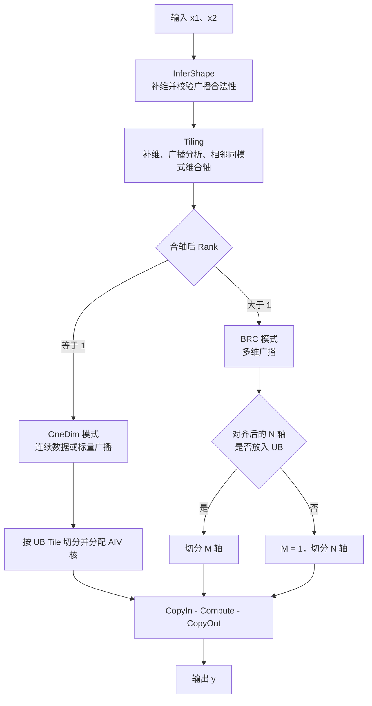
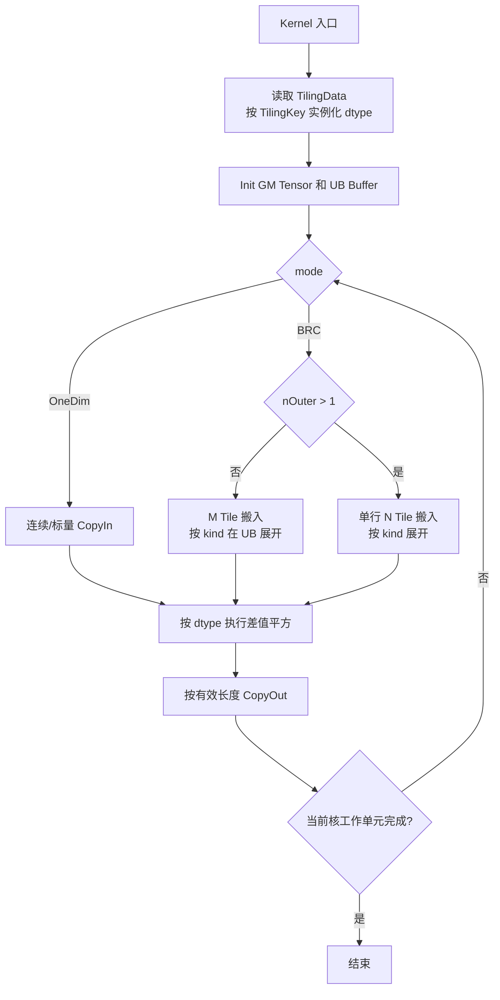

# SquaredDifference 算子设计文档

## 需求背景（required）

### 需求来源

本需求来源于《CANN 训练营 2026 暑期季 - 西北工业大学专场 SquaredDifference 算子开发任务书》。任务要求参考昇腾内置 SquaredDifference 算子的 TBE 实现，使用 Ascend C 完成功能一致的算子设计、开发和测试，并提交至 `ops-math` 算子开源仓。

任务要求如下：

- 适配 Atlas A2 训练系列产品和 Atlas A3 系列产品。
- 对齐原算子的全部合法数据类型、数据格式和广播语义。
- 计算精度满足 CANN Judge 对应题目的默认阈值。
- 在所有核参与计算的场景下，性能不低于原算子的 95%。
- 对 10 us 以下且性能差距不超过 3 us 的小 Shape 场景，提供性能仿真图和原因分析。

### 背景介绍

#### SquaredDifference 算子实现优化

SquaredDifference 是逐元素二元算子，计算两个输入之差的平方。历史版本由 TBE 实现，本方案使用 Ascend C 重写，并针对连续数据、标量广播、多维广播、超长内轴和不同数据类型设计独立执行路径。

相关参考路径如下：

| 参考项 | 路径 |
| --- | --- |
| TBE Kernel | `/usr/local/Ascend/ascend-toolkit/latest/opp/built-in/op_impl/ai_core/tbe/impl/dynamic/` |
| 算子原型 | `/usr/local/Ascend/ascend-toolkit/latest/opp/built-in/op_proto/inc/` |
| Ascend 910B 算子信息库 | `/usr/local/Ascend/ascend-toolkit/latest/opp/built-in/op_impl/ai_core/tbe/config/ascend910b/` |
| TBE DSL API | `/usr/local/Ascend/ascend-toolkit/latest/python/site-packages/tbe/dsl/` |

#### SquaredDifference 算子现状分析

最新版工程位于 `SquaredDifference_submit_perf_v3/code/`，当前算子原型如下。

| 参数 | 参数含义 | 类型 | 支持数据类型 | 数据格式 | Shape 约束 |
| --- | --- | --- | --- | --- | --- |
| `x1` | 第一个输入张量 | Tensor | float32、float16、bfloat16、int32、int64 | ND | Rank 不大于 16，与 `x2` 满足广播规则 |
| `x2` | 第二个输入张量 | Tensor | float32、float16、bfloat16、int32、int64 | ND | Rank 不大于 16，与 `x1` 满足广播规则 |
| `y` | 输出张量 | Tensor | 与输入一致 | ND | 为 `x1`、`x2` 广播后的 Shape |

计算公式为：

$$
y_i = (x1_i-x2_i)\times(x1_i-x2_i)=(x1_i-x2_i)^2
$$

当前实现具备以下能力：

- 支持 NumPy 风格广播，不在 GM 中物理展开输入。
- 支持相同 Shape、标量广播、单轴广播和一般多维广播。
- 支持原始 Rank 不大于 16；按广播模式合轴后 Rank 不大于 8。
- 使用 10 个编译期 TilingKey 隔离 5 种 dtype 和 2 种执行模式，避免无关 dtype 的 UB Buffer 同时实例化。
- 当多维广播的最后一轴单行超过 UB 预算时，支持独立的 N 轴切分路径。
- Workspace 大小为 0。

## 需求分析（required）

### 需求描述

使用 Ascend C 实现 SquaredDifference 算子，对齐内置 TBE 算子的数学语义、数据类型、ND 格式和广播能力。Host 侧负责 Shape 推导、广播合法性校验、合轴、分核与 UB 切分；Kernel 侧负责按 TilingKey 执行连续或广播数据路径，并保持各 dtype 的计算和舍入语义一致。

### 需求拆解

1. 支持 float32、float16、bfloat16、int32、int64，输入与输出 dtype 一致。
2. 支持 ND 格式及 NumPy 风格双输入广播。
3. 支持相同 Shape、标量广播、单轴广播、多维广播和非 32 B 对齐尾块。
4. 支持输出内轴能够放入 UB 时切分 M 轴，内轴超过 UB 预算时切分 N 轴。
5. 根据可用 AIV 核数均分工作单元，处理尾核和尾 Tile。
6. float16 和 bfloat16 对齐 TBE `vsub`、`vmul` 分阶段舍入语义；整数结果与目标硬件的整数运算语义一致。
7. 补齐全 dtype、全广播类型、边界 Shape、异常输入和性能场景测试。
8. 完成 Atlas A2、Atlas A3 的注册、编译和上板验证。

## 详细设计（required）

### 算子分析

#### 数学公式

设 `S` 为 `x1` 和 `x2` 广播后的输出 Shape。对 `S` 中任意输出坐标 `p`，将广播维坐标映射为 0，其余维坐标保持不变，得到输入坐标 `p1` 和 `p2`：

$$
y[p]=(x1[p1]-x2[p2])^2
$$

广播合法条件为：将两个输入 Shape 在首部补 1 至相同 Rank 后，每一维满足 `d1 == d2`、`d1 == 1` 或 `d2 == 1`。输出对应维为 `max(d1, d2)`。

#### 支持数据类型

| 输入/输出 dtype | Kernel 存储类型 | 计算方式 |
| --- | --- | --- |
| float32 | `float` | 向量 `Sub` + `Mul` |
| float16 | `half` | 原生 half `Sub`，经 `PipeBarrier<PIPE_V>` 后执行 half `Mul`，保留两次舍入 |
| bfloat16 | `bfloat16_t` | Cast 至 float32 做减法，Cast 回 bfloat16 完成第一次舍入，再 Cast 至 float32 做乘法，最后 Cast 回 bfloat16 |
| int32 | `int32_t` | 向量 `Sub` + `Mul` |
| int64 | `int64_t` | 通过 `LocalTensor::GetValue/SetValue` 标量逐元素计算，并显式同步 MTE2/S/MTE3 |

#### 支持形状

- 输入为 ND Tensor，两个输入可具有不同 Rank。
- 原始 Rank 上限为 16。
- 广播模式合轴后的 Rank 上限为 8。
- 标量输入统一按单元素处理。
- 当前 Shape 推导和 Tiling 实现会将维度值 0 按 1 处理，因此空 Tensor 语义需要在合入前与内置算子核对并补充专项验证。
- 输出元素总数、各维累乘和 GM 偏移使用 int64 表示；仍需通过超大 Shape 用例验证乘积不溢出。

### 算子实现

#### 整体方案

#### Host 侧设计

##### Shape 推导和参数校验

`squared_difference_infershape.cpp` 从末尾维度对齐两个输入 Shape，并逐维执行广播检查。Shape 不可广播或输入/输出 Shape 指针为空时返回 `GRAPH_FAILED`。

`squared_difference_tiling.cpp` 进一步完成以下检查和处理：

1. 获取 AIV 核数和 UB 大小，任一值为 0 时返回失败。
2. 校验两个输入描述和 Shape 非空。
3. 根据 `x1` dtype 生成 `dtypeKey` 和元素字节数，不支持的 dtype 返回失败。
4. 将输入 Shape 首部补 1，检查广播合法性，并生成输出 Shape。
5. 计算各输入和输出的连续 Stride；广播维的输入 Stride 置 0。
6. 将广播标志相同的相邻维合并，减少 Kernel 地址分解开销。
7. 原始 Rank 超过 16、合轴后 Rank 超过 8 或 Shape 不可广播时返回失败。

算子原型注册了相同顺序的 dtype 组合，要求 `x1`、`x2` 和 `y` 使用同一 dtype、ND 格式和连续存储。当前 Tiling 仅读取 `x1` dtype，合入前仍需增加 `x2` 与输出 dtype 一致性测试，确认框架注册约束能够覆盖异常输入。

##### UB 规划

Host 侧预留 UB 总量的 `1/16`，剩余部分作为可用空间；Tile 元素数按 128 个元素向下对齐。不同模式的单元素预算如下：

| 模式 | Buffer 构成 | 单元素预算 |
| --- | --- | --- |
| OneDim | `x1`、`x2`、`y` 各双 Buffer；float16/bfloat16 另有两个 float32 临时 Buffer | `6 * sizeof(T) + (needCast ? 8 : 0)` 字节 |
| BRC | 两个输入和输出各双 Buffer；两个广播展开工作 Buffer；除 int64 外另有广播临时 Buffer；float16/bfloat16 另有两个 float32 临时 Buffer | `8 * sizeof(T) + (T != int64 ? sizeof(T) : 0) + (needCast ? 8 : 0)` 字节 |

单 Tile 的容量预算下限为 128 个元素，实际 Tile 长度仍按输入 Shape 和尾块缩小。BRC 模式中的 `alignInner` 按 32 B 对齐，使相邻行的 UB 起始地址满足搬运和向量指令要求。

##### 分核和 Tile 切分

**OneDim 模式**

- `ubFormer` 为单 Tile 最大元素数，`ubOuter = ceil(totalLength / ubFormer)`。
- 将 `ubOuter` 个 Tile 按连续区间分配给可用 AIV 核。
- `blockFormer` 表示普通核处理的 Tile 数，`blockTail` 表示尾核处理的 Tile 数。
- int64 在输出长度大于核数时会缩小 `ubFormer`，增加可并行的 Tile 数，降低标量计算路径的单核负载。

**BRC 模式**

- 取合轴后的倒数第二维为 M 轴，最后一维为连续 N 轴。
- 当 `align(N)` 不超过 BRC 单 Tile 上限时，不切 N 轴，使用 `ubFormer` 切分 M 轴。
- M 方向一次 `DataCopyPad` 的 `blockCount` 不超过 4095。
- 当单行 N 超过 UB 预算时，固定 `M-tile=1`，令 `nFormer` 按 32 B 对齐后切分 N 轴。
- 工作单元总数为 `outerProd * ubOuter * nOuter`，其中 `outerProd` 是 M 轴之前各输出维度的乘积。工作单元按连续区间分配给 AIV 核。
- int64 路径在工作单元少于核数时进一步减小 M Tile，优先增加并行度。

##### TilingData

| 字段组 | 关键字段 | 用途 |
| --- | --- | --- |
| 模式与类型 | `mode`、`dtypeKey`、`shapeLen`、`ubSplitAxis` | 选择执行模式和解析合轴 Shape |
| Shape 与步长 | `outDims`、`x1Strides`、`x2Strides`、`outStrides` | 输出坐标到输入/输出 GM 偏移的映射，广播轴 Stride 为 0 |
| OneDim | `totalLength`、`x1Scalar`、`x2Scalar` | 连续长度和标量广播标记 |
| UB 切分 | `ubFormer`、`ubOuter`、`ubTail`、`innerDim`、`alignInner`、`maxTileElem` | M 轴 Tile、尾 Tile、N 轴长度及 UB 容量 |
| N 轴切分 | `nFormer`、`nOuter`、`nTail` | 单行超过 UB 时的 N 轴切分参数 |
| 多核切分 | `blockFormer`、`blockNum`、`blockTail`、`fusedProduct` | 核数、每核工作单元和尾核工作量 |

Workspace 设置为 0，Kernel 不依赖外部临时内存。

##### TilingKey 规划

TilingKey 编码为 `dtypeKey * 2 + mode`，共 10 个编译期分支：

| TilingKey | dtype | 模式 |
| --- | --- | --- |
| 0 | float32 | OneDim |
| 1 | float32 | BRC |
| 2 | float16 | OneDim |
| 3 | float16 | BRC |
| 4 | bfloat16 | OneDim |
| 5 | bfloat16 | BRC |
| 6 | int32 | OneDim |
| 7 | int32 | BRC |
| 8 | int64 | OneDim |
| 9 | int64 | BRC |

Kernel 入口使用 `if constexpr` 实例化唯一的 `KernelSquaredDifference<T, CT, NEED_CAST>`，编译期丢弃其他 dtype 分支，防止不同类型的 UB Buffer 同时分配。

#### Kernel 侧设计

##### OneDim 路径

OneDim 路径用于合轴后仅剩一个维度的场景，包括相同 Shape 连续数据和标量广播。

1. 根据 `blockIdx`、`blockFormer` 和 `ubFormer` 计算当前核的起始 GM 偏移及循环次数。
2. 非标量输入通过 `DataCopyPad` 连续搬入当前 Tile；标量输入仅搬入一个元素。
3. float32、float16、bfloat16、int32 的标量输入在 UB 中使用 `Duplicate` 展开；int64 计算函数通过模板参数直接选择索引 0 或索引 `k`，不额外展开。
4. 执行差值平方计算。
5. 使用 `DataCopyPad` 按实际 `curLen` 搬出，尾 Tile 不访问越界数据。

##### BRC 路径

BRC 路径按输入在 M、N 两个内轴上的广播状态将数据分为四类：

| `kind` | M Stride | N Stride | 数据含义 | 搬入和展开方式 |
| --- | --- | --- | --- | --- |
| 0 | 非 0 | 非 0 | M、N 均不广播 | 直接搬入 `M * N` 数据 |
| 1 | 0 | 非 0 | M 轴广播 | 搬入一行 N 数据，通过 `Copy` 复制至各行 |
| 2 | 非 0 | 0 | N 轴广播 | 搬入 M 个标量，使用 `Brcb`、`Copy` 或尾行 `Duplicate` 展开 |
| 3 | 0 | 0 | M、N 均广播 | 搬入单个标量并填充整个 Tile |

M 轴切分路径先将外层线性工作单元还原为多维坐标，再根据输入 Stride 计算 `off1`、`off2` 和 `offY`。输入只搬运当前 Tile 实际需要的数据，广播展开在 UB 中完成。

当 `nOuter > 1` 时进入独立 N 轴切分路径：每个工作单元对应 `(outerCombo, mRow, nTile)`，每次只处理一行的 `curN` 个元素。该路径不依赖常规 M 轴切分逻辑，避免超长内轴造成 UB 超限。

##### 计算与同步

- float32、int32 使用向量 `Sub` 和 `Mul`。
- float16 在 `Sub` 与 `Mul` 之间插入 `PipeBarrier<PIPE_V>`，避免编译器融合导致舍入次数改变。
- bfloat16 使用 float32 中间 Tensor，并在减法后和乘法后分别 Cast 回 bfloat16，`RoundMode::CAST_RINT` 保持 round-to-nearest-even 舍入。
- int64 因目标 DAV_2201 向量指令不支持，使用标量循环计算。搬入后通过 `MTE2_S` 事件等待标量读取，标量写出后通过 `S_MTE3` 事件等待搬出。
- 非 32 B 对齐的 N 轴在 UB 中使用 `alignInner` 作为行 Pitch，搬出时通过多 Block `DataCopyPad` 仅写回每行有效的 N 个元素。

##### Kernel 执行流程

### API 与源码映射

| 功能 | 源码文件 | 关键实现 |
| --- | --- | --- |
| 算子原型注册 | `op_host/squared_difference_def.cpp` | 输入输出 dtype、ND 格式、SoC 配置 |
| Shape 推导 | `op_host/squared_difference_infershape.cpp` | NumPy 广播 Shape 推导与非法 Shape 拦截 |
| Host Tiling | `op_host/squared_difference_tiling.cpp` | 合轴、UB 预算、M/N 切分、多核分配、TilingKey |
| TilingData | `op_kernel/squared_difference_tiling_data.h` | Host 与 Kernel 的参数协议 |
| TilingKey | `op_kernel/squared_difference_tiling_key.h` | 5 dtype × 2 mode 编译期模板参数 |
| Kernel 入口 | `op_kernel/squared_difference.cpp` | 按 TilingKey 编译期实例化 Kernel 类型 |
| Kernel 实现 | `op_kernel/squared_difference.h` | OneDim、BRC、N 轴切分、广播展开和计算 |

### 支持硬件

| 硬件/编译单元 | 任务要求 | 当前工程状态 |
| --- | --- | --- |
| Atlas A2 / `ascend910b` | 必须支持 | `OpDef` 已注册，`build.sh` 默认编译目标 |
| Atlas A3 / `ascend910_93` | 必须支持 | 顶层 CMake 已列入编译单元，但 `OpDef` 尚未增加对应 `AddConfig`，需补齐注册并上板验证 |
| `ascend950` | 非本任务必选项 | 顶层 CMake 预留编译单元，当前未在 `OpDef` 注册，不作为本设计验收范围 |

### 算子约束限制

- `x1`、`x2` 和 `y` 必须使用相同 dtype，格式为 ND，内存连续。
- 输入 Shape 必须满足 NumPy 广播规则。
- 原始 Rank 不大于 16，合轴后的 Rank 不大于 8。
- 当前实现将维度值 0 视为 1，空 Tensor 行为必须在合入前与内置算子对齐。
- int32、int64 的减法和平方遵循目标硬件整数溢出语义；测试 Golden 必须采用一致的定宽整数语义，避免宿主语言有符号溢出差异。
- int64 使用标量计算路径，功能优先，性能可能低于向量 dtype，需要单独采集性能并评估任务阈值。
- 当前正式注册仅覆盖 `ascend910b`，Atlas A3 在完成注册和上板验证前不能标记为已支持。

## 可维可测分析

### 精度标准/性能标准

| 验收标准 | 描述 | 标准来源 |
| --- | --- | --- |
| 浮点精度 | 满足 CANN Judge 对 SquaredDifference 题目的默认精度阈值；同时核对 float16、bfloat16 的两阶段舍入结果与内置 TBE 一致 | 任务书 / CANN Judge |
| 整数精度 | int32、int64 输出与内置算子逐元素一致 | 任务书 / 内置算子 |
| 性能 | 所有核参与计算场景下，性能不低于原算子的 95% | 任务书 |
| 小 Shape 性能 | 10 us 以下场景若差距不超过 3 us，需提供性能仿真图和瓶颈分析 | 任务书 |

### 测试用例规划

| 类别 | 代表 Shape（x1 / x2） | dtype | 验证目标 |
| --- | --- | --- | --- |
| 相同 Shape | `(19)` / `(19)`、`(8, 16, 33)` / 同 Shape | 全部 | OneDim/连续路径、非 32 B 对齐尾块 |
| x1 标量广播 | `(1)` / `(4097)` | 全部 | `x1Scalar` 路径、多核和尾 Tile |
| x2 标量广播 | `(4097)` / `(1)` | 全部 | `x2Scalar` 路径 |
| M 轴广播 | `(1, 33)` / `(17, 33)` | 全部 | BRC kind 1、行复制和尾行 |
| N 轴广播 | `(17, 1)` / `(17, 33)` | 全部 | BRC kind 2、`Brcb` 和不足 8 行的尾处理 |
| 双轴广播 | `(1, 1)` / `(17, 33)` | 全部 | BRC kind 3、单标量填充 |
| 多维混合广播 | `(2, 1, 4, 1)` / `(1, 3, 1, 5)` | 全部 | 补维、合轴、外层坐标和 Stride 映射 |
| Rank 边界 | Rank 16 可广播输入 | float32、int32 | 原始 Rank 上限和合轴正确性 |
| 合轴后 Rank 超限 | 构造交替广播模式使合轴 Rank 大于 8 | float32 | Host 返回失败 |
| 超长 N 轴 | 单行 N 大于 BRC UB 元素预算 | 全部 | `ProcessBrcNSplit`、N 尾 Tile |
| DataCopy blockCount 边界 | M 轴覆盖 4095 附近 | float16、float32 | M Tile 上限和多轮处理 |
| 大 Shape 多核 | 输出工作单元数大于 AIV 核数 | 全部 | 满核、普通核/尾核负载和 GM 偏移 |
| 非法广播 | `(2, 3)` / `(4, 3)` | float32 | InferShape/Tiling 返回失败 |
| dtype 异常 | 两输入 dtype 不一致、未注册 dtype | 组合输入 | 框架或 Host 正确拦截 |
| 空 Tensor | 含 0 维度输入 | 全部 | 与内置算子核对空 Tensor 语义 |
| 数值边界 | NaN、Inf、正负零、最大/最小有限值 | 浮点类型 | 舍入和特殊值传播 |
| 整数边界 | 接近 int32/int64 上下界 | int32、int64 | 定宽溢出语义与内置算子一致 |

每个功能用例同时执行以下验证：

1. Host UT 检查状态码、TilingKey、Workspace、BlockDim 和关键 TilingData。
2. Kernel UT 或上板用例与 NumPy/内置算子 Golden 比对。
3. Aclnn 两段式接口用例验证 `GetWorkspaceSize` 和正式执行入口。
4. Atlas A2、Atlas A3 分别完成编译和上板验证。
5. 性能用例记录自定义算子耗时、Baseline 耗时、性能比和主导流水。

### 当前验证状态与缺口

最新版工程已有 Host UT、Kernel UT、精度比对脚本和 Aclnn 示例，但当前仓内可见用例覆盖有限：

| 验证项 | 当前覆盖 | 合入前要求 |
| --- | --- | --- |
| Host Tiling UT | BF16，Shape `(1, 19)`，OneDim | 覆盖 10 个 TilingKey、广播/超长 N/异常 Shape 和边界参数 |
| Kernel UT | FP32，19 元素，OneDim，单核 | 覆盖全部 dtype、BRC 四种 kind、N 轴切分、多核和尾块 |
| Aclnn 示例 | BF16，Shape `(1, 19)` | 增加广播、整数类型和异常入参用例，并校验输出值 |
| 硬件注册 | `ascend910b` | 补齐 Atlas A3 注册及验证 |
| 性能数据 | 本工程目录未见归档结果 | 按任务书提交 CANN Judge 数据、仿真图和分析结论 |

因此，本文档描述的是最新版代码的实现设计和验收计划，不将尚未覆盖的测试场景或 Atlas A3 标记为“已验证”。

### 兼容性分析

本算子对外保持 SquaredDifference 的既有名称、输入输出数量、数学定义、ND 格式和广播语义，不新增属性，不改变上层调用方式。Aclnn 使用 `aclnnSquaredDifferenceGetWorkspaceSize` 与 `aclnnSquaredDifference` 两段式接口，ATC 图模式通过算子原型、InferShape 和 Tiling 注册接入。

Ascend C 实现需与内置 TBE 在以下方面保持一致：

- float16、bfloat16 的中间舍入次数和舍入模式。
- int32、int64 的定宽整数溢出行为。
- 标量、不同 Rank 和多维广播的输出 Shape 与地址映射。
- 空 Tensor、NaN、Inf 等边界输入的处理语义。

### 风险与应对

| 风险 | 影响 | 应对措施 |
| --- | --- | --- |
| Atlas A3 尚未在 `OpDef` 注册 | 不满足任务硬件范围 | 增加对应 `AddConfig`，完成编译、安装和上板测试 |
| 现有 UT 覆盖不足 | 广播、dtype 或边界回归无法被及时发现 | 按测试矩阵补齐 Host、Kernel、Aclnn 和 CANN Judge 用例 |
| 0 维度被转换为 1 | 可能与内置算子的空 Tensor 语义不一致 | 对照原型/TBE 行为；按结论实现空 Tensor 短路或保留现状 |
| Shape 累乘溢出 | 造成错误分核或 GM 越界 | Host 增加 int64 乘法溢出检查和超大 Shape 失败用例 |
| int64 标量路径性能较低 | 可能不满足性能门槛 | 采集分 dtype 性能；若任务要求 int64 性能达标，再评估分核粒度或可用硬件指令替代方案 |
| 广播展开占用额外 UB | 大 Tile 可能超限 | 保持按模式精确预算，使用超长 N 轴切分用例验证 UB 边界 |

## 修订记录

| 日期 | 版本 | 修改说明 |
| --- | --- | --- |
| 2026-07-13 | v2.0 | 按社区任务模板重写，并与 `SquaredDifference_submit_perf_v3/code/` 的 Host、Kernel、测试和构建配置对齐 |
