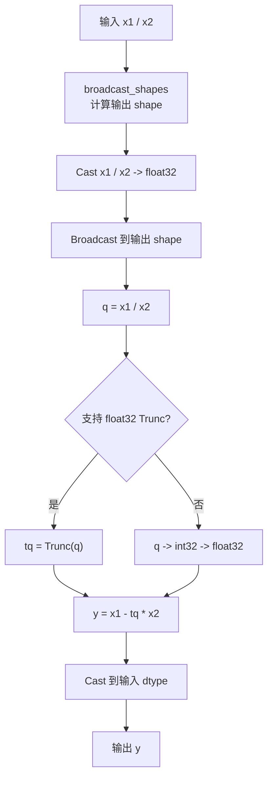
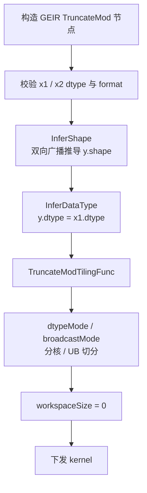
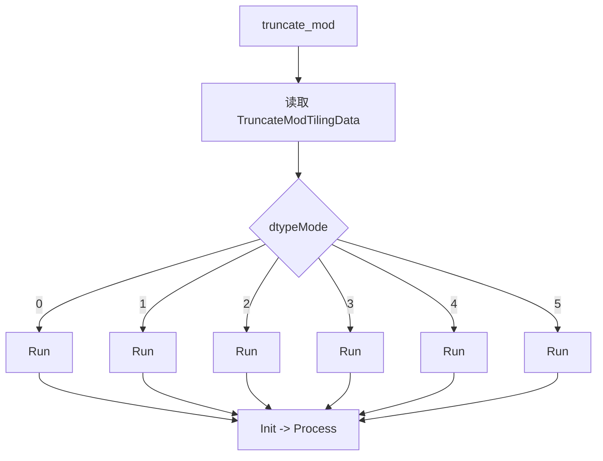
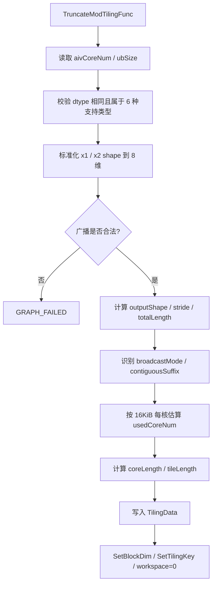
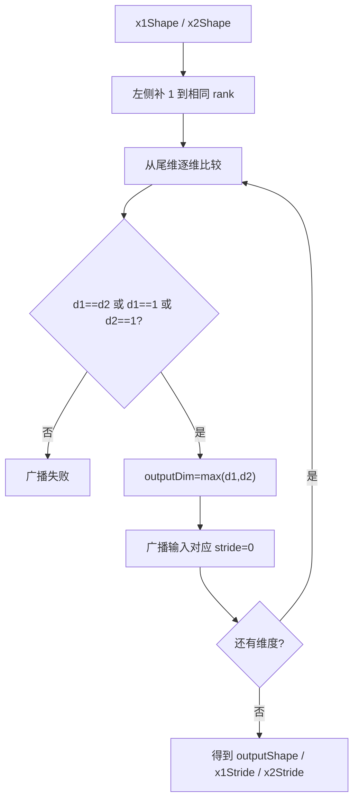
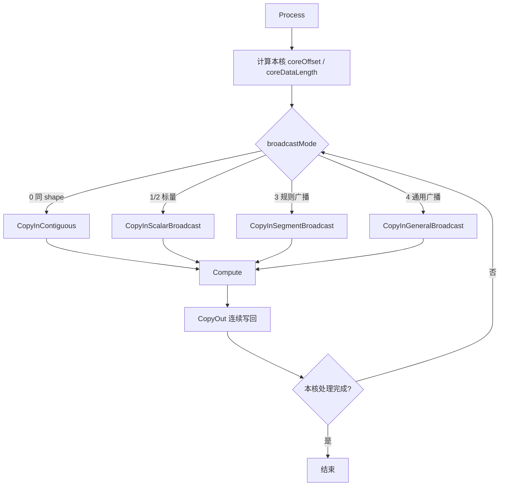
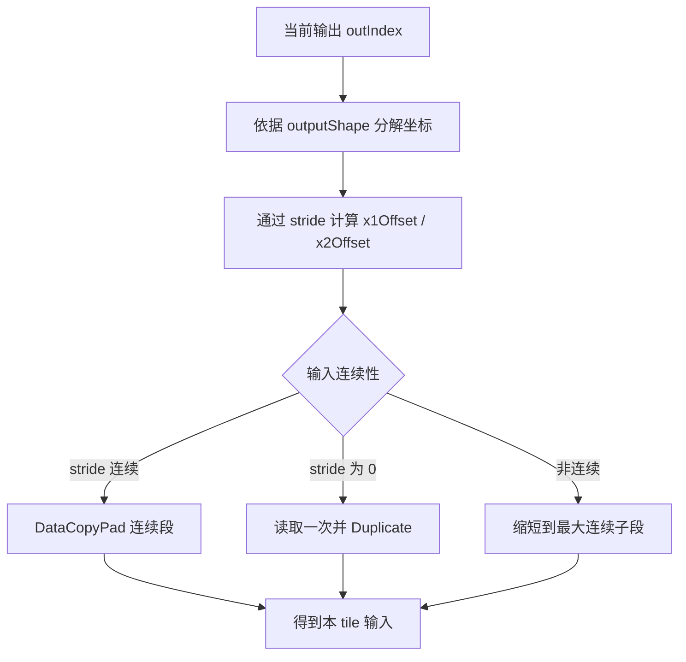
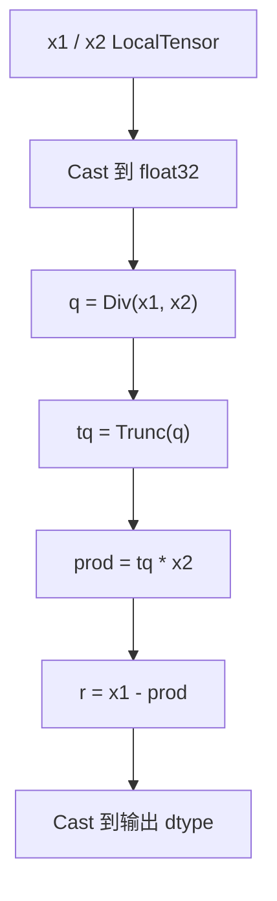
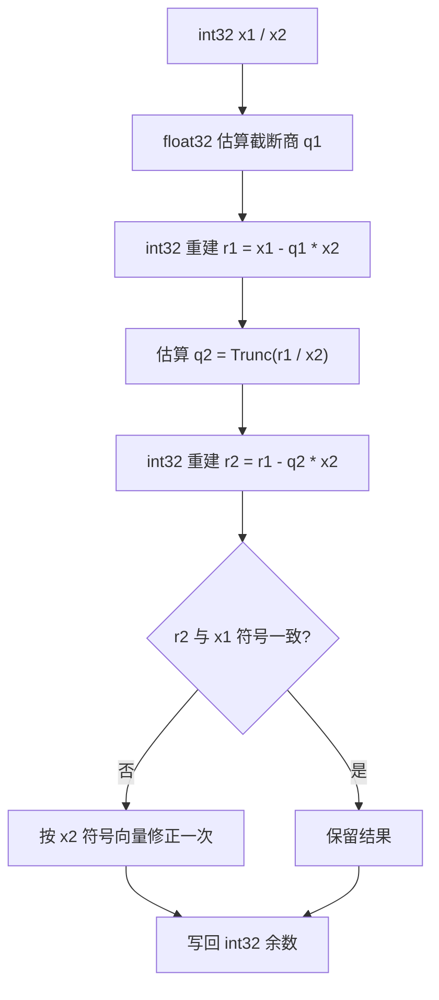

# **需求背景**

## **需求来源**

基于 CANN 训练营 2026 暑期季西安交通大学专场 [TruncateMod 算子开发任务书](https://gitcode.com/cann/cann-ops-competitions/blob/master/04_tasks/01_community-task-2026/docs/202607/TruncateMod_task_doc.md)，参考 CANN 内置 TruncateMod 算子的 TBE 实现，使用 Ascend C 编程语言在 Atlas A2 / Atlas A3（ascend910b / ascend910_93）上实现功能一致、支持泛化输入且性能达标的 AICore 算子。

TruncateMod 用于计算截断除法的余数。对完成广播后的每一组元素，先计算商并向零取整，再由被除数减去“截断商与除数的乘积”得到余数：

```text
y = x1 - trunc(x1 / x2) * x2
```

该语义与 TensorFlow `TruncateMod`、PyTorch `fmod` 一致，余数符号与被除数 `x1` 一致。例如：`TruncateMod(-7, 3) = -1`，`TruncateMod(7, -3) = 1`。

本设计分析所依据的 CANN 8.5.0 内置实现路径如下：

- 动态 TBE 实现：`${ASCEND_INSTALL_PATH}/opp/built-in/op_impl/ai_core/tbe/impl/ops_legacy/dynamic/truncate_mod.py`
- 算子原型：`${ASCEND_INSTALL_PATH}/opp/built-in/op_proto/inc/elewise_calculation_ops.h`
- Atlas A2 信息库：`${ASCEND_INSTALL_PATH}/opp/built-in/op_impl/ai_core/tbe/kernel/config/ascend910b/ops_legacy/truncate_mod.json`
- Atlas A3 信息库：`${ASCEND_INSTALL_PATH}/opp/built-in/op_impl/ai_core/tbe/kernel/config/ascend910_93/ops_legacy/truncate_mod.json`

## **TBE 源码分析**

### **1. 算子原型**

内置算子原型包含 `x1`、`x2` 两个必选输入，无属性，输出 `y`。

```cpp
REG_OP(TruncateMod)
    .INPUT(x1, TensorType({DT_BF16, DT_FLOAT16, DT_FLOAT, DT_DOUBLE,
                           DT_INT64, DT_INT8, DT_UINT8, DT_INT32}))
    .INPUT(x2, TensorType({DT_BF16, DT_FLOAT16, DT_FLOAT, DT_DOUBLE,
                           DT_INT64, DT_INT8, DT_UINT8, DT_INT32}))
    .OUTPUT(y, TensorType({DT_BF16, DT_FLOAT16, DT_FLOAT, DT_DOUBLE,
                           DT_INT64, DT_INT8, DT_UINT8, DT_INT32}))
    .OP_END_FACTORY_REG(TruncateMod)
```

原型语义如下：

| **名称** | **类别** | **说明** |
| -------- | -------- | -------- |
| x1 | 输入 | 被除数 Tensor。 |
| x2 | 输入 | 除数 Tensor，dtype 与 `x1` 相同，shape 需与 `x1` 满足广播规则。 |
| y | 输出 | 截断除法余数，dtype 与 `x1` 相同，shape 为两个输入的广播结果。 |

### **2. 目标硬件有效数据类型**

算子原型声明了 8 种 dtype，但 CANN 8.5.0 在 ascend910b / ascend910_93 上的动态 TBE 实现和预编译信息库实际覆盖 6 种 dtype。Ascend C 版本以目标硬件的有效 TBE 能力为对齐范围。

| **dtype** | **原型声明** | **A2/A3 TBE 有效支持** | **Ascend C 设计** |
| --------- | ------------ | --------------------- | ----------------- |
| bfloat16 | √ | √ | √ |
| float16 | √ | √ | √ |
| float32 | √ | √ | √ |
| int8 | √ | √ | √ |
| uint8 | √ | √ | √ |
| int32 | √ | √ | √ |
| float64 | √ | × | 不纳入本次 AICore 范围 |
| int64 | √ | × | 不纳入本次 AICore 范围 |

约束如下：

- `x1`、`x2` 必须为相同 dtype。
- `y` dtype 与输入 dtype 相同。
- 不支持混合 dtype 组合。

### **3. 数据格式**

Atlas A2 / Atlas A3 的 TBE 信息库将 `x1`、`x2`、`y` 注册为 ND，且使用 `FormatAgnostic` 匹配模式。算子计算按逻辑 shape 完成，不依赖 NCHW、NHWC 等语义维度。

| **参数** | **format** | **说明** |
| -------- | ---------- | -------- |
| x1 | ND | 动态 shape，逻辑输入格式。 |
| x2 | ND | 动态 shape，逻辑输入格式。 |
| y | ND | 输出为广播后的逻辑 shape。 |

### **4. Shape 与广播约束**

TBE 动态实现采用 `ELEWISE_WITH_BROADCAST` 分类，并通过 `broadcast_shapes` 计算输出 shape，因此支持两个输入的双向广播，而不是仅允许 `x2` 向 `x1` 广播。

对齐规则如下：

1. 从尾维开始比较 `x1` 与 `x2` 的 shape。
2. 两个维度相等，或其中一个维度为 1 时可以广播。
3. 缺失的高维按 1 补齐。
4. 输出维度取两个输入对应维度的最大值。

示例：

| **x1 shape** | **x2 shape** | **y shape** | **场景** |
| ------------ | ------------ | ----------- | -------- |
| `(2, 3, 4)` | `(2, 3, 4)` | `(2, 3, 4)` | 同 shape。 |
| `(2, 3, 4)` | `(4,)` | `(2, 3, 4)` | `x2` 尾维广播。 |
| `(1, 3, 1)` | `(2, 1, 4)` | `(2, 3, 4)` | 双输入多维广播。 |
| `()` / `(1,)` | `(2, 3, 4)` | `(2, 3, 4)` | `x1` 标量广播。 |

原型文档同时给出以下约束：

- 输入维数不超过 8。
- 输出元素总数不超过 `1,000,000`。
- `x2` 的元素值不能为 0。

### **5. TBE 计算语义**

动态 TBE 实现的主要步骤如下：

1. 计算 `x1`、`x2` 的广播 shape。
2. 将两个输入转换为 float32。
3. 将转换后的输入广播到输出 shape。
4. 计算 `q = x1 / x2`。
5. 在支持 `trunc` 的分支直接对 `q` 向零取整；其他分支通过 `float32 -> int32 -> float32` 完成截断。
6. 计算 `y = x1 - trunc(q) * x2`。
7. 将结果转换回输入 dtype。

TBE 实现统一使用 float32 中间计算，因此 int8 / uint8 可无损转换；int32 大数场景可能受到 float32 有效整数位数限制。Ascend C 版本在保持 TBE 语义的基础上，为 int32 规划高精度分支，避免无必要的精度退化。

### **TBE 计算流程图**



# **需求分析**

## **外部组件依赖**

不涉及第三方组件。算子实现依赖 CANN / Ascend C 基础组件、GE 图算子注册框架、op_host tiling 框架、`kernel_operator` 向量接口及算子开源仓公共构建与测试框架。

## **内部适配模块**

TruncateMod 的 Ascend C 实现包含以下模块：

- `op_graph` / `op_host`：声明算子原型，完成广播 shape 推导、dtype 推导、format 校验、tiling 和硬件信息获取。
- `op_kernel`：完成按核切分、分块搬运、广播展开、float 与整数计算、尾块写回。
- `examples`：提供 GEIR 图模式调用样例。
- `tests`：覆盖 host 推导、tiling、kernel 精度和性能用例。
- `docs`：记录算子接口、约束、设计和验证方法。

## **需求模块设计**

### **算子原型**

| **名称** | **类别** | **dtype** | **format** | **shape** | **介绍** |
| -------- | -------- | --------- | ---------- | --------- | -------- |
| x1 | 输入 | bf16 / fp16 / fp32 / int8 / uint8 / int32 | ND | 0D～8D | 被除数。 |
| x2 | 输入 | 与 `x1` 相同 | ND | 0D～8D | 除数，与 `x1` 满足广播规则。 |
| y | 输出 | 与 `x1` 相同 | ND | `broadcast(x1, x2)` | 截断除法余数。 |

**属性**：无。

### **功能拆解**

1. 支持目标硬件 TBE 已覆盖的 6 种 dtype。
2. 支持同 shape、任一输入标量、单维广播、多维广播和双输入广播。
3. 支持动态 shape，rank 不超过 8。
4. 浮点类型与 TBE 的 float32 中间计算语义一致。
5. int8 / uint8 使用扩展类型计算，int32 使用高精度计算和边界修正。
6. 所有核参与计算的场景下，性能不低于 TBE 的 95%。

## **算子支持型号**

Atlas A2 训练系列产品（ascend910b）、Atlas A3 系列产品（ascend910_93）。

# **需求详细设计**

## **使能方式**

| **上层框架** | **涉及的框架勾选** |
| ------------ | ------------------ |
| TF训练/推理 | √ |
| Pytorch训练/推理 | |
| ATC推理 | √ |
| Aclnn直调 | |
| OPAT调优 | |
| SGAT子图切分 | |

TruncateMod 是 TensorFlow 兼容的 GE 图算子，本次提供图模式接口，不新增未定义的 ACLNN 公共接口。

## **需求总体设计**

### **host侧设计方案**

Host 侧负责 dtype / format 校验、广播 shape 推导、广播模式识别、硬件信息读取、分核、UB 切分和 tiling key 下发。算子无跨核归约，不需要用户 workspace。

#### **1) InferShape**

`InferShapeTruncateMod` 对两个输入 shape 做右对齐广播推导：

```text
rank = max(rank(x1), rank(x2))

for axis in reversed(0 .. rank - 1):
    d1 = x1 对应维度，缺失时为 1
    d2 = x2 对应维度，缺失时为 1
    require d1 == d2 or d1 == 1 or d2 == 1
    y[axis] = max(d1, d2)
```

任一维度不满足广播规则时返回 `GRAPH_FAILED`。动态未知维场景保留未知维信息，由运行时 tiling 使用实际 storage shape 再次校验。

#### **2) InferDataType**

```text
require dtype(x1) == dtype(x2)
require dtype(x1) in {bf16, fp16, fp32, int8, uint8, int32}
dtype(y) = dtype(x1)
```

#### **3) 广播 shape 标准化**

Tiling 将输入 shape 左侧补 1，标准化为固定 8 维数组，并计算输出 shape 与输入 stride：

```text
normalizedX1[8]
normalizedX2[8]
outputShape[8]
x1Stride[8]
x2Stride[8]
```

广播维的 stride 设置为 0；非广播维使用连续 ND stride。Kernel 可通过输出线性下标恢复坐标，再计算两个输入的 GM 偏移。

#### **4) 广播模式分类**

Host 侧根据标准化 shape 选择广播模式：

| **broadcastMode** | **场景** | **kernel 策略** |
| ----------------- | -------- | --------------- |
| 0 | `x1.shape == x2.shape == y.shape` | 两输入连续搬运。 |
| 1 | `x1` 为标量 | `x1` 搬入一次后 `Duplicate`，`x2` 连续搬运。 |
| 2 | `x2` 为标量 | `x2` 搬入一次后 `Duplicate`，`x1` 连续搬运。 |
| 3 | 单边规则广播 | 连续输入直接搬运，广播输入按连续段搬运并展开。 |
| 4 | 双边 / 通用广播 | 依据 shape 与 stride 进行分段地址映射。 |

其中“单边规则广播”指一个输入 shape 与输出相同，另一个输入仅在若干维度为 1；“通用广播”覆盖 `(1, 3, 1)` 与 `(2, 1, 4)` 等两个输入均需扩展的场景。

#### **5) dtype 模式**

| **dtypeMode** | **dtype** | **kernel 类型** | **计算路径** |
| ------------- | --------- | -------------- | ------------ |
| 0 | float16 | `half` | 提升到 float32。 |
| 1 | float32 | `float` | float32 直接计算。 |
| 2 | bfloat16 | `bfloat16_t` | 提升到 float32。 |
| 3 | int8 | `int8_t` | 扩展后计算。 |
| 4 | uint8 | `uint8_t` | 扩展后计算。 |
| 5 | int32 | `int32_t` | 高精度整数路径。 |

#### **6) 分核策略**

按输出元素线性空间切分，各核负责互不重叠的连续输出区间：

```text
totalLength = product(outputShape)
bytesPerElement = sizeof(x1) + sizeof(x2) + sizeof(y)
workBytes = totalLength * bytesPerElement
usedCoreNum = ceilDiv(workBytes, 16 KiB)
usedCoreNum = clamp(usedCoreNum, 1, min(aivCoreNum, totalLength))
coreLength = alignUp(ceilDiv(totalLength, usedCoreNum), 64)
usedCoreNum = ceilDiv(totalLength, coreLength)
```

设计原则：

- 大 shape 尽量使用全部可用 Vector Core。
- 小 shape 控制启动核数，避免核启动开销高于计算收益。
- `coreLength` 按 64 元素对齐，末核处理尾部实际长度。
- 通用广播仍按输出空间分核，保证各核写回连续，避免写冲突。

#### **7) UB 切分**

UB 中包含双缓冲输入输出队列和计算临时空间：

- `x1InQueue`、`x2InQueue`、`yOutQueue`：双缓冲。
- `x1Fp32`、`x2Fp32`、`quotientFp32`、`remainderFp32`：float32 计算缓冲。
- 广播索引 / mask 临时空间：通用广播和 int32 修正路径复用。

Host 侧按下式估算单元素 UB 开销：

```text
queueBytesPerElem = 2 * (sizeof(x1) + sizeof(x2) + sizeof(y))
calcBytesPerElem  = 4 * sizeof(float)
maskBytesPerElem  = sizeof(uint8_t)
perElem           = queueBytesPerElem + calcBytesPerElem + maskBytesPerElem
usableUb          = ubSize - 8 KiB
tileLength        = floor(usableUb / perElem / 64) * 64
tileLength        = clamp(tileLength, 64, coreLength)
```

int32 高精度分支需要额外临时缓冲时降低 `tileLength`，由 dtypeMode 对应的 `ubDivider` 独立计算。

#### **8) tilingkey 规划**

Tiling key 同时编码 dtype 与广播模式：

```text
tilingKey = dtypeMode * 8 + broadcastMode
```

有效值共 `6 × 5 = 30` 种。Kernel 入口使用模板参数实例化 dtype，并在编译期裁剪不需要的广播分支和整数高精度分支。

#### **9) TilingData 参数**

`TruncateModTilingData` 规划如下：

| **字段** | **类型** | **含义** |
| -------- | -------- | -------- |
| totalLength | uint64 | 输出元素总数。 |
| coreLength | uint64 | 普通核负责的输出元素数。 |
| tileLength | uint32 | 单 tile 最大元素数。 |
| usedCoreNum | uint32 | 实际使用核数。 |
| rank | uint32 | 标准化前的输出 rank。 |
| dtypeMode | uint32 | dtype 分支编号。 |
| broadcastMode | uint32 | 广播分支编号。 |
| contiguousSuffix | uint32 | 可连续处理的最内层元素数。 |
| x1Shape[8] | uint64[8] | 标准化后的 `x1` shape。 |
| x2Shape[8] | uint64[8] | 标准化后的 `x2` shape。 |
| outputShape[8] | uint64[8] | 标准化后的输出 shape。 |
| x1Stride[8] | uint64[8] | `x1` stride，广播维为 0。 |
| x2Stride[8] | uint64[8] | `x2` stride，广播维为 0。 |

#### **10) Workspace 规划**

各核独立读取输入、写入不重叠的输出区间，无跨核同步和归约：

```text
workspaceSize = 0
```

### **kernel侧设计方案**

Kernel 入口 `truncate_mod<dtypeMode, broadcastMode>` 根据 tiling key 实例化对应类型与广播策略，执行 `Init -> Process`。

#### **1) 初始化阶段**

1. 读取 `TruncateModTilingData`。
2. 计算 `blockIdx`、本核输出起点 `coreOffset` 与实际长度 `coreDataLength`。
3. 绑定 `x1Gm`、`x2Gm`、`yGm`。
4. 初始化双缓冲队列和计算临时缓冲。
5. 缓存 8 维 shape / stride，用于通用广播地址计算。

#### **2) 连续搬运路径**

`broadcastMode == 0` 时，两个输入与输出地址均连续：

```text
DataCopyPad x1[coreOffset + tileOffset] -> x1Local
DataCopyPad x2[coreOffset + tileOffset] -> x2Local
Compute(x1Local, x2Local)
DataCopyPad yLocal -> y[coreOffset + tileOffset]
```

该路径无索引计算，是大 shape 性能主路径。

#### **3) 标量广播路径**

`broadcastMode == 1 / 2` 时：

1. 标量输入只从 GM 搬入一个元素。
2. 使用 `Duplicate` 扩展到当前 tile 的有效长度。
3. 非标量输入连续搬运。
4. 标量值可在核内循环复用，避免每个 tile 重复读取 GM。

#### **4) 规则广播路径**

`broadcastMode == 3` 时，Host 侧给出 `contiguousSuffix`。Kernel 按连续段处理：

1. 由输出起点计算广播输入的首地址。
2. 对非广播的连续后缀使用 `DataCopyPad`。
3. 对广播维使用 `Duplicate` 或重复段拷贝扩展。
4. 单次处理长度不跨越当前连续后缀边界。

该策略避免逐元素 GM 访问，适用于 `(N, C, H, W)` 与 `(1, C, 1, 1)`、`(N, C, H, W)` 与 `(W,)` 等常见模式。

#### **5) 通用广播路径**

`broadcastMode == 4` 时，对输出线性下标 `outIndex` 做 8 维坐标分解：

```text
remaining = outIndex
x1Offset = 0
x2Offset = 0

for axis from 7 to 0:
    coord = remaining % outputShape[axis]
    remaining /= outputShape[axis]
    x1Offset += coord * x1Stride[axis]
    x2Offset += coord * x2Stride[axis]
```

Kernel 以“最大连续段”为单位生成地址，而不是逐元素处理：当下一段内某个输入 stride 连续时直接批量搬运；stride 为 0 时用 `Duplicate`；仅在两个输入都不连续的最坏场景退化为小段循环。该路径优先保证泛化正确性。

#### **6) 浮点计算路径**

bf16 / fp16 先转换为 float32，fp32 直接使用：

```text
q  = Div(x1Fp32, x2Fp32)
tq = Trunc(q)
r  = x1Fp32 - tq * x2Fp32
y  = Cast(r, outputDtype)
```

若目标编译环境不支持 float32 `Trunc`，使用等价表达式：

```text
tq = Ceil(Min(q, 0)) + Floor(Max(q, 0))
```

该表达式对正数向下取整、对负数向上取整，等价于向零截断。

#### **7) int8 / uint8 计算路径**

int8 / uint8 的数值范围可被 float32 精确表示：

1. 输入转换为 float32。
2. 使用 `Div + Trunc + Mul + Sub` 计算。
3. 结果转换回 int8 / uint8。

由于合法输入要求 `x2 != 0`，余数绝对值小于除数绝对值，不会超出原 dtype 范围。

#### **8) int32 高精度路径**

int32 直接转换为 float32时，绝对值超过 `2^24` 可能丢失低位。为避免使用舍入后的 `x1` 重建余数，高精度路径只使用 float32 估算截断商，乘减过程始终保留 int32 原值：

1. 将 `x1`、`x2` 转换为 float32，计算第一次截断商估计 `q1`。
2. 将 `q1` 转换为 int32，使用原始 int32 输入计算 `r1 = x1 - q1 * x2`。
3. 对 `r1 / x2` 再做一次 float32 截断商估计 `q2`，使用 int32 `Mul / Sub` 计算 `r2 = r1 - q2 * x2`。
4. 比较 `r2` 与 `x1` 的符号；若符号不一致，根据 `x2` 的符号执行一次 int32 加减修正。
5. 比较和修正均使用向量 mask，覆盖 `INT32_MIN / -1`、`x2 == INT32_MIN` 等边界，不执行可能溢出的 int32 商计算。

小范围 int32 可选择 float32 快路径；Host 不能扫描输入值，因此默认启用高精度模板，性能评估后再决定是否提供由上层已知取值范围触发的快路径。

#### **9) 除零与特殊值**

- `x2 == 0` 属于算子原型明确禁止的非法输入，Host 无法在不扫描 Tensor 的情况下校验，Kernel 不额外定义整数除零结果。
- 浮点 NaN / Inf 按 float32 向量指令传播规则执行，并与 TBE 的 float32 中间计算保持一致。
- 尾块仅对有效元素执行计算和写回，填充区不影响输出。

### **Ascend C 流程图**

#### **1. 图模式调用流程图**



#### **2. Kernel 入口流程图**



#### **3. Host Tiling 流程图**



#### **4. 广播推导流程图**



#### **5. Process 主流程图**



#### **6. 广播搬运流程图**



#### **7. 浮点求余流程图**



#### **8. int32 高精度流程图**



## **支持硬件**

| **支持的芯片版本** | **涉及勾选** |
| ------------------ | ------------ |
| 香橙派 OrangePi AIpro | |
| Atlas 200I/500 A2 推理产品 | |
| Atlas A2 训练系列产品 / Atlas A3 系列产品 | √ |

## **算子约束限制**

- 支持 ND 格式。
- `x1`、`x2` dtype 必须相同，且属于 `bfloat16`、`float16`、`float32`、`int8`、`uint8`、`int32`。
- 输出 `y` dtype 与输入相同，shape 为 `x1`、`x2` 的广播结果。
- 输入 shape 必须满足双向广播规则，rank 不超过 8。
- 按内置原型约束，输出元素总数不超过 `1,000,000`。
- `x2` 的所有元素必须非 0。
- 不支持 float64 / int64 的 AICore kernel；这两种类型不在 ascend910b / ascend910_93 的有效 TBE 二进制范围内。
- bf16 / fp16 / fp32 采用 float32 中间计算，特殊值行为与 TBE 保持一致。
- int32 使用高精度路径，并覆盖 `INT32_MIN / -1` 边界。

# **特性交叉分析可维可测分析**

## **测试设计**

自验证用例覆盖以下维度：

| **测试维度** | **覆盖内容** |
| ------------ | ------------ |
| dtype | bf16、fp16、fp32、int8、uint8、int32。 |
| shape | 标量、1D、2D、4D、8D、非 32B 对齐尾块。 |
| 广播 | 同 shape、`x1` 标量、`x2` 标量、尾维广播、多维单边广播、双边广播。 |
| 数值 | 正数、负数、正负除数组合、接近 0 的非零浮点除数、大 int32、`INT32_MIN` 边界。 |
| 泛化 | 随机 rank、随机合法广播 shape、随机合法 dtype 数据。 |
| 性能 | 小 shape、单核、中等 shape、所有核参与的大 shape。 |

Golden 计算使用 `torch.fmod` 或公式 `x1 - trunc(x1 / x2) * x2`，并确保生成数据中 `x2 != 0`。

## **验收标准**

| **验收标准** | **描述** |
| ------------ | -------- |
| 功能标准 | 支持任务要求的合法动态 shape、6 种有效 dtype 和双向广播场景，所有自验证用例通过。 |
| 精度标准 | 满足 CANN Judge 对应题目的默认精度阈值，且不低于 TBE 版本；整数类型按精确结果校验。 |
| 性能标准 | 所有核参与计算场景下，Ascend C 性能不低于 TBE 的 95%。 |
| 小 shape 标准 | 10 μs 以下场景若绝对差距不超过 3 μs，提供仿真图和流水分析，证明计算与搬运流程不劣于 TBE。 |

## **兼容性分析**

本需求新增 Atlas A2 / Atlas A3 的 Ascend C 实现，不改变原 TruncateMod 的输入输出语义、dtype 推导、广播规则和图模式接口。未命中 Ascend C 支持范围的产品或 dtype 继续由现有机制处理，不影响存量调用。

## **风险分析**

| **风险项** | **影响** | **应对措施** |
| ---------- | -------- | ------------ |
| 通用广播地址计算开销 | 小 tile 或复杂广播性能下降 | 使用广播模式分类、连续后缀和分段搬运，常见场景走编译期快路径。 |
| int32 大数精度 | float32 中转丢失低位 | float32 仅估算商，使用两阶段 int32 乘减重建及向量符号修正，高精度模板独立验证。 |
| 小 shape 启动开销 | 低于 TBE 小 shape 性能 | 按最小工作字节控制核数，标量在核内复用，减少队列和循环。 |
| UB 占用过高 | tile 变小、循环次数增加 | 按 dtype 独立计算 `ubDivider`，复用 mask / scratch，减少同时存活的临时 Tensor。 |

## **关联的 Issue**

暂无。

## **文档更新**

本文档。

## **类型标签**

- [ ] Bug修复
- [ ] 新特性
- [ ] 性能优化
- [ ] 文档更新
- [x] 其他，请描述：社区任务算子设计文档
