# 需求背景（required）

## 需求来源

本需求来源于 2026 年 7 月 CANN 算子社区任务。任务要求在不改变
`aclnnBernoulli` 既有功能、精度和随机语义的前提下，以 Atlas A2/A3
训练系列产品为目标优化 Device 内存占用，使 NPU 实现与 GPU 实现的峰值内存
差距控制在 5% 以下，同时保证性能不低于优化前的原算子。本设计采用 output
storage alias 和单 Kernel 原地展开方案，已消除导致内存膨胀的全尺寸中间对象，
内存占用满足任务书要求。

任务书指出，原 910B 标量概率路径由多个小算子拼接完成：

```text
DSAGenBitMask -> Fill -> DropoutDoMask -> Cast -> ViewCopy
```

其中 `Fill` 和 `DropoutDoMask` 都会构造与输出同 shape 的完整临时 Tensor，
是内存膨胀的主要来源。任务书给出的参考方向是将 `Fill + DropoutDoMask`
做 inplace 融合。本设计在保持 DSA 随机 mask 生成不变的基础上，进一步将
`Fill` 和 `DropoutDoMask` 的功能合并为单个 Ascend C Kernel，直接由 packed
mask 生成目标 dtype 的最终 0/1 结果。

设计重点是随机 mask 与最终输出共享 storage、Kernel 原地展开、dtype 原生输出
以及短任务单核/大任务多核倒序 stage 的完整数据流。

## 背景介绍

### aclnnBernoulli算子实现优化

对标 PyTorch `torch.bernoulli` 和 `Tensor.bernoulli_` 的标量概率形式。设输出
元素总数为 `N`，输入概率为 `p`，则每个输出元素满足：

```text
y_i in {0, 1}
P(y_i = 1) = p
P(y_i = 0) = 1 - p
```

`self` 的数据内容不参与计算，只提供输出的 shape、dtype、format 和 view
信息。`seed` 与 `offset` 决定随机序列；相同输入条件下必须保持既有随机数生成
协议，不得因内存优化更换随机算法或改变 mask 的 bit 顺序。

需要区分两种“inplace”概念：

| 概念 | 含义 |
|---|---|
| 公共 inplace API | `aclnnInplaceBernoulli` 将结果写回 `selfRef` 对应的用户可见存储 |
| 融合计算的直接输出 | 私有 Kernel 不构造完整 ones/dropout 中间 Tensor，直接生成最终逻辑结果 |

本设计实现的是第二种计算融合，并通过公共 API 既有的 `ViewCopy` 机制继续支持
第一种用户语义。私有 `Bernoulli` 使用 executor 管理的连续输出 Tensor，随机
mask 始终通过该 output storage 的 UINT8 view 由 DSA 写入，随后同一个 Kernel
在原 storage 上展开。mask 不再形成独立 HBM 对象；短任务按 mask 大小选择单核
或多核调度，单核路径在 UB 中完成预取并跳过全核同步。该方案不直接绑定外部
任意 view，因此不会破坏非连续 Tensor 和公共 inplace 接口的适配逻辑。

### aclnnBernoulli算子TBE实现现状分析

#### 1. 源码与信息库定位

本任务优化的是 ACLNN 小算子拼接路径，不存在一个可直接替换的单体 TBE
`Bernoulli` Kernel。设计分析以公共 ACLNN 实现和各依赖小算子为准。

| 模块 | 源码或信息文件 | 作用 |
|---|---|---|
| 公共 Bernoulli ACLNN | `random/dsa_gen_bit_mask/op_host/op_api/aclnn_bernoulli.cpp` | 参数校验、架构分流、executor 组图 |
| Bernoulli 公共声明 | `random/dsa_gen_bit_mask/op_host/op_api/aclnn_bernoulli.h` | 两段式接口声明 |
| DSA mask L0 | `random/dsa_gen_bit_mask/op_host/op_api/dsa_gen_bit_mask.cpp` | 向调用方提供的 UINT8 Tensor 下发 DSA 任务 |
| Bernoulli 私有 L0 | `experimental/random/bernoulli/op_api/bernoulli.cpp` | 创建 output storage alias，组织 DSA 和 AICore launcher |
| Fill L0 | `conversion/fill/op_api/fill.cpp` | 原路径生成完整 ones Tensor |
| DropoutDoMask L0 | `random/drop_out_do_mask/op_api/dropout_do_mask.cpp` | 原路径按 packed mask 过滤 ones Tensor |
| 常量小算子 | `math/zero_op/op_api/zero_op.cpp`、`math/ones_like/op_api/ones_like.cpp` | 原 `p=0/1` 路径 |
| 私有算子原型 | `experimental/random/bernoulli/op_graph/bernoulli_proto.h` | 注册 `Bernoulli` |
| 私有算子定义 | `experimental/random/bernoulli/op_host/bernoulli_def.cpp` | 910B dtype/format 配置 |
| 私有 Host tiling | `experimental/random/bernoulli/op_host/bernoulli_tiling.cpp` | 分核、分块和 UB 预算 |
| 二进制信息库 | `experimental/random/bernoulli/op_host/config/ascend910b/bernoulli_binary.json` | 10 种 dtype 的静态二进制配置 |
| 私有 Ascend C Kernel | `experimental/random/bernoulli/op_kernel/bernoulli.cpp` | packed mask 展开和常量输出 |

#### 2. 支持的数据类型、格式和参数

任务交付范围与私有 Kernel 支持范围如下：

| 项目 | 支持范围 |
|---|---|
| `self/out` dtype | BF16、FP16、FP32、DOUBLE、UINT8、INT8、INT16、INT32、INT64、BOOL |
| `self/out` format | 公共接口保持既有非私有 format；私有计算按物理连续的一维元素序列处理 |
| `self/out` rank | 0-8 |
| `self/out` view | 支持空 Tensor 和非连续 Tensor |
| `prob` | Host Scalar，FP16/FP32/DOUBLE/BF16，`0 <= p <= 1` |
| `seed/offset` | `int64_t`；offset 遵循公共随机接口的 4 倍数约束 |
| 私有 `mask` | UINT8、packed bit mask；始终为私有输出 storage 的别名 view，消费前暂存于 UB |
| 私有 `Bernoulli` | 仅注册 ascend910b AICore 配置 |

公共 ACLNN 对 NCHW、NHWC、HWCN、NDHWC、NCDHW 等既有非私有 storage format
的兼容行为不因本任务改变；私有 Kernel 不解释 format 维度语义，只按连续的
扁平元素序列处理。OpDef 的声明格式为 ND，binary config 使用
`FormatAgnostic`，L0 输出继承 `input->GetViewFormat()`；三者的共同约束是进入
Kernel 的物理存储必须连续，而不是把所有公共 view 强制改写为 ND。私有格式
仍由公共参数检查拒绝。

#### 3. 原 910B 标量概率实现描述

原 `0 < p < 1` 路径执行以下步骤：

1. 将 `self` 连续化。
2. 根据输出 shape 计算并向 128 bit 对齐 DSA mask 长度。
3. 以 `1 - p` 作为 DSA dropout 概率生成 packed bit mask。
4. 通过 `Fill` 生成与输出 shape 相同的全 1 Tensor。
5. 通过 `DropoutDoMask` 使用 packed mask 过滤全 1 Tensor。
6. 将中间结果 Cast 到目标 dtype。
7. 通过 `ViewCopy` 写入公共输出或 `selfRef`。

原 `p=0` 和 `p=1` 路径分别调用 `ZerosLike` 和 `OnesLike`，之后仍进入公共
Cast/ViewCopy 收尾流程。

#### 4. 原实现流程图

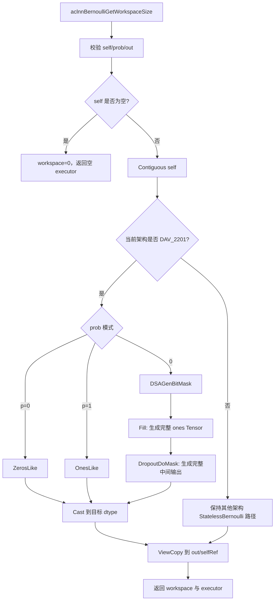

#### 5. 原实现内存生命周期

设：

```text
N       = 输出元素数
Sout    = 目标 dtype 单元素字节数
Sfill   = 原 Fill/DropoutDoMask 中间 dtype 单元素字节数
Mmask   = align_up(N, 128) / 8
```

忽略 allocator 对齐和框架固定开销，若将 executor 图中的逻辑结果全部物化且
生命周期重叠，原随机路径的逻辑分配上界可表示为：

```text
M_original_extra ~= Mmask
                 + N * Sfill          // Fill 输出
                 + N * Sfill          // DropoutDoMask 输出
                 + Mcast              // 需要物化 Cast 时的输出
```

其中 `Mcast` 取决于 dtype 和 Cast 是否物化。该公式描述原 executor 图中多个
全尺寸逻辑结果的结构性内存开销；allocator 的提前释放或复用不会改变原链路
存在 Fill、DropoutDoMask 和 Cast 中间对象这一根因。

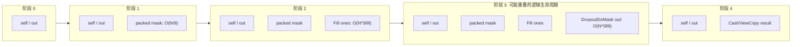

该生命周期模型表明，原 executor 图同时包含 Fill、DropoutDoMask 和 Cast
等全尺寸逻辑结果。本设计从算子图中删除这些中间 Tensor，而不是只缩小单个
Kernel 的 UB 使用。

### aclnnBernoulli算子功能分析

`aclnnBernoulli` 根据标量概率 `prob` 生成与 `self` shape、dtype 一致的 0/1
Tensor，`self` 的数据内容不参与随机计算。`seed` 和 `offset` 决定随机序列；
公共 out-of-place 接口写入 `out`，公共 inplace 接口写回 `selfRef`。优化只替换
910B Scalar-prob executor 内部计算链，不改变 Tensor-prob API 和非目标架构路径。

| 参数 | 参数含义 | 支持数据类型 | 数据格式 | shape/约束 |
|---|---|---|---|---|
| `self/selfRef` | 提供输出 shape、dtype、format 和 view 信息 | FLOAT16、FLOAT、DOUBLE、UINT8、INT8、INT16、INT32、INT64、BOOL、BFLOAT16 | ND 及公共接口既有非私有格式 | rank 0-8 |
| `prob` | 输出为 1 的概率 | FLOAT16、FLOAT、DOUBLE、BFLOAT16 | Host Scalar | `0 <= prob <= 1` |
| `seed` | 随机种子 | INT64 | - | 沿用公共随机协议 |
| `offset` | 随机序列偏移 | INT64 | - | `offset % 4 == 0` |
| `out` | 0/1 随机结果 | 与 `self` 一致 | 与公共接口约束一致 | shape 与 `self` 一致 |

# 需求分析（required）

## 需求描述

| 需求项 | 设计要求 |
|---|---|
| Bernoulli 语义 | 输出只包含 0/1，且随机模式满足 `P(1)=p` |
| dtype | 910B Scalar-prob 路径覆盖 BF16、FP16、FP32、DOUBLE、UINT8、INT8、INT16、INT32、INT64、BOOL |
| shape | 保持公共 API rank 0-8、动态 shape 和空 Tensor 语义 |
| 非连续 Tensor | 输入由 `Contiguous` 适配，输出由 `ViewCopy` 适配 |
| inplace API | 保持 `aclnnInplaceBernoulli` 写回 `selfRef` 的公共语义 |
| 随机协议 | 复用原 DSA mask 生成，保持 seed、offset 和 bit 顺序 |
| 端点概率 | 按 dtype/value 选择 AIV 常量 Kernel 或原 ZerosLike/OnesLike，避免 AI_CPU 和 AIV 固定开销回退 |
| 兼容性 | Tensor-prob API 和非 910B 架构路径不改变 |

## 需求拆解

1. 将原 `Fill + DropoutDoMask + Cast` 全尺寸消费链融合为单个 Ascend C Kernel。
2. 复用 DSA packed mask、seed、offset、概率转换和 bit 顺序，保持随机协议不变。
3. 消除独立 packed-mask HBM 以及全尺寸 Fill/DropoutDoMask/Cast 中间 Tensor。
4. 覆盖任务书要求的 10 种输出 dtype、rank 0-8、空 Tensor 和非连续 Tensor。
5. 保持公共 ABI、Tensor-prob API 和非 910B 架构路径不变。
6. 验证 NPU/GPU 峰值内存差距小于 5%，完整调用链性能不低于原算子。

### 外部组件依赖

不新增仓外运行时依赖。方案复用 CANN ACLNN/opdev executor、
`DSAGenBitMask` 和 Ascend C AIV 运行时；PyTorch、AscendOpTest 和 profiler
只用于对标与验收，不进入算子运行依赖。

### 内部适配模块

| 模块 | 职责 |
|---|---|
| 公共 ACLNN 层 | 参数校验、架构和概率模式分流、连续化、ViewCopy |
| DSA L0 层 | 在调用方提供的 UINT8 Tensor/view 中生成 packed mask |
| Bernoulli 私有 L0 层 | 申请私有输出，创建 UINT8 storage alias，组织 DSA 和 AICore launcher |
| OpDef/Proto | 约束 dtype/format/attr，注册私有 op type |
| Host tiling | shape 安全检查、分核、UB stage/tile 预算、固定 workspace 规划 |
| Ascend C Kernel | packed mask 分 stage 搬入 UB、同步后原地展开、常量 0/1 生成 |
| Binary config | 为 910B 的 10 种 dtype 生成静态二进制 |

### 需求模块设计

#### 算子原型

| **名称** | **类别** | **dtype** | **format** | **shape** | **说明** |
|---|---|---|---|---|---|
| `x` | 输入 | BF16/FP16/FP32/DOUBLE/UINT8/INT8/INT16/INT32/INT64/BOOL | ND | 动态 rank 0-8 | 提供输出 shape/dtype，Kernel 不读取数据 |
| `mask` | 输入 | UINT8 | ND | packed mask 字节数 | RANDOM 模式与 `y` 共享 storage |
| `y` | 输出 | 与 `x` 一致 | ND | 与 `x` 一致 | executor-owned 私有结果 |

| **属性** | **类型** | **取值** | **说明** |
|---|---|---|---|
| `mode` | Int | 0/1/2 | `RANDOM_ALIASED` / `ZERO` / `ONE` |

公共 `aclnnBernoulli` 和 `aclnnInplaceBernoulli` 两段式 ABI 不变。Tensor-prob
两组接口保留既有 `StatelessBernoulli` 路径，不进入私有 `Bernoulli` Kernel。

### 设计硬约束

| **维度** | **约束** |
|---|---|
| 功能 | 输出只包含 0/1，与 PyTorch Bernoulli 语义及原 DSA 随机协议一致 |
| 内存 | RANDOM 不创建独立 mask、Fill、DropoutDoMask 或全尺寸 Cast Tensor；当前 alias 方案满足 `<5%` |
| 资源 | workspace 固定为 512 bytes；UB stage/tile 按 dtype 和平台资源计算 |
| 性能 | 完整 ACLNN Device 任务链不低于原算子；原路径包含 DSA/Fill/DropoutDoMask，新路径包含 DSA/Bernoulli |
| 接口 | 公共 ABI、dtype、shape、view、inplace 和错误码行为保持不变 |
| 兼容 | 只替换 DAV_2201 Scalar-prob 路径；Tensor-prob 和其他架构保持既有实现 |

### 算子支持型号

Atlas A2/A3 训练系列产品（`ASCEND910B/ASCEND910_93`）。

# 详细设计（required）

## 算子分析

### 数学公式

设输出元素总数为 `N`，标量概率为 `p`，则每个输出元素满足：

$$
y_i \in \{0,1\},\qquad P(y_i=1)=p,\qquad P(y_i=0)=1-p
$$

随机路径由 DSA 根据 `seed`、`offset` 和 `dropout=1-p` 生成 packed bit mask，
第 `i` 个输出读取第 `i` 个 mask bit 并转换成目标 dtype 的 0 或 1。

### 支持数据类型

| 参数 | 支持数据类型 |
|---|---|
| `self/selfRef/out` | FLOAT16、FLOAT、DOUBLE、UINT8、INT8、INT16、INT32、INT64、BOOL、BFLOAT16 |
| `prob` | FLOAT16、FLOAT、DOUBLE、BFLOAT16 |
| `seed/offset` | INT64 |
| 私有 packed mask | UINT8 |

### 支持形状

- 公共输入输出支持 rank 0-8、动态 shape、空 Tensor 和非连续 Tensor。
- `out` 的 shape 与 dtype 必须和 `self` 一致。
- 私有 Kernel 按连续扁平元素序列处理；非连续输入输出由 `Contiguous/ViewCopy` 适配。
- Host tiling 检查元素数，L0 按 128-bit 对齐计算 mask 字节数。

## 算子实现

### 使能方式

私有算子位于 `experimental/random/bernoulli`，仅为 `ascend910b` 构建，并通过
模块依赖复用 `dsa_gen_bit_mask` 和 `stateless_bernoulli`。公共
`aclnnBernoulli` 位于 `random/dsa_gen_bit_mask`，DAV_2201 Scalar-prob
分支调用私有 L0 helper。

| 条件 | 实现路径 |
|---|---|
| Scalar-prob + DAV_2201 + 非空 RANDOM | DSA + 私有 `Bernoulli` Kernel |
| Scalar-prob + DAV_2201 + 白名单 ZERO/ONE | 私有 `Bernoulli` 常量 mode |
| Scalar-prob + DAV_2201 + 其他 ZERO/ONE | 既有 ZerosLike/OnesLike |
| Tensor-prob API | 既有 `StatelessBernoulli` |
| DAV_3510 和其他架构 | 既有 `StatelessBernoulli` |
| 空 Tensor | ACLNN 层直接返回 |

运行时 op type 统一为 `Bernoulli`。Proto、OpDef、tiling、binary config、
AICore 入口和 L0 launcher 使用同一名称。

### 实现方案

#### 总体设计思想

本方案采用“保留随机源，替换全尺寸消费链”的设计：

```text
随机数生成协议保持不变：DSAGenBitMask
全尺寸中间链被替换：Fill + DropoutDoMask + Cast -> Bernoulli
```

设计原则如下：

1. **随机语义优先**：继续使用原 DSA mask，不自行实现另一套 RNG。
2. **图级内存优化**：从 executor 图中删除完整 ones、dropout 输出和独立
   packed-mask Tensor；DSA 直接写入最终私有输出 storage 的 UINT8 alias。
3. **端点按执行引擎选路**：DOUBLE、INT16 的两个端点及 INT64 的 ONE 使用
   私有 AIV 常量 mode；其他端点保持 ZerosLike/OnesLike。
4. **全 dtype 原生输出**：Kernel 直接产生目标 dtype 的 0/1，不在 ACLNN 层
   追加全尺寸 Cast。
5. **接口边界稳定**：公共 API、Tensor-prob API 和非 910B 路径保持不变。
6. **资源运行时自适应**：Host 按平台 AIV 核数、UB 大小、mode 和 dtype 计算
   `blockDim`、`stageElements` 与 `tileElements`。

#### 1. 总体执行流程

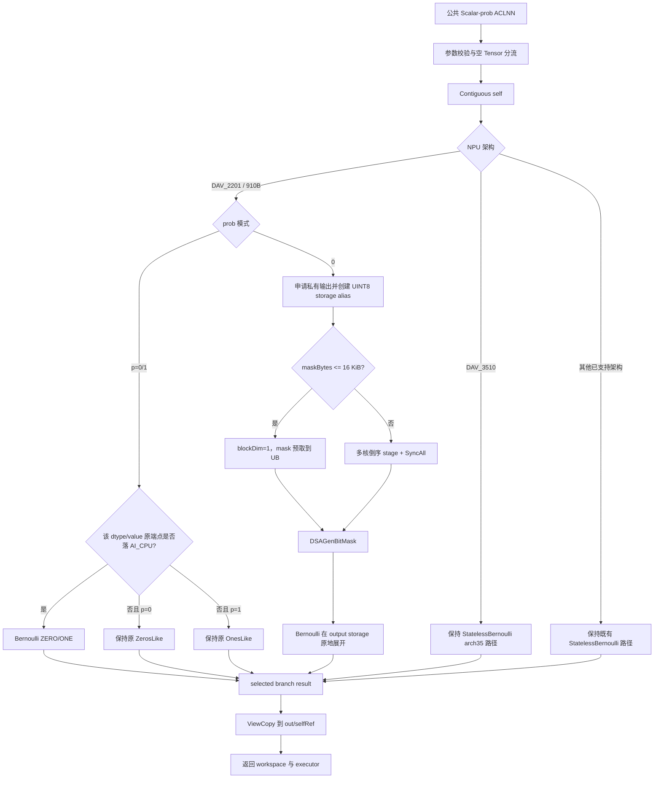

#### 2. 概率路径分流

| 路径 | 触发条件 | Device 任务 | packed mask | 输出语义 |
|---|---|---|---|---|
| `RANDOM_ALIASED=0` | `0 < p < 1` | DSA + AIV | 输出 storage alias | 按 packed bit 原地生成 0/1；小 mask 单核、其余多核 |
| AIV ZERO/ONE | DOUBLE/INT16 两端点、INT64 ONE | AIV | 否 | 全 0/1 |
| 原 ZERO/ONE | 其余端点 | ZerosLike/OnesLike | 否 | 全 0/1 |

私有 L0 提供 `BernoulliRandom` 和 `BernoulliConstant`。端点路由使用显式
白名单，其他 dtype/value 组合保留原 ZerosLike/OnesLike 路径。

#### 3. 接口设计

##### 3.1 公共 Scalar-prob 接口

```cpp
aclnnStatus aclnnBernoulliGetWorkspaceSize(
    const aclTensor* self,
    const aclScalar* prob,
    int64_t seed,
    int64_t offset,
    aclTensor* out,
    uint64_t* workspaceSize,
    aclOpExecutor** executor);

aclnnStatus aclnnBernoulli(
    void* workspace,
    uint64_t workspaceSize,
    aclOpExecutor* executor,
    aclrtStream stream);

aclnnStatus aclnnInplaceBernoulliGetWorkspaceSize(
    const aclTensor* selfRef,
    const aclScalar* prob,
    int64_t seed,
    int64_t offset,
    uint64_t* workspaceSize,
    aclOpExecutor** executor);

aclnnStatus aclnnInplaceBernoulli(
    void* workspace,
    uint64_t workspaceSize,
    aclOpExecutor* executor,
    aclrtStream stream);
```

公共参数约束：

| 参数 | 约束 |
|---|---|
| `self/selfRef` | Device Tensor；dtype 在支持列表内；rank 0-8；支持空 Tensor 和非连续 Tensor |
| `prob` | Host Scalar；FP16/FP32/DOUBLE/BF16；`0 <= p <= 1` |
| `seed` | `int64_t`，沿用随机子系统语义 |
| `offset` | `int64_t`，按公共文档要求满足 `offset % 4 == 0` |
| `out` | dtype、shape 与 `self` 一致；支持非连续 Tensor |
| `workspaceSize/executor` | 非空输出指针，由第一段接口填写 |

本设计不改变公共错误码。空指针返回 `ACLNN_ERR_PARAM_NULLPTR`；dtype、shape、
format、prob 或 offset 不满足公共约束时返回 `ACLNN_ERR_PARAM_INVALID`。

##### 3.2 Tensor-prob 接口边界

以下接口继续使用既有 `StatelessBernoulli` 设计，不进入本次私有 Kernel：

```text
aclnnBernoulliTensorGetWorkspaceSize / aclnnBernoulliTensor
aclnnInplaceBernoulliTensorGetWorkspaceSize / aclnnInplaceBernoulliTensor
```

Tensor-prob 支持逐元素概率 Tensor，不进入本设计的 Scalar-prob packed-mask
消费路径。

##### 3.3 私有 L0 接口

```cpp
const aclTensor* BernoulliRandom(
    const aclTensor* input,
    double probability,
    int64_t seed,
    int64_t offset,
    aclOpExecutor* executor);

const aclTensor* BernoulliConstant(
    const aclTensor* input,
    bool value,
    aclOpExecutor* executor);
```

两个 helper 最终统一调用：

```text
Bernoulli(x, mask, mode) -> y
```

私有 op 原型：

| 名称 | 类型 | dtype/format | 作用 |
|---|---|---|---|
| `x` | Input | 10 种输出 dtype；OpDef 声明 ND | 提供输出 shape/dtype/format；Kernel 不读取数据 |
| `mask` | Input | UINT8；OpDef 声明 ND | RANDOM 和常量模式均为 output storage 的 alias view |
| `mode` | Attr | Int | 0=RANDOM_ALIASED、1=ZERO、2=ONE |
| `y` | Output | 与 `x` dtype/shape 一致，L0 继承 view format | executor-owned 私有结果；RANDOM 与 mask 共享 storage |

##### 3.4 两段式接口时序

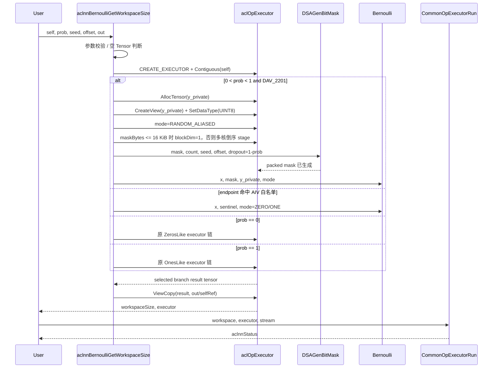

#### 3.2.1 host侧设计：

##### 1. 参数校验和空 Tensor

第一段接口校验空指针、dtype、shape、format、`prob` 范围和 `offset`，
再构造 executor：

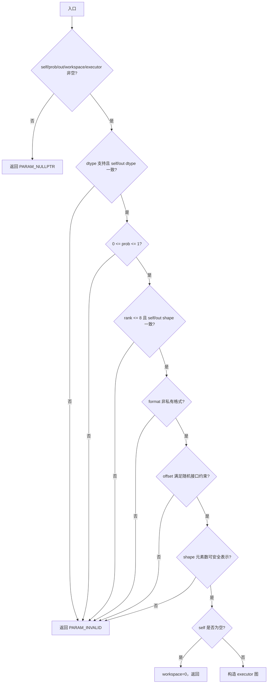

空 Tensor 在 ACLNN 层返回，不进入 DSA、tiling 和 Kernel。这样避免 `N=0`
时创建无意义 mask，也保持原接口的空 Tensor 行为。

私有 Host tiling 按逐维安全乘法计算元素数，并拒绝负维或超出
`int64_t` 表示范围的 shape。

##### 2. 连续化与公共 view 适配

私有 Kernel 只处理物理连续的扁平线性空间，不依赖 NCHW、NHWC 或 ND 的逻辑
维度解释。公共接口继续通过两级适配支持非连续 Tensor：

```text
非连续 self   -> Contiguous -> 连续逻辑输入
连续私有结果  -> ViewCopy    -> 非连续 out/selfRef
```

`x` 数据不会被私有 Kernel 读取，但仍执行 `Contiguous(self)`，以保持公共
executor 的 shape、format、view 语义和其他架构路径一致，并统一处理非连续、
storage offset 和 inplace 场景。

##### 3. 概率模式分流

Host 使用与既有实现一致的 double 比较策略识别端点概率：

```text
endpoint && UseAivConstantKernel(dtype, value) -> ZERO/ONE
endpoint && !UseAivConstantKernel(...)         -> ZerosLike/OnesLike
otherwise                                      -> RANDOM
```

端点路径均不启动 DSA。白名单为 DOUBLE ZERO/ONE、INT16 ZERO/ONE 和 INT64 ONE；
其他端点继续复用原 ZerosLike/OnesLike。RANDOM 模式必须满足 `0 < p < 1`。

##### 4. packed mask 长度与概率转换

DSA mask 按 128 bit 对齐：

```text
N_aligned = align_up(N, 128)
maskBits  = N_aligned
maskBytes = N_aligned / 8
```

RANDOM 路径先按输入 shape/dtype 申请最终私有结果 `y_private`，再在相同
storage 上创建 UINT8 mask view：

```text
全部 maskBytes       -> y_private 的 UINT8 storage view，mode=RANDOM_ALIASED
maskBytes <= 16 KiB  -> blockDim=1，mask 预取到 UB 后展开
maskBytes >  16 KiB  -> 多核倒序 stage，stage 预取后 SyncAll
```

mask view 与 `y_private` 具有相同 storage 和 view offset，仅改变 shape 与
dtype，因此 DSA 在所有随机规模都不申请独立 packed-mask HBM：

```text
y_private storage [0, N*Sout)
mask alias        [0, maskBytes)  -- same address
```

DSA 最少写一个 128-bit block，故非空小 Tensor 的 mask 至少为 16 bytes。
`CreateView` 在改成 UINT8 dtype 前按原 output dtype 校验 shape，因此当 `N < 16`
时，L0 使用带原始 view shape 的 16 元素 padded output storage。该 padding 上限
为 `16 * Sout`（DOUBLE 为 128B），属于 output storage 的固定对齐余量，不是
独立 mask Tensor，也不随大 Tensor 增长。

原 DSA L0 的参数名为 `dropout`，bit 为 1 表示保留。Bernoulli 要求 bit 为 1
的概率等于 `p`，因此继续传入：

```text
dropout = 1 - p
P(mask_bit = 1) = 1 - dropout = p
```

此转换、mask 对齐、seed 和 offset 均沿用原路径。新 Kernel 只改变 mask 的
存放位置和消费方式，不改变 mask 生成协议。

##### 5. 架构兼容分流

| 架构 | Scalar-prob 设计 |
|---|---|
| DAV_2201 / ascend910b | RANDOM 使用融合 Kernel；端点按白名单选择 AIV 或原路径 |
| DAV_3510 / arch35 | 保持现有 `StatelessBernoulli`，prob 统一转 FP32 |
| 其他已支持架构 | 保持现有 `StatelessBernoulli` |

该分流保证 `Bernoulli` Kernel 不会意外覆盖 950 或旧训练产品路径。

##### 6. 私有 Op Host tiling 设计

###### 6.1 shape 安全检查

Host 遍历 storage shape 计算：

```text
totalElements = product(shape[i])
```

每个维度必须非负，乘法前检查：

```text
shape[i] <= INT64_MAX / currentProduct
```

若发现负维或乘积溢出，tiling 返回失败，避免 block 和 GM offset 计算溢出。
该检查保护私有 Kernel 的分核和地址计算，是公共 ACLNN 分配前检查之后的第二道
防线，不负责替代此前已经发生的 output storage 申请和 alias 边界检查。

###### 6.2 分核策略

mask 每字节对应 8 个输出元素。分核和 stage 均以 256 个元素为最小粒度，使
任意 RANDOM stage 起点同时满足字节对齐、32-byte mask DMA 对齐和向量粒度：

```text
elementsPerBlockUnit = 256
candidateBlocks = ceil(totalElements / 256)
blockNum = min(max(candidateBlocks, 1), availableAivCoreNum)

blockElements = align_up(ceil(totalElements / blockNum), 256)
```

`blockElements` 是 Host 对“每核完整数据段”的估计，用于优先规划单 stage 覆盖
整段数据。RANDOM Kernel 实际按全局 wave 分配：

```text
waveElements = stageElements * blockNum
stageStart   = stageIndex * waveElements
coreStart    = stageStart + blockIdx * stageElements
```

stage 从全局高地址向低地址执行。所有起点均为 256 的倍数，各 core 可直接从
`maskGm[coreStart / 8]` 读取，无需跨 core 拼接 bit 或执行位移修正。

###### 6.3 UB 分块和 LocalMemory 预算

Host 从平台查询可用 UB，预留 8 KiB 给框架和对齐余量。平台信息不可用时使用
192 KiB 作为保守 fallback，不假设目标设备一定返回固定 UB 大小。设：

```text
U       = 可用 UB 字节数
R       = 8 KiB 保留空间
S       = 输出 dtype 字节数
Bout    = 2，output TQue 深度
Q       = 256，stage/tile 对齐粒度
K       = dtype 专用 scratch 字节/元素
A       = U - R
```

RANDOM_ALIASED 保留一个完整 packed-mask stage 和一个计算 tile。mask queue
深度为 1，output queue 深度为 2。统一 UB 模型为：

```text
computeBytesPerElement = Bout * S + K
computeBudget          = min(128 KiB, A - 32)
tile0                  = align_down(computeBudget / computeBytesPerElement, Q)
stageElements          = align_down((A - tile0 * computeBytesPerElement) * 8, Q)
stageElements          = min(stageElements, blockElements)
stageMaskBytes         = stageElements / 8
tileElements           = align_down((A - stageMaskBytes) / computeBytesPerElement, Q)

RANDOM_ALIASED 实际 mask queue bytes = stageElements / 8

Constant 模式:
  stageElements = 0
  tileElements  = align_down(A / (Bout * S), Q)
```

dtype 专用 scratch：

| dtype | `scratchPerElement` | 用途 |
|---|---:|---|
| FP32/FP16/BF16/INT16/INT32 | 0 | 直接或位模式复用输出 LocalTensor |
| INT8/UINT8/BOOL | 2 | half 中间结果后 Cast 到 1 byte |
| INT64 | 4 | FP32 0/1 中间结果后 Cast 到 INT64 |
| DOUBLE | 16 | packed 高低字缓存和 Gather offset 表 |

RANDOM 计算 tile 上限为 32768 元素；常量 tile 上限同样为 32768。DOUBLE/INT64
常量模式额外限制为 4096 元素，以约束 128-bit vector mask 的 repeatTimes
范围。典型 16M 元素 case 的 `blockElements` 约 420K，mask stage 约 52 KiB，
可与 FP16 32K tile、FP32 16K tile 或 DOUBLE 4K tile 同时放入 192 KiB UB，
因此每个全局 stage 只需要一个 `SyncAll`；当 `waveElements >= totalElements`
时整次 Kernel 只有一个 stage。更大的单核数据或更大的全局 Tensor 会退化为
多个全局倒序 stage，但不会重新申请 GM workspace。

最终 `stageElements/tileElements` 都向下对齐到 256；当真实数据不足 256 个元素
时仍保留一个对齐单元，GM 读写长度由真实 `count` 裁剪。

###### 6.4 tilingData

```cpp
struct BernoulliTilingData {
    uint64_t totalElements;
    uint64_t blockElements;
    uint64_t stageElements;
    uint64_t tileElements;
    uint32_t mode;
};
```

| 字段 | 说明 |
|---|---|
| `totalElements` | 全局真实元素数，用于末核裁剪 |
| `blockElements` | 每核完整数据段估计，256 元素对齐，用于 stage 规划 |
| `stageElements` | RANDOM_ALIASED 每核一次预取的 mask 覆盖元素数，256 元素对齐 |
| `tileElements` | 每次 UB 处理长度，256 元素对齐 |
| `mode` | RANDOM_ALIASED/ZERO/ONE |

Host tiling 申请固定 512-byte workspace 描述符，用于满足运行时 launcher 约束；
该值不随 shape 或 dtype 增长，不承载 packed mask 或输出数据。

###### 6.5 tilingKey 与二进制规划

当前所有模式和 shape 使用同一 `tilingKey=0`。mode 是运行时 attr，dtype 由
静态二进制配置选择。这样避免按 `4 modes x 10 dtypes` 扩展为 40 份二进制。

```text
tilingKey 0
  + runtime mode: RANDOM_ALIASED / ZERO / ONE
  + compile-time dtype: 10 binaries
```

mode 只影响 Kernel 内的 UB 初始化和计算分支，不改变输出 shape/format，因此
不需要独立 tilingKey。

###### 6.6 Host tiling 流程图

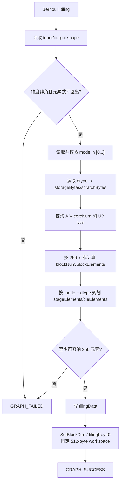

#### 3.2.2 kernel侧设计：

##### 1. Kernel 原型和输入使用

```cpp
extern "C" __global__ __aicore__ void bernoulli(
    GM_ADDR x,
    GM_ADDR mask,
    GM_ADDR y,
    GM_ADDR workspace,
    GM_ADDR tiling);
```

`x` 只参与 OpDef/L0 的 shape 和 dtype 契约，Kernel 不读取 `x` 数据；
`workspace` 不使用。Kernel 实际读取 `mask`（仅 RANDOM 模式）并写 `y`；
RANDOM_ALIASED 下二者始终指向同一块 GM storage 的不同类型视图。

BOOL 在 GM 上按 1 byte 存储，模板内部使用：

```cpp
StorageT = conditional_t<is_same_v<T, bool>, uint8_t, T>
```

避免对 `GlobalTensor<bool>` 的存储宽度产生歧义。

##### 2. 初始化流程

初始化步骤如下：

1. 绑定 mask/output GM。
2. 读取 `totalElements/blockElements/stageElements/tileElements/mode`。
3. 初始化 depth=2 的输出队列。
4. RANDOM_ALIASED 初始化 depth=1 的 stage mask queue 和 dtype 专用 scratch。
5. DOUBLE RANDOM 模式一次性构造 Gather offset 表，并将 low-word 区清零。
6. ZERO/ONE 按 `blockIdx * blockElements` 计算并裁剪静态核区间。

只有 RANDOM_ALIASED 不在初始化阶段绑定固定核区间，而是在每个全局倒序 stage
中按 `stageStart + blockIdx * stageElements` 计算本核区间，保证所有核采用同一
同步节拍。

##### 3. RANDOM 模式处理

###### 3.1 RANDOM_ALIASED

RANDOM_ALIASED 的关键不是普通逐 tile 读取，而是“整段预取、全核同步、本地展开”：

```text
for global stage from high address to low address:
    1. 每核将最多 stageElements 对应的 packed mask 从 GM 搬入本核 UB
    2. DeQue 等待本核 GM -> UB 完成
    3. blockDim > 1 时所有核执行 SyncAll<true>()；单核路径跳过同步
    4. 在 maskLocal 上按 tileElements 循环：
         生成目标 dtype 的候选 1
         Select(mask slice, 1, 0)
         必要时执行 dtype 专用 Cast/Gather
         只向 GM 写 tile 的真实 count
    5. 释放本核 mask stage，进入下一个更低地址 stage
```

若当前 stage 的真实 `count <= tileElements`，Kernel 走单 tile fast path，直接把
整段 `maskLocal` 交给 `ComputeMask`，省去通用内层循环和 LocalTensor 切片；
这覆盖中小 shape，同时不影响大 shape 的整段预取设计。

多核路径的 `DeQue + SyncAll` 保证任何 core 开始覆盖 GM 前，当前 stage 的所有
mask 都已进入各自 UB。单核路径只有一个生产者/消费者，不需要跨 core 同步。
两条路径都按全局高地址到低地址处理；输出元素 `i` 写入的 byte 地址对应 mask
中更高编号的元素，这些 bit 已在当前 stage 预取或在更早的高地址 stage 消费，
因此不会破坏未来低地址 stage。该顺序给出了原地覆盖的完整读写依赖保证。

mask padding 为 0，因此补齐 lane 即使参与向量计算也只生成 0；CopyOut 又只写
真实 `count`，不会覆盖输出尾部之外的 GM。

##### 4. 白名单 ZERO/ONE 常量分支

公共 L0 仅对白名单端点下发 ZERO/ONE mode。常量分支不读取 sentinel，直接在
输出 LocalTensor 中生成目标 dtype 的 0 或 1：

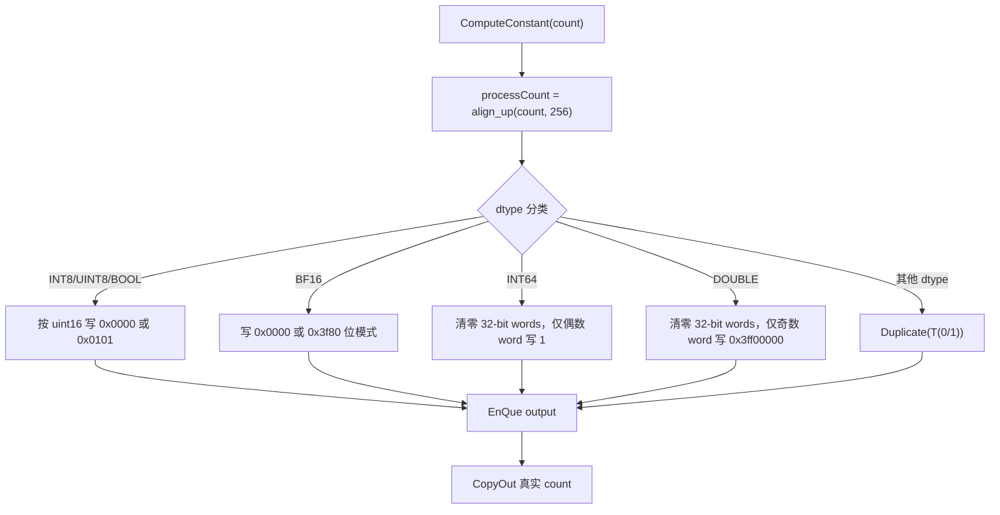

该分支不读取 mask，也不申请 mask queue 和 random scratch。单元素 sentinel 仅用于
满足私有算子的固定两输入原型，不随输出 shape 增长。

##### 5. dtype 专用生成策略

| dtype | RANDOM 模式策略 | 设计原因 |
|---|---|---|
| FP32 | FP32 `Duplicate + Select` | 原生向量路径 |
| FP16 | half `Duplicate + Select` | 原生向量路径 |
| INT32 | INT32 写 1，reinterpret 为 FP32 做 bit-select | 0/1 位模式可直接复用 |
| INT16 | INT16 写 1，reinterpret 为 half 做 bit-select | 0/1 位模式可直接复用 |
| BF16 | 写 `0x3f80`，reinterpret 为 half 做 bit-select | 避免不支持的 BF16 标量转换 |
| INT8/UINT8 | half 中生成 0/1，再向量 Cast | 910B packed Select 对 1-byte 类型能力受限 |
| BOOL | 与 UINT8 相同，最终按 byte 存储 | 保证 bool 存储表示为 0/1 |
| INT64 | FP32 中生成 0/1，再 Cast 到 INT64 | 输入域只有精确 0/1，无精度损失 |
| DOUBLE | 构造 IEEE-754 高低 32-bit word，再 Gather 交织 | 910B 无 FP64 vector 计算路径 |

所有转换仅作用于 UB tile，不会重新引入全尺寸 Cast Tensor。

##### 6. DOUBLE 位模式和 Gather

DOUBLE 的目标位模式为：

```text
0.0 = [low=0x00000000, high=0x00000000]
1.0 = [low=0x00000000, high=0x3ff00000]
```

RANDOM 模式准备两个长度为 `tileElements` 的 FP32 区域：

```text
packed[0:T]   = low words，恒为 0
packed[T:2T]  = high words，mask=1 时为 0x3ff00000，否则为 0
```

`0x3ff00000` 作为 FP32 位模式对应数值 `1.875f`，因此可用 FP32
`Duplicate + Select` 生成 high-word 区。Host/Kernel 启动时构造 Gather byte
offset，使输出顺序成为：

```text
low[0], high[0], low[1], high[1], ...
```

该方法只搬运位模式，不执行 FP64 算术，因此 0/1 表示精确。

##### 7. 尾块和越界安全

设计包含三层边界保证：

1. DSA mask 长度向 128 bit 对齐，保证末尾至少覆盖 `N` 个有效 bit。
2. `blockStart` 按 256 元素对齐，保证各 core mask 起点按字节对齐。
3. UB 计算长度向上对齐到 256，但 GM CopyOut 只使用真实 `count`。

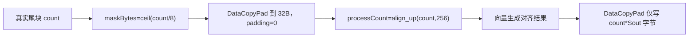

##### 8. stage 预取与输出队列设计

maskQueue 深度为 1；RANDOM_ALIASED 用它保存已经与 GM 解耦的完整 stage。
outputQueue 深度为 2，作为输出 LocalTensor 的资源配置。当前 Kernel 对每个
tile 按 `ComputeMask/ComputeConstant -> CopyOut` 顺序执行，不预取下一个
output tile。alias mask 的下一 stage 可能被当前 stage 的输出写回覆盖，
因此保持全局倒序和 stage 同步语义。

RANDOM_ALIASED 的调度模型为：

```text
MTE2:    一次 CopyIn 整段 packed mask
Barrier: 所有 core 完成 CopyIn 后执行一次 SyncAll
Vector:  在 maskLocal 上依次展开 tile k / tile k+1
MTE3:    逐 tile 从 outputQueue 取出并写回
```

当 tiling 选择单核短任务时没有全核 Barrier，执行
`MTE2(mask stage) -> Vector -> MTE3`；多核任务在 MTE2 后执行一次 stage Barrier，
两者都复用同一 outputQueue。

常量分支没有 MTE2 mask 阶段，每个 tile 按以下顺序执行：

```text
Vector:  ComputeConstant(tile k)
MTE3:    CopyOut(tile k)
```

RANDOM 只在每个 stage 的 mask 整段搬入后执行一次核间同步；队列和
scratch 都是有界 UB 资源，不增加 GM workspace。

##### 9. Kernel 总流程图

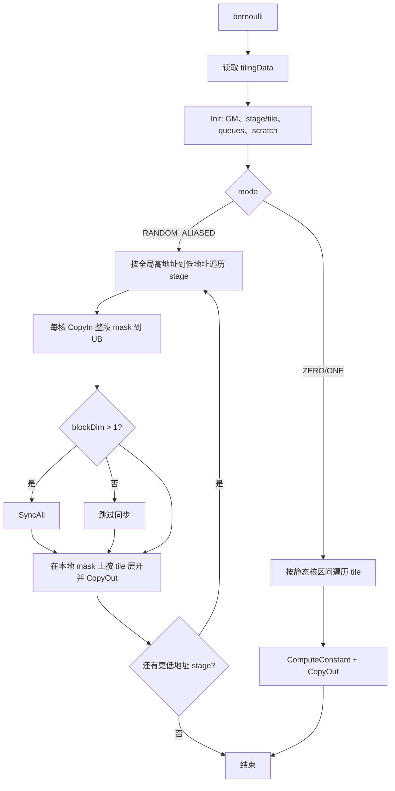

##### 10. 与原小算子流程差异

| 差异点 | 原实现 | 本设计 | 原因 |
|---|---|---|---|
| 随机源 | DSA packed mask | 保持 DSA packed mask | 保持随机协议和 seed/offset 语义 |
| 全 1 数据 | Fill 生成完整 Tensor | UB tile 内生成候选 1 | 消除全尺寸中间 Tensor |
| mask 应用 | DropoutDoMask 独立算子 | 私有 Kernel 内 `Select` | 合并读写和 executor 节点 |
| dtype 转换 | ACLNN 全尺寸 Cast | UB 内 dtype 专用生成 | 消除 Cast 中间结果 |
| p=0/1 | ZerosLike/OnesLike | 白名单走 AIV 常量 mode，其余保持原路径 | 同时规避 AI_CPU 和 AIV 固定开销 |
| workspace | 多个 shape 相关中间结果 | 固定 512-byte launcher workspace + `y_private` | 消除随 shape 增长的 workspace，不混淆 executor Tensor |
| 输出 view | ViewCopy | 保持 ViewCopy | 兼容非连续和公共 inplace 语义 |

#### 3.2.3 关键内存与性能方案

##### 1. 候选方案比较

| 方案 | 内存特征 | 随机兼容性 | dtype 扩展 | 性能与语义 | 结论 |
|---|---|---|---|---|---|
| A. `Fill + DropoutDoMask` 原地复用 | 保留至少一个全尺寸 Fill Tensor | 高 | 依赖原小算子 | 中 | 能改善但未彻底消除全尺寸临时量 |
| B. 全尺寸 output alias + 单 Kernel | RANDOM 的 HBM 仅 `y_private`（极小 Tensor 只保留 output 对齐余量） | 高 | 可按 dtype 专门生成 | 可控 | 采用 |
| C. 单 Kernel 内集成 RNG | 理论上可去掉 packed mask | 低，易改变随机序列 | 高 | 高 | 不采用 |

方案 B 相比任务书参考方案进一步删除 Fill Tensor，并以单核短任务调度消除
`SyncAll`，同时保持方案 A 的 DSA 随机协议。

##### 2. 新路径内存模型

内存模型分为 HBM/GM 逻辑分配和每核 UB 资源两部分，两者不能相加为同一个
“峰值内存”公式。

###### 2.1 HBM/GM 逻辑对象和生命周期

`BernoulliRandom/BernoulliConstant` 通过 `executor->AllocTensor` 申请 shape、dtype
与输出一致的私有结果 `y_private`，随后由 `ViewCopy` 写入用户 `out/selfRef`。
RANDOM 的 packed mask 是 `y_private` storage 的 UINT8 view；mask 在覆盖前只
存在于 DSA 输出区域和每核 UB。因此连续 RANDOM 路径为：

```text
M_random_hbm_logical ~= N * Sout                  // executor-owned y_private，先存 mask 再存最终值
                     + Mpad                       // N<16 时至多 (16-N)*Sout
                     + Madapt                     // 按场景出现的 Contiguous/ViewCopy 适配
                     + frameworkFixedOverhead
```

白名单 ZERO/ONE 的 HBM 逻辑对象为：

```text
M_aiv_endpoint_hbm_logical ~= N * Sout            // executor-owned y_private
                           + Madapt
                           + frameworkFixedOverhead
```

其他端点保留 `M_zeros_like_or_ones_like_result`。两类端点都不分配 DSA mask；
executor 按各分支结果的最后消费点管理生命周期。

用户原有 `self` 和目标 `out/selfRef` 存储不属于融合 Kernel 可消除的中间对象。
`Madapt` 对应非连续 view、inplace 和公共输出适配；`y_private` 作为 executor
私有结果，计算完成后由 ViewCopy 写入公共 `out/selfRef`。

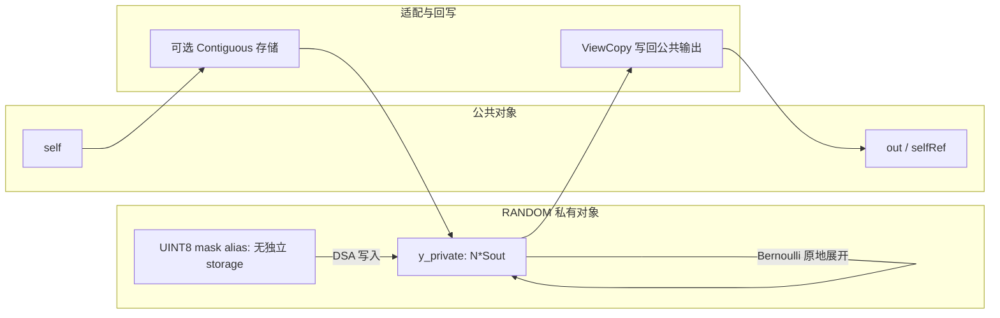

相对于原路径，新设计删除 Fill、DropoutDoMask、全尺寸 Cast 和独立
packed-mask storage，但不把私有输出 `y_private` 或极小 Tensor 的 output 对齐
余量从模型中隐去。alias 关系由同一个 `aclTensor` storage 上的
`CreateView + SetDataType(UINT8)` 明确定义，不依赖 allocator：mask 与
`y_private` 共享 storage，公共 `out/selfRef` 通过 ViewCopy 接收最终结果。

###### 2.2 每核 UB 编译期资源模型

UB 预算由 4.4.3 节的 queue/scratch 公式决定，其性质为：

```text
UB_per_core = depth-1 stage mask queue
            + depth-2 output queue
            + dtype-specific scratch
UB_total_budget = blockNum * UB_per_core
```

`UB_total_budget` 只用于证明每核 LocalMemory 不越界和 tile 大小有界，不是 HBM
分配，不得计入 GPU/NPU Device HBM 峰值比较。固定 launcher workspace 也不
意味着整个 ACLNN executor 没有 HBM 中间 Tensor。

##### 3. “融合 inplace”语义说明

任务书中的 inplace 融合目标是避免 `Fill` 结果和 `DropoutDoMask` 结果同时
物化。本设计实现两层不同的 inplace，并为短任务增加调度分支：

1. RANDOM 内部 storage inplace：packed mask 与 `y_private` 共享 storage，DSA
   写入后由 `Bernoulli` 原地展开；不区分大小申请不同 mask 对象。
2. 公共 API inplace：`aclnnInplaceBernoulli` 最终仍通过 `ViewCopy` 写回任意
   stride/storage offset 的 `selfRef`。

```text
原: independent mask + onesTensor -> DropoutDoMask -> castTensor -> final result
新: y_private storage(mask bytes) -> same storage(final dtype 0/1)
短: y_private storage(mask bytes) -> UB prefetch -> same storage(final dtype 0/1)
```

RANDOM 内部 inplace 存在 mask-read/output-write 覆盖依赖：单核短任务由整段
预取到 UB 解决，多核任务由“整段 mask 搬入 UB、全核同步、全局倒序 stage”解决。
私有 Kernel 不读取 `x`；公共 inplace API 仍通过 executor-owned 结果和
`ViewCopy` 写回 `selfRef`。这种分层避免把任意 stride/storage offset 的外部
Tensor 直接绑定为私有 AICore 输出。

##### 4. 随机一致性设计

随机一致性由以下不变量保证：

1. DSA op type 不变。
2. `count` 的 128 bit 对齐规则不变。
3. `dropout=1-p` 的概率转换不变。
4. seed 和 offset 原样传递。
5. mask bit 的线性顺序不变：第 `i` 个输出读取第 `i` 个 mask bit。
6. 只改变 bit 到目标 dtype 0/1 的展开方式。

端点概率继续使用原实现且不消耗随机序列，因此不会改变后续随机调用的序列位置。

上述不变量必须由“构造 mask + 原链路对拍”两层确定性验证支撑，统计均值只能
验证概率分布，不能发现 byte 内 LSB/MSB 顺序反转：

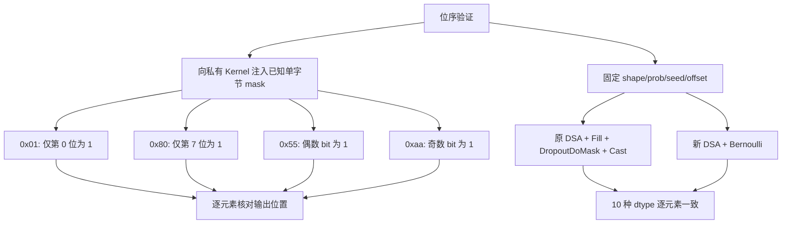

已知 mask 用例覆盖 byte 内位序；固定 seed/offset 与原完整链逐元素对拍覆盖 DSA
对齐、跨 byte、跨 tile 和多核起点。两类验证共同保证第 `i` 个输出始终消费第
`i` 个 mask bit。

##### 5. 性能设计

性能优化点：

1. 删除 Fill、DropoutDoMask 和全尺寸 Cast 的任务调度及 GM 往返。
2. packed mask 直接用向量 `Select` 展开，不使用逐元素 `GetValue/SetValue`。
3. 按 dtype 在 UB 内生成精确 0/1，避免公共图中的 Cast 节点。
4. 以 256 元素为共同分核/向量粒度，避免跨字节 mask 处理。
5. 按平台 core 数自适应 `blockDim`，小 Tensor 不强制占满所有 core。
6. 按 UB 和 dtype 自适应 stage/tile，避免宽 dtype 或 scratch 较大时溢出。
7. 每个 stage 先整体搬入 mask，再只执行一次 `SyncAll`；常见大 shape 每核完整
   mask 可一次放入 UB，从逐 tile 多次同步降为一次同步。
8. 不超过 16 KiB 的 alias mask 使用单核调度，预取到 UB 后跳过 `SyncAll`；更大
   mask 使用多核倒序 stage。
9. output depth-2 队列作为有界 UB 资源，每个 tile 按计算后写回的顺序执行。
10. p=0/1 按 dtype/value 选择 AIV 常量 mode 或原 ZerosLike/OnesLike，均不产生
   DSA 和 mask 读流量。

## 支持硬件

| 产品/架构 | 本设计定位 | 说明 |
|---|---|---|
| Atlas A2 / 910B 系列，DAV_2201 | 支持 | 使用私有 OpDef `ascend910b` 配置和 AIV Kernel |
| Atlas A3 / 910_93，DAV_2201 | 支持 | 复用 DAV_2201 的 `ascend910b` 配置和 AIV Kernel |
| Ascend 950，DAV_3510 | 不启用私有 Kernel | 公共 API 保持现有 StatelessBernoulli 路径 |
| 其他既有支持产品 | 不启用私有 Kernel | 不改变原有架构分流 |

私有 `Bernoulli` 的 OpDef 注册 `ascend910b` AICore 配置；其他架构沿用
公共 ACLNN 已有分流。任务要求的 CANN 版本为 8.5.0 及以上。

## 算子约束限制

| 项目 | 设计范围 |
|---|---|
| 优化接口 | Scalar-prob `aclnnBernoulli/aclnnInplaceBernoulli` |
| 非优化接口 | Tensor-prob 两组接口保持原实现 |
| 输出 dtype | BF16、FP16、FP32、DOUBLE、UINT8、INT8、INT16、INT32、INT64、BOOL |
| prob dtype | FP16、FP32、DOUBLE、BF16 |
| prob 范围 | `[0,1]` |
| rank | 0-8 |
| 空 Tensor | 公共 ACLNN 层直接返回 |
| 公共输入输出 | 支持非连续 Tensor，由 Contiguous/ViewCopy 适配 |
| 私有 Kernel format | OpDef 声明 ND、binary format-agnostic；Kernel 按物理连续扁平序列处理 |
| offset | 遵循公共接口 `offset % 4 == 0` 约束 |
| dynamic shape/rank | OpDef 开启 dynamic shape/rank，运行时 tiling |
| Kernel workspace | 固定 512 bytes，不随 shape/dtype 增长 |
| mask HBM | RANDOM 始终使用 output storage alias；极小 Tensor 只允许固定 output 对齐余量 |
| DOUBLE | 仅构造 0.0/1.0 位模式，不提供通用 FP64 计算能力 |

# 可维可测分析

## 精度标准/性能标准

| 验收标准 | 描述 | 标准来源 |
|---|---|---|
| 功能与精度标准 | 与 PyTorch Bernoulli 语义和原算子随机协议一致，满足 AscendOpTest 默认阈值 | 社区任务书 |
| 内存标准 | 同条件 NPU/GPU Device 峰值内存差距小于 5%，当前 alias 融合方案已达标 | 社区任务书 |
| 性能标准 | 优化后完整 ACLNN Device 任务链性能不低于原算子 | 社区任务书 |

### 特性交叉分析

#### 1. dtype 与私有 Kernel mode 交叉

RANDOM 覆盖全部 10 种 dtype；ZERO/ONE 仅对白名单组合进入公共任务链，其他
组合使用原端点算子。

| dtype 类别 | RANDOM | ZERO/ONE | 额外 UB | 全尺寸 Cast |
|---|---|---|---|---|
| FP32/FP16 | 原生 Select | 原生 Duplicate | 无 | 无 |
| INT32/INT16 | 位模式 Select | 原生 Duplicate | 无 | 无 |
| BF16 | `0x3f80` 位模式 Select | 位模式 Duplicate | 无 | 无 |
| INT8/UINT8/BOOL | half Select + UB Cast | packed byte Duplicate | half scratch | 无 |
| INT64 | FP32 Select + UB Cast | 32-bit word mask | FP32 scratch | 无 |
| DOUBLE | high-word Select + Gather | 32-bit word mask | packed/offset scratch | 无 |

#### 2. shape 与资源交叉

| shape 特征 | 设计处理 |
|---|---|
| rank 0 | 视为 1 个元素 |
| 含 0 维度 | 公共空 Tensor 快速返回 |
| 小于 256 元素 | 单 core、单 tile，UB 仍按 256 对齐计算 |
| `maskBytes <= 16 KiB` | RANDOM_ALIASED，blockDim=1，无全核同步，mask 在 UB 中展开 |
| `maskBytes > 16 KiB` | RANDOM_ALIASED，多核倒序 stage 原地展开 |
| 非 8 倍数 | maskBytes 向上取整，尾 bit 补 0 |
| 非 256 倍数 | processCount 对齐，CopyOut 裁剪 |
| 大 Tensor | 多 AIV 分核，每核继续按 UB tile 循环 |
| 元素数溢出 int64 | 公共层必须在分配前拒绝，Host tiling 再次防御 |

#### 3. view、inplace 与 mode 交叉

| 场景 | 输入适配 | 私有计算 | 输出适配 |
|---|---|---|---|
| 连续 out-of-place | Contiguous 可复用 | RANDOM 或白名单常量 mode | ViewCopy 可消除或直接复制 |
| 非连续 out-of-place | Contiguous | 同上 | ViewCopy 按目标 view 写入 |
| 连续 inplace | 保留公共 executor 语义 | 随机 Kernel 不读取 x 数据 | 写回 selfRef |
| 非连续 inplace | 连续化逻辑输入 | 随机 Kernel 不读取 x 数据 | ViewCopy 写回原 view |

#### 4. 架构与接口交叉

| API | DAV_2201 | DAV_3510 | 其他既有架构 |
|---|---|---|---|
| Scalar-prob | RANDOM 使用新 Kernel；ZERO/ONE 按白名单混合选路 | 原 StatelessBernoulli | 原 StatelessBernoulli |
| Tensor-prob | 原 StatelessBernoulli | 原 StatelessBernoulli | 原 StatelessBernoulli |

### 验证方法与判定口径

| 验收项 | 标准 | 设计口径 |
|---|---|---|
| 功能 | 对齐 PyTorch Bernoulli 语义和原算子随机协议 | 端点精确比对、已知 mask 位序、固定 seed/offset 原链对拍和统计检验 |
| dtype | 保持任务书支持范围 | 10 种输出 dtype 覆盖 RANDOM 并回归端点路径 |
| 内存 | 同条件 NPU/GPU Device 峰值差距 `<5%`，当前 alias 融合方案已达标 | 峰值覆盖完整 executor 生命周期 |
| 性能 | 不低于原算子 | 比较完整 ACLNN Device 任务链，包含 DSA 和必要的适配任务 |
| 兼容性 | 公共 ABI、Tensor-prob 和其他架构不变 | 接口、view/inplace 与架构分流回归 |

#### 1. 功能与精度验证

| 维度 | 场景 | 判定方式 |
|---|---|---|
| 概率路径 | p=0、p=1、多个 `0<p<1` | 端点逐元素精确；RANDOM 检查值域和概率分布 |
| dtype | 10 种输出 dtype | dtype、shape 和输出值域 `{0,1}` |
| rank/shape | rank 0-8、空 Tensor、小中大 shape | shape 保持、空路径和多核/多 tile 边界 |
| 对齐 | 1、7、8、31、32、127、128、255、256、257 等 | mask byte、128-bit DSA 和 256-element tile 边界 |
| view/inplace | 连续、非连续、out-of-place、inplace | Contiguous/ViewCopy 及写回语义 |
| RNG | 相同/不同 seed、offset，已知 mask 位型 | 可重复性、序列差异和 bit 顺序 |
| 异常 | 空指针、非法 dtype/format/rank/prob/offset/mode | 错误码与无 Device 任务 |

随机路径使用固定 seed/offset 与原 DSA 链逐元素对拍，并使用统计检查验证分布：

```text
sampleMean = sum(y) / N
sigma = sqrt(p * (1-p) / N)
abs(sampleMean - p) <= max(absFloor, 6 * sigma)
```

#### 2. 内存、性能与任务链验证

内存峰值按相同 shape、dtype、概率和 API 语义对比完整 Device 生命周期。
RANDOM 的 HBM 模型只保留 `y_private`、公共 `out/selfRef` 和必要的 view 适配；
packed mask 与 `y_private` 共享 storage，UB 不计入 Device HBM 峰值。

```text
gap = abs(peakNpu - peakGpu) / peakGpu
pass_memory = gap < 0.05
pass_performance = latencyOptimized <= latencyOriginal
```

性能比较以完整公共 `aclnnBernoulli` 为单位，新旧路径的 Device 任务如下：

| mode | 设计任务链 | 排除的中间任务 |
|---|---|---|
| RANDOM | DSA + `Bernoulli` | Fill、DropoutDoMask、全尺寸 Cast、AICPU fallback |
| ZERO 白名单 | `Bernoulli` | DSA、ZerosLike、DropoutDoMask |
| ZERO 非白名单 | 既有 ZerosLike | DSA、`Bernoulli`、DropoutDoMask |
| ONE 白名单 | `Bernoulli` | DSA、OnesLike、DropoutDoMask |
| ONE 非白名单 | 既有 OnesLike | DSA、`Bernoulli`、DropoutDoMask |

## 兼容性分析

| 兼容维度 | 设计保证 |
|---|---|
| 公共 ABI | 不新增或修改 aclnn 公共函数签名 |
| 公共语义 | shape/dtype/view/inplace 行为由原 ACLNN 框架保持 |
| RNG | 保留 DSA、概率转换、seed、offset；已知 mask 和原链对拍约束 bit 顺序 |
| Tensor-prob | 不修改实现路径 |
| 非 910B | 不注册或调用私有 Kernel |
| dtype | 10 种 dtype 的 RANDOM 由私有 Kernel 生成；端点按明确白名单混合选路 |
| 动态 shape | 运行时 tiling，不依赖固定 shape |
| 安装 | 运行时唯一 op type 为 `Bernoulli`；不使用带前后缀的名称别名 |

### 可维护性分析

职责拆分如下：

```text
公共 ACLNN         : 参数和架构/概率模式分流
DSA L0             : 随机 mask 生成
Bernoulli 私有 L0  : output alias、DSA、mode 和 launcher 组织
Host tiling        : shape/core/UB stage/tile 资源规划
Kernel             : 同步安全的原地展开和 dtype 专用 0/1 构造
验证基础设施       : 正确性、完整任务链、性能和内存对比
```

维护原则：

1. 新 dtype 先补 OpDef、binary config、tiling storage/scratch 预算，再补 Kernel，
   三者必须同步。
2. 新 mode 优先作为运行时 attr，不无控制地增加 tilingKey 和二进制数量。
3. 任何 UB scratch 变化必须同步修改 Host 预算公式。
4. 任何 mask 对齐变化必须同时检查 DSA count、stageStart 和尾块 CopyIn。
5. 内存优化结论以对象生命周期和峰值测量为准，不能只看 workspace。
6. 性能结论以完整 ACLNN 任务链为准，不能只看私有 Kernel。

### 稳定性设计

| 设计边界 | 影响 | 实现防护 |
|---|---|---|
| output alias 不足 DSA 最小 block | 极小 Tensor 创建 alias 失败或越界 | 用 padded output storage 保证最小 128-bit 覆盖，不创建独立 mask |
| DOUBLE Gather offset 错误 | 位模式交织错误 | 覆盖首尾、单双元素、非对齐和多 tile 用例 |
| stage/output UB 预算遗漏 | 编译或运行时 UB 越界 | 预算公式与所有 TQue/TBuf 一一对应 |
| stage 过小导致同步次数增加 | 大 shape 性能回退 | 优先保留约 128 KiB compute 空间，其余 UB 最大化 stage |
| mask bit 顺序反转 | 统计分布正确但逐元素随机序列错误 | 已知 mask 四种位型和固定 seed/offset 原链对拍 |
| `prob` 越界或 `offset` 非法 | 概率分流或随机序列错误 | ACLNN 在构造 executor 前执行 `CheckProb` 和 `CheckOffset` |
| Host shape 乘积超出 `int64_t` | Kernel 分核或地址计算回绕 | Host tiling 逐维执行安全乘法并返回失败 |
| 端点白名单漂移 | 引入 AI_CPU 回退或不必要的 AIV 固定开销 | 路由表与 profile 任务链断言使用同一组合矩阵 |
