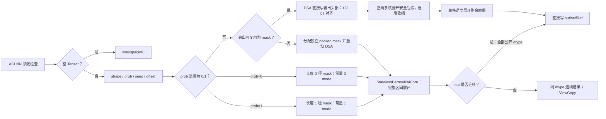

# aclnnBernoulli 算子内存优化设计文档

> 适用版本：CANN 8.5.0 及以上
> 目标硬件：Atlas A2/A3（`ascend910b`、`ascend910_93`）
> 开发语言：Ascend C/C++
> 交付代码：`ops-math/experimental/random/stateless_bernoulli`
> 公开接口：`aclnnBernoulli`、`aclnnInplaceBernoulli`

# 需求背景（required）

## 需求来源

当前 Atlas A2/A3 上的标量概率 Bernoulli 路径由多个小算子拼接：

```text
DSAGenBitMask -> Fill(all ones) -> DropoutDoMask -> Cast -> ViewCopy
```

`Fill` 和 `DropoutDoMask` 都会物化与输出元素数 $N$ 同阶的 Tensor，导致
`Tensor.bernoulli_` 相对 GPU 存在明显峰值内存差距。任务要求：

1. 消除 `Fill + DropoutDoMask` 的 N 规模冗余中间结果。
2. 相同测量口径下，NPU 与 GPU 峰值内存差距小于 5%。
3. 保持 `torch.bernoulli`/`Tensor.bernoulli_` 的 0/1 采样语义。
4. 精度满足 AscendOpTest 默认标准，热启动性能不低于原路径。
5. 支持空 Tensor、rank 0～8、非连续 Tensor、边界概率和全部公开 dtype。

## 原设计修订说明

初版设计拟在 A2/A3 kernel 内重新实现 Philox 随机数生成。继续核对仓库后发现：

- A2/A3 当前稳定路径由 DSA 生成 bit mask，随机序列能力已经存在。
- 仓库中的 Philox/SIMT `StatelessBernoulli` 是 Ascend 950 arch35 实现，不能
  直接作为 A2/A3 实现复用。
- 重新实现 RNG 会扩大随机一致性、确定性和性能风险，并非完成本任务所必需。
- 仓库已有 `SignBitsUnpack` 证明 A2 的 `Select` 能高效展开压缩 bit mask。

因此实际实现修订为：对 $0<prob<1$ 保留 `DSAGenBitMask`，新增一个可按
工作区间多次启动的 AICore kernel，把 bit mask 直接展开为目标 0/1；删除
`Fill` 和 `DropoutDoMask`。最终提交 `a5a6d0985` 进一步让 DSA 在满足条件的
连续主路径中直接把 packed mask 写入输出存储头部，再以“安全后缀多核正向 +
剩余前缀单核逆向”的顺序分段展开，消除独立 N/8 mask GM 分配。
`prob=0/1` 不启动 DSA，由同一 AICore kernel 分别生成常量 0/1。该方案不改变
常规概率的 DSA 随机序列，并避免 DSA 在 `dropout=1` 边界上的设备异常。

## 公开接口契约

| 参数 | 含义 | dtype/约束 |
| --- | --- | --- |
| self | 提供输出 shape、dtype 和格式，数据内容不参与采样 | FLOAT16、FLOAT、DOUBLE、UINT8、INT8、INT16、INT32、INT64、BOOL、BFLOAT16；rank 0～8；允许空和非连续 |
| prob | 输出为 1 的概率 | FLOAT16、FLOAT、DOUBLE、BFLOAT16；有限值且 $0 \le prob \le 1$ |
| seed | 无状态随机种子 | INT64 |
| offset | 无状态随机偏移 | INT64；`offset % 4 == 0` |
| out | 0/1 输出 | shape、dtype 与 self 相同；允许空和非连续 |
| workspaceSize | Device workspace 大小 | 非空指针 |
| executor | 两段式执行器 | 非空指针 |

本社区任务只修改标量概率接口。Tensor 概率接口继续由稳定目录的既有实现提供。

# 需求分析（required）

## 功能与兼容性要求

1. 输出 shape/dtype 与 self 一致，值域严格为 0/1。
2. 相同 seed、offset、shape、prob 和 dtype 重复执行结果一致。
3. `prob=0` 全 0，`prob=1` 全 1。
4. 非法 prob、非法 offset、dtype/shape 不一致、rank 大于 8、私有格式失败。
5. 空 Tensor 不启动 DSA/AICore kernel，workspace 为 0。
6. 非连续 self 不做无意义的 Contiguous，因为其内容不读取。
7. 非连续 out 通过连续临时结果和 ViewCopy 写回；DOUBLE 使用保持
   shape/stride/offset 的 INT64 等宽位视图兼容 ViewCopy。
8. 稳定目录的 Ascend 950 arch35/SIMT 代码不修改。

## 方案选择

### 采用方案：输出头部 DSA mask + 分段融合解包 kernel



### 未采用方案

| 方案 | 未采用原因 |
| --- | --- |
| A2/A3 重新实现 Philox RNG | 改变现有 DSA 随机路径，开发和一致性风险大 |
| 继续使用 Fill 后原地 DropoutDoMask | 仍需物化一份 N 规模全 1 Tensor |
| 所有 dtype 统一输出 FP32 后 Cast | 对 FP16/BF16 产生不必要的 N×4 Byte 临时内存 |
| GM 中生成 FP16/FP32 后公共 Cast | 整数/DOUBLE 仍保留 N 规模中间 Tensor，无法满足全 dtype 内存目标 |

# 详细设计（required）

## 内部算子与执行链

experimental 包中注册的内部 `StatelessBernoulli` 使用
`shape(INT64) + mask(UINT8) -> y(公开的 10 种 dtype)`。十组 dtype、
Format、UnknownShapeFormat 列表按索引一一对齐。AICore 同时注册
`ascend910b` 和 `ascend910_93`。

mask storage 长度同时编码内部执行模式：0 Byte 表示全 0，1 Byte 表示全 1，
其余长度表示 DSA 随机 mask。0/1 Byte 仅由 ACLNN 边界概率路径构造，不改变
公开接口。

令 $N$ 为输出元素数，DSA mask 大小为：

$$
N_{dsa}=alignUp(N,128),\qquad M_{mask}=N_{dsa}/8
$$

当 out 同时满足以下条件时，ACLNN 层为 `M_mask` Byte 创建 UINT8 视图，
将其 storage address 指向 out 的 storage address，并调用
`DSAGenBitMaskExperimentalToOutput`：

1. out 连续；
2. view offset 和 storage offset 均为 0；
3. storage address 有效；
4. `N*sizeof(out_dtype) >= M_mask`。

此时 mask Tensor 与输出头部别名，不从 executor workspace 另行分配
`M_mask`。不满足条件时调用 `DSAGenBitMaskExperimental` 分配独立 mask，
作为非连续、带 offset 等通用场景的兼容 fallback。

常规概率的 DSA dropout 参数沿用稳定实现 `dropout=1-prob`。第 $i$ 个输出
读取 little-endian bit：

$$
out_i=(mask[i/8]>>(i\bmod8))\&1
$$

### dtype 路由

| 公开 out dtype | kernel dtype | 连续 out 直写 |
| --- | --- | --- |
| FLOAT16、FLOAT、DOUBLE、UINT8、INT8、INT16、INT32、INT64、BOOL、BFLOAT16 | 与 out 相同 | 是 |

DAV220 的 `Select` 数据操作数使用 FP16/FP32，selector 使用 UINT8 mask。
FLOAT16/FLOAT 直接在最终输出 LocalTensor 上生成 0/1；除 DOUBLE 外的其余
dtype 先在 UB 中展开成 FP16 0/1，再完成片上 Cast。DOUBLE 直接读取 mask
bit 并构造 IEEE 754 `0.0/1.0` 位模式。self 数据不读取，因此非连续 self
不做 Contiguous；非连续 out 使用同 dtype 连续临时结果和 ViewCopy。由于
A2/A3 ViewCopy 不注册 DOUBLE，DOUBLE 源和目标先各自创建保持 view shape、
storage shape、stride、offset 的 INT64 等宽位视图，再执行 ViewCopy；这只是
逐元素 8 Byte 位拷贝，不做数值转换。

## Infershape 与 Tiling

shape Tensor 长度决定输出 rank（0～8），value 可用时设置精确维度，不可用时
设置对应数量的 `-1`；负维和 rank 大于 8 失败。

内部 Op 具有 `reverse_tiles`、`start_element`、`element_count` 三个可选
属性。普通独立 mask 路径使用 `(false, 0, -1)`，即处理完整输出；输出别名
路径由 ACLNN 层按当前存活 mask 范围生成多个子区间。`start_element`
必须按 8 元素对齐，区间必须完全位于完整输出范围内。

令 $N_{range}$ 为当前子区间元素数。正向区间的分核和 tile 均按 256
元素对齐，确保 mask offset 是完整 byte：

$$
blockFactor=alignUp(\lceil N_{range}/coreNum\rceil,256)
$$

$$
usedCoreNum=\lceil N_{range}/blockFactor\rceil
$$

输出别名展开维护未处理元素数 `remaining`。每轮根据
`ceil(remaining/8)` 个仍存活 mask byte 计算第一个安全输出元素，并向上对齐到
256；若该位置小于 `remaining`，先以正向多核方式展开安全后缀
`[safe, remaining)`，再令 `remaining=safe`。不能继续切分时，对
`[0, remaining)` 使用 `reverse_tiles=true`；该区间固定单核，并按 tile
从尾到头执行，保证任何 GM 输出写入都不会破坏尚未搬入 UB 的 mask。

UB 使用双缓冲 mask/output queue；FLOAT16/FLOAT 直接复用 output queue
执行 Select，除 DOUBLE 外的其余类型使用 FP16 展开 buffer；DOUBLE 直接
读取 mask bit。INT64 使用 FP16/INT32 中间 buffer，BF16 使用 FP16/FP32
中间 buffer。预留 16 KiB 后
按字节类型 7、FP16 7、INT16 9、FLOAT/INT32 13、BF16 13、
DOUBLE 19、INT64 25 Byte/元素保守计算 tileLength。这里的 workspace 为
AICore kernel workspace，值为 0；ACLNN executor/框架 allocator 的固定小块
开销需由同口径峰值脚本单独观测，不能与 kernel workspace 混为一谈。

host tiling 根据 mask storage 长度下发 RANDOM/ZERO/ONE `maskMode`。dtype
已由包内 `simplifiedKey` 选择对应的独立静态二进制；每个二进制只包含函数
入口 `_0`，所以运行时统一下发 `TilingKey=0`，不能把 dtype 枚举当作函数
入口。

## Kernel

每核按 `startElement + blockIdx*blockFactor` 定位输出和对应
`elementOffset/8` mask。正向区间按 tile 从头到尾执行；最终别名前缀按 tile
从尾到头执行。每个 tile 都先把所需 mask byte 搬入 UB，再写对应输出，因此
允许 mask 与输出头部共享同一 GM 地址。每个 tile：

1. RANDOM mode 搬入 `ceil(valid/8)` 个 mask byte；ZERO/ONE mode 在 UB 中
   用 UINT16 Duplicate 生成全 0/全 1 packed mask，不访问 DSA mask GM。
2. 用 selector 为 UINT8 mask 的 `Select<half, uint8_t>` 或
   `Select<float, uint8_t>` 在 UB 中生成 0/1。
3. FLOAT16/FLOAT 直接写出，其余非 DOUBLE 类型使用片上 Cast 链；
   DOUBLE 直接读取 mask bit 并写 IEEE 754 `0.0/1.0` 位模式。
4. DataCopyPad 只搬出 `valid*sizeof(T)`，不写 DSA padding。

## 内存分析

原链路：

$$
M_{old,extra}\approx M_{mask}+M_{fill}+M_{doMask}+M_{cast}
$$

满足输出别名条件的连续主路径中，packed mask 位于已分配输出的头部，不形成
额外 GM 分配：

$$
M_{new,extra,alias}\approx M_{meta}
$$

其中 `M_meta` 是 ACLNN executor/框架 allocator 的固定小块开销。真机固定
shape 测得 NPU 相对 GPU 的峰值增量恒定多 2,048 Byte，不能把这 2,048 Byte
解释为 `M_mask`。不满足别名条件时：

$$
M_{new,extra,fallback}\approx M_{mask}+M_{meta}
$$

所有目标 dtype 转换都在 UB 内完成，不产生 N 规模 GM Cast Tensor。非连续
out 还需同 dtype 连续临时结果，必须与连续主验收数据分开统计。最终 5% 指标
以固定口径真机数据为准，不能以理论估算代替。

`prob=0/1` 的连续路径不分配 DSA mask，其额外 Device 空间只剩 ACLNN
executor 元数据；A2 真机 `N=65536` 时两者 workspace 均为 512 Byte。

## SoC 隔离

| SoC | 路径 |
| --- | --- |
| ascend910b / A2 | experimental 扁平目录 DSA-to-output 别名 + 分段 mask 解包；不满足条件时独立 mask fallback |
| ascend910_93 / A3 | 复用同一套扁平目录 tiling/kernel 代码路径 |
| ascend950 | 稳定目录原 arch35/SIMT Philox，不修改 |

## 代码目录结构

```text
experimental/random/stateless_bernoulli/
├── op_host/
│   ├── stateless_bernoulli_def.cpp
│   ├── stateless_bernoulli_infershape.cpp
│   └── stateless_bernoulli_tiling.cpp
└── op_kernel/
    ├── stateless_bernoulli.cpp
    ├── stateless_bernoulli.h
    ├── stateless_bernoulli_tiling_data.h
    └── stateless_bernoulli_tiling_key.h
```

`CMakeLists.txt` 使用构建框架对 `op_host/*_tiling*.cpp` 的默认发现逻辑，
不配置 `TILING_DIR`。这只调整代码组织和构建发现路径，不改变 A2/A3 的
执行逻辑，也不触碰稳定目录中的 Ascend 950 arch35/SIMT 实现。

# 可维可测分析

## 测试范围

- UT：动态/标量/rank9 infershape；mask 过短和 byte 对齐 tiling；安全子区间、
  逆序单核 tiling 和输出头部别名展开；13 元素尾块；
  prob/offset/dtype/shape/rank/空 Tensor 参数检查。
- 功能：全部公开 dtype、四种 prob dtype、prob 0/1/0.5/边界、rank 0～8、
  空/大 shape、连续/非连续、原位/非原位。
- 确定性：相同 seed/offset 重复结果一致。
- 统计：

$$
|\hat p-p|\le6\sqrt{p(1-p)/N}+1/N
$$

其中 $p$ 是 `aclScalar` 按其 dtype 量化后的有效值，而不是命令行传入的
高精度字面量。例如 BF16 的 `0.999` 按 RNE 量化为 `1.0`，应严格输出全 1；
BF16 接近 1 且仍保持随机的边界用例使用 `0.99609375`。

- 路由：输出别名主路径只保留一次
  `DSAGenBitMaskExperimentalToOutput` 和若干次同类型
  `StatelessBernoulliAiCore` 分段任务，不得出现 N 规模
  Fill/DropoutDoMask/Cast 或 AICPU。分段任务次数由 shape 和 dtype 决定，
  不能把多次 `StatelessBernoulliAiCore` 误判为旧拼接回退。
- 内存：固定 shape/dtype/prob/seed、warmup、同步点，比较峰值增量：

$$
gap=|M_{NPU}-M_{GPU}|/M_{GPU}<5\%
$$

- 性能：热启动同条件比较：

$$
speedup=baseline\_us/optimized\_us
$$

## 真机验证结果（2026-07-26）

最终实现提交为 `a5a6d0985b5336586caa992e34d3e1b74e586b9a`。NPU 验证环境为
CANN Runtime 9.1.0、Driver 25.5.1、Ascend 910B3，实际运行使用
`ascend910b`；GPU 标杆环境为 Tesla V100-SXM2-32GB、CUDA 12.4、
PyTorch 2.6.0+cu124。

最终 A2/A3 软件包均基于上述提交：ascend910b 包 SHA-256 为
`e2f9ee371224573ddf49ec7abf67142a9c28598ee093c15cc62f189eb4ebb8c5`，
已安装并完成 A2 真机运行；ascend910_93 包 SHA-256 为
`7317965c4bc7a8c56201f4146b27b81a23ca4727ffcd440356efcc123270e4c0`，
已完成 10 个目标文件和元数据的交叉编译，但未宣称 A3 真机通过。包文件和
哈希复核见交付件
`tmp/aclnnBernoulli交付件/04_任务书要求的其他交付件/aclnnBernoulli软件包与测试证据索引.md`。

此前功能修复阶段完成的全 dtype、prob dtype、边界、布局、随机状态和非法
参数结果保留在 `tests/自测报告.md`。最终输出别名包又以全部 10 种公开 dtype
完成 `4096×4096, prob=0.5, seed=20260725` 真机运行，各 dtype 均满足逻辑
hash 一致、确定性和统计阈值。新增安全子区间、逆序 tiling 和别名展开 UT
已在最终分段提交上执行，Host UT 13/13、ACLNN API UT 12/12；最终状态及
原始日志以交付件中的最新构建和真机证据为准。

### 最终实现与系统原路径同机性能

系统 `libopapi.so` 与最终任务目录 `libcust_opapi.so` 使用同一份验收程序，
在同一 NPU、原位、shape `4096×4096`、`prob=0.5`、seed `20260725`、
warmup 10、迭代 50 次的条件下得到：

| dtype | 系统 workspace (B) | 最终 workspace (B) | 系统/最终执行+同步中位数 (µs) | 改善 |
| --- | ---: | ---: | ---: | ---: |
| FP16 | 35,652,608 | 1,024 | 289.970 / 272.145 | 6.15% |
| FP32 | 69,207,040 | 1,024 | 336.930 / 320.555 | 4.86% |
| FP64 | 69,207,552 | 1,024 | 34,831.700 / 7,304.820 | 79.03% |
| UINT8 | 69,207,552 | 1,024 | 296.285 / 222.985 | 24.74% |
| INT8 | 69,207,552 | 1,024 | 295.110 / 231.780 | 21.46% |
| INT16 | 69,207,552 | 1,024 | 301.130 / 276.930 | 8.04% |
| INT32 | 69,207,552 | 1,024 | 331.870 / 303.550 | 8.53% |
| INT64 | 69,207,552 | 1,024 | 356.005 / 314.635 | 11.62% |
| BOOL | 69,207,552 | 1,024 | 269.150 / 229.045 | 14.90% |
| BF16 | 35,652,608 | 1,024 | 291.920 / 281.645 | 3.52% |

10/10 dtype 的最终执行+同步中位数均不高于系统原路径。该表来自交付件
`tmp/aclnnBernoulli交付件/04_任务书要求的其他交付件/05_测试证据/final_alias_performance_summary.json`。
输出别名最终 profiler 在 `N=1,048,576, FP32` 下显示
`DSAGenBitMaskExperimentalToOutput` 后跟 4 个
`StatelessBernoulli` 安全分段任务，未出现 Fill、DropOutDoMask、GM Cast 或
AICPU；原始导出位于交付件
`tmp/aclnnBernoulli交付件/04_任务书要求的其他交付件/05_测试证据/profiler/final_alias_inplace_fp32/`。

### NPU/GPU 同口径峰值内存

两端均使用仓内 `benchmark_bernoulli.py`，在独立进程中按
`max_memory_allocated - baseline_memory` 采集 allocator 峰值增量。固定条件
为原位 `Tensor.bernoulli_`、shape `4096×4096`、`prob=0.5`、seed
`20260725`、warmup 10、迭代 50 次：

| dtype | GPU 峰值增量 (B) | NPU 峰值增量 (B) | 绝对差值 (B) | 差异率 | 结果 |
| --- | ---: | ---: | ---: | ---: | --- |
| FP16 | 33,554,432 | 33,556,480 | 2,048 | 0.006104% | PASS |
| FP32 | 67,108,864 | 67,110,912 | 2,048 | 0.003052% | PASS |
| FP64 | 134,217,728 | 134,219,776 | 2,048 | 0.001526% | PASS |
| UINT8 | 16,777,216 | 16,779,264 | 2,048 | 0.012207% | PASS |
| INT8 | 16,777,216 | 16,779,264 | 2,048 | 0.012207% | PASS |
| INT16 | 33,554,432 | 33,556,480 | 2,048 | 0.006104% | PASS |
| INT32 | 67,108,864 | 67,110,912 | 2,048 | 0.003052% | PASS |
| INT64 | 134,217,728 | 134,219,776 | 2,048 | 0.001526% | PASS |
| BOOL | 16,777,216 | 16,779,264 | 2,048 | 0.012207% | PASS |
| BF16 | 33,554,432 | 33,556,480 | 2,048 | 0.006104% | PASS |

NPU 每项只比 GPU 多 2,048 Byte，10 种 dtype 的差异率为
0.001526%～0.012207%，最大差异 0.012207%，全部严格小于 5%。两端硬件架构
不同，因此 JSON 中的跨硬件延迟只作为原始记录，不用于 `<5%` 内存指标判定。
原始 GPU/NPU JSON、环境、NPU 日志、逐项比较结果及汇总文件位于交付件
`tmp/aclnnBernoulli交付件/04_任务书要求的其他交付件/05_测试证据/npu_gpu_benchmark_4096x4096/`。

## 风险控制

| 风险 | 措施 |
| --- | --- |
| mask bit 顺序 | little-endian golden + kernel UT |
| 分核 byte 错位 | blockFactor/tileLength 对齐 256 |
| 输出写入提前覆盖仍存活的别名 mask | 只正向处理 mask 之后的安全后缀；不能继续切分的前缀固定单核并按 tile 逆序处理 |
| 不满足输出别名约束却强行复用 | ACLNN 层同时检查连续性、view/storage offset、storage address 和容量；不满足时回退独立 mask |
| 子区间越界或 mask byte 错位 | host 校验 `start_element` 8 元素对齐及 `[start, start+count)` 完全位于输出范围 |
| 尾块越界 | outputSize 控制 Select/DataCopyPad |
| DAV220 不支持 UINT8 数据操作数的 Duplicate/Select | selector 保持 UINT8，数据操作数改为 FP16/FP32，并在 UB 内 Cast |
| BF16/INT64 Cast 能力差异 | 复用仓内 Cast kernel 已验证的片上 Cast 链 |
| A2/A3 无 FP64 向量计算且 AICore 禁止标量 half 运算 | DOUBLE 直接读取 UINT8 mask bit，使用整数标量构造 IEEE 754 位模式 |
| FP64 非连续输出在 GetWorkspaceSize 阶段失败 | DOUBLE 通过保持完整 storage 元数据的 INT64 等宽位视图调用 ViewCopy |
| 非连续错位 | 仅连续 out 直写，其余 ViewCopy，并校验 storage gap |
| 设备运行时初始化瞬态故障污染用例结果 | 只在无 `RESULT_JSON` 且同时匹配 `aclrtSetDevice`、507033/E39007、TsdOpen/HDC timeout 时有限重试，保留每次 attempt；真实精度失败不重试 |
| A5 回归 | 不修改稳定 arch35 |
| 虚假性能结论 | 只记录真机 JSON、日志和 msprof 数据 |

## 构建命令

```bash
bash build.sh --pkg --experimental --soc=ascend910b \
  --ops=stateless_bernoulli --vendor_name=custom -j16
bash build.sh --pkg --experimental --soc=ascend910_93 \
  --ops=stateless_bernoulli --vendor_name=custom -j16
bash build.sh --experimental -u --ops=stateless_bernoulli --soc=ascend910b
```

真机统计、内存和性能脚本位于 `tests/st`，执行方法见 `tests/README.md`。

## 交付检查

- [x] A2/A3 CMake、OpDef、infershape、tiling、kernel、L0、ACLNN。
- [x] 全部公开 dtype 连续输出直写，满足条件时 packed mask 复用输出头部，
  dtype 转换仅占 UB。
- [x] 公开 dtype、空 Tensor、非连续输出兼容路由。
- [x] offset、prob、dtype、shape、rank 参数检查。
- [x] host mask 合约脚本及输出别名、逆序、子区间 UT 源码。
- [x] 最终提交 `a5a6d0985` 完成 ascend910b 全部 10 种 dtype 内核和算子包
  编译、安装及真机执行。
- [x] 最终提交 `a5a6d0985` 完成 ascend910_93 全部 10 种 dtype 内核和算子包
  交叉编译及包内容校验。
- [x] 非连续 FP64 原位/非原位与 BF16 概率量化边界定向真机回归。
- [x] Semantic 设备初始化瞬态故障四例定向复测 4/4，严格重试与负向拒绝
  判定完成自测。
- [ ] kernel CPU 仿真执行器链接（当前环境缺少 `libpem_davinci`，kernel
  源码及用例共享库已编译）。
- [x] A2 真机全 dtype、统计、边界、布局、确定性和非法参数验收。
- [x] A2 最终输出别名 msprof 路由验收和 10 dtype 系统原实现同机性能对比。
- [x] A2 最终 workspace 为 1,024 Byte，10 dtype 均低于系统原路径。
- [ ] A3 真机执行（最终包已完成交叉编译，当前只有 Ascend 910B3）。
- [x] NPU/GPU 10 dtype 同口径峰值内存差距全部 `<5%`，最大 0.012207%。

未完成项须在具备相应 CANN 组件或 A3 的环境中以最终提交和原始数据完成。
