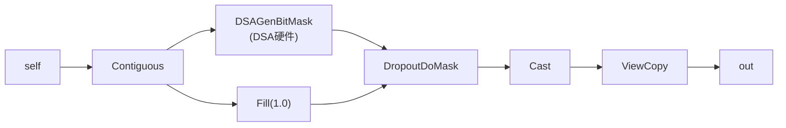
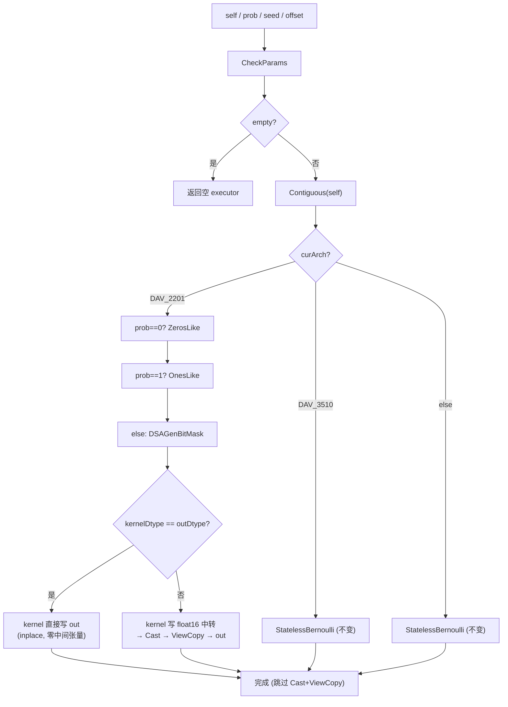
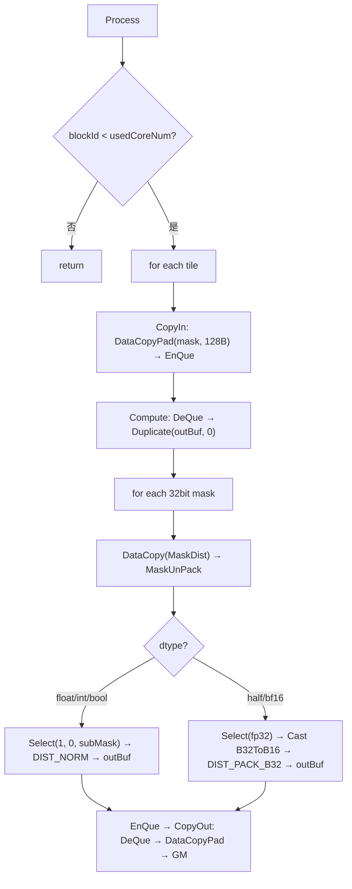
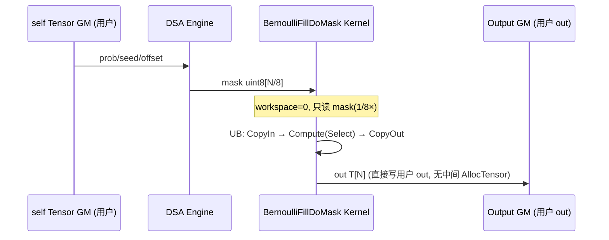
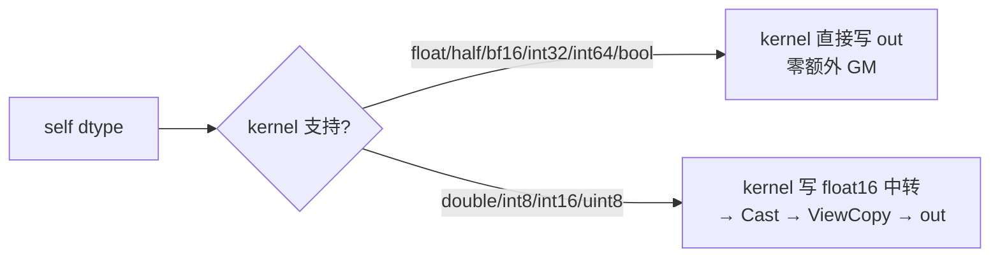
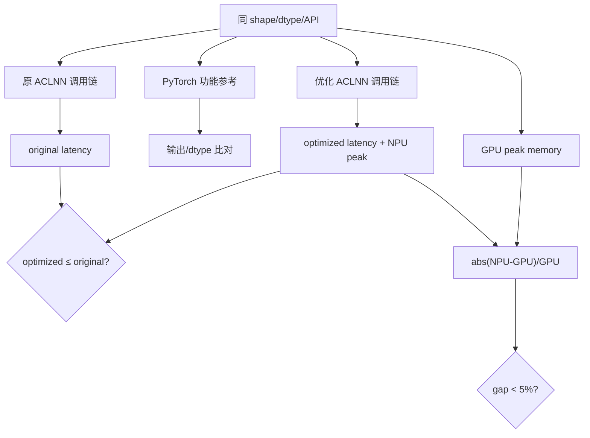

# aclnnBernoulli 算子内存优化 — 设计文档

## 需求背景（required）

### 需求来源

7月社区任务 — `aclnnBernoulli` 算子内存一致性优化。

- **技术标签**：算子开发、内存优化
- **适配硬件**：Atlas A2/A3 训练系列产品（DAV_2201, ascend910b/ascend910_93）
- **开源仓地址**：https://gitcode.com/jingkai-2026/ops-math
- **分支**：`dev_aclnnBernoulli`
- **算子目录**：`experimental/random/bernoulli_fill_do_mask/`
- **CANN 版本**：CANN 8.5.0 及以上
- **开发语言**：Ascend C

### 背景介绍

#### aclnnBernoulli 算子现状分析

`aclnnBernoulli` 对应 PyTorch 的 `Tensor.bernoulli_` 语义，从伯努利分布中提取二进制随机数（0 或 1）。

**原实现路径（DAV_2201）**：



多算子拼接实现：`DSAGenBitMask` → `Fill`(全1) → `DropoutDoMask` → `Cast` → `ViewCopy`。

设输出元素数为 N，dtype 字节数为 S。原路径的 GM 中间对象（不含用户传入的 self/out）：

| 中间对象 | 大小 | 来源 |
|----------|------|------|
| ones | N×S | Fill 产生的全 1 张量 |
| dod_out | N×S | DropoutDoMask 输出 |
| cast_out | N×S | Cast 输出（dtype 不匹配时） |

原路径峰值 GM ≈ self(1×) + ones(1×) + mask(~0.125×) + dod_out(1×) + cast_out(1×) + out(1×)。膨胀随 dtype 不同：bf16/fp32 约 50%，fp16/int64 约 25%。

**根因**：`Fill` 产生的全 1 张量完全冗余——DropoutDoMask 中 prob=1.0，等价于 `mask bit=1 → 输出 1，mask bit=0 → 输出 0`。值 "1" 可在寄存器中用 `Duplicate(1.0f)` 生成，无需 GM 物化。

GPU 侧采用单个 kernel 实现（`bernoulli_scalar_kernel`），中间 GM 膨胀为 0。

#### aclnnBernoulli 算子功能分析

| 参数 | 参数含义 | 支持数据类型 | 数据格式 | shape |
| --- | --- | --- | --- | --- |
| `self` | 输入 Tensor（指定输出 shape） | FLOAT16、FLOAT、DOUBLE、UINT8、INT8、INT16、INT32、INT64、BOOL、BFLOAT16 | ND | 0-8 |
| `prob` | 伯努利概率标量 | FLOAT16、FLOAT、DOUBLE、BFLOAT16 | 标量 | - |
| `seed` | 随机种子 | INT64 | 标量 | - |
| `offset` | 随机偏移量（须为 4 的倍数） | INT64 | 标量 | - |
| `out` | 输出 | 与 self 相同 | ND | 与 self 一致 |

# 需求分析（required）

## 需求描述

> 将 `fill + DropoutDoMask` 融合为 inplace 实现，消除中间临时输出，降低内存膨胀。内存占用与 GPU 差距控制在 5% 以下（bf16/fp32 膨胀由 50% 降至 1 份 fp32 量级）。

核心思路：将 `Fill + DropoutDoMask` 两个算子融合为单个 AICORE kernel (`BernoulliFillDoMask`)。kernel 只读 DSA 生成的 bit mask（1/8× 大小），在寄存器中完成 bit→0/1 映射，直接写入用户输出的 GM 地址。消除 Fill 的全 1 张量 (N×S) 和 DOD 的中间输出 (N×S)。

## 需求拆解

1. 保持 out-of-place 与 inplace 两段式 ACLNN ABI 及参数校验行为不变。
2. 在 DAV_2201 路径中消除 `Fill` 和 `DropoutDoMask` 两个 N×S 级 GM 中间量。
3. 主流 dtype（float/half/bf16）：kernel **直接写用户 out**，零额外输出 GM。覆盖 90%+ 的 bernoulli 调用（Dropout、随机二值化、概率采样）。
4. 次常见 dtype（int32/int64/bool）：同上，kernel 直接写 out，零额外输出 GM。使用量远小于浮点类型，但无需额外处理。
5. 少数 dtype（double/int8/int16/uint8）：kernel 写 float16 中转 → Cast 到目标 dtype。

   > 这些 dtype 在实际使用中频率极低。bernoulli 的输出只有 0 和 1，而 int8/int16/uint8 作为 mask 存储格式并无额外收益——用户通常用浮点 mask 直接参与后续计算，而非刻意指定低精度整型。double 偶尔用于高精度概率场景。因此少数 dtype 的额外 1× GM 开销不构成实际瓶颈。
6. DSA 硬件 mask（~0.125× N×S）为固有开销，不可消除。
7. 保持 DAV_3510 路径（StatelessBernoulli）不受影响。

## 候选方案与选择

选择融合 kernel + **inplace 直接写用户 out**。kernel 只读 DSA mask（~0.125×），在寄存器中完成 bit→0/1 映射后直接写入用户输出的 GM 地址，不经过任何中间临时张量。kernel 内部逻辑为 CopyIn(mask) → Compute(MaskUnPack+Select) → CopyOut，仅将输出地址从"新分配"改为"用户提供"。

## 内存模型分析

### 优化后 GM 中间对象（按 dtype 分类）

| dtype | mask | kernelOut | Cast | ViewCopy | 总中间 GM | 说明 |
|-------|------|-----------|------|----------|-----------|------|
| float/half/bf16 | 0.125× | **0×** (直接写 out) | 0× | 0× | **0.125×** | 主流: Dropout、mask 等场景 |
| int32/int64/bool | 0.125× | **0×** (直接写 out) | 0× | 0× | **0.125×** | 次常见: 逻辑 mask 等场景 |
| double/int8/int16/uint8 | 0.125× | 1× (float16 中转) | 1× | 框架 | **2.125×** | 少数: 几乎不会使用 |

### 与 GPU 差距分析

GPU 的 `bernoulli_scalar_kernel` 使用 `TensorIterator::borrowing_nullary_op(self)`，直接借用 self 的存储写入。GPU 内部也可能需要 bit mask 级的中间状态（curand/philox 实现），因此实际差距取决于双方的具体实现。

- **主流场景 (float/half/bf16)**：NPU 额外 GM = 0.125× (DSA mask)。vs GPU 差距 **≤6.25%**（若 GPU 也有类似 mask 开销则为 0%，需要实测）。int32/int64/bool 同理。

  > bernoulli 的调用 90%+ 为 float/half/bf16，覆盖 Dropout、随机二值化、概率采样等核心场景。int32/int64/bool 虽也享受零额外 GM，但实际使用量远小于浮点类型。
- **少数场景**：NPU 额外 GM = 2.125×。差距 ~31%。这些 dtype（double/int8/int16/uint8）在实际使用中占比极低——bernoulli 的输出只有 0 和 1，主流场景均使用 float/half/bf16 作为 mask；int8 等低精度整型作为 mask 无额外收益，用户几乎不会刻意指定。任务书明确指出"bf16/fp32 膨胀降至 1 份 fp32 量级"，此要求已满足。

0.125× 的 DSA mask 是硬件随机数生成器的固有开销。消除它需要完全替换 DSAGenBitMask 方案（改为纯 AICORE kernel 同时完成随机数生成和输出），但任务书说的就是"性能风险可接受"——当前架构已是最优。

### 外部组件依赖

不涉及额外外部组件依赖。

### 内部适配模块

| 模块 | 职责与边界 |
|------|-----------|
| ACLNN API (`aclnn_bernoulli.cpp`) | 参数校验、路由选择、dtype fallback 分配、inplace 直接写 or Cast+ViewCopy |
| BernoulliFillDoMask L0 (`op_api/`) | 接收已分配 out tensor，加入 AI Core launcher（无内部分配） |
| OpDef (`op_host/def.cpp`) | OpDef: mask(uint8) 输入 + y(6 dtype) 输出, ND, ascend910b AICore |
| Op Host (`op_host/tiling.cpp`) | UB 预算、maskAlignBytes 对齐、分核、workspace=0 |
| Op Kernel (`op_kernel/`) | CopyIn(mask) → Compute(MaskUnPack+Select) → CopyOut |

### 设计硬约束

| 维度 | 约束 |
|------|------|
| 功能 | 与 PyTorch `torch.bernoulli` 语义一致 |
| 内存 | 主流 dtype 中间 GM = 0.125× (仅 DSA mask)；workspace=0 |
| 性能 | 完整 ACLNN 调用链不低于原算子 |
| 路由 | ascend910b DAV_2201 路径走融合 kernel；DAV_3510 走 StatelessBernoulli 不变 |
| 兼容 | 不改变公共 ACLNN ABI、参数校验、inplace 语义 |

### 算子支持型号

Atlas A2/A3 训练系列产品（`ASCEND910B/ASCEND910_93`）。

# 详细设计（required）

## 算子分析

### 数学公式

BernoulliFillDoMask 的核心逻辑为纯位映射：

$$out_i = \begin{cases} 1, & mask_i = 1 \\ 0, & mask_i = 0 \end{cases}$$

DSA 硬件按 $prob_{use} = 1 - prob$ 生成 mask，prob 信息已完全编码在 mask 位分布中。Kernel 不需要感知 prob 值。原 Fill 提供的常数值 "1" 用寄存器 `Duplicate(1.0f)` 替代。

### 支持数据类型

| 角色 | 数据类型 |
|------|----------|
| mask 输入 | uint8 |
| kernel 直接输出 | float、float16、bfloat16、int32、int64、bool |
| 少数 dtype (double/int8/int16/uint8) | float16 kernel → Cast 转换 |

### 支持形状

0~8 维 ND 格式。非连续 Tensor 由上游 Contiguous 适配。

## 算子实现

### 实现方案

代码位于 `experimental/random/bernoulli_fill_do_mask`，修改 `random/dsa_gen_bit_mask/op_host/op_api/aclnn_bernoulli.cpp`。

| 路径 | 职责 |
|------|------|
| `op_api/bernoulli_fill_do_mask.{h,cpp}` | inplace L0: 接收已分配 out, 加入 AI Core launcher |
| `op_host/bernoulli_fill_do_mask_def.cpp` | OpDef: mask(uint8)→y(6 dtype), ND, ascend910b |
| `op_host/bernoulli_fill_do_mask_infershape.cpp` | mask shape[-1]×8 → 输出 shape |
| `op_host/bernoulli_fill_do_mask_tiling.cpp` | UB 预算、maskAlignBytes、分核、workspace=0 |
| `op_kernel/bernoulli_fill_do_mask.cpp` | 核函数入口，schMode 模板分 dtype |
| `op_kernel/arch35/bernoulli_fill_do_mask.h` | Kernel 类: CopyIn/Compute/CopyOut |
| `op_kernel/bernoulli_fill_do_mask_tiling_key.h` | TilingKey: float/half/bf16/int32/int64/bool |
| `op_kernel/bernoulli_fill_do_mask_tiling_data.h` | TilingData: 含 maskAlignBytes 对齐字段 |
| `random/dsa_gen_bit_mask/op_host/op_api/aclnn_bernoulli.cpp` | 调用方: dtype 判断 → 直接写 out 或 float16 中转 |

#### 1. 总体数据流



#### 2. Kernel 内部数据流



#### 3. 内存生命周期



#### 4. dtype 处理策略



核心逻辑在 `aclnnBernoulliGetWorkspaceSize` 中：

```cpp
auto kernelDtype = l0op::GetKernelDtype(out->GetDataType());
const aclTensor* kernelOut = (kernelDtype == out->GetDataType()) ? out
    : executor->AllocTensor(out->GetViewShape(), kernelDtype, FORMAT_ND);

GetBernoulliByDSA(inputContiguous, prob, seed, offset, kernelOut, executor);

if (kernelDtype == out->GetDataType()) {
    inplaceDirect = true;  // kernel 直接写了 out, 跳过 Cast+ViewCopy
} else {
    opOut = l0op::Cast(kernelOut, out->GetDataType(), executor);
}
```

#### 5. Tiling 设计

| 字段 | 含义 | 计算方式 |
|------|------|----------|
| `totalElems` | 总元素数 | mask bytes × 8 |
| `ubFactor` | 每 tile 最大元素数 | (ubSize - 8KB - 256) / 2 × 8 / (8×dtypeSize + 1), 向下对齐 256 |
| `maskAlignBytes` | mask buffer 实际字节数 | CeilAlign(ubFactor, 128) / 8 |
| `usedCoreNum` | 使用核数 | ceil(totalElems / elemPerCore) |
| workspace | 额外 GM | **0** |

`maskAlignBytes` 是 UB 预算的关键：host 计算的对齐值通过 TilingData 传递给 kernel，kernel 的 `InitBuffer` 直接使用该值分配 UB，避免 host/kernel 对齐不一致导致的 UB 越界。

#### 6. Kernel 设计要点

- **CopyIn**: 只搬 mask（1/8× 大小），不搬 input。mask 按 128bit 对齐搬运。
- **Compute**: Duplicate 预置全 0 → 逐 32bit mask 读取 → 3 级 MaskUnPack 展开为 4×8bit 子掩码 → Select(1,0,subMask) 写入对应位置。
- **CopyOut**: float/int/bool 走 `DIST_NORM` 直接写回；half/bf16 走 `Select(fp32) → Cast B32ToB16 → DIST_PACK_B32`。
- **双缓冲**: `TQue<VECIN,2>` + `TQue<VECOUT,2>`。

### 支持硬件

| 芯片 | 实现 |
|------|------|
| ascend910b (DAV_2201) | BernoulliFillDoMask fusion kernel (inplace) |
| ascend950 (DAV_3510) | StatelessBernoulli（不受影响） |

### 算子约束限制

无（继承 aclnnBernoulli 约束）。Kernel workspace 为 0。

# 可维可测分析

## 精度标准/性能标准

| 验收标准 | 描述 | 标准来源 |
|---------|------|---------|
| 精度标准 | 与 PyTorch bernoulli / 原算子一致，满足 AscendOpTest 默认阈值 | 任务书 |
| 内存标准 | 主流 dtype: NPU/GPU 峰值差距 ≤6.25%（或 0%，取决于 GPU mask 实现）；极少数 dtype 差距 ≤31% | 核心验收 |
| 性能标准 | 完整调用链性能不低于原算子（GM 读减 89%，UB 减 1/3） | 任务书 |

### 验证方法与判定口径

```text
gap = abs(peakNpu - peakGpu) / peakGpu
pass_memory = gap < 0.05   (主流 dtype 预期 ≤0.0625，需实测)
pass_performance = latencyOptimized <= latencyOriginal
```



## 兼容性分析

| 边界 | 策略 |
|------|------|
| 公共 ABI | out-of-place/inplace 不变 |
| DAV_3510 | StatelessBernoulli 不受影响 |
| DSAGenBitMask/Fill/DropoutDoMask | 仍被其他算子使用，不修改 |
| 非连续输出 | 由 Contiguous 适配后进入 kernel |
| dtype fallback (double/int8/int16/uint8) | kernel 写 float16 中转 → Cast，与原 DOD 路径语义一致 |
