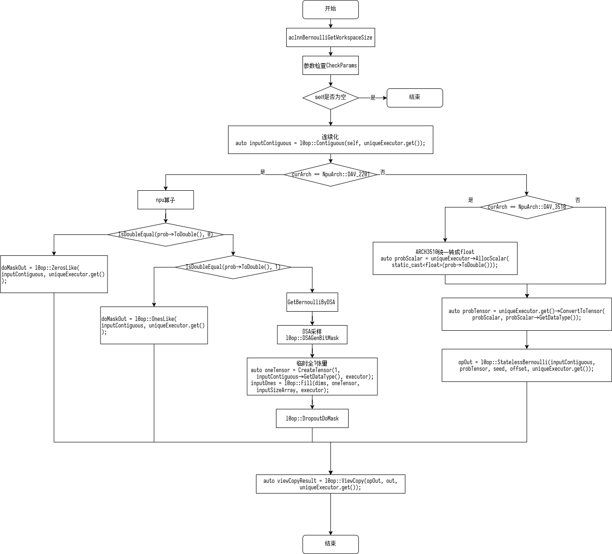

# aclnnBernoulli 算子开发设计文档

# 1. 需求背景

## 1.1 需求来源

7月社区任务-aclnnBernoulli算子开发

## 1.2 背景介绍

### 1.2.1 aclnnBernoulli实现优化

现有 `Tensor.bernoulli_` 对应的 `aclnnBernoulli` npu实现，与GPU实现存在内存差距，需要将内存差距降至 5% 以下。

aclnnBernoulli算子实现路径为：`random/dsa_gen_bit_mask/op_host/op_api/aclnn_bernoulli.cpp`

aclnnBernoulli算子实现中的API路径：`random/dsa_gen_bit_mask/op_host/op_api/aclnn_bernoulli.cpp`

### 1.2.2 aclnnBernoulli实现现状分析

#### 1.2.2.1 aclnnBernoulli支持的数据类型和数据格式

aclnnBernoulli支持以下参数

| 参数名 | 输入/输出 | 描述 | 使用说明 | 数据类型 | 数据格式 | 维度(shape) | 非连续Tensor |
|--------|-----------|------|----------|----------|----------|-------------|---------------|
| self（aclTensor*） | 输入 | 输入张量，决定输出形状和类型 | 支持空Tensor。数据类型需要与out一致。shape需要与out的一致。 | FLOAT16、FLOAT、DOUBLE、UINT8、INT8、INT16、INT32、INT64、BOOL、BFLOAT16 | ND | 0-8 | √ |
| prob（aclScalar*） | 输入 | 概率值，范围 [0.0, 1.0] | 满足0≤prob≤1。 | FLOAT16、FLOAT、DOUBLE、BFLOAT16 |  |  |  |
| seed（int64_t） | 输入 | 设置随机数生成器的种子。 | - | INT64 | - | - | - |
| offset（int64_t） | 输入 | 设置随机数偏移量。 | 取值约束：offset % 4 == 0，例如可以取0、4、8 ...，不满足约束会调用失败 | INT64 | - | - | - |
| out（aclTensor*） | 输出 | 公式中的out。 | 支持空Tensor。数据类型需要与self一致。shape需要与self的一致。 | FLOAT16、FLOAT、DOUBLE、UINT8、INT8、INT16、INT32、INT64、BOOL、BFLOAT16 | ND | 0-8 | √ |
| workspaceSize（uint64_t*） | 输出 | 返回需要在Device侧申请的workspace大小。 | - | - | - | - | - |
| executor（aclOpExecutor**） | 输出 | 返回op执行器，包含了算子计算流程。 | - | - | - | - | - |

aclnnBernoulli算子功能：从Bernoulli分布中采样 $\mathrm{output}_i \sim Bernoulli(\mathrm{prob})$

输入：prob、seed、offset

输出：output

支持prob数据类型：float16、float32、double、bfloat16

支持输出数据类型：FLOAT16、FLOAT、DOUBLE、UINT8、INT8、INT16、INT32、INT64、BOOL、BFLOAT16

#### 1.2.2.2 aclnnBernoulli当前实现描述

**NPU实现：**

* 若prob==0，直接调用`l0op::ZerosLike`得到全0张量`doMaskOut`。
* 若prob==1，直接调用`l0op::OnesLike`得到全1张量`doMaskOut`。
* 否则，采用小算子拼接实现，采用DSA算子`l0op::DSAGenBitMask`直接采样bitmask，创建临时全1张量oneTensor，使用`DropoutDoMask`得到`doMaskOut`。
* 调用`l0op::Cast`将`doMaskOut`转换为输出类型。

**GPU实现：**

* 如果架构是DAV_3510，将 prob 转换为float
* 创建张量，全部填充 prob
* 调用 StatelessBernoulli 融合算子
    * 采用Philox伪随机数生成器，单次采样`ALG_COUNTER_SIZE`个float浮点数`float results[ALG_COUNTER_SIZE]`
    * 根据采样结果确定输出数值`output[i+j] = results[j] <= prob[i+j] ? 1 : 0`。

#### 1.2.2.3 aclnnBernoulli当前实现流程图

# 2. 需求分析

## 2.1 需求描述

使用Ascend C编程语言实现aclnnBernoulli算子，支持float16、float32、double、bfloat16数据类型。

## 2.2 需求拆解

1. 支持输入float16、float32、double、bfloat16数据类型的prob参数
2. 支持输出FLOAT16、FLOAT、DOUBLE、UINT8、INT8、INT16、INT32、INT64、BOOL、BFLOAT16
1. 实现与 GPU 内存差距 5% 以下。

# 3. 详细设计

## 3.1 算子分析

### 3.1.1 数学公式

$\mathrm{output}_i \sim Bernoulli(\mathrm{prob})$

### 3.1.2 支持数据类型

输入float16、float32、double、bfloat16

输出FLOAT16、FLOAT、DOUBLE、UINT8、INT8、INT16、INT32、INT64、BOOL、BFLOAT16

## 3.2 算子实现

### 3.2.1 实现方案

根据 `l0op::DSAGenBitMask` 采样直接得到bitmask，编写核函数，将`fill + DropoutDoMask + Cast` 做 inplace 融合，减少内存占用。

#### 3.2.1.1 host侧设计：

tiling策略：

算子计算过程不涉及数据的维度信息，故在host侧将数据视为一维向量，仅考虑数据个数，不考虑数据维度信息。

任务均分：coreNum 根据输入长度和块大小动态调整，确保每个核心处理的数据块数均匀。

批量搬运：tileBlockNum 和 tileDataNum 计算单次搬运的数据量，通过 finalSmallTileNum 和 finalBigTileNum 确定小核/大核的搬运次数，将多次搬运合并为批量操作，减少冗余开销。尾块的处理逻辑确保不完整块也能被合并到计算流程中，避免数据碎片。

##### 3.2.1.2 分核策略：
优先使用满核的原则。

如果核间能均分，可视作无大小核区分，大核小核数据块一致；

如果核间不能均分，需要将余出的数据块分配到前几个核上。

输入数据大小计算：通过GetInputShape和GetDataTypeLength函数获取输入数据的大小和类型长度，计算出输入数据的总字节数。

UB内存大小和核心数量获取：通过平台信息获取UB内存大小和核心数量，并根据这些信息调整核心数量。

##### 3.2.1.3 数据分块和内存优化策略：
充分使用UB空间的原则。

需要考虑不同硬件的UB大小不同、是否开启double buffer、kernel侧API实现过程中是否需要临时数据的储存，综合考虑单核内切分的大小。

UB内存大小获取：通过GetCoreMemSize函数获取UB内存的大小，用于后续的数据切分计算。

Tile块计算：根据UB内存大小和预定义的BLOCK_SIZE及BUFFER_NUM，计算出每个Tile块的数据数量。

数据切分：将输入数据按照计算出的Tile块大小进行切分，计算出每个core需要处理的数据块数量和最后一个block的剩余数据量。

设置切分参数：将计算出的切分参数（如每个core的数据量、Tile块大小等）设置到AddcdivTilingData对象中。

这些策略确保了数据在多个核心之间的均匀分布，并且在单个核心内进行了合理的切分，以提高并行处理的效率。

##### 3.2.1.4 tilingkey规划策略：

需要tilingkey的情况：需要感知host侧信息对kernel侧走不同分支。

数据检测：在host侧获取x的数据类型，确定不同的tilingkey。

#### 3.2.2 kernel侧设计：

进行Init和Process两个阶段，其中Process包括数据搬入（CopyIn）、计算（Compute）、搬出（CopyOut）三个阶段。

1. CopyIn阶段使用 `DataCopyPad` 将 `ceil(count/8)` 字节 bitmask 搬入 UB；
2. Compute阶段根据不同的tilingkey执行不同的核函数。在UB中将bitmask转换为输出类型。
3. CopyOut阶段将UB搬出。

## 3.3 支持硬件

| 支持的芯片版本 | 涉及勾选 |
| --- | --- |
| Atlas 800I/T A2 | √ |
| Atlas 800I/T A3 | √ |

## 3.4 算子约束限制

* self 和 other 最多支持 8 维
* 随机数偏移量仅支持4的倍数

# 4. 可维可测分析

## 4.1 精度标准/性能标准

| 验收标准 | 描述(不涉及说明原因) | 标准来源 |
| --- | --- | --- |
| 内存一致性 | 与GPU差距降至 5% 以下 |  |
| 性能标准 | 不低于原算子性能 |  |

## 4.2 兼容性分析

保持aclnn接口不变