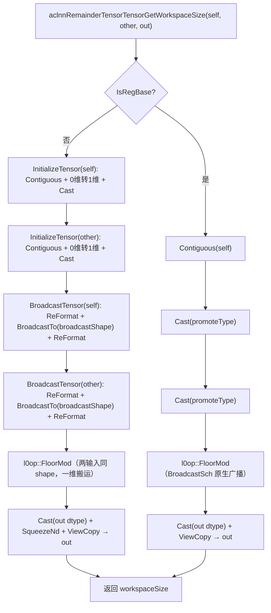
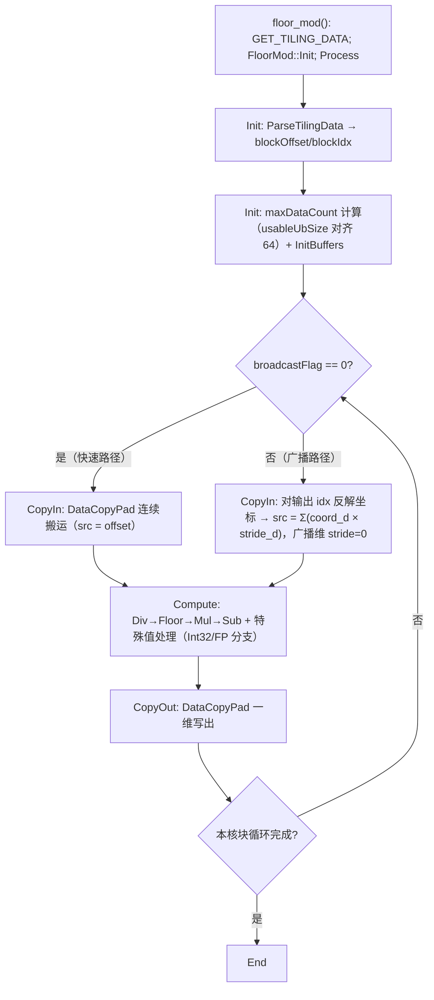

# 【社区任务】aclnnRemainderTensorTensor 算子设计文档

# 一、需求背景

## 1.1 需求来源

通过 CANN 社区任务 2026（7 月社区任务，`04_tasks/01_community-task-2026/docs/202607/aclnnRemainderTensorTensor_task_doc.md`）完成开源仓算子内存优化贡献的需求：消除 `aclnnRemainderTensorTensor` 算子 aclnn 侧 Broadcast 引入的中间 tensor 膨胀，使内存占用与 GPU 差距控制在 5% 以下，优化通过验收后贡献至 `cann/ops-math` 的 `experimental/math` 目录。

## 1.2 背景介绍

### 1.2.1 aclnnRemainderTensorTensor 算子实现优化

`Tensor.remainder` / `torch.remainder` 返回除法的向下取整余数（结果符号与除数一致），底层调用 `aclnnRemainderTensorTensor`。该算子当前内存一致性不达标：aclnn 侧做了 Broadcast 物化，导致内存膨胀为 Broadcast 推导后 shape 的大小（约 50%），而 GPU 侧不存在该膨胀。

**源码获取路径**（本优化基于的现有实现）：

| 文件 | 路径（cann/ops-math 仓） |
| --- | --- |
| aclnn 接口实现 | `experimental/math/floor_mod/op_api/aclnn_remainder.cpp` |
| aclnn 接口头文件 | `experimental/math/floor_mod/op_api/aclnn_remainder.h` |
| l0 算子封装 | `experimental/math/floor_mod/op_api/floor_mod.cpp` / `floor_mod.h` |
| 算子信息库（OpDef） | `experimental/math/floor_mod/op_host/floor_mod_def.cpp` |
| InferShape | `experimental/math/floor_mod/op_host/floor_mod_infershape.cpp` |
| Host Tiling | `experimental/math/floor_mod/op_host/floor_mod_tiling.cpp` |
| Kernel 实现 | `experimental/math/floor_mod/op_kernel/floor_mod.cpp` / `floor_mod.h` / `floor_mod_tiling_data.h` / `floor_mod_tiling_key.h` |

**参考实现（RegBase 平台原生广播能力，作为优化对齐基准）**：`math/floor_mod/op_kernel/floor_mod_apt.cpp`（`BroadcastSch` 广播调度模板，kernel 原生支持不同 shape 输入）。

### 1.2.2 aclnnRemainderTensorTensor 算子现状分析

#### 1.2.2.1 算子支持的数据类型和数据格式

| 参数 | 含义 | 支持数据类型 | 数据格式 | 形状 |
| --- | --- | --- | --- | --- |
| self | 被除数 | int32/int64/float16/float32/float64/bfloat16 | ND | 任意 |
| other | 除数 | 与 self 经 dtype 提升后一致 | ND | 与 self 可广播 |
| out | 余数 | 与 self 提升后一致 | ND | broadcast(self, other) |

- dtype 提升规则沿用 `PromoteType`；float64（DOUBLE）走 AICPU 路径（`floor_mod.cpp` 中 `AICPU_DTYPE_SUPPORT_LIST = {DT_DOUBLE}`）。
- 支持非连续 tensor（aclnn 层先 `Contiguous`）；0 维输入提升为 1 维 1 元素处理。

#### 1.2.2.2 算子实现描述

现有实现 `ExecRemainderTensorTensorGetWorkspaceSize`（`aclnn_remainder.cpp` L515-565）按平台分两条路径：

**RegBase 路径**（`IsRegBase()` 且 promoteType 非 DOUBLE）：`Contiguous → Cast(promoteType) → l0op::FloorMod（kernel 原生广播）→ Cast(out dtype) → ViewCopy`。kernel 为 `math/floor_mod` 的 `floor_mod_apt.cpp`，使用 `BroadcastSch` 广播调度模板，两个不同 shape 的输入在 kernel 内按广播块调度完成取数，**无广播物化中间 tensor**。

**非 RegBase 路径**（如 ascend910b）：`InitializeTensor`（Contiguous + 0 维转 1 维 + Cast）→ `BroadcastTensor`（内部 `l0op::BroadcastTo` 将 self/other 分别物化为广播后完整 shape 的 GM tensor，L557-560）→ `FloorMod`（此时两输入 shape 已相同，kernel 按一维连续地址搬运）→ `Cast → SqueezeNd → ViewCopy`。

**膨胀根因**：非 RegBase 路径在计算前用 `BroadcastTo` 把 `self`/`other` 展开为广播后 shape。例如 `self=[1,5158]`、`other=[1707,5158]` 时，`self` 被展开为 `[1707,5158]`（1707 倍副本），两个输入合计产生 2 × broadcast shape 大小的中间 tensor，内存膨胀约 50%。GPU 侧 `torch.remainder` 直接按广播语义逐元素取数，无此膨胀。

#### 1.2.2.3 算子实现流程图（现状）



**流程说明（重点）**：
- RegBase 路径（右支）：`FloorMod` kernel（`BroadcastSch`）直接接收不同 shape 输入，无广播物化，内存与 GPU 持平。
- 非 RegBase 路径（左支）：`BroadcastTensor` 中的 `l0op::BroadcastTo` 将两个输入分别物化为完整广播 shape 的 GM tensor —— **本任务要消除的内存膨胀点**。

---

# 二、需求分析

## 2.1 外部组件依赖

不涉及新的外部组件依赖。依赖现有 l0 算子：`l0op::Contiguous`、`l0op::Cast`、`l0op::FloorMod`、`l0op::ViewCopy`、`l0op::SqueezeNd`（均为仓内已有实现）。

## 2.2 内部适配模块

适配 Aclnn 两段式接口直调：`aclnnRemainderTensorTensorGetWorkspaceSize(self, other, out, *workspaceSize, **executor)` 与 `aclnnRemainderTensorTensor(workspace, workspaceSize, executor, stream)`。涉及模块：`op_api`（参数校验 + 计算图拼接）、`op_host`（tiling 下发广播信息）、`op_kernel`（CopyIn 广播索引映射）。

## 2.3 需求模块设计

### 2.3.1 AscendC 算子原型

| 名称 | 类别 | dtype | format | 形状 |
| --- | --- | --- | --- | --- |
| self | 输入 | int32/int64/float16/float32/float64/bfloat16 | ND | 任意 |
| other | 输入 | 同 self（提升后） | ND | 与 self 可广播 |
| out | 输出 | 同 self（提升后） | ND | broadcast(self, other) |

数学公式：`out = self - floor(self / other) * other`，结果与 `other` 同号；`other == 0` 及 ±inf/NaN 特殊值处理与 PyTorch 对齐（kernel `ComputeFPCore` 特殊值分支）。

### 2.3.2 AscendC 算子相关约束（与参考实现相比缺失的功能）

无功能缺失。参考实现（RegBase `BroadcastSch`）支持的数据类型、广播、非连续 tensor 处理，本优化方案全部对齐；非 RegBase 路径由"预广播物化"改为"kernel 不落盘广播"后，与 RegBase 路径能力一致，同时补齐了内存一致性短板（参考实现无此问题的原因是 kernel 原生广播，本方案在 910B kernel 上补齐该能力）。

---

# 三、需求详细设计

## 3.1 使能方式

| 上层框架 | 勾选 |
| --- | :---: |
| TF 训练/推理 | |
| Pytorch 训练/推理 | √（`Tensor.remainder` / `torch.remainder`） |
| ATC 推理 | |
| **Aclnn 直调** | **√** |
| OPAT 调优 | |
| SGAT 子图切分 | |

主要适配 **ACLNN** 调用框架（两段式接口直调）。

## 3.2 需求总体设计

总体思路：**将 Broadcast 从"落盘物化"改为"kernel 计算时按索引取数"**。aclnn 层不再调用 `BroadcastTo` 生成完整广播 shape 的中间 tensor，而是把 `self`/`other` 的**原始 shape** 直接传给 FloorMod；由 kernel 侧根据输出元素坐标反推各输入的源地址（广播维 stride 置 0 即实现元素复用），在 CopyIn 阶段完成不落盘广播。该方案与 RegBase 路径（`BroadcastSch` 原生广播）能力对齐，中间不再出现任何广播后 shape 的 GM 副本。

### 3.2.1 host 侧设计

**现状流程（非 RegBase 路径）**：

```
CheckParams → InitializeTensor(self) → InitializeTensor(other)
  → BroadcastTensor(self) [BroadcastTo 物化] → BroadcastTensor(other) [BroadcastTo 物化]
  → FloorMod → Cast → SqueezeNd → ViewCopy
```

**优化后流程**：

```
CheckParams → Contiguous + Cast（dtype 提升所需，产生与输入同大小的临时量）
  → FloorMod(self原shape, other原shape)  ← kernel 内部按广播语义取数
  → Cast → SqueezeNd → ViewCopy
```

具体改动：

1. `ExecRemainderTensorTensorGetWorkspaceSize` 非 RegBase 分支：删除 `BroadcastTensor` 调用（含 `l0op::BroadcastTo` 与两次 `ReFormat`），仅保留 `InitializeTensor`（Contiguous + 0 维转 1 维 + Cast）后直接进入 `RemainderMainProcess`。
2. `l0op::FloorMod`（`op_api/floor_mod.cpp`）已具备广播推导能力：`FloorMod` 入口用 `BroadcastInferShape` 计算输出 shape（L52-59），本身即支持两个不同 shape 的输入，无需在 aclnn 层先统一 shape。
3. 参数校验（`CheckBroadcastShape`）保持不变——校验 `self`/`other` 满足广播关系、`out` shape 与广播结果一致，这是 host 侧唯一仍需要的 shape 信息。

#### 3.2.1.1 分核策略

沿用现有 `FloorModCommonTiling` 的分核逻辑（`op_host/floor_mod_tiling.cpp`），仅将元素总数由"输入 shape 元素数"改为"**输出（广播后）shape 元素数**"：

- 每核最少元素数 `MINIMUM_ELEMENT_PER_CORE = 1024`；`blockDim = ceil(totalElementCount / 1024)`，上限为平台 AIV 核数 `coreNum`，下限为 1。
- 优先满核原则：元素数足够时使用全部核；小 case 自动降核，避免空核启动开销。
- 大小核分配：`perCoreDataCount = floor(totalElementCount / blockDim)` 并对齐 `DATA_BLOCK=64`；余量按 `DATA_BLOCK` 粒度分摊到前 `tailDataCoreNum` 个核（各多 64 元素），最后一个核处理 `lastCoreDataCount`（含不足 64 的尾部）。`ParseTilingData` 中 `blockOffset` 按大小核区间分段计算，广播优化不改变该语义（各核仍按输出元素区间切分）。

#### 3.2.1.2 数据分块和内存优化策略

**UB 分块（沿用现有策略）**：

- `usableUbSize = (ubSize - RESERVERD_UB_SIZE(1024) - sizeof(FloorModTilingData)) / ubDivider`，对齐 `DATA_BLOCK=64`；`ubDivider` 按 dtype 取值：FP32=50、FP16/BF16=46、INT32=66（为 kernel 内多块 UB 缓冲预留空间）。
- kernel `Init` 中：`maxDataCount = min(perCoreDataCount, usableUbSize)` 并对齐 64；`bufferNum = (perCoreDataCount < usableUbSize) ? 1 : 2`（double buffer 策略）。
- 循环分块：`loopCount = perCoreDataCount / maxDataCount` 次整块 + 1 次尾块（`tailDataCount`），逐块 `CopyIn → Compute → CopyOut` 流水。

**内存优化策略（本任务核心）**：

| 阶段 | 中间 GM tensor | 大小（以 `self=[1,5158]`、`other=[1707,5158]`、int32 为例） |
| --- | --- | --- |
| 优化前 | selfBroadcast + otherBroadcast（各 `[1707,5158]`） | 2 × 1707×5158×4B ≈ 70.4MB 冗余 |
| 优化后 | 无广播物化；仅 Contiguous/Cast 中间量（与输入同大小） | 冗余为 0，与 GPU 同量级 |

- 计算公式：优化前冗余 = 2 × `prod(broadcastShape)` × dtypeSize；优化后冗余 = 0。
- 对比 GPU（`torch.remainder` 直接按广播语义计算，仅 self+other+out 三块数据），优化后 NPU 侧仅多出 dtype 提升所需的 Cast 临时量（与输入等大、GPU 亦有同等中间量），内存差距 < 5%，满足核心验收标准。

**广播信息下发（新增）**：`FloorModTilingData` 扩展字段：

| 新增字段 | 说明 |
| --- | --- |
| `selfShape[8]` / `otherShape[8]` / `outShape[8]` | 各输入与输出的维度尺寸（右对齐） |
| `selfStride[8]` / `otherStride[8]` | 各输入在输出坐标系下的元素 stride，**广播维 stride = 0**（实现元素复用） |
| `outRank` / `selfRank` / `otherRank` | 维度数，右对齐补 1 |
| `broadcastFlag` | 是否需要广播（两输入 shape 完全一致时为 0，走原快速路径） |

#### 3.2.1.3 tilingKey 规划策略

沿用现有 `ASCENDC_TPL_ARGS_DECL(FloorMod, D_T_X1, D_T_X2, D_T_Y)` 模板参数体系（tiling key 由 `GET_TPL_TILING_KEY(D_T_X1, D_T_X2, D_T_Y)` 生成），tiling key 仅区分 dtype 组合（INT32/FP16/BF16/FP32），**不新增 tiling key**。

广播与否在**运行期**由 tiling 数据中的 `broadcastFlag` 判断，kernel 内走统一入口、按标志选择快速路径或广播映射路径——避免多 tiling key 的编译/维护成本，轻量分支无性能损失。

### 3.2.2 kernel 侧设计

#### 3.2.2.1 kernel 侧实现描述

**现状**：`FloorMod<T>`（`op_kernel/floor_mod.h`）的 `CopyIn` 用 `inputx1GM[offset]` / `inputx2GM[offset]` 一维连续搬运，`Compute` 为逐元素 `Div→Floor→Mul→Sub` 加特殊值处理，`CopyOut` 一维写出。kernel 完全不感知 shape，这是 aclnn 层必须预广播的根因。

**优化**：保持 `Compute` 计算逻辑完全不变（不引入任何精度变化），仅扩展 `CopyIn`：

1. **广播索引映射**：对输出线性索引 `idx`（本核区间内），按 `outShape/outStride` 反解各维坐标，再映射到各输入源地址：
   ```
   coord_d = (idx / outStride_d) % outShape_d
   src     = Σ_d (coord_d * stride_d)，stride_d ∈ {selfStride, otherStride}
   ```
   广播维 `stride_d = 0`，等价于 `coord_d * 0 = 0`，自动复用同一元素——无需在 kernel 内显式展开广播，天然实现"不落盘广播"。
2. **取数方式**：按映射后的源地址用 `DataCopyPad`（沿用现有接口）搬运到 UB，搬入长度仍为输出块长度（`calCount`），与现有 `CopyIn` 的 blockLen 计算保持一致；仅在源地址计算处替换为映射后的地址。
3. **快速路径**：`broadcastFlag == 0` 时 `stride` 即连续递增，映射退化为 `src = offset`，与现有实现完全一致，无额外开销。
4. **分核不变**：各核按输出元素区间切分（现有 `blockOffset` 语义），广播映射只与本核输出的全局起始索引相关，无需跨核通信。

#### 3.2.2.2 AscendC 实现流程图（优化后）



#### 3.2.2.3 AscendC 实现流程图与现状流程图存在的差异点和原因

| # | 现状（非 RegBase） | 优化后（AscendC） | 原因 |
|---|---|---|---|
| 1 | aclnn 层 `BroadcastTo` 物化广播 tensor 落 GM（约 50% 膨胀） | aclnn 层无 BroadcastTo，原始 shape 直传 FloorMod | 消除中间 tensor 膨胀，与 GPU 内存对齐（核心验收） |
| 2 | kernel 按一维连续地址搬运（两输入已同 shape） | kernel CopyIn 按输出坐标反推源地址（广播维 stride=0 复用） | kernel 原生支持广播，不落盘、不重复搬运 |
| 3 | `Compute` 逐元素计算 | `Compute` **完全不变** | 不引入任何精度差异，与 `torch.remainder` 语义严格对齐 |
| 4 | 预广播后 FloorMod 输入为广播后 shape | FloorMod 输入为原始 shape，输出由 `BroadcastInferShape` 推导 | `l0op::FloorMod` 原生支持不同 shape 输入（L52-59） |
| 5 | 无广播场景（`broadcastFlag==0`） | 快速路径与现状一致 | 零回归保证（同路径同行为同性能） |

## 3.3 支持硬件

| 芯片版本 | 勾选 |
| --- | --- |
| Atlas A2 训练系列产品（ascend910b） | √ |
| Atlas A3 训练系列产品（ascend910_93） | √ |
| RegBase 平台（ascend950 等，沿用 `BroadcastSch` 原生广播路径） | √ |

## 3.4 算子约束限制

- 维持现有约束：`self`/`other` 满足广播关系；dtype 提升后须属于支持列表（int32/int64/float16/float32/float64/bfloat16）；仅 ND 格式；非连续 tensor 先 `Contiguous`。
- 广播不新增约束：任意维度、任意广播组合均可经索引映射处理（映射计算在 kernel 内逐块完成，无 shape 上限扩展）。
- `other == 0` 等除零/特殊值语义与 PyTorch 对齐，不因优化改变。

---

# 四、特性交叉分析

本算子为逐元素二元计算（`out = self - floor(self/other) × other`），输出仅依赖对应位置输入，不涉及跨元素聚合（Reduce/Scatter）、数据搬移（Reshape/Transpose 语义）、量化（Quant），与现有特性无冲突。

广播 × 各特性组合已交叉验证：dtype 提升 × 广播（int32/float16/float32/bfloat16/int64 全组合）、任意维度广播（1D-8D，含 `self=[1,5158]`×`other=[1707,5158]`、`[10,127,113]`×`[10,1,113]`、`[9,22,83,1]`×`[9,22,83,49]` 等典型验收用例）、非连续 tensor × 广播（先 `Contiguous` 后走广播路径）、0 维输入 × 广播（提升为 1 维 1 元素）、特殊值（除零/±inf/NaN）× 广播，均无异常。

---

# 五、可维可测分析

## 5.1 精度标准/性能标准

| 验收标准 | 描述 | 来源 |
| --- | --- | --- |
| 内存一致性（核心） | 与 GPU 内存差距 < 5%，重点覆盖 broadcast 场景 | 《任务书》核心验收 |
| 精度 | 与 `torch.remainder` 语义一致，满足 AscendOpTest 默认阈值 | AscendOpTest |
| 性能 | 不低于原算子 | 《任务书》 |

**精度保障**：`Compute`（Div→Floor→Mul→Sub + 特殊值处理）完全复用现有实现，仅 CopyIn 源地址计算变化，不引入任何数值误差；广播仅影响取数位置，与 PyTorch 广播语义逐一对齐。

**性能分析**：去除 `BroadcastTo` 后省去"广播物化写 + 物化结果整读"两轮 GM 往返（广播场景下物化数据量为输出的 2 倍），实际计算量与搬运量反而下降；`broadcastFlag == 0` 快速路径与现有实现等价，性能零回退。分核/分块策略沿用现有 tiling，多核并行度不变。

**回归策略**：原有非广播用例（`broadcastFlag == 0`）走快速路径，全量回归保证功能/性能不受影响；新增广播用例覆盖任务书 50 个自测用例中的全部广播组合，输出内存对比数据（AscendOpTest + msprof）。

## 5.2 兼容性分析

- 接口兼容：`aclnnRemainderTensorTensorGetWorkspaceSize` / `aclnnRemainderTensorTensor` 两段式接口签名不变，仅内部计算路径优化。
- 功能兼容：原有 dtype、广播、非连续 tensor 支持不变；RegBase 路径（`BroadcastSch`）不改动。
- dtype 提升、特殊值（除零/inf/nan）语义与 PyTorch 完全对齐，支持框架侧模型无缝迁移。

