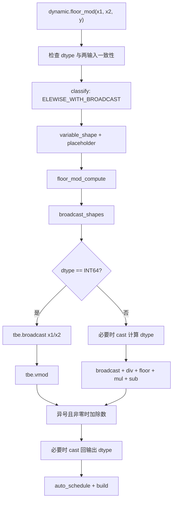
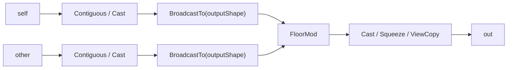
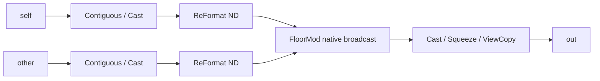
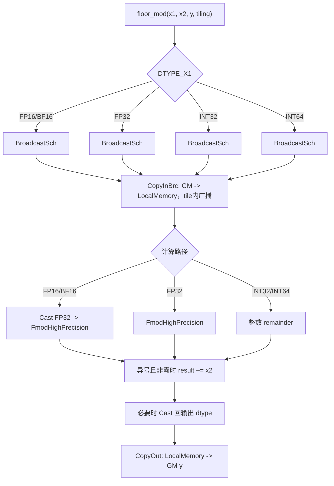

# 需求背景（required）

## 需求来源

本设计对应“7月社区任务-aclnnRemainderTensorTensor算子开发”，目标是在不改变
`aclnnRemainderTensorTensor` 对外接口和计算语义的前提下，消除 ACLNN 侧显式广播
产生的全尺寸中间 Tensor，使 NPU 与同 shape、同 dtype GPU 的峰值内存差距小于
5%，同时保证精度和性能不低于原实现。

- 官方任务书：
  <https://gitcode.com/cann/cann-ops-competitions/blob/master/04_tasks/01_community-task-2026/docs/202607/aclnnRemainderTensorTensor_task_doc.md>
- 算子代码 PR：<https://gitcode.com/cann/ops-math/pull/4249>
- 代码基线：`c0a6ef4970892c22c9186efeb3aa65147b9e7d54`
- 最终代码提交：`f774ac2fc0877d81e97846d78ae1906370252299`

对于可广播的输入 `self` 和 `other`，逐元素语义为：

```text
q = floor(self / other)
out = self - q * other
```

非零余数与除数 `other` 同号。实现需保持 PyTorch `torch.remainder` 的 floor
remainder 语义，包括正负除数组合；本次修改不重新定义整数除数为 0 的既有行为。

## 背景介绍

### aclnnRemainderTensorTensor算子实现优化

原非 RegBase Tensor-Tensor 路径在调用 `l0op::FloorMod` 前，会分别执行：

```text
self/other
  -> contiguous + dtype promotion
  -> ReFormat(ND)
  -> BroadcastTo(output shape) x 2
  -> ReFormat(ND)
  -> FloorMod
  -> output
```

`BroadcastTo` 会把两个输入实体化为广播后的输出 shape。以核心测试为例：

```text
self  = [1, 4096]
other = [4096, 1]
out   = [4096, 4096]
```

两个输入原本总计只有 8,192 个元素，广播后却各自包含 16,777,216 个元素。
基线路径会在 ACLNN workspace 中保存两个广播后的全尺寸中间 Tensor。

设两个输入元素数分别为 `N1`、`N2`，输出元素数为 `N`，计算 dtype 字节数为
`S`，原路径的逻辑额外内存近似为：

```text
M_original_extra
  ~= I(N1 != N) * N*S
   + I(N2 != N) * N*S
   + M_result
   + M_adapt
   + M_fixed
```

其中 `M_result` 为最终计算结果，`M_adapt` 为 contiguous、cast、squeeze 或
view copy 等必要适配开销，`M_fixed` 为执行器固定开销。本任务需要消除的是前两个
输出规模的 `N*S` 中间对象。

### FloorMod TBE与执行路径现状分析

#### 基线源码与配置路径

A2/A3 环境中的历史 TBE FloorMod 及其注册信息位于 CANN 安装目录。路径中的
`${ASCEND_INSTALL_PATH}` 表示实际 CANN 安装根目录：

| 内容 | 路径（含文件名） |
| --- | --- |
| 动态 TBE 实现 | `${ASCEND_INSTALL_PATH}/opp/built-in/op_impl/ai_core/tbe/impl/ops_legacy/dynamic/floor_mod.py` |
| 静态 TBE 实现 | `${ASCEND_INSTALL_PATH}/opp/built-in/op_impl/ai_core/tbe/impl/ops_legacy/floor_mod.py` |
| GE 算子原型 | `${ASCEND_INSTALL_PATH}/opp/built-in/op_graph/inc/elewise_calculation_ops.h` |
| Ascend 910B 算子信息库 | `${ASCEND_INSTALL_PATH}/opp/built-in/op_impl/ai_core/tbe/config/ascend910b/aic-ascend910b-ops-info-legacy.json` |
| Ascend 910B Kernel config | `${ASCEND_INSTALL_PATH}/opp/built-in/op_impl/ai_core/tbe/kernel/config/ascend910b/ops_legacy/floor_mod.json` |

仓库内与本次 ACLNN 编排直接相关的文件为：

| 内容 | 仓库路径 |
| --- | --- |
| ACLNN Tensor-Tensor 编排 | `math/floor_mod/op_api/aclnn_remainder.cpp` |
| FloorMod l0 接口与分派 | `math/floor_mod/op_api/floor_mod.cpp` |
| Ascend C 算子定义 | `math/floor_mod/op_host/floor_mod_def.cpp` |
| Ascend C InferShape | `math/floor_mod/op_host/floor_mod_infershape.cpp` |

#### 算子原型与dtype/format对照

GE 原型声明两输入一输出，三者 dtype 相同：

```cpp
REG_OP(FloorMod)
    .INPUT(x1, TensorType({DT_INT32, DT_INT64, DT_FLOAT,
                           DT_FLOAT16, DT_DOUBLE, DT_BF16}))
    .INPUT(x2, TensorType({DT_INT32, DT_INT64, DT_FLOAT,
                           DT_FLOAT16, DT_DOUBLE, DT_BF16}))
    .OUTPUT(y, TensorType({DT_INT32, DT_INT64, DT_FLOAT,
                           DT_FLOAT16, DT_DOUBLE, DT_BF16}))
    .OP_END_FACTORY_REG(FloorMod)
```

TBE、算子信息库和 ACLNN 路由的能力关系如下：

| 层次 | dtype | format | 说明 |
| --- | --- | --- | --- |
| 动态 TBE | FP16、FP32、INT32、BF16；平台支持 `tbe.dsl.vmod` 时包含 INT64 | ND | 两输入同 dtype，支持 elementwise broadcast |
| 静态 TBE | FP16、FP32、INT32 | ND | 经 `broadcast_shapes` 和 `refine_shapes_for_broadcast` 处理 |
| Ascend 910B op info | FP16、FP32、INT32、INT64、BF16 | ND | 与 A2/A3 AI Core 注册能力一致，不包含 DOUBLE |
| ACLNN/l0 public 能力 | INT32、INT64、FLOAT16、FLOAT32、DOUBLE、BFLOAT16 | ND | DOUBLE 由 `FloorModAiCpu` 分派到 AI CPU，其余目标 dtype 走 AI Core |

因此，DOUBLE 出现在 public interface 和 GE 原型中、但不出现在 910B AI Core
op info 中并非配置冲突；它通过 AI CPU 补齐。本方案保持该分派路径不变，并将
DOUBLE 输入输出 dtype 和任务类型纳入 profiler 验证项。

#### TBE实现描述

动态 TBE 入口先检查两输入 dtype 相同，并根据平台是否支持 INT64 `vmod` 形成
dtype 检查列表；随后使用 `ELEWISE_WITH_BROADCAST` 对动态 shape 分类，为每个
子图创建 variable shape 和 placeholder，调用 `floor_mod_compute`，最后执行
`auto_schedule` 和 `build`。

`floor_mod_compute` 先调用 `broadcast_shapes` 得到公共 shape。INT64 路径将两输入
逻辑广播后调用 `tbe.vmod`；其他 dtype 的 `_mod` 路径根据硬件能力选择计算 dtype，
执行 `broadcast -> div -> floor -> mul -> sub`，必要时再 cast 回输出 dtype。对于
非零且结果与除数异号的元素，通过 `result += divisor` 保持 floor remainder 语义。
TBE 的 `tbe.broadcast` 是计算图内的逻辑广播和地址生成，不等同于 ACLNN
`BroadcastTo` 在算子执行前创建的两个全尺寸 GM Tensor。

#### TBE整体流程图



现有 `l0op::FloorMod` 在进入上述后端前已具备原生广播能力：

1. 使用 `BroadcastInferShape(inputShape, otherShape, broadcastShape)` 推导输出 shape。
2. 只按广播后的 shape 分配一个最终输出 Tensor。
3. `DOUBLE` 通过 `FloorModAiCpu` 分派到 AI CPU。
4. 其他支持 dtype 通过 `FloorModAiCore` 分派到 AI Core。

因此，ACLNN 上层再次执行 `BroadcastTo` 属于重复工作。本方案只删除 ACLNN 层的
GM 实体广播，不修改 TBE、AI CPU 或仓库既有 Ascend C Kernel 的计算语义。

现有接口能力如下：

| 参数 | 含义 | 类型 | 支持数据类型 | 格式 | shape |
| --- | --- | --- | --- | --- | --- |
| `self` | 被除数 | Tensor | INT32、INT64、FLOAT16、FLOAT32、DOUBLE、BFLOAT16 | ND | 任意 |
| `other` | 除数 | Tensor | 同 `self`，按既有规则 promotion | ND | 与 `self` 可广播 |
| `out` | 余数 | Tensor | promotion 后 dtype | ND | 广播后的 shape |

原 ACLNN 编排流程如下：



# 需求分析（required）

## 需求描述

在 `math/floor_mod/op_api/aclnn_remainder.cpp` 的非 RegBase Tensor-Tensor 路径中，
删除两个显式 `BroadcastTo(outputShape)`，将保持原始 shape 的 ND 输入直接交给
`l0op::FloorMod`，由其已有 `BroadcastInferShape` 和 Kernel 广播能力完成计算。

方案必须同时满足：

1. NPU/GPU 同 shape、同 dtype 峰值内存差距小于 5%。
2. 六种目标 dtype 均保持正确：INT32、INT64、FLOAT16、FLOAT32、DOUBLE、BFLOAT16。
3. 完整 ACLNN 调用性能不低于基线。
4. public ACLNN interface、参数校验、dtype promotion、广播规则和错误码不变。
5. DOUBLE 保持 FP64 和 AI CPU 分派。
6. 0D、empty tensor、inplace、view 等现有路径不因优化发生语义变化。

## 需求拆解

1. 删除只供非 RegBase Tensor-Tensor 路径使用的 `BroadcastTensor` helper。
2. 保留 `InitializeTensor` 完成的 contiguous 和 dtype promotion。
3. 对两输入各执行一次 `ReFormat(FORMAT_ND)`。
4. 将原始广播 shape 的输入传入 `RemainderMainProcess` 和 `l0op::FloorMod`。
5. 验证六种 dtype 的大广播精度、workspace、NPU/GPU peak memory 和完整调用性能。
6. 单独验证 DOUBLE 的 FP64 数据类型和 AI CPU 分派。
7. 覆盖 same shape、单侧广播、交叉广播、多轴广播、0D 和 empty tensor。
8. 补充正负除数组合，验证 floor remainder 符号语义。

## 外部组件依赖

- 不新增第三方依赖。
- 继续依赖现有 ACLNN executor、`l0op::ReFormat`、`l0op::FloorMod` 和
  `BroadcastInferShape`。
- 测试使用 CANN 8.5.0 及以上环境、AscendOpTest、msprof、PyTorch/torch_npu。
- GPU 对照使用 PyTorch CUDA，shape 和 dtype 与 NPU 保持一致。

## 内部适配模块

| 模块 | 适配情况 |
| --- | --- |
| `aclnn_remainder.cpp` 非 RegBase Tensor-Tensor | 删除显式广播，保留 ND 格式转换 |
| `l0op::FloorMod` | 不修改，复用原生广播推导与分派 |
| FloorMod Host/Tiling | 不修改 |
| FloorMod Kernel | 不修改 |
| Tensor-Scalar / Scalar-Tensor | 不修改 |
| RegBase 非 DOUBLE 路径 | 不修改 |

## Ascend C算子原型与相关约束

本方案没有新增 Ascend C 算子、TilingData 或 TilingKey，也没有修改 FloorMod Kernel
原型。仓库现有 arch35 Kernel 原型为：

```cpp
template <uint64_t schMode>
__global__ __aicore__ void floor_mod(
    GM_ADDR x1, GM_ADDR x2, GM_ADDR y, GM_ADDR workspace, GM_ADDR tiling);
```

`x1`、`x2` 和 `y` 的 dtype 必须相同；两输入 shape 必须满足既有广播合法性检查；
输入经 ACLNN promotion 后以共同计算 dtype 进入 `FloorMod`。`schMode` 只能取公共
广播模板已注册的调度模式。该 Ascend C 配置支持 BF16、FP16、FP32、INT32 和
INT64，不注册 DOUBLE；DOUBLE 沿用 AI CPU。Kernel 的 shape 推导、分核、数据
分块和 Tiling 策略均沿用仓库及 CANN 环境中的既有实现。

# 详细设计（required）

## 算子分析

### 数学公式

对广播后的每个逻辑索引 `i`：

```text
q[i]   = floor(self[i] / other[i])
out[i] = self[i] - q[i] * other[i]
```

广播索引由 `FloorMod` 的现有实现完成，上层不再生成广播后的 GM Tensor。

### 支持数据类型

INT32、INT64、FLOAT16、FLOAT32、DOUBLE、BFLOAT16。

DOUBLE 沿用 `FloorModAiCpu`，其余目标 dtype 沿用 `FloorModAiCore`。

### 支持形状

- 支持相同 shape。
- 支持任一输入被广播。
- 支持交叉广播和多轴广播。
- 保留现有 0D 和 empty tensor 行为。
- 两输入 shape 必须满足既有广播规则。

## 算子实现

### 使能方式

不增加属性、环境变量或配置开关。优化对非 RegBase Tensor-Tensor 路径自动生效。
RegBase 非 DOUBLE 快速路径和 Tensor-Scalar、Scalar-Tensor 路径保持原实现。

### 总体设计

优化后流程为：



核心代码变化为：

```cpp
selfContiguous = l0op::ReFormat(selfContiguous, op::Format::FORMAT_ND);
otherContiguous = l0op::ReFormat(otherContiguous, op::Format::FORMAT_ND);
auto remainderRes = RemainderMainProcess(
    selfContiguous, otherContiguous, out, needUnsqueeze, executor);
```

`RemainderMainProcess` 内部调用 `l0op::FloorMod`。`FloorMod` 先执行
`BroadcastInferShape`，随后只分配最终输出，并根据 dtype 选择 AI Core 或 AI CPU。

### Host侧设计

本任务的生产改动位于 ACLNN/op_api 编排层，不新增或修改 FloorMod Tiling Host
代码。A2/A3 的 AI Core 计算沿用上述 TBE 路径；仓库中现有 Ascend C Host/Tiling
实现位于 `math/floor_mod/op_host/arch35/floor_mod_tiling_arch35.cpp`，面向
`ascend950` 配置。本节记录该既有实现，作为检查表要求的 Host 设计说明，但不将
其描述为本次 A2/A3 生产改动。

#### 分核策略

`TilingPrepareForFloorMod` 通过平台信息读取 AIV 核数和 UB 容量：

```text
C_platform = PlatformAscendC.GetCoreNumAiv()
U_platform = PlatformAscendC.GetCoreMemSize(UB)
```

各 dtype 使用 `BroadcastBaseTiling<OpDag>::DoTiling(...)`，由公共广播模板根据
广播 shape、输出元素数和调度模式确定实际 block 数 `C_used`，满足：

```text
1 <= C_used <= C_platform
N = product(broadcast_output_shape)
ideal_elements_per_core = ceil(N / C_used)
```

实际每核区间还需服从公共模板的 DMA 对齐和尾块规则。本任务不复制或改写该公共
模板的分核算法。删除上层 `BroadcastTo` 后，输出 shape 和总逻辑元素数 `N` 不变；
后端会从原始输入 shape 识别既有广播调度模式，而不是把两个输入误认为已实体化的
same-shape Tensor。

#### 数据分块和内存优化策略

ACLNN/GM 侧策略：

1. 不再为两个输入申请广播后输出规模的 GM Tensor。
2. 保留 contiguous 和 dtype promotion 产生的必要适配对象。
3. 保留一次 ND 格式转换，避免 3D 到 4D、4D 到 5D 等广播场景的格式问题。
4. 只由 `FloorMod` 分配最终输出 Tensor。

仓库现有 arch35 Host 的 LocalMemory 预算为：

```text
DCACHE_SIZE = 32 * 1024 bytes
LocalMemory = U_platform - DCACHE_SIZE
```

`GetFmodTmpBufferFactorSize(sizeof(float), maxLiveNodeCnt, extraBuf)` 计算 Fmod DAG 的
临时空间和最大存活节点数。INT32/INT64 路径再执行：

```text
extraBuf = fmodExtraBuf + DCACHE_SIZE
```

FP16/BF16/FP32 路径使用 `fmodExtraBuf`。最终由：

```text
BroadcastBaseTiling<OpDag>.DoTiling(extraBuf, maxLiveNodeCnt, true)
```

完成 UB tile 切分。这里的 LocalMemory 和 `extraBuf` 都是单个 AI Core 的 UB 预算，
不是 ACLNN GM workspace；本次优化消除的是后者中的全尺寸广播 Tensor。

对于两侧都需要广播的场景，本方案应从 ACLNN workspace 中消除两个大小为 `N*S`
的全尺寸中间 Tensor。最终输出 Tensor 本身仍必须分配，不计作可消除的中间
workspace。实际 workspace 和设备峰值内存由验收测试记录，不在设计文档中展开。

#### TilingKey规划策略

本任务不新增、不修改 TilingKey。仓库现有 arch35 实现仅声明公共广播模板的
`schMode` 字段：

```text
schMode  = BroadcastBaseTiling<OpDag>.GetSchMode()
tilingKey = GET_TPL_TILING_KEY(schMode)
```

`schMode` 由公共广播模板依据输入 shape/stride、是否广播及 DMA 调度方式选择。
dtype 不直接形成新的 TilingKey 字段，而是在 Host 侧选择不同 DAG：

| dtype | Host选择的OpDag |
| --- | --- |
| FLOAT16、BFLOAT16 | `FloorModFloatWithCastOp` |
| FLOAT32 | `FloorModFloatOp` |
| INT32 | `FloorModInt32Op` |
| INT64 | `FloorModInt64Op` |

DOUBLE 不进入该 AI Core TilingKey 路径，继续由 `FloorModAiCpu` 分派到 AI CPU。
从已实体化输入改为原始 shape 输入后，只会命中公共模板已有的 broadcast
`schMode`，不会产生未注册的新 key。

### Kernel侧设计

本方案未修改 Kernel。A2/A3 继续使用历史 TBE/AI CPU 后端；仓库中的 Ascend C
参考实现由以下文件组成：

| 内容 | 仓库路径 |
| --- | --- |
| Kernel 入口 | `math/floor_mod/op_kernel/floor_mod_apt.cpp` |
| 计算 DAG | `math/floor_mod/op_kernel/arch35/floor_mod_dag.h` |
| TilingKey 结构 | `math/floor_mod/op_kernel/arch35/floor_mod_struct.h` |
| Host Tiling | `math/floor_mod/op_host/arch35/floor_mod_tiling_arch35.cpp` |
| Ascend 950 二进制配置 | `math/floor_mod/op_host/config/ascend950/floor_mod_binary.json` |

Ascend C 入口为 `floor_mod<schMode>`。Kernel 用 `BroadcastSch` 在搬入阶段按
`schMode` 完成广播寻址，通过 `CopyInBrc` 将当前 tile 搬入 LocalMemory，而不是
在 GM 中生成完整广播 Tensor。不同 dtype 选择对应计算 DAG：FP16/BF16 先转
FP32，FP32 直接计算，INT32/INT64 使用整型余数路径；计算后对非零异号余数执行
加除数修正，最后只搬出当前输出 tile。DOUBLE 不在该 Ascend C 配置中，由 AI CPU
实现。

#### Ascend C实现流程图



#### 与TBE流程的差异

| 对比项 | 历史TBE路径 | 仓库现有Ascend C路径 | 本次改动 |
| --- | --- | --- | --- |
| 广播调度 | `classify + broadcast_shapes` | Host `BroadcastBaseTiling` 产生 `schMode` | 不修改后端调度 |
| 广播执行 | `tbe.broadcast` 计算图内逻辑广播 | `BroadcastSch + CopyInBrc` 在 tile 搬入时寻址 | 删除调用前的 ACLNN `BroadcastTo` |
| 计算表达 | TBE DSL `vmod` 或 div/floor/mul/sub | Ascend C DAG/Fmod 或整数 remainder | 数学语义不变 |
| 调度生成 | `auto_schedule + build` | Host Tiling + 编译期 `schMode` | 沿用已有实现 |
| DOUBLE | 910B AI Core op info 不支持，转 AI CPU | Ascend 950 配置未注册 DOUBLE | 保持 `FloorModAiCpu` |
| GM中间Tensor | TBE 内部不要求 ACLNN 全尺寸输入 | Ascend C tile 内广播 | 消除两个输出规模中间 Tensor |

TBE 与 Ascend C 的实现机制不同，但二者都能从原始 shape 完成逻辑广播。原 ACLNN
`BroadcastTo` 则在后端执行前创建两个输出规模的 GM Tensor，位于后端 Module
interface 之外，是重复的适配工作。本方案在 ACLNN/l0op 的调用 seam 删除该重复
适配，不改变任一后端的计算公式、Tiling 或 Kernel 源码。

## 支持硬件

| 硬件 | 支持情况 | 验证要求 |
| --- | --- | --- |
| Atlas A2 训练系列 | 支持 | 覆盖六 dtype、精度、内存、性能和 AscendOpTest |
| Atlas A3 训练系列 | 支持 | 覆盖六 dtype、精度、内存、性能和 AscendOpTest |

## 算子约束限制

1. 两输入需满足现有广播规则。
2. 支持数据类型和 promotion 规则不变。
3. public ACLNN interface 和错误码不变。
4. 0D 输入继续使用既有专用路径，本任务不修改其 workspace 行为。
5. 整数除数为 0 的行为不在本次变更范围内。
6. inplace Tensor-Tensor 复用同一执行函数，接口与参数检查不变。

# 特性交叉分析

| 交叉特性 | 影响分析 | 处理方式 |
| --- | --- | --- |
| dtype promotion | 无行为变化 | 保留 `InitializeTensor` |
| 非连续 Tensor | 无行为变化 | 继续执行 contiguous 适配 |
| ND 格式 | 必须保留 | 两输入各执行一次 `ReFormat(ND)` |
| RegBase | 非 DOUBLE 快速路径不受影响 | 保持原分支 |
| DOUBLE/AICPU | 必须保持 FP64 和 AI CPU | 纳入 profiler 验证计划 |
| 0D | 专用 squeeze/unsqueeze 路径不变 | 纳入边界矩阵测试计划 |
| empty tensor | 直接返回空结果 | 纳入边界矩阵测试计划 |
| inplace | 与非 inplace 共用 Tensor-Tensor 执行函数 | 接口和检查不变 |
| view/output copy | 不改变 | 保留既有 `ViewCopy` 等逻辑 |
| 正负除数 | 必须满足 floor remainder | 纳入符号语义矩阵测试计划 |

# 可维可测分析

## 精度标准/性能标准

| 验收项 | 判定标准 | 验证方法 |
| --- | --- | --- |
| 六 dtype 大广播精度 | 全部通过 | 对比逐元素 floor remainder golden |
| 边界精度矩阵 | 全部通过 | 覆盖同 shape、单侧/交叉/多轴广播、0D 和 empty tensor |
| 正负除数语义 | floor remainder 正确 | 覆盖正负被除数与正负除数组合 |
| AscendOpTest | 默认阈值通过 | 六 dtype 分别运行 cross broadcast 和 multi-axis broadcast |
| 普通广播 workspace | 不再包含两个全尺寸中间 Tensor | 读取 `GetWorkspaceSize` 返回值并核对分配组成 |
| NPU/GPU peak memory | 同 shape、同 dtype 差距小于 5% | 独立进程比较 `peak_allocated_delta` |
| 完整 ACLNN 调用性能 | 不低于基线 | 同硬件、同 shape、同 dtype 交错采样并比较多组中位数 |
| DOUBLE 分派 | 保持 FP64 输入输出并进入 AI CPU | 使用 profiler 检查 dtype 和任务类型 |

完整性能测量范围为：

```text
GetWorkspaceSize + workspace allocate + execute + sync + free
```

性能使用基线与优化版本独立本地构建库，采用相同 shape、dtype、warmup 和迭代数，
交错采样后比较多组中位数。具体测量结果记录在验收报告中。

测试覆盖：

1. `[1,4096]` 与 `[4096,1]` 的六 dtype 大广播。
2. same shape、self broadcast、other broadcast、cross broadcast、multi-axis
   broadcast、0D/Tensor、0D/0D 和 empty tensor。
3. 正负被除数与正负除数的 floor remainder 语义。
4. DOUBLE 的 FP64 输入输出及 AI CPU 分派。
5. NPU/GPU 独立进程 `peak_allocated_delta` 对比。
6. AscendOpTest 六 dtype，每种包含 cross broadcast 和 multi-axis broadcast。

## 兼容性分析

- public ABI、函数签名、参数含义、返回值和错误码不变。
- shape 推导规则不变，仍使用既有 `BroadcastInferShape`。
- dtype promotion 和格式适配不变。
- Kernel、Tiling、TilingKey 和硬件配置不变。
- 生产代码变更集中在 `math/floor_mod/op_api/aclnn_remainder.cpp`，便于审查和回滚。
- 测试和辅助代码不改变生产方案。

## 可维护性与回滚

删除重复广播后，广播 shape 推导和最终输出分配集中在 `l0op::FloorMod`，避免同一
规则在 ACLNN 上层和 FloorMod 内部维护两份。若后续发现平台回归，可恢复
`BroadcastTensor` helper 及两次调用；测试工具和验收报告可继续用于回滚前后
对比。
