# 需求背景（required）

## 需求来源

基于 TBE FloorMod 历史版本，使用 Ascend C 对
`aclnnRemainderTensorTensor` 进行内存与性能优化。原 ACLNN 在调用 FloorMod 前
把输入广播到输出 shape，产生随广播结果线性增长的 GM 中间 Tensor。社区任务
要求在保持 remainder 语义、六种 dtype、公共 ABI 和 view/inplace 行为不变的
前提下，使 NPU/GPU 峰值内存差距小于 5%，且性能不低于原算子。本设计采用
stride-aware FloorMod，在 Kernel 内完成广播寻址。

对于可广播的 `self`、`other`，逐元素语义为：

```text
q = floor(self / other)
out = self - q * other
```

非零结果与 `other` 同号；浮点保持 NaN、Inf、零除数和有符号零行为，整数避免
零除数或 `INT64_MIN / -1` 的未定义行为。

原 ACLNN Tensor-Tensor 主链如下。这里的 `BroadcastTo` 是输出规模的 GM Tensor，
也是本任务需要消除的对象。

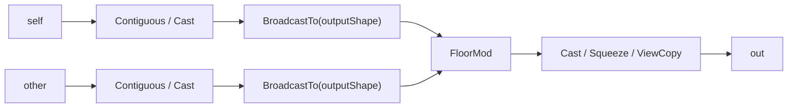

设两输入元素数为 `N1`、`N2`，广播输出元素数为 `N`，计算 dtype 字节数为
`S`。原路径的逻辑额外内存近似为：

```text
M_original_extra
  ~= I(N1 != N) * N*S
   + I(N2 != N) * N*S
   + M_result
   + M_adapt
   + M_fixed
```

`M_result` 为 FloorMod 私有结果，`M_adapt` 为 Contiguous/Cast/Squeeze/ViewCopy，
`M_fixed` 为 executor 固定项。只缩小 UB 或优化 Broadcast Kernel 无法消除两个
`N*S` 级对象。

TBE 的 `tbe.broadcast` 是 DSL 逻辑广播，不等同于上述 ACLNN `BroadcastTo` GM
Tensor；本任务消除后者。

## 背景介绍

### aclnnRemainderTensorTensor算子实现优化

本任务面向 Atlas A2/A3 训练系列产品，在不改变公共 ACLNN ABI、输出语义和原有
功能的前提下，将广播寻址融合到 FloorMod Kernel。实现中删除 ACLNN 侧
`BroadcastTo(outputShape)` 形成的全尺寸 GM 中间 Tensor，使同条件 NPU/GPU
Device 峰值内存差距小于 5%；性能设计删除 Broadcast 任务和 GM 往返，
并按访问模式选择搬运路径。

### aclnnRemainderTensorTensor算子TBE实现现状分析

TBE算子源码路径：`${ASCEND_INSTALL_PATH}/opp/built-in/op_impl/ai_core/tbe/impl/ops_legacy/dynamic/floor_mod.py`

静态TBE算子源码路径：`${ASCEND_INSTALL_PATH}/opp/built-in/op_impl/ai_core/tbe/impl/ops_legacy/floor_mod.py`

算子原型路径：`${ASCEND_INSTALL_PATH}/opp/built-in/op_graph/inc/elewise_calculation_ops.h`

算子信息库路径：`${ASCEND_INSTALL_PATH}/opp/built-in/op_impl/ai_core/tbe/config/ascend910b/aic-ascend910b-ops-info-legacy.json`

910B kernel config路径：`${ASCEND_INSTALL_PATH}/opp/built-in/op_impl/ai_core/tbe/kernel/config/ascend910b/ops_legacy/floor_mod.json`

#### 1. 算子原型与能力边界

```cpp
REG_OP(FloorMod)
    .INPUT(x1, TensorType({DT_INT32, DT_INT64, DT_FLOAT,
                           DT_FLOAT16, DT_DOUBLE, DT_BF16}))
    .INPUT(x2, TensorType({DT_INT32, DT_INT64, DT_FLOAT,
                           DT_FLOAT16, DT_DOUBLE, DT_BF16}))
    .OUTPUT(y, TensorType({DT_INT32, DT_INT64, DT_FLOAT,
                           DT_FLOAT16, DT_DOUBLE, DT_BF16}))
    .OP_END_FACTORY_REG(FloorMod)
```

| **项目** | **TBE / 910B 事实** |
| -------- | ------------------- |
| 输入输出 | 两输入一输出，同 dtype，可广播 |
| GE 原型 attr | 无显式 attr |
| Python 编译参数 | `kernel_name`、`impl_mode` |
| 动态 TBE dtype | FP16、FP32、INT32、BF16；平台支持时含 INT64 |
| 910B op info | FP16、FP32、INT32、INT64、BF16，ND；不含 DOUBLE |
| shape | 动态 shape/rank，elementwise broadcast |
| `check_supported` | FP32 `high_precision` 返回 false，可转 AICPU |

#### 2. TBE 整体流程图

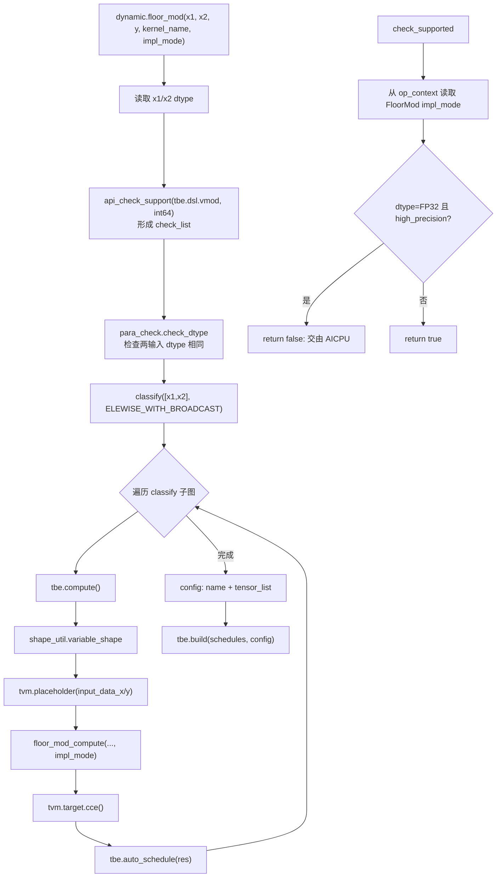

静态入口按 `check_shape -> broadcast_shapes -> refine_shapes_for_broadcast ->
placeholder -> compute -> auto_schedule -> build` 执行，仅声明 FP16/FP32/INT32；
动态入口以 `classify + variable_shape` 覆盖动态广播。

#### 3. TBE Compute 细化流程图

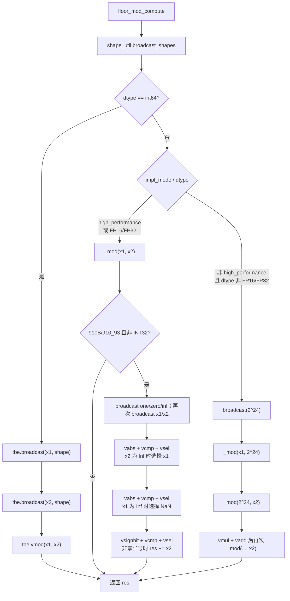

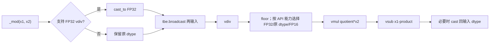

### aclnnRemainderTensorTensor算子功能分析

`aclnnRemainderTensorTensor` 对两个 Tensor 执行逐元素 floor modulus。输入 shape
按尾维对齐并遵循广播规则，输出 shape 为广播结果；输入经过类型推导后使用共同
计算 dtype。优化前后的数学语义、异常处理、非连续 Tensor 适配和 inplace 约束
保持不变，仅改变广播数据的产生方式。

| 参数 | 参数含义 | 支持数据类型 | 数据格式 | shape |
| --- | --- | --- | --- | --- |
| `self` | 被除数 Tensor | INT32、INT64、FLOAT16、FLOAT、DOUBLE、BFLOAT16 | ND | rank 0-8 |
| `other` | 除数 Tensor | 同 `self`，并满足类型推导规则 | ND | 与 `self` 可广播 |
| `out` | 余数结果 | 与计算 dtype 一致 | ND | 广播结果 shape |

# 需求分析（required）

## 需求描述

使用 Ascend C 优化 `aclnnRemainderTensorTensor` 的 Tensor-Tensor 广播路径。目标
Kernel 根据输出坐标和输入 stride 直接读取紧凑输入，不再预先生成输出 shape
大小的广播 Tensor；结果与 PyTorch `torch.remainder` 及原算子一致，完整调用链
性能不低于原算子，同条件 NPU/GPU Device 峰值内存差距小于 5%。

## 需求拆解

1. 保持 out-of-place 与 inplace 两段式 ACLNN 接口及参数校验行为不变。
2. 支持两个 Tensor 输入及 scalar、连续、尾连续、交叉行和通用广播场景。
3. 覆盖 INT32、INT64、FLOAT16、FLOAT、DOUBLE、BFLOAT16 六种任务 dtype。
4. 消除输出规模的 Broadcast GM 中间 Tensor，FloorMod Kernel workspace 为 0。
5. 覆盖功能、精度、特殊值、内存峰值、完整调用链性能和路由验证。

### 外部组件依赖

不涉及额外外部组件依赖。

### 内部适配模块

| **模块** | **职责与边界** |
| -------- | -------------- |
| ACLNN API | 参数校验、promotion、连续化、rank-0 归一、输出适配和 route 选择 |
| FloorMod L0 | 推导或接收输出，统一加入 AI Core launcher |
| OpDef / InferShape | 声明六种 dtype、ND、动态 shape/rank，执行 `InferShape4Broadcast` |
| Op Host | 生成广播 shape/stride、mode、分核、UB 预算和 tiling key |
| Op Kernel | 按 stride 读取紧凑输入，完成 dtype 计算、尾块和写回 |

### 需求模块设计

#### 算子原型

| **名称** | **类别** | **dtype** | **format** | **shape** | **说明** |
| -------- | -------- | --------- | ---------- | --------- | -------- |
| `x1` | 输入 | FP16/BF16/FP32/INT32/INT64/DOUBLE | ND | rank 0-8 | 被除数 |
| `x2` | 输入 | 同 `x1` | ND | 与 `x1` 可广播 | 除数 |
| `y` | 输出 | 同 `x1` | ND | 广播结果 shape | floor modulus |

**属性**：

| **名称** | **类型** | **说明** |
| -------- | -------- | -------- |
| 无 | - | 不新增属性 |

公共 `aclnnRemainderTensorTensor` 与
`aclnnInplaceRemainderTensorTensor` 两段式 ABI 不变。输入可由 ACLNN promotion
到共同计算 dtype；FloorMod 的两个输入和输出保持同 dtype，输出为广播 shape。

### 设计硬约束

| **维度** | **约束** |
| -------- | -------- |
| 功能 | 与 PyTorch remainder 语义及既有异常/特殊值行为一致 |
| 内存 | 目标路径不得创建输出规模的 Broadcast Tensor；Kernel workspace 为 0 |
| 性能 | 完整 ACLNN 调用链不低于原算子，不用单 Kernel 结果替代 |
| 路由 | 910B/910_93 六种 dtype 全部进入 AI Core，不进入 AICPU |
| 扩展 | mode 与 dtype tiling key 解耦，新增模式不改变公共 ABI |

### 算子支持型号

Atlas A2/A3 训练系列产品（`ASCEND910B/ASCEND910_93`）。代码侧
`FloorMod` AICore 配置使用 `ascend910b`，`Ascend910_93` 与
`Ascend910B` 同属 DAV_2201 架构，按同一任务平台 route 处理。

# 详细设计（required）

## 算子分析

### 数学公式

对于广播后的每个逻辑位置，计算公式为：

$$
out_i = self_i - \left\lfloor\frac{self_i}{other_i}\right\rfloor \times other_i
$$

非零结果与 `other` 同号。浮点路径需处理 NaN、Inf、零除数和有符号零；整数
路径需规避除数为 0 及 `INT64_MIN / -1` 的未定义行为。

### 支持数据类型

| 输入/输出 | 支持数据类型 | 计算说明 |
| --- | --- | --- |
| `self` / `other` / `out` | FLOAT16、BFLOAT16、FLOAT、INT32、INT64、DOUBLE | ACLNN 先完成类型推导；FloorMod 三端 dtype 一致 |

### 支持形状

- 支持 ND 格式和 rank 0-8。
- `self` 与 `other` 从尾维对齐，每个对齐维度相等或至少一侧为 1。
- `out` shape 必须等于两个输入的广播结果。
- 支持 rank-0 Tensor、空 Tensor、连续 Tensor 和由 ACLNN 连续化后的非连续 Tensor。

## 算子实现

### 使能方式

| **上层框架**     | **涉及的框架勾选** |
| ---------------- | ------------------ |
| TF训练/推理      |                    |
| Pytorch训练/推理 |                    |
| ATC推理          |                    |
| Aclnn直调        | √                  |
| OPAT调优         |                    |
| SGAT子图切分     |                    |

### 实现方案

本次任务代码位于 `experimental/math/floor_mod`，核心文件与职责如下：

| **路径** | **职责** |
| -------- | -------- |
| `op_api/aclnn_remainder.cpp` | 两段式 ACLNN 参数校验、dtype promotion、native route 选择、direct-out / ViewCopy 输出适配 |
| `op_api/floor_mod.cpp` | `FloorMod` L0 封装，提供无输出和有输出 overload，并固定加入 AI Core launcher |
| `op_host/floor_mod_def.cpp` | FloorMod OpDef，声明 BF16/FP16/FP32/INT32/INT64/DOUBLE、ND、动态 shape/rank |
| `op_host/floor_mod_infershape.cpp` | 使用 `InferShape4Broadcast` 推导输出 shape |
| `op_host/floor_mod_tiling.cpp` | 生成广播 shape/stride、broadcast mode、分核、UB 预算、tiling key 和 workspace=0 |
| `op_kernel/floor_mod.cpp` / `op_kernel/floor_mod.h` | AI Core kernel，按 tiling data 进行 stride-aware CopyIn、计算和 CopyOut |
| `op_kernel/floor_mod_tiling_data.h` / `floor_mod_tiling_key.h` | Host/Kernel 共享的 tiling data 与 dtype template key 定义 |

#### 1. 候选方案与选择

| **方案** | **内存效果** | **性能与语义** | **结论** |
| -------- | ------------ | -------------- | -------- |
| 保留 ACLNN `BroadcastTo`，只优化其 Kernel | `N*S` 级 GM 对象仍存在 | 多任务、多次 GM 往返 | 不采用 |
| 强制把 out-of-place 改成真正 inplace | 可少一个结果对象 | 破坏公共输出与 alias 语义，且不能消除另一输入广播 | 不采用 |
| workspace 分块广播后调用 FloorMod | 中间区由 `N*S` 降为 tile | 仍增加 GM 往返、workspace 和任务边界 | 不采用 |
| stride-aware 融合 FloorMod | Broadcast GM 中间为 0 | 单任务内按需读取，可按模式优化 | 采用 |

选择“不落盘 Broadcast”，而非依赖 inplace 才节省内存：out-of-place 可直接写
用户 `out`，公共 inplace 只是把 `selfRef` 作为合法输出的一种形式；两者复用
同一套 stride-aware Host/Kernel。

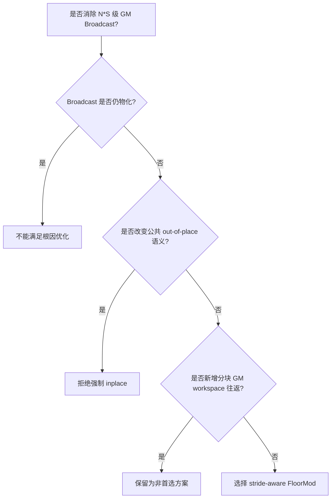

#### 2. 总体数据流

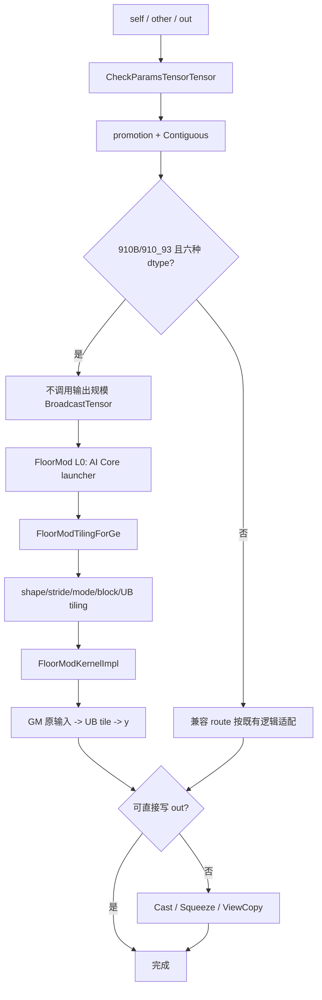

#### 3. Route 硬约束

`IsNativeBroadcastFloorModType` 仅在 `ASCEND910B/ASCEND910_93` 且 promotion
dtype 属于 BF16、FP16、FP32、INT32、INT64、DOUBLE 时返回 true。native route
不调用 `BroadcastTensor`。`FloorMod` 的有输出和无输出 overload 均调用
`FloorModAiCore`；`FloorModAiCpu` 仅为兼容显式调用者保留，不被这两个 overload
选择。

rank-0 输入在 `InitializeTensor` 中通过 `BroadcastTo([1])` 规范为单元素 Tensor。
这是 O(1) 的 shape 适配，不是任务要消除的输出规模 Broadcast；内存归因和 route
检查必须区分二者。

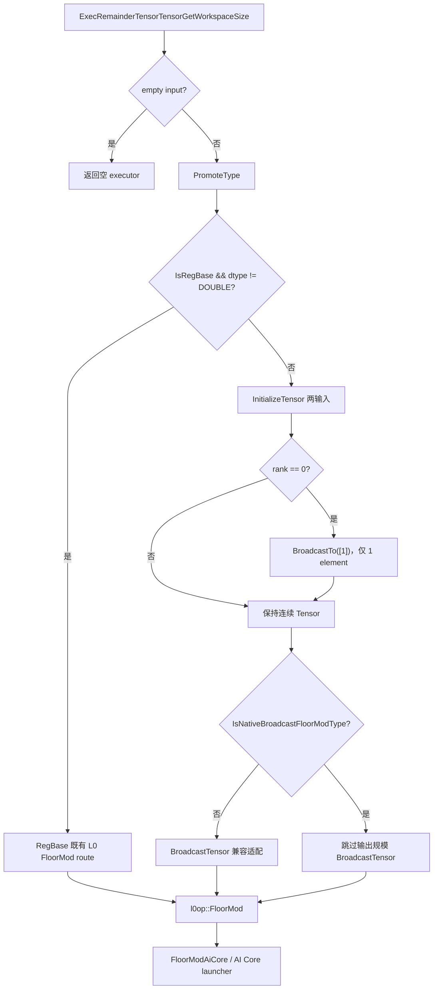

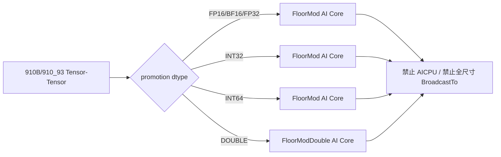

#### 4. ACLNN 输出与 inplace 语义

`RemainderMainProcess` 在无需 scalar squeeze、计算 dtype 等于输出 dtype 且
`out` 连续时，调用有输出 overload 直接写用户 `out`。其他场景由 FloorMod 产生
私有结果，再执行必要的 Cast、Squeeze、ViewCopy。全尺寸 Broadcast 输入中间
Tensor 在两类输出路径中均为 0；私有结果和输出适配 Tensor 按实际场景保留。

inplace 校验要求广播结果 shape 等于 `selfRef` shape，禁止扩展 `selfRef`。各
core 只写不重叠区间，tile 在写回前已将两个输入搬入 UB，因此 API 声明的
`y == selfRef` 读后写关系成立。非连续、dtype 适配或 squeeze 场景必须走私有
结果与 ViewCopy，不能强行地址复用。

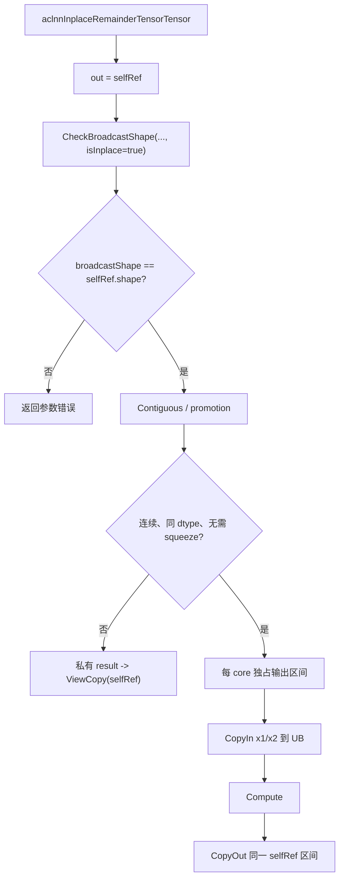

#### 3.2.1 host侧设计：

##### 1. InferShape、dtype 与 format

OpDef 为三端声明相同的六种 dtype、ND format 和动态 shape/rank；
`InferShape4Broadcast` 推导输出。Tiling 再次校验描述符 dtype 一致、rank 不超过
8、输入可广播、输出 storage shape 等于广播结果，并用 `CheckedMultiply` 防止
元素数或 stride 乘积回绕。

##### 2. Host Tiling 总流程

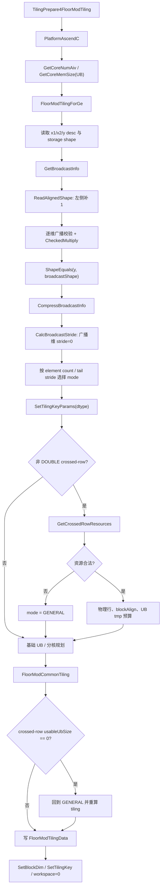

##### 3. Broadcast metadata 与 mode

右对齐后，输入线性地址为：

```text
inputOffset = sum(coord[d] * inputStride[d])
broadcast dimension => inputStride[d] = 0
```

相邻同广播状态维先压缩；mode 如下：

| **mode** | **判定重点** | **Kernel 目标** |
| -------- | ------------ | --------------- |
| `CONTIGUOUS` | 两输入元素数均等于输出 | 连续 DMA |
| `X1_SCALAR` / `X2_SCALAR` | 一侧单元素、另一侧等于输出 | 单次标量读取后 UB 扩展 |
| `TAIL_CONTIGUOUS` | 两侧尾 stride 均为 1 | 不跨尾行连续搬运 |
| 两种 crossed-row | 一侧尾连续，另一侧尾标量，上一维交叉 | 行/行组复用 |
| `GENERAL` | 其余 stride 组合 | 分段坐标反解 |

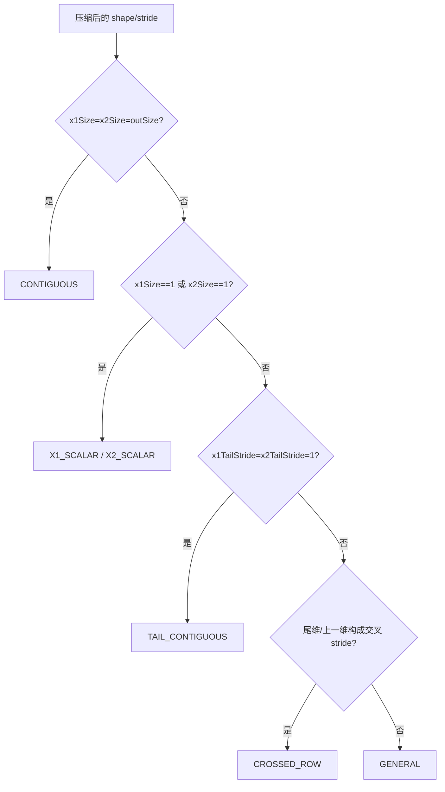

##### 4. 分核与 UB 预算

常规请求核数为 `ceil(totalElements/1024)`，不超过平台 AIV 核数；每核逻辑区间
按 `blockAlignElements` 分配，余量由 `tailDataCoreNum` 和
`lastCoreDataCount` 表达。非 32B crossed-row 且原请求核数大于 4 时改为约 2048
逻辑元素/核，以摊薄物理补齐和队列开销；这不是固定两个 row-group/核。

UB 先扣除固定保留、tiling data 和 `broadcastTmpSize`，再按 dtype divider 计算
单 tile 元素数并向 64 元素对齐。通用模板一核单 tile 时使用 queue depth 1，
多 tile 时使用 depth 2。DOUBLE 的 divider 65 是保守 Host 预算；其 Kernel 不
申请 FP32 工作 Tensor，buffered mode 仅初始化三组 depth-2 `uint64_t` 输入输出
队列。`broadcastTmpSize` 是 UB 临时区，不是 GM workspace。

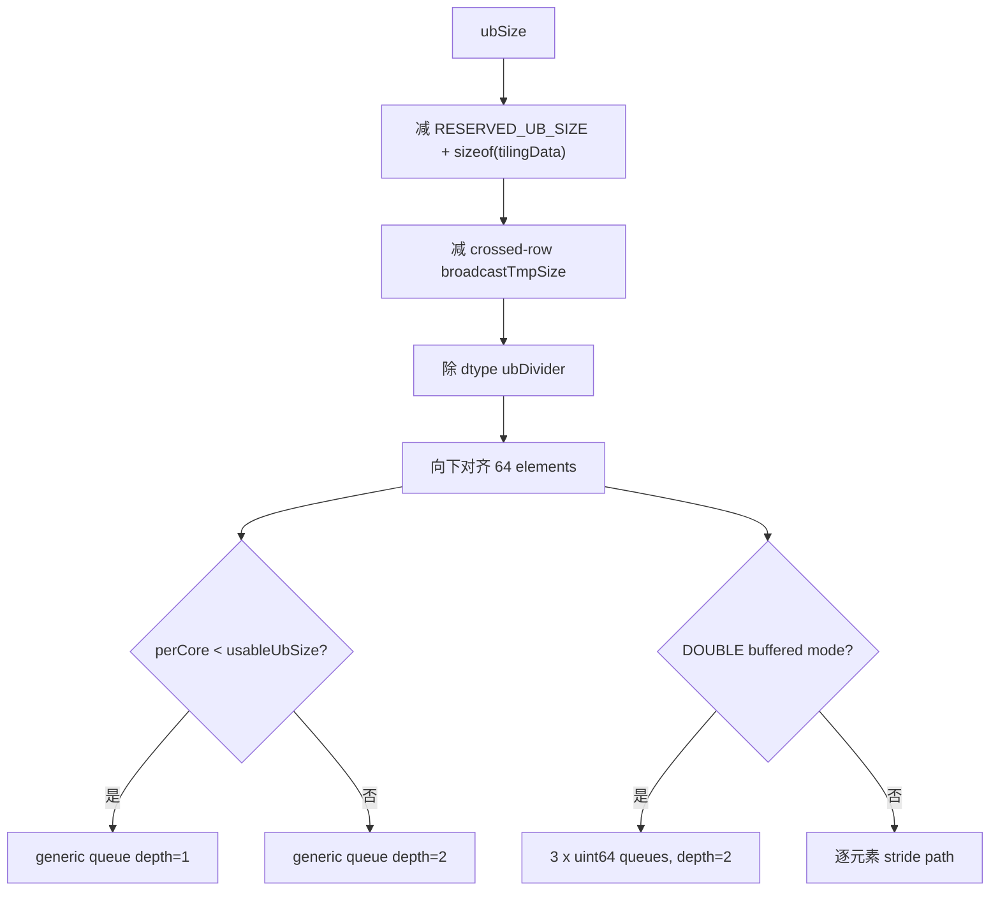

crossed-row 物理尾长为：

```text
physicalTailElements
  = ceil(tailElements * dtypeBytes / 32) * 32 / dtypeBytes
```

非对齐时以完整 row cycle 为 core 边界，保证 core 从可复用标量边界开始。INT64
用 UB-to-UB 扩展且 `broadcastTmpSize=0`；其他 dtype 对可复用 outer group 使用
软件扩展，否则通过 `GetBroadCastMaxMinTmpSize` 查询 UB 临时空间。

##### 5. Tiling data 契约与降级边界

| **字段组** | **单位/语义** | **Host/Kernel 不变量** |
| ---------- | ------------- | ---------------------- |
| `usableUbSize` | 单 tile 逻辑元素容量，不是字节 | Kernel 分配必须受该容量和物理行补齐共同约束 |
| `needCoreNum` | 实际 AIV block 数 | `SetBlockDim` 与 Kernel `coreNum` 一致 |
| `totalDataCount` | 输出逻辑元素数 | 不超过 `int64_t`，各 core 区间并集等于 `[0,total)` |
| `perCoreDataCount/tailDataCoreNum/lastCoreDataCount` | 逻辑元素 | 区间不重叠、不遗漏，最后一核不越界 |
| `blockAlignElements` | core 逻辑边界对齐元素数 | 不得切断 Kernel 要求的 row/row-cycle 边界 |
| `broadcastTmpSize` | UB 字节数 | 仅供 crossed-row BroadCast API，不计 GM workspace |
| `rank/outShape/x1Stride/x2Stride` | 最大 8 维；shape/stride 为元素单位 | 广播维 stride=0，地址反解不溢出 |
| `broadcastMode` | `FloorModBroadcastMode` | Host 分类与 Kernel 分发必须同步 |

公共 API/OpDef 拒绝非任务 dtype；Host 对非法 shape/rank/乘积返回 tiling 失败。
crossed-row 资源查询失败或 UB 容量为 0 时只降级到 stride-aware `GENERAL` 并
重算 tiling，不允许改走 AICPU，也不允许恢复输出规模 Broadcast。DOUBLE 的
crossed-row 由 `FloorModDouble` 逐元素 stride 寻址，同样保持 AI Core 和不落盘
约束。

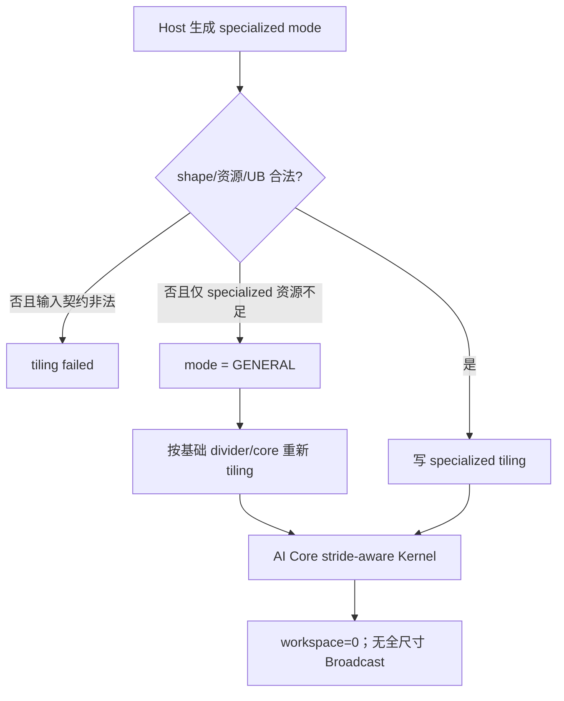

#### 3.2.2 kernel侧设计：

##### 1. Kernel 入口、Init 与 Process

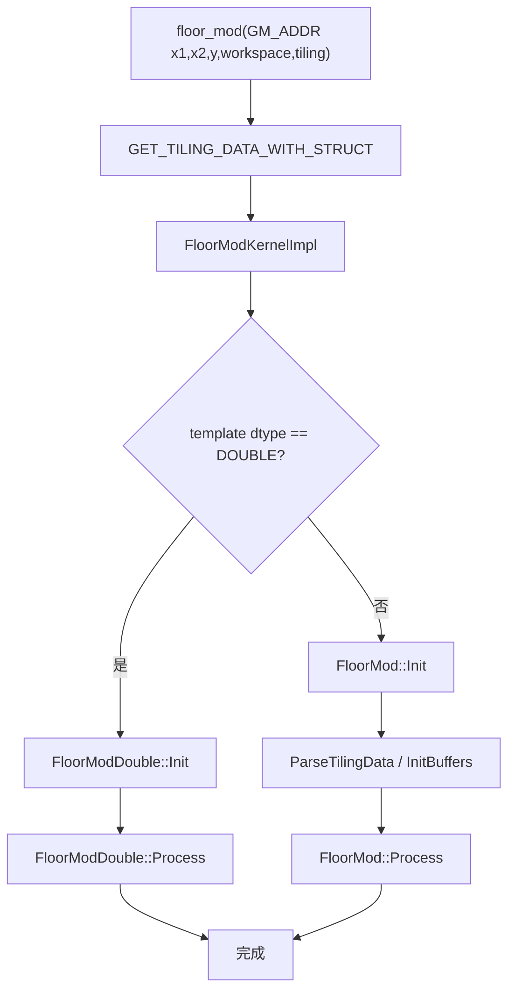

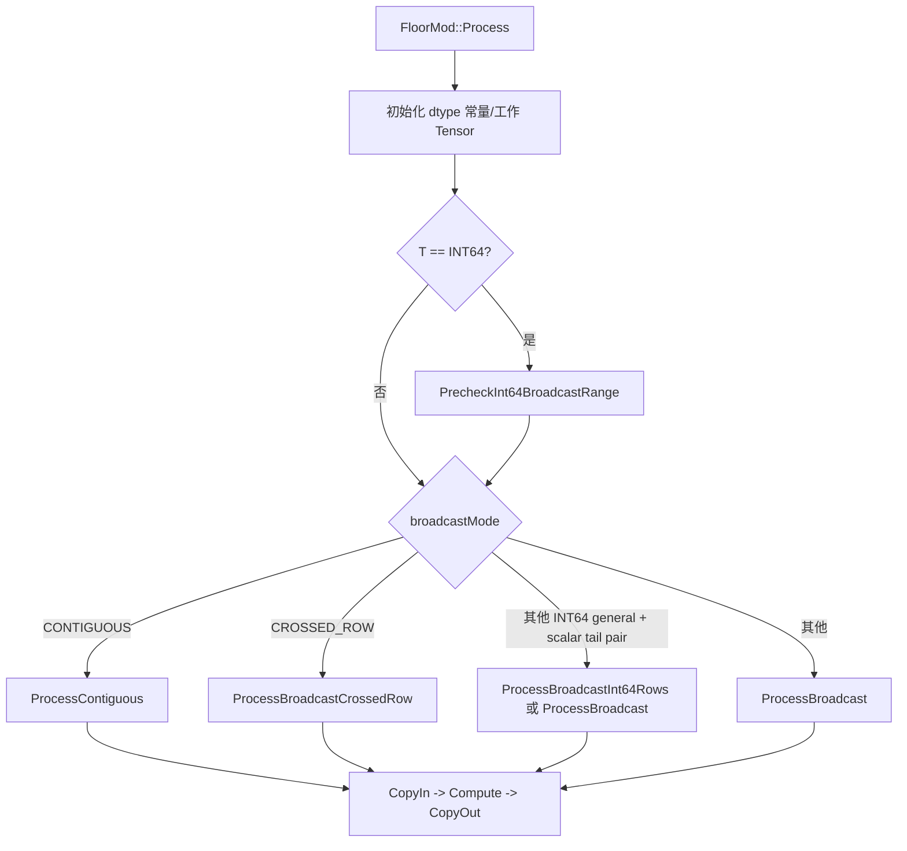

##### 2. 搬运、双缓冲和尾块

通用模板的 `ProcessContiguous` 逐 tile 执行
`CopyIn -> Compute -> CopyOut`。多 tile 时输入输出队列深度为 2，用于异步流水的
资源解耦；通用路径按 tile 顺序处理，不执行 next-tile prefetch。单 tile 使用
depth 1。

DOUBLE 的 `ProcessBuffered/ProcessTailBuffered` 先 enqueue 当前 tile，在循环内
enqueue 下一 tile 后再计算当前 tile，是明确的预取式双缓冲。TAIL 模式始终在
尾行边界截断，防止连续 DMA 跨到非连续源地址。


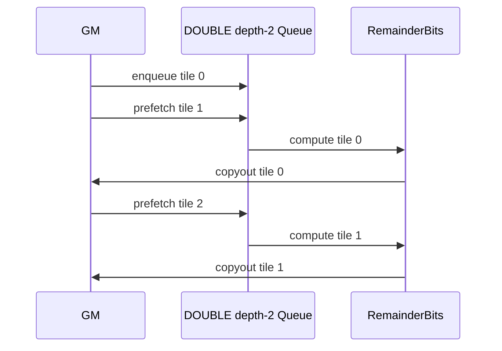

`DataCopyPad` 负责不足 32B 的 GM/UB 尾块。所有 core 的输出逻辑区间不重叠，
MTE3 只写真实逻辑元素；UB padding 不得写入下一逻辑行或相邻 core 区间。

##### 3. General 与 crossed-row 路径

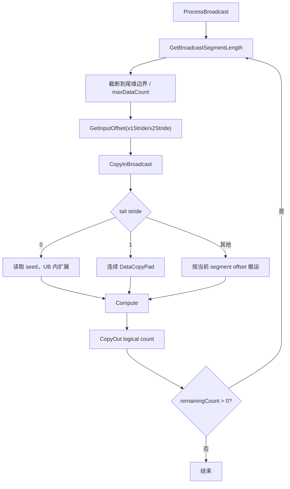

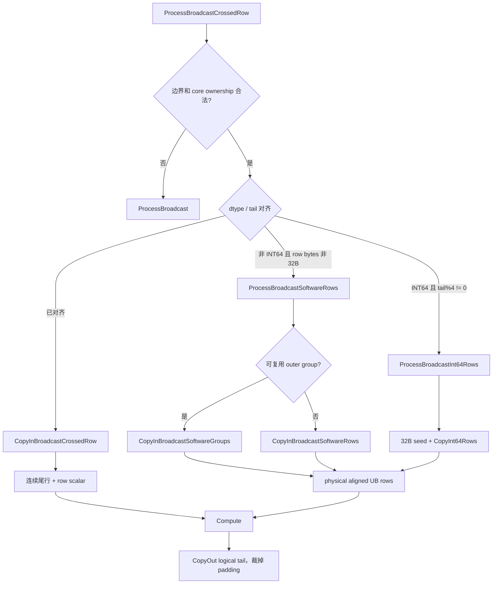

##### 4. dtype 计算设计

| **dtype** | **计算路径** | **关键边界** |
| --------- | ------------ | ------------ |
| FP16/BF16 | Cast FP32 后 Div/Floor/Mul/Sub，再 Cast 回 | Inf、NaN、异号修正 |
| FP32 | FP32 Div/Floor/Mul/Sub | Inf、NaN、异号修正 |
| INT32 | HIGH_PERFORMANCE FP32；HIGH_PRECISION 按 `2^24` 拆分 | 大整数精度 |
| INT64 | exact-FP32 范围向量计算，否则标量 `%` + 符号修正 | 严格 `<2^24`、零除、MIN/-1 |
| DOUBLE | IEEE754 bit-pattern + 整数长除法 | normal/subnormal、guard、nearest-even |

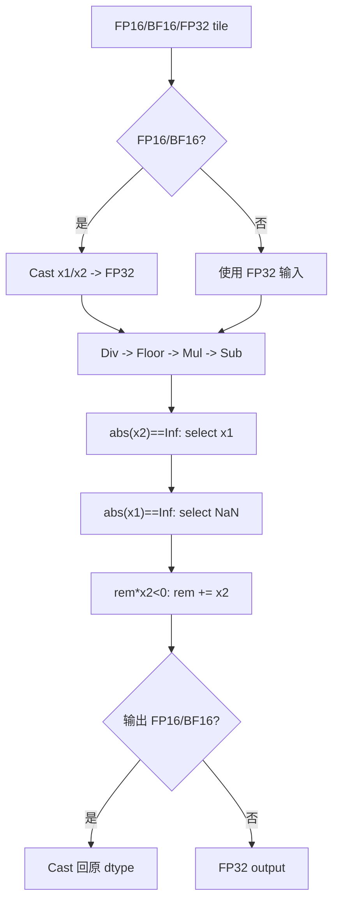

```mermaid
flowchart TD
    A["INT64 tile"] --> B{"高复用小输入已预检查?"}
    B -->|否| C["tile Cast + ReduceMax/ReduceMin"]
    B -->|是| D{"全部 abs < 2^24 且 divisor != 0?"}
    C --> D
    D -->|是| E["vector Div/Floor/Mul/Sub"]
    D -->|否| F["逐元素 INT64 %"]
    F --> G["显式处理 divisor=0 与 MIN/-1<br/>不执行非法 %"]
    G --> H["非零异号: remainder += divisor"]
    E --> I["INT64 output"]
    H --> I
```

DOUBLE 不允许通过 `Cast(DOUBLE -> FLOAT)` 缩窄。`FloorModDouble` 解析
sign/exponent/fraction，按指数差执行 mantissa 长除法；异号且余数非零时计算
`divisor - remainder`，再由 `Pack` 处理 normal、subnormal、零和 nearest-even。

```mermaid
flowchart TD
    A["RemainderBits(xBits, yBits)"] --> B["解析 sign/exponent/fraction"]
    B --> C{"NaN / x=Inf / y=0?"}
    C -->|是| D["quiet NaN pattern"]
    C -->|否| E{"x == 0?"}
    E -->|是| F["返回与 y 同号的 zero"]
    E -->|否| G{"y == Inf?"}
    G -->|是| H["同号返回 x；异号返回 y"]
    G -->|否| I["Decode mantissa/exponent"]
    I --> J{"exponentDelta < 0?"}
    J -->|同号| K["保留 abs(x)"]
    J -->|异号| L["SubtractBits(abs(y), abs(x))"]
    J -->|否| M["mantissa long division"]
    M --> N{"异号且 remainder != 0?"}
    N -->|是| O["y.mantissa - remainder"]
    N -->|否| P["保留 remainder"]
    K --> Q["Pack normal/subnormal"]
    L --> R["guard bits + nearest-even"]
    O --> Q
    P --> Q
    D --> S["写 uint64 bit pattern"]
    F --> S
    H --> S
    Q --> S
    R --> S
```

#### 3.2.3 关键内存与性能方案

##### 1. HBM/GM 生命周期

native path 的额外内存模型为：

```text
M_native_extra
  ~= M_result_optional
   + M_adapt
   + O(rank)
   + M_fixed

M_broadcast_intermediate_native = 0
M_kernel_workspace = 0
```

直接写连续同 dtype 的用户 `out` 时 `M_result_optional=0`；非连续输出、Cast 或
scalar squeeze 可保留一个私有结果。输入连续化也可能产生与原输入大小相关的
紧凑副本。设计保证不再产生与广播输出 `N` 等大的输入展开对象。

```mermaid
sequenceDiagram
    participant U as User Tensor GM
    participant A as ACLNN Adapt GM
    participant K as FloorMod Kernel
    participant O as Output GM
    Note over U,O: 原路径还存在 BroadcastTo self/other 的 N*S 生命周期
    U->>A: 必要时 Contiguous / Cast
    A->>K: 原始紧凑输入地址
    Note over K: shape/stride 为 O(rank)，workspace=0
    K->>K: 每 core UB tile 读取与计算
    K->>O: 直接写 out 或私有 result
    O->>O: 必要时 Cast / Squeeze / ViewCopy
```

##### 2. HBM 与 UB 分离

```mermaid
flowchart LR
    subgraph HBM["HBM / GM 峰值统计"]
        A["用户输入输出"]
        B["必要的 Contiguous / Cast / ViewCopy"]
        C["可选 FloorMod result"]
        D["Broadcast intermediate = 0"]
    end
    subgraph UB["每 AIV core LocalMemory"]
        E["input queues"]
        F["output queue"]
        G["dtype work tensors"]
        H["crossed-row physical row / tmp"]
    end
    I["FloorModTilingData O(rank)"] --> E
    A --> E
    F --> A
```

FloorMod Kernel 的 GM workspace 为 0。连续、同 dtype、direct-out 场景下，
完整 executor 只保留固定对齐项，归入 `M_fixed`，不承载广播数据且不随 shape
或 dtype 增长；非连续输入、promotion、非连续输出或 rank-0 squeeze 场景仍可能
出现 Contiguous/Cast/ViewCopy 等必要适配对象，但这些对象按真实输入或输出适配
归因，不是输出规模的输入 Broadcast 展开。native route 中两个输入保持紧凑
storage，输出规模的 Broadcast GM 中间量为 0；最终是否满足 5% 峰值差距以自测
报告的 NPU/GPU Device peak 数据为准。

##### 3. 性能设计

性能设计先消除两个 Broadcast task 和 GM 往返，再按访问规律选择 mode：连续和
尾连续保持大块 DMA，scalar/crossed-row 在 UB 复用，GENERAL 只对无法归类的
stride 做坐标反解。常规场景约 1024 元素/核，非对齐短行约 2048 元素/核；
FP/INT32 优先向量化，INT64 通过范围预检查扩大 exact-FP32 向量路径，DOUBLE
保持 AI Core 并对规则模式显式预取。

```mermaid
flowchart TD
    A["完整调用链性能"] --> B["先删除 BroadcastTo task + GM round trip"]
    B --> C{"访问模式"}
    C -->|连续/尾连续| D["大块 DMA + queue buffering"]
    C -->|scalar| E["一次读取 + UB 扩展"]
    C -->|crossed-row| F["row/group 复用 + 物理对齐"]
    C -->|general| G["尾段截断 + stride 反解"]
    D --> H{"dtype"}
    E --> H
    F --> H
    G --> H
    H -->|FP/INT32| I["vector core"]
    H -->|INT64| J["exact-FP32 vector / scalar modulo"]
    H -->|DOUBLE| K["bit-pattern + explicit prefetch"]
```

## 支持硬件

| **支持的芯片版本** | **涉及勾选** |
| ------------------ | ------------ |
| Atlas A2 训练系列产品（ASCEND910B） | √ |
| Atlas A3 训练系列产品（ASCEND910_93） | √ |

任务书适配硬件为 Atlas A2/A3 训练系列产品。当前 OpDef 在
`ascend910b` 配置下注册，A3 的 `Ascend910_93` 与 910B 属于同一 DAV_2201
任务平台，按同一 native route 验证。

## 算子约束限制

1. `self` 和 `other` 最多支持 8 维，shape 必须满足 Broadcast 规则。
2. 支持硬件为 Atlas A2/A3 训练系列产品（`ASCEND910B/ASCEND910_93`）。
3. Tensor-Tensor native 路径支持 BFLOAT16、FLOAT16、FLOAT、INT32、INT64、DOUBLE。
4. inplace 场景的广播结果 shape 必须等于 `selfRef` shape，不允许扩展 `selfRef`。
5. 其他架构保留既有兼容路径。

# 可维可测分析

## 精度标准/性能标准

| 验收标准 | 描述 | 标准来源 |
| --- | --- | --- |
| 功能与精度标准 | 结果与 PyTorch `torch.remainder` / 原算子一致，满足 AscendOpTest 默认阈值 | 社区任务书 |
| 内存标准 | 同条件 NPU/GPU Device 峰值内存差距小于 5%；设计上消除输出规模 Broadcast GM 中间量，最终以自测报告峰值数据确认 | 社区任务书 |
| 性能标准 | 优化后完整 ACLNN 调用链性能不低于原算子 | 社区任务书 |

### 特性交叉分析

#### 1. dtype 与 mode

| **交叉项** | **行为** | **资源/性能关注点** |
| ---------- | -------- | ------------------- |
| FP16/BF16/FP32 × contiguous/scalar/tail | 向量 FP32 核心 | DMA、Cast、queue 流水 |
| FP/INT32 × crossed-row | 对齐行/软件 group | padding 不写 GM |
| INT64 × broadcast | seed/UB copy，向量或 `%` | 对齐与范围判定 |
| DOUBLE × buffered modes | depth-2 显式预取 | 长除法计算吞吐 |
| DOUBLE × general/crossed-row | stride 逐元素 | 不得 Cast 或 AICPU |

#### 2. view、inplace 与结果对象

| **输入/输出组合** | **FloorMod 输出策略** | **GM 中间边界** |
| ----------------- | --------------------- | ---------------- |
| 连续、同 dtype、out-of-place | 直接写用户 `out` | 无私有 result、无 Broadcast Tensor |
| 连续 inplace | `out=selfRef`，tile 先读 UB 后写回 | 无私有 result；self 不允许被扩展 |
| 非连续输出 | 私有 result + ViewCopy | 可有 result，不得有 `N*S` 输入展开 |
| promotion / 输出 Cast | 计算 dtype result + Cast | 适配对象单独归因 |
| rank-0 | 单元素 `[1]` 归一 + Squeeze | O(1) BroadcastTo，不计为全尺寸展开 |

#### 3. 架构与 route

| **条件** | **ACLNN Broadcast** | **FloorMod route** |
| -------- | ------------------- | ------------------ |
| 910B/910_93 + 六种 dtype | 不物化输出规模输入 | AI Core |
| native route crossed 资源不足 | 不物化；mode 回退 GENERAL | AI Core |
| native route DOUBLE | 不物化、不缩窄 | `FloorModDouble` AI Core |
| 非 native 条件 | 保留既有兼容适配 | 按既有 route 执行 |

### 验证方法与判定口径

按任务书判定：结果与 PyTorch/原算子一致，精度满足 AscendOpTest 默认阈值，
完整调用链性能不回退；内存验收以同条件 NPU/GPU Device 峰值差距小于 5% 为
通过标准。设计文档证明 native route 不再包含输出规模 Broadcast GM 中间量，
自测报告需给出实际 peak 数据完成闭环。

```text
gap = abs(peakNpu - peakGpu) / peakGpu
pass_memory = gap < 0.05
pass_performance = latencyOptimized <= latencyOriginal
```

峰值统计覆盖完整 executor 生命周期；UB 不计入 HBM，固定 512B executor
对齐项单列。native route 的峰值模型不包含两个 `N*S` 输入展开对象。

```mermaid
flowchart TD
    A["同 shape / dtype / API 语义"] --> B["PyTorch / 原算子功能参考"]
    A --> C["原 ACLNN 完整调用链"]
    A --> D["优化 ACLNN 完整调用链"]
    A --> E["GPU peak memory"]
    B --> F["输出 / 特殊值 / dtype 比对"]
    C --> G["original latency + task sequence"]
    D --> H["optimized latency + task sequence"]
    D --> I["NPU Device peak"]
    H --> J["无全尺寸 BroadcastTo / 无 AICPU"]
    G --> K{"optimized <= original?"}
    H --> K
    I --> L["abs(NPU-GPU)/GPU"]
    E --> L
    L --> M{"gap < 5%?"}
```

## 兼容性分析

### 稳定性与兼容性设计

稳定性设计不依赖跨核 workspace 或同步：每个 core 根据 tiling 计算独立输出区间，
只读输入 GM、只写所属输出区间；动态 shape 的所有地址参数由 Host 校验后下发。
specialized mode 的资源条件不成立时退回 GENERAL，而不是用未校验参数继续执行。

兼容性边界如下：

| **边界** | **兼容策略** |
| -------- | ------------ |
| 公共接口 | out-of-place/inplace ABI、参数顺序、错误码和 executor 两段式调用不变 |
| Tensor view | 输入由 Contiguous 适配，非连续输出由 ViewCopy 保持 storage offset/stride 语义 |
| rank-0 / empty | rank-0 规范为单元素后 squeeze；empty 不下发 FloorMod Kernel |
| Tensor-Tensor | 910B/910_93 六 dtype 使用 native stride-aware route |
| Tensor-Scalar / Scalar-Tensor | 保持既有公共路径，不把本任务结论外推到其他 overload |
| 其他架构 | 保留既有兼容适配 |
| 算子注册 | OpDef 原型与 dtype/format 不新增 attr，不改变图侧调用契约 |

维护边界由四个契约组成：API route 决定是否允许物化 Broadcast；Host mode 决定
Kernel 数据搬运；tiling data 规定字段单位和 core ownership；dtype tiling key
决定计算实现。任何一层变更都必须沿依赖方向同步，不能只改局部常量或单个 case。

| **设计边界** | **影响** | **实现防护** |
| ------------ | -------- | ------------ |
| shape/stride 乘积超出表示范围 | GM offset 回绕 | rank≤8，Host 使用 `CheckedMultiply` 并校验输出 shape |
| short-row 逻辑长度与物理对齐长度不同 | 尾块或相邻 core 越界 | logical/physical tail 分离，CopyOut 只写真实逻辑元素 |
| specialized mode 资源不满足 | crossed-row 路径无法执行 | Host 重算 `GENERAL` tiling，保持 AI Core 和不落盘广播 |
| UB 预算与 TQue/TBuf 不一致 | LocalMemory 越界 | divider、extra reserve、`broadcastTmpSize` 与 Kernel 资源一一对应 |
| INT64 超出 FP32 精确整数范围 | 余数精度错误 | 严格 `<2^24` 判定，超出范围使用标量 `%` 和符号修正 |
| INT64 除数为 0 或 `MIN/-1` | C++ 非法除法 | 执行 `%` 前显式分支，不下发非法运算 |
| DOUBLE normal/subnormal 与舍入边界 | FP64 bit pattern 错误 | Decode/Pack、guard bit 和 nearest-even 处理 |
| Tensor-Tensor native route 路由偏移 | 误入 AICPU 或恢复全尺寸 Broadcast | `IsNativeBroadcastFloorModType` 集中选路，FloorMod overload 固定使用 `FloorModAiCore` |
| 非连续输出、promotion 或 rank-0 适配 | 不能直接写公共输出 | 使用私有 result 及 Cast/Squeeze/ViewCopy，不引入输入广播展开 |
| inplace 输出 shape 扩展 | 覆盖 `selfRef` storage 边界 | API 强制广播结果 shape 等于 `selfRef` shape |
| Host/Kernel key、mode 或字段单位不一致 | 分发错误或资源越界 | dtype tiling key、broadcast mode 和 tiling data 职责分离 |

```mermaid
flowchart LR
    A["shape / mode 变更"] --> B["GetBroadcastInfo"]
    B --> C["FloorModTilingData"]
    C --> D["Kernel Process 分发"]
    E["TQue / TBuf 变更"] --> F["UB divider / extra reserve"]
    F --> C
    G["dtype 变更"] --> H["OpDef + tiling key + Compute"]
    H --> F
    I["API route / output 变更"] --> J["内存生命周期 + alias"]
    J --> K["route / peak / latency 验收"]
    D --> K
```
