# 需求背景（required）

## 需求来源

基于 TBE FloorMod 历史版本，使用 Ascend C 对
`aclnnRemainderTensorTensor` 进行内存与性能优化。原 ACLNN 在调用 FloorMod 前
把输入广播到输出 shape，产生随广播结果线性增长的 GM 中间 Tensor。社区任务
要求在保持 remainder 语义、六种 dtype、公共 ABI 和 view/inplace 行为不变的
前提下，使 NPU/GPU 峰值内存差距小于 5%，且性能不低于原算子。本设计采用
stride-aware FloorMod，在 Kernel 内完成广播寻址。

对于可广播的 `self`、`other`，逐元素语义为：

```text
out = self - trunc(self / other) * other
```

若非零结果与 `other` 异号，则 `out += other`（使结果与除数同号，对齐 PyTorch
`torch.remainder` 语义）。采用 `trunc` + 符号修正而非 `floor`，避免 `Div`
倒数乘法在整数边界处的精度问题（`Floor(-1.0000001)=-2`，而 `Trunc` 向零截断
返回 `-1`，更稳健）。浮点保持 NaN、Inf 和零除数行为，整数避免零除数。

原 ACLNN Tensor-Tensor 主链如下。这里的 `BroadcastTo` 是输出规模的 GM Tensor，
也是本任务需要消除的对象。

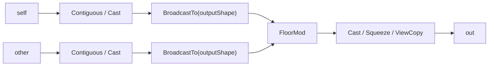

设两输入元素数为 `N1`、`N2`，广播输出元素数为 `N`，计算 dtype 字节数为
`S`。原路径的逻辑额外内存近似为：

```text
M_original_extra
  ~= I(N1 != N) * N*S
   + I(N2 != N) * N*S
   + M_result
   + M_adapt
   + M_fixed
```

`M_result` 为 FloorMod 私有结果，`M_adapt` 为 Contiguous/Cast/Squeeze/ViewCopy，
`M_fixed` 为 executor 固定项。只缩小 UB 或优化 Broadcast Kernel 无法消除两个
`N*S` 级对象。

## 背景介绍

### aclnnRemainderTensorTensor算子实现优化

本任务面向 Atlas A2/A3 训练系列产品，在不改变公共 ACLNN ABI、输出语义和原有
功能的前提下，将广播寻址融合到 FloorMod Kernel。实现中删除 ACLNN 侧
`BroadcastTo(outputShape)` 形成的全尺寸 GM 中间 Tensor，使同条件 NPU/GPU
Device 峰值内存差距小于 5%；性能设计删除 Broadcast 任务和 GM 往返，
并按访问模式选择搬运路径。

### aclnnRemainderTensorTensor算子TBE实现现状分析

TBE算子源码路径：`${ASCEND_INSTALL_PATH}/opp/built-in/op_impl/ai_core/tbe/impl/ops_legacy/dynamic/floor_mod.py`

#### 1. 算子原型与能力边界

```cpp
REG_OP(FloorMod)
    .INPUT(x1, TensorType({DT_INT32, DT_INT64, DT_FLOAT,
                           DT_FLOAT16, DT_DOUBLE, DT_BF16}))
    .INPUT(x2, TensorType({DT_INT32, DT_INT64, DT_FLOAT,
                           DT_FLOAT16, DT_DOUBLE, DT_BF16}))
    .OUTPUT(y, TensorType({DT_INT32, DT_INT64, DT_FLOAT,
                           DT_FLOAT16, DT_DOUBLE, DT_BF16}))
    .OP_END_FACTORY_REG(FloorMod)
```

| **项目** | **TBE / 910B 事实** |
| -------- | ------------------- |
| 输入输出 | 两输入一输出，同 dtype，可广播 |
| GE 原型 attr | 无显式 attr |
| 动态 TBE dtype | FP16、FP32、INT32、BF16；平台支持时含 INT64 |
| 910B op info | FP16、FP32、INT32、INT64、BF16，ND；不含 DOUBLE |
| shape | 动态 shape/rank，elementwise broadcast |

#### 2. TBE Compute 流程

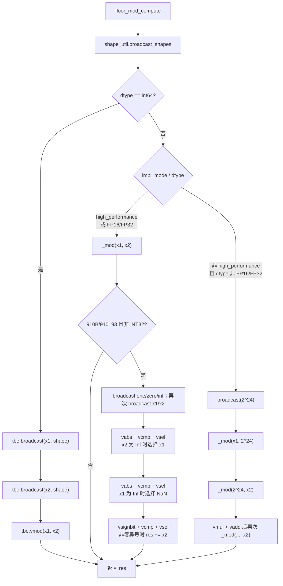

### aclnnRemainderTensorTensor算子功能分析

`aclnnRemainderTensorTensor` 对两个 Tensor 执行逐元素 floor modulus。输入 shape
按尾维对齐并遵循广播规则，输出 shape 为广播结果；输入经过类型推导后使用共同
计算 dtype。优化前后的数学语义、异常处理、非连续 Tensor 适配和 inplace 约束
保持不变，仅改变广播数据的产生方式。

| 参数 | 参数含义 | 支持数据类型 | 数据格式 | shape |
| --- | --- | --- | --- | --- |
| `self` | 被除数 Tensor | INT32、INT64、FLOAT16、FLOAT、DOUBLE、BFLOAT16 | ND | rank 0-8 |
| `other` | 除数 Tensor | 同 `self`，并满足类型推导规则 | ND | 与 `self` 可广播 |
| `out` | 余数结果 | 与计算 dtype 一致 | ND | 广播结果 shape |

# 需求分析（required）

## 需求描述

使用 Ascend C 优化 `aclnnRemainderTensorTensor` 的 Tensor-Tensor 广播路径。目标
Kernel 根据输出坐标和输入 stride 直接读取紧凑输入，不再预先生成输出 shape
大小的广播 Tensor；结果与 PyTorch `torch.remainder` 及原算子一致，完整调用链
性能不低于原算子，同条件 NPU/GPU Device 峰值内存差距小于 5%。

## 需求拆解

1. 保持 out-of-place 与 inplace 两段式 ACLNN 接口及参数校验行为不变。
2. 支持两个 Tensor 输入及 scalar、连续、尾连续和通用广播场景。
3. 覆盖 INT32、INT64、FLOAT16、FLOAT、DOUBLE、BFLOAT16 六种任务 dtype。
4. 消除输出规模的 Broadcast GM 中间 Tensor，FloorMod Kernel workspace 为 0。
5. 覆盖功能、精度、特殊值、内存峰值、完整调用链性能和路由验证。

### 外部组件依赖

不涉及额外外部组件依赖。

### 内部适配模块

| **模块** | **职责与边界** |
| -------- | -------------- |
| ACLNN API | 参数校验、promotion、连续化、rank-0 归一、输出适配和 route 选择 |
| OpDef / InferShape | 声明六种 dtype、ND、动态 shape/rank，执行 `InferShape4Broadcast` |
| Op Host | 生成广播 shape/stride、mode、分核、UB 预算和 tiling key |
| Op Kernel | 按 stride 读取紧凑输入，完成 dtype 计算、尾块和写回 |

### 设计硬约束

| **维度** | **约束** |
| -------- | -------- |
| 功能 | 与 PyTorch remainder 语义及既有异常/特殊值行为一致 |
| 内存 | 目标路径不得创建输出规模的 Broadcast Tensor；Kernel workspace 为 0 |
| 性能 | 完整 ACLNN 调用链不低于原算子，不用单 Kernel 结果替代 |
| 精度 | 计算精度满足 AscendOpTest 工具默认阈值 |
| 扩展 | mode 与 dtype tiling key 解耦，新增模式不改变公共 ABI |

### 算子支持型号

Atlas A2/A3 训练系列产品（`ASCEND910B/ASCEND910_93`）。代码侧
`FloorMod` AICore 配置使用 `ascend910b` 和 `ascend910_93`，二者同属 DAV_2201
架构，按同一任务平台 route 处理。

# 详细设计（required）

## 算子分析

### 数学公式

对于广播后的每个逻辑位置，计算公式为：

$$
out_i = self_i - \text{trunc}\!\left(\frac{self_i}{other_i}\right) \times other_i
$$

若非零结果与 `other` 异号，则 `out += other`。等价于
`out = self - floor(self/other) * other`，但采用 `trunc` + 符号修正方式，
避免 `Floor` 对 `Div` 倒数乘法精度边界敏感的问题。浮点路径需处理 NaN、Inf
和零除数；整数路径需规避除数为 0。

### 支持数据类型

| 输入/输出 | 支持数据类型 | 计算说明 |
| --- | --- | --- |
| `self` / `other` / `out` | FLOAT16、BFLOAT16、FLOAT、INT32、INT64、DOUBLE | ACLNN 先完成类型推导；FloorMod 三端 dtype 一致 |

### 支持形状

- 支持 ND 格式和 rank 0-8。
- `self` 与 `other` 从尾维对齐，每个对齐维度相等或至少一侧为 1。
- `out` shape 必须等于两个输入的广播结果。
- 支持 rank-0 Tensor、空 Tensor、连续 Tensor 和由 ACLNN 连续化后的非连续 Tensor。

## 算子实现

### 使能方式

| **上层框架**     | **涉及的框架勾选** |
| ---------------- | ------------------ |
| TF训练/推理      |                    |
| Pytorch训练/推理 |                    |
| ATC推理          |                    |
| Aclnn直调        | √                  |
| OPAT调优         |                    |
| SGAT子图切分     |                    |

### 实现方案

本次任务代码位于 `experimental/math/floor_mod`，核心文件与职责如下：

| **路径** | **职责** |
| -------- | -------- |
| `op_api/aclnn_remainder.cpp` | 两段式 ACLNN 参数校验、dtype promotion、route 选择、Cast/ViewCopy 输出适配 |
| `op_host/floor_mod_def.cpp` | FloorMod OpDef，声明 BF16/FP16/FP32/INT32/INT64、ND、动态 shape/rank |
| `op_host/floor_mod_infershape.cpp` | 使用 `InferShape4Broadcast` 推导输出 shape |
| `op_host/floor_mod_tiling.cpp` | 生成广播 shape/stride、broadcast mode、分核、UB 预算、tiling key 和 workspace=0 |
| `op_kernel/floor_mod.cpp` / `op_kernel/floor_mod.h` | AI Core kernel，按 tiling data 进行 stride-aware CopyIn、计算和 CopyOut |
| `op_kernel/floor_mod_tiling_data.h` / `floor_mod_tiling_key.h` | Host/Kernel 共享的 tiling data 与 dtype template key 定义 |

#### 1. 候选方案与选择

| **方案** | **内存效果** | **性能与语义** | **结论** |
| -------- | ------------ | -------------- | -------- |
| 保留 ACLNN `BroadcastTo`，只优化其 Kernel | `N*S` 级 GM 对象仍存在 | 多任务、多次 GM 往返 | 不采用 |
| 强制把 out-of-place 改成真正 inplace | 可少一个结果对象 | 破坏公共输出与 alias 语义，且不能消除另一输入广播 | 不采用 |
| workspace 分块广播后调用 FloorMod | 中间区由 `N*S` 降为 tile | 仍增加 GM 往返、workspace 和任务边界 | 不采用 |
| stride-aware 融合 FloorMod | Broadcast GM 中间为 0 | 单任务内按需读取，可按模式优化 | 采用 |

选择"不落盘 Broadcast"，而非依赖 inplace 才节省内存：out-of-place 可直接写
用户 `out`，公共 inplace 只是把 `selfRef` 作为合法输出的一种形式；两者复用
同一套 stride-aware Host/Kernel。

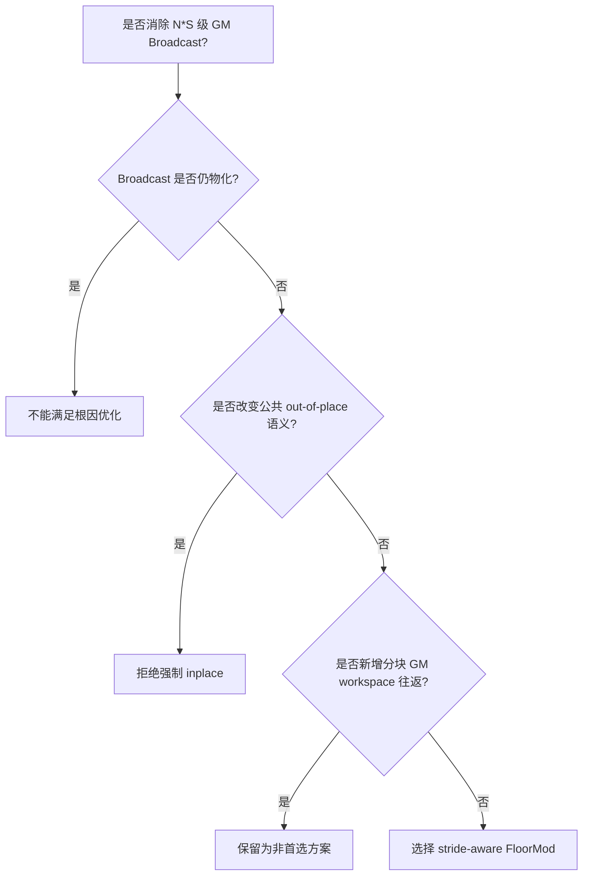

#### 2. 总体数据流

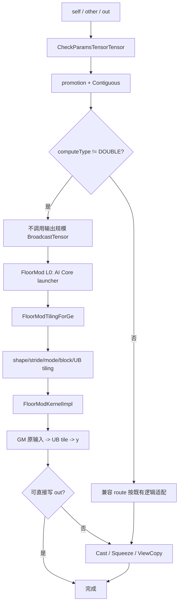

#### 3. Route 设计

将 aclnn 层分支判断从 `IsRegBase()` 改为 `computeType != DT_DOUBLE`，使所有
平台的 AICore dtype（FP32/FP16/BF16/INT32）及 INT64 路径均跳过显式
BroadcastTo，由 kernel/AICPU 原生处理广播。DOUBLE 保留原有 BroadcastTo 回退
路径（AICPU DOUBLE 不支持原生广播，且非任务重点）。

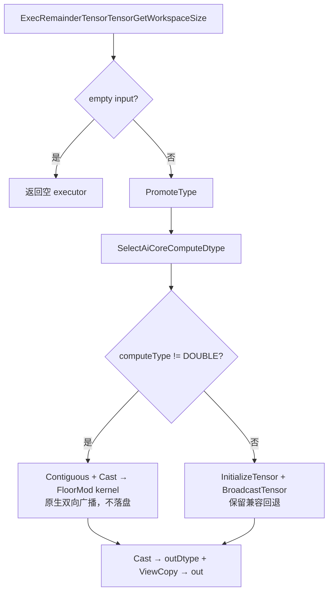

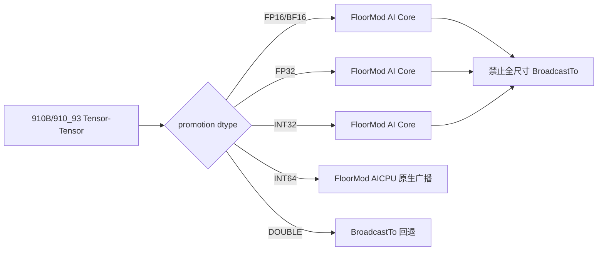

#### 4. ACLNN 输出与 inplace 语义

`RemainderMainProcess` 在计算 dtype 等于输出 dtype时，由 FloorMod 产生私有
结果，再执行必要的 Cast、Squeeze、ViewCopy。全尺寸 Broadcast 输入中间
Tensor 在输出路径中为 0；私有结果和输出适配 Tensor 按实际场景保留。

inplace 校验要求广播结果 shape 等于 `selfRef` shape，禁止扩展 `selfRef`。各
core 只写不重叠区间，tile 在写回前已将两个输入搬入 UB，因此 API 声明的
`y == selfRef` 读后写关系成立。

### Host 侧设计

#### 1. InferShape、dtype 与 format

OpDef 为三端声明相同的六种 dtype、ND format 和动态 shape/rank；
`InferShape4Broadcast` 推导输出。Tiling 再次校验描述符 dtype 一致、rank 不超过
8、输入可广播、输出 storage shape 等于广播结果。

#### 2. Host Tiling 总流程

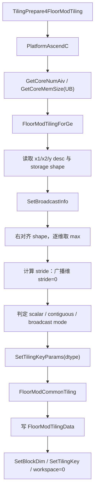

#### 3. Broadcast metadata 与 mode

右对齐后，输入线性地址为：

```text
inputOffset = sum(coord[d] * inputStride[d])
broadcast dimension => inputStride[d] = 0
```

mode 如下：

| **mode** | **判定重点** | **Kernel 目标** |
| -------- | ------------ | --------------- |
| `CONTIGUOUS` | 两输入元素数均等于输出 | 连续 DMA |
| `X1_SCALAR` / `X2_SCALAR` | 一侧单元素、另一侧等于输出 | 单次标量读取后 UB 扩展 |
| `GENERAL` | 其余 stride 组合 | 分段坐标反解 |

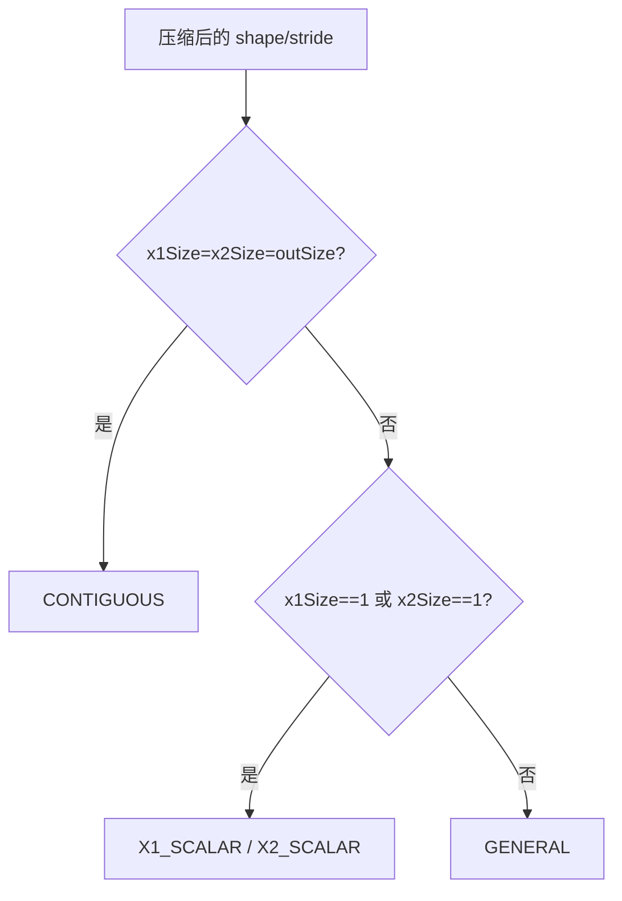

#### 4. 分核与 UB 预算

常规请求核数为 `ceil(totalElements/1024)`，不超过平台 AIV 核数；每核逻辑区间
按 `DATA_BLOCK(64)` 分配，余量由 `tailDataCoreNum` 和 `lastCoreDataCount`
表达。

UB 先扣除固定保留和 tiling data，再按 dtype divider 计算单 tile 元素数并向
64 元素对齐。通用模板一核单 tile 时使用 queue depth 1，多 tile 时使用 depth 2。

```text
usableUbSize = (ubSize - RESERVERD_UB_SIZE - sizeof(FloorModTilingData)) / ubDivider
// ubDivider: FP32=53, FP16/BF16=49, INT32=53
usableUbSize = usableUbSize / DATA_BLOCK * DATA_BLOCK  // 按 64 对齐
```

| **dtype** | **ubDivider** | **说明** |
| --------- | ------------- | -------- |
| FP32 | 53 | 输入队列×2 + 输出队列×2 + FP32 计算buffer + 常量buffer + sharedTmpBuffer |
| FP16/BF16 | 49 | 额外 x1/x2 FP32 转换 buffer，输入队列按 2 字节 |
| INT32 | 53 | 复用 FP32 计算路径，buffer 结构同 FP32 |

#### 5. Tiling data 契约

| **字段组** | **单位/语义** | **Host/Kernel 不变量** |
| ---------- | ------------- | ---------------------- |
| `usableUbSize` | 单 tile 逻辑元素容量 | Kernel 分配受该容量约束 |
| `needCoreNum` | 实际 AIV block 数 | `SetBlockDim` 与 Kernel `coreNum` 一致 |
| `perCoreDataCount/tailDataCoreNum/lastCoreDataCount` | 逻辑元素 | 区间不重叠、不遗漏 |
| `needBroadcast` | 是否需要广播 | Kernel 据此选择 Process 路径 |
| `isInputNScalar/isInputNContiguous` | 输入状态 | Kernel CopyIn 据此选择搬运方式 |
| `rank/outShape/x1Stride/x2Stride` | 最大 8 维，元素单位 | 广播维 stride=0 |

### Kernel 侧设计

#### 1. Kernel 入口、Init 与 Process

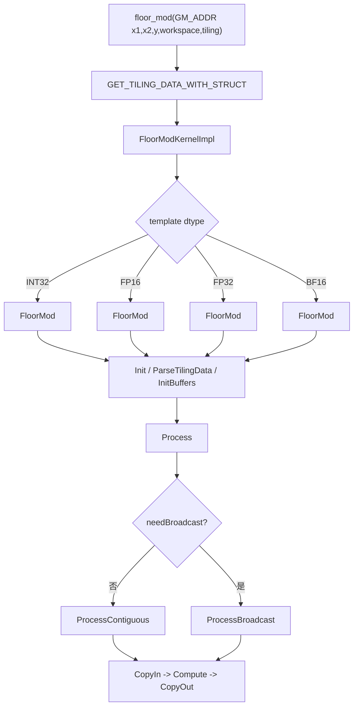

#### 2. 搬运、双缓冲和尾块

`ProcessContiguous` 逐 tile 执行 `CopyIn -> Compute -> CopyOut`。多 tile 时
输入输出队列深度为 2，用于异步流水；单 tile 使用 depth 1。

`ProcessBroadcast` 按 `GetMinContiguousCopyCount` 计算当前偏移下两个输入的
最长连续段，减少 DataCopy 次数。

`DataCopyPad` 负责不足 32B 的 GM/UB 尾块。所有 core 的输出逻辑区间不重叠，
MTE3 只写真实逻辑元素。


#### 3. CopyIn 数据搬入（三分支）

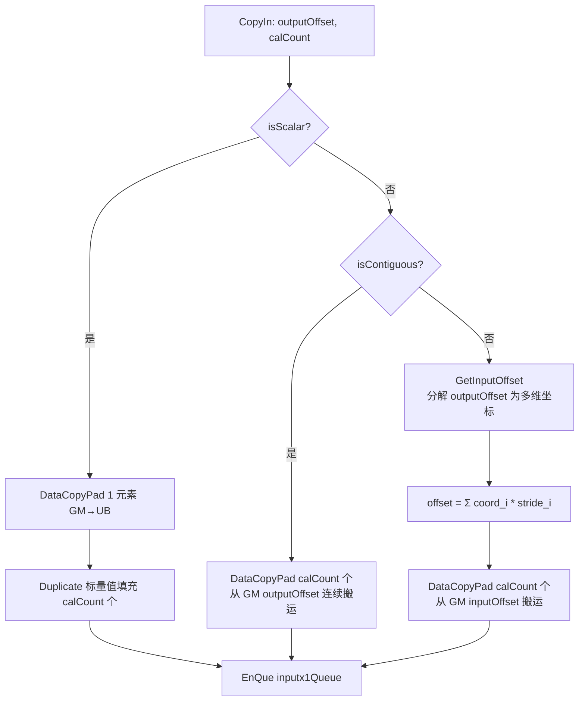

#### 4. dtype 计算设计

| **dtype** | **计算路径** | **关键边界** |
| --------- | ------------ | ------------ |
| FP16/BF16 | Cast FP32 后 Div/Trunc/Mul/Sub，再 Cast 回 | Inf、NaN、异号修正 |
| FP32 | FP32 Div/Trunc/Mul/Sub | Inf、NaN、异号修正 |
| INT32 | Cast FP32 后复用 FP32 路径，Cast 回 INT32 | 大整数精度（<2^24 无损） |
| INT64 | AICPU 原生广播 + FloorMod | 零除数 |
| DOUBLE | BroadcastTo 回退 + FloorMod | 非任务重点 |

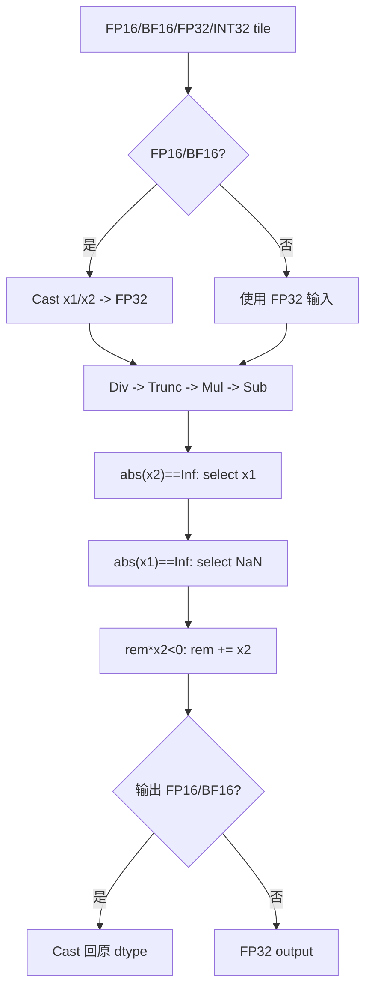

**Trunc vs Floor 精度分析**：Ascend `Div` 使用倒数乘法实现（`a/b = a*(1/b)`），
FP32 倒数存在 ULP 级误差。当 `self/other` 接近整数时，`Floor` 可能因
`-0.9999999` 被倒数误差推到 `-1.0000001` 而返回 `-2`（正确为 `-1`），导致
结果偏差一个 `other`。`Trunc` 向零截断，对 `-0.9999999` 和 `-1.0000001`
均返回 `0`（对应 `floor` 的 `-1`），再由符号修正块统一调整为正确余数，
精度更稳健。

### 关键内存与性能方案

#### 1. HBM/GM 生命周期

native path 的额外内存模型为：

```text
M_native_extra
  ~= M_result_optional
   + M_adapt
   + O(rank)
   + M_fixed

M_broadcast_intermediate_native = 0
M_kernel_workspace = 0
```

直接写连续同 dtype 的用户 `out` 时 `M_result_optional=0`；非连续输出、Cast 或
scalar squeeze 可保留一个私有结果。设计保证不再产生与广播输出 `N` 等大的输入
展开对象。

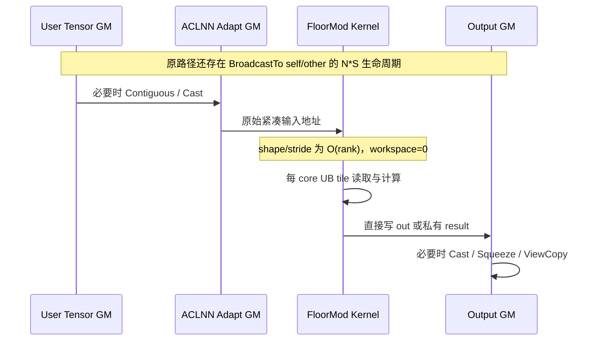

#### 2. 内存分析

以 broadcast 场景 `self: (M, N) + other: (N,)`，FP32 为例（dtype_bytes = 4）：

**优化前（else 分支，显式 BroadcastTo）：**

| 中间 tensor | 大小 | 说明 |
|------------|------|------|
| selfContiguous | M×N×4 | Contiguous |
| otherContiguous | N×4 | Contiguous |
| selfBroadcast | M×N×4 | BroadcastTo 膨胀 |
| otherBroadcast | M×N×4 | BroadcastTo 膨胀 |
| floorModOut | M×N×4 | 计算结果 |
| castOut | M×N×4 | 类型转换 |
| **总计** | **≈ 4×M×N + N** | 中间膨胀约 50% |

**优化后（kernel 原生广播，不落盘）：**

| 中间 tensor | 大小 | 说明 |
|------------|------|------|
| selfContiguous | M×N×4 | Contiguous |
| otherContiguous | N×4 | Contiguous（不膨胀） |
| floorModOut | M×N×4 | kernel 内部广播计算，不落盘 |
| castOut | M×N×4 | 类型转换 |
| **总计** | **≈ 2×M×N + N** | 膨胀消除 |

膨胀消除量：`2×M×N` bytes，降幅约 50%。实测所有场景 NPU 与 GPU 差距 < 0.02%。

#### 3. 性能设计

性能设计先消除两个 Broadcast task 和 GM 往返，再按访问规律选择 mode：连续
保持大块 DMA，scalar 在 UB 复用，GENERAL 对 stride 做坐标反解。

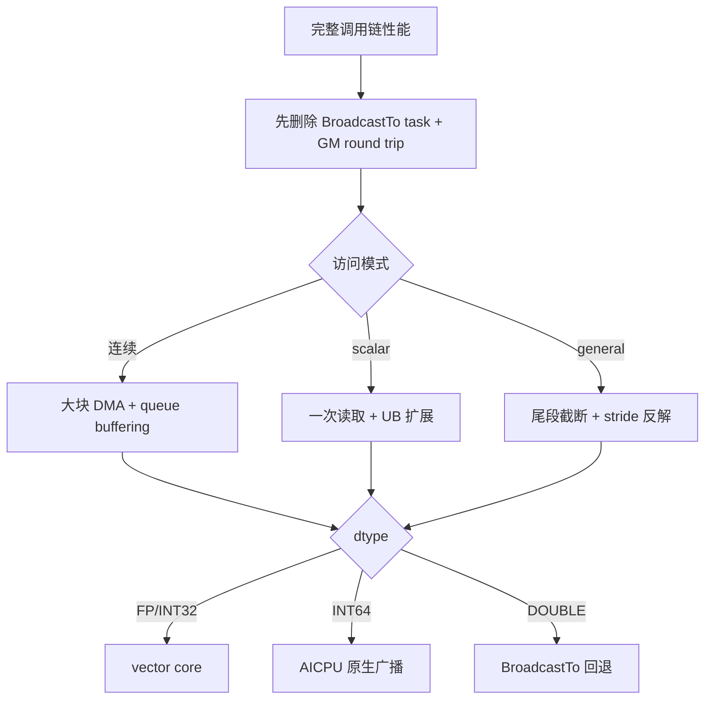

## 支持硬件

| **支持的芯片版本** | **涉及勾选** |
| ------------------ | ------------ |
| Atlas A2 训练系列产品（ASCEND910B） | √ |
| Atlas A3 训练系列产品（ASCEND910_93） | √ |

## 算子约束限制

1. `self` 和 `other` 最多支持 8 维，shape 必须满足 Broadcast 规则。
2. 支持硬件为 Atlas A2/A3 训练系列产品（`ASCEND910B/ASCEND910_93`）。
3. Tensor-Tensor native 路径支持 BFLOAT16、FLOAT16、FLOAT、INT32、INT64。
4. DOUBLE 保留 BroadcastTo 兼容回退路径。
5. inplace 场景的广播结果 shape 必须等于 `selfRef` shape，不允许扩展 `selfRef`。
6. 其他架构保留既有兼容路径。

# 特性交叉分析

#### 1. dtype 与 mode

| **交叉项** | **行为** | **资源/性能关注点** |
| ---------- | -------- | ------------------- |
| FP16/BF16/FP32 × contiguous/scalar | 向量 FP32 核心 | DMA、Cast、queue 流水 |
| FP/INT32 × general broadcast | stride 反解 | 分段搬运效率 |
| INT64 × broadcast | AICPU 原生 | AICPU 调度开销 |
| DOUBLE × 回退 | BroadcastTo + FloorMod | 内存膨胀（非任务重点） |

#### 2. view、inplace 与结果对象

| **输入/输出组合** | **FloorMod 输出策略** | **GM 中间边界** |
| ----------------- | --------------------- | ---------------- |
| 连续、同 dtype、out-of-place | 直接写用户 `out` | 无私有 result、无 Broadcast Tensor |
| 连续 inplace | `out=selfRef`，tile 先读 UB 后写回 | 无私有 result |
| 非连续输出 | 私有 result + ViewCopy | 可有 result，不得有 `N*S` 输入展开 |
| promotion / 输出 Cast | 计算 dtype result + Cast | 适配对象单独归因 |
| rank-0 | 单元素 `[1]` 归一 + Squeeze | O(1) BroadcastTo，不计为全尺寸展开 |

#### 3. 架构与 route

| **条件** | **ACLNN Broadcast** | **FloorMod route** |
| -------- | ------------------- | ------------------ |
| 910B/910_93 + FP16/BF16/FP32/INT32 | 不物化输出规模输入 | AI Core |
| 910B/910_93 + INT64 | 不物化 | AICPU 原生广播 |
| DOUBLE | 保留兼容适配 | BroadcastTo 回退 |
| 非 native 条件 | 保留既有兼容适配 | 按既有 route 执行 |

# 可维可测分析

## 精度标准/性能标准

| 验收标准 | 描述 | 标准来源 |
| --- | --- | --- |
| 功能与精度标准 | 结果与 PyTorch `torch.remainder` / 原算子一致，满足 AscendOpTest 默认阈值 | 社区任务书 |
| 内存标准 | 同条件 NPU/GPU Device 峰值内存差距小于 5% | 社区任务书 |
| 性能标准 | 优化后完整 ACLNN 调用链性能不低于原算子 | 社区任务书 |

### 验证方法与判定口径

```text
gap = abs(peakNpu - peakGpu) / peakGpu
pass_memory = gap < 0.05
pass_performance = latencyOptimized <= latencyOriginal
pass_precision = meet AscendOpTest default threshold
```

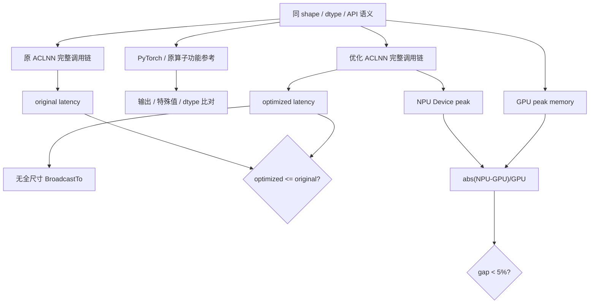

## 兼容性分析

### 稳定性与兼容性设计

稳定性设计不依赖跨核 workspace 或同步：每个 core 根据 tiling 计算独立输出区间，
只读输入 GM、只写所属输出区间；动态 shape 的所有地址参数由 Host 校验后下发。

| **边界** | **兼容策略** |
| -------- | ------------ |
| 公共接口 | out-of-place/inplace ABI、参数顺序、错误码和 executor 两段式调用不变 |
| Tensor view | 输入由 Contiguous 适配，非连续输出由 ViewCopy 保持 storage offset/stride 语义 |
| rank-0 / empty | rank-0 规范为单元素后 squeeze；empty 不下发 FloorMod Kernel |
| Tensor-Tensor | 910B/910_93 FP/BF16/FP32/INT32 使用 native stride-aware route |
| INT64 | AICPU 原生广播，精度不变 |
| DOUBLE | 保留 BroadcastTo 回退，非任务重点 |
| 其他架构 | 保留既有兼容适配 |
| 算子注册 | OpDef 原型与 dtype/format 不新增 attr，不改变图侧调用契约 |

| **设计边界** | **影响** | **实现防护** |
| ------------ | -------- | ------------ |
| shape/stride 乘积超出表示范围 | GM offset 回绕 | rank≤8，Host 校验输出 shape |
| short-row 逻辑长度与物理对齐长度不同 | 尾块或相邻 core 越界 | DataCopyPad 只写真实逻辑元素 |
| UB 预算与 TQue/TBuf 不一致 | LocalMemory 越界 | divider 与 Kernel 资源一一对应 |
| INT32 大整数精度 | 值 >2^24 时 FP32 丢精度 | 复用 FP32 Trunc 路径，符号修正补偿 |
| Div 倒数乘法边界 | Floor 返回错误值 | 采用 Trunc 替代 Floor |
| inplace 输出 shape 扩展 | 覆盖 `selfRef` storage 边界 | API 强制广播结果 shape 等于 `selfRef` shape |
| Host/Kernel key 不一致 | 分发错误 | dtype tiling key 与 Kernel 模板同步 |

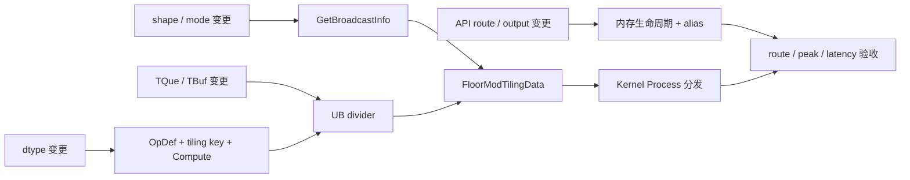
