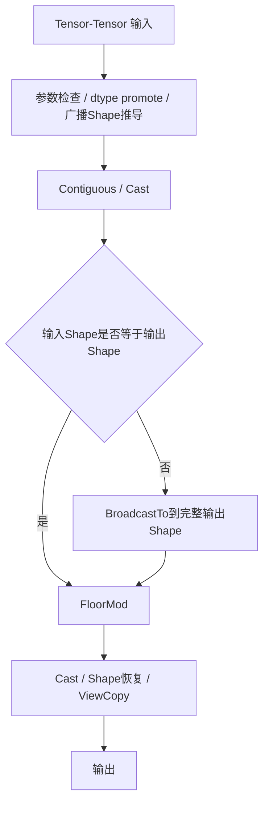
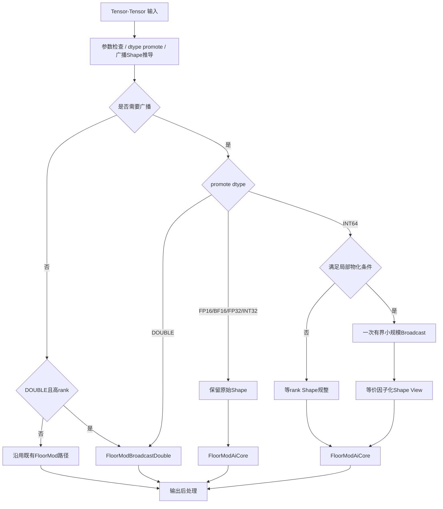
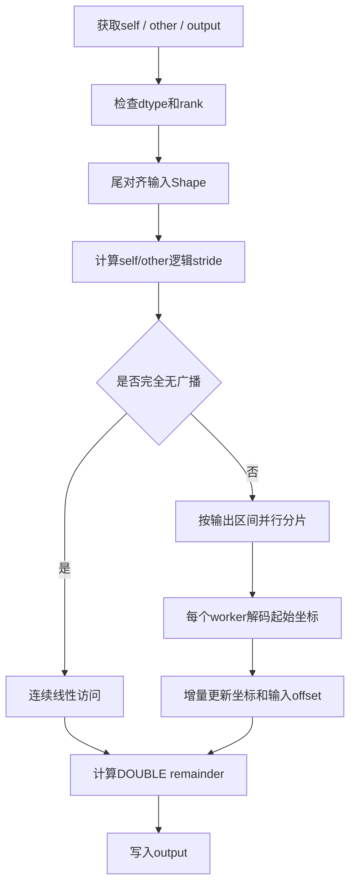

# 【社区任务】aclnnRemainderTensorTensor算子设计文档

## 一、需求背景

### 1.1 需求来源

本需求来源于社区算子任务，目标是优化 `aclnnRemainderTensorTensor` 的 Tensor-Tensor 广播场景。

原有实现会在 aclnn 侧将需要广播的输入完整扩展到输出 Shape，再调用 FloorMod 完成计算。对于大规模广播场景，完整 BroadcastTensor 会产生与输出 Tensor 同量级的额外 GM 占用。

本设计在不改变公开接口、dtype promote 规则和 remainder 语义的前提下，优化广播路径的内存使用，并保证功能、精度和性能要求。

### 1.2 背景介绍

#### 1.2.1 aclnnRemainderTensorTensor算子实现优化

`aclnnRemainderTensorTensor` 位于 `math/floor_mod`，Tensor-Tensor 接口最终通过 FloorMod 完成逐元素 remainder 计算。

与本需求直接相关的代码位置如下：

- ACLNN Tensor-Tensor 调用与分发：`math/floor_mod/op_api/aclnn_remainder.cpp`
- FloorMod L0 接口：`math/floor_mod/op_api/floor_mod.cpp`
- FloorMod L0 接口声明：`math/floor_mod/op_api/floor_mod.h`
- DOUBLE 广播 AICPU Kernel：`math/floor_mod/op_kernel_aicpu/floor_mod_broadcast_double_aicpu.cpp`
- DOUBLE 广播 AICPU Kernel 声明：`math/floor_mod/op_kernel_aicpu/floor_mod_broadcast_double_aicpu.h`
- DOUBLE 广播算子信息：`math/floor_mod/op_kernel_aicpu/floor_mod_broadcast_double.json`

当前工程中，非 DOUBLE 计算复用 CANN 系统 FloorMod AICore 能力。本仓库未提供该系统 FloorMod 的完整 TBE 源码，因此本文不假设或描述其未公开的内部 TBE 实现细节，只描述本仓库可确认的 ACLNN/L0 调用关系和本任务新增设计。

DOUBLE 广播路径由本任务提供独立 AICPU Kernel，其 Kernel 和算子信息文件均位于上述 `op_kernel_aicpu` 目录。

#### 1.2.2 aclnnRemainderTensorTensor算子现状分析

##### 1.2.2.1 参考FloorMod支持的数据类型和数据格式

Tensor-Tensor 路径按照现有 ACLNN 能力支持以下主要数据类型：

- INT32
- INT64
- FLOAT16
- FLOAT
- DOUBLE
- BFLOAT16（在对应硬件架构支持时）

输入、输出在本需求涉及的广播计算中按 ND 逻辑 Shape 处理。

DOUBLE 独立广播 Kernel 的输入和输出均为 `DT_DOUBLE`，workspace 设计为 0。

##### 1.2.2.2 原有实现描述

原有 Tensor-Tensor 广播处理的主要问题在 aclnn 侧。

输入完成 Contiguous 和必要 Cast 后，如果输入 Shape 与输出 Shape 不一致，会先通过 BroadcastTo 将输入完整展开到输出 Shape，然后再调用 FloorMod。

逻辑如下：

```text
self / other
    -> Contiguous
    -> Cast（需要时）
    -> BroadcastTo(outputShape)
    -> FloorMod
    -> Cast / Shape恢复 / ViewCopy
```

该方案功能上能够满足标准广播语义，但显式 BroadcastTo 会把广播结果完整写入 GM。

若输出元素数为 `N`、元素字节数为 `S`、需要完整广播的输入个数为 `B`，则广播中间 Tensor 的主要额外空间可表示为：

```text
M_full_broadcast ≈ B × N × S
```

双边交叉广播时可能同时产生两个完整中间 Tensor，因此额外峰值内存会随输出规模线性增长。

##### 1.2.2.3 原有实现流程图

由于本仓库未包含 CANN 系统 FloorMod 的完整 TBE 源码，以下流程图描述的是本需求能够确认的原有 ACLNN/L0 调用流程；系统 FloorMod 内部实现作为既有能力复用，不对未公开内部逻辑做推测。



---

## 二、需求分析

### 2.1 外部组件依赖

本设计依赖现有 CANN 算子运行框架和已有基础算子能力，包括：

- ACLNN executor 与 L0 调用框架；
- Contiguous；
- Cast；
- BroadcastTo；
- ViewCopy；
- 系统 FloorMod AICore/AICPU 能力；
- AICPU Kernel 运行框架。

本任务不修改系统 CANN，不依赖额外第三方库。

### 2.2 内部适配模块

本设计涉及的内部模块主要包括：

1. `aclnn_remainder.cpp`  
   负责 Tensor-Tensor 参数检查、dtype promote、广播判断、输入准备和路径分发。

2. `floor_mod.cpp / floor_mod.h`  
   负责 FloorMod 的 L0 调用封装，并提供 DOUBLE 独立广播能力入口。

3. `op_kernel_aicpu`  
   提供 DOUBLE Tensor-Tensor 广播场景的独立 AICPU Kernel。

4. 既有基础算子模块  
   复用 Contiguous、Cast、BroadcastTo、ViewCopy 等能力，不改变其实现。

### 2.3 需求模块设计

#### 2.3.1 AscendC算子原型

本任务不是新增一个独立 Ascend C FloorMod Kernel。

FP16、BF16、FP32、INT32、INT64 仍复用系统已有 FloorMod AICore 能力；本任务主要在 ACLNN Host 侧优化广播数据准备和分发方式。

新增的独立 Kernel 仅用于 DOUBLE Tensor-Tensor 广播，采用 AICPU 实现，其逻辑原型为：

```text
input0: self  (DOUBLE)
input1: other (DOUBLE)
output: result (DOUBLE)
```

输出 Shape 为两个输入按标准尾对齐广播规则推导得到的 Shape。

#### 2.3.2 算子相关约束

设计约束如下：

- self 与 other 必须满足标准 Tensor 广播规则；
- out Shape 必须与广播推导结果一致；
- rank 不超过接口既有支持范围；
- 非连续输入仍需先 Contiguous；
- dtype 不一致时仍需进行必要 Cast；
- 不改变 Tensor-Scalar、Scalar-Tensor 接口行为；
- 不允许通过针对固定测试 Shape 的硬编码实现优化；
- INT64 局部物化只在通用 Shape 条件和内存约束满足时启用；
- DOUBLE 独立 Kernel 仅处理 DOUBLE Tensor-Tensor 计算。

与原有完整 BroadcastTo 方案相比，本设计补充的主要能力是：

- 非 DOUBLE 常规广播不再在 ACLNN 层完整物化；
- DOUBLE 可以直接读取原始广播 Shape；
- INT64 在 direct 调度不理想的通用模式下允许有界的小规模局部物化，而不是完整展开。

---

## 三、需求详细设计

### 3.1 使能方式

本需求适配 ACLNN 调用框架。

外部仍通过原有 `aclnnRemainderTensorTensor` 接口调用，不新增公共 API。

优化逻辑在 Tensor-Tensor GetWorkspaceSize/Executor 构建阶段根据：

- promote dtype；
- 是否需要广播；
- 输出 rank；
- self/other/out Shape 关系；
- INT64 局部物化适用条件；

选择对应计算路径。

Tensor-Scalar、Scalar-Tensor 以及与本需求无关的路径保持原有实现。

### 3.2 需求总体设计

#### 3.2.1 Host侧设计

Host 侧负责：

1. 参数检查；
2. dtype promote；
3. 广播 Shape 推导；
4. Contiguous / Cast；
5. 根据 dtype 和 Shape 关系选择计算路径；
6. INT64 的 Shape 规整或局部物化；
7. 调用既有 FloorMod 或 DOUBLE 独立 Kernel；
8. 完成必要的输出后处理。

总体流程如下：



##### 3.2.1.1 分核策略

本任务不修改系统 FloorMod AICore 的内部 Tiling 和分核实现，因此 FP16、BF16、FP32、INT32、INT64 的 AICore 分核策略继续由系统 FloorMod 决定。

Host 侧优化的重点是改变输入进入 FloorMod 前的逻辑 Shape，使系统 FloorMod 能够在不生成完整 BroadcastTensor 的情况下完成广播。

DOUBLE 独立 AICPU Kernel 在输出线性空间上进行并行切分：

```text
output[0 ... N)
```

被划分为多个互不重叠的连续区间，每个 worker 负责一个输出区间。各 worker 仅写自己的输出范围，不产生写冲突。

##### 3.2.1.2 数据分块和内存优化策略

本设计不在 ACLNN 层对输出进行多 chunk 循环计算，避免重复 Kernel Launch。

内存策略分为三类：

**1. Direct 广播**

FP16、BF16、FP32、INT32 和大部分 INT64 场景保留原输入 Shape，直接调用 FloorModAiCore：

```text
M_broadcast_tensor = 0
```

不产生与输出规模同阶的完整广播中间 Tensor。

**2. DOUBLE 原Shape广播**

DOUBLE Kernel 根据 Shape 和逻辑 stride 直接读取 self/other：

```text
M_kernel_workspace = 0
```

广播维度通过逻辑 stride 复用输入元素，不提前落盘。

**3. INT64 因子化局部物化**

对于满足条件的 INT64 单边广播，将一个较大的重复维拆分为：

```text
broadcast_extent = outer × factor
```

只物化其中 `factor` 对应的小规模数据。

若需要物化的尾部元素数为 `T`，元素字节数为 `S`，则局部物化主要内存为：

```text
M_partial = factor × T × S
```

并要求：

```text
M_partial <= M_limit
M_partial << M_full_broadcast
```

其中 `M_limit` 为设计中的有界临时内存限制。

局部物化后只执行一次 FloorMod，不对 outer 维进行多次 chunk Launch。

##### 3.2.1.3 tilingKey规划策略

本任务没有新增或修改系统 FloorMod 的 TilingKey。

FP16、BF16、FP32、INT32、INT64 继续使用系统 FloorMod 根据输入 Shape 自行选择的 Tiling。

Host 侧通过以下方式间接改善其调度条件：

- 保留原始 Shape，避免不必要的完整 BroadcastTo；
- INT64 不同 rank 场景采用补前导 1 的等 rank Shape View；
- 对满足条件的 INT64 场景使用因子化局部物化，使 FloorMod 看到更规则的广播关系。

DOUBLE AICPU Kernel 不依赖 AICore TilingKey。

#### 3.2.2 Kernel侧设计

##### 3.2.2.1 Kernel侧实现描述

本任务仅新增 DOUBLE 广播 AICPU Kernel，其他 dtype 不新增自定义计算 Kernel。

DOUBLE Kernel 的设计逻辑为：

1. 获取 self、other 和 output Shape；
2. 按输出 rank 对输入 Shape 做尾对齐；
3. 为每个输入构建逻辑 stride：
   - 输入维度等于输出维度：使用连续 stride；
   - 输入维度为 1：stride 为 0；
   - 缺少前导维度：按维度 1 处理；
4. 将输出线性范围分配给多个 worker；
5. 每个 worker 对首元素完成一次完整坐标解码；
6. 后续元素采用坐标递增方式更新 self/other offset；
7. 计算 DOUBLE remainder 并写入输出。

DOUBLE remainder 采用浮点余数后进行符号修正，以保持 remainder 的符号规则，并处理 NaN、Inf、除数为零、signed zero 等特殊值。

##### 3.2.2.2 AscendC实现流程图

本任务没有新增 Ascend C Kernel，因此不存在新的 Ascend C Kernel 实现流程。

为满足设计评审对 Kernel 流程的要求，以下给出本任务新增 DOUBLE AICPU Kernel 的实际实现流程图：



##### 3.2.2.3 AscendC实现流程图与参考流程的差异点和原因

由于本任务没有新增 Ascend C Kernel，差异主要体现在 ACLNN Host 路径和 DOUBLE AICPU 路径，而不是 Ascend C Kernel 与 TBE Kernel 的逐行对应关系。

与原有完整 BroadcastTo 流程相比：

1. **FP16/BF16/FP32/INT32**
   - 原流程：完整 BroadcastTo 后 FloorMod；
   - 新流程：保留原 Shape，直接 FloorModAiCore；
   - 原因：系统 AICore FloorMod 已具备相应广播处理能力，无需在 ACLNN 层重复物化。

2. **DOUBLE**
   - 原流程：输入完整广播后调用既有 FloorMod；
   - 新流程：独立 AICPU Kernel 根据 Shape/stride 直接索引；
   - 原因：避免 DOUBLE 广播输入完整落盘，并补充高 rank 广播能力。

3. **INT64**
   - 原流程：完整 BroadcastTo 后 FloorMod；
   - 新流程：优先 direct FloorModAiCore；必要时进行一次有界局部物化；
   - 原因：完全 direct 能消除广播内存，但部分 Shape 下底层调度不理想；有界局部物化在不恢复完整广播 Tensor 的前提下改善输入 Shape。

因此，新方案的核心差异不是重新实现 FloorMod 数学计算，而是优化 ACLNN 层广播数据的准备方式。

### 3.3 支持硬件

本设计面向任务要求的 Ascend 910B / Ascend 910C 系列环境进行适配。

不同 SoC 使用对应的 CANN 环境独立构建和验证，不能直接用一个平台的运行结果替代另一个平台。

当前方案不修改系统 CANN，不依赖 Ascend 950 Arch35 专有实现。

### 3.4 算子约束限制

- Tensor-Tensor 输入必须满足标准广播规则；
- rank 不能超过接口支持范围；
- DOUBLE 独立 Kernel 仅支持 DOUBLE；
- INT64 局部物化仅在通用可分解 Shape 模式下启用；
- 局部物化内存必须满足有界限制；
- 不满足 INT64 局部物化条件时回到 direct FloorModAiCore；
- 非连续输入仍需要 Contiguous；
- dtype 转换仍可能产生 Cast 临时空间；
- 本任务不改变 Tensor-Scalar 和 Scalar-Tensor 行为。

---

## 四、特性交叉分析

本需求主要修改 Tensor-Tensor 广播路径，需要重点分析与以下既有特性的交叉关系。

### 4.1 dtype promote

优化发生在 promote dtype 确定后，不改变现有 promote 规则。

### 4.2 0D / empty

0D 和 empty 继续沿用接口既有 Shape 和空 Tensor 处理语义。新广播路径不改变空 Tensor 输出规则。

### 4.3 inplace

inplace 仍使用 executor 管理的内部结果保证输入读取和输出写入顺序正确。该内部结果属于 inplace 框架语义，不等同于 BroadcastTensor。

### 4.4 noncontiguous

非连续输入首先通过 Contiguous 转换为连续 Tensor，再进入本设计的广播路径。

Contiguous 产生的临时内存需要与广播物化内存分开分析。

### 4.5 Cast

dtype promote 或 out dtype 不一致时仍执行必要 Cast。本设计不修改 Cast 行为。

### 4.6 Scalar接口

Tensor-Scalar、Scalar-Tensor 不属于本次 Tensor-Tensor 广播优化范围，保持既有实现。

---

## 五、可维护可测分析

### 5.1 精度标准 / 性能标准

#### 精度

优化前后 remainder 数值语义保持一致。

重点覆盖：

- 六种 Tensor-Tensor dtype；
- 无广播、单边广播、双边广播；
- 相同 rank、不同 rank；
- DOUBLE NaN / Inf / 除数为零 / signed zero；
- INT64 边界值。

设计目标为精度不低于原有实现。

#### 性能

性能设计原则为“不以明显性能回退换取内存收益”。

对可比较场景：

- 使用相同输入 Case；
- Release 构建；
- warm-up 后计时；
- 进行设备同步；
- 使用多个独立进程；
- 统计 P50、P90、Mean。

设计目标为性能不低于原有路径允许的验收阈值。

#### 内存

核心目标是避免输出规模的完整 BroadcastTensor。

内存验证需要同时观察：

- BroadcastTo 数量和规模；
- workspace；
- NPU 峰值；
- 与同 Case GPU 可比峰值的差距；
- noncontiguous / inplace 等框架额外内存的独立归因。

INT64 局部物化允许出现一次小规模 Broadcast，但其临时空间必须保持有界，不能恢复为与输出规模同阶的完整广播中间 Tensor。

### 5.2 兼容性分析

本设计保持：

- ACLNN 公共接口不变；
- 调用参数不变；
- dtype promote 不变；
- 输出 Shape 推导不变；
- Tensor-Scalar / Scalar-Tensor 不变；
- empty / 0D / inplace 语义不变；
- 必要的 Contiguous、Cast、ViewCopy 行为不变。

代码维护方面：

- dtype 分发逻辑集中在 Tensor-Tensor 主路径；
- INT64 局部物化由通用 Shape 条件控制，不绑定具体测试 Shape；
- DOUBLE 独立 Kernel 使用独立注册名，不覆盖系统 FloorMod；
- 其余 dtype 尽量复用既有 FloorMod 能力，减少重复 Kernel 维护成本。
