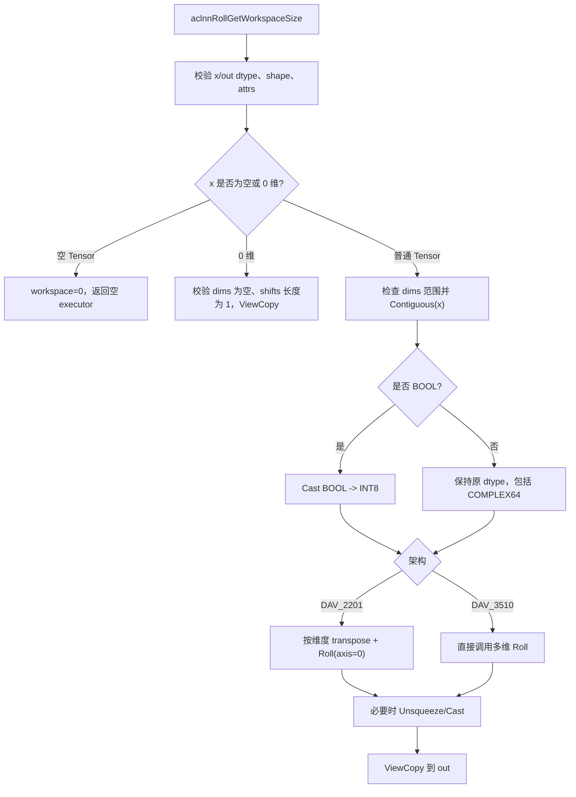
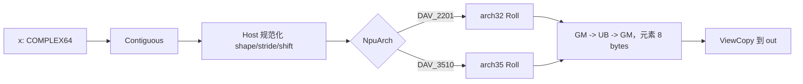

# 需求背景（required）


## 需求来源

本需求来源于 2026 年 7 月社区任务“aclnnRoll 算子开发”。任务要求在已有
`aclnnRoll` 基础上新增 `COMPLEX64` 输入支持，使 `torch.fft.fftshift` 和
`torch.fft.ifftshift` 在复数 FFT 结果上的调用可以在 NPU 上正常运行，同时不
影响原有 BF16、FP16、FP32、INT8、UINT8、INT32、UINT32、INT64、BOOL 和 INT16
路径。

本设计以 PyTorch `torch.roll` 作为功能语义基准，以当前 `conversion/roll` 的
ACLNN、Host tiling 和 Ascend C Kernel 实现作为工程基线。Roll 不执行数值运算，
只改变元素位置；因此 complex64 的正确性要求是每个复数元素的 64 bit 存储值
随元素整体移动，实部和虚部不能拆分或交错。

## 背景介绍

### aclnnRoll算子实现优化

现有 Roll 接口已经支持多维 `shifts`/`dims`、负维度、负 shift、空 dims 展平、
空 Tensor、0 维 Tensor 和非连续 Tensor。新增 complex64 不需要改变 roll 的
索引语义，只需要让公共 dtype 检查、OpDef、binary 配置以及两代 Kernel 接受
8 字节的复数元素。

complex64 的实现采用按位搬运策略：Kernel 编译入口检测
`ORIG_DTYPE_X == DT_COMPLEX64` 时将 `RollDataType` 设为 `uint64_t`，否则使用
原始 dtype。这样既避免复数算术 API 依赖，也保证一次搬运始终覆盖完整的实部和
虚部。

### aclnnRoll算子TBE实现现状分析

本任务没有单独的 TBE 复数 Roll 算子，基线是 `conversion/roll` 的 ACLNN 和
Ascend C 实现。相关模块如下：

| 模块 | 路径 | 职责 |
|---|---|---|
| 公共 ACLNN | `conversion/roll/op_api/aclnn_roll.cpp` | 参数校验、连续化、架构分流、ViewCopy |
| 算子原型 | `conversion/roll/op_graph/roll_proto.h` | 声明输入输出 dtype 和 `shifts`/`dims` 属性 |
| OpDef | `conversion/roll/op_host/roll_def.cpp` | 为 910B、910_93、950 注册 dtype/format |
| A2/A3 Host tiling | `conversion/roll/op_host/arch32/roll_tiling_arch32.cpp` | 解析 shape/attrs、分核和 32B/512B 对齐 |
| A5 Host tiling | `conversion/roll/op_host/arch35/roll_tiling_arch35.cpp` | Regbase tiling、UB 预算和 SIMD tiling key |
| A2/A3 Kernel | `conversion/roll/op_kernel/arch32/roll.h` | 通用段搬运、行/块搬运和多维 roll |
| A5 Kernel | `conversion/roll/op_kernel/arch35/*.h` | SIMD、Gather、H-split、非对齐路径 |
| Kernel 入口 | `conversion/roll/op_kernel/roll_apt.cpp` | 按 arch 和 tiling key 实例化 Kernel |

#### 1. 原有接口流程



#### 2. 现有 Host/Kernel 能力

Host 将负维度转换到 `[0, rank-1]`，对同一维度的多个 shift 做模加；当 dims
为空时把 Tensor 当作一维向量。A2/A3 的 arch32 tiling 使用 `RollTilingData`
记录 shape、stride、归一化 shift、活动维度、每核元素数和 UB 元素数。A5 的
arch35 tiling 先合并零 shift 轴、移除 shape 为 1 的轴，再按尾轴、H 轴、W 轴
和 UB 切分条件选择 SIMD 分支。

Kernel 的地址公式为：

```text
sourceCoord[d] = (outputCoord[d] - shift[d] + shape[d]) % shape[d]
sourceIndex    = sum(sourceCoord[d] * stride[d])
```

连续段、整行、整块优先使用 DataCopy；跨边界的片段使用分段拷贝或 UB 内重排，
尾块使用 DataCopyPad。complex64 只改变元素字节数为 8，不改变上述坐标公式。

### aclnnRoll算子功能分析

Roll 沿指定维度循环移动 Tensor 元素。对于输出位置 `o`，其输入位置由每个维度
的循环反向偏移得到：

```text
y[o_0, ..., o_{r-1}] = x[(o_0-shift_0) mod s_0, ..., (o_{r-1}-shift_{r-1}) mod s_{r-1}]
```

| 参数 | 类别 | 支持范围 | 约束 |
|---|---|---|---|
| `x` | 输入 | BF16、FP16、FP32、INT8、UINT8、INT32、UINT32、INT64、BOOL、INT16、COMPLEX64 | ND，rank 0-8，可非连续 |
| `shifts` | 属性输入 | `int64` 数组 | `dims` 非空时长度相同；`dims` 为空时长度必须为 1 |
| `dims` | 属性输入 | `int64` 数组 | 每个值在 `[-rank, rank-1]`；空数组表示展平 roll |
| `out` | 输出 | 与 `x` 相同 dtype 和 shape | 由 ViewCopy 写回用户 Tensor |

complex64 输出与输入具有相同的 8 字节元素位模式；该算子不进行复数加减乘除，
因此不存在复数舍入误差。

# 需求分析（required）

## 需求描述

在现有 `aclnnRoll` 中扩展 COMPLEX64 支持，满足以下目标：

1. `aclnnRoll` 的函数签名、两段式调用方式、错误码和属性语义不变。
2. complex64 在 A2/A3/A5 目标架构上可执行，结果与 PyTorch `torch.roll` 一致。
3. 原有 dtype、shape、dims、非连续和空 Tensor 行为不回退。
4. 对 complex64 使用元素级 64 bit 搬运，不把一个复数拆成两个独立 roll。

## 需求拆解

1. 公共 API、Proto、OpDef、dtype 支持表和 binary 配置增加 COMPLEX64。
2. A2/A3 arch32 Kernel 与 A5 arch35 Kernel 均实例化 `uint64_t` 元素路径。
3. Host tiling 正确计算 complex64 的 8 字节对齐、分块、UB 和 blockDim。
4. 保持负维度、负 shift、重复 dims 合并、空 dims 展平和 rank 0-8 语义。
5. 覆盖 complex64 单维、多维、空 dims、非连续、空 Tensor 和边界 shift 用例。
6. 对原有 dtype 做回归验证，确认 complex64 扩展不改变已有路径性能和功能。

### 外部组件依赖

| 组件 | 用途 |
|---|---|
| CANN ACLNN/opdev | 两段式接口、executor 和 L0 launcher |
| Ascend C | arch32/arch35 Roll Kernel |
| PyTorch CPU | `torch.roll` 功能参考 |
| AscendOpTest | 接口、精度和回归测试 |
| opc/binary 配置 | 为 910B、910_93、950 生成 complex64 Kernel 二进制 |

### 内部适配模块

| 模块 | 职责 |
|---|---|
| ACLNN API | 参数校验、连续化、BOOL 适配、架构分流和 ViewCopy |
| OpDef/Proto | 声明 COMPLEX64 输入输出和 ND format |
| arch32 Host | A2/A3 shape/attrs 规范化、分核和 UB 预算 |
| arch35 Host | A5 Regbase tiling、SIMD key 和平台资源读取 |
| arch32 Kernel | uint64_t 元素的通用 roll 拷贝 |
| arch35 Kernel | uint64_t 元素的 SIMD/Gather/H-split 拷贝 |
| 测试模块 | complex64 功能、边界、非连续和原 dtype 回归 |

# 详细设计（required）

## 算子分析

### 数学公式

设输入 rank 为 `r`，shape 为 `s[d]`，归一化 shift 为 `k[d]`，输出坐标为 `o[d]`，
则：

$$
i_d = (o_d - k_d) \bmod s_d, \qquad
out[o_0,\ldots,o_{r-1}] = x[i_0,\ldots,i_{r-1}]
$$

当多个属性项指定同一维度时，先计算 shift 的模和；当 `dims` 为空时，使用
`shape=[numel]` 和单个 shift 对线性元素序列执行 roll。

### 支持数据类型

| 架构 | 支持 dtype |
|---|---|
| DAV_2201（Atlas A2/A3） | BF16、FP16、FP32、INT8、UINT8、INT32、UINT32、INT64、BOOL、INT16、COMPLEX64 |
| DAV_3510（Atlas A5） | BF16、FP16、FP32、INT8、UINT8、INT32、UINT32、INT64、BOOL、INT16、COMPLEX64 |

BOOL 在公共 ACLNN 层暂时 Cast 为 INT8 计算后再 Cast 回 BOOL；complex64 不
经过 Cast，直接以 `uint64_t` 作为 Kernel 存储类型。

### 支持形状

- 输入和输出 shape 必须相同，rank 最大为 8。
- 支持 rank 0；此时只允许 `dims=[]`、`shifts` 长度为 1，结果为 ViewCopy。
- 支持任意合法空 Tensor；空 Tensor 在公共层直接返回，不校验 dims 数值范围。
- `dims=[]` 时 `shifts` 长度必须为 1，按展平后的元素数处理。
- 非连续输入先由 `Contiguous` 转为连续物理存储，输出由 `ViewCopy` 保持目标 view。

## 算子实现

### 使能方式

| 条件 | 路径 |
|---|---|
| Atlas A2/A3，DAV_2201，complex64 | `arch32` Host + `arch32/roll.h` |
| Atlas A5，DAV_3510，complex64 | `arch35` Host + arch35 SIMD/Gather Kernel |
| 非目标架构 | 保持既有 ACLNN 兼容路径 |
| 原有 dtype | 继续使用原 dtype 模板实例，不改变公共调用 |

### 实现方案

#### 总体数据流



#### 3.2.1 host侧设计：

##### 1. 公共参数校验与规范化

`aclnnRollGetWorkspaceSize` 依次检查指针、x/out dtype、shape、shifts/dims 数组
长度和 rank。dims 非空时每个值必须位于 `[-rank, rank-1]`；负维度转换为非负
索引。空 Tensor 在 dims 范围检查前返回空 executor，0 维 Tensor 单独要求
`dims=[]`、`shifts.size()==1`。

Host 对每个指定维度计算：

```text
normalizedDim = dim < 0 ? dim + rank : dim
normalizedShift[dim] = (normalizedShift[dim] + shift) mod shape[dim]
```

当 dims 为空时，`dimNum=1`、`shape[0]=totalNum`、`stride[0]=1`。对于复杂度和
地址安全，shape 乘积、stride 乘积及 element bytes 使用 64 bit 检查，不能发生
乘积回绕。

##### 2. arch32 tiling 与分核

arch32 使用 32B GM block 和 512B 带宽对齐作为主要分块依据。complex64 的
`typeSize=8`，因此基本块分别对应 4 个元素和 64 个元素。Host 根据 AIV core
数计算 `rawPerCore`，再按活动维度的整行/整块大小对齐 `perCoreElements`，得到
`usedCoreNum`、`lastCoreElements` 和 `ubElements`。代码中的 arch32 UB 预算为
64 KiB，workspace 为 0。

##### 3. arch35 tiling 与平台资源

arch35 通过 `PlatformAscendC` 获取 AIV core 数和 UB 大小，不硬编码平台资源。
Host 先合并连续零 shift 轴并移除 shape 为 1 的轴，然后依据尾轴大小、H 轴对齐、
UB 切分轴和 dtype 字节数选择 tiling key。complex64 作为 8 字节 dtype 参与所有
对齐和 `maxElements` 计算，使用与 INT64 相同的元素宽度但不改变数据位模式。

arch35 当前为 Roll 预留固定 16 MiB workspace，用于 SIMD/Gather 路径的运行时
临时区；它不是 complex64 专属对象，workspace 大小不随 dtype 变化。

##### 4. tilingData 契约

两代实现都向 Kernel 下发以下逻辑信息：

| 字段 | 含义 |
|---|---|
| `totalNum`/`totalElements` | 输出元素总数 |
| `dimNum` | 规范化后的维度数 |
| `shapes[]` | 每一维长度 |
| `strides[]` | 连续线性 stride |
| `shifts[]` | 每一维非负模 shift |
| `perCoreElements`、`lastCoreElements` | 核间输出区间 |
| `ubElements`/`maxElements` | 单核 UB tile 上限 |
| `tilingKey` | arch35 的 SIMD/Gather 分支 |

##### 5. tiling key 规划

arch35 使用以下 key：单维 `10000`、H 轴前非对齐 `20000`、H 轴对齐 `30000`、
H 轴非对齐 `30001`、W 轴切分 `40000`、小尾轴有 shift `50000`、小尾轴无
shift `50001`、空 Tensor `60000`。complex64 复用这些 key，不增加复数专用
分支；Kernel 入口只将模板类型从 `DTYPE_X` 替换为 `uint64_t`。

#### 3.2.2 kernel侧设计：

##### 1. Kernel 入口和类型映射

`roll_apt.cpp` 按 `__CCE_AICORE__ < 300` 选择 arch32，否则选择 arch35。入口中：

```cpp
#if ORIG_DTYPE_X == DT_COMPLEX64
using RollDataType = uint64_t;
#else
using RollDataType = DTYPE_X;
#endif
```

因此 complex64 的 GM、UB、DataCopy 和模板长度均以 8 字节元素计量，实部/虚部
始终处于同一个模板元素内。

##### 2. 地址映射和分段拷贝

Kernel 对每个输出线性下标反解坐标，使用 `ComputeInputIndex` 得到源下标。根据
连续性选择 `CopySegment`、`CopyStridedSourceSegments`、整行和整块搬运；跨
循环边界时分成两段 `[shift, dim)` 与 `[0, shift)`。所有搬运以 `sizeof(T)` 计算
字节长度，complex64 不会出现 4-byte 半元素搬运。

##### 3. UB、尾块和边界安全

Kernel 使用输入/输出队列和 UB tile。GM 访问不足 32B 时用 `DataCopyPad`，写回
只覆盖真实逻辑元素，不把 padding 写入相邻元素。多核通过 `startIndex`、
`perCoreElements` 和 `lastCoreElements` 分配不重叠的输出区间；complex64 尾块
可以包含奇数个复数元素，但每个元素仍完整写入 8 字节。

##### 4. 多维专用路径

当只有一个活动维度时，优先使用 leading-dim、last-dim row 或 single-dim block
路径；多个活动维度时按最后活动维度选择 last-dim rows 或 non-last blocks，无法
归类时回退通用 segmented roll。A5 由 tiling key 选择 SIMD、Gather、H-split
或 unaligned SIMD；A2/A3 使用 arch32 中对应的 row/block/segment 函数。

##### 5. 0 shift、空 Tensor 和原子性

所有归一化 shift 都为 0 时直接执行 identity copy。空 Tensor 不启动有效计算，
0 维 Tensor 在 API 层完成 ViewCopy。complex64 不允许按 float 实部和虚部分别
调度；每个 output element 的源地址和目标地址均以 `uint64_t` 元素为单位。

#### 3.2.3 与原 dtype 路径的兼容设计

新增 complex64 只影响 dtype 列表、binary 配置和模板类型。原有 dtype 的
tiling key、分块规则、BOOL 的 INT8 适配和非目标架构 fallback 不改变。由于
complex64 没有算术计算，Kernel 不引入复数数学库或额外精度转换。

## 支持硬件

| 产品系列 | SocVersion/NpuArch | 代码路径 | 支持状态 |
|---|---|---|---|
| Atlas A2 训练系列 | ASCEND910B / DAV_2201 | `arch32` | 目标支持 |
| Atlas A3 训练系列 | ASCEND910_93 / DAV_2201 | `arch32` | 目标支持 |
| Atlas A5 训练系列 | ASCEND950 / DAV_3510 | `arch35` | 目标支持 |

分支 CMake 将 `ascend910_93`、`ascend910b` 映射到 `arch32`，将 `ascend950`
映射到 `arch35`；binary 配置为三种平台分别生成 complex64 条目。运行时资源
仍以 `PlatformAscendC` 返回值为准。

## 算子约束限制

1. 输入和输出 shape 必须一致，rank 不超过 8。
2. dims 非空时，shifts 和 dims 长度必须一致；dims 为空时 shifts 长度必须为 1。
3. dims 每个值必须位于 `[-rank, rank-1]`；负值按 Python/PyTorch 语义换算。
4. 0 维 Tensor 只接受空 dims 和单元素 shifts；空 Tensor 直接返回。
5. 仅支持任务书和 OpDef 列出的 dtype/ND format；x/out dtype 必须相同。
6. 非连续 Tensor 由公共 ACLNN 层连续化和 ViewCopy，Kernel 只接收连续物理存储。
7. complex64 被视为一个 8 字节原子元素，不支持将实部、虚部作为独立维度 roll。
8. 本任务不改变 Tensor-prob 等其他算子接口，也不新增公共属性。

# 可维可测分析

## 精度标准/性能标准

| 验收标准 | 描述 | 标准来源 |
|---|---|---|
| 功能标准 | complex64 与 PyTorch `torch.roll` 结果一致，原 dtype 功能不回退 | 社区任务书 |
| 精度标准 | complex64 逐元素复数值和 64 bit 位模式一致；其他 dtype 满足 AscendOpTest 默认阈值 | 社区任务书 |
| 性能标准 | 任务书明确写明“性能要求：无”；但特别注意事项要求 complex64 扩展不得影响原有 dtype 性能，因此需要做原 dtype 回归对比 | 社区任务书第 44-46、82-86 行 |

### 特性交叉分析

#### 1. dtype 与搬运粒度

| dtype 类别 | 元素字节数 | 设计影响 |
|---|---:|---|
| INT8/UINT8 | 1 | 32B block 含 32 个元素，尾部更容易非对齐 |
| FP16/BF16 | 2 | 32B block 含 16 个元素 |
| FP32/INT32/UINT32 | 4 | 32B block 含 8 个元素 |
| INT64/COMPLEX64 | 8 | 32B block 含 4 个原子元素，complex64 按位搬运 |

#### 2. shape 与 dims

| 场景 | 处理 |
|---|---|
| dims 为空 | 展平为一维 roll |
| 单个活动维 | leading/last/single-dim 专用路径 |
| 多个活动维 | 维度合并、行/块路径或通用 segmented 路径 |
| 重复 dims | shift 模加后只保留一个活动维 |
| shift 等于维度长度 | 归一为 0，走 identity 或其他活动维路径 |
| rank 0/empty | API 快速路径，不进入普通 Kernel |

#### 3. 架构与 tiling key

| 架构 | Host | Kernel 分支 |
|---|---|---|
| DAV_2201 | arch32，动态 core/shape 对齐 | Roll<uint64_t>，segment/row/block |
| DAV_3510 | arch35，运行时 UB/core，SIMD key | Roll<uint64_t>，SIMD/Gather/H-split |

#### 4. view 与公共适配

连续输入可直接参与 Kernel；非连续输入先 Contiguous。输出始终通过 ViewCopy 保持
原始 view、storage offset 和 format 语义。BOOL 的 Cast 适配与 complex64 无关，
不得因新增 complex64 改变 BOOL 的输出类型。

### 验证方法

#### 1. 功能验证矩阵

| 维度 | 必测场景 |
|---|---|
| complex64 dtype | 1D、2D、3D、6D、7D，实部和虚部使用不同值 |
| shifts | 正数、负数、0、超过维度长度、等于维度长度 |
| dims | 正维、负维、重复维、多维同时 roll、空 dims |
| shape | 标量、含 1 维、尾轴 1/3/7/19/31、非 32B 对齐、大 Tensor |
| view | 非连续输入、非连续输出和 storage offset |
| empty/0D | 空 Tensor、0 维合法和非法 attrs |
| regression | 所有原支持 dtype、原有格式和原有错误参数 |

#### 2. 精度与语义验证

对 complex64 使用 `std::complex<float>` 或实部/虚部结构生成输入，并与 CPU
`torch.roll` 逐元素比较。因为 Kernel 只搬运数据，除 NaN 的比较展示外，正常
元素应满足：

```text
bit_cast<uint64_t>(actual[i]) == bit_cast<uint64_t>(reference[i])
```

测试必须覆盖复数实部和虚部位模式不同的输入，避免只验证相同实虚部而漏掉 32 bit
半元素交换。分支自带 example 使用 shape `[2,3]`、shifts `[1,-1]`、dims
`[0,1]` 做端到端复数结果校验；L2 用例覆盖 complex64、empty dims 和非连续。

#### 3. 接口和异常验证

验证空指针、dtype 不支持、x/out shape 不一致、shifts/dims 长度不一致、dims
越界、rank 大于 8、0D 非法 attrs、空 Tensor 异常 dims 等场景均在第一段接口
返回预期错误码。空 Tensor 的 dims 数值不应阻止空快速路径，0D 则必须严格校验。

#### 4. 性能与资源验证

任务书没有独立性能阈值，但应比较 complex64 与 INT64 同形状场景的 Kernel 时延、
A2/A3 与 A5 的 tiling 分支，并回归原 dtype 性能。使用 profiler 确认：

1. complex64 没有额外 Cast、复数算术或双 Kernel 拆分。
2. arch32 的 workspace 为 0，arch35 使用设计规定的固定 workspace。
3. blockDim、UB tile 和 tiling key 与平台及 dtype 字节数一致。
4. 非连续输入的 Contiguous/ViewCopy 适配时间单独统计。

#### 5. 可维护性与风险闭环

| 风险 | 防护 | 验证 |
|---|---|---|
| complex64 实虚部被拆分 | 统一使用 `uint64_t` 元素模板 | 64 bit 位模式逐元素对拍 |
| 8 字节对齐计算错误 | Host 统一使用 dtype size，32B/512B 对齐 | 尾轴 1/3/7/19/31 用例 |
| arch 条件分支错误 | `__CCE_AICORE__` 与 CMake 映射一致 | A2/A3/A5 分别加载 binary |
| 重复 dims 处理错误 | Host shift 模加和 dim 归一化 | 重复正负 dims 对拍 |
| 空/0D 快速路径误入 Kernel | API 层先于 dims range 分支 | 空 Tensor 和 0D 异常用例 |
| 原 dtype 回退 | 仅增加 dtype 列表和 uint64 模板 | 原 dtype 全量回归 |

## 兼容性分析

| 兼容维度 | 保证 |
|---|---|
| 公共 ABI | `aclnnRollGetWorkspaceSize`/`aclnnRoll` 签名不变 |
| 属性语义 | `shifts`、`dims` 长度、负维和空 dims 规则不变 |
| dtype | 原 dtype 保持；新增 COMPLEX64 仅在目标平台列表中使能 |
| 架构 | A2/A3 使用 DAV_2201 arch32，A5 使用 DAV_3510 arch35，其他架构保留既有路径 |
| Tensor view | Contiguous 和 ViewCopy 保持非连续 Tensor 语义 |
| BOOL | 继续走 INT8 中间计算再 Cast 回 BOOL |
| workspace | arch32 为 0；arch35 沿用 16 MiB 固定预留，接口不变 |
| 安装与二进制 | 910B、910_93、950 binary 均登记 complex64，运行时 op type 仍为 `Roll` |

本设计通过在公共 dtype、OpDef、Host tiling、Kernel 类型映射和三类平台 binary
配置中统一增加 COMPLEX64，形成从接口到设备执行的完整支持链路；原有 dtype 和
非目标架构继续沿用既有实现。
