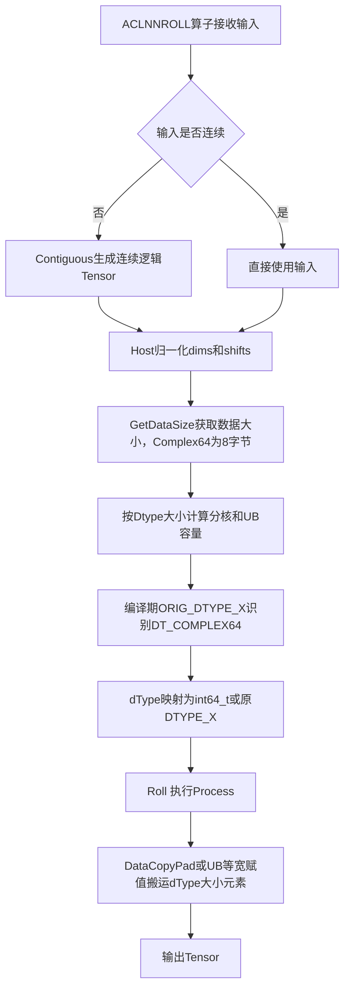

# 需求背景（required）

## 需求来源

本需求来源于 CANN 社区 2026 年 7 月任务 aclnnRoll 算子开发，要求在 `ops-math` 仓库已有 `aclnnRoll` 实现基础上新增 `COMPLEX64` 输入输出支持，使 NPU 侧计算结果与 PyTorch `torch.roll` 语义一致，并覆盖 `torch.fft.fftshift`、`torch.fft.ifftshift` 在 `torch.complex64` 输入下的调用场景。

任务基础信息：

| 项目 | 内容 |
| --- | --- |
| 开源仓 | `https://gitcode.com/cann/ops-math` |
| 算子目录 | `experimental/math/roll` |
| 开发语言 | Ascend C |
| CANN 版本 | 8.5.0 及以上 |
| 适配硬件 | Atlas A2、A3、A5 训练系列产品 |
| 对标接口 | PyTorch `torch.roll`、`torch.fft.fftshift`、`torch.fft.ifftshift` |

## 背景介绍

### aclnnRoll算子complex64扩展

aclnnRoll 算子沿指定维度对输入 Tensor 做循环位移，移出边界的元素回绕到另一侧。框架内 fftshift / ifftshift 正是通过 Roll 来搬移频谱中心。当前算子只接受 7 种实数 / 整数 dtype，上层传入 complex64 时会在 ACLNN dtype 校验阶段直接报错。

算子实现路径和相关 API 路径如下：

### aclnnRoll算子现状分析

当前算子支持能力如下：

| 参数 | 参数含义 | 数据类型 | 支持数据类型 | 约束 | 形状/格式 |
| --- | --- | --- | --- | --- | --- |
| `x` | 输入 Tensor | `aclTensor*` | BFLOAT16、FLOAT16、FLOAT32、INT8、UINT8、INT32、UINT32 | 必填，支持非连续 | 0-8 维，ND |
| `shifts` | 各维度位移量 | `aclIntArray*` | INT64 数组 | `dims` 为空时长度为 1 | 一维数组 |
| `dims` | 目标维度 | `aclIntArray*` | INT64 数组 | 可空；非空时与 `shifts` 等长 | `[-rank, rank-1]` |
| `out` | 输出 Tensor | `aclTensor*` | 与 `x` 相同 | shape、dtype 与 `x` 一致 | 0-8 维，ND |

aclnnRoll 采用两段式接口，`aclnnRollGetWorkspaceSize` 完成校验和执行器构建，`aclnnRoll` 执行计算。

现有实现的特点：Roll 是纯数据重排算子，Kernel 通过 `DataCopyPad` 和 UB 内等宽赋值搬运数据，不执行任何数值计算；dtype 在编译期通过 `DTYPE_X` 替换，运行时不按 dtype 选分支；Host Tiling 按 dtype 元素字节数计算 32B GM block、512B 带宽对齐和 64KB UB Tile 容量。

complex64 单个元素占 8 字节（两个相邻 float32）。由于 Roll 只搬数据不算数值，只需保持 64-bit 位模式不变并移动元素位置，无需复数数学指令。

### aclnnRoll算子功能分析

算子功能：沿 `dims` 指定维度按 `shifts` 位移量循环移动输入元素，写入 `out`。

输入：`x`、`shifts`、`dims`

输出：`out`

扩展后支持数据类型：BFLOAT16、FLOAT16、FLOAT32、INT8、UINT8、INT32、UINT32、COMPLEX64

支持广播：不支持

# 需求分析（required）

## 需求描述

在现有 Ascend C aclnnRoll 基础上扩展 COMPLEX64 支持，保证 complex64 输入下与 PyTorch `torch.roll` 结果一致，覆盖 fftshift / ifftshift 复数场景，支持 0-8 维、空/多维 dims、正负 dims 和 shifts、重复 dims、非连续输入，原有七种 dtype 功能和性能不受影响。

## 需求拆解

1. ACLNN 接口 dtype 白名单新增 COMPLEX64。
2. OpDef 输入输出注册 `DT_COMPLEX64`，补齐 format 配对。
3. OpDef 产品配置覆盖 A2、A3、A5。
4. Host Tiling 识别 complex64 的 8 字节元素宽度。
5. Kernel 编译期将 complex64 映射为等宽 `int64_t` 存储类型。
6. 复用现有 Tiling 逻辑，不新增 Tiling key。
7. 原有七种 dtype 的 Tiling 专项策略和 Kernel 实例不变。
8. 增加 API、Host Tiling、Kernel UT 和真实 NPU 端到端测试。
9. 原 dtype Kernel 二进制 SHA-256 回归对比。

# 详细设计（required）

## 算子分析

### 数学公式

设输入秩为 $r$，shape 为 $\mathbf{S}=(S_0,\ldots,S_{r-1})$。对维度 $d_j$ 做负维度归一化 $a_j=d_j+r\ (d_j<0)$，shift 归一化为 $\Delta_j=((s_j\bmod S_{a_j})+S_{a_j})\bmod S_{a_j}$，重复维度合并为 $\widehat{\Delta}_k=\sum\Delta_j\bmod S_k$。

输出坐标 $\mathbf{o}$ 对应输入坐标 $i_k=(o_k-\widehat{\Delta}_k+S_k)\bmod S_k$，即 $y[\mathbf{o}]=x[\mathbf{i}]$。

`dims` 为空时展平为一维，$y_{flat}[t]=x_{flat}[(t-\Delta+N)\bmod N]$。

对 complex64，Roll 不改变实部虚部数值，只移动元素位置，满足 $\operatorname{bits}(y[\mathbf{o}])=\operatorname{bits}(x[\mathbf{i}])$，可用 64-bit 等宽存储类型搬运。

### 支持数据类型

| 数据类型 | 元素字节数 | Kernel 存储类型 |
| --- | ---: | --- |
| UINT8 / INT8 | 1 | `DTYPE_X`（原实现） |
| BFLOAT16 / FLOAT16 | 2 | `DTYPE_X`（原实现） |
| FLOAT32 / INT32 / UINT32 | 4 | `DTYPE_X`（原实现） |
| COMPLEX64 | 8 | `int64_t`（等宽容器，不做整数运算） |

### 支持形状

ND 格式，0-8 维，输出 shape 与输入一致。支持空 Tensor（接口层提前返回）和 0 维标量（等价拷贝）。支持非连续输入（接口层自动连续化）。

## 算子实现

### 实现方案

Roll 对 complex64 的处理退化为等宽整块搬运。Ascend C 通用搬运模板无法直接接受 complex64 作为模板参数，因此选用宽度相同的 `int64_t` 作为替身存储类型——Kernel 不会对它做任何算术运算，它只充当 8 字节容器。

代码修改：

| 层次 | 修改内容 | 对原 dtype 影响 |
| --- | --- | --- |
| ACLNN | `DTYPE_SUPPORT_LIST` 追加 `DT_COMPLEX64` | 不变 |
| OpDef | dtype 列表追加 `ge::DT_COMPLEX64`，新增 A3/A5 配置 | 配对顺序不变 |
| Host Tiling | `GetDataTypeSize` 增加 `DT_COMPLEX64 -> 8` | 专项条件不变 |
| Kernel 入口 | complex64 实例映射为 `int64_t` | 原 dtype 仍为 `DTYPE_X` |
| Kernel 主体 | 不修改 | 全部复用 |

#### 3.2.1 host侧设计

tiling策略：

Host 读取输入 shape、dtype、shifts、dims，完成维度归一化（负 dim 转正、shift 取模、重复 dim 合并）、stride 计算、active 维度统计，再按 dtype 元素宽度计算对齐粒度和 UB 容量。complex64 只新增一处元素大小映射：

```cpp
case ge::DT_COMPLEX64:
    return 8;
```

由此 32B GM block 对应 4 个 complex64 元素，512B 带宽对齐对应 64 个，64KB UB Tile 对应 8192 个。所有 Tiling 字段仍以逻辑元素个数计，不需要乘 2。`RollTilingData` 结构体原样复用，`useSafeUbShuffle` 对 complex64 固定为 0。

##### 1. 分核策略

优先满核，按 GM 对齐和 Roll 结构边界均匀切分。设总元素数 $N$、核数 $C$、元素字节数 $B$，先算 $rawPerCore=\lceil N/C\rceil$，再按 $elementsPerBlock=\max(32/B,1)$ 对齐得到 $perCoreElements$，尾核处理余量。总字节不超过 4096B 的小 Tensor 保持单核。complex64 只改变 $B=8$ 时的对齐元素数，不新增独立分核算法，原有 BF16/UINT8 等专项条件不修改。

##### 2. 数据分块和内存优化策略

单个队列 Buffer 的 Tile 预算为 64KB，$ubElements=65536/B$，complex64 下为 8192。`ROLL_BUFFER_NUM` 为 1 不启用双缓冲，`Init` 初始化一个 `TQueBind<VECIN,VECOUT>` 绑定队列和一个 `TQue<VECOUT>` 独立队列，各 64KB，合计约 128KB。complex64 仅将预算换算为 8192 个逻辑元素，不改变队列数量和 Buffer 数量。

##### 3. tilingkey规划策略

当前 Host 固定使用 `GET_TPL_TILING_KEY(ROLL_TPL_SCH_MODE_0)`，`roll_tiling_key.h` 中 `ROLL_TPL_SCH_MODE_1` 为预留声明但不启用。complex64 不新增 Tiling key——dtype 在编译期已确定，运行时无需判断，且索引和搬运流程与其他 dtype 相同，差异仅为元素字节数和模板存储类型。

数据检测：

1. `x`、`shifts`、`out` 非空；`dims` 可空。
2. `x` dtype 在支持列表且 `out` dtype 一致。
3. View Format 和 Storage Format 均为 ND。
4. `x`、`out` shape 一致，rank 不超过 8。
5. 0 维标量要求 `dims` 为空且 `shifts` 长度为 1。
6. `dims` 非空时与 `shifts` 等长，元素范围 `[-rank, rank-1]`。
7. 空 Tensor 校验通过后提前返回。
8. 非连续输入走 `Contiguous`，非稠密输出走临时连续 Tensor + `ViewCopy`。

#### 3.2.2 kernel侧设计

进行 Init 和 Process 两个阶段。Init 计算当前核负责的输出线性区间并初始化 UB 队列；Process 将输出索引映射为输入索引，通过 DataCopyPad 或 UB 内等宽赋值搬运数据。

1. 编译期通过 `ORIG_DTYPE_X` 判断原始 dtype，complex64 映射为 `int64_t`：

   ```cpp
   #if defined(ORIG_DTYPE_X) && ORIG_DTYPE_X == DT_COMPLEX64
   using dType = int64_t;
   #else
   using dType = DTYPE_X;
   #endif
   ```

2. Kernel 入口统一调用 `RunRollKernel<dType>(x, y, tiling)`，一个 `int64_t` 元素对应一个完整 complex64 逻辑元素，不做整数运算。原 dtype 下 `dType` 仍为 `DTYPE_X`，Kernel 代码逐字节一致。

3. Process 保持原有 6 条分支路径不变：零 active 维走 `CopyIdentity`，一维连续走 `CopyFlattenRollBySource`，单 active 首维走 `CopyLeadingDimRollBySource`，单 active 末维走 `CopyLastDimRollByRows`，单 active 非末维走 `CopySingleDimRollByBlocks`，多 active 维走 `CopyMultiDimLastDimRollByRows` / `CopyMultiDimNonLastRollByBlocks` / 通用分段。

4. 路径中的 `IsSameType<T, uint8_t>`、`IsSameType<T, bfloat16_t>`、`sizeof(T)==1` 等编译期判断，complex64 映射为 `int64_t` 后均为 false，自动落到通用搬运分支，不会误入其他 dtype 专用优化路径。



## 支持硬件

| 支持的芯片版本 | 涉及勾选 |
| --- | --- |
| Atlas A2 训练系列产品（`ascend910b`） | √ |
| Atlas A3 训练系列产品（`ascend910_93`） | √ |
| Atlas A5 训练系列产品（`ascend950`） | √ |

## 算子约束限制

输入输出仅 ND，rank 0-8，输出 shape 和 dtype 与输入一致，不支持广播。`dims` 为空时 `shifts` 长度必须为 1。`dims` 非空时与 `shifts` 等长，元素范围 `[-rank, rank-1]`。0 维标量要求 `dims` 为空。支持非连续输入。complex64 仅做位模式搬运，不做复数运算。

# 可维可测分析

## 精度标准性能标准

| 验收标准 | 描述(不涉及说明原因) | 标准来源 |
| --- | --- | --- |
| 精度标准 | complex64 输出与 PyTorch `torch.roll` 逐位一致，每个元素 64-bit 位模式不变，按 AscendOpTest 默认阈值验收 | 社区任务书 |
| 功能标准 | 支持 ND、0-8 维、正负 dims/shifts、空/多维 dims、重复 dims、非连续输入 | 社区任务书 |
| 性能标准 | 任务书无硬性门槛；complex64 单个 8 字节元素直接搬运，不引入拆分和 Cast 开销 | 社区任务书 |
| 兼容性标准 | 原有七种 dtype 功能和性能不变 | 社区任务书 |

测试覆盖：API UT（正常/非连续/dtype 不匹配）、Host Tiling UT（元素宽度 8、UB Tile 8192）、Kernel UT（不同 bit pattern 整体搬运）、A2/A3/A5 编译验证、A2 NPU 端到端（单维/多维/flatten/0 维/8 维/非连续/fftshift/ifftshift 等价）、原 dtype Kernel SHA-256 回归对比。

性能方面，Roll 读写各一次，有效带宽按 $BW=2NB/(t\times10^9)$ GB/s 估算记录。complex64 无扩展前基线，主要报告绝对耗时和泛化稳定性。

## 兼容性分析

函数原型不变，输入输出属性数量和语义不变，仅 dtype 白名单增加一项。原有 7 种 dtype 的 Kernel 实例、Tiling 专项条件、`RollTilingData` 布局、Tiling Key、算子级 Workspace 均未修改。编译期 `ORIG_DTYPE_X` 条件只影响 complex64 实例，原 dtype 的 `RollStorageType` 仍为 `DTYPE_X`，通过 SHA-256 对比确认逐字节一致。CANN 8.5.0 及以上可用，当前已在 9.0.0 环境完成构建和 A2 运行验证，A3/A5 完成编译验证。
