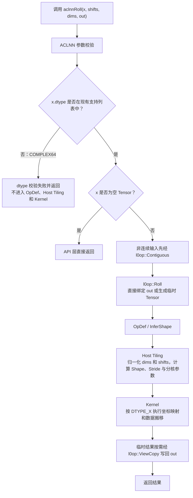
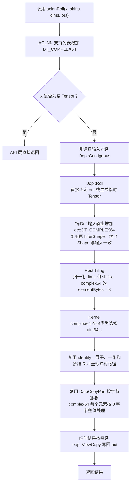

# 需求背景（required）

## 需求来源

本需求来源于《7月社区任务-aclnnRoll算子开发任务书》。任务要求在
[`cann/ops-math`](https://gitcode.com/cann/ops-math) 已有 `aclnnRoll`
实现基础上增加 `complex64` 输入支持，为 PyTorch 侧 `torch.roll`、
`torch.fft.fftshift` 和 `torch.fft.ifftshift` 的复数输入适配提供
NPU 算子能力。

## 背景介绍

### aclnnRoll算子现有实现

本任务修改的算子位于：

```text
experimental/math/roll
```

现有实现由 ACLNN API、算子原型、InferShape、Host Tiling 和 Ascend C
Kernel 组成。ACLNN API 对非连续输入调用 `l0op::Contiguous`，Kernel
根据 Host 下发的 Shape、Stride、位移和分核参数执行数据搬移。

### aclnnRoll算子实现现状分析

| 参数 | 参数含义 | 支持数据类型 | 数据格式 | 形状 | 非连续 Tensor |
| --- | --- | --- | --- | --- | --- |
| `x` | 输入 Tensor | BFLOAT16、FLOAT16、FLOAT32、INT8、UINT8、INT32、UINT32 | ND | 0～8 维 | 支持 |
| `shifts` | 各维度循环移动的步数 | int64 数组 | - | `dims` 非空时与 `dims` 等长；`dims` 为空时长度为 1 | - |
| `dims` | 指定循环移动的维度 | int64 数组，可空 | - | 非空时与 `shifts` 等长，每项位于 `[-rank, rank)`；0 维 Tensor 时必须为空 | - |
| `out` | 输出 Tensor | 与 `x` 相同 | ND | 与 `x` 相同 | - |
| `workspaceSize` | Device Workspace 大小 | uint64 指针 | - | - | - |
| `executor` | 算子执行器 | `aclOpExecutor` 二级指针 | - | - | - |

现有 ACLNN API 和 OpDef 未声明 `COMPLEX64`，Host Tiling 也未按
8 字节识别 complex64 元素大小；Kernel 需要把实部和虚部作为一个完整的
8 字节元素移动。任务同时要求适配 Atlas A2、A3、A5 训练系列产品。

#### aclnnRoll算子现状流程图



### aclnnRoll算子功能分析

Roll 沿指定维度循环移动 Tensor 元素。设维度长度为 `n`、位移为 `s`，
归一化后的位移为：

```text
normalizedShift = ((s % n) + n) % n
```

输出坐标 `outputCoord` 对应的输入坐标为：

```text
inputCoord = (outputCoord - normalizedShift + n) % n
```

当 `dims` 为空时，输入按逻辑顺序展平后执行一维 Roll，再恢复原 Shape。
相同维度出现多次时，各次位移在该维度上累加后取模。

complex64 由相邻的两个 32 位浮点数组成，一个逻辑元素占 8 字节。Roll
不进行复数计算，只改变元素位置，因此移动过程必须保持每个 complex64
元素的 64 位模式不变。

# 需求分析（required）

## 需求描述

在不改变 `aclnnRoll` 接口语义的前提下，为输入和输出增加
`COMPLEX64` 支持。complex64 输入下的结果与 CPU PyTorch
`torch.roll` 对齐，并覆盖 `torch.fft.fftshift` 和
`torch.fft.ifftshift` 的调用场景。保持原有 dtype 的功能和性能不变，
使用 Ascend C 开发，适配 CANN 8.5.0 及以上版本和 Atlas A2、A3、A5
训练系列产品。

## 需求拆解

1. ACLNN API 的输入 dtype 支持列表增加 `DT_COMPLEX64`。
2. OpDef 的输入、输出 dtype 增加 `ge::DT_COMPLEX64`。
3. Host Tiling 按 8 字节计算 complex64 元素大小。
4. Kernel 将 complex64 作为完整的 8 字节存储单元移动。
5. 复用现有空 `dims`、负维度、重复维度和正负超大位移处理逻辑。
6. 复用现有非连续输入连续化流程。
7. Host 继续通过平台接口获取 AIV 核数和 data block 大小，Kernel 使用
   相同的平台 data block 大小进行对齐搬移。
8. 注册并构建 `ascend910b`、`ascend910_93`、`ascend950`。
9. 补充 complex64 泛化测试和全部原有 dtype 回归测试。

# 详细设计（required）

## 算子分析

### 数学公式

对输出位置 `outputCoord`，其来源位置为：

```text
normalizedShift = ((shift % dimSize) + dimSize) % dimSize
inputCoord = (outputCoord - normalizedShift + dimSize) % dimSize
```

complex64 只参与数据搬移：

```text
outputBits64[dstIndex] = inputBits64[srcIndex]
```

### 支持数据类型

BFLOAT16、FLOAT16、FLOAT32、INT8、UINT8、INT32、UINT32、COMPLEX64。

### 支持形状

- 输入、输出格式为 ND；
- 输入 Rank 为 0～8；
- 输出 Shape 与输入 Shape 相同；
- 支持空 Tensor 和非连续 Tensor；
- 支持空 `dims`、负维度、重复维度和多维度 Roll。

## 算子实现

### 实现方案

#### 3.2.1 host侧设计：

ACLNN API 设计：

1. 在 `op_api/aclnn_roll.cpp` 的支持列表中增加
   `op::DataType::DT_COMPLEX64`。
2. 保持现有空指针、dtype、Format、Shape、Rank 和属性合法性校验。
3. 非连续输入继续通过 `l0op::Contiguous` 转为连续逻辑 Tensor；非稠密
   输出继续通过 `l0op::ViewCopy` 写回。
4. 空 Tensor 继续在 API 层直接返回，不启动 Roll Kernel。

OpDef 和 InferShape 设计：

1. 在 `op_host/roll_def.cpp` 的输入和输出中增加
   `ge::DT_COMPLEX64`，对应 Format 和 UnknownShapeFormat 增加 ND。
2. 注册 `ascend910b`、`ascend910_93` 和 `ascend950`。
3. `scripts/kernel/binary_config/ascendc_config.json` 中 Roll 的
   `compute_units` 与 OpDef 保持一致。
4. InferShape 继续把输入 Shape 复制给输出。

Tiling 策略：

1. `DT_COMPLEX64` 的元素字节数为 8。
2. 负维度加 Rank 转换为非负维度；位移使用正模归一化；重复维度的位移
   累加后取模。
3. `dims` 为空时把 Tensor 视为一维；其他场景继续计算连续 Shape 和
   Stride。
4. 继续使用现有 Roll TilingData 和 TilingKey。

分核策略：

1. complex64 复用现有 Roll 分核策略和性能策略。
2. 通过平台信息获取可用 AIV 核数和 data block 大小。
3. complex64 按 8 字节元素换算一个 data block 包含的元素数。
4. 现有每核处理量、尾核和越界保护逻辑保持不变。

UB 内存和数据分块策略：

1. 保留现有单缓冲策略，输入 Queue 和输出 Queue 各分配一个 Buffer。
2. 每个 Queue 的 `ubElements = 64 KB / elementBytes`；complex64 的
   `elementBytes` 为 8，因此每个 Queue 容纳 8192 个元素，两个 Queue
   合计占用约 128 KB UB。
3. Host 和 Kernel 均通过平台接口获取 data block 大小。
4. data block 大小无效时，Host 记录错误日志并返回失败。

数据检测：

1. 复用现有输入、输出、属性、Shape 和 TilingData 判空检查。
2. 复用现有 dtype、Format、Shape 和 Rank 校验。
3. 复用现有 `dims` 与 `shifts` 长度及维度范围检查。

#### 3.2.2 kernel侧设计：

1. 参考仓内 `experimental/conversion/as_strided` 的纯搬移算子做法，
   根据构建系统注入的原始数据类型选择 Kernel 存储类型：

```cpp
#if defined(ORIG_DTYPE_X) && ORIG_DTYPE_X == DT_COMPLEX64
using RollDataType = uint64_t;
#else
using RollDataType = DTYPE_X;
#endif
```

complex64 路径使用 `uint64_t` 表示 8 字节搬移宽度，不声明或覆盖
CANN 的 `complex64` 类型，也不参与整数或复数运算。

2. 继续复用现有 `Roll<RollDataType>` 及其 identity、展平、一维、多维、
   末维和非末维搬移路径。
3. Kernel 通过 `Ops::Base::GetUbBlockSize()` 获取 data block 大小。
4. 非对齐尾块继续使用 `DataCopyPad`，实际搬移字节数为：

```text
blockLen = currentElements * sizeof(T)
```

5. 输入 Queue 和输出 Queue 继续按 Host 下发的 `ubElements` 初始化。
6. complex64 的实部和虚部始终作为同一个 8 字节元素移动。
7. 保留现有批量搬移路径和多核切分。

#### aclnnRoll算子实现流程图



## 支持硬件

| 支持的芯片版本 | SoC/build 参数 | NpuArch | 涉及勾选 |
| --- | --- | --- | --- |
| Atlas A2 训练系列产品 | `ascend910b` | DAV_2201 | √ |
| Atlas A3 训练系列产品 | `ascend910_93` | DAV_2201 | √ |
| Atlas A5 训练系列产品 | `ascend950` | DAV_3510 | √ |

## 算子约束限制

无。

# 可维可测分析

## 精度标准/性能标准

| 验收标准 | 描述（不涉及说明原因） | 标准来源 |
| --- | --- | --- |
| complex64 精度标准 | 与 CPU PyTorch Golden 对齐，采用 AscendOpTest 默认阈值 | 任务书 |
| 泛化标准 | 覆盖 0～8 维、空 Tensor、空/负/重复/多维 `dims`、正负超大 `shifts`、非连续输入、奇偶长度和非 data block 对齐数据 | 任务书 |
| 框架语义 | `aclnnRoll` 与 `torch.roll` 语义对齐，为框架侧 `torch.fft.fftshift`、`torch.fft.ifftshift` 的 complex64 适配提供算子能力 | 任务书 |
| 原 dtype 回归 | BFLOAT16、FLOAT16、FLOAT32、INT8、UINT8、INT32、UINT32 功能保持不变 | 任务书特别注意事项 |
| 性能标准 | 无新增性能指标；原有 dtype 不出现性能回退 | 任务书 |
| 平台标准 | A2、A3、A5 目标构建通过，真机验证按官方提供的验收资源执行 | 任务书 |

单元测试覆盖 API、InferShape、Tiling 和 Kernel。Kernel 测试使用不同的
64 位模式验证 complex64 元素完整移动；端到端测试以 CPU PyTorch 生成
Golden。自测交付件包含自测用例、测试代码和脚本、脚本运行 README，以及
覆盖全部用例的结果报告、执行日志/截图、整体通过截图和性能数据截图。

## 兼容性分析

本需求是现有算子的 dtype 扩展，`aclnnRoll` 函数签名、属性语义、
输出 Shape、TilingKey 和现有 Roll 搬移算法保持兼容。complex64 复用
同一套 Host Tiling 和 Kernel 调度，仅增加 8 字节元素类型映射。

共享修改涉及平台 data block 对齐，因此需要对全部原有 dtype 执行功能和
性能回归。非连续输入继续复用 ACLNN 现有连续化流程；空 Tensor、0 维
Tensor、重复维度和超大位移继续使用现有语义。
