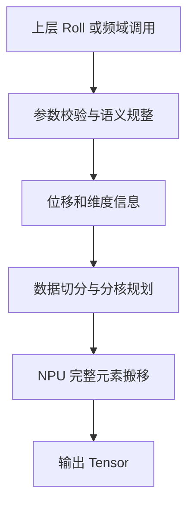
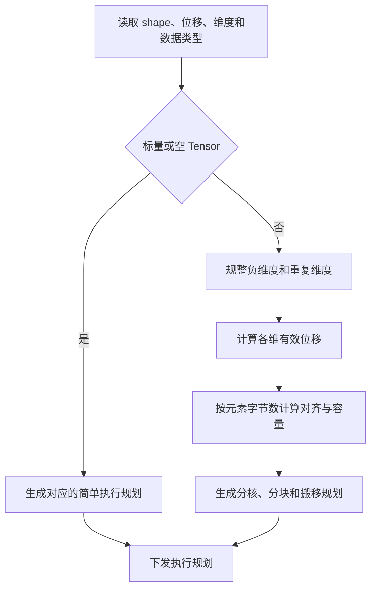
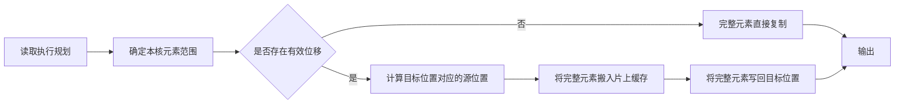

# aclnnRoll complex64 扩展设计文档

# 需求背景（required）

## 需求来源

本设计对应 2026 年 7 月 aclnnRoll 社区任务。任务要求在现有 Roll 语义基础上
扩展 complex64 支持，使 NPU 能够处理 complex64 输入的 roll、fftshift 和
ifftshift 场景。

适配范围为 Atlas A2、A3、A5 训练系列产品。开发语言为 Ascend C，适用 CANN 8.5.0 及以上。

## 背景介绍

### 业务场景

快速傅里叶变换后的频谱通常需要调整零频分量的位置。fftshift 和 ifftshift
通过在指定维度进行循环位移完成该调整，complex64 是频域数据的常用表示。

Roll 的本质是按位置重排元素，不对元素做加、减、乘、除等数值计算。因此，
complex64 的实部和虚部必须作为同一个元素整体移动，不能将两部分拆开处理。

### 算子功能分析

现有 Roll 已支持常用数值数据类型和通用滚动语义。本次设计在保持已有能力
不变的前提下，新增 complex64 数据类型，并将其作为完整元素参与所有位置
计算、对齐计算和数据搬移。

### 接口规格

| 参数 | 输入/输出 | 说明 | 数据类型 | 格式 | shape | 非连续 Tensor |
| --- | --- | --- | --- | --- | --- | --- |
| x | 输入 | 原始数据 | bfloat16、float16、float32、int8、uint8、int32、uint32、complex64 | ND | 0 到 8 维 | 支持 |
| shifts | 输入 | 各维度滚动步数 | 整数列表 | - | 与 dims 语义对应 | - |
| dims | 输入 | 指定滚动维度 | 整数列表 | - | 值域为 [-rank, rank - 1] | - |
| out | 输出 | 滚动结果 | 与 x 相同 | ND | 与 x 相同 | - |
| 执行资源 | 输出 | 执行所需的临时资源和执行上下文 | - | - | - | - |

当 dims 非空时，shifts 与 dims 的长度必须一致；当 dims 为空时，shifts 长度
必须为 1。



# 需求分析（required）

## 外部组件依赖

| 组件 | 作用 |
| --- | --- |
| CANN 运行时与 Ascend C | 提供算子调度、内存管理和 NPU 执行能力 |
| CPU PyTorch | 提供 roll 语义的独立数值对标 |
| AscendOpTest | 提供数据生成、golden 生成和默认阈值精度比较能力 |

## 内部适配模块

| 模块 | 职责 |
| --- | --- |
| 接口层 | 校验输入输出和属性，组织算子执行 |
| Host 侧 | 规整位移与维度，完成切分、分核和搬移规划 |
| Kernel 侧 | 依据规划按完整元素搬移数据 |
| 测试层 | 覆盖功能、泛化、精度、性能和已有数据类型回归 |

## 需求描述

1. 支持 complex64 输入和输出，结果与 PyTorch roll 语义一致。
2. 保持 bfloat16、float16、float32、int8、uint8、int32、uint32 的功能和
   性能特征不变。
3. 覆盖合法的 shape、维度、位移、空 Tensor 和非连续 Tensor 场景。
4. 支持 fftshift 和 ifftshift 所需的单维及多维滚动组合。
5. 在 Atlas A2、A3、A5 训练系列产品上提供一致的接口和功能语义。

## 需求拆解

| 编号 | 子需求 | 设计目标 |
| --- | --- | --- |
| R1 | complex64 类型支持 | 输入输出能够识别并保持 complex64 元素 |
| R2 | 元素完整性 | 实部和虚部始终作为一个元素搬移 |
| R3 | Roll 语义 | 位移、维度、重复维度和空维度符合 PyTorch 定义 |
| R4 | 泛化能力 | 覆盖 rank 0 到 8、空 shape、非连续 view 等合法输入 |
| R5 | 兼容性 | 原有数据类型和原有调用方式不受影响 |
| R6 | 多硬件适配 | 各目标硬件使用相应资源规划实现同一语义 |

# 详细设计（required）

## 算子分析

### 数学语义

当被滚动维度的长度 n 大于 0 时，先将位移规整为：

```text
s = shifts mod n, 其中 0 <= s < n
```

输出坐标 i 对应的输入坐标为：

```text
y[i] = x[(i - s + n) mod n]
```

多维场景对每一个指定维度执行同一规则。重复维度的位移先累计再取模；当维度
列表为空时，将 Tensor 视为一维逻辑序列进行滚动。标量和空 Tensor 不参与
非零长度维度的位移归一化，保持既有 shape 和数据语义。

### 支持数据类型

| 数据类型类别 | 支持范围 |
| --- | --- |
| 新增数据类型 | complex64 |
| 原有数据类型 | bfloat16、float16、float32、int8、uint8、int32、uint32 |

### 支持形状

| 项目 | 支持范围 |
| --- | --- |
| 数据格式 | ND |
| 输入输出 shape | 相同 |
| rank | 0 到 8 |
| 位移 | 支持正、负和超出维度长度的位移 |
| 维度 | 支持正维度、负维度和重复维度 |
| 存储视图 | 支持非连续输入 |

### 数据表示

complex64 的一个元素占用连续的 8 字节，其中包含一对浮点分量。Roll 不解释
或计算这两个分量，而是把 8 字节作为不可分割的原子载荷进行位置重排。

该原则带来两个设计约束：

1. 所有对齐、分块和容量计算必须以 8 字节元素为单位换算。
2. 所有搬移路径必须按完整元素读写，不能在元素内部切分。

## 算子实现

### 总体设计

算子由接口、Host 和 Kernel 三个层次组成。接口层负责确保输入合法；Host 侧
将上层语义转换为适合 NPU 执行的规划；Kernel 侧仅根据规划搬移完整元素。


### Host 侧设计

#### 参数校验与语义规整

Host 侧保持既有接口约束：输入和输出均有效，输入输出数据类型相同，shape
一致，格式为 ND，rank 不超过 8。位移列表和维度列表满足长度约束，维度值
落在 [-rank, rank - 1] 的合法范围内。

Host 侧将负维度转换为等价的非负维度。对重复维度，按出现顺序累计位移并按
该维长度取模，由此得到每一维的最终有效位移和活动维度集合。

当没有活动维度时，输出与输入位置一致；当维度列表为空时，使用逻辑一维
序列；其余场景保留完整的多维坐标关系。

#### 切分、对齐与分核策略

Host 侧以逻辑元素数进行分核，以元素实际字节数进行内存对齐和片上缓存容量
计算。对于 complex64，每个元素固定为 8 字节，因此所有内存边界和搬移大小
均以完整 complex64 元素换算。

分核采用按可用计算资源均分逻辑元素区间的策略。每个核只处理自己的连续目标
区间，并根据滚动映射读取相应源区间。块大小由片上缓存容量、元素字节数和
对齐要求共同确定，尾部不足整块的元素使用完整元素粒度处理。



#### 性能优化策略

1. 复用 Roll 的数据搬移模型。complex64 不进行实虚拆分、数值转换或额外的
   中间计算，避免新增读写和额外启动开销。
2. 以完整元素为单位对齐和分块，使每次连续搬移包含尽可能多的有效元素，减少
   小块和尾块处理比例。
3. 按可用计算资源均分工作量，降低核间负载不均；每个核独立处理目标区间，
   不引入跨核同步。
4. 保持原有数据类型使用其既有策略，complex64 的新增规则只作用于完整元素
   搬移，避免影响已有数据类型的性能路径。

### Kernel 侧设计

Kernel 不进行复数运算。它根据 Host 侧下发的规划，将目标位置转换为源位置，
再把源位置的完整元素复制到目标位置。

对于 complex64，Kernel 使用 8 字节原子载荷进行搬移。这样无论是单维、多维、
末维、中间维、连续输入还是经规整后的非连续输入，实部和虚部都会保持配对。

无有效位移时，Kernel 使用直接复制；存在有效位移时，采用按逻辑坐标计算源
位置的分段搬移方式。该方式优先保证元素完整性和所有合法维度组合的正确性。



## 支持硬件

| 目标硬件 | 资源规划原则 | 数据搬移原则 |
| --- | --- | --- |
| Atlas A2 训练系列产品 | 根据该产品的可用核数和片上缓存容量生成规划 | 按完整 complex64 元素进行搬移 |
| Atlas A3 训练系列产品 | 根据该产品的可用核数和片上缓存容量生成规划 | 按完整 complex64 元素进行搬移 |
| Atlas A5 训练系列产品 | 根据该产品的可用核数和片上缓存容量生成规划 | 按完整 complex64 元素进行搬移 |

各目标硬件可根据自身资源选择不同的分核和分块规模，但接口、位移规整、元素
完整性和输出语义保持一致。每类硬件均需独立完成构建、功能、精度和回归验证。

## 算子约束限制

本次扩展不新增任务书之外的算子约束。输入输出 shape 和数据类型相同，格式
为 ND，rank 为 0 到 8，位移和维度列表满足接口规格。

# 可维可测分析

## 精度标准/性能标准

| 验收项 | 标准 | 验证思路 |
| --- | --- | --- |
| complex64 功能 | 与 CPU PyTorch roll 语义一致 | 使用相同输入比较输出位置和数值 |
| complex64 精度 | 使用 AscendOpTest 默认 complex64 阈值 | CPU 生成 golden，NPU 生成实际输出后比较 |
| 元素完整性 | 实部和虚部保持配对 | 使用可区分的复数载荷检查逐元素对应关系 |
| 原有数据类型 | 功能、语义和性能不变 | 覆盖原有数据类型的功能和性能回归 |
| 性能 | 无单独性能门槛 | 记录典型 shape 的性能数据并检查原有路径无回归 |

### 测试设计

| 测试类别 | 覆盖内容 |
| --- | --- |
| 基础功能 | 单维、双维、多维滚动和零位移 |
| 维度泛化 | rank 0 到 8、正负维度、重复维度 |
| 位移泛化 | 正位移、负位移、大位移和按维度长度取模 |
| shape 泛化 | 常规 shape、空 Tensor、标量和边界长度 |
| 存储泛化 | 连续输入和非连续输入 |
| 目标场景 | fftshift 和 ifftshift 对应的滚动组合 |
| 数据类型 | complex64 与所有原有支持类型 |
| 异常输入 | 非法维度、属性长度不匹配、shape 不匹配和 dtype 不匹配 |
| 硬件覆盖 | Atlas A2、A3、A5 分别执行功能、精度和回归测试 |

## 兼容性分析

1. 语义兼容：新增 complex64 后，Roll 的位移规则与 PyTorch roll 保持一致。
2. 框架兼容：fftshift 和 ifftshift 可复用 Roll 的 complex64 能力，不需要
   改变上层调用语义。
3. 类型兼容：原有数据类型继续使用既有行为；complex64 只增加完整元素搬移
   规则。
4. 硬件兼容：各目标硬件保持一致的接口、数据表示和输出语义。
