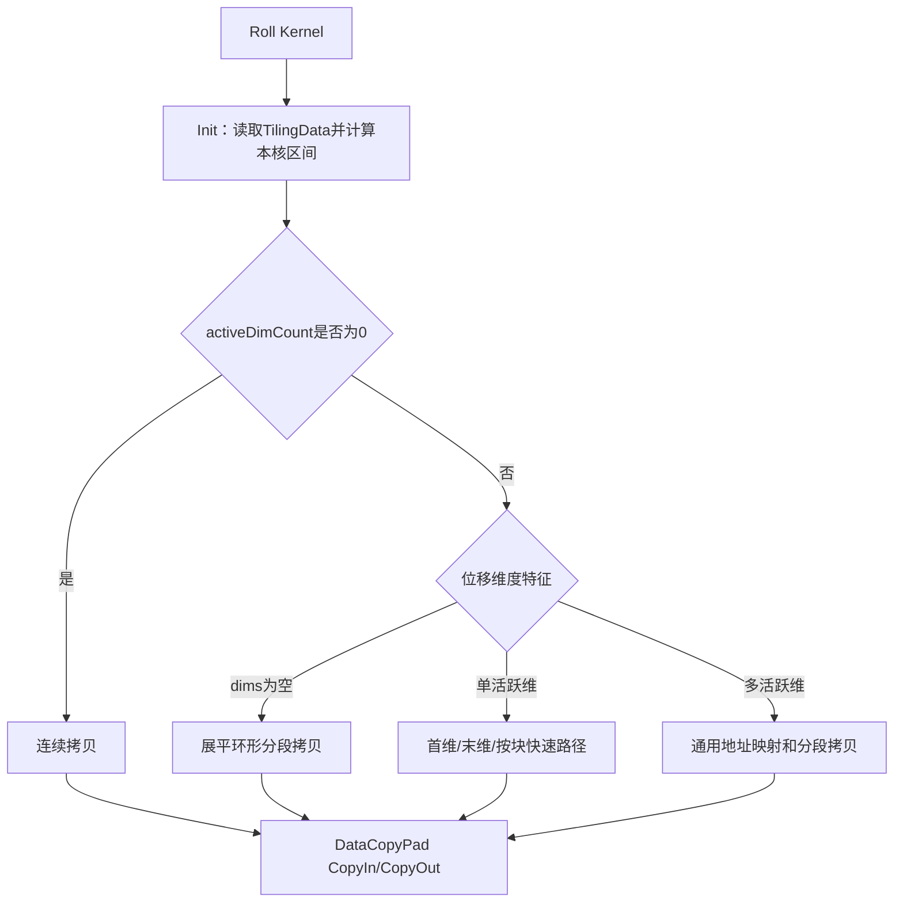

# 需求背景（required）

## 需求来源

7月社区任务——`aclnnRoll` 算子开发任务书。任务要求在已有 `aclnnRoll` 算子基础上扩展支持 complex64 数据类型，使框架侧能够适配 `torch.fft.fftshift`、`torch.fft.ifftshift` 输入为 complex64 的场景。

## 背景介绍

### aclnnRoll算子实现优化

基于已有 Ascend C `aclnnRoll` 实现扩展 complex64 输入与输出支持。

aclnnRoll算子实现路径和相关API路径：

aclnnRoll算子实现路径为：`experimental/math/roll`

aclnnRoll算子中的API路径为：`experimental/math/roll/op_api`

aclnnRoll算子中的Host侧实现路径为：`experimental/math/roll/op_host`

aclnnRoll算子中的Kernel侧实现路径为：`experimental/math/roll/op_kernel`

### aclnnRoll算子现状分析

通过对aclnnRoll算子现有版本的功能分析，当前支持的能力如下：

| 参数 | 参数含义 | 数据类型 | 支持数据类型 | 约束 | 形状 |
| --- | --- | --- | --- | --- | --- |
| x | 输入tensor | tensor | uint8、int8、bfloat16、float16、float32、int32、uint32 | ND格式，支持非连续Tensor | 0-8维 |
| shifts | 指定各维度滚动步数 | int64数组 | int64 | 与dims长度一致；dims为空时长度为1 | - |
| dims | 指定滚动维度 | int64数组 | int64 | 取值范围为[-x.dim(), x.dim()-1] | - |
| out | 输出tensor | tensor | uint8、int8、bfloat16、float16、float32、int32、uint32 | 与x的数据类型和shape一致 | 与x一致 |

现有aclnnRoll实现由API、Host和Kernel三部分组成：API侧完成参数校验和非连续Tensor适配；Host侧完成shifts归一化、shape/stride计算、分核和UB切分；Kernel侧根据活跃维度选择展平搬运、首维搬运、末维按行搬运、单维按块搬运或多维通用搬运路径。

当前算子注册、ACLNN参数校验和Host侧数据类型长度计算均未包含complex64，因此输入tensor的数据类型为complex64时会在接口校验阶段报错。

计算公式：`out[o] = x[source(o)]`

### aclnnRoll算子功能分析

aclnnRoll算子功能：按照shifts和dims指定的规则，对输入tensor中的元素执行循环移动。

输入：x、shifts、dims

输出：out

支持数据类型：uint8、int8、bfloat16、float16、float32、int32、uint32、complex64（新增）

支持形状：0-8维ND Tensor

支持非连续Tensor：支持，由ACLNN层通过`Contiguous`和`ViewCopy`完成适配

Roll是纯数据重排算子，不涉及复数算术。complex64由相邻的real和imag两个float32分量组成，单个逻辑元素占8字节。本次扩展需要将每个complex64作为不可分割的8字节逻辑元素进行搬运，避免分核、分块或尾块处理时出现实部和虚部错位。

# 需求分析（required）

## 需求描述

在不改变aclnnRoll已有数据类型功能和性能的前提下，使用Ascend C扩展支持complex64输入和输出，使complex64场景下的计算结果与PyTorch `torch.roll`语义一致，并支持`torch.fft.fftshift`、`torch.fft.ifftshift`复数频谱重排场景。

## 需求拆解

1. OpDef和ACLNN参数校验增加complex64数据类型
1. Host侧按照complex64单元素8字节计算分核、对齐和UB切分
1. Kernel侧使用8字节宽类型作为complex64的纯搬运载体，不进行Cast和复数计算
1. 支持0-8维、正负shifts、正负dims、重复dims、dims为空、空Tensor和非连续Tensor等泛化场景
1. 保持uint8、int8、bfloat16、float16、float32、int32、uint32原有功能和性能不变

# 详细设计（required）

## 算子分析

### 数学公式

设输入shape为`S=(s0,...,sn-1)`，对每个指定维度`d`，将该维度上的位移累加并归一化：

```text
shift[d] = ((sumShift[d] % s[d]) + s[d]) % s[d]
```

对于输出坐标`o=(o0,...,on-1)`，其对应的输入坐标为：

```text
source[d] = (o[d] - shift[d] + s[d]) % s[d]
out[o] = x[source]
```

当dims为空时，将输入tensor逻辑展平为长度为N的一维数组后执行循环移动。

### 支持数据类型

uint8、int8、bfloat16、float16、float32、int32、uint32、complex64（新增）

其中complex64单个逻辑元素由real和imag两个float32组成，占8字节。Kernel侧将其按`uint64_t`宽类型进行原样搬运，不读取或修改实部、虚部数值。

该方案参考仓内复数算子的实现思路：`complex_v3/op_kernel/complex_v3.h`使用`ReinterpretCast<uint64_t>`表示一对float32分量，`real/op_kernel/real.cpp`使用独立complex64 tilingkey选择宽类型Kernel分支。

### 支持形状

支持0-8维ND Tensor，输入与输出shape一致；支持空Tensor、标量、dims为空的展平移动、正负shifts、正负dims、重复dims、零位移和非连续Tensor；不支持广播。

## 算子实现

### 实现方案

#### 3.2.1 host侧设计：

tiling策略：

Host侧首先获取输入shape、数据类型、shifts和dims属性。对负dims进行转正，对shifts进行正模归一化；同一维度在dims中重复出现时，将对应shifts累加后再次取模。随后根据连续ND布局从后向前计算各维度stride，并统计非零位移对应的活跃维度数量。

当dims为空时，将输入数据视为长度为totalNum的一维向量；当仅有一个活跃维度时，额外计算outerSize、dimSize、innerSize和activeShift，供Kernel侧选择单维快速路径；多个维度同时移动时，下发完整shape、stride和shift信息，供Kernel侧执行通用地址映射。

complex64场景下，Host侧所有shape、stride、shift、每核处理量仍以“复数元素个数”为单位，仅数据类型长度设置为8字节。一个32B GM数据块包含4个complex64元素，UB可容纳的元素数量按`UB_BYTES / 8`计算。

##### 1. 分核策略：

优先使用满核的原则。

根据输入总元素数、数据类型长度和平台AIV核数计算每核处理量。先计算`rawPerCore = ceil(totalNum / coreNum)`，再按照32B基础对齐粒度进行向上对齐；对于末维或单活跃维搬运路径，可进一步按照完整行或完整数据块扩大切分粒度，减少跨核边界产生的非连续搬运。

如果核间能均分，可视作无大小核区分，各核处理的数据量一致；如果核间不能均分，前`blockDim-1`个核处理`perCoreElements`个元素，尾核处理`lastCoreElements`个元素。

对于总字节数不超过4096B的小Tensor，默认使用单核执行，避免多核调度开销；原有BF16、FP16、UINT8和INT32类型的特殊分核优化保持不变，complex64不进入原有数据类型专用分支。

##### 2. 数据分块和内存优化策略：

充分使用UB空间的原则。

Kernel侧设置输入队列和输出队列，Host侧根据数据类型长度计算`ubElements`。complex64使用`uint64_t`作为搬运载体，因此单个buffer占用空间为`ubElements * sizeof(uint64_t)`，与Host侧按8字节计算的结果保持一致。

数据搬运以连续逻辑元素段为单位，单次搬运字节数为`currentElements * typeSize`。完整块和尾块均通过`DataCopyPad`完成，尾块可以处理非32B整数倍的数据长度。complex64任意搬运段均以8字节元素为边界，不会将real和imag拆分到不同搬运段中。

Host侧将`totalNum`、`perCoreElements`、`lastCoreElements`、`usedCoreNum`、`ubElements`、`dimNum`、`shapes`、`strides`、`shifts`和单活跃维优化参数写入`RollTilingData`并下发到Kernel侧。

##### 3. tilingkey规划策略：

不需要新增tilingkey。所有数据类型继续使用`ROLL_TPL_SCH_MODE_0`，Kernel入口通过`DTYPE_X`获取数据类型。

参考仓内Tile算子的实现方式，在Kernel头文件中定义`using complex64 = uint64_t`，构建系统生成complex64实例时，`DTYPE_X`映射到8字节宽类型。complex64与普通数据类型复用相同的索引计算、分核和数据搬运逻辑，不增加额外workspace和Kernel分支。

数据检测：

Host侧检查输入和输出shape一致、数据类型一致、维度不超过8；shifts与非空dims长度必须一致，dims为空时shifts长度必须为1；dims取值必须位于`[-x.dim(), x.dim()-1]`范围内。

#### 3.2.2 kernel侧设计：

进行Init和Process两个阶段，其中Process根据输入特征选择不同的数据搬运路径，整体包括数据搬入（CopyIn）和数据搬出（CopyOut），不包含数值计算阶段。

1. Init阶段读取RollTilingData，根据blockIdx计算当前核的startIndex和elementCount，并按照ubElements初始化输入、输出队列。
2. 所有数据类型统一使用`Roll<DTYPE_X>`；complex64构建实例中的`DTYPE_X`为`uint64_t`别名，输入和输出GM地址按8字节宽的`GlobalTensor<uint64_t>`处理，数据仅按bit原样复制。
3. activeDimCount为0时执行连续拷贝；dims为空时执行展平环形分段拷贝；单活跃维根据位置选择首维、末维按行或单维按块路径；多活跃维通过输出线性下标反推输入线性下标并合并连续搬运段。
4. 搬运时`blockLen = currentElements * sizeof(T)`。complex64场景下`sizeof(T)=8`，因此NaN、Inf、带符号零以及任意实部、虚部bit pattern均保持不变。
5. Ascend C的aclnnRoll算子流程见下图。



## 支持硬件

| 支持的芯片版本 | 涉及勾选 |
| --- | --- |
| Atlas A2系列产品 | √ |
| Atlas A3系列产品 | √ |
| Atlas A5系列产品 | √ |

## 算子约束限制

1. 支持0-8维ND Tensor，输入和输出的数据类型、shape必须一致。
1. shifts和非空dims的长度必须一致；dims为空时shifts长度必须为1。
1. dims取值范围为`[-x.dim(), x.dim()-1]`。
1. 支持非连续输入Tensor；非连续输入和输出由ACLNN层进行连续化和视图回写。
1. 本需求仅新增complex64，不支持complex128。
1. 不支持广播。

# 可维可测分析

## 精度标准/性能标准

| 验收标准 | 描述(不涉及说明原因) | 标准来源 |
| --- | --- | --- |
| 精度标准 | complex64输出与CPU/PyTorch torch.roll结果对齐，采用AscendOpTest默认阈值 | 任务书 |
| 性能标准 | 无额外性能要求；complex64不引入实虚拆分、Cast、额外workspace或额外Kernel，原有数据类型性能不劣化 | 任务书 |

## 兼容性分析

本次为已有aclnnRoll算子扩展数据类型，不修改API原型、属性语义和输出shape。原有uint8、int8、bfloat16、float16、float32、int32、uint32继续使用原tilingkey和Kernel路径；complex64仅新增8字节数据类型长度计算和宽类型映射，因此不影响已有功能和性能。
