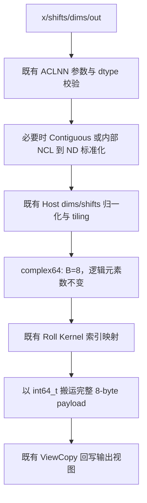

# 【社区任务】aclnnRoll 算子 complex64 扩展设计文档

## 一、需求描述

### 1.1 任务目标

本设计对应社区任务 `aclnnRoll`。开发对象是开源仓已经存在的 Ascend C `aclnnRoll` 工程 `ops-math/experimental/math/roll/`。本次只在该既有实现上扩展 `complex64` 输入和输出支持，不重新实现 Roll 算法，不使用自动生成 ACLNN 源码替换现有源码。

目标是使 `torch.roll`、`torch.fft.fftshift` 和 `torch.fft.ifftshift` 的 complex64 场景可沿既有 ACLNN Roll 调用链在 NPU 执行，同时保持原有 dtype、接口、tiling 协议和性能路径不变。

### 1.2 需求拆解

1. ACLNN API 在已有 dtype 校验基础上接受 `ACL_COMPLEX64`。
2. Roll OpDef 输入/输出增加 `DT_COMPLEX64`，公开格式仍为 `ND`。
3. Host tiling 将 complex64 识别为一个完整的 8-byte 逻辑元素。
4. Ascend C Kernel 使用等宽 `int64_t` 存储别名搬运 complex64 payload，不进行复数算术或 Cast。
5. 补充 API、Host、Kernel UT，A3 真实 e2e 和 AscendOpTest 默认阈值验证；覆盖原 dtype 回归。

### 1.3 既有实现基线

| 层级 | 既有文件 | 原有职责 | 本次改动 |
| --- | --- | --- | --- |
| ACLNN | `op_api/aclnn_roll.cpp/.h` | 参数检查、连续化、执行器组装、输出回写 | 新增 complex64 校验与内部格式兼容 |
| L0 | `op_api/roll.cpp/.h` | 创建输出并下发 Roll AICore 任务 | 沿用 |
| OpDef | `op_host/roll_def.cpp` | 注册 dtype、格式、属性、SoC | 增加 complex64 配置 |
| Shape | `op_host/roll_infershape.cpp` | 输出 shape 推导 | 沿用 |
| Tiling | `op_host/roll_tiling.cpp` | dims/shifts 归一化、分核、UB 参数 | 新增 8-byte 元素大小 |
| Kernel | `op_kernel/roll.cpp/.h` | 索引映射和 GM/UB 搬运 | complex64 使用等宽存储别名 |
| 测试 | `tests/ut`、`tests/e2e` | UT 与设备回归 | 新增 complex64 和原 dtype 回归 |

既有实现已覆盖 Roll 的维度归一化、分核、连续/非连续张量整理、GM/UB 搬运、尾块处理和输出回写。本次不改变这些算法路径。

## 二、接口与约束

### 2.1 接口原型

```cpp
aclnnStatus aclnnRollGetWorkspaceSize(
    const aclTensor *x, const aclIntArray *shifts, const aclIntArray *dims,
    aclTensor *out, uint64_t *workspaceSize, aclOpExecutor **executor);

aclnnStatus aclnnRoll(void *workspace, uint64_t workspaceSize,
                      aclOpExecutor *executor, aclrtStream stream);
```

OpDef 原型保持为 `Roll(x, shifts, dims) -> y`。函数签名、属性数量、workspace 语义和 `RollTilingData` 布局均不变。

### 2.2 参数、类型与格式

| 参数 | 类型 | 支持 dtype | 格式 | 约束 |
| --- | --- | --- | --- | --- |
| x | Tensor | uint8、int8、bfloat16、float16、float32、int32、uint32、complex64 | ND | rank 0-8 |
| shifts | `aclIntArray*` | int64 数组 | - | `dims` 为空时长度为 1 |
| dims | `aclIntArray*` | int64 数组 | - | 可为空；非空时长度与 shifts 相同 |
| out/y | Tensor | 与 x 相同 | ND | shape/dtype 与 x 一致 |

负 dim 归一化到 `[0, rank)`；不支持广播。对外 OpDef 契约只注册 `ND`。PyTorch 三维 Tensor 的运行时 view/storage format 可能标记为 `NCL`，ACLNN 层仅在内部将其标准化到 `ND` 后调用既有 Roll，再以 `ViewCopy` 回写；这不是新增的公开格式能力。

### 2.3 数学语义

对非空 `dims`，设输出索引为 `o`，滚动维为 `d`，规范化 shift 为 `s`，维长为 `L`：

```text
i[d] = (o[d] - s) mod L
i[k] = o[k], k != d
y[o] = x[i]
```

多个 `(shifts, dims)` 按既有 Roll 归一化规则组合。`dims` 为空时先按逻辑顺序展平，执行一维循环位移，再恢复原 shape。`fftshift`/`ifftshift` 通过相应维度的 Roll 表达，偶数长度位移相同，奇数长度相差一个元素。

## 三、complex64 扩展方案

### 3.1 设计原则

1. 最小改动：仅扩展 dtype 支持和元素宽度，不新增独立 Roll 算法、tiling key 或 workspace。
2. 位模式保持：complex64 是相邻 real/imag float32 的 8-byte 存储，Roll 只移动元素，不做数值计算。
3. 原 dtype 不变：原有 Kernel 模板仍使用 `DTYPE_X`，已有分核与专用路径不修改。
4. Host/Kernel 一致：两侧均以一个 8-byte payload 作为一个 logical element。

### 3.2 ACLNN 与 OpDef

`aclnn_roll.cpp` 的已有输入、输出 dtype 校验增加 `DT_COMPLEX64`，并保持输入输出 dtype 相同。非连续输入继续经已有 `Contiguous` 处理；非连续输出继续使用已有 `ViewCopy` 回写。

`roll_def.cpp` 在已有 `ND` 配置上注册 complex64，并覆盖任务要求的 `ascend910b`、`ascend910_93`、`ascend950` package 配置。Shape 推导仍将输入 shape 原样传播到输出。

### 3.3 Host tiling 与分核

`GetDataTypeSize(DT_COMPLEX64)` 返回 8。设元素字节数为 `B`、总元素数为 `N`：

```text
elementsPerBlock = 32 / B
ubElements = ubBytes / B
```

complex64 下，一个 32-byte GM block 对应 4 个逻辑元素。分核、`perCoreElements`、`lastCoreElements`、UB 切块和尾块仍复用既有逻辑，所有 tiling 字段仍以逻辑元素个数表示。complex64 不改变索引计算，因此不新增 tiling key 或 `RollTilingData` 字段。

### 3.4 Ascend C Kernel

既有 `roll.cpp` 在编译期选择存储类型：

```cpp
#if defined(ORIG_DTYPE_X) && ORIG_DTYPE_X == DT_COMPLEX64
using RollStorageType = int64_t;
#else
using RollStorageType = DTYPE_X;
#endif
```

`int64_t` 仅作为等宽存储容器。Kernel 继续复用 `roll.h` 中已有的 Index mapping、CopyIn、CopyOut、回绕、分段与尾块路径；不会执行整数算术、Cast、实虚部分离或重组。一个模板元素对应一个完整 complex64 元素，故有：

```text
bits(y[o]) = bits(x[i])
```

### 3.5 实现流程



## 四、兼容性、精度与性能

### 4.1 兼容性

| 项目 | 结论 |
| --- | --- |
| 原有接口 ABI | 不变 |
| 原 dtype | 保持既有 dtype、shape、格式和 Kernel 路径 |
| complex64 | 新增输入/输出支持，ND、rank 0-8 |
| 空 dims/0-D/numel=0 | 沿用既有展平或空 Tensor 路径 |
| 非连续张量 | 沿用 ACLNN Contiguous/ViewCopy |
| A2/A3/A5 | 三个 SoC package 已构建；真实设备仅 A3 已验证 |

### 4.2 精度

Roll 没有浮点运算，正确性要求为元素位置与 64-bit payload 同时保持。真实 A3 e2e 使用 CPU PyTorch golden，`rtol=0`、`atol=0` 精确比较。AscendOpTest 使用默认 complex64 阈值，不在用例中覆写阈值。

### 4.3 性能

任务书没有性能门槛。complex64 单次 Roll 的最小 GM 数据流量为 `16*N` bytes（读取 8 bytes、写回 8 bytes）；小张量端到端时延包含 ACLNN、同步和可能的布局整理，不代表 Kernel 峰值。已保留真实 `msprof` 数据与截图作为验收附件；不声明未经验证的性能对比或性能提升。

## 五、测试与交付

### 5.1 分层测试

| 层级 | 内容 | 已验证状态 |
| --- | --- | --- |
| Host UT | 8-byte 元素、空 dims、重复/负 dims、尾块与 tiling | A3 8/8 通过 |
| API UT | `ACL_COMPLEX64`、int64 兼容路径 | A3 6/6 通过 |
| Kernel UT | 6 个 complex64 元素的完整 64-bit payload 搬运 | A3 2/2 通过 |
| A3 e2e | 7 complex64 Roll、7 原 dtype、4 FFT shift 调用 | 18/18 通过 |
| AscendOpTest | empty dims、重复/负 dims、正负大 shift、rank-8 | 默认 complex64 阈值 4/4 通过 |
| A2/A5 | package 构建 | 通过；未声明实机运行通过 |

complex64 Roll 用例覆盖 0-D、numel=0、空 dims 展平、负/重复 dims、正负大 shift、rank-8 负 dim、非连续输入。原 dtype 回归覆盖 uint8、int8、bfloat16、float16、float32、int32、uint32。FFT 场景覆盖 `fftshift`、`ifftshift` 的奇偶长度和全维/指定维度调用。

### 5.2 AscendOpTest

使用任务指定 AscendOpTest 仓库，`prototype.json`、`cases.json` 与 Python golden 均已提供。运行说明位于 `tests/ascend_op_test/README.md`；默认 complex64 阈值下 4 个代表性用例已通过。原始日志、CSV、整体通过截图和性能截图作为验收附件提供，不混入源码提交。

### 5.3 风险与规避

| 风险 | 规避措施 |
| --- | --- |
| 8-byte 元素宽度遗漏 | Host `GetDataTypeSize=8` 与 UT 覆盖 |
| 复数模板不可直接实例化 | 使用无算术语义的 `int64_t` 等宽容器 |
| 特殊位模式变化 | Kernel UT 比较完整 64-bit payload；e2e 对 CPU golden 精确比较 |
| NCL 误写为公开能力 | OpDef 只注册 ND，NCL 仅 ACLNN 内部标准化 |
| A2/A5 结论失真 | 明确仅 package 通过，真实设备待补 |
| 原 dtype 回归 | A3 7 类原 dtype e2e 回归与既有 UT |

### 5.4 交付件

1. 本设计文档及评审修订记录。
2. `ops-math/experimental/math/roll/` complex64 扩展源码、README 与 API 文档。
3. Host/API/Kernel UT、e2e 脚本、AscendOpTest 配置与测试运行说明。
4. 自测报告、A2/A3/A5 package 日志、A3 e2e/AscendOpTest 原始结果、整体通过截图和 `msprof` 性能截图附件。
5. 个人代码仓链接、分支和算子目录说明。

## 六、结论

本方案严格基于开源仓已有 Ascend C `aclnnRoll` 源码完成 complex64 扩展：ACLNN/OpDef 接受 complex64，Host 以 8-byte 元素 tiling，Kernel 以 `int64_t` 无损搬运完整 payload。既有接口、分核、tiling key、`RollTilingData`、原 dtype Kernel 路径和公开 ND 格式契约保持不变。

真实 A3 已完成 UT、18/18 e2e 与 AscendOpTest 默认阈值 4/4 验证；A2/A5 仅完成 package 构建。后续按社区任务流程提交完整测试交付件，再进入代码审核阶段。

## 七、修订记录

| 日期 | 版本 | 修改说明 | 作者 |
| --- | --- | --- | --- |
| 2026-07-28 | V1.0 | complex64 扩展设计 | kkio317 |
| 2026-07-29 | V1.1 | 按审核意见聚焦既有 ACLNN Roll 源码扩展；同步真实验证状态 | kkio317 |
