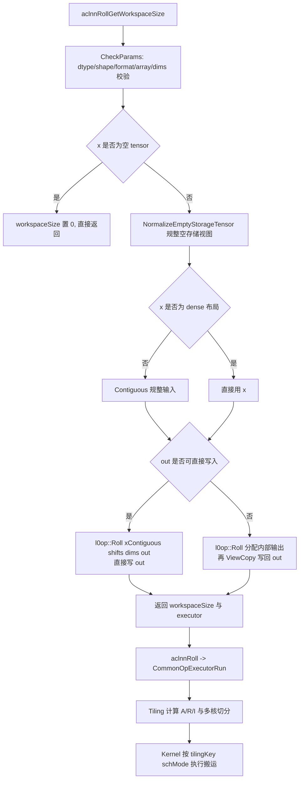
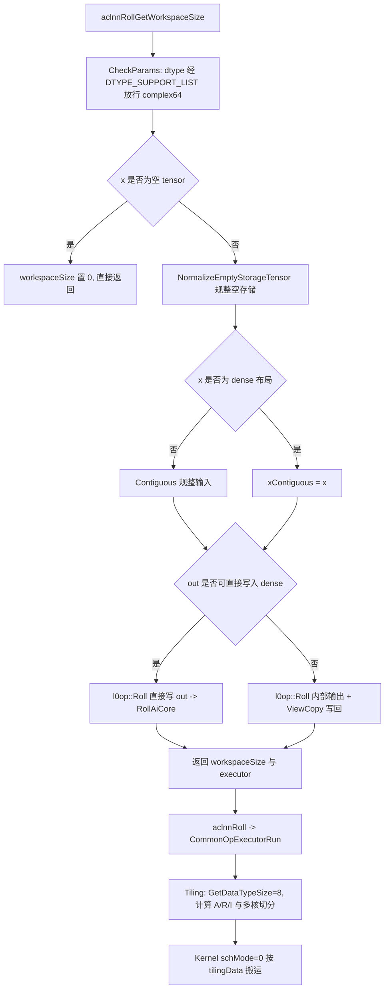

# aclnnRoll 算子 complex64 数据类型扩展设计说明书

## 一、需求背景

### 1.1 需求来源

本需求在 Atlas A2 训练系列产品上，为社区贡献的 `aclnnRoll` 算子（位于个人 fork 仓 `ops-math-zyl-roll` 的 `experimental/math/roll/`，分支 `zyl_roll`）扩展支持 `complex64` 数据类型输入。`torch.fft.fftshift` 与 `torch.fft.iftshift` 用于调整 FFT 结果的频谱序，输入为 `torch.complex64` 是非常通用且主流的场景；这两个接口在 NPU 侧依赖 `aclnnRoll` 实现，而当前 `aclnnRoll` 不支持 complex 类型，dtype 为 complex64 时运行报错。本任务需在保持原有 dtype 功能与性能不变的前提下，使 `aclnnRoll` 正确处理 complex64，其计算结果与 PyTorch `torch.roll` 语义一致。

交付范围包括算子工程扩展、公开 aclnn 接口能力扩展、功能与精度测试、回归测试、调用示例、自验证报告及本设计文档。

### 1.2 目标与验收口径

| 项目 | 要求 |
| --- | --- |
| 产品 | Atlas A2 训练系列产品（ascend910b） |
| 新增输入/输出 dtype | `complex64`（原有 uint8/int8/bfloat16/float16/float32/int32/uint32 保持不变） |
| 格式与维度 | ND，rank 为 0～8 |
| 属性 | `shifts` 必选 list_int；`dims` 可选 list_int，元素范围 `[-rank, rank)`；`dims` 为空时 `shifts` 长度为 1，否则 `shifts` 与 `dims` 长度一致 |
| Tensor 连续性 | 支持公共组件可处理的合法非连续 `x` |
| 精度 | complex64 输出与 CPU `torch.roll` 对齐，采用 AscendOpTest 默认阈值 |
| 性能 | 任务书无强制性能指标；扩展不得降低原 dtype 性能 |
| 兼容性 | 扩展不得影响原有 dtype 功能与性能，需补充���归测试 |
| 泛化 | 必须实现算子泛化功能，满足各类合法输入场景，验收采用泛化数据 |

### 1.3 现有 aclnnRoll 实现现状分析

现有 `aclnnRoll` 位于 `ops-math-zyl-roll/experimental/math/roll/`，采用 aclnn 两段式接口 + Ascend C Kernel 实现，由开发者自主实现（非从 conversion/roll 复制）。以下梳理其当前能力与 complex64 扩展的契合点。

| 模块 | 文件 | 当前能力 | complex64 现状 |
| --- | --- | --- | --- |
| L2 aclnn | `op_api/aclnn_roll.cpp` | `DTYPE_SUPPORT_LIST` = uint8/int8/bfloat16/float16/float32/int32/uint32；校验后 `Contiguous` + 直接写 out 或 `ViewCopy` | 未包含 COMPLEX64 |
| L0 | `op_api/roll.cpp` | 仅 `RollAiCore`（`ADD_TO_LAUNCHER_LIST_AICORE`），dtype 从输入透传 | 无 dtype 硬编码 |
| OpDef | `op_host/roll_def.cpp` | Input/Output 声明 7 种 dtype，仅 `AddConfig("ascend910b")` | 未声明 COMPLEX64 |
| Tiling | `op_host/roll_tiling.cpp` | `GetDataTypeSize` switch（7 种）；A/R/I 模型 + 多核切分；单 tilingKey（`ROLL_TPL_SCH_MODE_0`） | switch 未含 complex64（default 返回 1） |
| Kernel | `op_kernel/roll.cpp` + `roll.h` | `template<typename T> class Roll` + `GlobalTensor<T>`/`DataCopyPad`，`DTYPE_X` 宏实例化；纯数据搬运，无数值计算 | 模板天然兼容 |
| Config | 无 `binary.json` | 动态编译（非预编译二进制） | 无需新增条目 |

**关键判断：roll 是纯数据搬运算子。** Kernel 侧 `Roll<T>` 类的全部 `Compute*` 方法仅做整数索引计算（行/块地址映射），`Copy*` 方法仅做 `DataCopyPad` 搬运，不涉及任何数值运算。因此 complex64 的 roll 结果在数值上与 CPU `torch.roll` **bitwise 完全一致**，不存在精度损失问题——这是本设计的根本前提。

roll 的整体执行链路如下（complex64 命中实线路径）：



### 1.4 complex64 内存模型与数学语义

输入 shape 为 `S=(s0,s1,...,s(n-1))`，沿 `dims` 指定的若干轴 `d_k` 各滚动 `shifts_k` 步。对每个滚动轴 `d`，其有效位移取模 `shift' = mod(shift, s_d)`，输出满足：

$$
\text{out}[i_0,\dots,i_d,\dots,i_{n-1}] = \text{in}[i_0,\dots,(i_d - \text{shift}') \bmod s_d,\dots,i_{n-1}].
$$

complex64 在内存中为 **2×float32 连续布局**（实部 + 虚部，`sizeof(complex64)=8`）。roll 仅改变元素的存放位置而不改变元素本身，因此实部与虚部作为整体被搬移，结果与逐元素 float32 视图上的 roll 等价。设元素总数 `N=∏s_k`，complex64 数据占 `8N` 字节，相当于 `2N` 个连续 float32；roll 的搬运以 complex64 元素为单位，不会拆散实虚部对。


## 二、需求分析

### 2.1 外部依赖

| 组件 | 用途 | complex64 支持情况 |
| --- | --- | --- |
| Ascend C Kernel API | GM/UB 搬运（`GlobalTensor<T>`、`DataCopyPad`、`LocalTensor<T>`） | 原生支持 `GlobalTensor<complex64>`、`DataCopyPad`（cast/stft 算子已验证） |
| op_host 框架 | OpDef、InferShape、平台信息、TilingData 下发 | `GetSizeByDataType(DT_COMPLEX64)=8`；InferShape 与 dtype 无关 |
| aclnn/opdev 公共件 | `Contiguous`、`ViewCopy`、executor、workspace | Contiguous/ViewCopy 对 complex64 走 AICPU 路径，功能正确 |
| 模板参数（tiling_key） | `schMode` 模板分派 | 与 dtype 无关 |
| ops-math 测试框架 | Op API UT | `ACL_COMPLEX64` 已在测试基础设施注册 |
| AscendOpTest | 精度自验证 | 默认阈值（roll 纯搬运实际为 bitwise 一致） |

不引入第三方运行时依赖，不新增算子原型。

### 2.2 模块划分

本任务为已有算子的 dtype 扩展，不新增模块，仅在现有各层做增量声明与注册。改动点按层划分如下：

| 模块/文件 | 改动职责 | 改动性质 |
| --- | --- | --- |
| `op_api/aclnn_roll.cpp` | `DTYPE_SUPPORT_LIST` 追加 `DT_COMPLEX64` | 增量 |
| `op_host/roll_def.cpp` | Input/Output DataType/Format/UnknownShapeFormat 追加 complex64 | 增量 |
| `op_host/roll_tiling.cpp` | `GetDataTypeSize` switch 追加 `DT_COMPLEX64 → 8` | 增量 |
| `op_api/roll.cpp` / `roll.h` | 无 | 零改动（dtype 透传） |
| `op_kernel/roll.cpp` + `roll.h` | 无 | 零改动（模板复用） |
| `tests/ut/op_api/test_aclnn_roll.cpp` | 新增 complex64 UT 用例 | 增量 |
| `docs/aclnnRoll.md` / `README.md` | dtype 支持说明追加 complex64 | 增量 |

核心特征：**除 L2 support list、OpDef dtype 列表、Tiling `GetDataTypeSize`、UT、文档五处增量声明外，Kernel 与 L0 零改动**，完全复用现有模板与分流逻辑。由于本算子采用动态编译（无 `binary.json`），complex64 无需新增二进制条目。

### 2.3 对外接口

接口签名不变，维持现有 aclnn 两段式：

```cpp
aclnnStatus aclnnRollGetWorkspaceSize(
    const aclTensor* x, const aclIntArray* shifts, const aclIntArray* dims,
    aclTensor* out, uint64_t* workspaceSize, aclOpExecutor** executor);

aclnnStatus aclnnRoll(
    void* workspace, uint64_t workspaceSize, aclOpExecutor* executor, aclrtStream stream);
```

参数 contract 在原有基础上新增 complex64 支持：

| 参数 | I/O | 约束 |
| --- | --- | --- |
| `x` | 输入 | Device Tensor，新增 `complex64`；支持非连续 |
| `shifts` | 输入 | list_int，`dims` 非空时长度与 `dims` 一致，`dims` 为空时长度为 1 |
| `dims` | 输入 | list_int，元素范围 `[-rank, rank)` |
| `out` | 输出 | dtype 与 `x` 一致，shape 与 `x` 一致 |
| `workspaceSize/executor` | 输出 | 第一阶段生成执行计划及其 workspace 大小 |
| `workspace/stream` | 输入 | 第二阶段执行所需资源 |

complex64 直接纳入 `DTYPE_SUPPORT_LIST`（本算子为单一 support list，不区分 l1/l2 平台档位），与现有 7 种 dtype 同等对待。`CheckDtypeValid` 中 `IsDtypeSupported` 对 complex64 放行；`CheckDtypeValid` 同时校验 `x` 与 `out` 的 dtype 一致。

### 2.4 内部原型与分流

`aclnnRollGetWorkspaceSize` 内部对 complex64 的处理完全沿用现有分流，不新增分支：

1. `CheckParams`：null/dtype/format/shape/arraySize/dimsRange 校验。complex64 经 support list 放行后，dtype 校验通过。
2. 空 tensor：直接 `workspaceSize=0` 返回，不创建 L0 任务。
3. `NormalizeEmptyStorageTensor`：对空存储视图做规整，与 dtype 无关。
4. `HasDenseViewLayout` 判断：若 `x` 非 dense 布局则 `Contiguous` 规整，complex64 走公共件 AICPU 路径（功能正确）。
5. `CanWriteOutDirectly` 判断：若 `out` 可直接写入则 `l0op::Roll(xContiguous, shifts, dims, out, ...)`（直接写 out，省一次拷贝）；否则 `l0op::Roll` 分配内部输出后 `ViewCopy` 写回。

L0 `Roll()` 重载直接调用 `RollAiCore`（`ADD_TO_LAUNCHER_LIST_AICORE(Roll, OP_INPUT(x), OP_OUTPUT(rollOut), OP_ATTR(shifts, dims))`），launcher 按 dtype 选择动态编译的 complex64 kernel。

结论：**L2/L0 层只需在 support list 登记 complex64，所有校验、分流、Contiguous/ViewCopy 策略均自动复用，无需新增任何条件分支。**


## 三、需求详细设计

### 3.1 总体实现流程

本扩展为纯增量改造，不引入新的执行分支。complex64 从 L2 入口到 Kernel 执行的全链路如下，每一步均复用现有逻辑：



### 3.2 L2 层改动（aclnn_roll.cpp）

**改动：`DTYPE_SUPPORT_LIST` 新增 complex64。** 在列表末尾追加 `op::DataType::DT_COMPLEX64`：

```cpp
const std::initializer_list<op::DataType> DTYPE_SUPPORT_LIST = {
    op::DataType::DT_UINT8,   op::DataType::DT_INT8,  op::DataType::DT_BF16,
    op::DataType::DT_FLOAT16, op::DataType::DT_FLOAT, op::DataType::DT_INT32,
    op::DataType::DT_UINT32,  op::DataType::DT_COMPLEX64};
```

本算子采用单一 `DTYPE_SUPPORT_LIST`（不区分平台档位），complex64 与现有 7 种 dtype 同等登记。`IsDtypeSupported` 对 complex64 返回 true，`CheckDtypeValid` 中 `x->GetDataType() != out->GetDataType()` 校验对 complex64 同样生效（要求 in/out 同为 complex64）。

**无需新增分支逻辑的原因**：
- L2 无 bool cast 路径（本算子不处理 BOOL dtype），complex64 无需规避任何 cast。
- `HasDenseViewLayout`/`CanWriteOutDirectly`/`NormalizeEmptyStorageTensor` 均为布局判断，与 dtype 无关。
- `Contiguous`/`ViewCopy` 公共件对 complex64 走 AICPU 路径，功能正确。

### 3.3 L0 层改动（roll.cpp / roll.h）

**零改动。** `Roll()` 两个重载均调用 `executor->AllocTensor(x->GetViewShape(), x->GetDataType(), x->GetViewFormat())`（或直接用传入的 `out`），dtype 从输入透传，complex64 自动处理。`RollAiCore` 通过 `ADD_TO_LAUNCHER_LIST_AICORE(Roll, OP_INPUT(x), OP_OUTPUT(rollOut), OP_ATTR(shifts, dims))` 注册，launcher 根据 dtype 选择动态编译的 complex64 kernel。本算子仅提供 AICore 路径（无 AICPU fallback），目标平台 ascend910b 直接命中。

### 3.4 OpDef 改动（roll_def.cpp）

在 Input 与 Output 的 `DataType`、`Format`、`UnknownShapeFormat` 三个列表末尾同步追加 `ge::DT_COMPLEX64` 与 `ge::FORMAT_ND`，三列表元素数量保持一致（由 7 增至 8）。Input 修改后：

```cpp
this->Input("x")
    .ParamType(REQUIRED)
    .DataType({ge::DT_UINT8, ge::DT_INT8, ge::DT_BF16, ge::DT_FLOAT16, ge::DT_FLOAT, ge::DT_INT32,
               ge::DT_UINT32, ge::DT_COMPLEX64})
    .Format({ge::FORMAT_ND, ge::FORMAT_ND, ge::FORMAT_ND, ge::FORMAT_ND, ge::FORMAT_ND, ge::FORMAT_ND,
             ge::FORMAT_ND, ge::FORMAT_ND})
    .UnknownShapeFormat({ge::FORMAT_ND, ge::FORMAT_ND, ge::FORMAT_ND, ge::FORMAT_ND, ge::FORMAT_ND,
                         ge::FORMAT_ND, ge::FORMAT_ND, ge::FORMAT_ND});
```

Output 做完全相同的追加。`AddConfig("ascend910b")` 保持不变，complex64 与原 dtype 共用同一 SoC 配置。InferShape（`InferShapeRoll`：`*outputShape = *inputShape`）与 dtype 无关，complex64 无需改动。


### 3.5 Tiling 改动（roll_tiling.cpp）

**改动：`GetDataTypeSize` switch 追加 `DT_COMPLEX64 → 8`：**

```cpp
int64_t GetDataTypeSize(ge::DataType dataType)
{
    switch (dataType) {
        case ge::DT_UINT8:
        case ge::DT_INT8:
            return 1;
        case ge::DT_FLOAT16:
        case ge::DT_BF16:
            return 2;
        case ge::DT_FLOAT:
        case ge::DT_INT32:
        case ge::DT_UINT32:
            return 4;
        case ge::DT_COMPLEX64:   // 新增
            return 8;
        default:
            return 1;
    }
}
```

**关键**：现有 switch 的 `default` 分支返回 1。若不显式添加 complex64，typeSize 会错误地取 1，导致后续所有按字节的对齐/切分计算（blockDim、perCoreElements、ubElements 等）严重失真，kernel 搬运越界或性能崩溃。因此**必须显式添加 `DT_COMPLEX64 → 8`**。

`typeSize` 在 tiling 中的使用点逐项验证（complex64 下 typeSize=8）：

| 计算点 | 公式 | complex64 验证 |
| --- | --- | --- |
| block 元素数 | `elementsPerBlock = GM_BLOCK_BYTES(32) / typeSize` | = 4 个 complex 元素，正确 |
| 带宽对齐元素数 | `elementsPerBandwidthBlock = GM_BANDWIDTH_ALIGN_BYTES(512) / typeSize` | = 64 个 complex 元素，正确 |
| 总字节数 | `totalBytes = totalNum * typeSize` | complex64 占 8N 字节，正确 |
| UB 元素数 | `ubElements = UB_BYTES(64KB) / typeSize` | UB 内 complex 元素数，正确 |
| 多核切分 | `rawPerCore = (totalNum + coreNum - 1) / coreNum`，`perCoreElements` 按 alignElements 对齐 | 元素数切分，typeSize 通过 alignElements 间接参与，正确 |

`totalNum = shape.GetShapeSize()` 返回**元素数**（complex 元素数，非字节数），所有 shape/stride/shift 计算均基于元素数，`typeSize` 仅用于字节换算。现有代码已正确区分元素数与字节数。

Tiling 中的 dtype 相关启发式分支（如 `xDesc->GetDataType() == ge::DT_BF16`、`== ge::DT_UINT8`、`== ge::DT_FLOAT16` 的特殊对齐优化）对 complex64 **均不命中**，complex64 走通用切分逻辑（默认 `alignElements = elementsPerBlock`）。这些启发式是为特定 dtype 的性能微调，complex64 无需纳入——不影响功能正确性，性能由通用路径保证。

**不新增 tilingKey。** 现有 `SetTilingKey(GET_TPL_TILING_KEY(ROLL_TPL_SCH_MODE_0))` 为单一 schMode，与 dtype 无关，complex64 复用 `schMode=0`。

### 3.6 Kernel 改动（roll.cpp + roll.h）

**零改动。** `DTYPE_X` 是编译期宏，由 build 系统按 dtype 动态编译实例化为 `complex64` 类型。`Roll<T>` 模板类基于以下 AscendC 原生能力，均直接支持 complex64：

- `GlobalTensor<T>` / `LocalTensor<T>` — AscendC 原生支持 `complex64`（cast/stft 算子已验证）
- `DataCopyPad(local, xGm_[...], copyInParams, padParams)` — 按字节搬运，原生支持 complex64
- `DataCopyPadExtParams<T>{false, 0, 0, static_cast<T>(0)}` — `static_cast<complex64>(0)` 合法
- `pipe->InitBuffer(inQueue_, ROLL_BUFFER_NUM, ubElements_ * sizeof(T))` — `sizeof(complex64)=8`
- `TQueBind<VECIN, VECOUT, ROLL_BUFFER_NUM>` / `TQue<VECOUT, ...>` — 与元素类型无关

`ComputeSourceRowIndex`/`ComputeInputIndex`/`ComputeSourceBlockIndex` 等全部 `Compute*` 方法仅做整数索引运算（行/块地址映射、取模、累加），不涉及 T 类型，对 complex64 无影响。所有 `Copy*` 方法（`CopySegment`、`CopyLastDimRoll`、`CopyFlattenRoll`、`CopyMultiDim*` 等）只做 `DataCopyPad` 搬运，complex64 整体搬运不拆散实虚部对。

`roll.cpp` 入口 `extern "C" __global__ __aicore__ void roll(...)` 与模板 `RunRollKernel<DTYPE_X>` 对 complex64 实例化为 `RunRollKernel<complex64>`，`schMode` 模板参数（MODE_0）与 dtype 无关。

### 3.7 Config 与动态编译

本算子**无 `binary.json` 与 `config/` 目录**，采用动态编译（`DynamicCompileStaticFlag` 由框架处理）。因此 complex64 扩展**无需新增二进制条目**——build 系统根据 OpDef 中声明的 dtype 自动为 complex64 动态编译 kernel。`CMakeLists.txt` 中 `add_all_modules_sources(OPTYPE roll ACLNNTYPE aclnn_exclude)` 自动收集所有源文件，complex64 实例化由框架在编译期完成。

### 3.8 workspace

`FillWorkspace` 固定 `WORKSPACE_SIZE = 0`（本算子 kernel 不需要 workspace），与 dtype 无关。Kernel 内 UB 分配 `ubElements_ * sizeof(T)` 已按 typeSize=8 正确计算（由 tiling 的 `GetDataTypeSize` 保证）。complex64 不改变 workspace 需求。


### 3.9 关键设计决策

| 决策 | 理由 | 设计收益与边界 |
| --- | --- | --- |
| 仅在 support list 登记 complex64，不新增分支 | roll 纯搬运、dtype 透传，校验与分流均自动复用 | 改动面最小，原 dtype 行为零变更 |
| Kernel/L0 零改动 | 模板 + `DTYPE_X` 宏实例化天然支持 complex64 | 复用稳定 kernel，避免引入新 bug |
| Tiling 显式添加 `DT_COMPLEX64 → 8` | 现有 `default` 返回 1，会致字节换算失真 | 保证对齐/切分/UB 计算正确 |
| 不新增 tilingKey | 单一 `schMode` 与 dtype 无关 | complex64 复用 schMode=0 通用路径 |
| 不纳入 dtype 启发式优化分支 | BF16/UINT8/FP16 特殊对齐为性能微调 | complex64 走通用切分，功能正确，性能由通用路径保证 |
| 无 binary.json（动态编译） | 本算子本就采用动态编译 | complex64 无需新增条目，框架自动实例化 |

#### 3.9.1 备选方案与取舍

| 备选方案 | 未采用原因 | 当前选择 |
| --- | --- | --- |
| 在 Kernel 侧将 complex64 拆成两趟 float32 搬运 | `DataCopyPad` 原生支持 complex64 整体搬运，拆分反而增加搬运次数与复杂度 | 模板实例化 complex64，整体搬运 |
| 为 complex64 新增专用 tilingKey/schMode | dtype 不影响搬运策略，新增 key 增加维护成本 | 复用 schMode=0 |
| L2 对 complex64 新增非连续/ViewCopy 专用分支 | 现有 `HasDenseViewLayout`/`CanWriteOutDirectly` 已通用 | 不新增分支，Contiguous/ViewCopy 自动适配 |
| 在 tiling 的 `default` 分支兜底 complex64 | `default` 返回 1 会致字节换算错误，隐式且危险 | 显式 `case DT_COMPLEX64: return 8` |
| 将 complex64 纳入 BF16/FP16 性能启发式 | complex64 字节布局不同（8 字节），套用 2 字节启发式可能反向劣化 | 走通用切分路径 |

### 3.10 硬件支持与实现约束

| 产品 | 对应 SoC | OpDef 配置 | complex64 实现 |
| --- | --- | --- | --- |
| Atlas A2 训练系列 | ascend910b | `AddConfig("ascend910b")` | ✅ RollAiCore（动态编译 complex64 kernel） |

**实现约束：**

- complex64 与原 7 种 dtype 共用 ascend910b 配置；
- rank 支持 0～8，格式为 ND；
- `shifts` 与 `dims` 长度一致（dims 为空时 shifts 长度为 1），dims 元素范围 `[-rank, rank)`；
- 支持公共组件可处理的合法非连续 `x`；输出 `out` 视布局直接写入或经 ViewCopy 写回；
- Kernel workspace 为 0（本算子 kernel 不读写 workspace）；
- complex64 无数值计算，输出与 CPU `torch.roll` bitwise 一致，精度天然满足 AscendOpTest 默认阈值。


## 四、特性交叉分析

| 特性 | 影响 | 处理方式 |
| --- | --- | --- |
| complex64 dtype | support list 与 OpDef 登记 | L2 `DTYPE_SUPPORT_LIST` + OpDef DataType 追加 |
| 动态 shape/rank | shapes/strides/shifts 运行时变化 | Host 动态计算，元素数与字节数区分处理 |
| 负 dim | 轴编号需归一化 | Tiling 中 `dim < 0` 时 `dim += originalDimNum` 归一化 |
| dims 为空 | flatten 后一维 roll | Tiling `dimNum=1, shapes[0]=totalNum` |
| 非连续 x | Kernel 要求 dense 布局 | L2 `HasDenseViewLayout` 判断，非 dense 走 `Contiguous` |
| out 布局差异 | 直接写或 ViewCopy | `CanWriteOutDirectly` 判断，complex64 走相应路径 |
| 空 tensor | 无合法搬运读操作 | L2 直接返回 workspace=0 |
| 0 维 tensor | 无维度可 shift | `CheckArraySize` 校验 shifts=1/dims 空，roll 等效拷贝 |
| 多轴 shift | activeDimCount > 1 | Kernel `CopyMultiDim*` 路径，complex64 复用 |
| 32 字节尾块 | 可能越界 | `DataCopyPad` + `DataCopyPadExtParams` 补齐 |
| BF16 安全 shuffle | `useSafeUbShuffle` | 仅 BF16 命中，complex64 不受影响 |
| dtype 启发式对齐 | BF16/UINT8/FP16 特殊优化 | complex64 不命中，走通用切分 |

## 五、可维可测分析

### 5.1 验收标准与验证口径

| 验收项 | 标准 | 说明 |
| --- | --- | --- |
| 功能标准 | complex64 下计算结果与 PyTorch `torch.roll` 一致 | 合法输入下两段式接口正常执行 |
| 精度标准 | 满足 AscendOpTest 默认阈值 | roll 纯搬运，实际 bitwise 一致（MERE=0, MARE=0） |
| 泛化标准 | 覆盖任务 contract 内的合法组合 | dtype、rank、dim、shift 正负、非连续、fftshift/iftshift 场景 |
| 回归标准 | 原 dtype 功能与性能不受影响 | 全部改动为增量声明，跑现有全部 UT |
| 构建标准 | ascend910b 目标完成 complex64 动态编译 | 检查 kernel 实例化、元数据、Host 与 Op API 产物 |
| 可复现性 | 自验证报告提供命令、日志、截图和清单 | 失败尝试与有效重跑分开保留 |

### 5.2 验证矩阵

| 验证项 | 典型场景 | 验证方式 / 预期产出 |
| --- | --- | --- |
| dtype 覆盖 | COMPLEX64（新增）+ 原 7 种 dtype 回归 | 对照 CPU `torch.roll` 比对；原 dtype 全部 UT 通过 |
| rank 覆盖 | rank 0～8 | 构造不同 rank 的合法 complex64 输入 |
| dim 覆盖 | 首维、中间维、末维、正轴、负轴 | 校验 shape 与数值 |
| 一维 roll | shape=[1024], shifts=[256], dims=[0] | fftshift 基础场景 |
| 负 shift | shifts=[-256] | ifftshift 场景 |
| 多轴 shift | shape=[64,128], shifts=[32,64], dims=[0,1] | 同时 shift 两轴（activeDimCount>1） |
| dims 为空 | shifts=[256], dims=[] | flatten 后一维 roll |
| 非连续输入 | strides 不同的 complex64 | 验证 `Contiguous` 路径 |
| out 不可直接写 | 非 dense out | 验证 `ViewCopy` 写回路径 |
| shift 边界 | shift=0、shift=dim、shift>dim | 等效 identity 与取模语义 |
| 空 tensor | 某维为 0 | 校验后成功返回，workspace=0 且不写输出 |
| 0 维 tensor | shape=[] | roll 等效拷贝 |
| 大 tensor | shape=[4096,256] | 多核切分验证 |
| fftshift 典型 | shape=[1,1024], shifts=[512], dims=[1] | N=1024 fftshift |
| ifftshift 典型 | shape=[1,1024], shifts=[-512], dims=[1] | N=1024 ifftshift |
| 非法输入 | dtype 不匹配（in complex64, out float32）、double | 校验返回码 `ACLNN_ERR_PARAM_INVALID` |
| Op API UT | 参数 contract、空/0维 tensor、null 参数、dtype 不匹配 | 覆盖两段式接口校验路径 |

### 5.3 精度测量方案

**Golden 生成**：CPU 侧使用 PyTorch 生成 complex64 真值：

```python
import torch
x = torch.randn(shape, dtype=torch.complex64)  # 实部、虚部各 float32
golden = torch.roll(x, shifts=shifts, dims=dims)
```

complex64 的实部与虚部各为 float32。roll 是纯搬运，golden 与输入是同一组数据的不同排列。

**AscendOpTest 阈值**：`doc/experimental_standard.md` 的通过标准采用平均相对误差 MERE 与最大相对误差 MARE，公式为 `abs(actual-golden)/(abs(golden)+1e-7)`；该标准表的 dtype 列含 FLOAT16/BFLOAT16/FLOAT32/HiFLOAT32/FLOAT8 等，未显式列出 complex64。由于 roll 为纯数据搬运（无浮点计算），实际输出与 golden **bitwise 完全一致**（MERE=0, MARE=0），任何默认阈值（如 FLOAT32 的 2^-13）均可轻松通过。complex64 精度采用 AscendOpTest 默认阈值即可。

**精度验证特殊点**：输入数据的实部与虚部应覆盖正负值、大小值，避免全零导致除零；非连续输入需验证 Contiguous 路径正确性；多维度 shift 需验证 kernel `CopyMultiDim*` 路径正确性。

### 5.4 兼容性分析

本设计为已有 `aclnnRoll` 的 dtype 增量扩展，**不修改任何既有 dtype 行为**。所有改动均为追加式：L2 support list 只追加、OpDef DataType 列表只追加、Tiling `GetDataTypeSize` 只新增 case、Kernel 代码零修改。现有 dtype 的校验、分流、tiling 切分、kernel 实例化逻辑完全不变。

complex64 经公开接口的 `Contiguous`/`ViewCopy` 适配公共组件可处理的合法非连续 Tensor，内部原生算子只处理 dense 布局。任务书范围外的 dtype、rank、format、dim 或输出 shape 由接口层与 Host 侧校验拒绝。complex64 在 ascend910b 走 `RollAiCore` 主路径；`ViewCopy` 写回对 complex64 走 AICPU（功能正确），如 padded-stride 等构造超出当前 CANN 公共 `ViewCopy` 能力，应在 README 中明确边界，避免将公共组件能力误述为 Kernel 能力。

### 5.5 风险点

| 风险 | 影响 | 缓解 |
| --- | --- | --- |
| `GetDataTypeSize` 漏加 complex64 | typeSize 误取 1，字节换算失真，kernel 越界/性能崩溃 | 必须显式 `case DT_COMPLEX64: return 8`，代码评审重点检查 |
| ViewCopy 对 complex64 走 AICPU | 增加一次 AICPU 调用开销 | 功能正确；任务书无强制性能指标；dense out 直接写入可规避 |
| Contiguous 对 complex64 走 AICPU | 非连续输入规整开销 | 功能正确；fftshift/iftshift 典型输入通常连续 |
| complex64 UB 占用翻倍 | typeSize=8，单 tile 元素数减半 | tiling 按 typeSize 自适应切分，已有逻辑覆盖 |
| dtype 启发式不覆盖 complex64 | complex64 不走性能微调 | 不影响正确性；性能由通用切分路径保证 |

### 5.6 待评审通过后进入开发与验收的交付件

1. aclnnRoll Host（OpDef）、Tiling（`GetDataTypeSize`）、Op API（support list）的 complex64 增量改动。
2. Op API UT 的 complex64 用例与原 dtype 回归用例。
3. aclnnRoll complex64 调用示例与算子 README/docs 的 dtype 说明更新。
4. 自验证报告（含 AscendOpTest 日志、UT 通过截图、泛化用例清单）。
