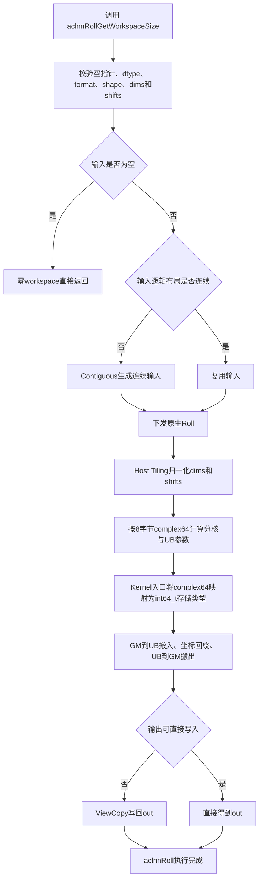
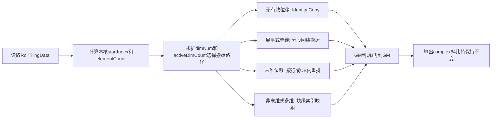

# aclnnRoll算子complex64扩展设计文档

## 一、需求背景（required）

### 1.1 需求来源

本文档对应《[7月社区任务-aclnnRoll算子开发任务书](../../../../docs/202607/aclnnRoll_task_doc.md)》，并按照《[算子设计文档模板](../../../../resources/design_template.md)》编写。

任务要求在 `ops-math/experimental/math/roll` 已有 Ascend C 实现基础上，为 `aclnnRoll` 增加 `COMPLEX64` 输入和输出能力，使框架侧 `torch.fft.fftshift`、`torch.fft.ifftshift` 在输入为 `torch.complex64` 时能够正常执行，同时保证原有数据类型的功能和性能不发生回退。

### 1.2 背景介绍

#### 1.2.1 业务背景

快速傅里叶变换的原始输出按照离散频率索引排列。`torch.fft.fftshift` 用于将零频分量移动到频谱中心，`torch.fft.ifftshift` 用于执行相反的频谱重排。PyTorch 在实现这两个接口时会将它们转换为一个或多个维度上的 `roll` 操作，因此 NPU 后端的 `aclnnRoll` 必须能够接受 FFT 常用的 `complex64` Tensor。

当前 `aclnnRoll` 的 Ascend C 主路径尚未注册 `complex64`。框架将 `torch.complex64` Tensor 下沉到该接口时，会在 API 参数校验或算子匹配阶段因 dtype 不受支持而失败，导致 `fftshift` 和 `ifftshift` 无法覆盖常见复数输入场景。

#### 1.2.2 Roll算子功能

`Roll` 沿指定维度对输入 Tensor 做循环位移，输出 shape 和 dtype 均与输入保持一致。该算子不改变任何元素的数值或比特内容，只改变元素所在的位置。

当 `dims` 非空时，`shifts[i]` 表示沿 `dims[i]` 的循环位移量；当 `dims` 为空时，将输入按逻辑顺序展平后执行一维循环位移，再恢复原 shape。负维度需要归一化到 `[0, rank)`，负位移和超过维长的位移需要按维长取模。同一维度重复出现时，各次位移可合并为该维度上的等价位移。

#### 1.2.3 现有实现路径

本次设计以 `ops-math/experimental/math/roll` 为直接开发对象。现有实现分层如下：

| 层次 | 文件 | 当前职责 |
| --- | --- | --- |
| ACLNN接口层 | `op_api/aclnn_roll.cpp` | 参数校验、非连续输入连续化、输出写回和执行器组装 |
| L0调用层 | `op_api/roll.cpp` | 创建输出 Tensor 并下发原生 `Roll` AICore 任务 |
| 算子定义层 | `op_host/roll_def.cpp` | 注册输入输出 dtype、format、属性和芯片配置 |
| Shape推导层 | `op_host/roll_infershape.cpp` | 将输入 shape 原样传播到输出 |
| Tiling层 | `op_host/roll_tiling.cpp` | 归一化维度及位移，生成分核、UB和索引参数 |
| Kernel入口 | `op_kernel/roll.cpp` | 读取 tiling 数据并实例化 Kernel 模板 |
| Kernel主体 | `op_kernel/roll.h` | 完成坐标回绕和 GM/UB 数据搬运 |
| 测试层 | `tests/ut` | 覆盖 ACLNN、InferShape、Tiling 和 Kernel 单元测试 |

`conversion/roll` 中的实现用于了解现有 Roll 的其他架构路径和位宽处理方式，不作为本任务主开发目录。

#### 1.2.4 现有能力与缺口

当前实验版 Roll 支持 `UINT8`、`INT8`、`BFLOAT16`、`FLOAT16`、`FLOAT32`、`INT32`、`UINT32`，格式为 `ND`，输入 rank 为 0～8。现有 ACLNN 路径支持非连续输入，原生 Kernel 只处理连续的逻辑数据。

complex64 扩展涉及以下缺口：

| 模块 | 当前状态 | 本次需要补齐的能力 |
| --- | --- | --- |
| ACLNN dtype校验 | 支持列表中没有 `DT_COMPLEX64` | 接受 x/out 为 `DT_COMPLEX64`，并保持同 dtype 校验 |
| OpDef注册 | 输入输出 dtype 中没有 `ge::DT_COMPLEX64` | 为输入、输出同步增加 complex64 和对应 ND format |
| Tiling元素字节数 | `GetDataTypeSize` 未识别 complex64，默认返回 1 | 将 complex64 明确定义为 8 字节 |
| Kernel模板实例化 | 直接使用编译器注入的 `DTYPE_X` | 使用同宽整数存储类型承载 complex64 的纯搬运 |
| 产品配置 | 当前实验实现仅注册 `ascend910b` | 按任务范围完成 A2、A3、A5 编译和运行验证 |
| 测试与文档 | 没有 complex64 用例和说明 | 增加功能、边界、泛化、FFT场景及原 dtype 回归测试 |

### 1.3 基线与参考依据

本设计使用以下基线：

1. 功能基线：PyTorch `torch.roll`。
2. 上层场景基线：PyTorch `torch.fft.fftshift`、`torch.fft.ifftshift`。
3. 精度基线：CPU PyTorch 计算结果，使用 AscendOpTest 默认阈值验收。
4. 工程基线：`ops-math/experimental/math/roll` 当前实现。
5. 同仓位宽映射参考：`experimental/conversion/as_strided/op_kernel/as_strided.cpp` 将 `DT_COMPLEX64` 映射为 `int64_t` 存储类型的做法。

## 二、需求分析（required）

### 2.1 需求描述

本任务需要保持 `aclnnRoll` 接口原型不变，在现有支持类型基础上增加 `COMPLEX64`：

| 参数 | 输入/输出 | 数据类型 | 格式 | shape/rank | 非连续Tensor |
| --- | --- | --- | --- | --- | --- |
| `x` | 输入 | BFLOAT16、FLOAT16、FLOAT32、INT8、UINT8、INT32、UINT32、COMPLEX64 | ND | 0～8维 | 支持 |
| `shifts` | 输入 | `aclIntArray*` | - | 与 `dims` 等长；`dims` 为空时长度为1 | - |
| `dims` | 输入 | `aclIntArray*` | - | 元素范围为 `[-rank, rank-1]` | - |
| `out` | 输出 | 与 `x` 相同 | ND | 与 `x` 相同 | 不作为任务要求 |
| `workspaceSize` | 输出 | `uint64_t*` | - | - | - |
| `executor` | 输出 | `aclOpExecutor**` | - | - | - |

输出必须与 PyTorch `torch.roll` 语义一致。新增 complex64 不能改变已有 dtype 的参数校验、Tiling、Kernel 分支、结果或性能表现。

### 2.2 外部组件依赖

本任务不增加第三方运行时依赖，复用以下已有组件：

1. CANN 8.5.0 及以上版本的 ACLNN、GE、Ascend C 编译和运行环境。
2. `ops-math` 中的执行器、`Contiguous`、`ViewCopy`、Tiling 注册及 UT 框架。
3. PyTorch CPU 作为功能 golden 生成工具。
4. AscendOpTest 作为精度及泛化验证工具。

### 2.3 需求拆解

1. ACLNN 接口允许 `x` 和 `out` 使用 `DT_COMPLEX64`。
2. OpDef 对输入输出注册 `ge::DT_COMPLEX64` 和 `FORMAT_ND`。
3. Host Tiling 正确按 8 字节计算 complex64 的分核对齐、GM 搬运粒度及 UB 容量。
4. Kernel 将每个 complex64 元素作为一个不可分割的 8 字节存储单元进行搬运，不对实部和虚部分别计算。
5. 支持 0～8 维、空 Tensor、标量、负维度、正负位移、超大位移、重复维度、多维位移和非连续输入。
6. 覆盖 `fftshift` 和 `ifftshift` 的奇偶长度、指定维度和全维度场景。
7. 对原有 7 种 dtype 执行回归测试，确保行为不变。
8. 在 Atlas A2、A3、A5 训练系列产品上完成编译和自测。
9. 更新 README、ACLNN API 文档、自测脚本和测试报告。

### 2.4 设计原则

1. **不做数值计算**：Roll 是数据重排，complex64 不需要复数加减乘除。
2. **不做 dtype Cast**：禁止将 complex64 转换为 float32、float16 或其他数值类型，避免破坏实虚部配对及特殊浮点比特。
3. **按元素整体搬运**：一个 complex64 元素固定按 8 字节处理，实部和虚部始终一起移动。
4. **复用现有泛化路径**：不为 complex64 新增独立 Roll 算法，仅扩展类型注册、字节数和 Kernel 存储类型。
5. **最小化兼容性影响**：不修改 ACLNN 函数签名、不修改 TilingData 布局、不改变已有 dtype 的模板实例化。

## 三、需求详细设计（required）

### 3.1 算子语义分析

#### 3.1.1 数学公式

设输入 Tensor 的 rank 为 `r`，shape 为：

$$
\mathbf{S}=(S_0,S_1,\ldots,S_{r-1}).
$$

对于第 `j` 组参数 `(shifts[j], dims[j])`，维度归一化为：

$$
a_j=\begin{cases}
d_j+r,&d_j<0,\\
d_j,&d_j\ge 0.
\end{cases}
$$

位移归一化为：

$$
\Delta_j=((s_j\bmod S_{a_j})+S_{a_j})\bmod S_{a_j}.
$$

同一维度重复出现时，等价位移为：

$$
\widehat{\Delta}_a=\left(\sum_{j:a_j=a}\Delta_j\right)\bmod S_a.
$$

对输出坐标 `o=(o0,o1,...,or-1)`，输入坐标为：

$$
i_k=(o_k-\widehat{\Delta}_k+S_k)\bmod S_k,
$$

未指定的维度取 `i_k=o_k`，最终：

$$
y[\mathbf{o}]=x[\mathbf{i}].
$$

当 `dims` 为空时，令总元素数：

$$
N=\prod_{k=0}^{r-1}S_k,
$$

将输入展平后有：

$$
y_{flat}[t]=x_{flat}[(t-\Delta+N)\bmod N].
$$

上述映射只改变元素位置，因此对于 complex64 元素 `x=(real, imag)`，输出位置上的 64 位内容必须与来源位置完全一致。

#### 3.1.2 fftshift与ifftshift映射

对长度为 `n` 的目标维度，PyTorch 的频谱重排可由 Roll 表示为：

$$
fftshift:\quad shift=\left\lfloor\frac{n}{2}\right\rfloor,
$$

$$
ifftshift:\quad shift=\left\lceil\frac{n}{2}\right\rceil=\left\lfloor\frac{n+1}{2}\right\rfloor.
$$

偶数长度时二者位移相同；奇数长度时相差 1。因此测试必须同时覆盖奇数和偶数维长，不能只使用偶数 FFT shape。

#### 3.1.3 complex64存储语义

`COMPLEX64` 由两个相邻的 32 位浮点分量组成，单元素占 8 字节。Roll 不读取或解释两个分量的数值含义，只需要保持这 8 个字节的整体性。

设计中在 Host/API 层仍保留真实 dtype `DT_COMPLEX64`，保证接口契约和框架类型推导正确；仅在 Kernel 模板内部将其映射为同宽的 `int64_t` 存储单元。该映射不会执行数值转换，GM 和 UB 中的原始 64 位数据保持不变。

### 3.2 总体方案



本次不新增 tiling key，不新增 workspace，不改变 `RollTilingData` 字段。complex64 与已有类型共用相同的坐标归一化、分核和 Kernel 执行路径，差异仅是每个逻辑元素的字节数为 8。

### 3.3 ACLNN接口设计

#### 3.3.1 接口原型

接口原型保持不变：

```cpp
aclnnStatus aclnnRollGetWorkspaceSize(
    const aclTensor* x,
    const aclIntArray* shifts,
    const aclIntArray* dims,
    aclTensor* out,
    uint64_t* workspaceSize,
    aclOpExecutor** executor);

aclnnStatus aclnnRoll(
    void* workspace,
    uint64_t workspaceSize,
    aclOpExecutor* executor,
    aclrtStream stream);
```

#### 3.3.2 dtype校验

在 `op_api/aclnn_roll.cpp` 的 `DTYPE_SUPPORT_LIST` 末尾增加：

```cpp
op::DataType::DT_COMPLEX64
```

输入与输出仍必须满足：

1. `x` dtype 位于支持列表。
2. `out` dtype 与 `x` 完全一致。
3. complex64 输入不能搭配 float32、int64 等其他输出 dtype。

该修改只扩展集合，不改变已有类型的判断顺序和返回码。

#### 3.3.3 参数校验

沿用现有校验逻辑：

1. `x`、`shifts`、`out`、`workspaceSize`、`executor` 不能为空。
2. 输入输出只支持 `ND` format。
3. 输入输出 view shape 必须相同。
4. rank 不超过 8。
5. 0 维 Tensor 要求 `shifts` 长度为 1，`dims` 为空。
6. `dims` 为空时 `shifts` 长度必须为 1。
7. `dims` 非空时，`shifts` 与 `dims` 长度必须相同。
8. `dims` 元素必须位于 `[-rank, rank-1]`。

complex64 不引入额外 shape 或数值约束。

#### 3.3.4 非连续Tensor处理

非连续 complex64 输入继续使用已有 `Contiguous` 路径。连续化操作由框架按逻辑元素和 stride 完成，不拆分实部与虚部。若输出不能直接写入，先生成连续 Roll 结果，再通过 `ViewCopy` 写回用户输出。

设计要求为非连续 complex64 增加独立测试，覆盖：

1. `transpose` 形成的非连续视图。
2. 带 storage offset 的切片视图。
3. 多维 stride 不等于默认连续 stride 的输入。

### 3.4 OpDef与产品配置设计

在 `op_host/roll_def.cpp` 中为输入和输出的 `DataType` 同步增加 `ge::DT_COMPLEX64`，并在 `Format`、`UnknownShapeFormat` 中增加对应的 `ge::FORMAT_ND` 项，保证四个列表一一对应。

产品配置按任务书覆盖：

| 产品 | SoC配置 | 设计动作 |
| --- | --- | --- |
| Atlas A2训练系列产品 | `ascend910b` | 保留现有注册并增加 complex64 编译实例 |
| Atlas A3训练系列产品 | `ascend910_93` | 增加 AICore 配置并完成编译、自测 |
| Atlas A5训练系列产品 | `ascend950` | 增加 AICore 配置并完成编译、自测 |

各 SoC 独立编译和打包，避免同一构建产物中存在重复的 `Roll` SoC 注册。若构建系统对 A5 选择了仓内既有架构专用 Roll 模块，则应在最终集成阶段保证 A5 仅保留一个 `Roll` 注册来源，并对该来源应用同样的 complex64 dtype 和 8 字节存储策略。

### 3.5 Host Tiling设计

#### 3.5.1 dtype字节数

在 `GetDataTypeSize` 中新增：

```cpp
case ge::DT_COMPLEX64:
    return 8;
```

禁止让 complex64 落入默认的 1 字节分支，否则会造成以下错误：

1. 单个 32B GM block 被错误计算为 32 个元素，而正确值应为 4 个元素。
2. UB 可容纳元素数被放大 8 倍，可能造成 UB 越界。
3. 分核边界可能落在 complex64 元素内部，破坏实虚部整体性。
4. `DataCopyPad` 的字节长度与真实数据不一致。

#### 3.5.2 维度与位移归一化

Tiling 继续完成以下处理：

1. `dims` 为空时，将逻辑 shape 折叠成 `[totalNum]`。
2. 负维度加 rank 转换为非负维度。
3. 位移使用正模归一化到 `[0, dimSize)`。
4. 重复维度上的位移按维长累加合并。
5. 根据 shape 从后向前计算连续 stride。
6. 记录非零位移维度数量、最后一个 active 维度、`outerSize`、`dimSize`、`innerSize` 和 `activeShift`。

以上逻辑只依赖元素索引，不依赖 dtype，complex64 直接复用。

#### 3.5.3 分核策略

设总元素数为 `N`，可用核数为 `C`，元素字节数为 `b`。complex64 下 `b=8`，每个 32B block 的元素数为：

$$
E_{block}=\max(32/b,1)=4.
$$

每个 512B 带宽对齐块的元素数为：

$$
E_{bandwidth}=\max(512/b,E_{block})=64.
$$

基础单核元素数为：

$$
E_{raw}=\left\lceil\frac{N}{C}\right\rceil.
$$

Host 根据 active 维度和连续块边界修正 `alignElements`，再计算：

$$
E_{core}=\left\lceil\frac{E_{raw}}{E_{align}}\right\rceil E_{align},
$$

$$
C_{used}=\left\lceil\frac{N}{E_{core}}\right\rceil.
$$

最后一核元素数为：

$$
E_{last}=N-(C_{used}-1)E_{core}.
$$

complex64 不增加 dtype 专属切核分支，使用现有通用策略即可。由于所有粒度均以逻辑元素为单位，且 `b=8`，切核边界天然保持 8 字节元素完整性。

#### 3.5.4 UB切分与内存策略

现有实现按 64KB UB 容量计算单队列最大元素数：

$$
E_{UB}=\max\left(1,\frac{64\times1024}{b}\right).
$$

complex64 下：

$$
E_{UB}=8192.
$$

Kernel 为输入和输出队列分别申请 `E_UB * sizeof(T)` 字节。complex64 映射后的 `T=int64_t`，因此 `sizeof(T)=8`，Host 和 Kernel 对 UB 大小的理解一致。

#### 3.5.5 Tiling key规划

本次不新增 tiling key。Host 继续设置 `ROLL_TPL_SCH_MODE_0`，Kernel 通过 `RollTilingData` 中的 shape、stride、shift、分核和 UB 字段选择执行分支。

不新增 tiling key 的原因：complex64 与已有类型的差异只有存储宽度，不存在新的坐标映射或数值计算分支。

#### 3.5.6 Workspace

原生 Roll Kernel 不需要额外 workspace，`workspace[0]` 保持为 0。非连续输入的连续化或输出写回所需空间由 ACLNN 执行器统一统计并通过 `GetWorkspaceSize()` 返回，不改变接口行为。

### 3.6 Kernel侧设计

#### 3.6.1 存储类型映射

在 `op_kernel/roll.cpp` 中增加编译期存储类型选择：

```cpp
namespace {
#if defined(ORIG_DTYPE_X) && ORIG_DTYPE_X == DT_COMPLEX64
using RollStorageType = int64_t;
#else
using RollStorageType = DTYPE_X;
#endif
} // namespace
```

Kernel 入口改为实例化：

```cpp
RunRollKernel<RollStorageType>(x, y, tiling);
```

该方案与直接把 complex64 转成 int64 不同：这里只改变 C++ 模板访问类型，不生成任何 Cast 指令。输入 GM 地址和输出 GM 地址不变，每次读写均复制原始 8 字节。

#### 3.6.2 Kernel执行流程



现有 Kernel 的主要路径均可复用：

1. `CopyIdentity`：位移归一化为 0 时执行连续复制。
2. `CopyFlattenRoll`：`dims` 为空时按一维回绕点拆成两段复制。
3. `CopySingleDimRoll`：单 active 维度按连续块复制。
4. `CopyLastDimRoll`：末维位移按行处理，必要时在 UB 内完成两段重排。
5. `CopyMultiDimLastDimRollByRows`：多维且末维 active 时，先映射来源行，再处理行内回绕。
6. `CopyMultiDimNonLastRollByBlocks`：最后一个 active 维度不是末维时，按连续 block 映射来源位置。
7. `ProcessScalar`：无法形成批量连续段时使用通用索引映射路径。

这些路径只进行 `DataCopyPad` 或同类型 UB 赋值，不进行数值算术。将模板类型映射为 `int64_t` 后，一个模板元素恰好对应一个 complex64 元素。

#### 3.6.3 对齐与尾块处理

complex64 每个 32B block 包含 4 个元素。对于元素数不是 4 的整数倍、行宽不是 32B 对齐或回绕点不对齐的场景，沿用 `DataCopyPad` 和现有尾段路径，`blockLen` 始终按：

$$
blockLen=elementCount\times8\ \text{bytes}
$$

计算。重点验证维长 `1、2、3、4、5、7、31、32、33`，覆盖小于一个 block、恰好对齐和跨 block 的边界。

#### 3.6.4 精度保证

Roll 不产生舍入误差。设计目标不仅是满足 AscendOpTest 默认阈值，还应在可直接比特比较的场景达到逐元素 64 位完全一致，包括：

1. 普通有限复数。
2. 实部或虚部为 `+0.0`、`-0.0`。
3. 实部或虚部为 `+Inf`、`-Inf`。
4. 包含 NaN 的复数比特模式。

### 3.7 数据检测设计

| 检测项 | 合法条件 | 非法处理 |
| --- | --- | --- |
| 空指针 | 必填参数非空 | 返回 `ACLNN_ERR_PARAM_NULLPTR` |
| dtype | x/out 属于支持列表且相同 | 返回 `ACLNN_ERR_PARAM_INVALID` |
| format | x/out 均为 ND | 返回 `ACLNN_ERR_PARAM_INVALID` |
| shape | x/out shape完全相同 | 返回 `ACLNN_ERR_PARAM_INVALID` |
| rank | 0～8 | 超过8维返回参数错误 |
| shifts/dims长度 | dims空时shifts长度为1；否则两者等长 | 返回参数错误 |
| dims范围 | `[-rank, rank-1]` | 返回参数错误 |
| 空Tensor | 合法shape下直接返回 | 不Launch Kernel |
| 位移范围 | 任意int64位移 | Host按维长正模归一化 |

Roll 不检查 complex64 元素的数值范围，因为 NaN、Inf、负零均是合法输入且只参与搬运。

### 3.8 支持硬件

| 支持的芯片版本 | 涉及勾选 |
| --- | --- |
| Atlas A2训练系列产品 | √ |
| Atlas A3训练系列产品 | √ |
| Atlas A5训练系列产品 | √ |

各硬件均需执行独立编译。至少在可获得的每类设备上完成 ACLNN 端到端用例；无法获得的设备必须通过对应 SoC 交叉编译，并在测试报告中明确标记待补充的实机验证，不得将仅编译通过描述为运行通过。

### 3.9 算子约束限制

1. 输入输出只支持 `ND` 格式。
2. 输入 rank 范围为 0～8。
3. 输出 shape 和 dtype 必须与输入一致。
4. `dims` 为空时按展平语义处理，`shifts` 长度必须为 1。
5. `dims` 非空时必须与 `shifts` 等长。
6. `dims` 范围为 `[-rank, rank-1]`。
7. 不涉及广播。
8. complex64 仅进行位级数据重排，不支持在 Kernel 内改变实部或虚部。
9. 输入支持非连续 Tensor；输出非连续能力不作为任务书承诺范围。

### 3.10 文件修改范围

| 文件 | 计划修改 |
| --- | --- |
| `experimental/math/roll/op_api/aclnn_roll.cpp` | ACLNN支持列表增加 `DT_COMPLEX64` |
| `experimental/math/roll/op_host/roll_def.cpp` | 输入输出增加 complex64、ND format及目标SoC配置 |
| `experimental/math/roll/op_host/roll_tiling.cpp` | complex64字节数返回8 |
| `experimental/math/roll/op_kernel/roll.cpp` | complex64映射为8字节存储类型 |
| `experimental/math/roll/tests/ut/op_api/test_aclnn_roll.cpp` | 增加complex64成功、类型不匹配、非连续等接口用例 |
| `experimental/math/roll/tests/ut/op_host/test_roll_tiling.cpp` | 增加8字节Tiling和边界用例 |
| `experimental/math/roll/tests/ut/op_kernel/test_roll.cpp` | 增加64位比特搬运和多分支Kernel用例 |
| `experimental/math/roll/docs/aclnnRoll.md` | 更新数据类型、硬件和约束说明 |
| `experimental/math/roll/README.md` | 更新产品及complex64能力说明 |
| 自测脚本及报告目录 | 增加PyTorch golden、NPU调用、结果比对和日志 |

`RollTilingData`、ACLNN 头文件和接口函数签名不需要修改。

## 四、可维可测分析（required）

### 4.1 可维护性分析

1. complex64 只在 Kernel 入口进行一次存储类型选择，避免在较长的 Kernel 主体中增加重复 dtype 判断。
2. Tiling 仍以逻辑元素为单位，通过统一的 `GetDataTypeSize` 感知位宽。
3. 不增加新 TilingData 字段，Host 与 Kernel 的二进制数据结构保持稳定。
4. 不增加新 tiling key，避免增加编译实例数量和分支维护成本。
5. 复用仓内已有 complex64 同宽映射模式，降低工具链兼容风险。
6. 测试同时检查 API 注册、Tiling 数值和 Kernel 比特搬运，问题可快速定位到具体层次。

### 4.2 精度标准与性能标准

| 验收标准 | 描述 | 标准来源 |
| --- | --- | --- |
| 功能标准 | complex64结果与CPU PyTorch `torch.roll`、`fftshift`、`ifftshift`语义一致 | 任务书 |
| 精度标准 | 满足AscendOpTest默认阈值；纯搬运路径应达到逐元素比特一致 | 任务书及算子语义 |
| 原类型回归 | BF16、FP16、FP32、INT8、UINT8、INT32、UINT32功能保持不变 | 任务书 |
| 性能标准 | 本任务无新增性能指标；不得引入原dtype性能回退 | 任务书 |
| 硬件标准 | A2、A3、A5分别完成编译及可用设备上的运行验证 | 任务书 |

### 4.3 测试分层

#### 4.3.1 ACLNN接口UT

1. complex64 输入输出相同 dtype，第一段接口返回成功。
2. complex64 输入搭配 float32 输出，返回参数错误。
3. 不支持的 complex128 仍返回参数错误。
4. 0维 complex64、空 complex64 Tensor 正常处理。
5. 非连续 complex64 输入能够构造执行器。
6. rank大于8、dims越界、shifts/dims不等长等原有异常行为不变。

#### 4.3.2 Host Tiling UT

1. complex64 的 `ubElements` 等于 `64KB/8=8192`。
2. 32B 对齐粒度为4个 complex64 元素。
3. `dims` 为空时正确折叠为一维。
4. 负维度、负位移和大位移正确归一化。
5. 重复维度的位移正确累加。
6. 单维、多维、末维和非末维 active 场景生成有效分核参数。
7. 零元素、单元素和多核尾块场景不产生负长度或越界。

#### 4.3.3 Kernel UT

Kernel UT 使用 `uint64_t` 或 `int64_t` 保存预构造的 complex64 原始比特，直接验证输出顺序和每个 64 位元素内容：

1. 一维正位移和负位移。
2. 展平 Roll。
3. 末维行内回绕。
4. 非末维块回绕。
5. 多 active 维度。
6. 位移为0的 Identity Copy。
7. 元素数非4倍数的非对齐尾块。
8. 多核切分和最后一核尾块。

#### 4.3.4 ACLNN端到端与AscendOpTest

| 编号 | 场景 | shape | shifts | dims | dtype | 预期 |
| --- | --- | --- | --- | --- | --- | --- |
| C01 | 一维基础正移 | `[8]` | `[3]` | `[0]` | complex64 | 与torch.roll一致 |
| C02 | 一维奇数长度负移 | `[7]` | `[-2]` | `[0]` | complex64 | 与torch.roll一致 |
| C03 | 位移为0 | `[17]` | `[0]` | `[0]` | complex64 | 与输入比特一致 |
| C04 | 大正位移 | `[9]` | `[1000003]` | `[0]` | complex64 | 正模后结果正确 |
| C05 | 大负位移 | `[9]` | `[-1000003]` | `[0]` | complex64 | 正模后结果正确 |
| C06 | dims为空展平 | `[2,3,5]` | `[7]` | `[]` | complex64 | 展平Roll后恢复shape |
| C07 | 二维末维 | `[4,7]` | `[3]` | `[1]` | complex64 | 行内回绕正确 |
| C08 | 二维非末维 | `[5,8]` | `[2]` | `[0]` | complex64 | 块回绕正确 |
| C09 | 多维多轴 | `[2,3,5,7]` | `[1,-2,9]` | `[0,2,3]` | complex64 | 多轴结果正确 |
| C10 | 负维度 | `[2,3,5]` | `[2]` | `[-1]` | complex64 | 等价于dim=2 |
| C11 | 重复维度 | `[3,7]` | `[2,-5,9]` | `[1,1,1]` | complex64 | 合并位移正确 |
| C12 | 8维输入 | `[2,1,2,1,2,1,2,3]` | `[1,-1]` | `[0,7]` | complex64 | rank上界正确 |
| C13 | 标量 | `[]` | `[17]` | `[]` | complex64 | 输出等于输入 |
| C14 | 空Tensor | `[2,0,3]` | `[1]` | `[1]` | complex64 | 成功且不Launch Kernel |
| C15 | 非连续transpose | 原始`[3,5]`转置 | `[2]` | `[1]` | complex64 | 按逻辑视图正确 |
| C16 | 带offset切片 | 从更大Tensor切出`[4,7]` | `[-3]` | `[0]` | complex64 | 按view数据正确 |
| C17 | 特殊浮点比特 | `[11]` | `[4]` | `[0]` | complex64 | NaN/Inf/正负零比特保持 |
| C18 | fftshift偶数 | `[4,8]` | 框架生成 | `[0,1]` | complex64 | 与torch.fft.fftshift一致 |
| C19 | fftshift奇数 | `[5,7]` | 框架生成 | `[0,1]` | complex64 | 与torch.fft.fftshift一致 |
| C20 | ifftshift奇偶混合 | `[4,7]` | 框架生成 | `[0,1]` | complex64 | 与torch.fft.ifftshift一致 |
| C21 | 仅指定FFT维度 | `[2,5,8]` | 框架生成 | `[1]` | complex64 | 未指定维度顺序不变 |
| C22 | 大Tensor多核 | `[32,64,129]` | `[17,-33]` | `[1,2]` | complex64 | 多核结果正确 |

#### 4.3.5 原dtype回归

对 BFLOAT16、FLOAT16、FLOAT32、INT8、UINT8、INT32、UINT32 分别至少覆盖：

1. 一维末维 Roll。
2. 多维多轴 Roll。
3. `dims` 为空的展平 Roll。
4. 负维度和负位移。
5. 非连续输入。
6. 空 Tensor 和标量。

整数类型执行逐元素精确比较；浮点类型按原测试阈值执行，同时确认修改前后的 Tiling 参数和 Kernel 路径没有非预期变化。

### 4.4 测试数据生成与比对

complex64 输入使用两个独立的 float32 随机数组生成实部和虚部，并补充手工边界数据。CPU golden 示例：

```python
x = torch.complex(real, imag).to(torch.complex64)
golden_roll = torch.roll(x, shifts=shifts, dims=dims)
golden_fftshift = torch.fft.fftshift(x, dim=dims)
golden_ifftshift = torch.fft.ifftshift(x, dim=dims)
```

比对分为两层：

1. AscendOpTest 默认精度阈值，用于满足正式验收口径。
2. 将 NPU 和 CPU 输出视为 `uint64` 后逐元素比较，用于验证纯搬运位级一致性。对 NaN 用例优先比较来源元素的原始比特，不通过浮点相等判断。

### 4.5 性能与回归验证

任务书没有 complex64 性能指标，但实现不得影响原 dtype。验证策略如下：

1. 修改前后使用相同设备、相同输入、相同预热次数和统计次数。
2. 对原有 dtype 选择小、中、大三档 shape，比较 Kernel 执行时间。
3. complex64 路径确认没有 `Cast`、实虚部分拆或额外 Kernel launch。
4. 使用 profiler 截图记录 complex64 仅执行预期的 Roll 主路径；非连续输入允许出现任务要求内的 Contiguous 路径。
5. 原 dtype 代码路径未发生逻辑修改时，性能应处于测试抖动范围内；若出现明显回退，必须定位后修复。

### 4.6 兼容性分析

1. ACLNN 函数名、参数顺序、参数类型和两段式调用方式不变，ABI 兼容。
2. 原有 dtype 支持列表只增加成员，不删除或改变已有成员。
3. 输出 shape 推导不变。
4. `RollTilingData` 内存布局不变，Host/Kernel 协议兼容。
5. 原有 dtype 仍使用原 `DTYPE_X`，只有 `ORIG_DTYPE_X == DT_COMPLEX64` 时选择 `int64_t`。
6. 不新增 workspace，不改变连续输入的执行器结构。
7. complex64 为新增能力，不影响已有调用方。

### 4.7 风险分析与规避措施

| 风险 | 影响 | 规避措施 |
| --- | --- | --- |
| Tiling遗漏8字节定义 | UB越界、切核错位、结果损坏 | 增加 `ubElements=8192` 和非对齐Tiling UT |
| 直接实例化复数模板不被DataCopy支持 | 编译失败或API约束不匹配 | 使用仓内已验证的同宽 `int64_t` 存储映射 |
| 误用数值Cast | NaN、负零或实虚部数据改变 | Kernel只做别名化存储访问，不调用Cast算子 |
| 实虚部分离搬运 | 元素错配 | 所有索引以8字节逻辑元素为单位 |
| 非连续输入按storage顺序处理 | 与PyTorch逻辑视图不一致 | ACLNN入口先执行Contiguous并增加transpose/slice用例 |
| 奇数长度FFT位移公式遗漏 | ifftshift结果偏一位 | fftshift/ifftshift分别覆盖奇数和偶数长度 |
| 多SoC重复注册或编译差异 | 打包失败 | 各SoC独立构建，确保每个SoC只有一个Roll注册来源 |
| 原dtype回归 | 破坏既有能力 | 保持原模板路径不变并执行7种dtype回归矩阵 |

### 4.8 验收交付件

1. 本设计文档及评审修改记录。
2. `ops-math` 个人仓链接、分支、提交记录和算子目录说明。
3. complex64 扩展代码及原 dtype 回归代码。
4. ACLNN 调用示例、测试代码、数据生成脚本、运行脚本和 README。
5. 自测报告，包含所有用例结果、执行日志、整体通过截图和必要的 profiler 截图。
6. A2、A3、A5 的编译记录及可用设备上的运行结果；未实测项必须如实说明。
7. 更新后的 Roll README 和 `aclnnRoll` API 文档。

## 五、结论

本设计通过“接口保留 complex64 逻辑类型、Kernel 使用同宽 8 字节存储类型”的方式扩展 `aclnnRoll`。方案不引入复数运算、不拆分实虚部、不执行 dtype Cast，能够复用现有 Roll 的维度归一化、分核、UB 切分和数据搬运路径，并保证 complex64 元素位级无损重排。

修改范围集中在 dtype 注册、元素字节数和 Kernel 模板入口，ACLNN ABI、TilingData 和原 dtype Kernel 路径均保持不变，兼容性风险较低。通过分层 UT、AscendOpTest、PyTorch FFT 场景验证和原类型回归，可满足任务书对功能、精度、泛化及兼容性的要求。

## 六、修订记录

| 日期 | 版本 | 修改说明 | 作者 |
| --- | --- | --- | --- |
| 2026-07-25 | V1.0 | 初稿：完成aclnnRoll complex64扩展方案、泛化测试及兼容性设计 | 欲买桂花同载酒 |
