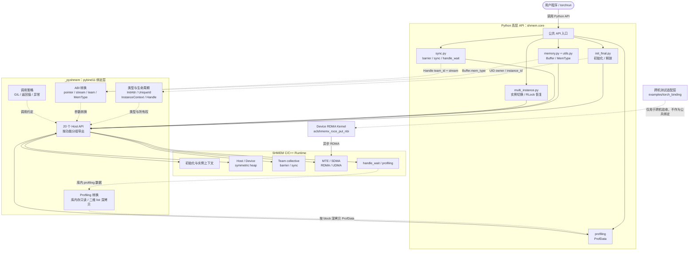

# 【社区任务】SHMEM Python 接口设计文档

# 一、需求背景（required）

## 1.1 需求来源

本设计来源于 2026 年 7 月 CANN 社区任务“SHMEM Python 接口开发”，任务基础信息如下：

| 项目 | 内容 |
| --- | --- |
| 技术标签 | Python 接口开发 / pybind11 封装 |
| 适配硬件 | Atlas A2/A3 训练系列产品或推理系列产品 |
| 开源仓地址 | [cann/shmem](https://gitcode.com/cann/shmem) |
| CANN 版本 | CANN 9.0.0 或社区版较新版本（推荐 ≥ 9.0.0） |
| 开发语言 | C++（pybind11）+ Python |

SHMEM（ACLSHMEM）是面向昇腾集群的对称共享内存与单边 RMA 通信库。当前主线仓已提供部分 Host C++ 接口的 Python 绑定（`src/host/python_wrapper/pyshmem.cpp`、`src/python/shmem/`），但仍有一批 Host API 与 `shmem.core` 高层封装尚未对齐。

本任务要求基于主线已有 Python 工程，使用 pybind11 将任务书所列 20 个尚未实现的 C++ Host 接口封装到 `shmem._pyshmem`，并补齐 `shmem.core` 高层封装、Python API 文档、QuickStart、`examples/python_extension` 测试以及功能、精度、多实例隔离、跨机 RDMA 完成性和 Python/C++ 性能差异测试，保证 Python 接口与 C++ 功能、语义一致。Device 侧 Kernel API（`aclshmemx_roce_*` 等）不在本任务范围；验收通过后，相关实现将通过 PR 合入 [cann/shmem](https://gitcode.com/cann/shmem) 主线。

现有实现与文档参考如下：

- 绑定实现：[pyshmem.cpp](https://gitcode.com/cann/shmem/blob/master/src/host/python_wrapper/pyshmem.cpp)
- Python 包：[src/python/shmem](https://gitcode.com/cann/shmem/tree/master/src/python/shmem)
- API 文档：[docs/api/pythonAPI.md](https://gitcode.com/cann/shmem/blob/master/docs/api/pythonAPI.md)
- 测试样例：[examples/python_extension](https://gitcode.com/cann/shmem/tree/master/examples/python_extension)

## 1.2 背景介绍

SHMEM 当前 Python 接口由两层组成：

- `_pyshmem`：位于 `src/host/python_wrapper/pyshmem.cpp`，通过 pybind11 暴露底层 C/C++ 能力；
- `shmem.core`：位于 `src/python/shmem/core`，负责参数检查、异常转换、Buffer 管理以及面向用户的 Pythonic API。

现有代码已经提供 `MemType`、`InitAttr`、`UniqueId`、`Buffer`、基础初始化/释放、内存分配和 RMA 等能力，也已有 Python `int` 与 `aclrtStream`/地址之间的转换及部分释放 GIL 的实现模式。但任务书列出的同步、多实例、扩展内存分配、通信引擎配置、异步句柄等待和 profiling 能力尚未完整导出。

本任务的核心不是简单增加 20 个 pybind11 函数，而是同时保证：

- Python 对象生命周期不会造成 C++ 悬空指针；
- 多实例上下文切换不破坏进程内状态；
- Host/Device 内存类型能够正确贯穿分配、Buffer 和释放；
- Stream、指针、返回值和异常语义在底层与高层之间一致；
- 跨机 RDMA 的完成性语义不被普通 stream 同步错误替代；
- profiling 数据返回后不依赖库内部临时内存；
- 现有 Python 用户代码保持兼容。

# 二、需求分析（required）

## 2.1 需求描述

### 2.1.1 底层接口范围

在 `_pyshmem` 中新增或补齐以下 20 个接口：

1. `aclshmemx_set_attr_uniqueid_args`
2. `aclshmemx_instance_ctx_get`
3. `aclshmemx_instance_ctx_set`
4. `aclshmemx_malloc`
5. `aclshmemx_calloc`
6. `aclshmemx_align`
7. `aclshmemx_free`
8. `aclshmemx_set_mte_config`
9. `aclshmemx_set_sdma_config`
10. `aclshmemx_set_rdma_config`
11. `aclshmemx_set_udma_config`
12. `aclshmem_barrier`
13. `aclshmem_barrier_all`
14. `aclshmem_sync`
15. `aclshmem_sync_all`
16. `aclshmemx_barrier_on_stream`
17. `aclshmemx_barrier_all_on_stream`
18. `aclshmemx_handle_wait`
19. `aclshmemx_get_prof`
20. `aclshmemx_show_prof`

### 2.1.2 高层接口范围

在 `shmem.core` 中提供以下能力：

- `barrier`、`barrier_all`、`sync`、`sync_all`；
- `barrier_on_stream`、`barrier_all_on_stream`；
- 当前实例查询、实例切换以及可自动恢复的上下文管理器；
- `HOST_SIDE`/`DEVICE_SIDE` 内存分配、清零分配、对齐分配与正确释放；
- `handle_wait`，显式完成跨机 RDMA 句柄；
- 初始化/释放接口的 `instance_id` 扩展；
- 必要的类型、异常和 profiling 数据对象。

## 2.2 设计范围

- C++ 到 pybind11 的类型映射；
- Python 高层 API 及模块组织；
- UID、实例上下文、异步句柄和 profiling 数据的所有权；
- GIL、Stream、指针、错误码与异常约定；
- 单实例、多实例、单机多卡和跨机多卡测试方案；
- Python/C++ 性能对比方法；
- 文档、示例和兼容性设计。

## 2.3 需求拆解

| 子任务 | 主要内容 | 验收关注点 |
| --- | --- | --- |
| 类型层 | 扩展 `InitAttr`，新增 `InstanceContext`、`Handle`、`ProfData` | 类型稳定、无悬空引用 |
| 底层绑定 | 20 个 C/C++ API 的 pybind11 导出 | 参数、返回值、GIL、异常一致 |
| 内存层 | xmalloc/calloc/align/free 与 `MemType` | Host/Device 类型成对使用 |
| 同步层 | barrier/sync 及 on-stream 版本 | 阻塞与入流语义清晰 |
| 多实例层 | 上下文查询、切换、初始化、释放 | 隔离、恢复、并发约束 |
| 跨机完成性 | `Handle` 与 `handle_wait` | RDMA 数据可见性 |
| Profiling | get/show 与 Python 数据对象 | 深拷贝、形状、空结果 |
| 文档示例 | API、QuickStart、torchrun 示例 | 可运行、与实现一致 |
| 测试性能 | 功能、精度、回归、性能对比 | 日志和原始数据可追溯 |

# 三、需求详细设计（required）

## 3.1 总体架构



分层原则如下：

1. `_pyshmem` 尽量保留 C/C++ 名称、参数和返回语义，便于调试及与原生 API 对照；
2. `shmem.core` 提供面向用户的参数校验、异常、资源配对和上下文恢复；
3. 不把 C++ 库内部所有权不明确的指针直接交给 Python 长期持有；
4. 高层新增参数均提供默认值，优先保持已有调用兼容。

## 3.2 通用约定

### 3.2.1 指针约定

- Python 侧设备地址、Host 地址和 stream 句柄统一使用非负 `int`；
- pybind11 侧使用 `intptr_t`/`uintptr_t` 转换，再转换为目标指针；
- 高层对负数地址、非法对齐值、负尺寸和溢出进行检查；
- 分配函数返回空指针时，高层抛出 `AclshmemError`；
- `free` 只接受分配时记录的 `MemType`，防止以错误内存类型释放。

### 3.2.2 Stream 约定

- 底层接口参数类型为 Python `int`，`0` 映射为 `nullptr`，与现有 wrapper 模式一致；
- 高层 on-stream 接口要求显式传入有效 stream，不以 `None` 隐式切换到阻塞版本；
- `barrier`/`barrier_all` 是阻塞 API；on-stream 版本只负责入流，是否完成由 stream 执行进度决定；
- Stream 生命周期由调用方管理，Python wrapper 不拥有也不销毁 stream。

### 3.2.3 GIL 约定

- 可能阻塞或进入运行时的纯 C/C++ 调用释放 GIL；
- 释放 GIL 期间不访问 Python 对象；
- 参数转换和 Python 返回对象构造必须在持有 GIL 时完成；
- `aclshmemx_get_prof` 在不持有 GIL 时获取 profiling 专用互斥锁；从运行时调用开始到库内全局 profiling 缓冲区完整深拷贝到本地 C++ 值对象为止均持有该锁，随后释放锁并重新获取 GIL 构造 Python 返回值；
- `aclshmemx_instance_ctx_get` 不释放 GIL：绑定在同一临界窗口内取得 runtime 指针并立即复制 `id`，避免其他 Python 线程并发切换 context 或 finalize 时扩大悬空指针竞争窗口。

### 3.2.4 返回值与异常约定

底层 `_pyshmem` 采用以下规则：

- C/C++ 返回错误码的 API，Python 底层接口原样返回 `int`；
- C/C++ 返回 `void` 的 API，Python 返回 `None`；
- 分配 API 返回地址 `int`；
- 可能无 profiling 数据的 API 返回 `None`；
- 参数无法完成类型转换时，由 pybind11 抛出 `TypeError`/`ValueError`。

高层 `shmem.core` 采用以下规则：

- 参数前置条件不满足：抛出 `AclshmemInvalid`；
- 对具备错误码返回通道的接口，底层返回非零错误码、分配失败或运行时失败时抛出 `AclshmemError`；
- 高层不吞掉错误码，也不把能力缺失标记为测试通过。

`aclshmem_barrier`、`aclshmem_barrier_all`、`aclshmem_sync`、`aclshmem_sync_all` 及两个 on-stream barrier 的 C/C++ 返回类型均为 `void`，因此 Python 只能返回 `None`，没有可转换为 `AclshmemError` 的错误码通道。集合参与不一致或底层执行异常可能表现为超时、阻塞、运行时日志或进程终止；功能测试必须使用进程级 watchdog、超时退出和分 rank 日志作为主要故障检测手段。

### 3.2.5 对象生命周期约定

- `UniqueId`：`aclshmemx_set_attr_uniqueid_args` 会把 `InitAttr.comm_args` 指向 UID 数据。`InitAttr` 使用专用 C++ wrapper，并在不可从 Python 访问的私有 `py::object` 成员中保存 UID owner；接口成功后由 wrapper 持有传入的 `UniqueId`，直到 attr 销毁或成功重新绑定 UID；
- `InstanceContext`：不直接暴露库拥有的原始上下文指针，返回只读值快照，避免 finalize 后 Python 对象悬空；
- `Handle`：按 C 结构体封装 `team_id` 并允许 Python 主动构造；它表示 team 作用域的异步 RMA 等待条件，不是某次操作返回的 future；
- `Buffer`：分配接口返回 owner；peer 地址和内部子视图持有源 Buffer 强引用但不拥有释放权，源 owner 调用 free 后所有视图同步失效；
- `ProfData`：C++ 返回指针由 SHMEM 库内部拥有，Python 不释放；绑定层立即按 block 深拷贝到 pybind11 值对象中的二维整数容器，之后不依赖库内部缓冲区。

## 3.3 Python 数据类型设计

### 3.3.1 `InitAttr`

在现有字段基础上新增：

```python
InitAttr.instance_id: int
```

默认值为 `0`，保持单实例调用行为不变。现有 `my_rank`、`n_ranks`、`ip_port`、`local_mem_size` 和 `option_attr` 字段保持兼容。

为落实 UID 生命周期，`InitAttr` 不启用 `py::dynamic_attr()`，而是绑定专用 C++ wrapper。wrapper 内含原生 `aclshmemx_init_attr_t` 和私有 `py::object uid_owner_`，只暴露原有配置字段及 `instance_id`，不向 Python 暴露 owner 成员或实例字典。

`aclshmemx_set_attr_uniqueid_args` 在持有 GIL 时先取得新的 UID owner，并保存 attr 原生字段快照；运行时调用成功且重新获得 GIL 后才以新 owner 替换旧 owner。若运行时返回失败，则恢复原生字段快照并保留旧 owner，避免 `comm_args` 与 owner 不一致。测试覆盖重新设置 UID、删除原 UID 变量并触发 GC、尝试赋值或删除 `_uid_owner` 均被拒绝，以及之后使用该 attr 初始化成功。

### 3.3.2 `UniqueId`

保留现有序列化 UID 使用方式，并补充：

```python
UniqueId.from_bytes(data: bytes) -> UniqueId
UniqueId.to_bytes() -> bytes
```

上述辅助方法用于独立构造 `InitAttr` 时安全传入 UID，不改变已有 `get_unique_id()`/初始化路径的行为。

`from_bytes()` 必须要求 `len(data) == sizeof(aclshmemx_uniqueid_t)`，短于或长于该长度均抛出 `ValueError`。当前 master 中结构由三个 4 字节整数和 `internal[124]` 组成，对应 136 字节；实现以编译时 `sizeof` 为唯一判定来源，避免 ABI 变化后继续使用硬编码长度。`to_bytes()` 始终返回相同长度。

### 3.3.3 `InstanceContext`

```python
class InstanceContext:
    @property
    def id(self) -> int: ...
```

`aclshmemx_instance_ctx_get()` 返回 `InstanceContext | None`。对象是当前上下文的值快照，不拥有运行时上下文，不能用于绕过 `aclshmemx_instance_ctx_set()` 修改内部状态。该绑定全程持有 GIL：取得 runtime 指针后立即把 `id` 复制到快照，再返回 Python 对象，不在指针仍待解引用时给其他 Python 线程留下 context 切换或 finalize 的窗口。

### 3.3.4 `Handle`

```python
class Handle:
    def __init__(self, team_id: int = ACLSHMEM_TEAM_WORLD) -> None: ...

    team_id: int
```

该对象映射 `aclshmem_handle_t { aclshmem_team_t team_id; }`。当前 Host API 没有返回或输出该结构体，官方 `rdma_handlewait_test` 也是由调用方设置 `team_id` 后传给 `aclshmemx_handle_wait`，因此 `Handle` 是 Python 可主动构造的参数对象。它按 team 等待此前发起的异步 RMA，不设计为每次异步操作各自返回的句柄。

绑定层同时导出并由 `shmem` 重导出整数常量 `ACLSHMEM_TEAM_WORLD = 0` 和 `ACLSHMEM_TEAM_INVALID = -1`。默认构造函数在 C++ 绑定中直接使用 `ACLSHMEM_TEAM_WORLD`，不依赖 Python 调用方预先传值。

### 3.3.5 `ProfData`

```python
class ProfData:
    @property
    def pe_id(self) -> int: ...

    @property
    def ccount(self) -> list[list[int]]: ...  # 64 x 1024

    @property
    def cycles(self) -> list[list[int]]: ...  # 64 x 1024
```

`ProfData` 是 pybind11 值对象，内部用两个 `std::vector<std::vector<int64_t>>` 保存深拷贝，读取属性时由 pybind11 转换为 Python 二维 `list`，元素为 Python `int`。原始 `aclshmem_prof_pe_t` 为 AoS 布局，每个 block 内依次存放 `ccount[1024]` 和 `cycles[1024]`，绑定层必须逐 block 复制，不能把全部 `ccount` 或 `cycles` 当作单一连续区域复制。

profiling 是诊断接口，不引入 NumPy 运行时依赖；wheel 的直接依赖保持不变，未安装 NumPy 时 `_pyshmem` 和 `shmem.core` 仍可正常导入及调用该接口。若当前 PE 未被 `SHMEM_CYCLE_PROF_PE` 选中，`aclshmemx_get_prof()` 返回 `None`。

## 3.4 底层接口映射

| 序号 | Python 底层接口 | 建议签名/返回 | GIL | 关键设计 |
| --- | --- | --- | --- | --- |
| 1 | `aclshmemx_set_attr_uniqueid_args` | `(my_pe, n_pes, local_mem_size, uid, attr) -> int` | 分段释放 | 专用 wrapper 私有持有 UID owner；native 成功后事务式替换，失败保留旧 owner 并恢复 attr |
| 2 | `aclshmemx_instance_ctx_get` | `() -> InstanceContext \| None` | 不释放 | 持有 GIL 调用并立即复制 ID，返回值快照，不暴露库指针 |
| 3 | `aclshmemx_instance_ctx_set` | `(instance_id) -> int` | 调用时释放 | 高层负责切换互斥和恢复 |
| 4 | `aclshmemx_malloc` | `(size, mem_type=DEVICE_SIDE) -> int` | 调用时释放 | 空指针由高层转异常 |
| 5 | `aclshmemx_calloc` | `(count, size, mem_type=DEVICE_SIDE) -> int` | 调用时释放 | 检查乘法溢出，验证清零 |
| 6 | `aclshmemx_align` | `(alignment, size, mem_type=DEVICE_SIDE) -> int` | 调用时释放 | 对齐值须合法 |
| 7 | `aclshmemx_free` | `(ptr, mem_type=DEVICE_SIDE) -> None` | 调用时释放 | mem_type 与分配类型配对 |
| 8 | `aclshmemx_set_mte_config` | `(offset, ub_size, sync_id) -> int` | 调用时释放 | `uint64/uint32/uint32` 范围检查 |
| 9 | `aclshmemx_set_sdma_config` | `(offset, ub_size, sync_id) -> int` | 调用时释放 | `uint64/uint32/uint32` 范围检查 |
| 10 | `aclshmemx_set_rdma_config` | `(offset, ub_size, sync_id) -> int` | 调用时释放 | 整数范围及 UB staging 最小值 |
| 11 | `aclshmemx_set_udma_config` | `(offset, ub_size, sync_id) -> int` | 调用时释放 | 整数范围及 UB staging 最小值 |
| 12 | `aclshmem_barrier` | `(team: int) -> None` | 调用时释放 | 阻塞，team 映射 `aclshmem_team_t` |
| 13 | `aclshmem_barrier_all` | `() -> None` | 调用时释放 | 阻塞，作用于 world team |
| 14 | `aclshmem_sync` | `(team: int) -> None` | 调用时释放 | 按公开 sync 语义描述 |
| 15 | `aclshmem_sync_all` | `() -> None` | 调用时释放 | 按公开 sync 语义描述 |
| 16 | `aclshmemx_barrier_on_stream` | `(team: int, stream) -> None` | 调用时释放 | 仅入流，不隐式同步 |
| 17 | `aclshmemx_barrier_all_on_stream` | `(stream) -> None` | 调用时释放 | world team，仅入流 |
| 18 | `aclshmemx_handle_wait` | `(handle: Handle, stream) -> None` | 调用时释放 | 接受 Python 主动构造的 team-scoped Handle |
| 19 | `aclshmemx_get_prof` | `(verbose=False) -> ProfData \| None` | 分段释放 | 出参先置空，库内存不 free，按 block 深拷贝为 Python 二维整数列表 |
| 20 | `aclshmemx_show_prof` | `() -> None` | 调用时释放 | 保留任务接口并标记 deprecated |

说明：

- RDMA/UDMA 配置中的最小 UB staging 空间以实现基线的头文件和运行时校验为准；当前基线为 128 Bytes，绑定层不重复维护与运行时可能漂移的魔数，文档和测试读取同一版本约束；
- `team` 在本次 Python 高层 API 中使用 `int`，对应 C/C++ 的 `aclshmem_team_t`；本任务不额外引入尚不存在的 `Team` 类；
- `aclshmemx_show_prof` 在 C/C++ 层已建议由 `aclshmemx_get_prof(..., verbose=True)` 替代，但任务书明确要求导出，因此本次保留，并在 Python 文档中标记弃用方向；
- 当前实现中 `sync` 可能复用 barrier 路径，Python 文档仍按公开 API 契约描述，不承诺 SHMEM RMA 远端更新完成。

## 3.5 初始化与多实例设计

### 3.5.1 初始化

高层签名扩展为：

```python
def init(
    device: int = None,
    uid: UniqueID = None,
    rank: int = None,
    nranks: int = None,
    mpi_comm = None,
    initializer_method: str = "",
    mem_size: int = None,
    instance_id: int = 0,
) -> None: ...
```

现有参数名称、顺序、默认值和关键字调用方式全部保留，只在末尾追加 `instance_id`。因此已有 `init(uid=..., rank=..., nranks=..., mem_size=..., initializer_method="uid")` 无需修改。

实现流程：

1. 沿用现有初始化方式检查 `uid`、`rank`、`nranks`、`mem_size`、`initializer_method`，并新增 `instance_id` 范围检查；
2. 从现有 bytes UID 构造绑定层 `UniqueId`，严格校验序列化长度；
3. 创建 `InitAttr`，设置 `instance_id`；
4. 调用 `aclshmemx_set_attr_uniqueid_args`；
5. 由 `InitAttr` 包装对象持有 UID owner，保证 `comm_args` 在初始化期间有效；
6. 调用原有 attr 初始化路径；
7. 将非零错误码转换为高层异常。

`instance_id=0` 时行为与现有单实例初始化一致。

### 3.5.2 实例切换

新增模块 `shmem/core/multi_instance.py`：

```python
def current_instance() -> int: ...

def set_instance(instance_id: int) -> None: ...

@contextmanager
def multi_instance(instance_id: int) -> Iterator[None]: ...
```

上下文管理器流程：

1. 获取进程内 `threading.RLock`；
2. 保存当前实例 ID；
3. 切换到目标实例；
4. 执行用户代码；
5. 在 `finally` 中恢复原实例；
6. 释放锁。

锁覆盖整个上下文生命周期，避免同一 Python 进程内两个线程交叉切换全局运行时状态。直接调用 `_pyshmem` 不受该锁保护；文档明确禁止将裸切换与高层上下文管理器并发混用。

### 3.5.3 实例释放

```python
def finalize(instance_id: int | None = None) -> None: ...
```

- `None`：释放当前实例；
- 指定 ID：调用现有 `aclshmemx_finalize(instance_id)`；
- 释放后不再访问对应 heap、Buffer、team 或上下文快照；
- 非零实例当前只支持 world team，且通信能力以 MTE 为限；
- 默认多实例模式按运行时要求配置 `SHMEM_INSTANCE_PORT_RANGE=start:end`，各实例初始化时端口置零并由运行时分配。

## 3.6 内存管理设计

### 3.6.1 Buffer 扩展

现有 `Buffer` 增加 `mem_type` 字段，默认 `MemType.DEVICE_SIDE`：

```python
class Buffer:
    addr: int
    length: int
    mem_type: MemType = MemType.DEVICE_SIDE
```

保留原有两参数构造兼容。peer buffer、切片或派生 Buffer 必须继承原 Buffer 的 `mem_type`。

Buffer 仍为显式资源，不在 `__del__` 中自动调用 collective/symmetric free，避免 Python GC 时序导致各 PE 不一致或运行时已释放。现有 `buffer()` 的 `release` 和 `except_on_del` 是已公开的保留参数，源码明确将二者忽略；本次继续保留其位置和默认值，不赋予新的析构语义。

### 3.6.2 高层 API

`Buffer` 在原有 `addr`、`length` 基础上补充以下状态：

```python
class Buffer:
    addr: int
    length: int
    mem_type: MemType

    @property
    def owned(self) -> bool: ...

    @property
    def release_called(self) -> bool: ...
```

状态和所有权约定如下：

- 为保持现有公开行为，直接构造 `Buffer(addr, length, mem_type)` 时默认 `owned=True`、`release_called=False`，仍可传给 `free()`；公开构造参数不增加 `owned` 开关；
- `buffer()`、`calloc()`、`align()` 成功返回的根 Buffer 设置 `owned=True`、`release_called=False`；
- `get_peer_buffer()` 通过内部私有工厂返回 `owned=False` 的借用视图，并持有源 Buffer 的强引用；当前任务不新增公开切片 API，现有或后续内部构造的地址切片同样只能通过内部工厂创建为 `owned=False` 并持有源 Buffer，不能获得独立释放权；
- 借用视图沿 owner 链传播 `release_called` 状态。根 Buffer 调用 `free()` 后，peer/切片视图立即视为不可用；
- `free()` 只接受 `owned=True` 且 `release_called=False` 的根 Buffer；非 owner 释放和重复释放均在进入 native 接口前抛出 `AclshmemInvalid`；
- `free()` 在持有 GIL 时完成 owner/状态检查并先将 `release_called=True`，再进入会释放 GIL 的 native 调用，保证同一 Buffer 的两个 Python 线程最多只有一个能发起 free；
- native `aclshmemx_free` 返回 `void`。`release_called=True` 的含义严格限定为“已经发起过一次 native free 调用”，不能证明底层释放成功；即使 native 仅记录错误日志，该状态也不回滚、不自动重试；
- `release_called=True` 后，`free()`、peer 地址获取及接受 Buffer 的 RMA/Signal 高层接口均拒绝继续使用该对象；
- 不引入析构自动释放。对称堆释放仍由所有 PE 显式、同序调用，避免 Python GC 时序破坏集合语义。

兼容性方面，`addr`、`length`、`mem_type` 及原有位置参数保持不变；旧构造方式 `Buffer(addr, length)` 继续默认拥有释放权，现有 `core.free(Buffer(...))` 行为不变。只有由 `get_peer_buffer()` 或后续内部切片工厂创建的地址视图明确为 non-owner。新增状态只收紧 peer/切片重复释放、并发重复释放及 free 后继续使用行为。回归测试覆盖旧构造默认 owner 和同一 Buffer 双线程并发 free。

```python
def buffer(
    size: int,
    release=False,
    except_on_del=True,
    mem_type: MemType = MemType.DEVICE_SIDE,
) -> Buffer: ...

def calloc(
    count: int,
    size: int,
    mem_type: MemType = MemType.DEVICE_SIDE,
) -> Buffer: ...

def align(
    alignment: int,
    size: int,
    mem_type: MemType = MemType.DEVICE_SIDE,
) -> Buffer: ...

def free(buf: Buffer) -> None: ...
```

检查项：

- `size > 0`，`count > 0`；
- `count * size` 不超过 Python/C++ 可表示范围；
- `alignment` 满足底层要求；
- `buf.owned` 为 `True` 且 `buf.release_called` 为 `False`；
- free 使用 `buf.mem_type`，不由调用者再次猜测；
- Host heap 能力不可用时返回明确错误，不静默回退到 Device heap。

## 3.7 同步与跨机完成性设计

新增 `shmem/core/sync.py`：

```python
def barrier(team: int) -> None: ...
def barrier_all() -> None: ...
def sync(team: int) -> None: ...
def sync_all() -> None: ...
def barrier_on_stream(team: int, stream: int) -> None: ...
def barrier_all_on_stream(stream: int) -> None: ...
def handle_wait(handle: Handle, stream: int) -> None: ...
```

`team` 是 `aclshmem_team_t` 对应的整数 ID；本次不新增没有上游依据的 `Team` 类。

语义边界：

- `barrier` 保证指定 team 内 PE 会合，并按底层契约完成其覆盖的操作；
- `sync` 只按公开 SHMEM sync 契约保证同步，不额外宣称远端 RMA 更新已经完成；
- CPU barrier 只覆盖 CPU 发起路径；NPU/stream 发起的操作仍需正确的 stream/device 同步；
- on-stream barrier 只进入给定 stream，不在 Python 层追加全流同步；
- `Handle` 不由 Host RMA API 返回；调用方按目标 team 构造 `Handle(team_id)`，并在同一 stream 上调用 `handle_wait(handle, stream)` 等待该 team 先前发起的异步 RMA；
- 跨机 RDMA 完成性不能仅用普通 stream synchronize 代替；
- signal `SET` 可走 RDMA，`ADD` 不承诺跨机 RDMA；signal wait 也不作为跨机 RDMA 能力使用；
- barrier/sync 系列返回 `void`，不存在 Python 可检查的运行时错误码；多 PE 测试必须设置进程级超时并保留各 rank 日志；
- 单机 HCCS/MTE 的通过结果不能替代跨机 RDMA 测试。

## 3.8 通信引擎配置设计

四个配置接口直接在 `_pyshmem` 暴露。高层可在 `shmem.core` 提供薄封装，将非零返回码转换为异常，但不缓存一份独立配置状态。

统一参数含义：

- `offset`：UB 工作区偏移，对应 `uint64_t`，Python 合法范围为 `0 <= offset <= 2**64 - 1`；
- `ub_size`：UB 工作区大小，对应 `uint32_t`，Python 合法范围为 `0 <= ub_size <= 2**32 - 1`；
- `sync_id`：同步资源 ID，对应 `uint32_t`，Python 合法范围为 `0 <= sync_id <= 2**32 - 1`。

校验分两层：

1. Python 层按上述 C++ 无符号整数宽度拒绝负数和上溢，避免转换时回绕；
2. 运行时负责设备、引擎和 UB 布局相关的最终校验。

RDMA/UDMA 对 staging 空间的要求由当前运行时判定。测试覆盖小于、等于和大于最小值的边界，不把可选引擎不可用当作成功。

## 3.9 Profiling 设计

底层 `aclshmemx_get_prof(verbose=False)` 流程：

1. 在持有 GIL 时解析 `verbose`，初始化 `aclshmem_prof_pe_t *out = nullptr` 及本地 `ProfData` 容器；
2. 释放 GIL，再获取 profiling 专用 C++ mutex；等待 mutex 时不持有 GIL，避免与其他 Python 线程发生 GIL/mutex 锁序反转；
3. 在 mutex 保护下调用 `aclshmemx_get_prof(&out, verbose)`；
4. 若 `out != nullptr`，仍在同一 mutex 临界区内逐 block 将 `out->block_prof[b].ccount` 和 `cycles` 完整复制到本地两个 `64 x 1024` 的 `std::vector<std::vector<int64_t>>`；
5. 复制完成后依次释放 mutex、重新获取 GIL；
6. 若 `out == nullptr`，说明当前 PE 未被选中，返回 `None`，否则返回只由 Python 管理的 `ProfData`。

`out` 指向 SHMEM 库内部的全局 `host_profs`，绑定层只读且绝不调用 `free`。mutex 覆盖 native 调用到本地深拷贝完成的完整区段，防止同进程 Python 线程并发调用覆盖该全局缓冲区；`aclshmemx_show_prof()` 共享同一 mutex。当前 PE 未被 `SHMEM_CYCLE_PROF_PE` 选中时，上游实现会提前返回且不写出参，因此空指针初始化是安全判断的必要前提。深拷贝完成后，Python 对象不再依赖库内部缓冲区，也不依赖 NumPy。

选择 PE 继续由 `SHMEM_CYCLE_PROF_PE` 控制。Python 层不擅自改变 profiling 开关或选择规则。

`aclshmemx_show_prof()` 作为兼容入口直接输出现有格式；它在不持有 GIL 时获取同一 profiling mutex，避免与 `get_prof()` 并发访问库内全局数据。文档建议新代码使用 `aclshmemx_get_prof(verbose=True)`。

# 四、支持硬件与约束

## 4.1 硬件范围

| 产品                                                         | 是否支持 |
| :----------------------------------------------------------- | :------: |
| <term>Ascend 950PR/Ascend 950DT</term>                             |    ×     |
| <term>Atlas A3 训练系列产品/Atlas A3 推理系列产品</term>     |    √     |
| <term>Atlas A2 训练系列产品/Atlas A2 推理系列产品</term> |    √     |
| <term>Atlas 200I/500 A2 推理产品</term>                      |    ×     |
| <term>Atlas 推理系列产品</term>                             |    ×     |
| <term>Atlas 训练系列产品</term>                              |    ×     |

## 接口约束限制

- Python 绑定需正确处理指针（建议 intptr_t）、枚举、aclrtStream、GIL 释放（py::gil_scoped_release），与现有 pyshmem.cpp 风格一致。
- barrier / sync 等为集合操作，多 PE 必须同步调用；测试需使用 torchrun 多卡验证。
- 多实例切换（instance_ctx_set/get）需保证单进程内实例隔离可验证。
- handle_wait 在跨机 RDMA 场景下需与现有 C++ 示例（如 examples/rdma_handlewait_test）语义一致。
- 已知 C++ 侧限制（如部分 Stream/Signal 跨机能力）需在 Python 文档中明确标注，不得隐瞒。

# 五、可维可测分析

## 精度标准/性能标准

| 验收标准 | 描述 | 标准来源 |
| --- | --- | --- |
| 接口完整性 | 20 个 `_pyshmem` 接口及对应 `shmem.core` 高层接口可导入、可调用 | 任务书 |
| 功能正确性 | RMA put/get 与 C++ 参考路径 bit-exact；calloc 全零；多实例状态互不污染 | 任务书 |
| 同步正确性 | barrier/sync 集合语义与 C++ 一致；handle_wait 后对端数据可见 | 任务书 |
| Profiling | `pe_id` 正确，`ccount/cycles` 为 `(64, 1024)` 的 Python 整数列表，返回后不依赖库内存；双线程调用由同一 mutex 串行保护 | SHMEM 主线接口 |
| 性能标准 | `putmem_on_stream` 的 Python Host enqueue latency 相对同路径 C++ 额外开销不超过 5% | 任务书 |
| 回归标准 | `examples/python_extension/run.sh` 原有用例及新增 2/4/8 卡用例通过 | 任务书 |

性能测试使用相同 SHMEM commit、芯片、消息大小、Stream、通信路径、预热次数和同步边界。End-to-end latency 作为辅助数据单独报告，不替代 5% 主指标。

## 兼容性分析

1. `init()` 保留现有参数名称、顺序和默认值，仅在末尾增加 `instance_id=0`；
2. `buffer()` 保留 `release=False`、`except_on_del=True`，仅在末尾增加 `mem_type`；
3. `Buffer(addr, length)` 继续默认 `owned=True` 且可由 `core.free()` 释放，`mem_type` 默认 `DEVICE_SIDE`；peer/内部切片由私有工厂显式创建为 non-owner；
4. 现有 UID bytes 初始化路径、异常类型和 device-side buffer/free 行为保持不变；`InitAttr` 仅把 UID owner 从可变实例属性迁移到不可从 Python 修改的 C++ 私有成员；
5. `aclshmemx_show_prof` 保留并标记 deprecated，不移除现有入口，并与 `get_prof` 共享并发保护；
6. 新接口按现有模块命名、指针转换和 GIL 风格实现。
