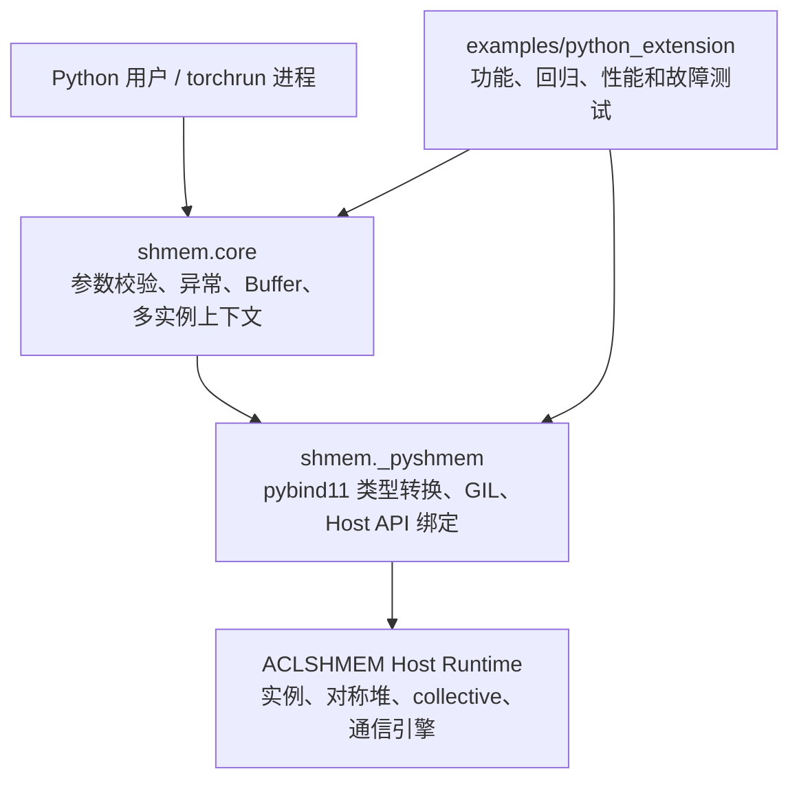

# 【社区任务】SHMEM Python 接口开发设计文档

## 一、需求背景

### 1.1 需求来源

本文档对应 2026 年 7 月 CANN 社区任务“SHMEM Python 接口开发”。任务要求基于 `cann/shmem` 主线已有 Python 工程，使用 pybind11 补齐 20 个 ACLSHMEM Host API 的 Python 绑定，并在 `shmem.core` 中提供对应的高层 Pythonic 接口、测试、示例和文档。

任务范围不包含 Device Kernel API，例如 `aclshmemx_roce_*`。

### 1.2 基线信息

| 项目 | 基线 |
| --- | --- |
| 上游仓库 | `https://gitcode.com/cann/shmem` |
| 个人仓库 | `https://gitcode.com/muluzhe/shmem` |
| 设计分析快照 | `643bfb73b50d88042234d3f5e0c7c9841cdedbbe` |
| 绑定实现 | `src/host/python_wrapper/pyshmem.cpp` |
| Python 包 | `src/python/shmem/` |
| Python API 文档 | `docs/api/pythonAPI.md` |
| 测试与样例 | `examples/python_extension/` |
| CANN | CANN 9.0.0 或任务认可的更新社区版本 |
| Python | Python 3.9 及以上，主验证环境为 Python 3.11 |
| 硬件 | Atlas A2/A3 训练或推理系列产品 |

进入实现阶段时将先同步上游主线，并在自测报告中记录实际使用的 commit SHA，避免主线变化导致接口、文档和测试口径不一致。

### 1.3 现状分析

当前主线已具备以下基础能力：

- `pyshmem.cpp` 已建立 pybind11 模块、枚举、地址和 ACL stream 转换方式；
- 已有 `InitAttr`、`OptionalAttr`、`UniqueId`、`MemType` 等绑定类型；
- 已有默认 Device 侧 `malloc/calloc/align/free` 绑定；
- `shmem.core` 已提供初始化、Buffer、put/get 等高层接口；
- 已有 Python extension 样例和构建路径。

仍需解决的问题包括：

- `aclshmemx_set_attr_uniqueid_args` 当前仅由内部 UID 初始化 wrapper 使用，未独立导出；
- `InitAttr` 尚未暴露已有的 `instance_id` 字段；
- 多实例上下文 get/set 尚未提供 Python API；
- 对称堆高层接口未贯穿 `mem_type`、所有权和一次性 free 调用状态；
- 四类通信引擎配置、collective、handle wait 和 profiling 尚未完整封装；
- `get_unique_id()` 的现有高层路径实际使用 `bytes`，新增类型化 API 必须保持兼容；
- collective、stream、跨机 RDMA 和 profiling 数据的生命周期需要显式设计。

### 1.4 任务目标

1. 在 `shmem._pyshmem` 中完整绑定任务书列出的 20 个 Host API。
2. 在 `shmem.core` 中补齐 collective、多实例、带 `mem_type` 的对称堆、handle wait、引擎配置和 profiling 高层封装。
3. 保持已有 `init`、`buffer`、`put`、`get` 及顶层 Python 导出的兼容性。
4. 更新 Python API 文档、QuickStart 和 `examples/python_extension`。
5. 完成单卡、2/4/8 卡功能与性能验证，并完成双机 RDMA 验证。
6. 形成可复现的自测报告、原始日志和验收交付件。

### 1.5 验收标准

| 类别 | 标准 |
| --- | --- |
| 功能 | 20 个 Host API 均可从 Python 调用，参数、返回值和 C++ 语义一致 |
| 高层接口 | `shmem.core` 对应接口可用，异常、Buffer、stream 和多实例约定明确 |
| 回归 | `examples/python_extension/run.sh` 原有用例全部通过 |
| 新增测试 | collective、多实例、handle wait、引擎配置、mem_type heap、profiling 用例通过 |
| 主引擎 | 至少完成 MTE 主路径验证 |
| 多卡 | 使用 `torchrun` 覆盖 2/4/8 卡 |
| 性能 | Python `putmem_on_stream` 相对同路径 C++ overhead 不超过 5% |
| 正确性 | put/get bit-exact 或满足约定误差，handle 完成后数据可见，多实例状态隔离 |
| 文档 | Python API、QuickStart、测试说明、自测报告与实现一致 |

### 1.6 模板适用性说明

本任务属于 ACLSHMEM Host Python API 与 pybind11 绑定开发，不涉及 Ascend C
算子数学公式、TBE 对标、Host tiling 或 Device Kernel 实现。官方设计模板中的
算子专用章节不适用于本任务，本文分别以 Host API 映射、Python 绑定分层、
指针与 Stream 约定、生命周期管理、兼容性分析及多卡测试设计进行对应说明。

## 二、需求分析

### 2.1 总体分层



设计原则如下：

- `_pyshmem` 保持接近 C/C++ 的名称、参数和返回语义；
- `shmem.core` 负责 Python 参数校验、异常翻译、资源配对和兼容性；
- 地址和 stream 继续沿用现有整数句柄约定，`0` 表示空指针或默认 stream；
- Python 不销毁调用方拥有的 ACL stream；
- collective 不增加隐式 stream/device synchronize；
- 运行时拥有的指针不会以可长期解引用的裸指针形式暴露给 Python。

### 2.2 需求拆解与目标 API 映射

#### 2.2.1 初始化与多实例

| C/C++ 原型 | `_pyshmem` 设计 | `shmem.core` 设计 |
| --- | --- | --- |
| `int aclshmemx_set_attr_uniqueid_args(int my_pe, int n_pes, int64_t local_mem_size, aclshmemx_uniqueid_t *uid, aclshmemx_init_attr_t *attr)` | 同名导出，接收 `bytes/UniqueId` 和 `InitAttr`，返回 C++ `int`；attr 持有实际传给 native 的 UID 存储 | 初始化内部使用；现有 bytes UID 路径保持兼容 |
| `aclshmem_instance_ctx* aclshmemx_instance_ctx_get()` | 保持 GIL 调用；非空时立即复制 `id` 并返回只读 `InstanceContext` 快照，空指针返回 `None`；不暴露 reserved `instance` 指针 | `current_instance() -> int`，无当前实例时抛出 `AclshmemError` |
| `int aclshmemx_instance_ctx_set(uint64_t instance_id)` | 同名导出并原样返回 `int` | `set_instance()` 与 `instance()` 上下文管理器 |

#### 2.2.2 对称堆内存

| C/C++ 原型 | `_pyshmem` 设计 | `shmem.core` 设计 |
| --- | --- | --- |
| `void *aclshmemx_malloc(size_t size, aclshmem_mem_type_t mem_type)` | 返回 Python `int` 地址，空指针返回 `0` | `buffer(..., mem_type=...)` |
| `void *aclshmemx_calloc(size_t count, size_t size, aclshmem_mem_type_t mem_type)` | 返回 Python `int` 地址，空指针返回 `0` | `calloc(..., mem_type=...)` |
| `void *aclshmemx_align(size_t alignment, size_t size, aclshmem_mem_type_t mem_type)` | 返回 Python `int` 地址，空指针返回 `0` | `align(..., mem_type=...)` |
| `void aclshmemx_free(void *ptr, aclshmem_mem_type_t mem_type)` | 地址从 `intptr_t` 转换为指针，返回 `None` | `free(Buffer)`，读取 Buffer 元数据 |

#### 2.2.3 引擎配置

以下四个接口均返回 C++ `int`，低层原样返回错误码，高层把非零错误码转换为 `AclshmemError`：

```cpp
int aclshmemx_set_mte_config(uint64_t offset, uint32_t ub_size, uint32_t sync_id);
int aclshmemx_set_sdma_config(uint64_t offset, uint32_t ub_size, uint32_t sync_id);
int aclshmemx_set_rdma_config(uint64_t offset, uint32_t ub_size, uint32_t sync_id);
int aclshmemx_set_udma_config(uint64_t offset, uint32_t ub_size, uint32_t sync_id);
```

Python 高层接口分别为 `set_mte_config`、`set_sdma_config`、`set_rdma_config` 和 `set_udma_config`。

#### 2.2.4 集合通信与同步

| C/C++ 原型 | `_pyshmem` 设计 | `shmem.core` 设计 |
| --- | --- | --- |
| `void aclshmem_barrier(aclshmem_team_t team)` | `team -> None` | `barrier(team)` |
| `void aclshmem_barrier_all(void)` | `() -> None` | `barrier_all()` |
| `void aclshmem_sync(aclshmem_team_t team)` | `team -> None` | `sync(team)` |
| `void aclshmem_sync_all(void)` | `() -> None` | `sync_all()` |
| `void aclshmemx_barrier_on_stream(aclshmem_team_t team, aclrtStream stream)` | `team, stream:int -> None` | `barrier_on_stream(team, stream)` |
| `void aclshmemx_barrier_all_on_stream(aclrtStream stream)` | `stream:int -> None` | `barrier_all_on_stream(stream)` |
| `void aclshmemx_handle_wait(aclshmem_handle_t handle, aclrtStream stream)` | `Handle, stream:int -> None` | `handle_wait(handle, stream)` |

`Handle` 是 `aclshmem_handle_t` 的 Python 值对象，仅包含 `team_id`。它不表示 Python future，不拥有 runtime 资源。

#### 2.2.5 Profiling

| C/C++ 原型 | `_pyshmem` 设计 | `shmem.core` 设计 |
| --- | --- | --- |
| `void aclshmemx_get_prof(aclshmem_prof_pe_t **out_profs, bool verbose)` | 接收 `verbose`；当前 PE 是 profiling 采集 PE 时深拷贝数据，否则返回 `None` | `get_prof(verbose=False)` |
| `void aclshmemx_show_prof(void)` | 保留原有控制台输出行为，返回 `None` | `show_prof()`，标注 deprecated |

profiling 常量和结构如下：

- `ACLSHMEM_CYCLE_PROF_MAX_BLOCK = 64`；
- `ACLSHMEM_CYCLE_PROF_FRAME_CNT = 1024`；
- 每个 block 包含 `ccount[1024]` 和 `cycles[1024]`；
- `aclshmem_prof_pe_t` 包含 `pe_id` 和 64 个 block。

### 2.3 兼容性要求

1. 现有 `shmem.core.init()` 的位置参数和默认行为不变，只在末尾增加可选 `instance_id=0`。
2. 现有 `get_unique_id()` 返回值及 bytes UID 初始化路径不改变。
3. 现有 `buffer(size, release=False, except_on_del=True)` 参数继续可用，新增 `mem_type` 为末尾关键字参数。
4. 现有 `_pyshmem.aclshmem_malloc/calloc/align/free` 不删除、不重命名；新增 x 版本并由高层逐步使用。
5. 顶层 `shmem.__init__` 和 `shmem.core.__all__` 同步补充新导出，不影响原有名称。
6. 新增 API 不隐式创建、同步或销毁 stream。
7. 第 1 项描述的是旧位置参数兼容性；`init()` 新增的引擎选择参数位于 `*` 之后，仅允许关键字传入，默认值仍为 MTE；不传该参数时与现有初始化行为一致。
8. `InitAttr` 的 UID owner 只作为 C++ 绑定内部状态存在，不新增公开字段，也不改变现有 Python 属性名称。
9. 多实例当前上下文是进程级状态而不是线程局部状态；兼容现有全局 runtime 语义，不把上下文管理器描述为线程局部实例。

## 三、详细设计

### 3.1 pybind11 公共约定

#### 3.1.1 指针与整数

- Python 地址使用非负 `int`；
- C++ 中先转换为 `intptr_t`/`uintptr_t`，再转换为目标指针，避免 64 位地址截断；
- `0` 对应 `nullptr`；
- `_pyshmem` 的分配接口在 C++ 返回空指针时返回 Python 整数 `0`；
- `shmem.core` 对正数大小分配得到 `0` 的情况抛出 `AclshmemError`。

#### 3.1.2 ACL stream

- 参数类型沿用现有 wrapper 的 `intptr_t`；
- `stream == 0` 转换为默认 `aclrtStream(nullptr)`；
- 非零值通过 `reinterpret_cast<aclrtStream>` 转换；
- stream 生命周期由调用方管理；
- on-stream API 只入队，不在 Python 层追加同步。

#### 3.1.3 GIL

- 进入运行时前完成 Python 对象解析和参数校验；
- 可能阻塞或进入 ACLSHMEM runtime 的区段释放 GIL；
- 构造 Python 返回对象、更新 owner 或抛出 Python 异常前重新持有 GIL；runtime 裸数据必须先复制到不依赖 Python 的本地 C++ 值对象，不能把易被复用的裸指针留到重新获取 GIL 后再读取；
- 不在持有 `py::object` 引用时使用覆盖整个 wrapper 的不安全 call guard；需要 Python 前后处理的接口采用显式 `py::gil_scoped_release` 代码块。
- `aclshmemx_instance_ctx_get()` 是例外：native 返回的是借用指针，wrapper 从调用 native、检查空指针、读取 `ctx->id` 到构造 Python 快照的全过程保持 GIL，不使用 `py::call_guard<py::gil_scoped_release>()`。
- `aclshmemx_get_prof()` 在释放 GIL 后使用 profiling 专用 C++ `std::mutex` 串行化 Python wrapper 调用；锁覆盖 native 调用、输出指针检查以及全部 profiling 字段复制进本地 C++ 值对象的完整区段，解锁并重新获取 GIL 后才构造 Python 对象。`aclshmemx_show_prof()` 访问同一全局缓冲，因此共用该 mutex。

#### 3.1.4 错误语义

- C++ `int` 返回接口在 `_pyshmem` 原样返回错误码；
- C++ `void` 接口在 `_pyshmem` 返回 `None`；
- C++ 内存分配指针在 `_pyshmem` 返回整数地址或 `0`；runtime 管理的上下文指针按 3.3 节转换为快照或 `None`；
- `shmem.core` 统一将非零错误码和无效返回转换为现有 `AclshmemInvalid`/`AclshmemError`；
- `aclshmemx_free` 的 C++ 返回类型为 `void`，内部 barrier 或 memory manager 释放失败仅写 runtime 日志；Python 不提供虚构的释放成功状态，也不在结果不确定时自动重试；
- collective 无错误码，超时和死锁由测试 watchdog、进程退出码与逐 rank 日志判定。

#### 3.1.5 Runtime 生命周期前置条件

低层 `_pyshmem` 保留 C++ 接口的原始前置条件，不尝试把所有 runtime 状态错误改写为 Python 语义。高层新增接口在进入 native 前执行可确定的状态检查：

| 接口类别 | 允许调用时机 | 高层处理 |
| --- | --- | --- |
| `set_attr_uniqueid_args`、`UniqueId.from_bytes` | 初始化前 | 完成类型、长度和 owner 处理，不要求 runtime 已初始化 |
| `current_instance` | 初始化前后 | 返回当前上下文 ID；默认上下文为 0 |
| `set_instance`、`instance` | 目标实例已存在 | native 非零返回值转换为 `AclshmemError` |
| x malloc/calloc/align/free、引擎配置、collective、handle_wait、profiling | 当前实例已初始化 | 高层先检查 `aclshmemx_init_status()`，未初始化时抛出 `AclshmemError`，不进入可能依赖 runtime 全局状态的 native 路径 |

状态检查不扩展为与外部 C++ 线程的并发安全保证；文档明确禁止在任一 SHMEM 调用进行期间从其他线程 finalize 当前实例。

### 3.2 UID 初始化与 `InitAttr`

`aclshmemx_set_attr_uniqueid_args` 会把 `attr.comm_args` 指向调用方传入的 UID，而不是复制 UID。因此独立绑定必须保证实际传给 native 的 `aclshmemx_uniqueid_t` 至少存活到 `aclshmemx_init_attr` 返回。现有 `get_unique_id()` 返回完整 UID 结构的 `bytes`，新绑定同时接受 `bytes` 与已有的 `UniqueId`，避免要求现有用户和官方用例改写 UID 传递方式。

绑定方案：

```python
ret = _pyshmem.aclshmemx_set_attr_uniqueid_args(
    my_pe, n_pes, local_mem_size, uid, attr
)
```

- `uid` 类型为 `bytes | UniqueId`；
- `attr` 类型为已有 `InitAttr`；
- `UniqueId.from_bytes(raw)` 提供完整结构的显式转换，要求长度等于 `sizeof(aclshmemx_uniqueid_t)` 并校验版本字段；现有 `get_unique_id()` 仍返回 bytes，不改变兼容行为；
- `UniqueId` 路径直接把该对象内的结构地址传给 native，并使用等价于 `py::keep_alive<5, 4>` 的 owner 关系，使 `attr` 保持输入对象存活；
- `bytes` 路径要求长度等于 `sizeof(aclshmemx_uniqueid_t)`，再把完整结构复制到 heap-backed `aclshmemx_uniqueid_t`，将该稳定地址传给 native；不能让 `attr.comm_args` 指向 wrapper 栈对象，也不能直接依赖 bytes 缓冲区的对齐；
- `InitAttr` 绑定启用私有 owner 存储。wrapper 只有在 owner 已安全关联后才向 Python 返回成功；`attr` 保存输入 `UniqueId`，或保存拥有转换后结构的私有 capsule；再次成功设置时替换旧 owner，设置失败时保留原 owner；
- 私有 UID owner 不作为公共 Python API 暴露或写入文档，但其生命周期必须覆盖后续 `aclshmemx_init_attr` 调用；
- `InitAttr` 新增 `.instance_id` 读写字段，默认值为 `0`；
- 不暴露 `.comm_args` 裸指针；
- 对 `my_pe`、`n_pes`、`local_mem_size` 的最终合法性仍由 C++ runtime 判断。

现有高层 bytes UID 路径保留。`aclshmem_init_using_unique_id` wrapper 增加末尾可选 `instance_id=0`，在构造本地 attr 后设置该字段，再调用现有初始化逻辑。因此旧调用无需修改，多实例用户可以使用：

```python
shmem.core.init(
    uid=uid_bytes,
    rank=rank,
    nranks=world_size,
    initializer_method="uid",
    mem_size=heap_size,
    instance_id=1,
)
```

#### 3.2.1 `InitAttr` owner 的实现载体

为落实上文的 owner 关系，同时避免字面使用 `py::keep_alive` 导致重复设置后旧 UID 引用持续累积，绑定内部采用 Python 名称仍为 `InitAttr` 的 C++ holder，向外转发原有字段：

```cpp
struct PyInitAttr {
    aclshmemx_init_attr_t native{};
    aclshmemx_bootstrap_t bootstrap_flags = ACLSHMEMX_INIT_WITH_DEFAULT;
    py::object py_uid_owner = py::none();
    std::shared_ptr<aclshmemx_uniqueid_t> copied_uid_owner;
};
```

- `UniqueId` 路径在调用 native 前准备新的 `py::object` owner，成功后移动替换 `py_uid_owner` 并清空 `copied_uid_owner`；
- `bytes` 路径在调用 native 前完成长度、版本校验和 heap-backed 结构分配，native 使用 `copied_uid_owner.get()`，成功后移动替换 holder 中的 owner；
- 调用前保存旧 `comm_args`、bootstrap flag 与 owner；native 返回非零时恢复旧状态，不能让失败调用破坏仍可使用的 attr；setter 成功后把私有 `bootstrap_flags` 设为 `ACLSHMEMX_INIT_WITH_UNIQUEID`；
- `aclshmem_init` 等接受 `InitAttr` 的既有 wrapper 改为 lambda：把 `holder.bootstrap_flags` 和 `holder.native` 传给 `aclshmemx_init_attr`。普通 `InitAttr` 仍使用 DEFAULT；成功调用 UID setter 的 attr 使用 UNIQUEID，从而形成 `set_attr_uniqueid_args -> aclshmem_init(attr)` 的完整独立调用链；
- holder 析构由 pybind11 对象生命周期驱动，不暴露 UID 裸地址，不使用进程级 side table，也不依赖可被用户删除的 Python 动态属性；
- `UniqueId` 与 bytes 两条路径都校验 `ACLSHMEM_UNIQUEID_VERSION`；holder 转发 `option_attr` 时使用 `reference_internal`，确保修改其字段会写回 `native.option_attr`，不会修改临时副本。

上文的 `py::keep_alive<5, 4>` 表示需要达到的 owner 关系；实际实现以该 holder 为准，从而同时满足替换、失败回滚和 bytes 私有存储三项要求。

#### 3.2.2 初始化引擎选择

跨机 RDMA、SDMA 或 UDMA 路径是否可用由初始化属性 `option_attr.data_op_engine_type` 决定；`set_*_config` 只更新 UB 配置，不能代替引擎启用。为使 Python 能完成任务书要求的引擎 smoke 和双机 RDMA 验证，UID 初始化 wrapper 增加末尾默认参数：

```python
import typing

aclshmem_init_using_unique_id(
    mype: int,
    npes: int,
    mem_size: int,
    uid: bytes,
    instance_id: int = 0,
    op_engine_type: typing.Union[OpEngineType, int] = OpEngineType.MTE,
) -> int
```

高层接口保持全部旧位置参数不变，并把引擎参数限制为关键字参数：

```python
def init(
    device=None,
    uid=None,
    rank=None,
    nranks=None,
    mpi_comm=None,
    initializer_method="",
    mem_size=None,
    instance_id=0,
    *,
    op_engine_type=OpEngineType.MTE,
) -> None: ...
```

- `OpEngineType` 按 bit mask 使用，绑定启用 pybind11 算术/按位组合能力；合法位仅为 MTE、SDMA、ROCE、UDMA，组合值必须非零且不得包含未知位；
- 默认值为 MTE，旧调用生成的 `option_attr` 与现有实现一致；
- HCCS+RDMA 自动选路使用 `OpEngineType.MTE | OpEngineType.ROCE`；只启用某个可选引擎的 smoke 测试必须在该引擎受支持的硬件和构建选项上运行；
- 当前 backend 创建 entity 时始终保留 MTE 基础能力；单独传入 SDMA、ROCE 或 UDMA 位表示请求相应附加能力，不代表排除 MTE，实际路径仍以数据结果和 runtime 日志判定；
- 参数在进入释放 GIL 的 native 初始化区段前完成解析和范围校验。

### 3.3 多实例上下文

公开 C++ 结构为：

```cpp
typedef struct {
    uint64_t id;
    void *instance;
} aclshmem_instance_ctx;
```

其中 `instance` 是 reserved runtime 指针，Python 不应保存、释放或解引用。native getter 内部互斥锁在函数返回前已经释放，因此 wrapper 不能先释放 GIL、调用 native、再读取借用指针。`aclshmemx_instance_ctx_get()` 使用自定义 lambda，在保持 GIL 的同一临界路径中调用 native、检查空指针并立即把 `ctx->id` 复制到局部 `uint64_t`；之后仅用该值构造 Python 自有的只读 `InstanceContext(id=...)` 快照。低层字段名与 C++ 一致为 `id`；高层 `current_instance()` 在存在当前实例时返回该 ID 的 Python `int`，否则抛出 `AclshmemError`。

高层 `current_instance()`、`set_instance()`、`instance()`、`init()` 和 `finalize()` 共用定义在 `core/utils.py` 的进程内 `RLock`，避免 Python 高层生命周期操作交错。保持 GIL只能序列化 Python wrapper 入口，不能保护外部 C++ 线程；低层 `_pyshmem` 与外部 C++ 并发切换或 finalize 不在 Python 层安全承诺范围内，文档明确禁止这种并发用法。

高层接口：

```python
def current_instance() -> int: ...
def set_instance(instance_id: int) -> None: ...

@contextmanager
def instance(instance_id: int) -> Iterator[None]: ...
```

高层拒绝非整数及超出 `uint64_t` 的 `instance_id`；ID 是否已存在由 native `aclshmemx_instance_ctx_set` 判定，Python 不维护第二份实例注册表。

设计基线的实例域表键仍为 `uint32_t`。为避免大 ID 截断后别名到其他实例，低层保持 C++ `uint64_t` 原型，高层暂将有效范围收紧为 `[0, UINT32_MAX]`；若实现阶段上游已统一改为 `uint64_t` 键，再同步放宽并补充边界测试。

上下文管理器执行顺序：

1. 获取进程内 `RLock`；
2. 读取旧实例 ID；
3. 切换到目标实例；
4. 执行用户代码；
5. 在 `finally` 中恢复旧实例；
6. 释放锁。

该锁只保证使用 `shmem.core` 上下文管理器的 Python 线程不会交错切换，不承诺裸 `_pyshmem` 调用或外部 C++ 线程的并发安全。

#### 3.3.1 进程全局语义与隔离边界

- native 当前实例由进程级全局上下文决定，不是 Python 线程局部变量；成功初始化新的非零 `instance_id` 后，该实例成为当前实例；finalize 当前非零实例后，native 回到实例 0；
- `instance()` 在整个用户代码区段持有生命周期 `RLock`，可阻止其他使用 `current_instance/set_instance/instance/init/finalize` 的高层线程交错切换；
- 现有 put/get 等数据路径不因本任务统一增加每次调用的 Python 锁开销。因此一个线程处于 `instance()` 区段时，其他线程不得调用任何高层或低层 SHMEM API；需要并发的应用应使用多进程，而不是在同一进程中把不同线程绑定到不同实例；
- 即使不使用上下文管理器，`set_instance()` 也只能在进程内没有进行中 SHMEM 调用时执行；生命周期锁不覆盖已有数据路径，调用方必须负责该静默期；
- 上述限制写入 Python API 和 QuickStart。T04 验证受支持的生命周期调用串行化，T04A 验证单线程显式切换后的 heap/team/RMA 隔离，不宣称线程局部实例能力。

#### 3.3.2 多实例资源隔离验证

隔离测试在每个 PE 进程内建立两个非零实例，并分别完成初始化；rank 0 为两个实例生成彼此独立的 UID，向其余 rank 广播，所有 rank 按相同实例顺序初始化。每个实例分配独立对称 heap、创建 team、写入不同数据模式并执行 RMA；随后至少往返切换两次，验证当前 ID、heap 地址、team 查询结果和远端数据均属于目标实例。释放和 finalize 按各 PE 相同顺序执行，并验证 finalize 一个实例后另一个实例仍可切换和执行 RMA。

### 3.4 对称堆与 Buffer

#### 3.4.1 低层接口

新增以下 `_pyshmem` 导出：

```python
aclshmemx_malloc(size: int, mem_type: MemType = MemType.DEVICE_SIDE) -> int
aclshmemx_calloc(count: int, size: int, mem_type: MemType = MemType.DEVICE_SIDE) -> int
aclshmemx_align(alignment: int, size: int, mem_type: MemType = MemType.DEVICE_SIDE) -> int
aclshmemx_free(ptr: int, mem_type: MemType = MemType.DEVICE_SIDE) -> None
```

#### 3.4.2 Buffer 元数据

`Buffer` 当前定义在 `src/python/shmem/core/utils.py`。扩展后至少保存：

- `addr`：整数地址；
- `length`：字节长度；
- `mem_type`：`MemType.HOST_SIDE` 或 `MemType.DEVICE_SIDE`；
- `owned`：是否由当前 Buffer 拥有并允许释放；兼容旧构造方式时默认 `True`；
- `free_called`：是否已经向 native `aclshmemx_free` 发起过一次调用，默认 `False`；它是防止重复调用的一次性状态，不表示 native 已确认释放成功。

兼容原则：

- 旧构造方式 `Buffer(addr, length)` 继续工作，默认 `DEVICE_SIDE`、`owned=True`、`free_called=False`；
- 现有 `addr`、`length`、`repr` 和比较行为不被破坏；
- `buffer()`、`calloc()`、`align()` 返回 `owned=True`，并记录实际传给 runtime 的 `mem_type`；
- `get_peer_buffer()` 返回 `owned=False` 的派生 Buffer，并继承 `mem_type`；
- 切片或其他派生对象若存在，同样不取得所有权；
- `free()` 拒绝释放非 owner 或 `free_called=True` 的 Buffer；完成 Python 参数检查后，在持有 GIL 时先原子地设置 `free_called=True`，再使用 Buffer 记录的 `mem_type` 调用 `_pyshmem.aclshmemx_free`；手工构造 Buffer 时由调用者保证元数据与原分配一致；
- native free 返回 `void`，control barrier 或 memory manager release 失败只记录日志。因此 `free()` 返回只表示调用已经返回，不能解释为确认释放成功；无论日志是否报告失败，该 Buffer 都视为不可再使用且不允许重试，以免在结果不确定时二次释放。
- native free 内含全 PE control barrier，各 PE 必须按相同顺序对对应的对称分配调用 free；参数校验和 `free_called` 检查必须在所有 rank 上得到一致结果，测试不得让部分 rank 进入 free、部分 rank 提前返回。

#### 3.4.3 高层接口

```python
def buffer(
    size: int,
    release: bool = False,
    except_on_del: bool = True,
    *,
    mem_type: MemType = MemType.DEVICE_SIDE,
) -> Buffer: ...

def calloc(
    count: int,
    size: int,
    *,
    mem_type: MemType = MemType.DEVICE_SIDE,
) -> Buffer: ...

def align(
    alignment: int,
    size: int,
    *,
    mem_type: MemType = MemType.DEVICE_SIDE,
) -> Buffer: ...

def free(buf: Buffer) -> None: ...
```

参数校验包括：

- `size`、`count` 和 `alignment` 必须为整数且满足接口要求；
- `count * size` 在 Python/C++ 边界前检查 `size_t` 溢出；
- `alignment` 必须为 2 的幂且满足 C++ 约束；
- `mem_type` 必须是已有 `MemType` 枚举；
- `HOST_SIDE` 依赖 CANN 构建提供 `HAS_ACLRT_MEM_FABRIC_HANDLE`；不支持时低层返回 `0`、高层抛出 `AclshmemError`，开发环境中的该错误路径不能替代正式环境的 T08 功能验证；
- 对称堆释放保持显式调用，不依赖 Python GC 时序。

### 3.5 引擎配置

四类配置采用薄封装，不在 Python 层缓存第二份 runtime 配置：

```python
def set_mte_config(offset: int, ub_size: int, sync_id: int) -> None: ...
def set_sdma_config(offset: int, ub_size: int, sync_id: int) -> None: ...
def set_rdma_config(offset: int, ub_size: int, sync_id: int) -> None: ...
def set_udma_config(offset: int, ub_size: int, sync_id: int) -> None: ...
```

Python 只做固定宽度整数范围校验：

- `offset` 对应 `uint64_t`；
- `ub_size`、`sync_id` 对应 `uint32_t`；
- RDMA/UDMA 的 staging UB 最小值由当前 C++ runtime 最终校验；
- 不可用引擎返回非零错误码时，高层抛出异常并在测试报告中记录环境限制。

MTE 为必测主路径。SDMA、RDMA、UDMA 在环境和编译选项可用时分别执行 smoke 测试，不把“环境不支持”记录成“测试通过”。

配置接口必须在当前实例初始化完成后调用。高层先检查初始化状态再进入 native，避免在 `init_manager` 尚未建立时调用依赖 `update_device_state()` 的配置路径。配置函数返回 0 只证明参数已被 runtime 接受并完成状态更新，不单独证明对应传输引擎在当前拓扑可用；引擎可用性必须通过实际 RMA 数据操作、结果校验和 runtime 传输日志共同确认。

### 3.6 Collective 与同步语义

高层 API：

```python
def barrier(team: int) -> None: ...
def barrier_all() -> None: ...
def sync(team: int) -> None: ...
def sync_all() -> None: ...
def barrier_on_stream(team: int, stream: int) -> None: ...
def barrier_all_on_stream(stream: int) -> None: ...
```

必须保留以下 C++ 语义：

- team 内全部 PE 必须按相同顺序调用 collective；
- `barrier` 等待全部 PE，并保证此前 store、AMO 和 RMA 更新完成；
- 仅 HCCS 的 scale-up 系统可保证全局可见；HCCS+RDMA 系统只保证对某 PE 内存的更新对该 PE 可见；
- CPU barrier 只完成 CPU 发起的通信，NPU barrier 只完成 NPU 发起的通信；
- 从 CPU 等待 NPU 操作需要显式 stream/device synchronize 或相应 on-stream API；
- `sync` 只保证此前普通内存 store 的完成和可见性，不保证 ACLSHMEM RMA 远端更新完成；
- on-stream barrier 只进入指定 stream，不隐式同步整个 stream。

高层要求 `team` 为 C++ `aclshmem_team_t` 可表示的整数，`stream` 为非负且可由 `intptr_t` 表示的整数；`stream=0` 继续表示默认 stream。team 是否已创建以及是否属于当前实例由 runtime 负责，Python 不缓存 team 对象或延长其生命周期。

### 3.7 `handle_wait`

`Handle` 绑定：

```python
handle = _pyshmem.Handle(team_id)
handle.team_id
```

构造函数使用 lambda 聚合初始化 `aclshmem_handle_t{team_id}`，避免假设 C++ 聚合结构存在单参数构造函数；`team_id` 先检查 `aclshmem_team_t` 整数范围。Handle 仅保存值，不验证该 team 当前是否存在。

高层接口：

```python
def handle_wait(handle: Handle, stream: int) -> None: ...
```

设计约束：

- `team_id` 使用已有 team 整数值；
- `handle_wait` 的 Host wrapper 只在传入 stream 上排入等待 kernel，不阻塞 CPU；调用方仍需在读取 Host 结果前同步同一 stream；
- handle 不拥有 stream 或 team；
- 单机测试只能验证绑定和基本入队行为；
- 跨机 RDMA 正确性以 `examples/rdma_handlewait_test/use_handlewait` 与 `unuse_handlewait` 的差异为参考，验证 wait 后对端数据可见。

#### 3.7.1 跨机 Stream/Signal 能力边界

Python 文档沿用 `docs/api/stream_api_usage.md` 的 C++ 能力边界，不因增加 `handle_wait` 绑定而扩大底层支持范围：

| 操作 | HCCS/MTE | RDMA 跨机 | Python 约束 |
| --- | --- | --- | --- |
| `putmem_on_stream` / `getmem_on_stream` | 支持 | 支持 | 跨机自动选路需以 `MTE \| ROCE` 初始化；RDMA 路径的完整源/目标范围必须来自现有 `aclshmem_malloc` 或等价 DEVICE_SIDE SHMEM 对称分配，不能用普通 `aclrtMalloc` 替代 |
| `signal_op_on_stream(..., SIGNAL_SET, ...)` | 支持 | 支持 | RDMA 发出后使用同一 team 的 `handle_wait` |
| `signal_op_on_stream(..., SIGNAL_ADD, ...)` | 支持 | 不支持 | 不把 RDMA 环境下的失败记为 Python 绑定缺陷 |
| `signal_wait_until_on_stream` | 等待本 PE 地址 | 不提供 RDMA 远端等待 | 可等待远端 SET 最终写入的本地信号，但接口本身只检查调用 PE 的本地 `sig_addr` |
| `handle_wait` | 无未完成 RDMA 时仅为基本入队 | 用于等待 team 上先前异步 RDMA 操作 | 只在指定 stream 排入等待；Host 读取结果前仍需同步同一 stream |

双机用例必须记录初始化引擎 mask、内存来源、team、stream、handle_wait 位置及同步位置。若环境没有 RDMA 链路，只能记录为环境未覆盖，不能以单机 smoke 替代 T18。

### 3.8 Profiling

`aclshmemx_get_prof` 使用 runtime 管理的全局 `g_host_profs`。当前 PE 是 `SHMEM_CYCLE_PROF_PE` 指定的采集 PE 时，实际实现先把 `g_host_profs` 的地址写入输出参数，再同步拷贝 Device profiling 数据到该 Host 对象；函数返回后数据才可读取。Python 不拥有这块内存，而且下一次调用可能再次写入同一静态缓冲区，因此不能在 native 返回与快照复制之间留下并发窗口。

绑定步骤：

1. 把 `aclshmem_prof_pe_t *out_profs` 初始化为 `nullptr`，并准备不依赖 Python 的本地 C++ `ProfileData`/`std::optional<ProfileData>` 快照；
2. 进入显式 `py::gil_scoped_release` 区段，再获取 profiling 专用的静态 C++ `std::mutex`；
3. 持锁调用 `aclshmemx_get_prof(&out_profs, verbose)`，runtime 返回后仍在同一锁内检查输出指针；
4. 指针非空时，在释放 GIL 且持续持锁的状态下，把 `pe_id`、64 个 block 的 `ccount` 和 `cycles` 完整复制到本地 C++ 值对象；不能在 native 返回后先解锁，再读取 `g_host_profs`；
5. 完成复制后不再访问 runtime 裸指针，释放 mutex，退出 GIL release 区段并重新获取 GIL；
6. 本地快照存在时，将其移动或转换为 Python 自有、字段只读的 pybind11 值对象 `ProfileData`；否则返回 `None`；
7. 不调用 `free`，不保存 runtime 裸地址；
8. 未设置 `SHMEM_CYCLE_PROF_PE`，或当前 PE 不是指定采集 PE 时，原生输出指针保持为空并返回 `None`；若当前 PE 是采集 PE，即使全部计数为零也返回 `ProfileData`；
9. `get_prof()` 与兼容保留的 `show_prof()` 共用同一个 profiling mutex；`show_prof()` 在释放 GIL 后持锁完成整个 native 打印调用，避免与 `get_prof()` 交叉读写 `g_host_profs`；
10. 专用 mutex 保证经本 Python wrapper 发起的 profiling 调用互斥；与绕过 wrapper 的外部 C++ 线程并发调用不在 Python 绑定的安全承诺范围内；
11. C++ 接口返回类型为 `void`，内部 Device-to-Host 拷贝失败只能由 runtime 日志识别，Python 绑定保持这一原生错误语义，不虚构成功/失败状态。

Python 数据对象：

```python
class ProfileBlock:
    @property
    def ccount(self) -> tuple[int, ...]: ...   # 1024

    @property
    def cycles(self) -> tuple[int, ...]: ...   # 1024

class ProfileData:
    @property
    def pe_id(self) -> int: ...

    @property
    def blocks(self) -> tuple[ProfileBlock, ...]: ...  # 64
```

上述类型在 `_pyshmem` 中绑定并持有深拷贝后的数据，`shmem.core.get_prof()` 直接返回该不可变值对象或 `None`。`get_prof(verbose=False)` 返回结构化数据；`verbose=True` 同时保留 C++ 控制台打印。`show_prof()` 保留兼容，但文档标注 deprecated，并推荐 `get_prof(verbose=True)`。

`SHMEM_CYCLE_PROF_PE` 由 runtime 在实例初始化的 `prof_util_init()` 阶段读取。T19-T22 均使用全新进程，并在 `shmem.core.init()` 前设置或清除该环境变量；初始化完成后再修改环境变量不作为有效测试步骤。采集 PE、非采集 PE 和未设置变量三种情形分别启动独立作业，避免前一实例或进程环境污染测试结果。

### 3.9 高层模块划分

| 模块 | 职责 |
| --- | --- |
| `core/init_final.py` | `instance_id`、`op_engine_type` 初始化参数与 finalize 兼容 |
| `core/utils.py` | Buffer 元数据、所有权、free 调用状态和高层实例生命周期锁 |
| `core/memory.py` | x malloc/calloc/align/free 高层封装 |
| `core/multi_instance.py` | 当前实例、切换和上下文管理器 |
| `core/config.py` | 四类引擎配置及错误翻译 |
| `core/sync.py` | barrier/sync/on-stream/handle_wait |
| `core/profiling.py` | ProfileData、get_prof、show_prof |
| `core/__init__.py` | 高层 API 重导出 |
| `shmem/__init__.py` | 低层类型和 API 顶层兼容导出 |

## 四、实现范围与提交策略

### 4.1 计划修改文件

| 文件/目录 | 计划改动 |
| --- | --- |
| `src/host/python_wrapper/pyshmem.cpp` | 20 个 Host API、PyInitAttr owner、引擎 mask、Handle/InstanceContext/Profile 类型、GIL 与地址转换 |
| `src/python/shmem/__init__.py` | 顶层低层 API 和类型导出 |
| `src/python/shmem/core/init_final.py` | `instance_id`、`op_engine_type` 初始化兼容 |
| `src/python/shmem/core/utils.py` | Buffer 的 mem_type、owned、free_called 与高层实例生命周期锁 |
| `src/python/shmem/core/memory.py` | x malloc/calloc/align/free 高层接口 |
| `src/python/shmem/core/multi_instance.py` | 新增多实例上下文封装 |
| `src/python/shmem/core/config.py` | 新增引擎配置封装 |
| `src/python/shmem/core/sync.py` | 新增 collective 与 handle_wait |
| `src/python/shmem/core/profiling.py` | 新增 profiling 数据对象和接口 |
| `src/python/shmem/core/__init__.py` | 重导出新增 API |
| `docs/api/pythonAPI.md` | 函数原型、参数、返回值、异常、生命周期和跨机 Stream/Signal 限制 |
| `docs/quickstart.md` | CANN 9.0、引擎 mask、初始化、collective、多实例和 profiling 启动时机示例 |
| `examples/python_extension/` | 功能、异常、回归、性能与运行脚本 |

最终文件以实现阶段主线实际结构为准，不修改与本任务无关的 C++ Host/Device 实现。

### 4.2 提交批次

1. **types-init-memory**：PyInitAttr owner、UID 独立绑定、InstanceContext、mem_type heap 和 Buffer；
2. **engine-config**：初始化引擎 mask、MTE/SDMA/RDMA/UDMA 配置及最小测试；
3. **collective-handle**：barrier/sync/on-stream/Handle/handle_wait；
4. **profiling-doc-test**：profiling、文档、样例、回归与性能工具。

每批完成编译、导入和最小用例后再进入下一批，避免把编译、生命周期和多卡问题混在一个提交中。

## 五、可维可测分析

### 5.1 测试设计与层级

| 层级 | 内容 |
| --- | --- |
| 静态检查 | 格式、导出表、API 名称、文档链接、无二进制和敏感信息 |
| 构建测试 | CANN 9.0 环境编译 SHMEM 和 Python wheel |
| 导入测试 | `_pyshmem` 20 API 及新类型可导入 |
| 单卡功能 | 参数、错误码、Buffer、InstanceContext、profiling 非采集 PE 结果 |
| 多卡功能 | collective、mem_type heap、MTE、多实例和 RMA 正确性 |
| 跨机测试 | RDMA handle_wait 和数据可见性 |
| 性能测试 | Python/C++ `putmem_on_stream` 2/4/8 卡对比 |
| 回归测试 | 原有 `examples/python_extension/run.sh` 全部通过 |

### 5.2 功能用例矩阵

| 编号 | 用例 | 规模 | 通过标准 |
| --- | --- | --- | --- |
| T01 | 20 API 与类型导入 | 单进程 | 名称、签名和默认参数正确 |
| T02 | `set_attr_uniqueid_args` 双 UID 路径 | 2 PE | bytes 和 `UniqueId.from_bytes()` 均可经 `set_attr_uniqueid_args -> aclshmem_init(attr)` 完成 UID 初始化；删除原 UID 并触发 GC 后 attr 仍可安全 init；再次成功设置可替换 owner |
| T03 | 非法 UID/PE/heap 参数 | 单进程 | 长度错误的 bytes、错误 UID 类型及非法数值返回确定错误，失败设置不破坏 attr 原 owner，无崩溃 |
| T04 | `instance_ctx_get/set` | 单进程多实例/多线程 | ID 快照正确，非法 ID 返回错误；高层并发切换/读取由同一锁串行化，无悬空访问 |
| T04A | 多实例 heap/team/RMA 隔离 | 2 PE；每个 PE 进程内多实例 | 两个非零实例使用独立 UID 和不同数据模式；往返切换后 ID、heap、team 和 RMA 结果不串扰；finalize 一个实例后另一实例仍可工作 |
| T05 | `instance()` 正常恢复 | 单进程多实例 | 退出上下文恢复旧实例 |
| T06 | `instance()` 异常恢复 | 单进程多实例 | 用户异常后仍恢复旧实例 |
| T07 | DEVICE malloc/calloc/align/free | 1/2 卡 | 地址有效、calloc 清零、align 对齐，各 PE 按相同顺序 free |
| T08 | HOST malloc/calloc/align/free | 1/2 卡 | Host heap 路径正确、类型配对，各 PE 按相同顺序 free |
| T09 | 重复/非 owner free 与 mem_type 转发 | 单进程 | 高层拒绝重复和非 owner 调用，Host/Device 类型传递正确；`free_called` 仅表示已调用，不宣称 native 释放成功 |
| T10 | MTE config + RMA | 2 卡 | 主路径正确 |
| T10A | 配置接口生命周期保护 | 单进程 | 初始化前高层抛出确定异常且不进入 native；初始化后配置成功，非法定宽整数被拒绝 |
| T11 | SDMA/RDMA/UDMA smoke | 可用环境 | 可用时成功，不可用时记录真实限制 |
| T11A | 引擎 mask 与实际路径 | 2 PE/可用环境 | 默认 MTE 保持兼容；MTE/SDMA/ROCE/UDMA 及合法组合可传入；通过实际 RMA、数据校验和 runtime 日志确认所测引擎，不以 config 返回 0 代替可用性结论 |
| T12 | barrier/barrier_all | 2/4/8 卡 | 全 rank 完成，无超时或死锁 |
| T13 | sync/sync_all | 2/4/8 卡 | 语义范围内数据可见 |
| T14 | on-stream barrier | 2/4/8 卡 | 入队正确，显式同步后完成 |
| T15 | collective 顺序错误 | 2 卡隔离用例 | watchdog 终止并保留逐 rank 日志 |
| T16 | Handle 构造与传递 | 单卡/2 卡 | team_id 正确，无所有权问题 |
| T17 | 单机 handle_wait smoke | 2 卡 | 接口可调用，stream 同步后正确 |
| T18 | 双机 RDMA handle_wait | 双机 2 PE | wait 后结果正确，与 C++ 样例一致 |
| T19 | `get_prof(False)` | profiling 环境 | 返回深拷贝数据，不打印 |
| T19A | profiling 启动时机 | 独立进程 | `SHMEM_CYCLE_PROF_PE` 在 init 前设置或清除；采集 PE、非采集 PE、未设置三种作业结果符合约定，init 后修改不被误判为生效 |
| T20 | `get_prof(True)`/`show_prof` | profiling 环境 | 返回数据并按约定打印 |
| T21 | profiling 非采集 PE | 未设置环境变量/非指定 PE | 返回 `None`，无悬空访问；指定 PE 的零计数仍返回数据对象 |
| T22 | profiling 双线程并发调用 | profiling 环境/2 个 Python 线程 | 两线程由同步点同时执行 `get_prof/get_prof`，并补充 `get_prof/show_prof` 混合调用；共用 mutex 串行化 native 访问，且 `get_prof` 持锁至本地 C++ 快照复制结束；返回值为 `None` 或结构完整且不可变的 `ProfileData`，无混合快照、崩溃或悬空访问 |
| T23 | 原 Python extension 回归 | 原有规模 | `run.sh` 全部通过 |

### 5.3 多进程执行规则

所有 `torchrun` 或多进程用例必须：

- 使用唯一 rendezvous 端口；
- 为每个 rank 保存独立日志；
- 设置有限总超时；
- 任一 rank 非零退出即判定失败；
- 超时时保存最后一个 collective 进度点；
- 清理残留进程，不复用污染的 SHMEM session；
- 记录 NPU 型号、CANN、Python、torch、torch_npu、SHMEM SHA、卡数和完整命令。

### 5.4 正确性口径

- 整数与字节 RMA 结果必须 bit-exact；
- 浮点结果按 C++ 参考路径的 dtype 误差约定比较；
- calloc 验证全部目标字节为零；
- align 验证 `address % alignment == 0`；
- handle_wait 后读取对端结果前显式同步相同 stream；
- 多实例分别分配 heap、创建 team 和执行 RMA，切换后状态不得串扰。

### 5.5 性能口径

Python 与 C++ 对比必须使用相同：

- SHMEM commit；
- CANN、硬件和通信拓扑；
- shape、dtype、源 PE 和目标 PE；
- ACL stream；
- 预热次数、正式迭代次数和同步边界；
- 内存分配位置与引擎配置。

计时区间不包含 import、日志、内存分配和结果打印。2/4/8 卡每个规模至少独立执行 5 轮，保留原始值并使用中位数。

```text
overhead = (T_python - T_cpp) / T_cpp * 100%
```

通过标准为 `overhead <= 5%`。如果超标，分别测量 Python 参数校验、Buffer/stream 解包、pybind11 边界、GIL、runtime 和同步开销，不通过改变同步边界或减少正确性验证改变口径。

基准程序使用 Release 构建和相同编译优化等级，Python 与 C++ 都链接同一安装产物。每轮在同一 stream 上执行相同次数的调用；MTE 路径在相同位置同步 stream，RDMA 路径在两侧都纳入相同位置的 `handle_wait` 和 stream synchronize。主计时使用单调时钟，空循环和计时器分辨率单独记录，不从任一侧结果中单独扣除；报告同时给出每轮总时间、单次平均时间、中位数、最小/最大值和 overhead。最终 shape/消息大小以任务方自测指导为准，并在报告中固定列出，禁止 Python 与 C++ 使用不同批量大小摊薄边界开销。

## 六、验证环境规划

### 6.1 已具备环境

| 环境 | 已确认配置 | 用途 | 限制 |
| --- | --- | --- | --- |
| CANNLab 社区任务环境 | 100 小时资源；CANN 9.0.0；Python 3.11.4；aarch64；实测设备标识 `Ascend910_9362`；`npu-smi info -l` 为 1 个 NPU、2 个 Chip，`torch.npu.device_count()` 为 2；`/mnt/workspace`、`/home` 持久化 | 官方首选：编译、单卡功能和基线验证 | 当前环境的 2 个逻辑设备不直接等同于 2 张物理卡验收证据；2/4/8 卡和双节点需另行确认、申请 |

### 6.2 使用顺序

1. 设计文档合入前只创建环境清单，不修改 SHMEM 源码；
2. 设计通过后优先使用 CANNLab 1 卡完成基线构建和单卡测试；
3. 使用经任务方确认卡数口径的 CANNLab 2 卡资源完成首轮 collective/MTE；
4. 向 CANN 小助手确认并申请 4/8 卡官方环境；
5. 向 CANN 小助手申请双节点 RDMA 环境；
6. 不使用 CANN 8.5.x 结果作为本任务最终验收证据。

测试报告同时记录 `npu-smi info`、`npu-smi info -l` 和 `torch.npu.device_count()`。卡数验收按任务方认可的物理卡/设备口径填写；在获得书面确认前，不把单个物理 NPU 下的两个逻辑设备标记为“2 卡通过”。

### 6.3 环境与数据保存

- CANNLab 的源码、日志和测试数据只放在 `/mnt/workspace` 或 `/home`；
- 每完成一个可验证批次即提交到个人仓功能分支；
- 不把 wheel、编译目录、core dump、大型原始日志提交到 Git；
- 关机前保存环境信息、SHA、命令和关键日志；
- 避免无测试任务时占用付费或 100 小时资源。

## 七、风险与应对

| 风险 | 影响 | 应对 |
| --- | --- | --- |
| 主线接口变化 | 绑定无法编译或语义漂移 | 开发前同步 upstream，报告记录 SHA |
| UID 被提前回收 | attr.comm_args 悬空 | UniqueId 路径 keep-alive；bytes 路径由 attr 持有转换后的 heap-backed UID |
| runtime context 裸指针竞态 | 切换或 finalize 时悬空读取 | getter 保持 GIL 并立即复制 `id`；高层生命周期操作共用 `RLock`；禁止与外部 C++ 并发 finalize |
| mem_type 错配或重复 free | heap 损坏或崩溃 | Buffer 保存 mem_type、owned、free_called；一次调用后禁止重试 |
| native free 无状态码 | Python 误报释放成功 | 文档只承诺已发起调用，native 失败依赖 runtime 日志诊断 |
| 各 PE free 顺序不一致 | control barrier 死锁 | 多进程用例确保对应分配和 free 次序一致，故障用例使用 watchdog |
| collective 调用次序不一致 | 多进程永久阻塞 | watchdog、逐 rank 日志、独立故障用例 |
| CPU/NPU 完成域混淆 | 提前读取错误数据 | 文档明确同步边界，测试显式 stream sync |
| profiling 全局缓冲被并发覆盖 | 返回其他线程数据或不一致快照 | `get_prof`/`show_prof` 共用专用 C++ mutex；`get_prof` 持锁覆盖 native 调用、指针检查和完整本地 C++ 快照复制；T22 双线程验证 |
| profiling 裸地址被长期保存 | 悬空数据 | 持锁复制完成后不再访问 runtime 裸指针，绝不保存或 free |
| UID owner 仅靠 call policy | 重复设置累积引用或失败后指针悬空 | 使用 `PyInitAttr` holder；成功替换、失败回滚，不依赖动态属性 |
| 初始化未启用目标引擎 | config 成功但 RDMA/SDMA/UDMA 实际路径未生效 | `init(op_engine_type=...)` 显式传 mask，并以真实 RMA、数据和日志确认路径 |
| 初始化前调用配置接口 | native 依赖未建立的 runtime 状态 | 高层检查当前实例初始化状态，未初始化直接抛异常 |
| 把进程全局实例误当线程局部 | 其他线程在错误实例上执行数据操作 | 文档禁止 `instance()` 区段内其他线程调用 SHMEM；多实例并发使用多进程 |
| profiling 环境变量设置过晚 | 采集未启用却误判接口失败 | 每个作业在 init 前设置/清除 `SHMEM_CYCLE_PROF_PE`，使用全新进程 |
| 逻辑设备被误计为物理卡 | 多卡验收证据不被认可 | 同时记录物理 NPU、Chip 和逻辑 device_count，口径不明时取得任务方书面确认 |
| 2/4/8 卡不足 | 无法满足验收矩阵 | 提前申请 CANNLab 多卡并取得任务方认可的卡数口径 |
| 双机 RDMA 不可用 | handle_wait 核心场景缺失 | 提前向任务方申请并形成书面确认 |
| 100 小时资源耗尽 | 最终测试中断 | 单卡增量开发，多卡只跑已稳定用例，及时关机 |
| Python overhead 超过 5% | 性能验收失败 | 减少边界对象构造，精确拆分计时，保持同同步口径 |

## 八、交付件

1. `muluzhe/shmem` 功能分支、冻结 commit SHA 和个人仓链接；
2. 20 个低层绑定及 `shmem.core` 高层实现；
3. Python API 文档和 QuickStart；
4. `examples/python_extension` 原有回归及新增测试；
5. 测试步骤 README、环境信息、完整命令和逐 rank 日志；
6. 单卡、2/4/8 卡功能结果；
7. 2/4/8 卡 Python/C++ 性能原始数据和截图；
8. 双机 RDMA handle_wait 结果，或经任务方确认的环境阻塞记录；
9. 整体测试通过截图和自测报告；
10. 邀请 `Ascend-CANN` 为个人代码仓开发者的证明；
11. 验收通过后提交到 `cann/shmem` 主线的代码 PR。

## 九、实施门禁

1. **设计门禁**：本设计文档完成评审并合入 competitions 仓；
2. **基线门禁**：CANN 9.0 环境中上游 master 可构建，原 Python 用例可运行；
3. **单卡门禁**：新增类型、参数、错误路径和 heap 功能通过；
4. **2 卡门禁**：MTE、collective、实例切换和 handle smoke 通过；
5. **4/8 卡门禁**：collective 与性能指标通过；
6. **跨机门禁**：RDMA handle_wait 正确性完成；
7. **交付门禁**：文档、脚本、日志、自测报告和截图齐全；
8. **验收门禁**：全部交付件自验证后再在活动页提交验收；
9. **上游门禁**：仅第一个通过测试并收到通知后，按要求提交需求 Issue 和代码 PR。

## 十、任务书追踪矩阵

| 任务书要求 | 设计章节 | 验证方式 |
| --- | --- | --- |
| 20 个 Host API pybind11 绑定 | 2.2、3.1-3.8 | T01-T22 |
| `shmem.core` 高层封装 | 2.1、3.1.5、3.3-3.9 | 高层 API 功能测试 |
| 指针、枚举、stream、GIL | 3.1 | 导入、参数与多线程测试 |
| UID 独立导出 | 3.2、3.2.1 | T02、T03 |
| 初始化引擎选择 | 3.2.2 | T10、T11A、T18 |
| 多实例隔离 | 3.3 | T04、T04A、T05、T06 |
| 带 mem_type 的 heap | 3.4 | T07-T09 |
| 四类引擎配置 | 3.5 | T10、T10A、T11、T11A |
| barrier/sync/on-stream | 3.6 | T12-T15 |
| handle_wait 与跨机限制 | 3.7、3.7.1 | T16-T18 |
| profiling | 3.8 | T19、T19A、T20-T22 |
| 原 Python 用例回归 | 5.1、5.2 | T23 |
| 2/4/8 卡 | 5.2、6.2 | 多卡日志与截图 |
| overhead <= 5% | 5.5 | Python/C++ 原始性能数据 |
| 文档、示例、自测报告 | 4.1、8 | 交付件检查清单 |